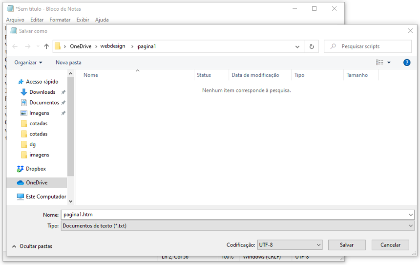

<head>
<link rel="stylesheet" href="scripts/style.css">
</head>

<h2 id="inicio">Construção de páginas com HTML</h2>

Este site contém os procedimentos para construirmos sites em HTML, foco da disciplina Fundamentos do Webdesign

A apostila está disponível no link: <a href="http://www.exatas.ufpr.br/portal/degraf_paulo/wp-content/uploads/sites/4/2014/09/tags001.pdf" target="_blank">apostila de Webdesign</a>

Os materiais usados estão indicados nos links dos tópicos das atividades.

  
Estruturas básicas: pág. 1-10

   
   

&#x1f4c3; Escolha de cores

	
Existem vários sites que mostram as escolhas de cores para usar em HTML. Vamos começar usando as cores com códigos HTML ou hexadecimais. Clique nos passos abaixo para ver como podemos escolher cores em 2 sites.

	  <ul class="slider">
		  <li>
			   <input type="radio" id="slide001" name="slide" checked>
			   <label for="slide001"></label>
			   
			   <figcaption>Acessando o site http://html-color-codes.info/Codigos-de-Cores-HTML/, você pode clicar em cores pré-definidas pelo site. Note que o código hexadecimal aparece logo abaixo das cores.</figcaption>
		   </li>
		   <li>
			   <input type="radio" id="slide002" name="slide">
			   <label for="slide002"></label>
			   
			   <figcaption>Logo abaixo, você encontra outra maneira de escolher cores neste mesmo site. Basta escolher o tom da cor e clicar sobre a cor escolhida.</figcaption>
		   </li>
		   <li>
			   <input type="radio" id="slide003" name="slide">
			   <label for="slide003"></label>
			   
			   <figcaption>Acessando o site https://color.adobe.com/pt/create/color-wheel/, você pode escolher as cores de forma análoga. Note que aparecem os códigos hexadecimais e RGB logo abaixo do disco de cores.</figcaption>
		   </li>
		   <li>
			   <input type="radio" id="slide004" name="slide">
			   <label for="slide004"></label>
			   
			   <figcaption>Outro site interessante é https://celke.com.br/artigo/tabela-de-cores-html-nome-hexadecimal-rgb, que além dos códigos RGB e hexadecimais mostra os nomes das cores usadas em HTML na primeira coluna da tabela.</figcaption>
		   </li>
		</ul>
		
  

  
   

&#x1f4c3; Texto para testar layouts

	
Muitas vezes, nosso foco é de testar somente o layout de um site. Podemos preenchê-lo com textos e listas usando o site mostrado nesta página. Clique nos passos abaixo para ver como produzir estes conteúdos.

	  <ul class="slider">
		  <li>
			   <input type="radio" id="slide005" name="slide" checked>
			   <label for="slide005"></label>
			   
			   <figcaption>Acessando o site http://br.lipsum.com/, você pode criar blocos de textos ou listas, usados para testarmos layouts.</figcaption>
		   </li>
		   <li>
			   <input type="radio" id="slide006" name="slide">
			   <label for="slide006"></label>
			   
			   <figcaption>Escolha a criação de 2 parágrafos para fazermos um teste. Copie e cole este texto produzido no programa Notepad (Bloco de Notas) do Windows.</figcaption>
		   </li>
		</ul>
		
  

  
<a href="#basico" class="topo">voltar ao topo</a>

  
  

&#x1f4c3; Texto para testar layouts

	
Vamos salvar nosso arquivo em uma pasta chamada webdesign.

	  <ul class="slider">
		  <li>
			   <input type="radio" id="slide007" name="slide" checked>
			   <label for="slide007"></label>
			   
			   <figcaption>Escolha a opção do Bloco de Notas Salvar como. Salve o arquivo como pagina1.htm. Uma dica importantíssima é de <b>não usar acentuação para nomear as páginas</b>!!!</figcaption>
		   </li>
		   <li>
			   <input type="radio" id="slide008" name="slide">
			   <label for="slide008"></label>
			   
			   <figcaption>É muito importante lembrar que a extensão do arquivo deve ser .htm ou .html. Abra o arquivo em um navegador de internet. Como não foram feitas as marcações dos parágrafos, vamos colocá-las no arquivo.</figcaption>
		   </li>
		   <li>
			   <input type="radio" id="slide009" name="slide">
			   <label for="slide009"></label>
			   
			   <figcaption>Antes de cada parágrafo, devemos colocar a tag &lt;p&gt;. Logo após o parágrafo, colocamos a tag de fechamento de parágrafo &lt;/p&gt;. Faça isso nos 2 parágrafos e visualize a página em um navegador.</figcaption>
		   </li>
		</ul>
		
  

  
  
<a href="#basico" class="topo">voltar ao topo</a>

  
  

&#x1f4c3; Layout básico de uma página

	
O layout básico de uma página HTML tem as seguintes partes: cabeçalho (head) e corpo da página (body). Vamos ver os elementos de cada parte:

	  <ul class="slider">
		  <li>
			   <input type="radio" id="slide010" name="slide" checked>
			   <label for="slide010"></label>
			   
			   <figcaption>O cabeçalho &lt;head&gt; contém informações autorais, título, codificação de caracteres, palavras-chave, scripts e referências externas. Nem todos os elementos desta tag são visíveis para os visitantes da página.</figcaption>
		   </li>
		   <li>
			   <input type="radio" id="slide011" name="slide">
			   <label for="slide011"></label>
			   
			   <figcaption>Dentro da tag do corpo da página &lt;body&gt; devemos colocar todos os contéudos visíveis para os visitantes.</figcaption>
		   </li>
		</ul>
		
  

  
  

&#x1f4c3; Fundo da página, alinhamentos

	
Vamos deixar todos os arquivos desta disciplina organizados. Podemos criar uma pasta chamada pagina1 para colocar todos os arquivos desta primeira página. É importante deixar os arquivos sempre organizados em pastas para usarmos as referências corretas na hora de montar o site.

	  <ul class="slider">
		  <li>
			   <input type="radio" id="slide012" name="slide" checked>
			   <label for="slide012"></label>
			   
			   <figcaption>Crie uma pasta dentro da pasta pagina1 para colocarmos as imagens. Podemos chamá-la de imagens.</figcaption>
		   </li>
		   <li>
			   <input type="radio" id="slide012a" name="slide">
			   <label for="slide012a"></label>
			   
			   <figcaption>Podemos escolher uma imagem para colocar no fundo da página (background). Escolha uma com largura maior do que 1000px, para cobrir todo o fundo da página, e salve na pasta que criamos /imagens.</figcaption>
		   </li>
		   <li>
			   <input type="radio" id="slide013" name="slide">
			   <label for="slide013"></label>
			   
			   <figcaption>Na tag do corpo da página, colocamos o caminho da imagem salva: &lt;body background="imagens/fundo.jpg"&gt;. Salve e veja a página renderizada em um navegador.</figcaption>
		   </li>
		   <li>
			   <input type="radio" id="slide014a" name="slide">
			   <label for="slide014a"></label>
			   
			   <figcaption>Os alinhamentos dos parágrafos podem ser definidos dentro de cada tag. Por exemplo, se você quiser deixar o primeiro parágrafo justificado, basta usar a tag &lt;p align="justify"&gt;.</figcaption>
		   </li>
		   <li>
			   <input type="radio" id="slide014" name="slide">
			   <label for="slide014"></label>
			   
			   <figcaption>Para destacar partes do texto, podemos mudar cores e tamanhos. Neste exemplo, dois trechos estão destacados com cores diferentes usando a tag &lt;font&gt;. Dentro desta tag, você muda cor, tamanho e família da fonte (face). Note que ela precisa de fechamento para o fim do destaque: &lt;/font&gt;</figcaption>
		   </li>
		   <li>
			   <input type="radio" id="slide015" name="slide">
			   <label for="slide015"></label>
			   
			   <figcaption>Se você quiser que a página toda tenha uma configuração específica de fonte, basta abrir a tag no começo do corpo da página, e fechá-la antes do fechamento da tag &lt;/body&gt;. No exemplo, foi colocada a fonte <b>Verdana</b> na página toda.</figcaption>
		   </li>
		</ul>
		
  

  
  

&#x1f4c3; Barra separadora e títulos

	
Podemos separar conteúdos usando uma tag simples de barra horizontal. Além disso, podemos destacar trechos do texto colocando negrito, itálico ou sublinhado. Títulos de seções também podem ser feitos com tags simples mostradas a seguir:

	  <ul class="slider">
		  <li>
			   <input type="radio" id="slide016" name="slide" checked>
			   <label for="slide016"></label>
			   
			   <figcaption>Usando a tag &lt;hr&gt;, podemos separar conteúdos na página. Essa tag não precisa ser fechada! Você pode configurar a altura, largura e cor. A largura em percentual é muito usada para deixar o site responsivo, ou seja, que abre em qualquer dispositivo.</figcaption>
		   </li>
		   <li>
			   <input type="radio" id="slide017" name="slide">
			   <label for="slide017"></label>
			   
			   <figcaption>Os títulos de seções podem ser definidos com as tags h1, h2, ..., h6. No exemplo, usamos o título com a tag &lt;h3&gt;. Quanto maior o número, menor o tamanho da fonte desta tag. Experimente mudar essa tag para h1 e h6.</figcaption>
		   </li>
		   <li>
			   <input type="radio" id="slide018" name="slide">
			   <label for="slide018"></label>
			   
			   <figcaption>A tag de negrito &lt;b&gt; foi usada neste exemplo para um trecho do texto. Não esqueça de fechá-la para que seu site apareça corretamente. Salve a página renderizada em um navegador.</figcaption>
		   </li>
		   <li>
			   <input type="radio" id="slide019" name="slide">
			   <label for="slide019"></label>
			   
			   <figcaption>Neste exemplo, foi usada uma tag por dentro da outra (aninhada). Um trecho foi destacado em negrito e itálico com as tags &lt;b&gt;&lt;i&gt;. Note que ambas precisam ser fechadas.</figcaption>
		   </li>
		   <li>
			   <input type="radio" id="slide020" name="slide">
			   <label for="slide020"></label>
			   
			   <figcaption>Se você quiser destacar um trecho do texto deixando-o riscado, basta usar a tag &lt;strike&gt;Sed sit amet pharetra leo.&lt;/strike&gt;. Essa tag é usada em sites para mostrar preços de produtos.</figcaption>
		   </li>
		</ul>
		
  

  
<a href="#basico" class="topo">voltar ao topo</a>

  
  

&#x1f4c3; Listas

	
Agora vamos criar uma outra página, dentro da pasta da disciplina, crie a pasta webdesign/pagina2/. Nesta página, vamos criar elementos de listas.

	  <ul class="slider">
		  <li>
			   <input type="radio" id="slide021" name="slide" checked>
			   <label for="slide021"></label>
			   
			   <figcaption>Dependendo do servidor usado para hospedar sua página, devemos modificar a codificação de caracteres charset de <b>UTF-8</b> para <b>ISO-8859-1</b>. Porém, a maioria dos servidores usa o <b>UTF-8</b>.</figcaption>
		   </li>
		   <li>
			   <input type="radio" id="slide022" name="slide">
			   <label for="slide022"></label>
			   
			   <figcaption>Usando a tag &lt;ul&gt;, podemos criar listas na página. Este exemplo mostra os marcadores circulares da lista.</figcaption>
		   </li>
		   <li>
			   <input type="radio" id="slide023" name="slide">
			   <label for="slide023"></label>
			   
			   <figcaption>Os itens das listas têm tags &lt;li&gt;. Note que cada tag de item precisa ser fechada, depois que você coloca o conteúdo. Para mudar de cor, coloque a tag de fonte aninhada na tag de item da lista. Mude as cores dos outros itens.</figcaption>
		   </li>
		   <li>
			   <input type="radio" id="slide024" name="slide">
			   <label for="slide024"></label>
			   
			   <figcaption>As listas ordenadas têm a mesma estrutura da lista norma, com a tag principal &lt;ol&gt;. Estas tags podem ser numéricas ou com letras. Neste exemplo, a lista com letras começa na 4a letra, ou seja, a letra <b>D</b>.</figcaption>
		   </li>
		</ul>
		
  

  
  
<a href="#basico" class="topo">voltar ao topo</a>

  
  

&#x1f4c3; Imagens

	
Agora vamos criar uma outra página, dentro da pasta da disciplina: crie a pasta webdesign/pagina3/. Nesta página, vamos inserir imagens, por isso, crie uma pasta webdesign/pagina3/imagens para colocarmos todas as imagens do site. Escolha 3 imagens e coloque nesta pasta. As extensões podem ser <b>png</b>, <b>jpg</b> ou <b>jpeg</b>. Preste atenção no atributo src, que contém o caminho da imagem.

	  <ul class="slider">
		  <li>
			   <input type="radio" id="slide025" name="slide" checked>
			   <label for="slide025"></label>
			   
			   <figcaption>A tag de imagem pode ser colocada no meio do texto usando o código &lt;img. Todos os atributos desta tag ficam dentro da &lt;img, não precisando ser fechada. A largura em percentual é importante para deixar o site responsivo.</figcaption>
		   </li>
		   <li>
			   <input type="radio" id="slide026" name="slide">
			   <label for="slide026"></label>
			   
			   <figcaption>Neste segundo exemplo, a imagem também está misturada com o texto, alinhada no meio do texto. Não recomenda-se o uso das imagens misturadas, pois o layout da página fica prejudicado.</figcaption>
		   </li>
		   <li>
			   <input type="radio" id="slide026a" name="slide">
			   <label for="slide026a"></label>
			   
			   <figcaption>Os atributos hspace e vspace criam margens horizontais e verticais em torno da imagem. São ótimas para não deixar outros elementos "grudados" nas imagens.</figcaption>
		   </li>
		   <li>
			   <input type="radio" id="slide027" name="slide">
			   <label for="slide027"></label>
			   
			   <figcaption>De uma forma bem mais organizada, podemos criar a tag-mãe &lt;figure&gt;, que contém a imagem, e logo depois uma tag de legenda &lt;figcaption&gt;. Neste caso, a tag de parágrafo centralizado foi usada para deixar a legenda alinhada com a imagem.</figcaption>
		   </li>
		</ul>
		
  

  
  

&#x1f4c3; Links

	
Usando a mesma pagina3.htm, vamos criar links. Os links podem ser criados em textos ou imagens.

	  <ul class="slider">
		  <li>
			   <input type="radio" id="slide028" name="slide" checked>
			   <label for="slide028"></label>
			   
			   <figcaption>A tag de link é &lt;a, e precisa de fechamento para você limitar o que o visitante clica para visitar uma outra página. Neste primeiro exemplo, o link está em um texto.</figcaption>
		   </li>
		   <li>
			   <input type="radio" id="slide029" name="slide">
			   <label for="slide029"></label>
			   
			   <figcaption>O atributo href é obrigatório, e indica o endereço da página que será visitada. O atributo target="_blank" indica que a página será aberta em outra aba.</figcaption>
		   </li>
		   <li>
			   <input type="radio" id="slide030" name="slide">
			   <label for="slide030"></label>
			   
			   <figcaption>Para inserir um link em uma imagem, basta deixar a tag &lt;a aninhada com a tag &lt;img, como mostra este segundo exemplo. Crie os links, salve a página e teste em um navegador.</figcaption>
		   </li>
		</ul>
		
  

  
<a href="#basico" class="topo">voltar ao topo</a>

  
  

&#x1f4c3; Áudios

	
Usando a mesma pagina3.htm, vamos inserir tags de áudios. Quando você salvar a página e visualizar em um navegador, a opção com controles fornece um "frame" para o vídeo que fica similar à seguinte imagem:

	

	  <ul class="slider">
		  <li>
			   <input type="radio" id="slide031" name="slide" checked>
			   <label for="slide031"></label>
			   
			   <figcaption>Na mesma pasta da nossapagina3, podemos criar uma subpasta chamada audios. Assim, a estrutura de arquivos da nossa página fica organizada.</figcaption>
		   </li>
		   <li>
			   <input type="radio" id="slide032" name="slide">
			   <label for="slide032"></label>
			   
			   <figcaption>Podemos usar a tag audio em uma única linha, com todas as propriedades definidas dentro desta tag. Esta maneira é comum quando apenas um arquivo é inserido. Os navegadores atuais suportam arquivos com extensão mp3.</figcaption>
		   </li>
		   <li>
			   <input type="radio" id="slide033" name="slide">
			   <label for="slide033"></label>
			   
			   <figcaption>Em navegadores muito antigos, por precaução, podemos definir os formatos mp3 e ogg. Esta tag é do tipo aninhada, com os caminhos (src) dos 2 arquivos definidos.</figcaption>
		   </li>
		   <li>
			   <input type="radio" id="slide034" name="slide">
			   <label for="slide034"></label>
			   
			   <figcaption>O atributo controls serve para mostrar os controles para o visitante interagir com o audio. O atributo autoplay define a reprodução automática do arquivo.</figcaption>
		   </li>
		   <li>
			   <input type="radio" id="slide034a" name="slide">
			   <label for="slide034a"></label>
			   
			   <figcaption>Você pode colocar links para áudios em uma página. Acessando o site open.spotify.com, você pode selecionar as músicas e copiar seus links.</figcaption>
		   </li>
		   <li>
			   <input type="radio" id="slide034b" name="slide">
			   <label for="slide034b"></label>
			   
			   <figcaption>Você pode criar também os links para álbuns, da mesma maneira mostrada para músicas. Na página HTML usamos a tag de link &lt;a para os álbuns.</figcaption>
		   </li>
		   <li>
			   <input type="radio" id="slide034c" name="slide">
			   <label for="slide034c"></label>
			   
			   <figcaption>Usando a tag de link &lt;a, você insere os links de músicas em sua página.</figcaption>
		   </li>
		</ul>
		
  

  
  

&#x1f4c3; Vídeos

	
Vamos criar uma nova pasta chamada webdesign/pagina4. Dentro desta pasta, crie as subpastas de imagens e de videos. Quando você salvar a página e visualizar em um navegador, a opção com controles fornece uma imagem similar à esta:

	

	  <ul class="slider">
		  <li>
			   <input type="radio" id="slide035" name="slide" checked>
			   <label for="slide035"></label>
			   
			   <figcaption>Escolha um arquivo de imagem (pode ser no google) para colocar como um banner da nossa pagina4.htm. Cuidado com a extensão da imagem (jpg, png, jpeg) para indicar o caminho no código HTML.</figcaption>
		   </li>
		   <li>
			   <input type="radio" id="slide036" name="slide">
			   <label for="slide036"></label>
			   
			   <figcaption>Podemos usar a tag video em uma única linha, com todas as propriedades definidas dentro desta tag. Esta maneira é comum quando apenas um arquivo é inserido. A maioria dos navegadores atuais suportam arquivos com extensões mp4, webm e ogv.</figcaption>
		   </li>
		   <li>
			   <input type="radio" id="slide037" name="slide">
			   <label for="slide037"></label>
			   
			   <figcaption>Por precaução, podemos definir os formatos mp4, webm e ogv dentro de uma tag de vídeo. Esta tag é do tipo aninhada, com os caminhos (src) dos 3 arquivos de vídeo.</figcaption>
		   </li>
		   <li>
			   <input type="radio" id="slide038" name="slide">
			   <label for="slide038"></label>
			   
			   <figcaption>O atributo controls serve para mostrar os controles para o visitante interagir com o vídeo. O atributo autoplay define a reprodução automática do vídeo.</figcaption>
		   </li>
		   <li>
			   <input type="radio" id="slide039" name="slide">
			   <label for="slide039"></label>
			   
			   <figcaption>Quando inserimos vídeos em uma página, é importante definirmos a altura height e a largura width do vídeo. Estas medidas podem ser indicadas em % ou pixels.</figcaption>
		   </li>
		</ul>
		
  

  
  

&#x1f4c3; Vídeos do Youtube

	
Para inserir um vídeo do Youtube, usamos a tag iframe. Vamos usar a mesma pagina4.htm para inserir esta tag de vídeo.

	  <ul class="slider">
		  <li>
			   <input type="radio" id="slide040" name="slide" checked>
			   <label for="slide040"></label>
			   
			   <figcaption>Na página do vídeo escolhido, clique em compartilhar, no link que fica logo abaixo da janela do vídeo.</figcaption>
		   </li>
		   <li>
			   <input type="radio" id="slide041" name="slide">
			   <label for="slide041"></label>
			   
			   <figcaption>Selecione a opção incorporar.</figcaption>
		   </li>
		   <li>
			   <input type="radio" id="slide042" name="slide">
			   <label for="slide042"></label>
			   
			   <figcaption>Agora é só copiar a tag iframe criada. Note que aparecem as medidas que já usamos na tag de video.</figcaption>
		   </li>
		   <li>
			   <input type="radio" id="slide043" name="slide">
			   <label for="slide043"></label>
			   
			   <figcaption>Cole a tag criada na posição da página que você quer mostrar o vídeo. O atributo frameborder tem padrão com valor <b>0</b>. Se você quiser uma borda, basta digitar qualquer valor diferente de <b>0</b> neste atributo.</figcaption>
		   </li>
		</ul>
		
  

  
  

&#x1f4c3; Detalhes da Atividade

	
Usando todas as tags que vimos até agora, vamos montar uma página htm com os elementos descritos abaixo. Crie uma pasta chamada webdesign/atividade1 para inserir os arquivos desta atividade. O arquivo principal HTML será chamado de index.htm.

	  <ul class="slider">
		  <li>
			   <input type="radio" id="slide044" name="slide" checked>
			   <label for="slide044"></label>
			   
			   <figcaption>Na parte superior da página, que terá um formato tipo blog, coloque uma imagem como banner, textos de informações e curiosidades sobre a banda ou o cantor escolhido.</figcaption>
		   </li>
		   <li>
			   <input type="radio" id="slide045" name="slide">
			   <label for="slide045"></label>
			   
			   <figcaption>Insira imagens, uma imagem de fundo background. Lembre-se de colocar as medidas de altura e largura da imagem na página. Use as tags de linhas horizontais &lt;hr&gt; para separar conteúdos.</figcaption>
		   </li>
		   <li>
			   <input type="radio" id="slide046" name="slide">
			   <label for="slide046"></label>
			   
			   <figcaption>Na parte inferior da página, crie links para áudios e vídeos da banda ou do cantor escolhido. Use links do Spotify ou Youtube. Lembre-se de usar as medidas para criar os iframes dos vídeos.</figcaption>
		   </li>
		   <li>
			   <input type="radio" id="slide047" name="slide">
			   <label for="slide047"></label>
			   
			   <figcaption>No rodapé, você pode colocar informações de copyright com seu nome, usando o código do símbolo &copy;: &amp;copy;.</figcaption>
		   </li>
		</ul>
		
  

  
<a href="#basico" class="topo">voltar ao topo</a>

  
  

&#x1f4c3; Tabelas

	
Crie uma pasta chamada webdesign/pagina5 para inserir os arquivos da nossa próxima página, com tabelas. O arquivo principal HTML será chamado de index.htm.

	  <ul class="slider">
		  <li>
			   <input type="radio" id="slide048" name="slide" checked>
			   <label for="slide048"></label>
			   
			   <figcaption>Usamos table como a tag-mãe das células da tabela. Logo, vamos "aninhar" as tags das células da tabela dentro da tag table.</figcaption>
		   </li>
		   <li>
			   <input type="radio" id="slide049" name="slide">
			   <label for="slide049"></label>
			   
			   <figcaption>Toda vez que vamos criar uma linha de tabela, usamos a tag &lt;tr&gt;. Esta tag, por sua vez, terá as tags das células das colunas &lt;td&gt; ou &lt;th&gt; "aninhadas". Dentro destas tags colocamos conteúdos de textos ou imagens.</figcaption>
		   </li>
		   <li>
			   <input type="radio" id="slide050" name="slide">
			   <label for="slide050"></label>
			   
			   <figcaption>As tags &lt;th&gt; podem ser usadas na primeira linha de uma tabela, como linha de títulos. Os textos, podemos digitar diretamente sem tags, como mostra o exemplo. Para colocar imagens, colocamos a tag &lt;img dentro da tag &lt;td.</figcaption>
		   </li>
		   <li>
			   <input type="radio" id="slide051" name="slide">
			   <label for="slide051"></label>
			   
			   <figcaption>Os atributos border e bordercolor definem a espessura e a cor da borda de cada célula, respectivamente. O atributo bgcolor pode ser usado para mudar a cor de fundo de uma célula ou de uma linha. No exemplo, o atributo deixa a primeira linha com fundo verde.</figcaption>
		   </li>
		   <li>
			   <input type="radio" id="slide052" name="slide">
			   <label for="slide052"></label>
			   
			   <figcaption>Os atributos cellpadding e cellspacing são as margens interna e externa de cada célula, respectivamente.</figcaption>
		   </li>
		   <li>
			   <input type="radio" id="slide053" name="slide">
			   <label for="slide053"></label>
			   
			   <figcaption>Esta é a função da criação de margens em tabelas. Geralmente usamos o padrão do HTML, com cellspacing="0".</figcaption>
		   </li>
		</ul>
		
  

  
  
  
<a href="#basico" class="topo">voltar ao topo</a>

  
  
<a href="#basico" class="topo">voltar ao topo</a>

  
  
<a href="#basico" class="topo">voltar ao topo</a>

  
  
<a href="#basico" class="topo">voltar ao topo</a>

CSS: Cascading Style Sheets

	
página 11...

 &#x1f4bb; &#x1f4c2;

<b>site desenvolvido por:</b>
 

Paulo Henrique Siqueira
  

<b>contato:</b> paulohscwb@gmail.com 
 

 <b>Referências:</b>

