<link rel="stylesheet" href="scripts/style.css">

<h2 id="inicio">Construção de páginas com HTML</h2>

Esta página site contém os procedimentos e dicas para construção de páginas e sites em HTML, foco da disciplina Fundamentos do Webdesign

A apostila está disponível no link: <a href="basico/tags001.pdf" target="_blank">apostila de Webdesign</a>

Os materiais usados estão indicados nos links dos tópicos das atividades.

  
1. Estruturas básicas

	
Material da pág. 1 até a pág. 10

   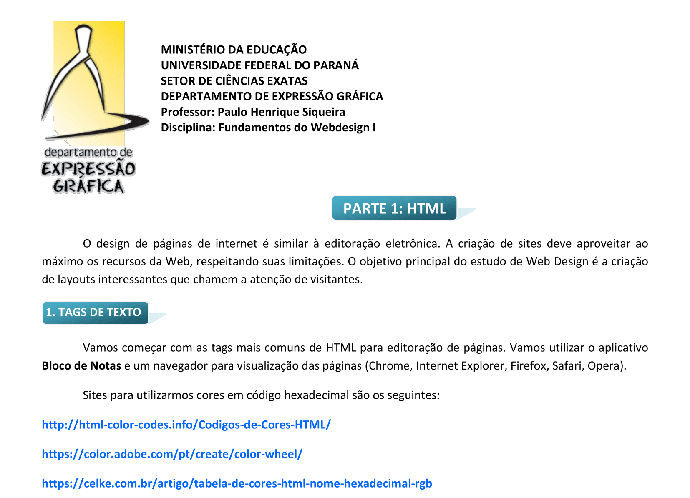
   

&#x1f4c3; Escolha de cores

	
Existem vários sites que mostram as escolhas de cores para usar em HTML. Vamos começar usando as cores com códigos HTML ou hexadecimais. Clique nos passos abaixo para ver como podemos escolher as cores.

	  <ul class="slider">
		  <li>
			   <input type="radio" id="001" name="sl" checked>
			   <label for="001"></label>
			   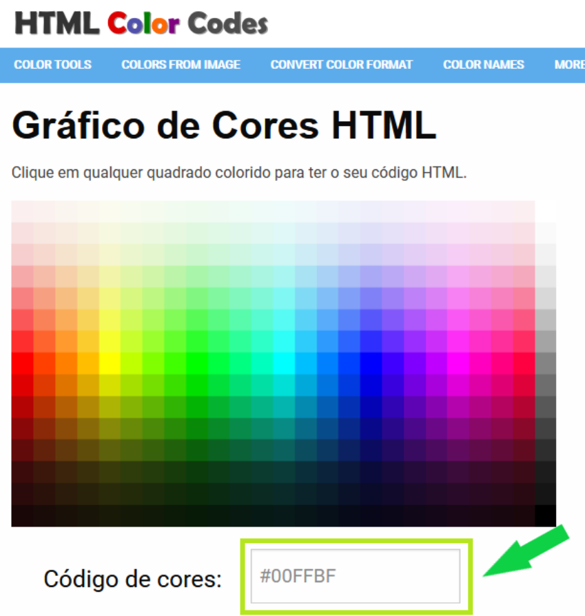
			   <figcaption>Acessando o site <a href="http://html-color-codes.info/Codigos-de-Cores-HTML/" target="_blank">http://html-color-codes.info/Codigos-de-Cores-HTML/</a>, você pode clicar em cores pré-definidas. Note que o código hexadecimal aparece logo abaixo das cores.</figcaption>
		   </li>
		   <li>
			   <input type="radio" id="002" name="sl">
			   <label for="002"></label>
			   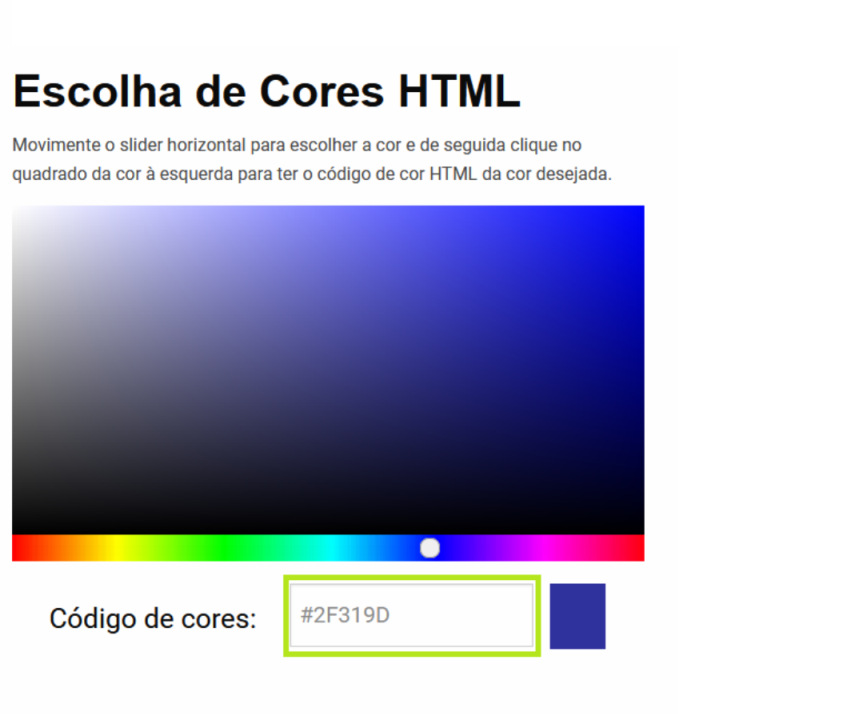
			   <figcaption>Logo abaixo, você encontra outra maneira de escolher cores neste mesmo site. Basta escolher o tom da cor e clicar sobre a cor escolhida.</figcaption>
		   </li>
		   <li>
			   <input type="radio" id="003" name="sl">
			   <label for="003"></label>
			   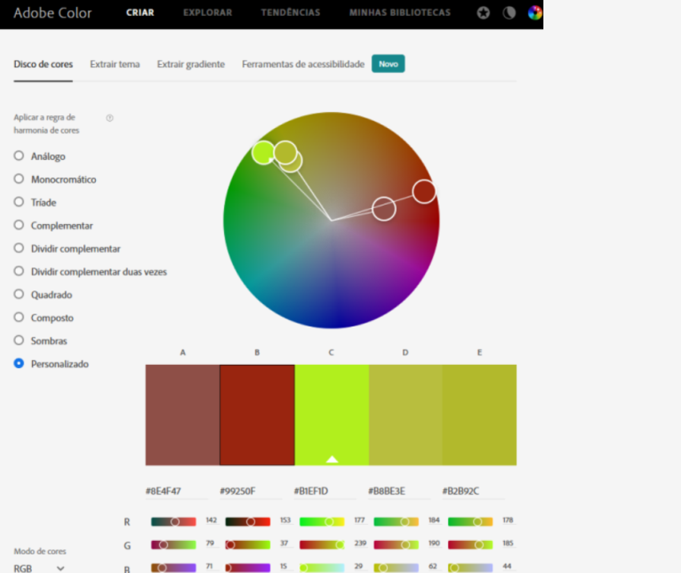
			   <figcaption>Acessando o site <a href="https://color.adobe.com/pt/create/color-wheel/" target="_blank">https://color.adobe.com/pt/create/color-wheel/</a>, você pode escolher as cores de forma análoga. Note que aparecem os códigos hexadecimais e RGB logo abaixo do disco de cores.</figcaption>
		   </li>
		   <li>
			   <input type="radio" id="004" name="sl">
			   <label for="004"></label>
			   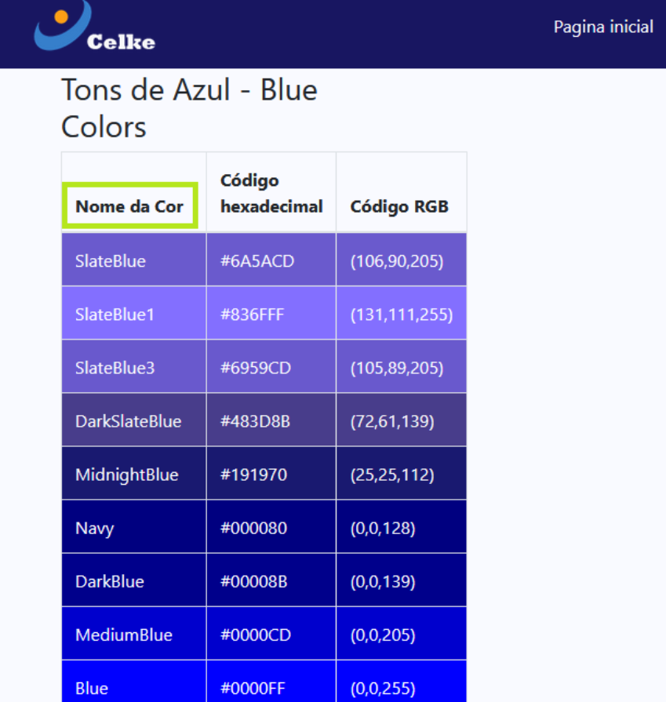
			   <figcaption>Outro site interessante é <a href="https://celke.com.br/artigo/tabela-de-cores-html-nome-hexadecimal-rgb" target="_blank">https://celke.com.br/artigo/tabela-de-cores-html-nome-hexadecimal-rgb</a>, que além dos códigos RGB e hexadecimais mostra os nomes das cores usadas em HTML na primeira coluna da tabela. 
			   </figcaption>
		   </li>
		   <li>
			   <input type="radio" id="004a" name="sl">
			   <label for="004a"></label>
			   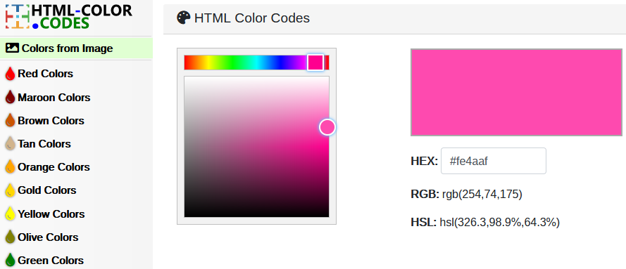
			   <figcaption>O site <a href="https://html-color.codes" target="_blank">https://html-color.codes</a> também é uma ótima opção para escolhermos cores para nossas páginas. As cores ficam separadas por tonalidades.
			   </figcaption>
		   </li>
		</ul>
		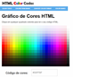
  

  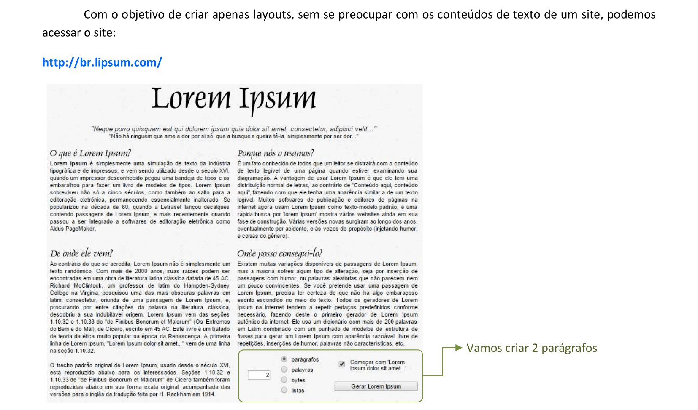
   

&#x1f4c3; Texto para testar layouts

	
Muitas vezes, nosso foco é de testar somente o layout de uma página. Podemos preenchê-la com textos e listas usando o site mostrado a seguir. Clique nos passos abaixo para ver como produzir estes conteúdos.

	  <ul class="slider">
		  <li>
			   <input type="radio" id="005" name="sl">
			   <label for="005"></label>
			   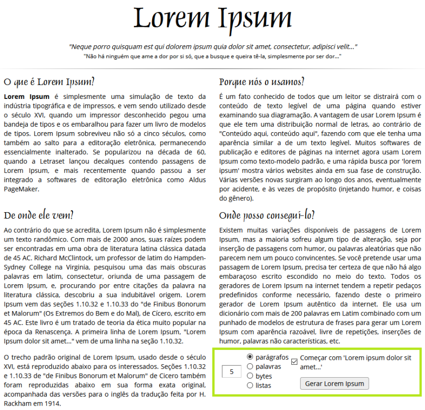
			   <figcaption>Acessando o site <a href="http://br.lipsum.com/" target="_blank">http://br.lipsum.com/</a>, você pode criar blocos de textos ou listas, usados para testarmos layouts.</figcaption>
		   </li>
		   <li>
			   <input type="radio" id="006" name="sl">
			   <label for="006"></label>
			   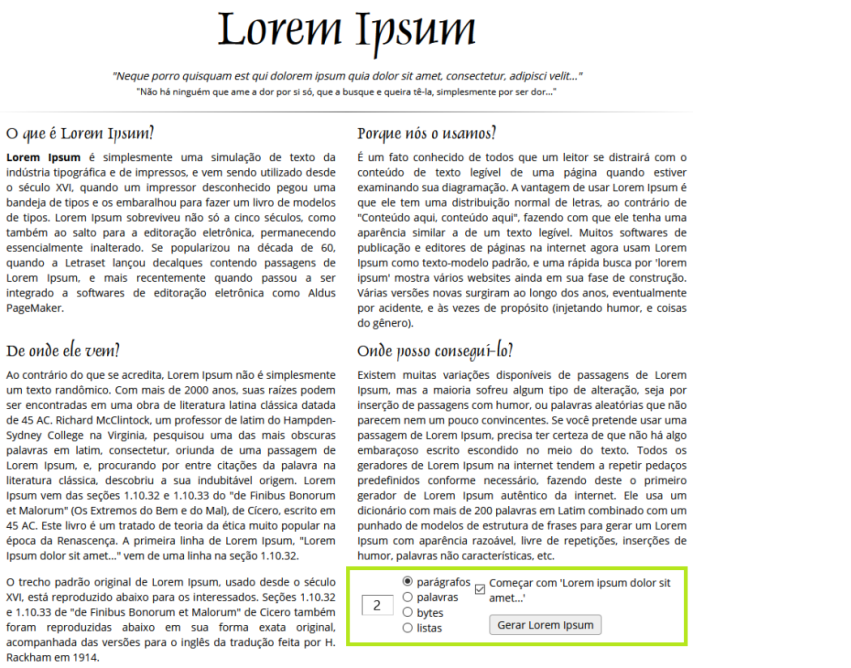
			   <figcaption>Escolha a criação de 2 parágrafos para fazermos um teste. Copie e cole este texto produzido no programa <code>Notepad</code> (<code>Bloco de Notas</code>) do Windows.</figcaption>
		   </li>
		</ul>
		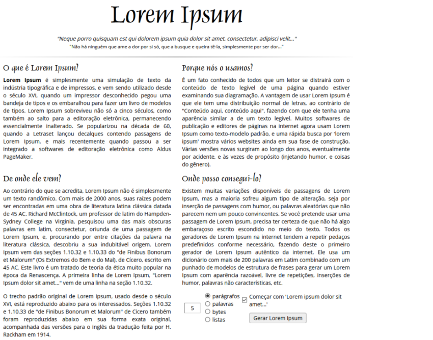
  

  
<a href="#basico" class="topo">voltar ao topo</a>

  

		<iframe width="100%" src="https://www.youtube.com/embed/WG1MYwgWnCE" frameborder="0" allow="accelerometer; clipboard-write; encrypted-media; gyroscope; picture-in-picture" allowfullscreen></iframe>
  

  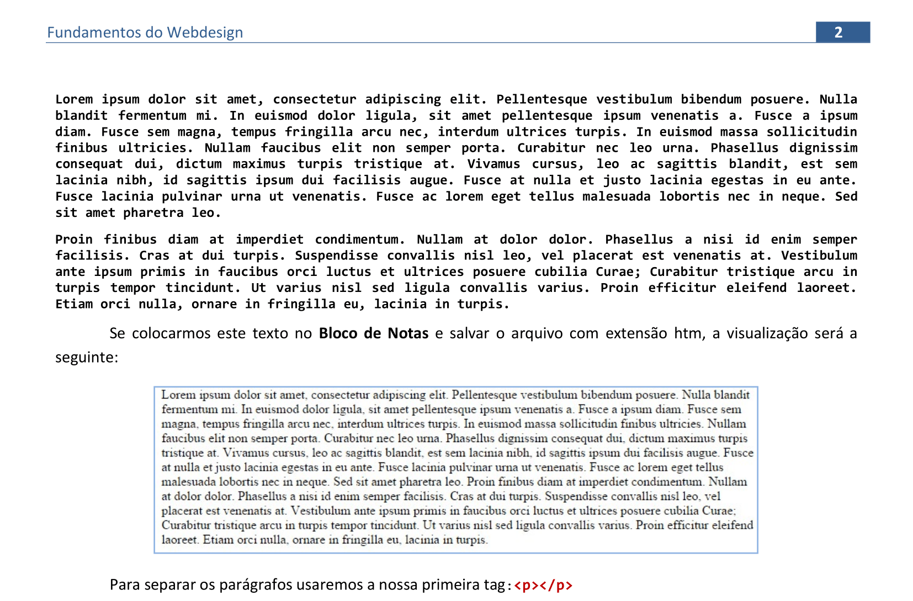
  

&#x1f4c3; Texto para testar layouts

	
Vamos salvar nosso arquivo em uma pasta chamada <code>webdesign</code>.

	  <ul class="slider">
		  <li>
			   <input type="radio" id="007" name="sl">
			   <label for="007"></label>
			   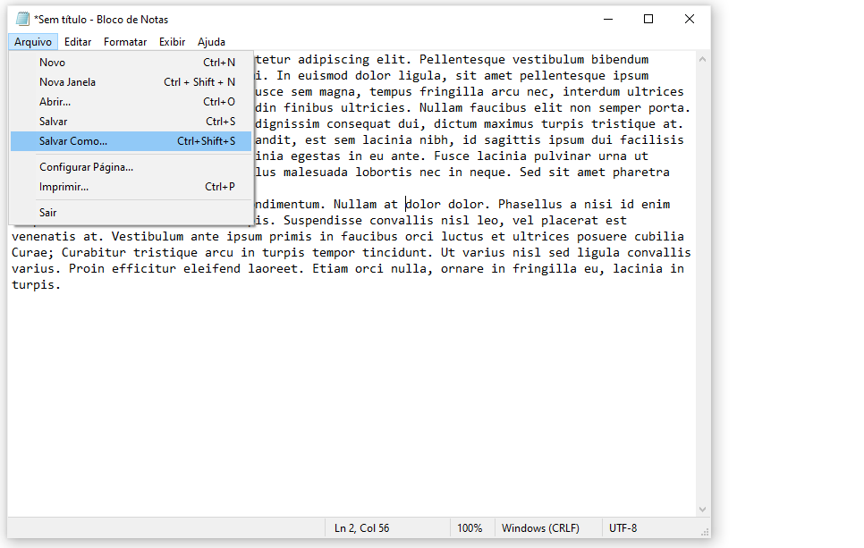
			   <figcaption>Escolha a opção do Bloco de Notas <code>Salvar como</code>. Salve o arquivo como <code>pagina1.htm</code>. Uma dica importantíssima é de <b>não usar acentuação para nomear as páginas</b>!!!</figcaption>
		   </li>
		   <li>
			   <input type="radio" id="008" name="sl">
			   <label for="008"></label>
			   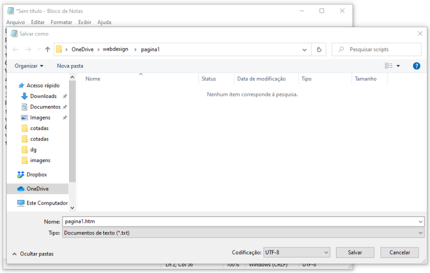
			   <figcaption>É muito importante lembrar que a extensão do arquivo deve ser <code>.htm</code> ou <code>.html</code>. Abra o arquivo em um navegador de internet. Como não foram feitas as marcações dos parágrafos, vamos colocá-las no arquivo.</figcaption>
		   </li>
		   <li>
			   <input type="radio" id="009" name="sl">
			   <label for="009"></label>
			   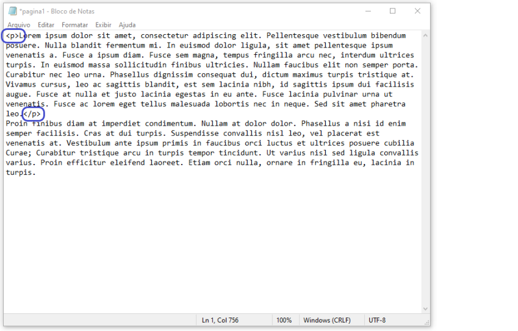
			   <figcaption>Antes de cada parágrafo, devemos colocar a tag <code>&lt;p&gt;</code>. Logo após o parágrafo, colocamos a tag de fechamento de parágrafo <code>&lt;/p&gt;</code>. Faça isso nos 2 parágrafos e visualize a página em um navegador.</figcaption>
		   </li>
		</ul>
		
  

  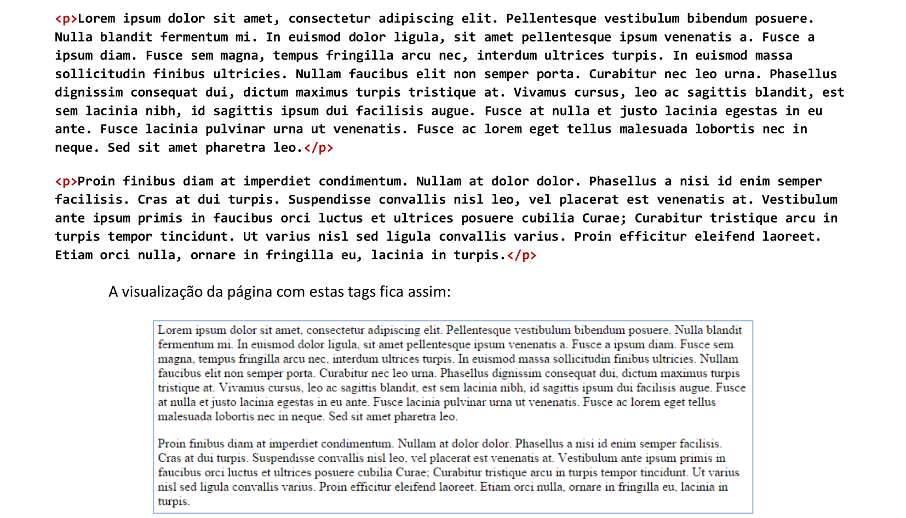
  
<a href="#basico" class="topo">voltar ao topo</a>

  

		<iframe width="100%" src="https://www.youtube.com/embed/gWhH6yQpme4" frameborder="0" allow="accelerometer; clipboard-write; encrypted-media; gyroscope; picture-in-picture" allowfullscreen></iframe>
  

  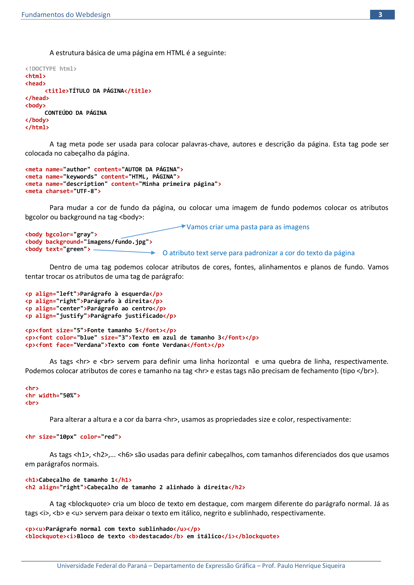
  

&#x1f4c3; Layout básico de uma página

	
O layout básico de uma página HTML tem as seguintes partes: cabeçalho (<code>head</code>) e corpo da página (<code>body</code>). Vamos ver os elementos de cada parte:

	  <ul class="slider">
		  <li>
			   <input type="radio" id="010" name="sl">
			   <label for="010"></label>
			   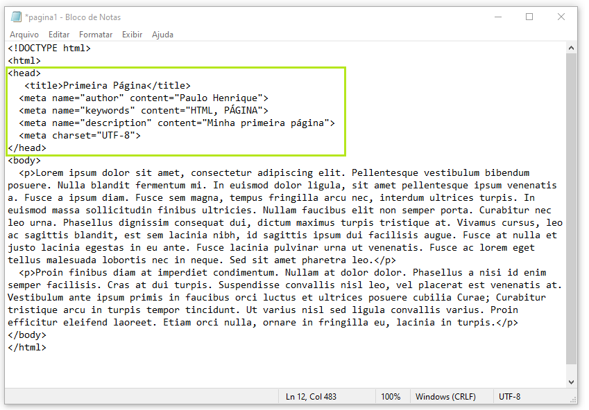
			   <figcaption>O cabeçalho <code>&lt;head&gt;</code> contém informações autorais, título, codificação de caracteres, palavras-chave, scripts e referências externas. Nem todos os elementos desta tag são visíveis para os visitantes da página.</figcaption>
		   </li>
		   <li>
			   <input type="radio" id="011" name="sl">
			   <label for="011"></label>
			   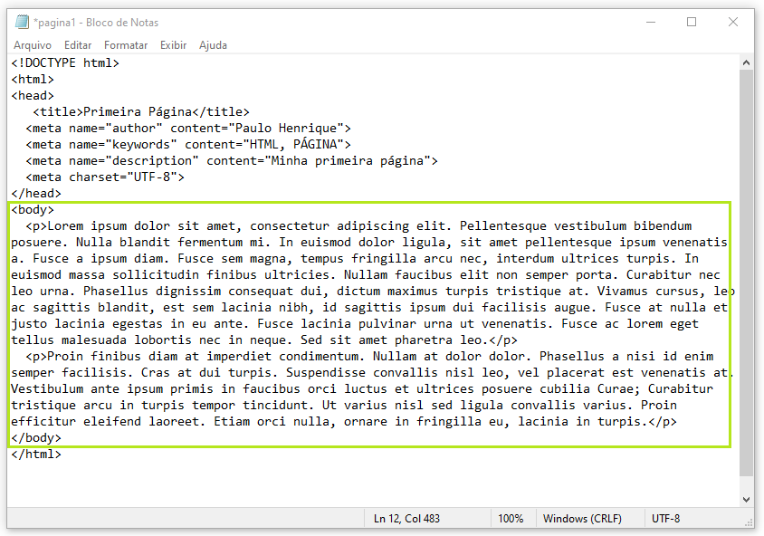
			   <figcaption>Dentro da tag do corpo da página <code>&lt;body&gt;</code> devemos colocar todos os contéudos visíveis para os visitantes.</figcaption>
		   </li>
		   <li>
			   <input type="radio" id="011a" name="sl">
			   <label for="011a"></label>
			   <figcaption>
<button type="button" onclick="copyEvent('cod48', 'cd48')" onmouseout="outFunc('cd48')">Copiar o código</button>
Código estrutural de uma página HTML:
<pre><code id="cod48">&lt;!DOCTYPE html&gt;
<a alt="tag de início da programação html">&lt;html&gt;</a>
<a alt="tag de cabeçalho">&lt;head&gt;</a> 
	<a alt="tag de título da página">&lt;title&gt;</a>TÍTULO DA PÁGINA&lt;/title&gt;
	<a alt="tag para o nome do autor">&lt;meta name="author"</a> content="AUTOR DA PÁGINA"&gt;
	<a alt="tag de palavras-chave">&lt;meta name="keywords"</a> content="HTML, PÁGINA"&gt;
	<a alt="tag de descrição da página">&lt;meta name="description"</a> content="Minha primeira página"&gt;
	<a alt="tag de codificação de caracteres da página&#10;É obrigatória e serve para mostrar a acentuação correta&#10;UTF-8 | ISO-8859-1">&lt;meta charset="UTF-8"&gt;</a>
&lt;/head&gt; 
&lt;body <a alt="Cor de fundo do corpo da página (body): bgcolor&#10;rgb | hexadecimal | cores nativas HTML">bgcolor="blue"</a>&gt;
	&lt;p&gt;<a alt="Insira o conteúdo separado por parágrafos com tags &lt;p&gt;">CONTEÚDO DA PÁGINA: primeiro parágrafo</a>&lt;/p&gt;
	&lt;p&gt;CONTEÚDO DA PÁGINA: segundo parágrafo&lt;/p&gt;
&lt;/body&gt; 
&lt;/html&gt;</code></pre>
</figcaption>
		   </li>
		</ul>
		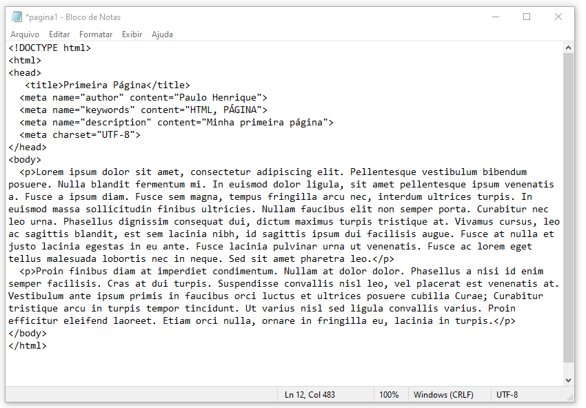
  

  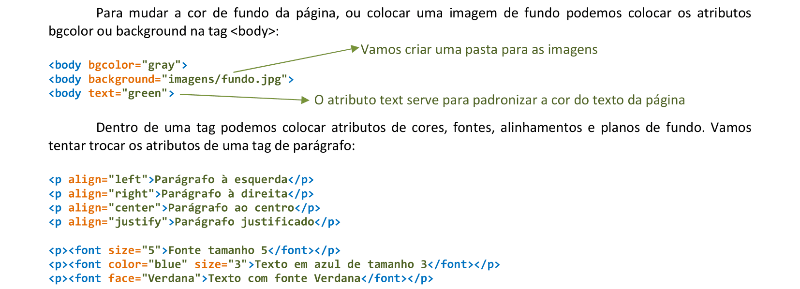
  

&#x1f4c3; Fundo da página, alinhamentos

	
Vamos deixar todos os arquivos desta disciplina organizados. Podemos criar uma pasta chamada <code>pagina1</code> para colocar todos os arquivos desta primeira página. É importante deixar os arquivos sempre organizados em pastas para usarmos as referências corretas na hora de construir sites.

	  <ul class="slider">
		  <li>
			   <input type="radio" id="012" name="sl">
			   <label for="012"></label>
			   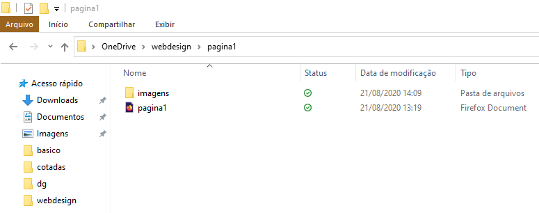
			   <figcaption>Crie uma pasta dentro da pasta <code>pagina1</code> para colocarmos as imagens. Podemos chamá-la de <code>imagens</code>.</figcaption>
		   </li>
		   <li>
			   <input type="radio" id="012a" name="sl">
			   <label for="012a"></label>
			   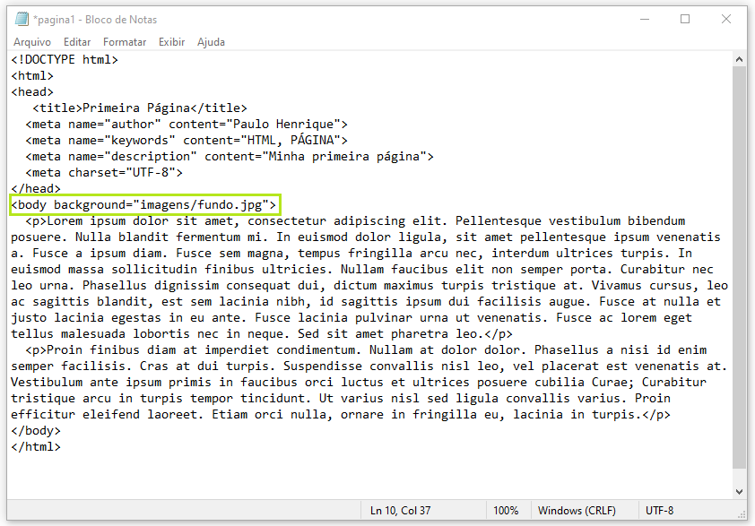
			   <figcaption>Podemos escolher uma imagem para colocar no fundo da página (<code>background</code>). Escolha uma imagem com largura maior do que 1000px, para cobrir todo o fundo da página, e salve na pasta que criamos <code>/imagens</code>.</figcaption>
		   </li>
		   <li>
			   <input type="radio" id="013" name="sl">
			   <label for="013"></label>
			   
			   <figcaption>Na tag do corpo da página, colocamos o caminho da imagem salva: <code>&lt;body background="imagens/fundo.jpg"&gt;</code>. Salve e veja a página renderizada em um navegador.</figcaption>
		   </li>
		   <li>
			   <input type="radio" id="014a" name="sl">
			   <label for="014a"></label>
			   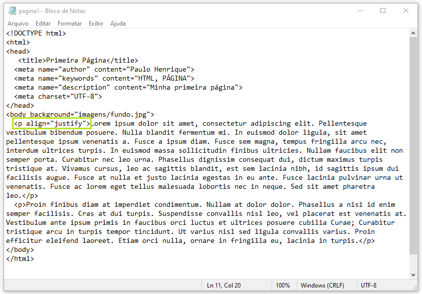
			   <figcaption>Os alinhamentos dos parágrafos podem ser definidos dentro de cada tag. Por exemplo, se você quiser deixar o primeiro parágrafo justificado, basta usar a tag <code>&lt;p align="justify"&gt;</code>.</figcaption>
		   </li>
		   <li>
			   <input type="radio" id="014" name="sl">
			   <label for="014"></label>
			   
			   <figcaption>Para destacar partes do texto, podemos mudar cores e tamanhos. Neste exemplo, dois trechos estão destacados com cores diferentes usando a tag <code>&lt;font&gt;</code>. Dentro desta tag, você muda cor, tamanho e família da fonte (face). Note que ela precisa de fechamento para o fim do destaque: <code>&lt;/font&gt;</code></figcaption>
		   </li>
		   <li>
			   <input type="radio" id="015" name="sl">
			   <label for="015"></label>
			   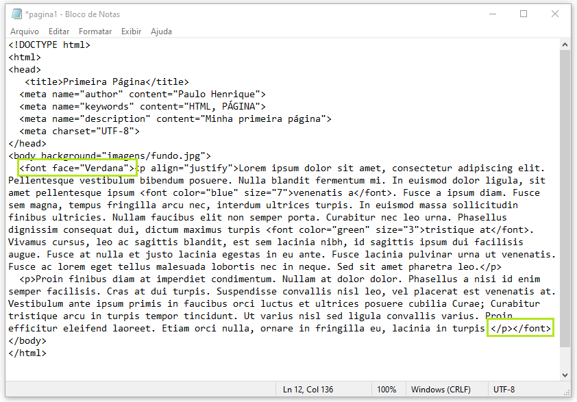
			   <figcaption>Se você quiser que a página toda tenha uma configuração específica de fonte, basta abrir a tag no começo do corpo da página, e fechá-la antes do fechamento da tag <code>&lt;/body&gt;</code>. No exemplo, foi colocada a fonte <b>Verdana</b> na página toda.</figcaption>
		   </li>
		   <li>
			   <input type="radio" id="015a" name="sl">
			   <label for="015a"></label>
			   <figcaption>
<button type="button" onclick="copyEvent('cod49', 'cd49')" onmouseout="outFunc('cd49')">Copiar o código</button>
Código estrutural de uma página HTML:
<pre><code id="cod49">&lt;!DOCTYPE html&gt;
&lt;html&gt;
&lt;head&gt;
   &lt;title&gt;Primeira Página&lt;/title&gt;
  &lt;meta name="author" content="Paulo Henrique"&gt;
  &lt;meta name="keywords" content="HTML, PÁGINA"&gt;
  &lt;meta name="description" content="Minha primeira página"&gt;
  &lt;meta charset="UTF-8"&gt;
&lt;/head&gt;
<a alt="imagem de fundo da página, localizada na pasta imagens">&lt;body background="imagens/fundo.jpg"&gt;</a>
  <a alt="definição de fonte da página, no início da programação">&lt;font face="Verdana"&gt;</a><a alt="alinhamento de parágrafo&#10;justify | left | right | center">&lt;p align="justify"&gt;</a>Lorem ipsum dolor sit amet, consectetur adipiscing elit. 
  Pellentesque vestibulum bibendum posuere. Nulla blandit fermentum mi. In euismod dolor ligula, sit amet 
  pellentesque ipsum <a alt="destaque de trecho com fonte azul e tamanho 7">&lt;font color="blue" size="7"&gt;venenatis a&lt;/font&gt;</a>. Fusce a ipsum diam. Fusce sem 
  magna, tempus fringilla arcu nec, interdum ultrices turpis. In euismod massa sollicitudin finibus 
  ultricies. Nullam faucibus elit non semper porta. Curabitur nec leo urna. Phasellus dignissim consequat 
  dui, dictum maximus turpis <a alt="destaque de trecho com fonte verde e tamanho 3">&lt;font color="green" size="3"&gt;tristique at&lt;/font&gt;</a>. Vivamus cursus, leo ac 
  sagittis blandit, est sem lacinia nibh, id sagittis ipsum dui facilisis augue. Fusce at nulla et justo 
  lacinia egestas in eu ante. Fusce lacinia pulvinar urna ut venenatis. Fusce ac lorem eget tellus 
  malesuada lobortis nec in neque. Sed sit amet pharetra leo.&lt;/p&gt;
  &lt;p&gt;Proin finibus diam at imperdiet condimentum. Nullam at dolor dolor. Phasellus a nisi id enim
  semper facilisis. Cras at dui turpis. Suspendisse convallis nisl leo, vel placerat est venenatis at. 
  Vestibulum ante ipsum primis in faucibus orci luctus et ultrices posuere cubilia Curae; Curabitur tristique 
  arcu in turpis tempor tincidunt. Ut varius nisl sed ligula convallis varius. Proin efficitur 
  eleifend laoreet. Etiam orci nulla, ornare in fringilla eu, lacinia in turpis.<a alt="final da tag de fonte">&lt;/p&gt;&lt;/font&gt;</a>
&lt;/body&gt;
&lt;/html&gt;</code></pre>
</figcaption>
		   </li>
		</ul>
		
  

  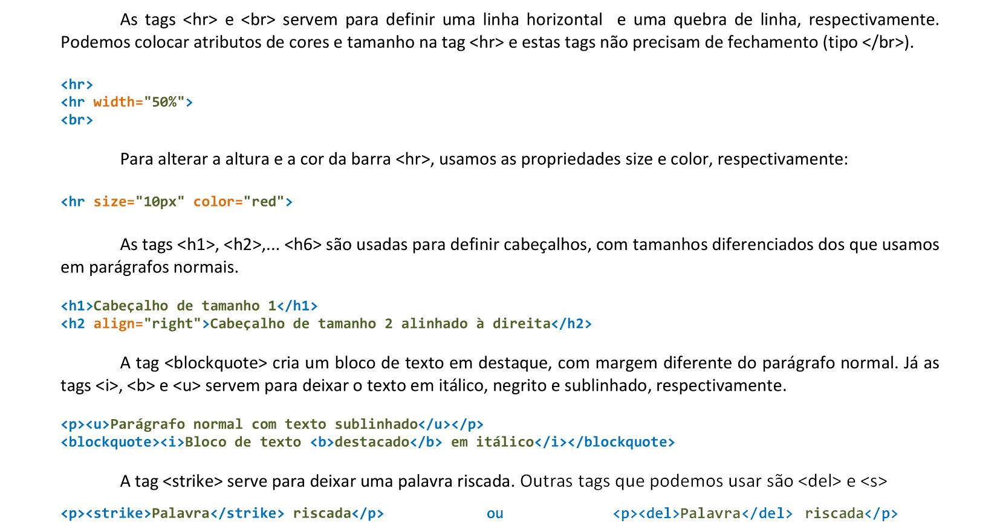
  

&#x1f4c3; Barra separadora e títulos

	
Podemos separar conteúdos usando uma tag simples de barra horizontal. Além disso, podemos destacar trechos do texto colocando negrito, itálico ou sublinhado. Títulos de seções também podem ser feitos com tags simples mostradas a seguir:

	  <ul class="slider">
		  <li>
			   <input type="radio" id="016" name="sl">
			   <label for="016"></label>
			   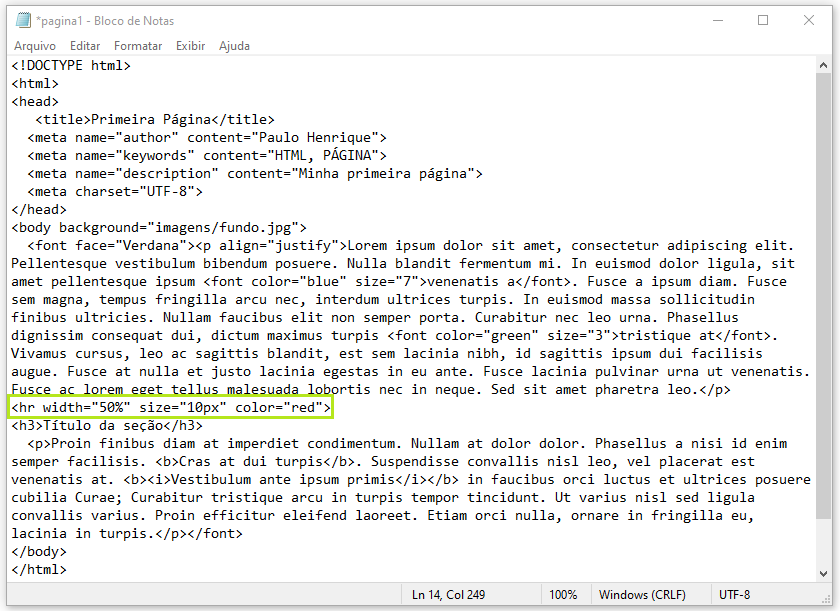
			   <figcaption>Usando a tag <code>&lt;hr&gt;</code>, podemos separar conteúdos na página. Essa tag não precisa ser fechada! Você pode configurar a altura, largura e cor. A largura em percentual é muito usada para deixar o site responsivo, ou seja, que abre em qualquer dispositivo com poucas distorções de tamanhos.</figcaption>
		   </li>
		   <li>
			   <input type="radio" id="017" name="sl">
			   <label for="017"></label>
			   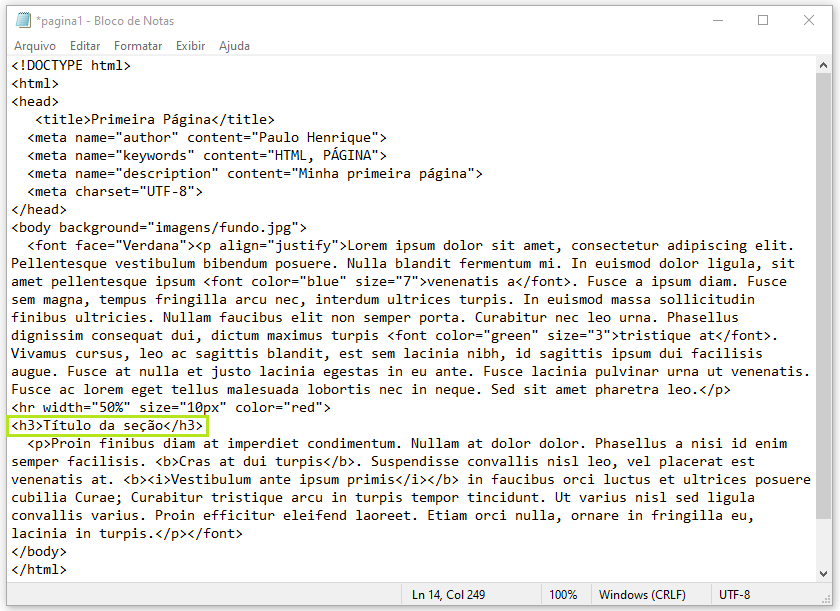
			   <figcaption>Os títulos de seções podem ser definidos com as tags h1, h2, ..., h6. No exemplo, usamos o título com a tag <code>&lt;h3&gt;</code>. Quanto maior o número, menor o tamanho da fonte desta tag. Experimente mudar essa tag para h1 e h6.</figcaption>
		   </li>
		   <li>
			   <input type="radio" id="018" name="sl">
			   <label for="018"></label>
			   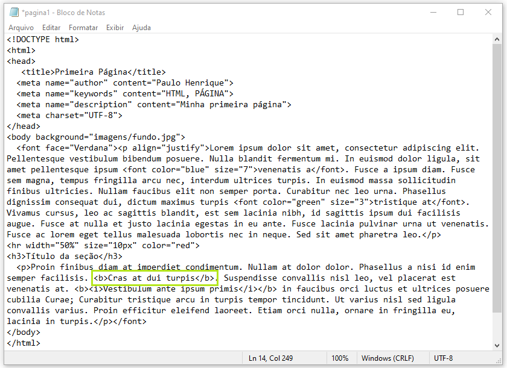
			   <figcaption>A tag de negrito <code>&lt;b&gt;</code> foi usada neste exemplo para um trecho do texto. Não esqueça de fechá-la para que os conteúdos de sua página HTML apareçam corretamente. Salve a página renderizada em um navegador.</figcaption>
		   </li>
		   <li>
			   <input type="radio" id="019" name="sl">
			   <label for="019"></label>
			   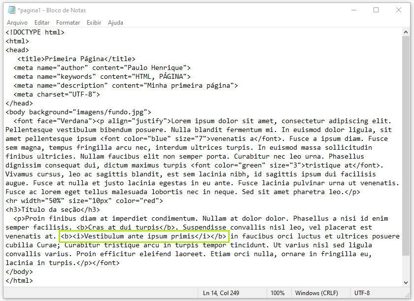
			   <figcaption>Neste exemplo, foi usada uma tag por dentro da outra (aninhada). Um trecho foi destacado em negrito e itálico com as tags <code>&lt;b&gt;&lt;i&gt;</code>. Note que ambas precisam ser fechadas.</figcaption>
		   </li>
		   <li>
			   <input type="radio" id="020" name="sl">
			   <label for="020"></label>
			   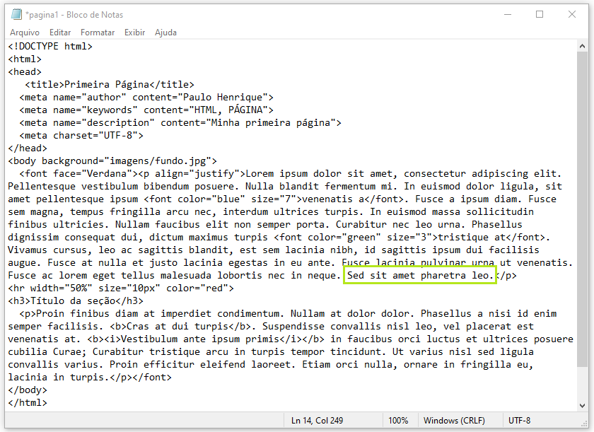
			   <figcaption>Se você quiser destacar um trecho do texto deixando-o riscado, basta usar a tag <code>&lt;strike&gt;Sed sit amet pharetra leo.&lt;/strike&gt;</code>. Essa tag é usada em sites para mostrar preços de produtos.</figcaption>
		   </li>
		   <li>
			   <input type="radio" id="020a" name="sl">
			   <label for="020a"></label>
			   <figcaption>
<button type="button" onclick="copyEvent('cod50', 'cd50')" onmouseout="outFunc('cd50')">Copiar o código</button>
Código estrutural de uma página HTML:
<pre><code id="cod50">&lt;!DOCTYPE html&gt;
&lt;html&gt;
&lt;head&gt;
   &lt;title&gt;Primeira Página&lt;/title&gt;
  &lt;meta name="author" content="Paulo Henrique"&gt;
  &lt;meta name="keywords" content="HTML, PÁGINA"&gt;
  &lt;meta name="description" content="Minha primeira página"&gt;
  &lt;meta charset="UTF-8"&gt;
&lt;/head&gt;
&lt;body background="imagens/fundo.jpg"&gt;
  &lt;font face="Verdana"&gt;&lt;p align="justify"&gt;Lorem ipsum dolor sit amet, consectetur adipiscing elit. 
  Pellentesque vestibulum bibendum posuere. Nulla blandit fermentum mi. In euismod dolor ligula, sit amet 
  pellentesque ipsum &lt;font color="blue" size="7"&gt;venenatis a&lt;/font&gt;. Fusce a ipsum diam. Fusce sem 
  magna, tempus fringilla arcu nec, interdum ultrices turpis. In euismod massa sollicitudin finibus 
  ultricies. Nullam faucibus elit non semper porta. Curabitur nec leo urna. Phasellus dignissim consequat 
  dui, dictum maximus turpis &lt;font color="green" size="3"&gt;tristique at&lt;/font&gt;. Vivamus cursus, leo ac 
  sagittis blandit, est sem lacinia nibh, id sagittis ipsum dui facilisis augue. Fusce at nulla et justo 
  lacinia egestas in eu ante. Fusce lacinia pulvinar urna ut venenatis. Fusce ac lorem eget tellus 
  malesuada lobortis nec in neque. <a alt="destaque de trecho riscado">&lt;del&gt;Sed sit amet pharetra leo.&lt;/del&gt;</a>&lt;/p&gt;
<a alt="barra separadora de conteúdos: vermelha, com largura de 50%, altura de 10px">&lt;hr width="50%" size="10px" color="red"&gt;</a>
<a alt="título com tamanho 3&#10;h1 | h2 | h3 | h4 | h5 | h6">&lt;h3&gt;Título da seção&lt;/h3&gt;</a>
  &lt;p&gt;Proin finibus diam at imperdiet condimentum. Nullam at dolor dolor. Phasellus a nisi id enim 
  semper facilisis. <a alt="destaque de trecho em negrito (bold)">&lt;b&gt;Cras at dui turpis&lt;/b&gt;</a>. Suspendisse convallis nisl leo, vel placerat est venenatis 
  at. <a alt="destaque de trecho com negrito e itálico">&lt;b&gt;&lt;i&gt;Vestibulum ante ipsum primis&lt;/i&gt;&lt;/b&gt;</a> in faucibus orci luctus et ultrices posuere cubilia 
  Curae; Curabitur tristique arcu in turpis tempor tincidunt. Ut varius nisl sed ligula convallis varius. 
  Proin efficitur eleifend laoreet. Etiam orci nulla, ornare in fringilla eu, lacinia in turpis.&lt;/p&gt;&lt;/font&gt;
&lt;/body&gt;
&lt;/html&gt;</code></pre>
</figcaption>
		   </li>
		</ul>
		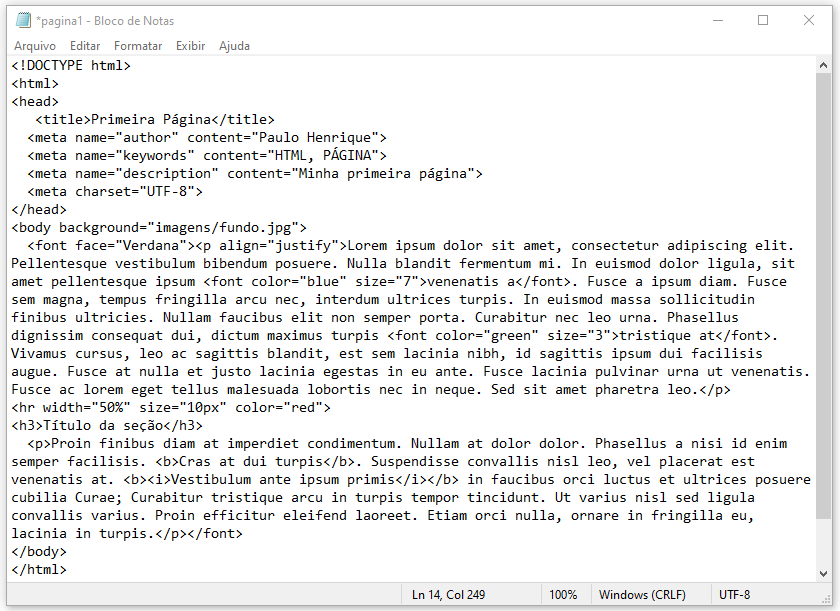
  

  
<a href="#basico" class="topo">voltar ao topo</a>

  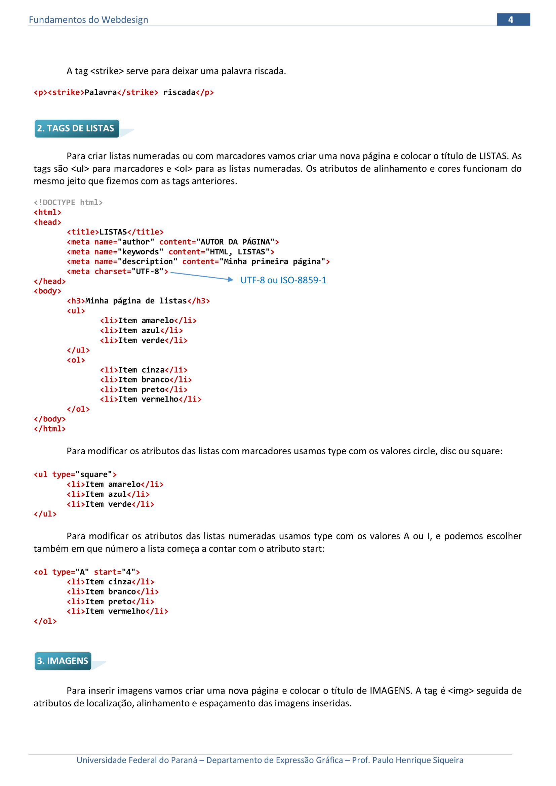
  

&#x1f4c3; Listas

	
Agora vamos criar uma outra página, dentro da pasta da disciplina, crie a pasta <code>webdesign/pagina2/</code>. Nesta página, vamos criar elementos de listas.

	  <ul class="slider">
		  <li>
			   <input type="radio" id="021" name="sl">
			   <label for="021"></label>
			   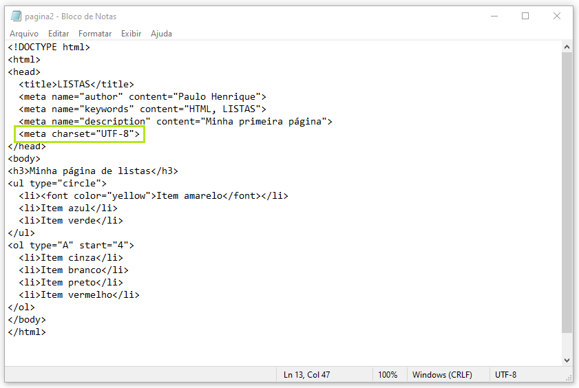
			   <figcaption>Dependendo do servidor usado para hospedar sua página, devemos modificar a codificação de caracteres charset de <b>UTF-8</b> para <b>ISO-8859-1</b>. Porém, a maioria dos servidores usa o <b>UTF-8</b>.</figcaption>
		   </li>
		   <li>
			   <input type="radio" id="022" name="sl">
			   <label for="022"></label>
			   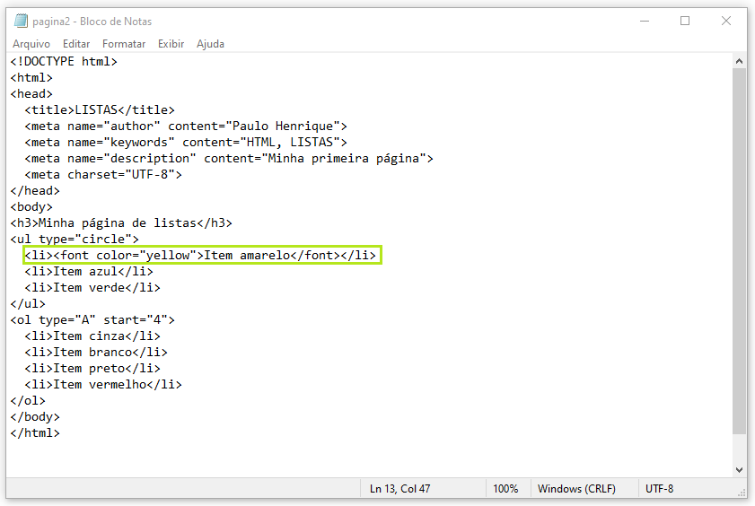
			   <figcaption>Usando a tag <code>&lt;ul&gt;</code>, podemos criar listas na página. Este exemplo mostra os marcadores da lista com formato de círculos.</figcaption>
		   </li>
		   <li>
			   <input type="radio" id="023" name="sl">
			   <label for="023"></label>
			   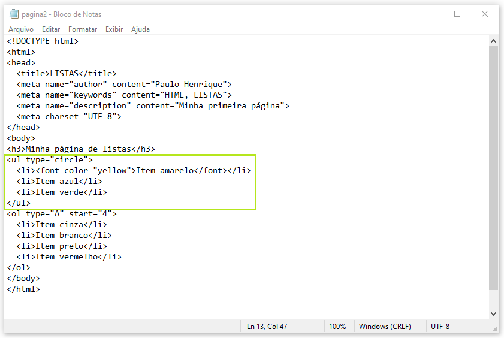
			   <figcaption>Os itens das listas têm tags <code>&lt;li&gt;</code>. Note que cada tag de item precisa ser fechada, depois que você coloca o conteúdo. Para mudar de cor, coloque a tag de fonte aninhada na tag de item da lista. Mude as cores dos outros itens.</figcaption>
		   </li>
		   <li>
			   <input type="radio" id="024" name="sl">
			   <label for="024"></label>
			   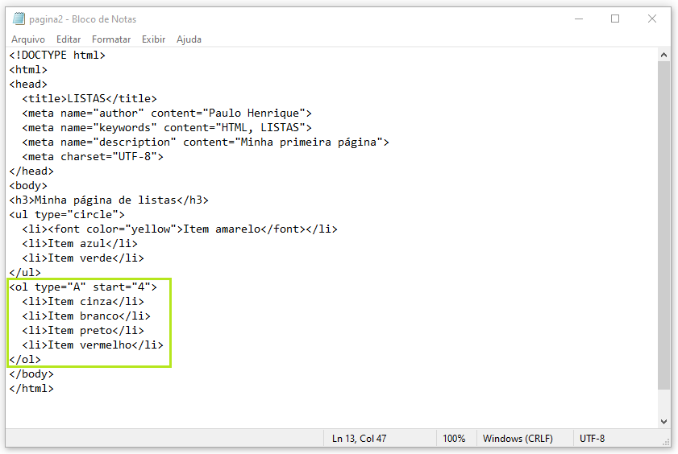
			   <figcaption>As listas ordenadas têm a mesma estrutura da lista normal, com a tag principal <code>&lt;ol&gt;</code>. Estas tags podem ser numéricas <code>type="1"</code>, literais <code>type="A"</code> ou com números romanos <code>type="I"</code>. Neste exemplo, a lista com letras começa na 4&ordf; letra, ou seja, a letra <b>D</b>.</figcaption>
		   </li>
		   <li>
			   <input type="radio" id="024a" name="sl">
			   <label for="024a"></label>
			   <figcaption>
<button type="button" onclick="copyEvent('cod51', 'cd51')" onmouseout="outFunc('cd51')">Copiar o código</button>
Código estrutural da página HTML com listas:
<pre><code id="cod51">&lt;!DOCTYPE html&gt;
&lt;html&gt; 
&lt;head&gt; 
	&lt;title&gt;LISTAS&lt;/title&gt;
	&lt;meta name="author" content="AUTOR DA PÁGINA"&gt;
	&lt;meta name="keywords" content="HTML, LISTAS"&gt;
	&lt;meta name="description" content="Minha primeira página"&gt;
	&lt;meta charset="UTF-8"&gt;
&lt;/head&gt; 
&lt;body&gt;
	&lt;h3&gt;Minha página de listas&lt;/h3&gt;
	<a alt="tag de lista &lt;ul&gt; com símbolo de círculo&#10;type: circle | disc | square">&lt;ul type="circle"&gt;</a>    
		<a alt="cada item da lista está em uma tag &lt;li&gt;">&lt;li&gt;Item amarelo&lt;/li&gt;</a>     
		&lt;li&gt;Item azul&lt;/li&gt;     
		&lt;li&gt;Item verde&lt;/li&gt; 
	&lt;/ul&gt;
	<a alt="tag de lista ordenada &lt;ol&gt; com letras maiúsculas, começando pela letra D&#10;type: A | a | 1 | I | i">&lt;ol type="A" start="4"&gt;</a>     
		&lt;li&gt;Item cinza&lt;/li&gt;
		&lt;li&gt;Item branco&lt;/li&gt;     
		&lt;li&gt;Item preto&lt;/li&gt;     
		&lt;li&gt;Item vermelho&lt;/li&gt; 
	&lt;/ol&gt;
&lt;/body&gt; 
&lt;/html&gt;</code></pre>
</figcaption>
		   </li>		   
		</ul>
		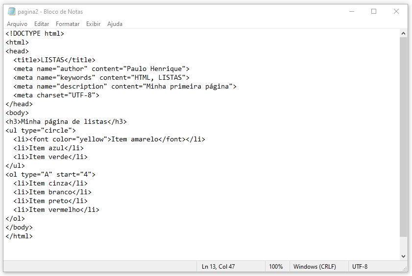
  

  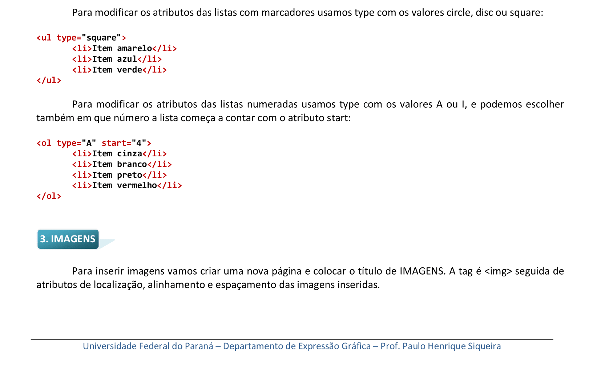
  
<a href="#basico" class="topo">voltar ao topo</a>

  
  

&#x1f4c3; Imagens

	
Agora vamos criar uma outra página, dentro da pasta da disciplina: crie a pasta <code>webdesign/pagina3/</code>. Nesta página, vamos inserir imagens, por isso, crie uma pasta <code>webdesign/pagina3/imagens</code> para colocarmos todas as imagens da página. Escolha 3 imagens e coloque nesta pasta. As extensões podem ser <b>png</b>, <b>jpg</b> ou <b>jpeg</b>. Preste atenção no atributo <code>src</code>, que contém o caminho da imagem.

	  <ul class="slider">
		  <li>
			   <input type="radio" id="025" name="sl">
			   <label for="025"></label>
			   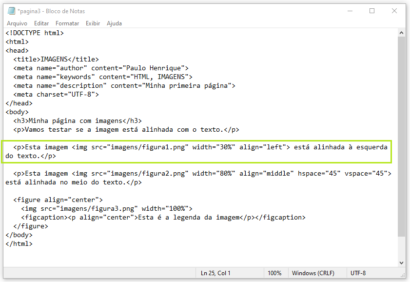
			   <figcaption>A tag de imagem pode ser colocada no meio do texto usando o código <code>&lt;img&gt;</code>. Todos os atributos desta tag ficam dentro da <code>&lt;img&gt;</code>, não precisando ser fechada. A largura em percentual é importante para deixar o site responsivo.</figcaption>
		   </li>
		   <li>
			   <input type="radio" id="026" name="sl">
			   <label for="026"></label>
			   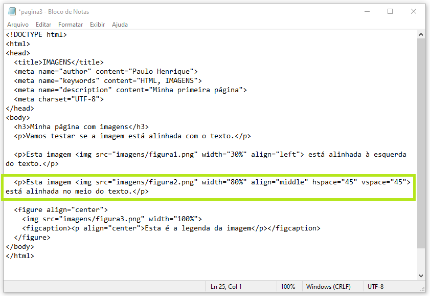
			   <figcaption>Neste segundo exemplo, a imagem também está misturada com o texto, alinhada no meio do texto. Não recomenda-se o uso das imagens misturadas, pois o layout da página fica prejudicado.</figcaption>
		   </li>
		   <li>
			   <input type="radio" id="026a" name="sl">
			   <label for="026a"></label>
			   
			   <figcaption>Os atributos <code>hspace</code> e <code>vspace</code> criam margens horizontais e verticais em torno da imagem. São ótimas para não deixar outros elementos "grudados" nas imagens.</figcaption>
		   </li>
		   <li>
			   <input type="radio" id="027" name="sl">
			   <label for="027"></label>
			   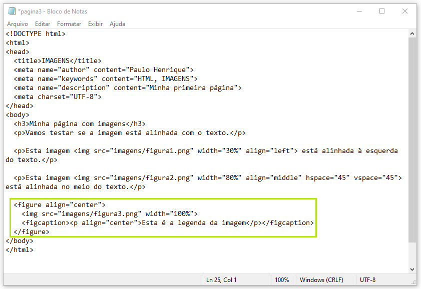
			   <figcaption>De uma forma bem mais organizada, podemos criar a tag-mãe <code>&lt;figure&gt;</code>, que contém a imagem, e logo depois uma tag de legenda <code>&lt;figcaption&gt;</code>. Neste caso, a tag de parágrafo centralizado foi usada para deixar a legenda alinhada com a imagem.</figcaption>
		   </li>
		   <li>
			   <input type="radio" id="027a" name="sl">
			   <label for="027a"></label>
			   <figcaption>
<button type="button" onclick="copyEvent('cod52', 'cd52')" onmouseout="outFunc('cd52')">Copiar o código</button>
Código estrutural da página HTML com imagens:
<pre><code id="cod52">&lt;!DOCTYPE html&gt;
&lt;html&gt; 
&lt;head&gt; 
	&lt;title&gt;IMAGENS&lt;/title&gt;
	&lt;meta name="author" content="AUTOR DA PÁGINA"&gt;
	&lt;meta name="keywords" content="HTML, IMAGENS"&gt;
	&lt;meta name="description" content="Minha primeira página"&gt;
	&lt;meta charset="ISO-8859-1"&gt;
&lt;/head&gt; 
&lt;body&gt;
	&lt;h3&gt;Minha página com imagens&lt;/h3&gt;
	&lt;p&gt;Vamos testar se a imagem está alinhada com o texto.&lt;/p&gt;
	
	&lt;p&gt;Esta imagem <a alt="tag de imagem &lt;img&gt; com largura de 30% e alinhamento à esquerda&#10;align: left | right | middle | top | bottom">&lt;img src="imagens/figura1.jpg" width="30%" align="left"&gt;</a> está alinhada à esquerda do texto.&lt;/p&gt;
	
	&lt;p&gt;Esta imagem <a alt="tag de imagem &lt;img&gt; com largura de 80% e alinhada no meio do texto&#10;margens: horizontal 30 e vertical 60">&lt;img src="imagens/figura2.jpg" width="80%" align="middle" hspace="30" vspace="60"&gt;</a> está alinhada no meio do texto.&lt;/p&gt; 
	
	<a alt="tag &lt;figure&gt; para organizar imagens e legendas&#10;align: left | right | center">&lt;figure align="center"&gt;</a>     
		<a alt="tag de imagem &lt;img&gt;">&lt;img src="imagens/figura3.jpg" width="100%"&gt;</a>     
		<a alt="tag de legenda &lt;figcaption&gt;">&lt;figcaption&gt;Esta é a legenda da imagem&lt;/figcaption&gt;</a> 
	&lt;/figure&gt;
&lt;/body&gt; 
&lt;/html&gt;</code></pre>
</figcaption>
		   </li>
		</ul>
		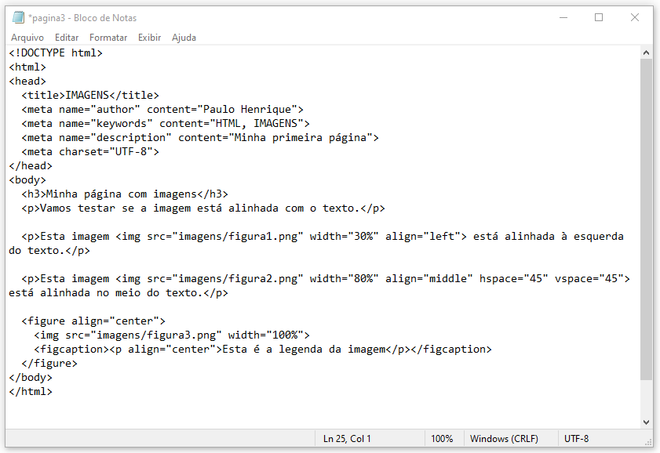
  

  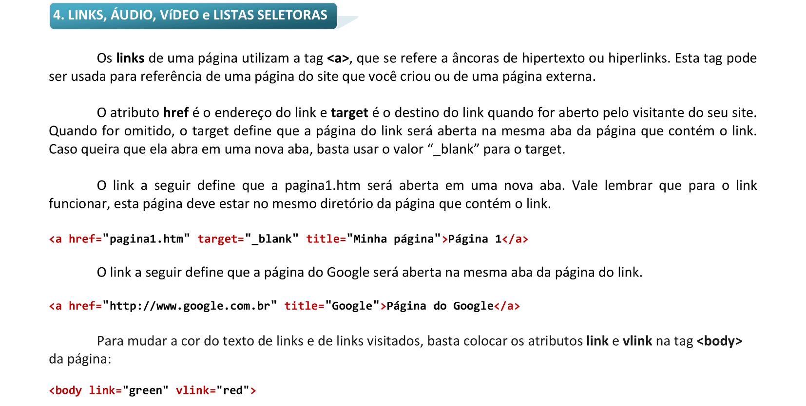
  

&#x1f4c3; Links

	
Usando a mesma <code>pagina3.htm</code>, vamos criar links. Os links podem ser criados em textos, imagens ou vídeos.

	  <ul class="slider">
		  <li>
			   <input type="radio" id="028" name="sl">
			   <label for="028"></label>
			   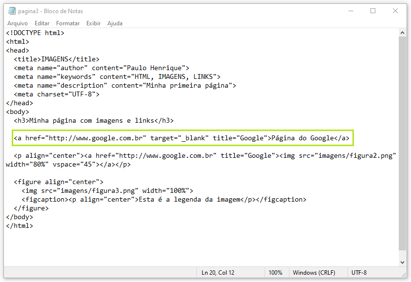
			   <figcaption>A tag de link é <code>&lt;a&gt;</code>, e precisa de fechamento para você limitar o que o visitante clica para visitar uma outra página. Neste primeiro exemplo, o link está em um texto: <b>Página do Google</b>.</figcaption>
		   </li>
		   <li>
			   <input type="radio" id="029" name="sl">
			   <label for="029"></label>
			   
			   <figcaption>O atributo <code>href</code> é obrigatório, e indica o endereço da página que será visitada. O atributo <code>target="_blank"</code> indica que a página será aberta em outra aba do navegador.</figcaption>
		   </li>
		   <li>
			   <input type="radio" id="030" name="sl">
			   <label for="030"></label>
			   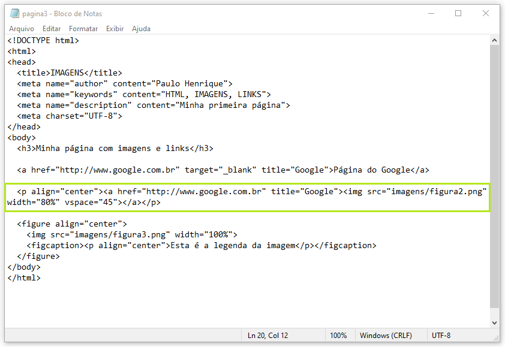
			   <figcaption>Para inserir um link em uma imagem, basta deixar a tag <code>&lt;a&gt;</code> aninhada com a tag <code>&lt;img&gt;</code>, como mostra este segundo exemplo. Crie os links, salve a página e teste em um navegador.</figcaption>
		   </li>
		   <li>
			   <input type="radio" id="030a" name="sl">
			   <label for="030a"></label>
			   <figcaption>
<button type="button" onclick="copyEvent('cod53', 'cd53')" onmouseout="outFunc('cd53')">Copiar o código</button>
Código estrutural da página HTML com links e imagens:
<pre><code id="cod53">&lt;!DOCTYPE html&gt;
&lt;html&gt; 
&lt;head&gt; 
	&lt;title&gt;IMAGENS&lt;/title&gt;
	&lt;meta name="author" content="AUTOR DA PÁGINA"&gt;
	&lt;meta name="keywords" content="HTML, IMAGENS, LINKS"&gt;
	&lt;meta name="description" content="Minha primeira página"&gt;
	&lt;meta charset="UTF-8"&gt;
&lt;/head&gt; 
&lt;body&gt;
	&lt;h3&gt;Minha página com imagens e links&lt;/h3&gt;
	<a alt="tag de link &lt;a&gt; que abre em nova aba com atributo target _blank&#10;href contém o caminho da página do link">&lt;a href="http://www.google.com.br" target="_blank" title="Google"&gt;Página do Google&lt;/a&gt;</a>
	
	<a alt="tag aninhada de imagem &lt;img&gt; por dentro da tag de link &lt;a&gt;&#10;serve para colocar um link em uma imagem">&lt;p&gt;&lt;a href="http://www.google.com.br" title="Google"&gt;&lt;img src="imagens/figura2.png" width="80%" vspace="45"&gt;&lt;/a&gt;&lt;/p&gt;</a>

	&lt;figure align="center"&gt;     
		&lt;img src="imagens/figura3.jpg" width="100%"&gt;     
		&lt;figcaption&gt;Esta é a legenda da imagem&lt;/figcaption&gt; 
	&lt;/figure&gt;
&lt;/body&gt; 
&lt;/html&gt;</code></pre>
</figcaption>
		   </li>
		</ul>
		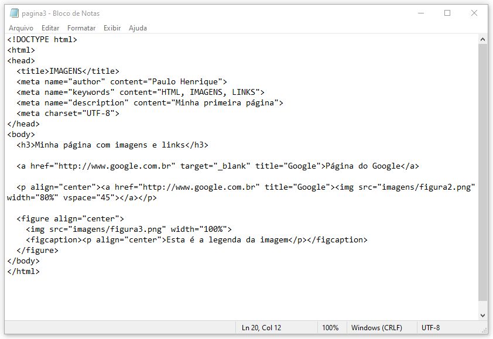
  

  
<a href="#basico" class="topo">voltar ao topo</a>

  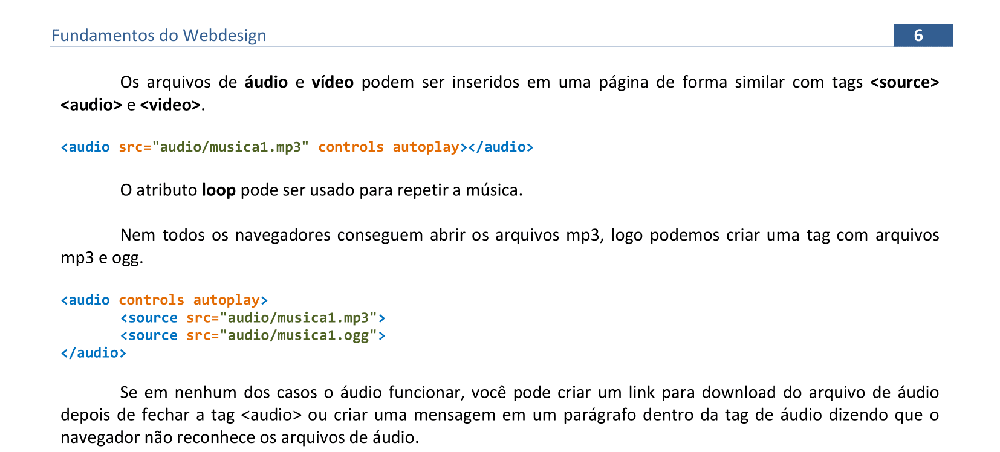
  

&#x1f4c3; Áudios

	
Usando a mesma <code>pagina3.htm</code>, vamos inserir tags de áudios. Quando você salvar a página e visualizar em um navegador, a opção com controles fornece um "frame" para o vídeo que fica parecido com a seguinte imagem:

	

	  <ul class="slider">
		  <li>
			   <input type="radio" id="031" name="sl">
			   <label for="031"></label>
			   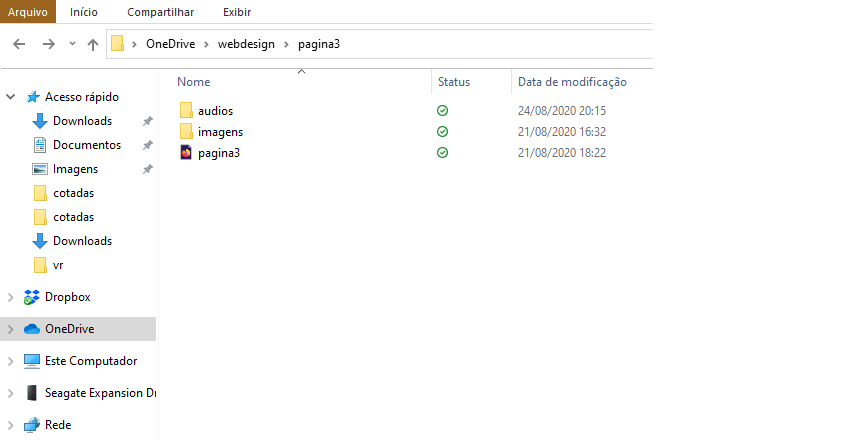
			   <figcaption>Na mesma pasta da nossa<code>pagina3</code>, podemos criar uma pasta chamada <code>audios</code>. Assim, a estrutura de arquivos da nossa página fica bem organizada.</figcaption>
		   </li>
		   <li>
			   <input type="radio" id="032" name="sl">
			   <label for="032"></label>
			   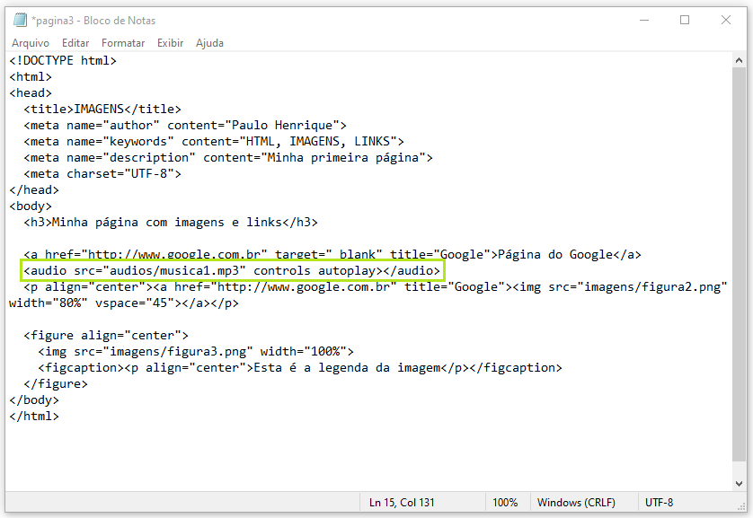
			   <figcaption>Podemos usar a tag <code>audio</code> em uma única linha, com todas as propriedades definidas dentro desta tag. Esta maneira é comum quando apenas um arquivo é inserido. Os navegadores atuais suportam arquivos com extensão <code>mp3</code>.</figcaption>
		   </li>
		   <li>
			   <input type="radio" id="033" name="sl">
			   <label for="033"></label>
			   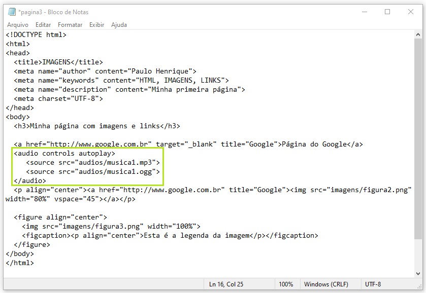
			   <figcaption>Em navegadores muito antigos, por precaução, podemos definir os formatos <code>mp3</code> e <code>ogg</code>. Esta tag é do tipo aninhada, com os caminhos (src) dos 2 arquivos definidos.</figcaption>
		   </li>
		   <li>
			   <input type="radio" id="034" name="sl">
			   <label for="034"></label>
			   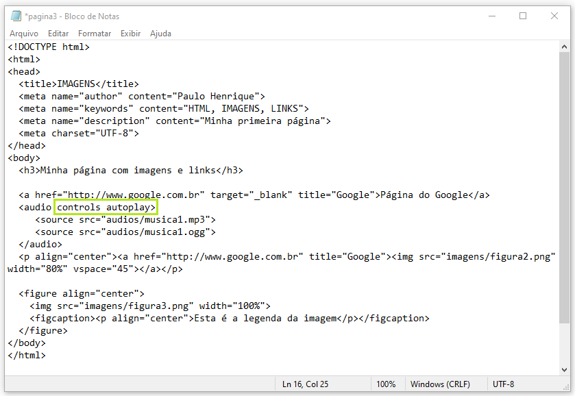
			   <figcaption>O atributo <code>controls</code> serve para mostrar os controles para o visitante interagir com o audio. O atributo <code>autoplay</code> define a reprodução automática do arquivo.</figcaption>
		   </li>
		   <li>
			   <input type="radio" id="034a" name="sl">
			   <label for="034a"></label>
			   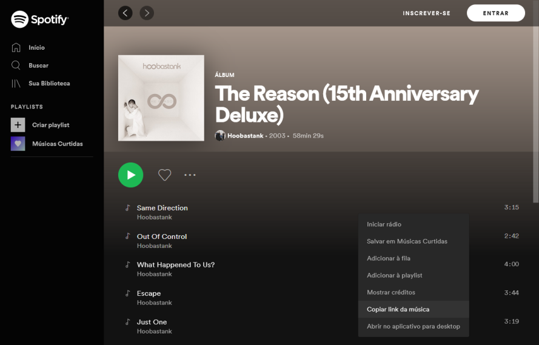
			   <figcaption>Você pode colocar links para áudios em uma página. Acessando o site <code>open.spotify.com</code>, você pode selecionar as músicas e copiar seus links.</figcaption>
		   </li>
		   <li>
			   <input type="radio" id="034b" name="sl">
			   <label for="034b"></label>
			   
			   <figcaption>Você pode criar também os links para álbuns, da mesma maneira mostrada para músicas. Na página HTML usamos a tag de link <code>&lt;a&gt;</code> para os álbuns.</figcaption>
		   </li>
		   <li>
			   <input type="radio" id="034c" name="sl">
			   <label for="034c"></label>
			   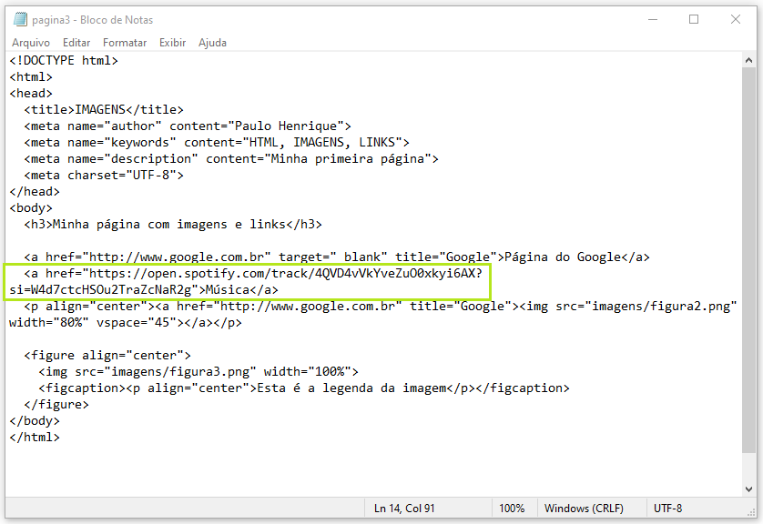
			   <figcaption>Usando a tag de link <code>&lt;a&gt;</code>, você insere os links de músicas em sua página.</figcaption>
		   </li>
		   <li>
			   <input type="radio" id="034d" name="sl">
			   <label for="034d"></label>
			   <figcaption>
<button type="button" onclick="copyEvent('cod54', 'cd54')" onmouseout="outFunc('cd54')">Copiar o código</button>
Código estrutural da página HTML com links e imagens:
<pre><code id="cod54">&lt;!DOCTYPE html&gt;
&lt;html&gt;
&lt;head&gt;
  &lt;title&gt;IMAGENS&lt;/title&gt;
  &lt;meta name="author" content="Paulo Henrique"&gt;
  &lt;meta name="keywords" content="HTML, IMAGENS, LINKS"&gt;
  &lt;meta name="description" content="Minha primeira página"&gt;
  &lt;meta charset="UTF-8"&gt;
&lt;/head&gt;
&lt;body&gt;
  &lt;h3&gt;Minha página com imagens e links&lt;/h3&gt;

  &lt;a href="http://www.google.com.br" target="_blank" title="Google"&gt;Página do Google&lt;/a&gt;
  <a alt="tag de áudio &lt;audio&gt; com controles e reprodução automática">&lt;audio controls autoplay&gt;</a>  
	<a alt="áudio com extensão mp3 salvo na pasta audios">&lt;source src="audios/musica1.mp3"&gt;</a> 
	<a alt="áudio com extensão ogg salvo na pasta audios">&lt;source src="audios/musica1.ogg"&gt;</a>
  &lt;/audio&gt;
  <a alt="link de áudio do Spotify, com a palavra Música usada como rótulo&#10;você pode usar uma imagem como rótulo, como mostrado nos códigos de links">&lt;a href="https://open.spotify.com/track/4QVD4vVkYveZuO0xkyi6AX?si=W4d7ctcHSOu2TraZcNaR2g"&gt;Música&lt;/a&gt;</a>
  &lt;p align="center"&gt;&lt;a href="http://www.google.com.br" title="Google"&gt;&lt;img src="imagens/figura2.png" width="80%" vspace="45"&gt;&lt;/a&gt;&lt;/p&gt;

  &lt;figure align="center"&gt;
    &lt;img src="imagens/figura3.png" width="100%"&gt;
    &lt;figcaption&gt;&lt;p align="center"&gt;Esta é a legenda da imagem&lt;/p&gt;&lt;/figcaption&gt;
  &lt;/figure&gt;
&lt;/body&gt;
&lt;/html&gt;</code></pre>
</figcaption>
		   </li>
		</ul>
		
  

  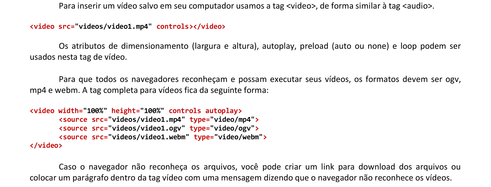
  

&#x1f4c3; Vídeos

	
Vamos criar uma nova pasta chamada <code>webdesign/pagina4</code>. Dentro desta pasta, crie as pastas de <code>imagens</code> e de <code>videos</code>. Quando você salvar a página e visualizar em um navegador, a opção com controles fornece uma imagem parecida com esta:

	
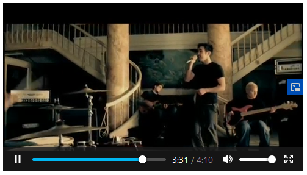

	  <ul class="slider">
		  <li>
			   <input type="radio" id="035" name="sl">
			   <label for="035"></label>
			   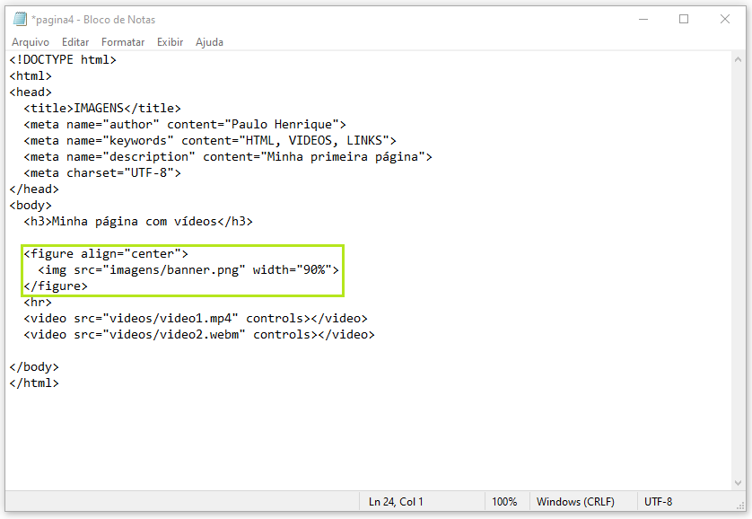
			   <figcaption>Escolha um arquivo de imagem (pode ser no google) para colocar como um banner da nossa <code>pagina4.htm</code>. Cuidado com a extensão da imagem (jpg, png, jpeg) para indicar o caminho no código HTML.</figcaption>
		   </li>
		   <li>
			   <input type="radio" id="036" name="sl">
			   <label for="036"></label>
			   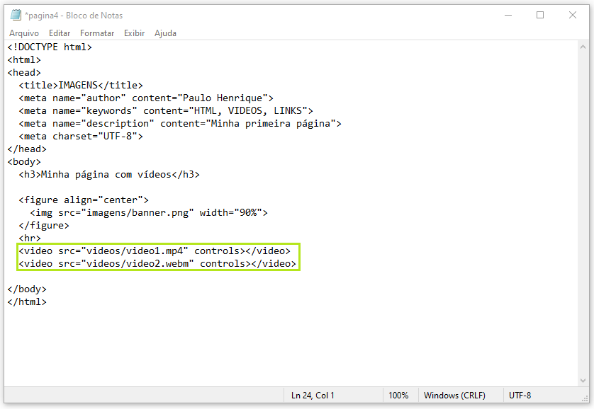
			   <figcaption>Podemos usar a tag <code>video</code> em uma única linha, com todas as propriedades definidas dentro desta tag. Esta maneira é comum quando apenas um arquivo é inserido. A maioria dos navegadores atuais suportam arquivos com extensões <code>mp4</code>, <code>webm</code> e <code>ogv</code>.</figcaption>
		   </li>
		   <li>
			   <input type="radio" id="037" name="sl">
			   <label for="037"></label>
			   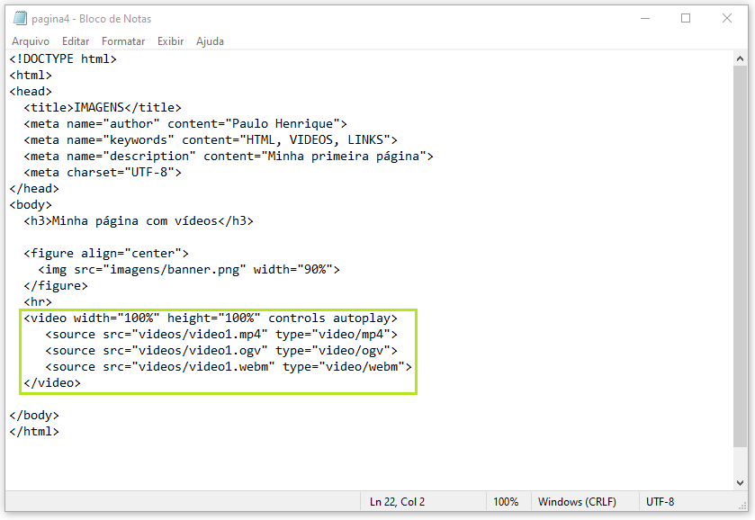
			   <figcaption>Por precaução, podemos definir os formatos <code>mp4</code>, <code>webm </code>e <code>ogv</code> dentro de uma tag de vídeo. Esta tag é do tipo aninhada, com os caminhos (src) dos 3 arquivos de vídeo.</figcaption>
		   </li>
		   <li>
			   <input type="radio" id="038" name="sl">
			   <label for="038"></label>
			   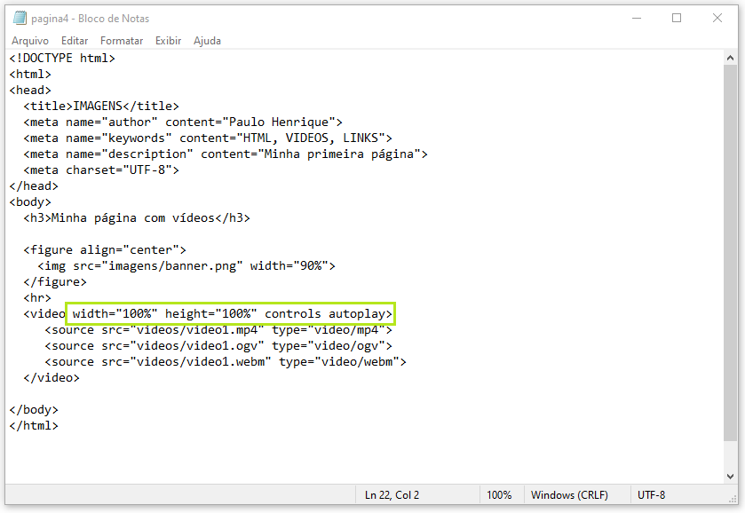
			   <figcaption>O atributo <code>controls</code> serve para mostrar os controles para o visitante interagir com o vídeo. O atributo <code>autoplay</code> define a reprodução automática do vídeo.</figcaption>
		   </li>
		   <li>
			   <input type="radio" id="039" name="sl">
			   <label for="039"></label>
			   
			   <figcaption>Quando inserimos vídeos em uma página, é importante definirmos a altura <code>height</code> e a largura <code>width</code> do vídeo. Estas medidas podem ser indicadas em % ou pixels.</figcaption>
		   </li>
		   <li>
			   <input type="radio" id="039a" name="sl">
			   <label for="039a"></label>
			   <figcaption>
<button type="button" onclick="copyEvent('cod55', 'cd55')" onmouseout="outFunc('cd55')">Copiar o código</button>
Código estrutural da página HTML com imagens e áudios:
<pre><code id="cod55">&lt;!DOCTYPE html&gt;
&lt;html&gt; 
&lt;head&gt; 
	&lt;title&gt;IMAGENS&lt;/title&gt;
	&lt;meta name="author" content="AUTOR DA PÁGINA"&gt;
	&lt;meta name="keywords" content="HTML, VÍDEOS, LINKS"&gt;
	&lt;meta name="description" content="Minha primeira página"&gt;
	&lt;meta charset="UTF-8"&gt;
&lt;/head&gt; 
&lt;body&gt;
	&lt;h3&gt;Minha página com vídeos&lt;/h3&gt;
	
	&lt;figure align="center"&gt;     
		&lt;img src="imagens/banner.png" width="90%"&gt;
	&lt;/figure&gt;
	&lt;hr&gt;
	<a alt="tag de vídeo &lt;video&gt; com controles e reprodução automática">&lt;video width="100%" height="100%" controls autoplay&gt;</a>
		<a alt="vídeo com extensão mp4 salvo na pasta videos">&lt;source src="videos/video1.mp4"type="video/mp4"&gt;</a> 
		<a alt="vídeo com extensão ogv salvo na pasta videos">&lt;source src="videos/video1.ogv"type="video/ogv"&gt;</a> 
		<a alt="vídeo com extensão webm salvo na pasta videos">&lt;source src="videos/video1.webm"type="video/webm"&gt;</a> 
	&lt;/video&gt;

&lt;/body&gt; 
&lt;/html&gt;</code></pre>
</figcaption>
		   </li>
		</ul>
		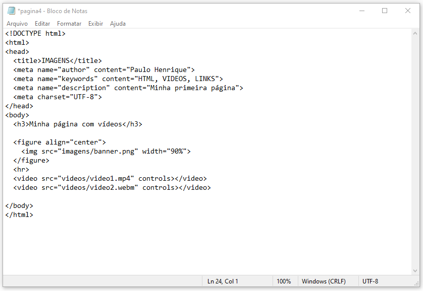
  

  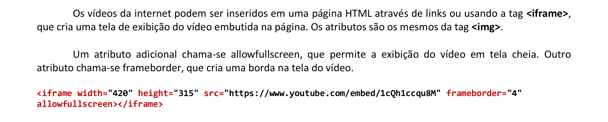
  

&#x1f4c3; Vídeos do Youtube

	
Para inserir um vídeo do Youtube, usamos a tag <code>iframe</code>. Vamos usar a mesma <code>pagina4.htm</code> para inserir esta tag de vídeo.

	  <ul class="slider">
		  <li>
			   <input type="radio" id="040" name="sl">
			   <label for="040"></label>
			   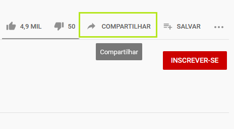
			   <figcaption>Na página do vídeo escolhido, clique em <code>compartilhar</code>, no link que fica logo abaixo da janela do vídeo.</figcaption>
		   </li>
		   <li>
			   <input type="radio" id="041" name="sl">
			   <label for="041"></label>
			   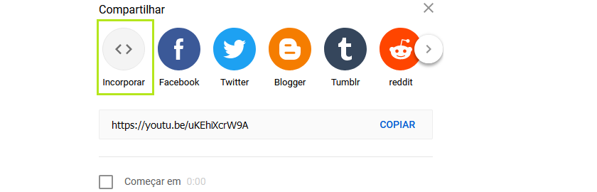
			   <figcaption>Selecione a opção <code>incorporar</code>.</figcaption>
		   </li>
		   <li>
			   <input type="radio" id="042" name="sl">
			   <label for="042"></label>
			   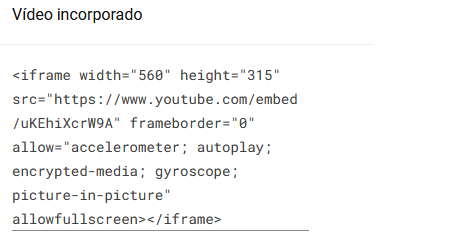
			   <figcaption>Agora é só copiar a tag <code>iframe</code> criada. Note que aparecem as medidas que já usamos na tag de <code>video</code>.</figcaption>
		   </li>
		   <li>
			   <input type="radio" id="043" name="sl">
			   <label for="043"></label>
			   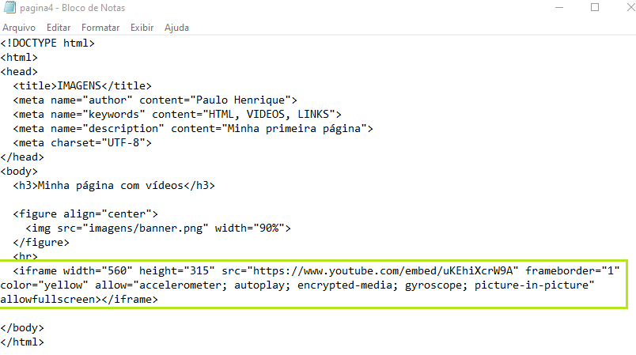
			   <figcaption>Cole a tag criada na posição da página que você quer mostrar o vídeo. O atributo <code>frameborder</code> tem padrão com valor <b>0</b>. Se você quiser uma borda, basta alterar o valor deste atributo para qualquer número maior do que <b>0</b>.</figcaption>
		   </li>
		   <li>
			   <input type="radio" id="043a" name="sl">
			   <label for="043a"></label>
			   <figcaption>
<button type="button" onclick="copyEvent('cod56', 'cd56')" onmouseout="outFunc('cd56')">Copiar o código</button>
Código estrutural da página HTML com imagens e vídeos:
<pre><code id="cod56">&lt;!DOCTYPE html&gt;
&lt;html&gt; 
&lt;head&gt; 
	&lt;title&gt;IMAGENS&lt;/title&gt;
	&lt;meta name="author" content="AUTOR DA PÁGINA"&gt;
	&lt;meta name="keywords" content="HTML, VÍDEOS, LINKS"&gt;
	&lt;meta name="description" content="Minha primeira página"&gt;
	&lt;meta charset="UTF-8"&gt;
&lt;/head&gt; 
&lt;body&gt;
	&lt;h3&gt;Minha página com vídeos&lt;/h3&gt;
	
	&lt;figure align="center"&gt;     
		&lt;img src="imagens/banner.png" width="90%"&gt;
	&lt;/figure&gt;
	&lt;hr&gt;
	<a alt="tag de moldura &lt;iframe&gt; com vídeo do Youtube&#10;não esqueça de definir a altura e a largura desta tag">&lt;iframe width="560" height="315" src="https://www.youtube.com/embed/uKEhiXcrW9A" frameborder="1" color="yellow" allow="accelerometer; autoplay; encrypted-media; gyroscope; picture-in-picture" allowfullscreen&gt;&lt;/iframe&gt;</a>

&lt;/body&gt; 
&lt;/html&gt;</code></pre>
</figcaption>
		   </li>
		</ul>
		
  

  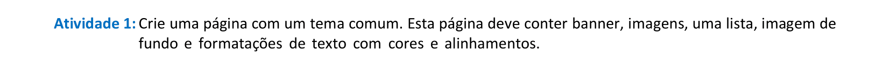
  

&#x1f4c3; Detalhes da Atividade

	
Usando todas as tags que vimos até agora, vamos montar uma página htm com os elementos descritos abaixo. Crie uma pasta chamada <code>webdesign/atividade1</code> para inserir os arquivos desta atividade. O arquivo principal HTML será chamado de <code>index.htm</code>.

	  <ul class="slider">
		  <li>
			   <input type="radio" id="044" name="sl">
			   <label for="044"></label>
			   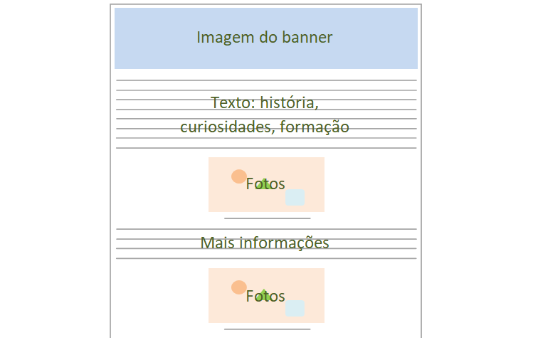
			   <figcaption>Na parte superior da página, que terá um formato tipo blog, coloque uma imagem como <code>banner</code>, textos de informações e curiosidades sobre a banda ou o cantor escolhido.</figcaption>
		   </li>
		   <li>
			   <input type="radio" id="045" name="sl">
			   <label for="045"></label>
			   
			   <figcaption>Insira imagens, uma imagem de fundo <code>background</code>. Lembre-se de colocar as medidas de altura e largura da imagem na página. Use as tags de linhas horizontais <code>&lt;hr&gt;</code> para separar conteúdos.</figcaption>
		   </li>
		   <li>
			   <input type="radio" id="046" name="sl">
			   <label for="046"></label>
			   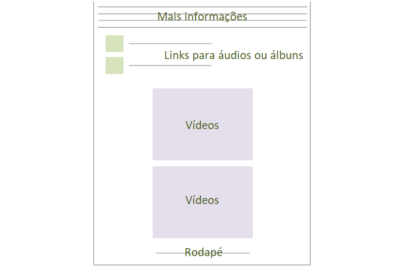
			   <figcaption>Na parte inferior da página, crie links para áudios e vídeos da banda ou do cantor escolhido. Use links do Spotify ou Youtube. Lembre-se de usar as medidas para criar os <code>iframes</code> dos vídeos.</figcaption>
		   </li>
		   <li>
			   <input type="radio" id="047" name="sl">
			   <label for="047"></label>
			   
			   <figcaption>No rodapé, você pode colocar informações de copyright com seu nome, usando o código do símbolo &copy;: <code>&amp;copy;</code>.</figcaption>
		   </li>
		</ul>
		
  

  
<a href="#basico" class="topo">voltar ao topo</a>

  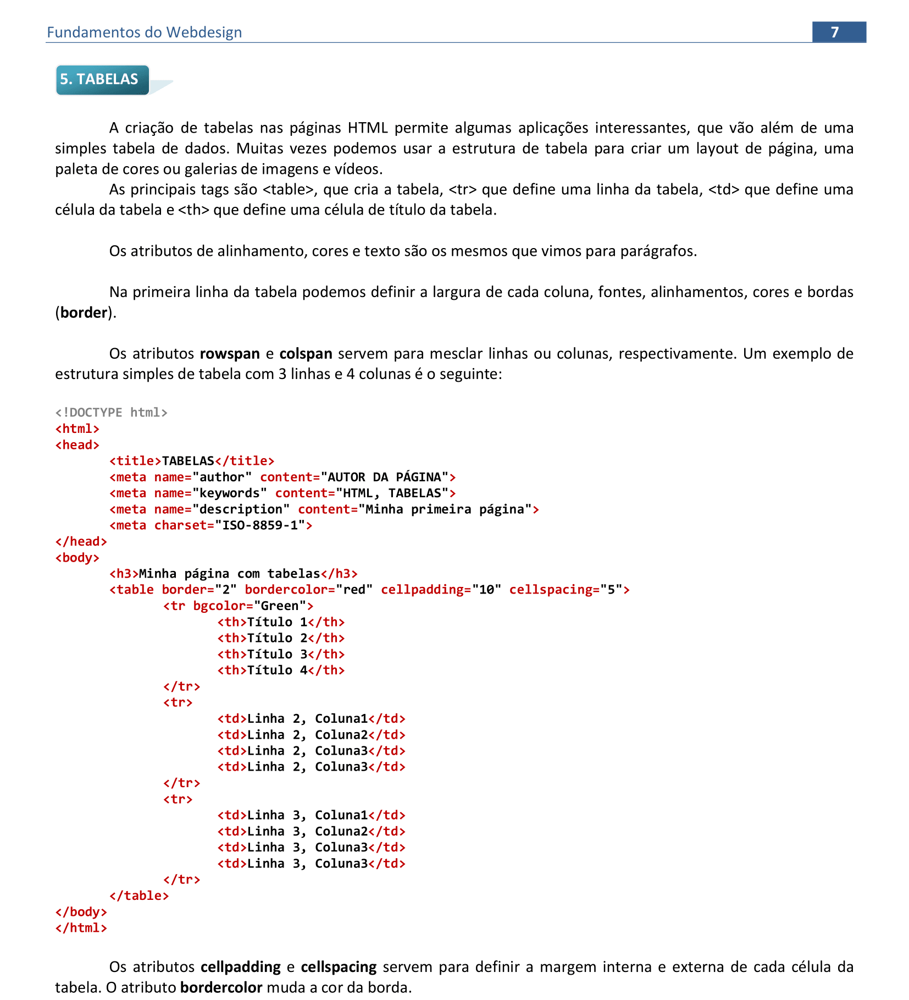
  

&#x1f4c3; Tabelas

	
Crie uma pasta chamada <code>webdesign/pagina5</code> para inserir os arquivos da nossa próxima página, com tabelas. O arquivo principal HTML será chamado de <code>index.htm</code>.

	  <ul class="slider">
		  <li>
			   <input type="radio" id="048" name="sl">
			   <label for="048"></label>
			   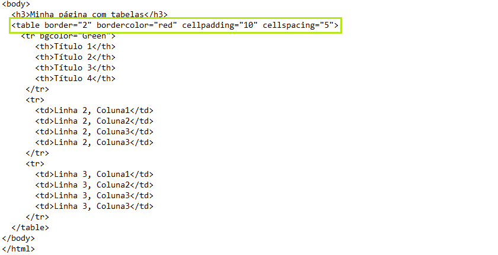
			   <figcaption>Usamos <code>table</code> como a tag-mãe das células da tabela. Logo, vamos "aninhar" as tags das células da tabela dentro da tag <code>table</code>.</figcaption>
		   </li>
		   <li>
			   <input type="radio" id="049" name="sl">
			   <label for="049"></label>
			   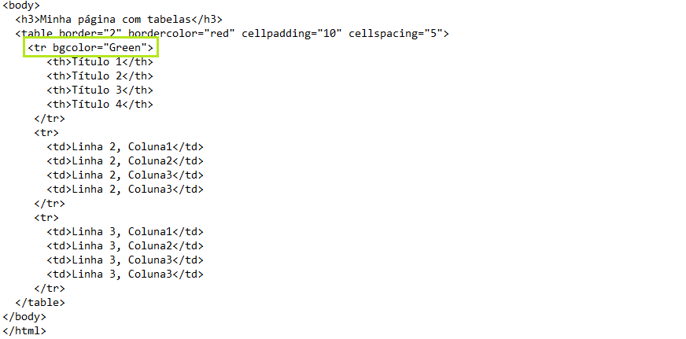
			   <figcaption>Toda vez que vamos criar uma linha de tabela, usamos a tag <code>&lt;tr&gt;</code>. Esta tag, por sua vez, terá as tags das células das colunas <code>&lt;td&gt;</code> ou <code>&lt;th&gt;</code> "aninhadas". Dentro destas tags colocamos conteúdos de textos ou imagens.</figcaption>
		   </li>
		   <li>
			   <input type="radio" id="050" name="sl">
			   <label for="050"></label>
			   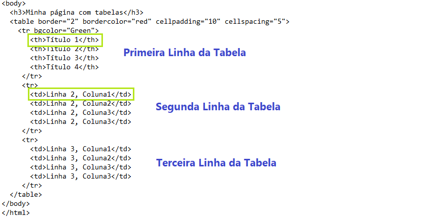
			   <figcaption>As tags <code>&lt;th&gt;</code> podem ser usadas na primeira linha de uma tabela, como linha de títulos. Podemos digitar os textos diretamente sem tags, como mostra o exemplo. Para colocar imagens, colocamos a tag <code>&lt;img&gt;</code> dentro da tag <code>&lt;td&gt;</code>.</figcaption>
		   </li>
		   <li>
			   <input type="radio" id="051" name="sl">
			   <label for="051"></label>
			   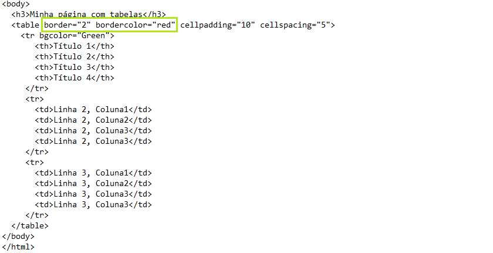
			   <figcaption>Os atributos <code>border</code> e <code>bordercolor</code> definem a espessura e a cor da borda de cada célula, respectivamente. O atributo <code>bgcolor</code> pode ser usado para mudar a cor de fundo de uma célula ou de uma linha. No exemplo, o atributo deixa a primeira linha com fundo verde.</figcaption>
		   </li>
		   <li>
			   <input type="radio" id="052" name="sl">
			   <label for="052"></label>
			   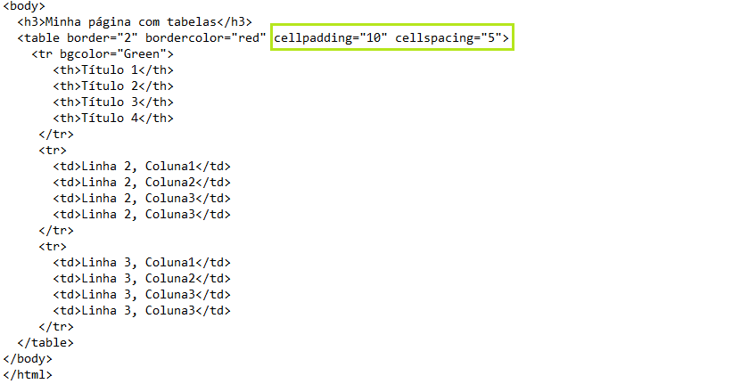
			   <figcaption>Os atributos <code>cellpadding</code> e <code>cellspacing</code> são as margens interna e externa de cada célula, respectivamente. Salve a página e visualize em um navegador.</figcaption>
		   </li>
		   <li>
			   <input type="radio" id="053" name="sl">
			   <label for="053"></label>
			   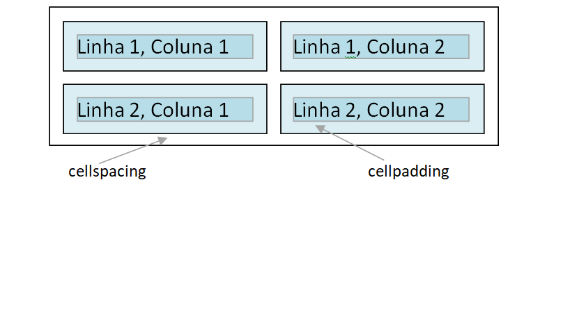
			   <figcaption>Esta é a função da criação de margens em tabelas. Geralmente usamos o padrão do HTML, com <code>cellspacing="0"</code>.</figcaption>
		   </li>
		   <li>
			   <input type="radio" id="053a" name="sl">
			   <label for="053a"></label>
			   <figcaption>
<button type="button" onclick="copyEvent('cod57', 'cd57')" onmouseout="outFunc('cd57')">Copiar o código</button>
Código estrutural da página HTML com tabela:
<pre><code id="cod57">&lt;body&gt;
	&lt;h3&gt;Minha página com tabelas&lt;/h3&gt;
	<a alt="tag de tabela &lt;table&gt; com borda vermelha com 2px de espessura&#10;os espaçamentos são: 10px interno e 5px externo">&lt;table border="2" bordercolor="red" cellpadding="10" cellspacing="5"&gt;</a>     
		<a alt="tag de início da primeira linha &lt;tr&gt; da tabela, com cor de fundo verde">&lt;tr bgcolor="green"&gt;</a> 
			<a alt="tag da primeira célula de título &lt;th&gt; da tabela">&lt;th&gt;Título 1&lt;/th&gt;</a> 
			&lt;th&gt;Título 2&lt;/th&gt; 
			&lt;th&gt;Título 3&lt;/th&gt; 
			&lt;th&gt;Título 4&lt;/th&gt; 
		&lt;/tr&gt; 
		<a alt="tag de início da segunda linha &lt;tr&gt; da tabela">&lt;tr&gt;</a>
			<a alt="tag da primeira célula da segunda linha &lt;td&gt; da tabela">&lt;td&gt;Linha 2, Coluna1&lt;/td&gt;</a>
			&lt;td&gt;Linha 2, Coluna2&lt;/td&gt;
			&lt;td&gt;Linha 2, Coluna3&lt;/td&gt;
			&lt;td&gt;Linha 2, Coluna3&lt;/td&gt;
		&lt;/tr&gt; 
		<a alt="tag de início da terceira linha &lt;tr&gt; da tabela">&lt;tr&gt;</a>
			<a alt="tag da primeira célula da terceira linha &lt;td&gt; da tabela">&lt;td&gt;Linha 3, Coluna1&lt;/td&gt;</a>
			&lt;td&gt;Linha 3, Coluna2&lt;/td&gt;
			&lt;td&gt;Linha 3, Coluna3&lt;/td&gt;
			&lt;td&gt;Linha 3, Coluna3&lt;/td&gt;
		&lt;/tr&gt;
	&lt;/table&gt;
&lt;/body&gt; 
&lt;/html&gt;</code></pre>
</figcaption>
		   </li>
		</ul>
		
  

  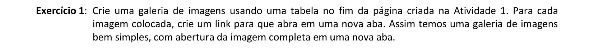
  

&#x1f4c3; Galeria de imagens

	
Você pode usar a mesma pasta da Atividade 1: <code>webdesign/atividade1</code>. Insira imagens na pasta de <code>webdesign/atividade1/imagens</code>, para criar nossa Galeria.

	  <ul class="slider">
		  <li>
			   <input type="radio" id="054" name="sl">
			   <label for="054"></label>
			   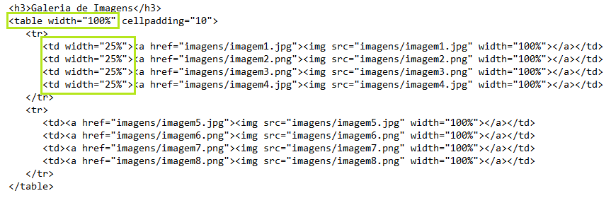
			   <figcaption>Podemos criar a tabela que ocupe <b>100%</b> da largura da página. Se criarmos uma galeria com 4 imagens, cada célula terá <b>25%</b> da largura da linha da tabela. Estas dimensões só precisam ser colocadas nas células da primeira linha da tabela. As outras linhas herdarão os valores informados na primeira linha.</figcaption>
		   </li>
		   <li>
			   <input type="radio" id="055" name="sl">
			   <label for="055"></label>
			   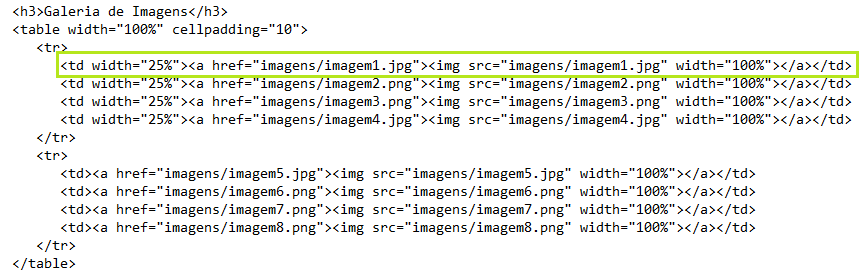
			   <figcaption>Agora você pode "aninhar" as tags de imagem <code>&lt;img&gt;</code> dentro de tags de link <code>&lt;a&gt;</code>, que ficam dentro das respectivas tags de célula <code>&lt;td&gt;</code>. Cuidado com as extensões e os caminhos dos arquivos!</figcaption>
		   </li>
		   <li>
			   <input type="radio" id="056" name="sl">
			   <label for="056"></label>
			   
			   <figcaption>Este é um exemplo de 8 imagens colocadas em uma tabela de 2 linhas e 4 colunas. Experimente outros formatos. Note que não foram usadas as bordas da tabela neste exemplo. Se necessário, ajuste as alturas das imagens, caso fiquem diferentes na galeria. Salve e teste a página em um navegador.</figcaption>
		   </li>
		   <li>
			   <input type="radio" id="056a" name="sl">
			   <label for="056a"></label>
			   <figcaption>
<button type="button" onclick="copyEvent('cod58', 'cd58')" onmouseout="outFunc('cd58')">Copiar o código</button>
Trecho do código HTML com galeria em formato de tabela:
<pre><code id="cod58">&lt;body&gt;
	&lt;h3&gt;Galeria de Imagens&lt;/h3&gt;
	<a alt="tag de tabela &lt;table&gt; com margens internas de 10px">&lt;table width="100%" cellpadding="10"&gt;</a>     
		<a alt="tag de início da primeira linha &lt;tr&gt; da tabela">&lt;tr&gt;</a>
			<a alt="primeira célula &lt;td&gt; com imagem salva na pasta imagens">&lt;td width="25%"&gt;&lt;a href="imagens/imagem1.jpg"&gt;&lt;img src="imagens/imagem1.jpg" width="100%"&gt;&lt;/a&gt;&lt;/td&gt;</a>
			&lt;td width="25%"&gt;&lt;a href="imagens/imagem2.png"&gt;&lt;img src="imagens/imagem2.png" width="100%"&gt;&lt;/a&gt;&lt;/td&gt;
			&lt;td width="25%"&gt;&lt;a href="imagens/imagem3.png"&gt;&lt;img src="imagens/imagem3.png" width="100%"&gt;&lt;/a&gt;&lt;/td&gt;
			&lt;td width="25%"&gt;&lt;a href="imagens/imagem4.jpg"&gt;&lt;img src="imagens/imagem4.jpg" width="100%"&gt;&lt;/a&gt;&lt;/td&gt;
		&lt;/tr&gt; 
		<a alt="tag de início da segunda linha &lt;tr&gt; da tabela">&lt;tr&gt;</a>
			<a alt="primeira célula &lt;td&gt; com imagem salva na pasta imagens">&lt;td&gt;&lt;a href="imagens/imagem5.jpg"&gt;&lt;img src="imagens/imagem5.jpg" width="100%"&gt;&lt;/a&gt;&lt;/td&gt;</a>
			&lt;td&gt;&lt;a href="imagens/imagem6.png"&gt;&lt;img src="imagens/imagem6.png" width="100%"&gt;&lt;/a&gt;&lt;/td&gt;
			&lt;td&gt;&lt;a href="imagens/imagem7.png"&gt;&lt;img src="imagens/imagem7.png" width="100%"&gt;&lt;/a&gt;&lt;/td&gt;
			&lt;td&gt;&lt;a href="imagens/imagem8.png"&gt;&lt;img src="imagens/imagem8.png" width="100%"&gt;&lt;/a&gt;&lt;/td&gt;
		&lt;/tr&gt;
	&lt;/table&gt;
&lt;/body&gt; 
&lt;/html&gt;</code></pre>
</figcaption>
		   </li>
		</ul>
		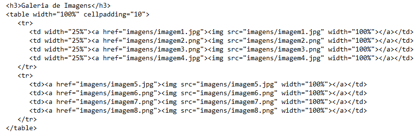
  

  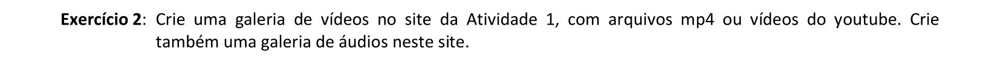
  

&#x1f4c3; Galeria de vídeos e áudios

	
Você pode usar a mesma pasta da Atividade 1: <code>webdesign/atividade1</code>. Insira arquivos de áudio na pasta de <code>webdesign/atividade1/audios</code>, para criar nossa Galeria.

	  <ul class="slider">
		  <li>
			   <input type="radio" id="057" name="sl">
			   <label for="057"></label>
			   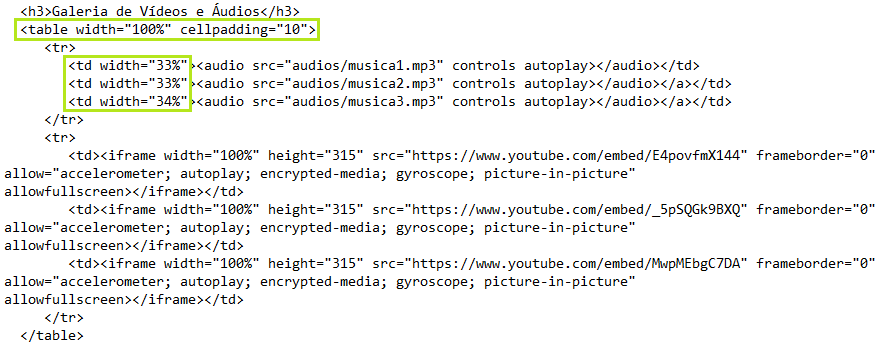
			   <figcaption>Podemos criar a tabela que ocupe <b>100%</b> da largura da página. Se criarmos uma galeria com 3 áudios em uma linha e 3 vídeos na outra linha, cada célula terá <b>33%</b> da largura da linha da tabela.</figcaption>
		   </li>
		   <li>
			   <input type="radio" id="058" name="sl">
			   <label for="058"></label>
			   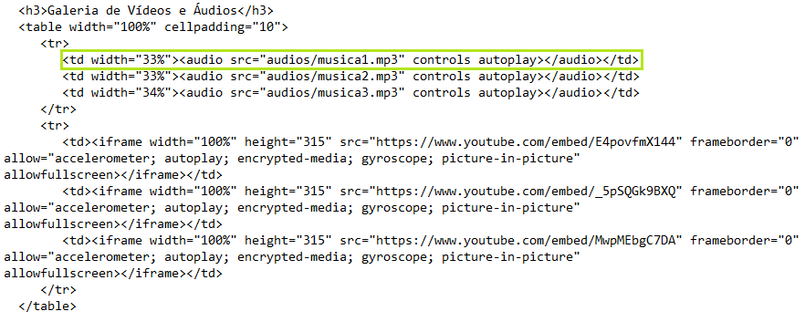
			   <figcaption>Agora você pode "aninhar" as tags <code>&lt;audio&gt;</code> dentro das respectivas tags de célula <code>&lt;td&gt;</code>. Cuidado com as extensões e os caminhos dos arquivos!</figcaption>
		   </li>
		   <li>
			   <input type="radio" id="059" name="sl">
			   <label for="059"></label>
			   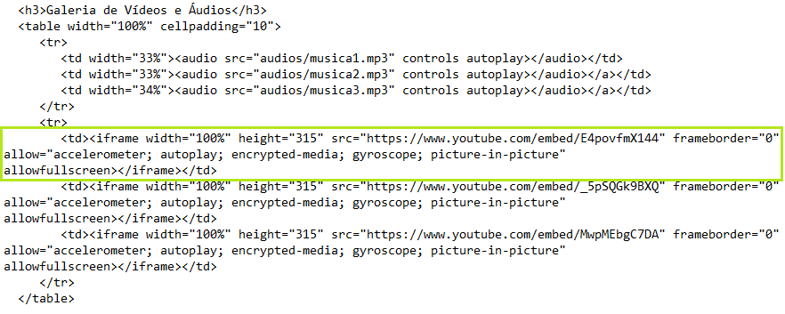
			   <figcaption>Na linha de vídeos, você pode pegar as estruturas das tags <code>&lt;iframe&gt;</code> do Youtube, ou criar tags <code>&lt;video&gt;</code>. Estas tags devem estar "aninhadas" nas respectivas tags de célula <code>&lt;td&gt;</code>.</figcaption>
		   </li>
		   <li>
			   <input type="radio" id="059a" name="sl">
			   <label for="059a"></label>
			   <figcaption>
<button type="button" onclick="copyEvent('cod59', 'cd59')" onmouseout="outFunc('cd59')">Copiar o código</button>
Trecho do código HTML com galeria em formato de tabela:
<pre><code id="cod59">&lt;body&gt;
	&lt;h3&gt;Galeria de Vídeos e Áudios&lt;/h3&gt;
	<a alt="tag de tabela &lt;table&gt; com margens internas de 10px">&lt;table width="100%" cellpadding="10"&gt;</a>     
		<a alt="tag de início da primeira linha &lt;tr&gt; da tabela">&lt;tr&gt;</a>
			<a alt="primeira célula &lt;td&gt; com áudio salvo na pasta audios, largura de 33%">&lt;td width="33%"&gt;&lt;audio src="audios/musica1.mp3 autoplay"&gt;&lt;/audio&gt;&lt;/td&gt;</a>
			&lt;td width="33%"&gt;&lt;audio src="audios/musica2.mp3 autoplay"&gt;&lt;/audio&gt;&lt;/td&gt;
			<a alt="terceira célula &lt;td&gt; com áudio salvo na pasta audios, largura de 34%">&lt;td width="34%"&gt;&lt;audio src="audios/musica3.mp3 autoplay"&gt;&lt;/audio&gt;&lt;/td&gt;</a>
		&lt;/tr&gt; 
		<a alt="tag de início da segunda linha &lt;tr&gt; da tabela">&lt;tr&gt;</a>
			<a alt="primeira célula &lt;td&gt; com vídeo do youtube com tag &lt;iframe&gt;">&lt;td&gt;&lt;iframe width="100%" height="315" src="https://www.youtube.com/embed/E4povfmX144" frameborder="0" allow="accelerometer; autoplay; encrypted-media; gyroscope; picture-in-picture" allowfullscreen&gt;&lt;/iframe&gt;&lt;/td&gt;</a>
			&lt;td&gt;&lt;iframe width="100%" height="315" src="https://www.youtube.com/embed/_5pSQGk9BXQ" frameborder="0" allow="accelerometer; autoplay; encrypted-media; gyroscope; picture-in-picture" allowfullscreen&gt;&lt;/iframe&gt;&lt;/td&gt;
			<a alt="terceira célula &lt;td&gt; com vídeo do youtube com tag &lt;iframe&gt;">&lt;td&gt;&lt;iframe width="100%" height="315" src="https://www.youtube.com/embed/_5pSQGk9BXQ" frameborder="0" allow="accelerometer; autoplay; encrypted-media; gyroscope; picture-in-picture" allowfullscreen&gt;&lt;/iframe&gt;&lt;/td&gt;</a>
		&lt;/tr&gt;
	&lt;/table&gt;
&lt;/body&gt; 
&lt;/html&gt;</code></pre>
</figcaption>
		   </li> 
		</ul>
		
  

  
<a href="#basico" class="topo">voltar ao topo</a>

  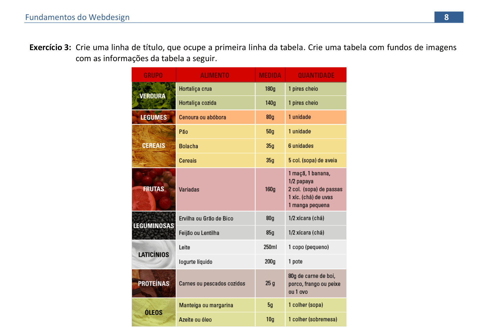
  

&#x1f4c3; Tabela de nutrientes

	
Vamos criar uma pasta para alguns exercícios: <code>webdesign/exercicios</code>. Crie a página do primeiro exercício com o nome <code>webdesign/exercicios/index.htm</code>.

	  <ul class="slider">
		  <li>
			   <input type="radio" id="060" name="sl">
			   <label for="060"></label>
			   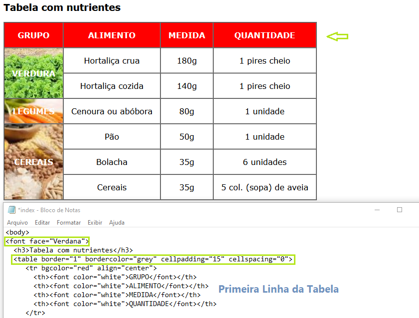
			   <figcaption>Cada célula da tabela tem margem iterna <code>cellpadding</code> de <b>15px</b>, borda na cor <b>cinza</b>. O atributo <code>cellspacing</code> está com valor 0 para não deixar espaços entre as células.</figcaption>
		   </li>
		   <li>
			   <input type="radio" id="061" name="sl">
			   <label for="061"></label>
			   
			   <figcaption>As tags para criar a primeira linha da tabela usam linha de título <code>&lt;th&gt;</code>, com alinhamento <b>centralizado</b>, fonte com a cor branca e o fundo de cada célula vermelho.</figcaption>
		   </li>
		   <li>
			   <input type="radio" id="062" name="sl">
			   <label for="062"></label>
			   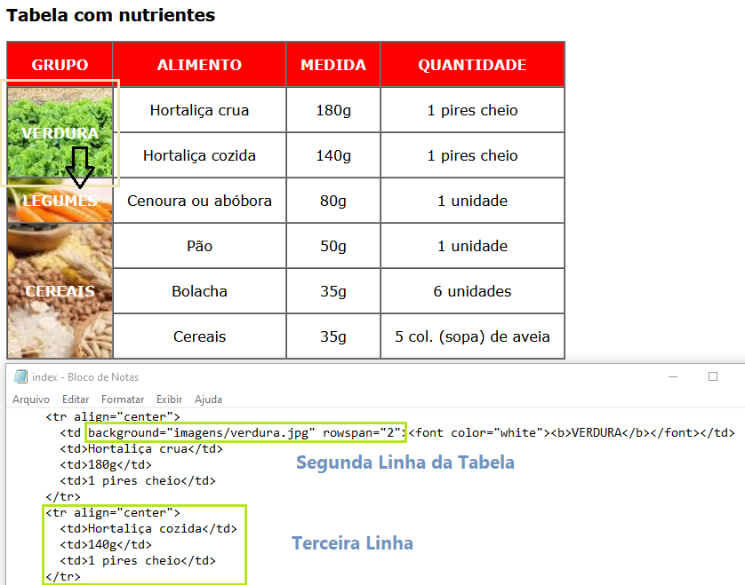
			   <figcaption>A segunda linha tem 2 células mescladas na primeira coluna. Para fazer esta operação em HTML usamos o atributo <code>rowspan</code>, indicando quantas linhas serão mescladas. Neste caso, usamos <code>rowspan="2"</code>.</figcaption>
		   </li>
		   <li>
			   <input type="radio" id="063" name="sl">
			   <label for="063"></label>
			   
			   <figcaption>Temos as outras 3 células da linha 2 normalmente. Como a primeira célula da terceira linha foi mesclada, precisamos apenas das outras 3 células nesta linha.</figcaption>
		   </li>
		   <li>
			   <input type="radio" id="064" name="sl">
			   <label for="064"></label>
			   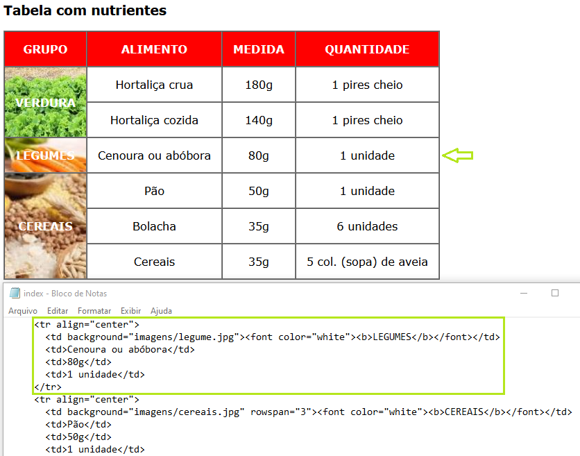
			   <figcaption>A linha dos legumes não tem células mescladas, e os elementos são criados com tags <code>&lt;td&gt;</code>.</figcaption>
		   </li>
		   <li>
			   <input type="radio" id="065" name="sl">
			   <label for="065"></label>
			   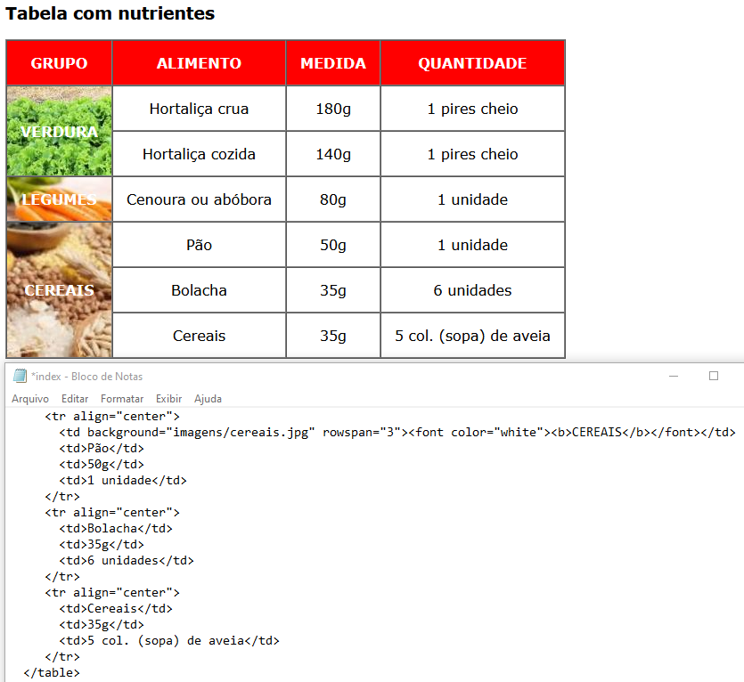
			   <figcaption>Na linha dos cereais, podemos mesclar as três células da primeira coluna com o atributo <code>rowspan="3"</code>. As outras 2 linhas da tabela têm 3 células com os valores indicados no exemplo. Agora complete esta tabela, que vamos utilizar na próxima Atividade.</figcaption>
		   </li>
		   <li>
			   <input type="radio" id="065a" name="sl">
			   <label for="065a"></label>
			   <figcaption>
<button type="button" onclick="copyEvent('cod60', 'cd60')" onmouseout="outFunc('cd60')">Copiar o código</button>
Trecho do código HTML com a tabela de nutrientes:
<pre><code id="cod60">&lt;body&gt;
	&lt;h3&gt;Tabela de nutrientes&lt;/h3&gt;
	<a alt="tag de tabela &lt;table&gt; com borda cinza de 1px&#10;margens das células: internas de 15px e sem margens externas">&lt;table border="1" bordercolor="grey" cellpadding="15" cellspacing="0"&gt;</a>     
		<a alt="tag de início da primeira linha &lt;tr&gt; da tabela&#10;linha com fundo vermelho e alinhamento centralizado">&lt;tr bgcolor="red" align="center"&gt;</a>
			<a alt="tag da primeira célula de título &lt;th&gt;">&lt;th&gt;&lt;font color="white"&gt;GRUPO&lt;/font&gt;&lt;/th&gt;</a>
			&lt;th&gt;&lt;font color="white"&gt;ALIMENTO&lt;/font&gt;&lt;/th&gt;
			&lt;th&gt;&lt;font color="white"&gt;MEDIDA&lt;/font&gt;&lt;/th&gt;
			&lt;th&gt;&lt;font color="white"&gt;QUANTIDADE&lt;/font&gt;&lt;/th&gt;
		&lt;/tr&gt; 
		<a alt="tag de início da segunda linha &lt;tr&gt; da tabela com alinhamento centralizado">&lt;tr align="center"&gt;</a>
			<a alt="tag de célula &lt;td&gt; com imagem de fundo de verdura&#10;célula mesclada com a célula de baixo com o atributo rowspan: 2">&lt;td background="imagens/verdura.jpg" rowspan="2"&gt;&lt;font color="white"&gt;&lt;b&gt;VERDURA&lt;/b&gt;&lt;/font&gt;&lt;/td&gt;</a>
			&lt;td&gt;Hortaliça crua&lt;/td&gt;
			&lt;td&gt;180g&lt;/td&gt;
			&lt;td&gt;1 pires cheio&lt;/td&gt;
		&lt;/tr&gt;
		<a alt="tag de início da terceira linha &lt;tr&gt; da tabela">&lt;tr align="center"&gt;</a>
			<a alt="tag de célula &lt;td&gt; após as células mescladas da linha anterior">&lt;td&gt;Hortaliça cozida&lt;/td&gt;</a> 
			&lt;td&gt;140g&lt;/td&gt;
			&lt;td&gt;1 pires cheio&lt;/td&gt;
		&lt;/tr&gt;
	&lt;/table&gt;
&lt;/body&gt; 
&lt;/html&gt;</code></pre>
</figcaption>
		   </li>
		</ul>
		
  

  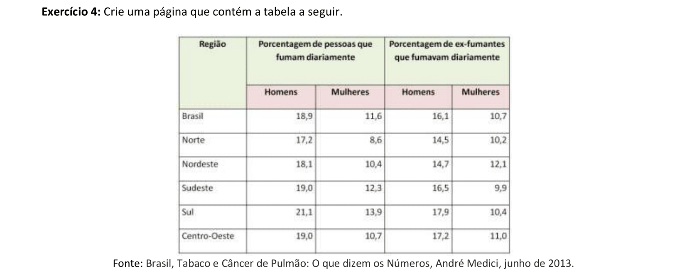
  

&#x1f4c3; Pesquisa fumantes

	
Este exercício é parecido com o anterior. Na mesma pasta, crie um arquivo: <code>webdesign/exercicios/fumantes.htm</code>.

	  <ul class="slider">
		  <li>
			   <input type="radio" id="066" name="sl">
			   <label for="066"></label>
			   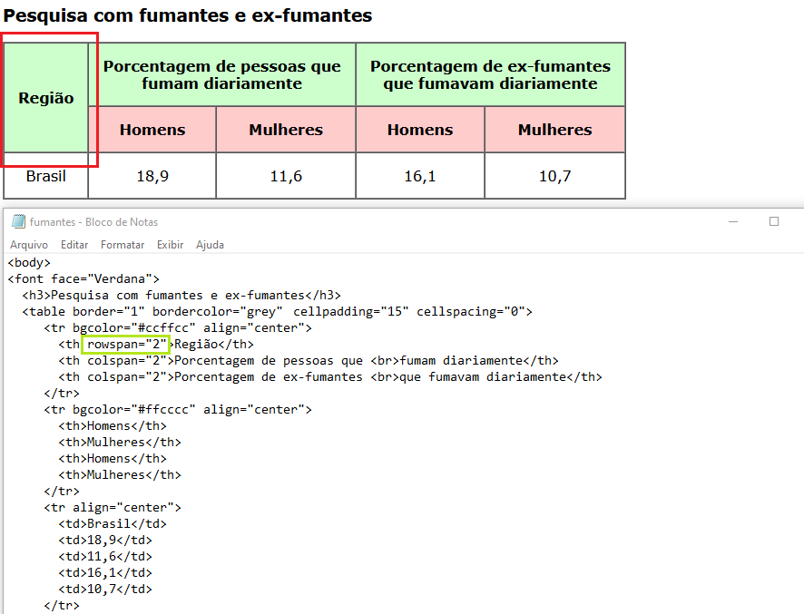
			   <figcaption>A primeira célula da primeira linha será mesclada com a célula de baixo. Logo, vamos usar o atributo <code>rowspan="2"</code>.</figcaption>
		   </li>
		   <li>
			   <input type="radio" id="067" name="sl">
			   <label for="067"></label>
			   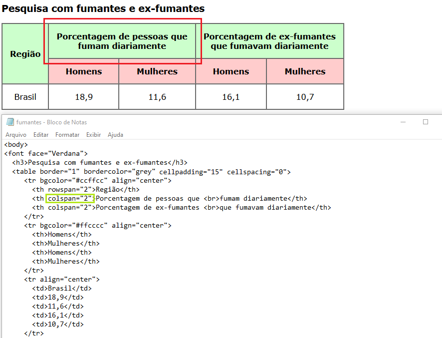
			   <figcaption>A segunda célula da primeira linha será mesclada com a célula do lado. Logo, vamos usar o atributo <code>colspan="2"</code>.</figcaption>
		   </li>
		   <li>
			   <input type="radio" id="068" name="sl">
			   <label for="068"></label>
			   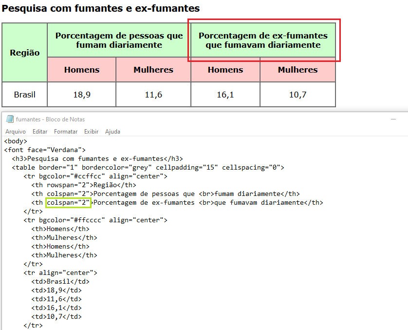
			   <figcaption>O mesmo acontece com a quarta célula da primeira linha: <code>colspan="2"</code>. Agora prossiga para concluir a página HTML com esta tabela.</figcaption>
		   </li>
		   <li>
			   <input type="radio" id="068a" name="sl">
			   <label for="068a"></label>
			   <figcaption>
<button type="button" onclick="copyEvent('cod61', 'cd61')" onmouseout="outFunc('cd61')">Copiar o código</button>
Trecho do código HTML com a tabela de pesquisa com fumantes:
<pre><code id="cod61">&lt;body&gt;
	&lt;h3&gt;Pesquisa com fumantes e ex-fumantes&lt;/h3&gt;
	<a alt="tag da tabela &lt;table&gt; com borda cinza de 1px&#10;margens internas de 15px e sem margens externas">&lt;table border="1" bordercolor="grey" cellpadding="15" cellspacing="0"&gt;</a>     
		<a alt="tag de início da primeira linha &lt;tr&gt; da tabela">&lt;tr bgcolor="#ccffcc" align="center"&gt;</a>
			<a alt="tag da primeira célula de título &lt;th&gt;&#10;célula mesclada com a de baixo usando o atributo rowspan: 2">&lt;th rowspan="2"&gt;Região;&lt;/th&gt;</a>
			<a alt="tag da segunda célula de título &lt;th&gt;&#10;célula mesclada com a do lado usando o atributo colspan: 2">&lt;th colspan="2"&gt;Porcentagem de pessoas que &lt;br&gt;fumam diariamente&lt;/th&gt;</a>
			<a alt="tag da terceira célula de título &lt;th&gt;&#10;célula mesclada com a do lado usando o atributo colspan: 2">&lt;th colspan="2"&gt;Porcentagem de ex-fumantes &lt;br&gt;que fumavam diariamente&lt;/th&gt;</a>
		&lt;/tr&gt; 
		<a alt="tag de início da segunda linha &lt;tr&gt; da tabela">&lt;tr bgcolor="#ffcccc" align="center"&gt;</a>
			&lt;th&gt;Homens&lt;/th&gt;
			&lt;th&gt;Mulheres&lt;/th&gt;
			&lt;th&gt;Homens&lt;/th&gt;
			&lt;th&gt;Mulheres&lt;/th&gt;
		&lt;/tr&gt;
		<a alt="tag de início da terceira linha &lt;tr&gt; da tabela">&lt;tr align="center"&gt;</a>
			&lt;td&gt;Brasil&lt;/td&gt;
			&lt;td&gt;18,9&lt;/td&gt;
			&lt;td&gt;11,6&lt;/td&gt;
			&lt;td&gt;16,1&lt;/td&gt;
			&lt;td&gt;10,7&lt;/td&gt;
		&lt;/tr&gt;
	&lt;/table&gt;
&lt;/body&gt; 
&lt;/html&gt;</code></pre>
</figcaption>
		   </li>
		</ul>
		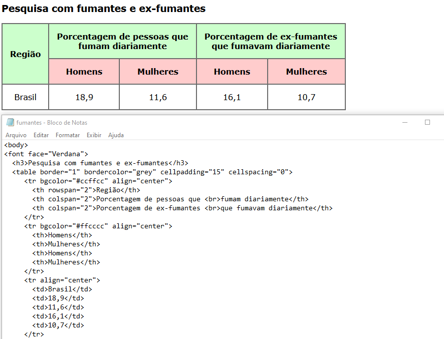
  

  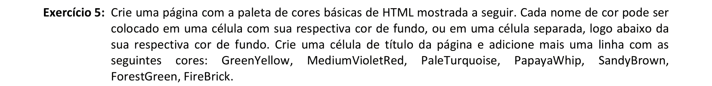
  
<a href="#basico" class="topo">voltar ao topo</a>

  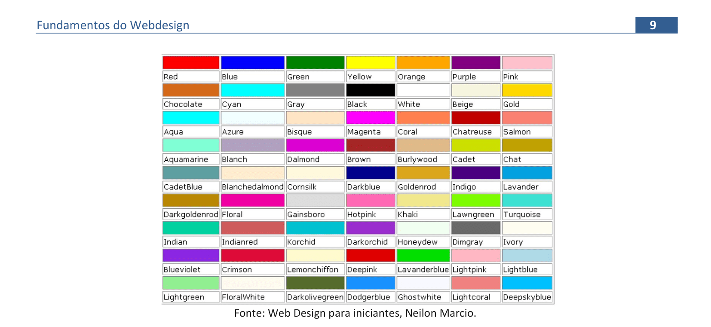
  

&#x1f4c3; Tabela de cores

	
Neste exercício vamos criar uma tabela de cores. O exemplo mostra apenas alguns nomes de cores usados em HTML. Na mesma pasta, crie um arquivo: <code>webdesign/exercicios/cores.htm</code>.

	  <ul class="slider">
		  <li>
			   <input type="radio" id="069" name="sl">
			   <label for="069"></label>
			   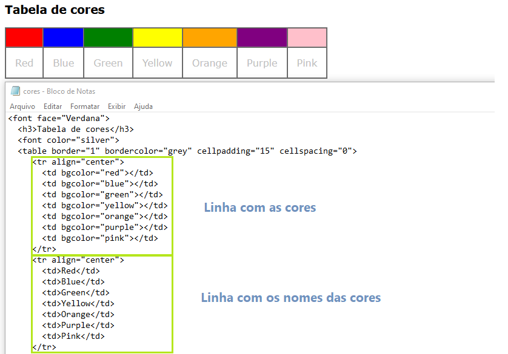
			   <figcaption>Temos duas formas de fazer esta tabela. A primeira é usando exatamente o layout mostrado no exercício. Dessa forma, criaremos sempre 1 linha que mostra somente as cores, e a linha de baixo mostra apenas os nomes das cores.</figcaption>
		   </li>
		   <li>
			   <input type="radio" id="070" name="sl">
			   <label for="070"></label>
			   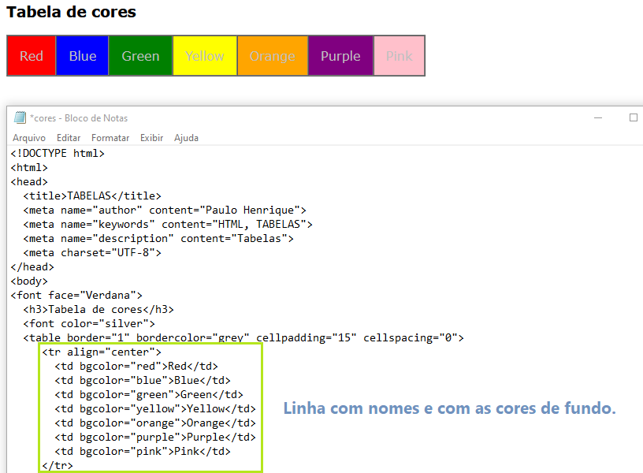
			   <figcaption>Na segunda maneira, podemos criar na mesma célula o nome da cor, com o fundo de mesma cor. Escolha um dos layouts e faça a página completa com a tabela de cores.</figcaption>
		   </li>
		</ul>
		
  

  

		<iframe width="100%" src="https://www.youtube.com/embed/VjBU3Y-2Wwg" frameborder="0" allow="accelerometer; clipboard-write; encrypted-media; gyroscope; picture-in-picture" allowfullscreen></iframe>
  
  
  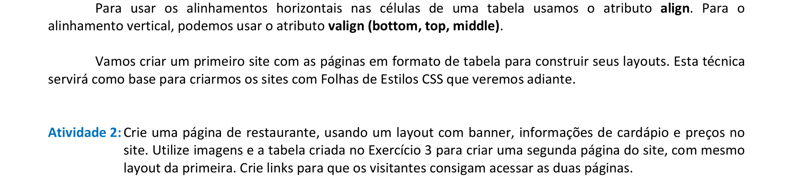
  

&#x1f4c3; Detalhes da Atividade

	
A partir desta página, vamos utilizar o software <b>NOTEPAD++</b> para criar nossos próximos projetos. Acesse o endereço <a href="https://notepad-plus-plus.org/downloads/v8.4.2/" target="_blank">https://notepad-plus-plus.org/downloads/v8.4.2/</a> e instale a versão correspondente do seu computador: 32 ou 64 bits. Crie uma pasta <code>webdesign/atividade2</code> para criar os arquivos da próxima atividade. A página principal terá o nome <code>index.htm</code>.

	  <ul class="slider">
		  <li>
			   <input type="radio" id="071" name="sl">
			   <label for="071"></label>
			   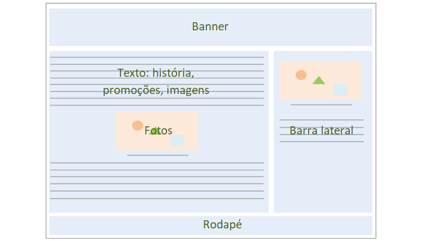
			   <figcaption>O layout da página do nosso site principal da Atividade 2 será feito usando tabelas. A estrutura está mostrada neste exemplo. A primeira tag, logo após começar o corpo da página será <code>&lt;table&gt;</code>.</figcaption>
		   </li>
		   <li>
			   <input type="radio" id="072" name="sl">
			   <label for="072"></label>
			   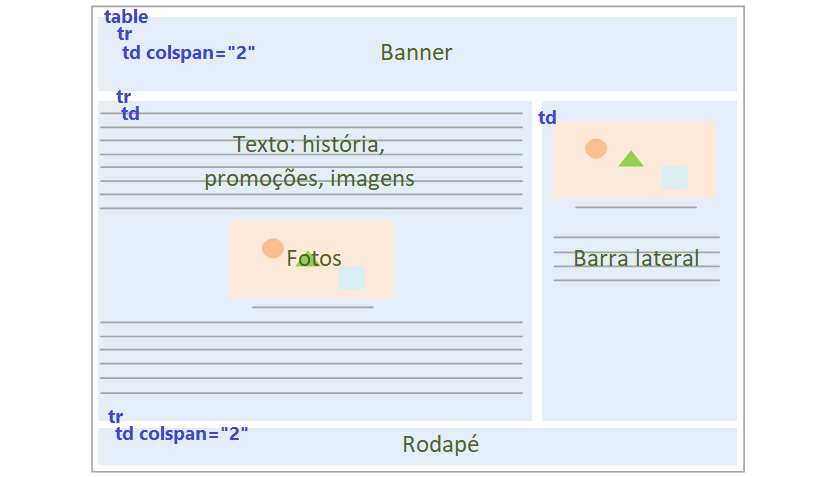
			   <figcaption>O banner da página ocupará o espaço de 2 células, e por isso aplicamos o atributo <code>colspan="2"</code>. Na segunda linha da tabela, criamos uma célula para o conteúdo principal, e outra para a barra lateral com as tags <code>&lt;tr&gt;</code> e <code>&lt;td&gt;</code></figcaption>
		   </li>
		   <li>
			   <input type="radio" id="073" name="sl">
			   <label for="073"></label>
			   
			   <figcaption>Para finalizar, colocamos o rodapé da página. Este item será inserido com as tags <code>&lt;tr&gt;</code> e <code>&lt;td&gt;</code> usando o atributo de <code>colspan="2"</code> para usar a largura toda da página.</figcaption>
		   </li>
		   <li>
			   <input type="radio" id="074" name="sl">
			   <label for="074"></label>
			   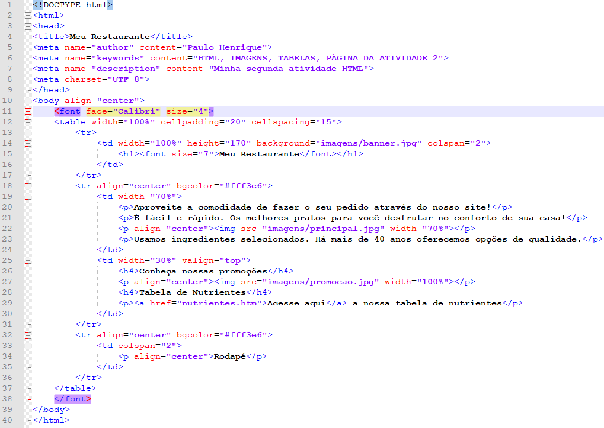
			   <figcaption>A tag de fonte pode ser usada antes da tabela de layout da página. O <b>Notepad++</b> coloca em destaque quando reconhece tags fechadas, facilitando muito a programação da página.</figcaption>
		   </li>
		   <li>
			   <input type="radio" id="075" name="sl">
			   <label for="075"></label>
			   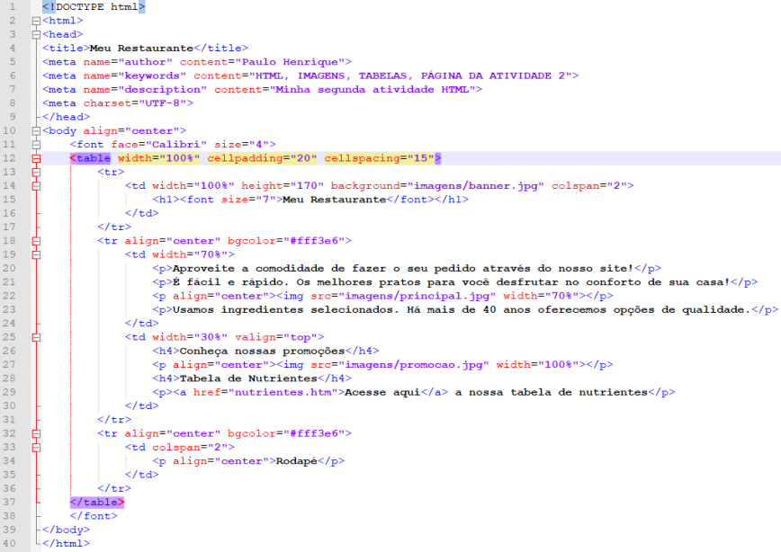
			   <figcaption>As propriedades <code>cellspacing</code> e <code>cellpadding</code> são usadas para fazer as margens interna e externa de cada parte do layout da página. A largura da tabela deve ser de <b>100%</b> para distribuir todo o conteúdo na tela do navegador.</figcaption>
		   </li>
		   <li>
			   <input type="radio" id="076" name="sl">
			   <label for="076"></label>
			   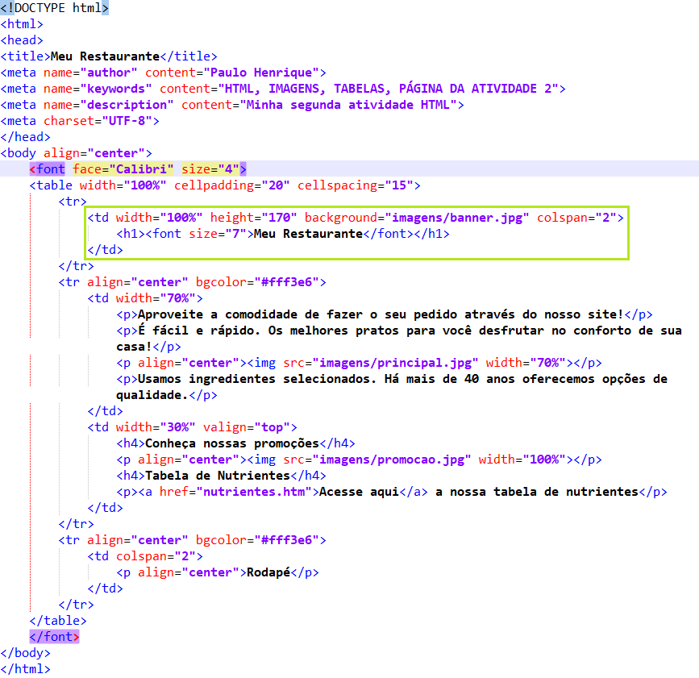
			   <figcaption>A primeira linha, indicada com a tag <code>&lt;tr&gt;</code> contém o banner, com o atributo <code>colspan="2"</code> dentro da tag da célula <code>&lt;td&gt;</code>.</figcaption>
		   </li>
		   <li>
			   <input type="radio" id="077" name="sl">
			   <label for="077"></label>
			   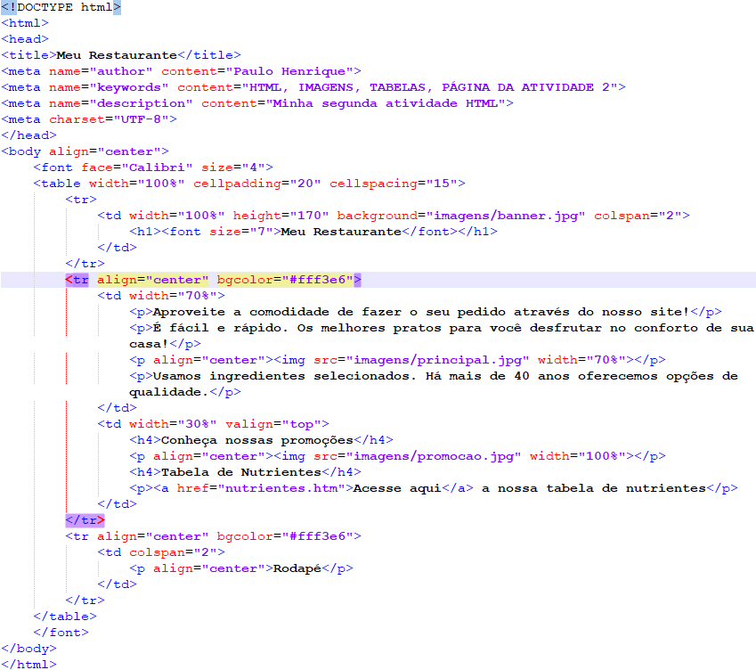
			   <figcaption>A segunda linha da tabela contém a primeira célula do conteúdo principal da página, com a largura de <b>70%</b> e a barra lateral com largura de <b>30%</b>. Dentro das tags <code>&lt;td&gt;</code> podemos inserir os textos e imagens da página.</figcaption>
		   </li>
		   <li>
			   <input type="radio" id="078" name="sl">
			   <label for="078"></label>
			   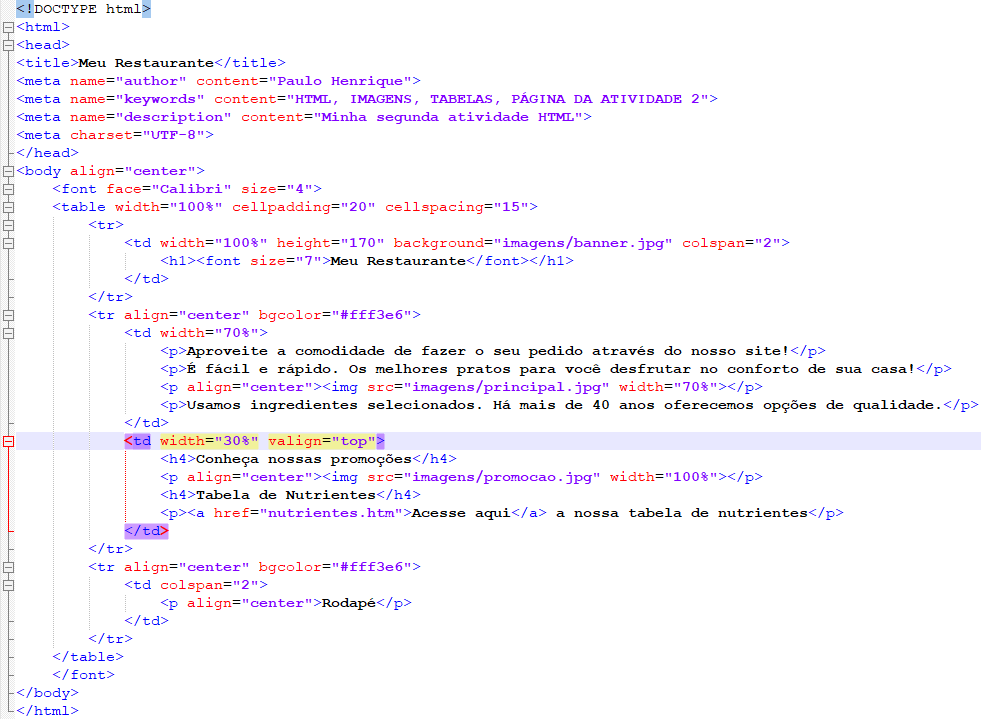
			   <figcaption>Note que o conteúdo da barra lateral geralmente é menor do que o conteúdo principal da página. Por isso, podemos usar o atributo de alinhamento vertical <code>valign="top"</code> para deixar estas partes do site alinhadas. Repare no link para acessar a página de nutrientes.</figcaption>
		   </li>
		   <li>
			   <input type="radio" id="079" name="sl">
			   <label for="079"></label>
			   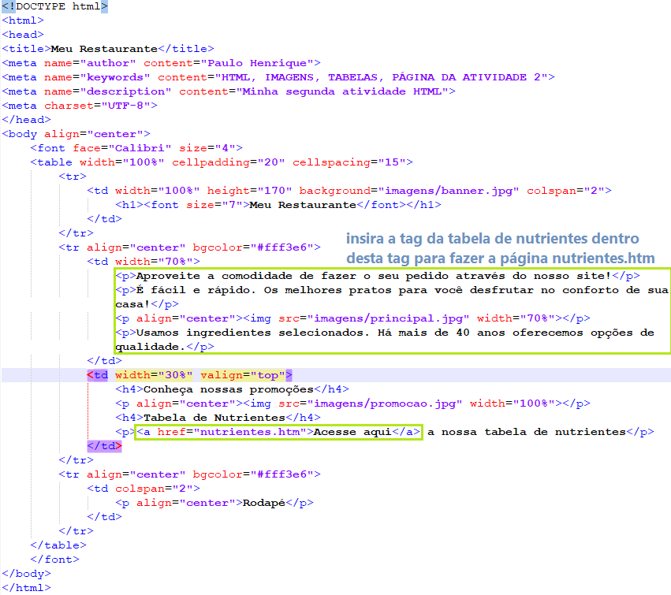
			   <figcaption>Usando o layout dessa página, você pode criar a página <code>nutrientes.htm</code> na mesma pasta da página <code>index.htm</code>. Pegue todo o código da tabela que fizemos dos nutrientes e insira na tag principal desta página (a que tem <b>70%</b> de largura).</figcaption>
			   </li>
		   <li>
			   <input type="radio" id="080" name="sl">
			   <label for="080"></label>
			   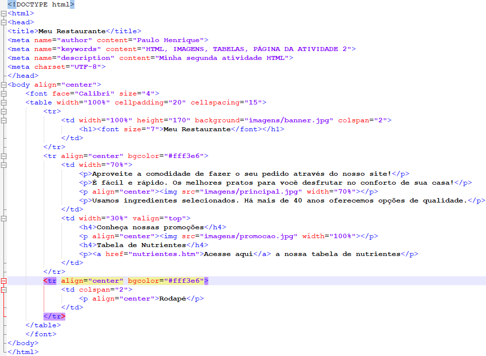
			   <figcaption>A tag da última linha da tabela contém o rodapé. Nesta tag <code>&lt;td&gt;</code> você pode modificar a cor, alinhamento ou colocar uma imagem de fundo, como foi feito no banner.</figcaption>
		   </li>
		   <li>
			   <input type="radio" id="081" name="sl">
			   <label for="081"></label>
			   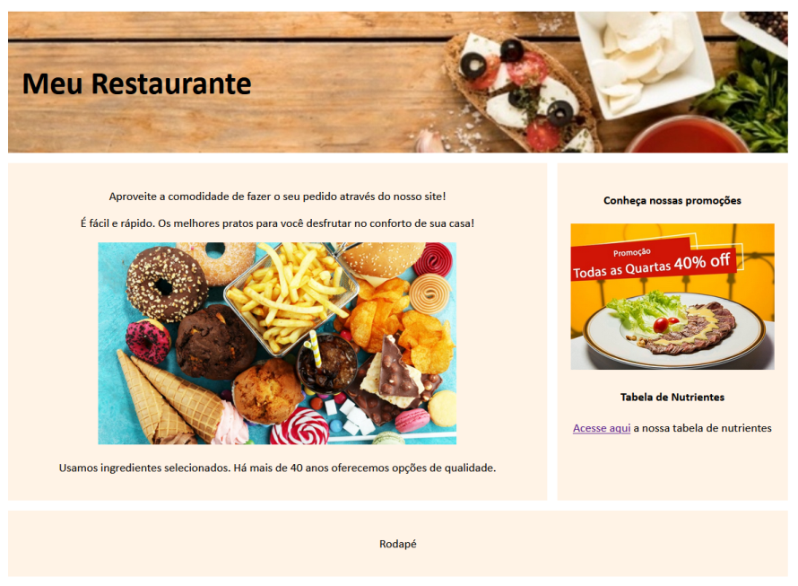
			   <figcaption>O layout mostrado neste exemplo fica desta forma. Usando a estrutura mostrada neste exemplo, crie o site de um restaurante.</figcaption>
		   </li>
		   <li>
			   <input type="radio" id="081a" name="sl">
			   <label for="081a"></label>
			   <figcaption>
<button type="button" onclick="copyEvent('cod62', 'cd62')" onmouseout="outFunc('cd62')">Copiar o código</button>
Trecho do código HTML da estrutura da Atividade 2:
<pre><code id="cod62"><a alt="trecho que mostra a programação a partir da tag &lt;body&gt;&#10;não esqueça de colocar as tags iniciais de cabeçalho desta atividade">&lt;body align="center"&gt;</a>
	<a alt="tag &lt;font&gt; para a página toda, com fechamento no final da programação">&lt;font face="Calibri" size="4"&gt;</a>
	<a alt="tag da tabela &lt;table&gt; com margens internas de 20px e externas de 15px">&lt;table width="100%" cellpadding="20" cellspacing="15"&gt;</a>     
		<a alt="tag da primeira linha &lt;tr&gt; para definir o banner">&lt;tr&gt;</a>
			<a alt="tag de célula &lt;td&gt; para definir a imagem do banner&#10;célula mesclada com a do lado com o atributo colspan: 2&#10;definição de um título com tag &lt;h1&gt;">&lt;td width="100%" height="170" background="imagens/banner.jpg" colspan="2"&gt;</a>
				&lt;h1&gt;&lt;font size="7"&gt;Meu Restaurante&lt;/font&gt;&lt;/h1&gt;
			&lt;/td&gt;
		&lt;/tr&gt; 
		<a alt="tag da segunda linha &lt;tr&gt; com conteúdo e barra lateral">&lt;tr align="center" bgcolor="#fff3e6"&gt;</a>
			<a alt="tag de célula &lt;td&gt; que define o conteúdo principal da página&#10;a largura fica maior, por exemplo, com 70%">&lt;td width="70%"&gt;</a>
				&lt;p&gt;Aproveite a comodidade de fazer o seu pedido através do nosso site!&lt;/p&gt;
				&lt;p&gt;É fácil e rápido. Os melhores pratos para você desfrutar no conforto de sua casa!&lt;/p&gt;
				&lt;p align="center"&gt;&lt;img src="imagens/principal.jpg" width="70%"&gt;&lt;/p&gt;
				&lt;p&gt;Usamos ingredientes selecionados. Há mais de 40 anos oferecemos opções de qualidade.&lt;/p&gt;
			&lt;/td&gt;
			<a alt="tag de célula &lt;td&gt; que define a barra lateral da página&#10;a largura fica menor, por exemplo, com 30%">&lt;td width="30%" valign="top"&gt;</a>
				&lt;h4&gt;Conheça nossas promoções&lt;/h4&gt;
				&lt;p align="center"&gt;&lt;img src="imagens/promocao.jpg" width="100%"&gt;&lt;/p&gt;
				&lt;h4&gt;Tabela de Nutrientes&lt;/h4&gt;
				<a alt="insira o link para a página de nutrientes do exercício 3&#10;não esqueça de salvar a página no mesmo diretório desta atividade">&lt;p&gt;&lt;a href="nutrientes.htm"&gt;Acesse aqui&lt;/a&gt; a nossa tabela de nutrientes&lt;/p&gt;</a>
			&lt;/td&gt;
		&lt;/tr&gt;
		<a alt="tag da terceira linha &lt;tr&gt; com o rodapé da página">&lt;tr align="center" bgcolor="#fff3e6"&gt;</a>
			<a alt="tag de célula &lt;td&gt; para definir o rodapé&#10;célula mesclada com a do lado com o atributo colspan: 2">&lt;td colspan="2"&gt;</a>
				&lt;p align="center"&gt;Rodapé &amp;copy; 2020&lt;/p&gt;
			&lt;/td&gt;
		&lt;/tr&gt; 
	&lt;/table&gt;
	&lt;/font&gt;
&lt;/body&gt;</code></pre>
</figcaption>
		   </li>	   
		</ul>
		
  

  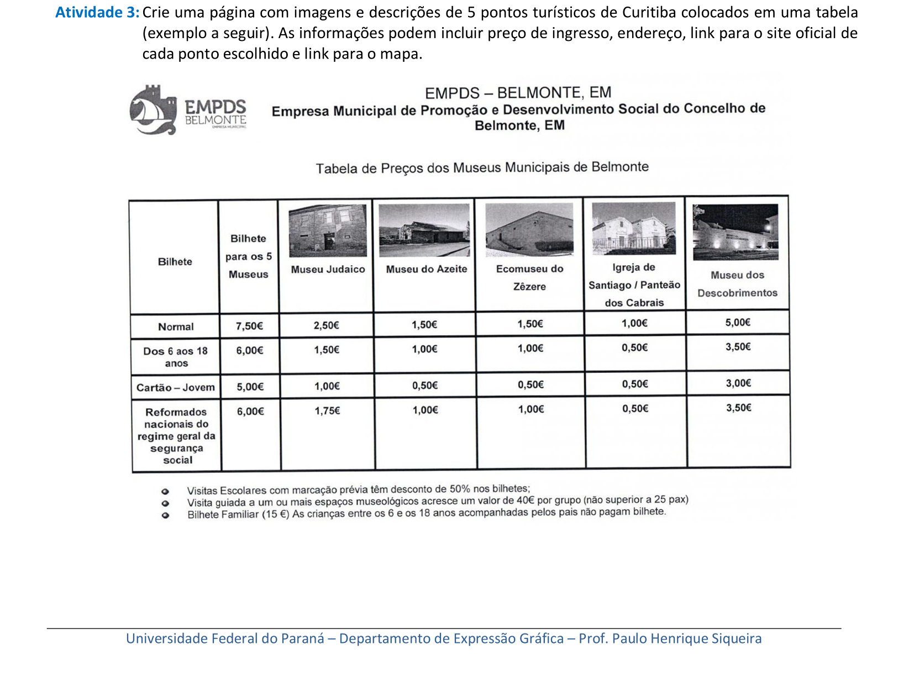
  
<a href="#basico" class="topo">voltar ao topo</a>

  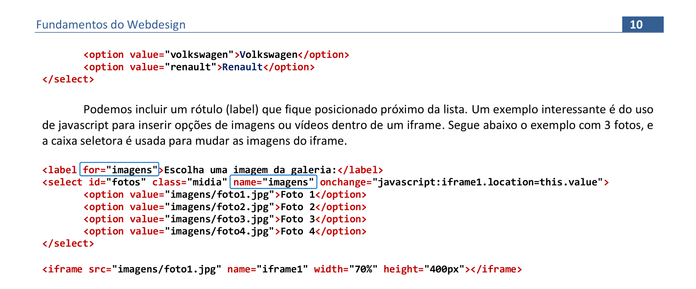
  

&#x1f4c3; Seletor de imagens

	
Neste exemplo, vamos criar uma página com o seletor de imagens mostrado na apostila. Crie um arquivo chamado <code>webdesign/exercicios/seletor.htm</code> na nossa pasta de exercícios. Dentro da pasta de imagens, coloque 4 arquivos. No exemplo mostrado a seguir, estes arquivos estão com os nomes <b>Foto1.jpg</b>, <b>Foto2.jpg</b>, <b>Foto3.jpg</b> e <b>Foto4.jpg</b>.

	  <ul class="slider">
		  <li>
			   <input type="radio" id="082" name="sl">
			   <label for="082"></label>
			   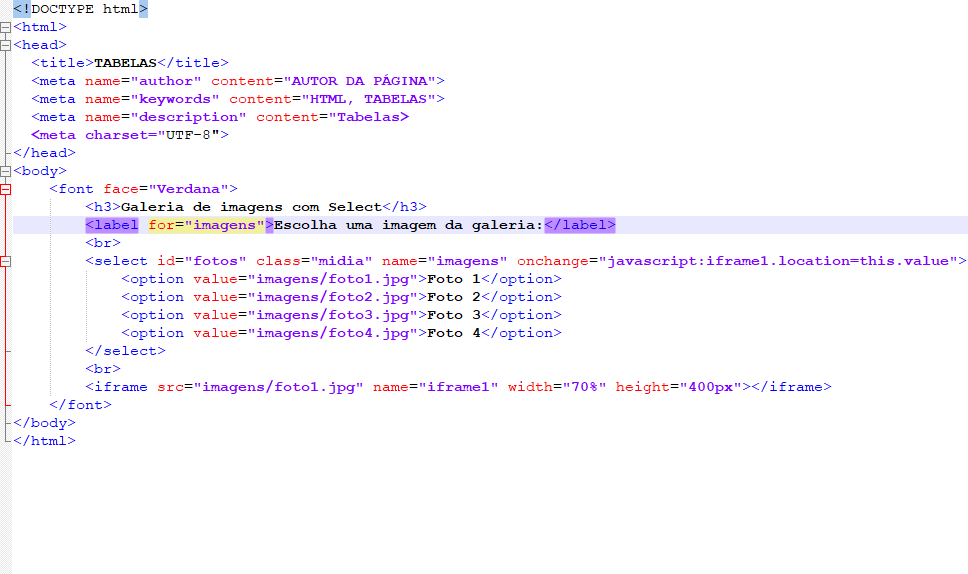
			   <figcaption>O rótulo <code>&lt;label&gt;</code> foi colocado antes da caixa de seleção.</figcaption>
		   </li>
		   <li>
			   <input type="radio" id="083" name="sl">
			   <label for="083"></label>
			   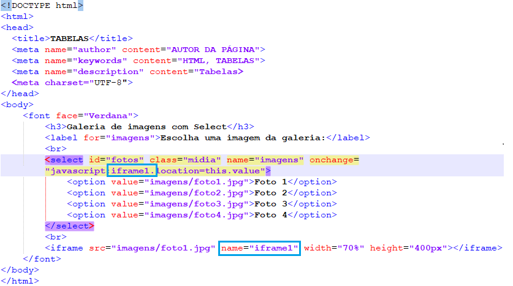
			   <figcaption>Para que o javascript funcione corretamente, o nome <code>iframe1</code> deve ser o mesmo da tag <code>iframe</code>. Preste atenção nos nomes dos arquivos de imagens e seus caminhos para que a página funcione.</figcaption>
		   </li>
		   <li>
			   <input type="radio" id="084" name="sl">
			   <label for="084"></label>
			   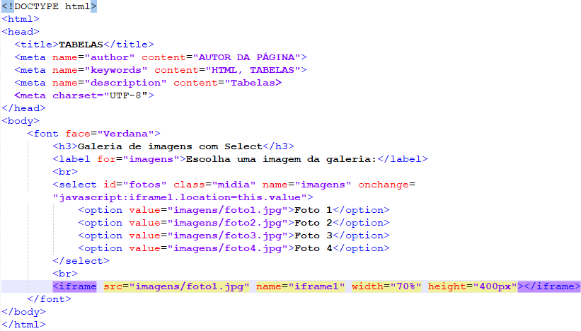
			   <figcaption>A tag do <code>&lt;iframe&gt;</code> deve conter informações de largura e altura, como fizemos nas páginas anteriores que usaram este recurso. Na próxima atividade, vamos usar a tag <code>&lt;select&gt;</code> para mudar páginas.</figcaption>
		   </li>
		   <li>
			   <input type="radio" id="084a" name="sl">
			   <label for="084a"></label>
			   <figcaption>
<button type="button" onclick="copyEvent('cod63', 'cd63')" onmouseout="outFunc('cd63')">Copiar o código</button>
Trecho do código HTML da galeria de imagens com Select:
<pre><code id="cod63">&lt;body align="center"&gt;
	&lt;font face="Verdana"&gt;
	">&lt;h3&gt;Galeria de imagens com Select&lt;/h3&gt;
		<a alt="tag de rótulo &lt;label&gt; para a lista seletora com nome imagens">&lt;label for="imagens"&gt;Escolha uma imagem da galeria:&lt;/label&gt;</a>
		&lt;br&gt;
		<a alt="tag da lista seletora &lt;select&gt; com javascript ligado ao iframe1&#10;a ligação com o iframe serve para mostrar cada imagem selecionada">&lt;select id="fotos" class="midia" name="imagens" onchange="javascript:iframe1.location=this.value"&gt;</a>
			<a alt="cada tag &lt;option&gt; contém uma imagem da galeria">&lt;option value="imagens/foto1.jpg"&gt;Foto 1&lt;/option&gt;</a>
			&lt;option value="imagens/foto2.jpg"&gt;Foto 2&lt;/option&gt;
			&lt;option value="imagens/foto3.jpg"&gt;Foto 3&lt;/option&gt;
			&lt;option value="imagens/foto4.jpg"&gt;Foto 4&lt;/option&gt;
		&lt;/select&gt;
		&lt;br&gt;
		<a alt="tag &lt;iframe&gt; com nome iframe1 linkado com a lista seletora&#10;a imagem da primeira opção foto1.jpg foi deixada como default">&lt;iframe src="imagens/foto1.jpg" name="iframe1" width="70%" height="400px"&gt;&lt;/iframe&gt;</a>
	&lt;/font&gt;
&lt;/body&gt;</code></pre>
</figcaption>
		   </li>
		</ul>
		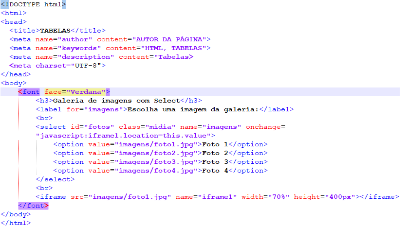
  

  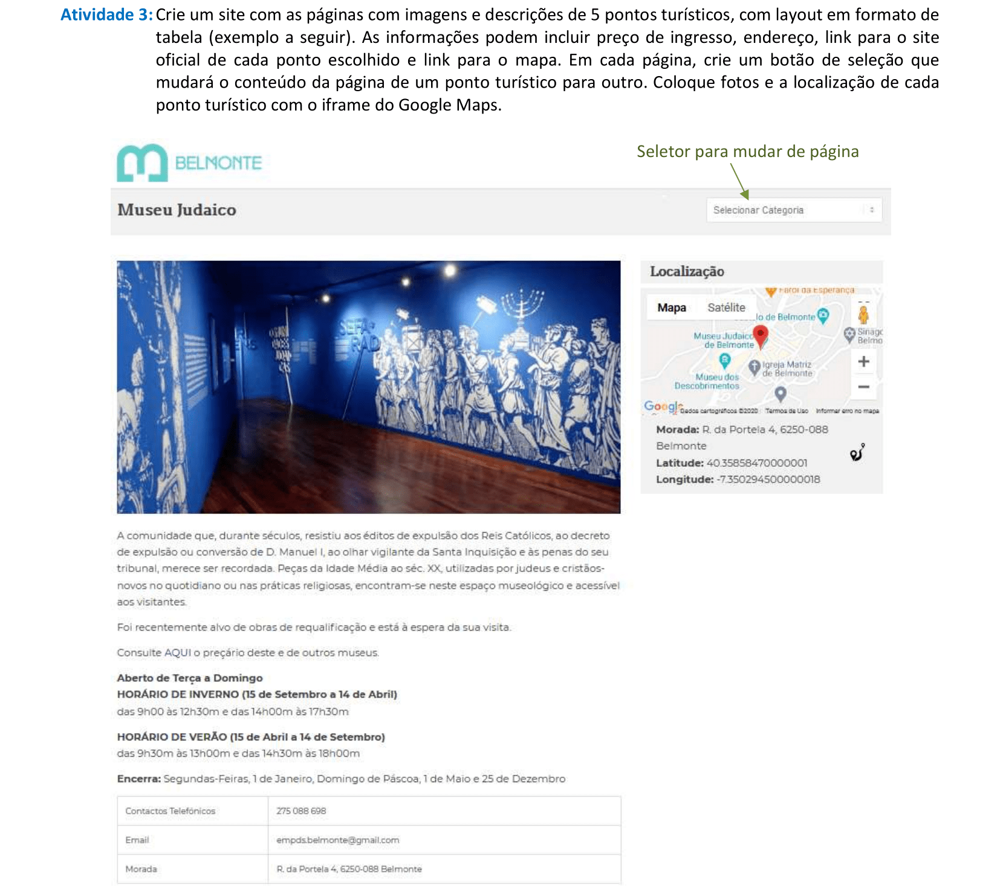
  

&#x1f4c3; Detalhes da Atividade

	
Vamos criar uma pasta <code>webdesign/atividade3</code> para trabalharmos neste projeto. Selecione 5 pontos turísticos, e cada um deles terá uma página, salva na mesma pasta que criamos. Use uma pasta chamada <code>webdesign/atividade3/imagens</code> para os arquivos das fotos. Neste projeto vamos inserir mapas nos sites.

	  <ul class="slider">
		  <li>
			   <input type="radio" id="085" name="sl">
			   <label for="085"></label>
			   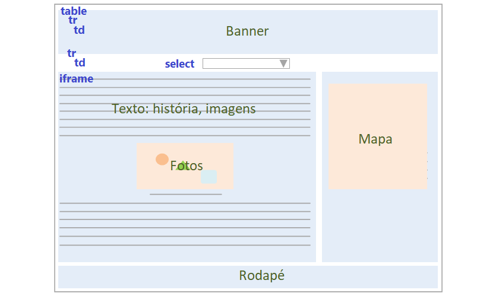
			   <figcaption>O layout da página principal do nosso site da Atividade 3 será feito usando tabelas. Coloque o nome de <code>index.htm</code> nesta página, cuja estrutura está mostrada neste exemplo. A primeira tag, logo após começar o corpo da página será <code>&lt;table&gt;</code>.</figcaption>
		   </li>
		   <li>
			   <input type="radio" id="086" name="sl">
			   <label for="086"></label>
			   
			   <figcaption>O banner da página fica na primeira linha da tabela. Na segunda linha da tabela, criamos uma célula para o conteúdo principal, que terá um seletor de páginas<code>&lt;select&gt;</code> seguido de um <code>&lt;iframe&gt;</code>, ideia parecida com a que usamos na página de Galeria de Fotos anterior.</figcaption>
		   </li>
		   <li>
			   <input type="radio" id="087" name="sl">
			   <label for="087"></label>
			   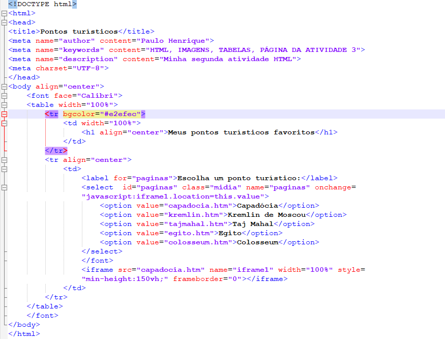
			   <figcaption>No código da página em HTML, a primeira linha da tabela contém a tag do banner. Você pode criar uma imagem de fundo usando o atributo <code>background</code>, como já fizemos em outras páginas.</figcaption>
		   </li>
		   <li>
			   <input type="radio" id="088" name="sl">
			   <label for="088"></label>
			   
			   <figcaption>A estrutura da tag <code>&lt;select&gt;</code> foi usada para as 5 páginas dos pontos turísticos. Crie estas páginas na mesma pasta da página principal, com os nomes dos pontos turísticos. Não use acentuação, e procure criar nomes com poucos caracteres.</figcaption>
		   </li>
		   <li>
			   <input type="radio" id="089" name="sl">
			   <label for="089"></label>
			   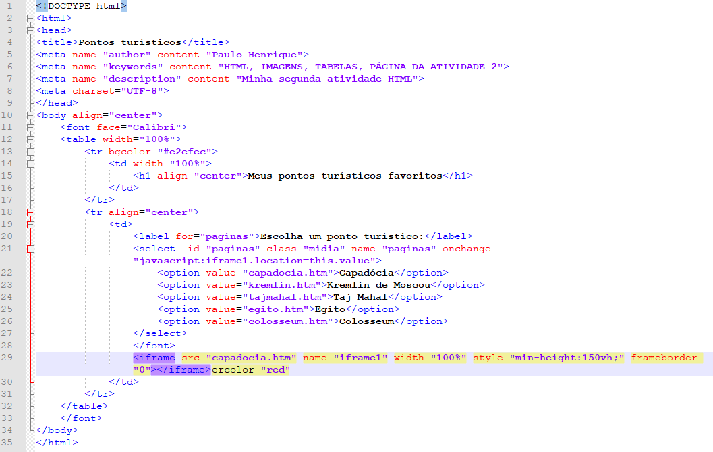
			   <figcaption>Para ajustar a altura da tag <code>&lt;iframe&gt;</code>, podemos usar um estilo com altura mínima de 150% da altura da tela: <code>min-height:150vh</code>. Mais adiante vamos trabalhar com estas formatações.</figcaption>
		   </li>
		   <li>
			   <input type="radio" id="090" name="sl">
			   <label for="090"></label>
			   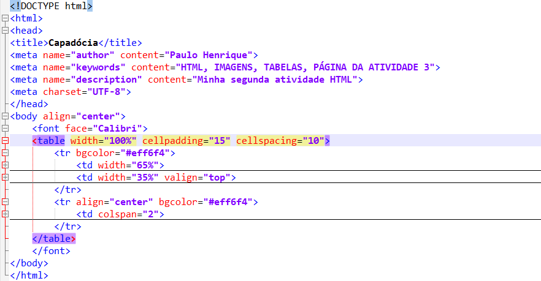
			   <figcaption>Agora vamos ver como fica o layout de uma das páginas dos pontos turísticos. Basicamente são 2 colunas: uma com as descrições e fotos, e outra com a localização, e o rodapé. Logo, precisamos de uma tabela com 2 células em uma linha, e duas células mescladas na segunda linha.</figcaption>
		   </li>
		   <li>
			   <input type="radio" id="091" name="sl">
			   <label for="091"></label>
			   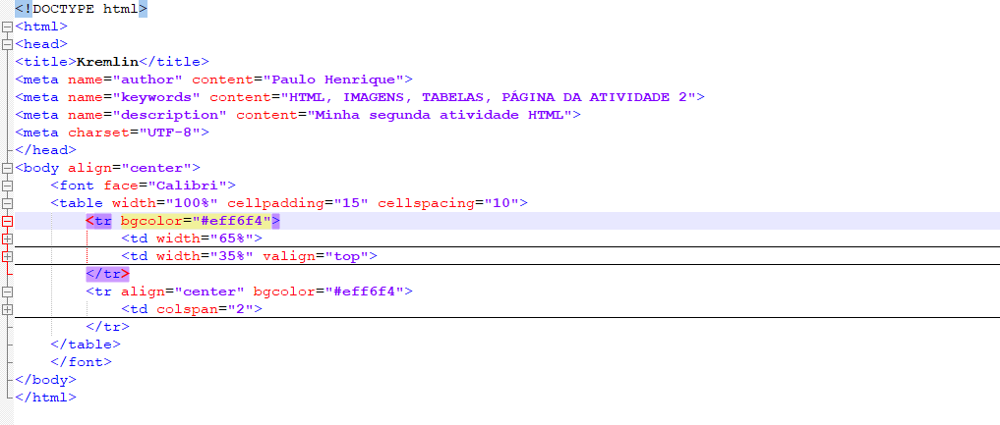
			   <figcaption>Podemos usar a célula com conteúdo principal com a largura de <b>65%</b> e a barra lateral com largura de <b>35%</b>. Dentro das tags <code>&lt;td&gt;</code> podemos inserir os textos e imagens de cada página.</figcaption>
		   </li>
		   <li>
			   <input type="radio" id="092" name="sl">
			   <label for="092"></label>
			   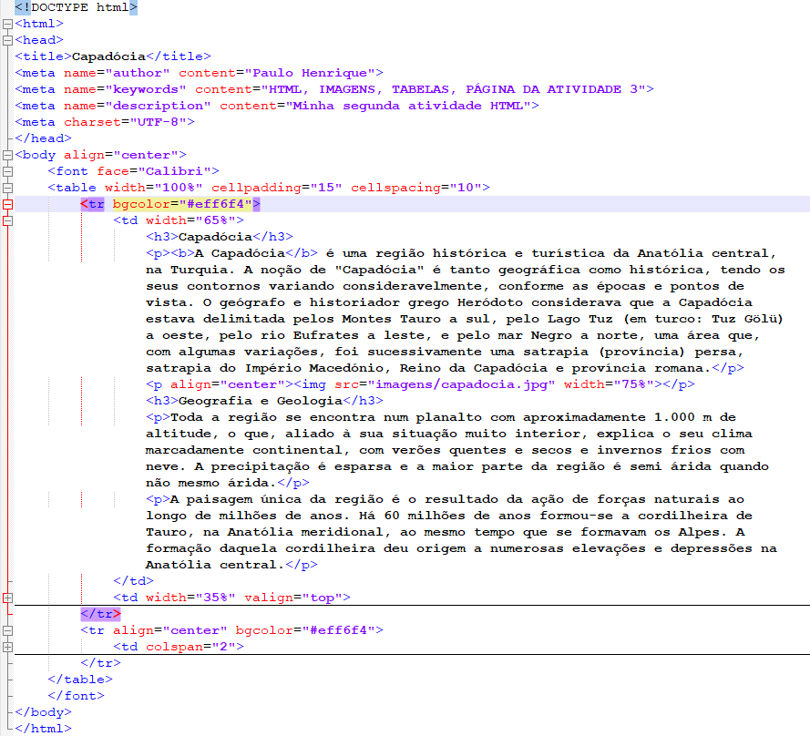
			   <figcaption>É importante separar os parágrafos, e definir larguras de imagens. Neste caso, foi usada a largura de <b>75%</b> para imagens.</figcaption>
		   </li>
		   <li>
			   <input type="radio" id="093a" name="sl">
			   <label for="093a"></label>
			   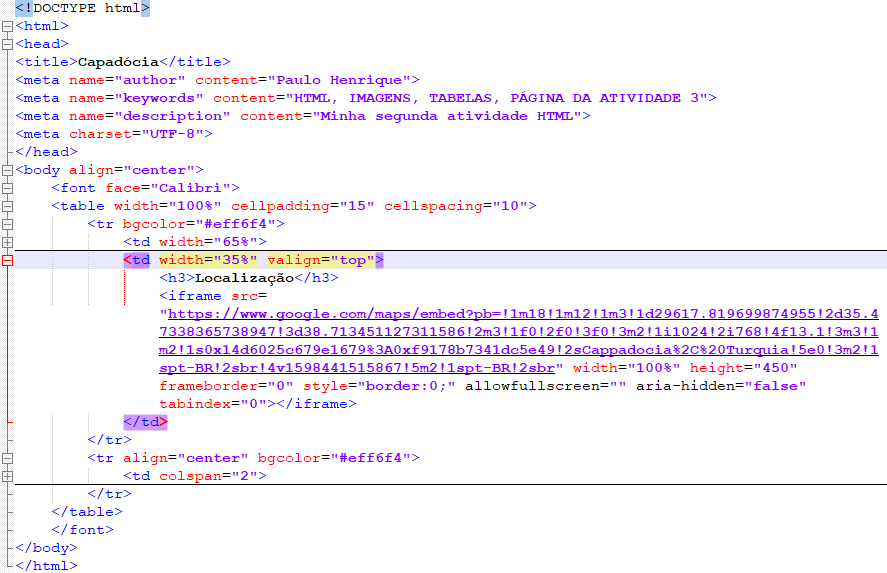
			   <figcaption>A segunda célula com a barra lateral contém o <code>&lt;iframe&gt;</code> com a localização do ponto turístico. Vamos ver como conseguir esta tag na próxima imagem.</figcaption>
			</li>
		   <li>
			   <input type="radio" id="094" name="sl">
			   <label for="094"></label>
			   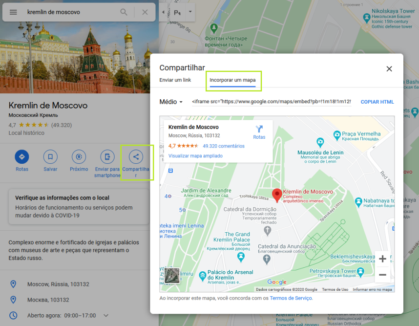
			   <figcaption>Acesse o endereço <a href="https://www.google.com.br/maps/" target="_blank">www.google.com.br/maps/</a> e procure o ponto turístico. Depois, basta clicar em <code>compartilhar</code> e a opção de <code>Incorporar um mapa</code>. Copie e cole a tag criada na página do ponto turístico.</figcaption>
		   </li>
		   <li>
			   <input type="radio" id="093" name="sl">
			   <label for="093"></label>
			   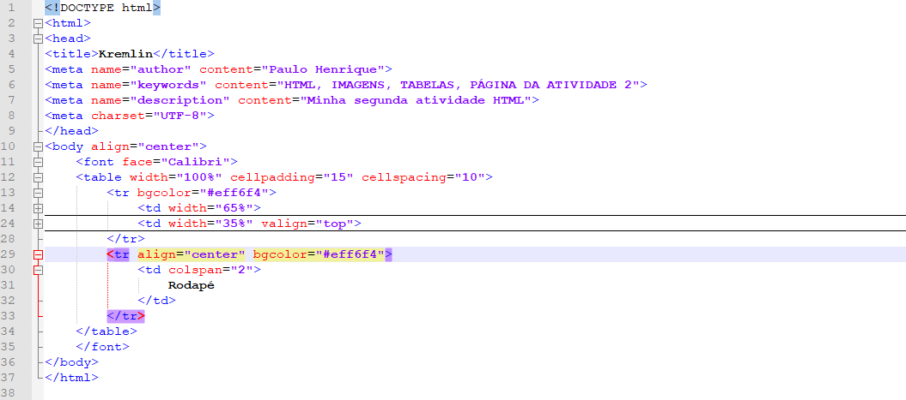
			   <figcaption>Voltando ao código da página, a linha de rodapé tem 2 células mescladas, para usar a largura toda da página. Por isso, usamos o atributo <code>colspan="2"</code>. Com a estrutura da página de um ponto turístico pronta, crie as páginas dos outros 4 pontos turísticos.</figcaption>
			</li>
		   <li>
			   <input type="radio" id="095" name="sl">
			   <label for="095"></label>
			   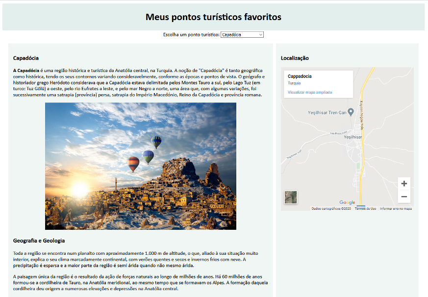
			   <figcaption>O layout mostrado neste exemplo fica desta forma. Lembre-se de cuidar com os nomes das páginas, para ver se são iguais aos nomes colocados na página <code>index.htm</code>.</figcaption>
		   </li>
		   <li>
			   <input type="radio" id="095a" name="sl">
			   <label for="095a"></label>
			   <figcaption>
<button type="button" onclick="copyEvent('cod64', 'cd64')" onmouseout="outFunc('cd64')">Copiar o código</button>
Trecho do código HTML da página index.htm:
<pre><code id="cod64">&lt;body align="center"&gt;
	&lt;font face="Calibri"&gt;
	<a alt="tag de tabela &lt;table&gt; com a estrutura da página">&lt;table width="100%"&gt;</a>
		<a alt="tag da primeira linha &lt;tr&gt; com o banner da página">&lt;tr bgcolor="#e2efec"&gt;</a>
			<a alt="tag da célula &lt;td&gt; com o título da página&#10;você pode usar uma imagem de fundo nesta célula do banner">&lt;td width="100%"&gt;</a>
				&lt;h1 align="center"&gt;Meus pontos turísticos favoritos&lt;/h1&gt;
			&lt;/td&gt;
		&lt;/tr&gt;
		<a alt="tag da segunda linha &lt;tr&gt; com a lista seletora das páginas">&lt;tr align="center"&gt;</a>
			<a alt="tag da célula &lt;td&gt; com a lista seletora">&lt;td&gt;</a>
				<a alt="tag de rótulo &lt;label&gt; para a lista seletora">&lt;label for="paginas"&gt;Escolha um ponto turístico:&lt;/label&gt;</a>
				<a alt="tag da lista &lt;select&gt; com o nome paginas linkada com o iframe1">&lt;select id="paginas" class="midia" name="paginas" onchange="javascript:iframe1.location=this.value"&gt;</a>
					<a alt="tag &lt;option&gt; com a primeira opção de página de ponto turístico&#10;lembre-se de colocar os nomes corretos das páginas criadas">&lt;option value="capadocia.htm"&gt;Capadócia&lt;/option&gt;</a>
					&lt;option value="kremlin.htm"&gt;Kremlin de Moscou&lt;/option&gt;
					&lt;option value="tajmahal.htm"&gt;Taj Mahal&lt;/option&gt;
					&lt;option value="egito.htm"&gt;Egito&lt;/option&gt;
					&lt;option value="colosseum.htm"&gt;Colosseum&lt;/option&gt;
				&lt;/select&gt;
				&lt;/font&gt;
				<a alt="tag &lt;iframe&gt; que vai mostrar as páginas selecionadas">&lt;iframe src="capadocia.htm" name="iframe1" width="100%" style="min-height:150vh;" frameborder="0" framebordercolor="red"&gt;&lt;/iframe&gt;</a>
			&lt;/td&gt;
		&lt;/tr&gt;
	&lt;/table&gt;
	&lt;/font&gt;
&lt;/body&gt;</code></pre>
</figcaption>
		   </li>
		   <li>
			   <input type="radio" id="095b" name="sl">
			   <label for="095b"></label>
			   <figcaption>
<button type="button" onclick="copyEvent('cod65', 'cd65')" onmouseout="outFunc('cd65')">Copiar o código</button>
Trecho do código HTML da página capadocia.htm:
<pre><code id="cod65">&lt;body align="center"&gt;
	&lt;font face="Calibri"&gt;
	<a alt="tag &lt;table&gt; com a estrutura da página de um ponto turístico">&lt;table width="100%" cellpadding="15" cellspacing="10"&gt;</a>
		<a alt="tag da primeira linha &lt;tr&gt; com o conteúdo da página">&lt;tr bgcolor="#eff6f4"&gt;</a>
			<a alt="tag de célula &lt;td&gt; com o conteúdo principal da página&#10;esta célula pode ter uma largura maior, por exemplo, de 65%">&lt;td width="65%"&gt;</a>
				&lt;h3&gt;Capadócia&lt;/h3&gt;
				&lt;p&gt;&lt;b&gt;A Capadócia&lt;/b&gt; é uma região histórica e turística da Anatólia central...&lt;/p&gt;
				&lt;p align="center"&gt;&lt;img src="imagens/capadocia.jpg" width="75%"&gt;&lt;/p&gt;
				&lt;h3&gt;Geografia e Geologia&lt;/h3&gt;
				&lt;p&gt;Toda a região se encontra num planalto com aproximadamente 1.000 m...&lt;/p&gt;
				&lt;p&gt;A paisagem única da região é o resultado da...&lt;/p&gt;
			&lt;/td&gt;
			<a alt="tag de célula &lt;td&gt; com a barra lateral da página&#10;esta célula pode ter a largura menor, por exemplo, de 35%&#10;use o atributo valign: top para deixar o conteúdo alinhado no topo">&lt;td width="35%" valign="top"&gt;</a>
				&lt;h3&gt;Localização&lt;/h3&gt;
				<a alt="coloque a tag de iframe do mapa do ponto turístico">&lt;iframe src="https://www.google.com/maps/embed?pb=!1m18!1m12!1m3!1d29617.819699874955!2d35.47338365738947!3d38.713451127311586!2m3!1f0!2f0!3f0!3m2!1i1024!2i768!4f13.1!3m3!1m2!1s0x14d6025c679e1679%3A0xf9178b7341dc5e49!2sCappadocia%2C%20Turquia!5e0!3m2!1spt-BR!2sbr!4v1598441515867!5m2!1spt-BR!2sbr" width="100%" height="450" frameborder="0" style="border:0;" allowfullscreen="" aria-hidden="false" tabindex="0"&gt;&lt;/iframe&gt;</a>
			&lt;/td&gt;
		&lt;/tr&gt;
		<a alt="tag de linha &lt;tr&gt; com o rodapé">&lt;tr align="center" bgcolor="#eff6f4"&gt;</a>
			<a alt="tag de célula &lt;td&gt;&#10;esta célula deve ser mesclada com a célula ao lado usando colspan: 2">&lt;td colspan="2"&gt;</a>
				Rodapé
			&lt;/td&gt;
		&lt;/tr&gt;
	&lt;/table&gt;
	&lt;/font&gt;
&lt;/body&gt;</code></pre>
</figcaption>
		   </li>
		</ul>
		
  

  
<a href="#basico" class="topo">voltar ao topo</a>

2. CSS - Cascading Style Sheets

	
Material da pág. 11 até a pág. 20

	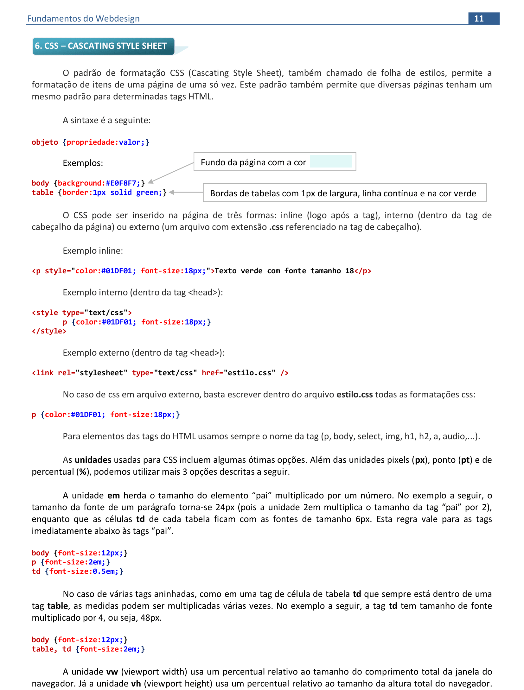
	
<a href="#css1" class="topo">voltar ao topo</a>

	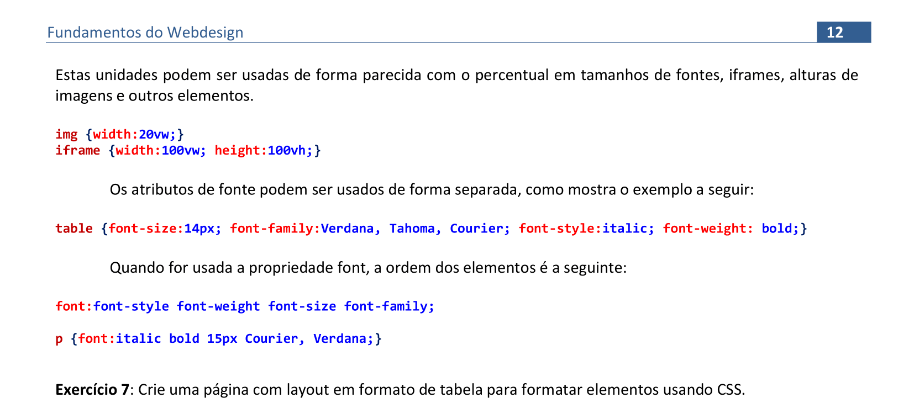
  

&#x1f4c3; Primeiro Layout com CSS

	
Vamos usar a nossa pasta de exercícios para criar a página <code>webdesign/exercicios/layoutCSS.htm</code>. Neste projeto vamos criar um layout em forma de tabela, parecido com as Atividades 2 e 3: serão 2 colunas na parte principal, com banner e um rodapé.

	  <ul class="slider">
		  <li>
			   <input type="radio" id="096" name="sl">
			   <label for="096"></label>
			   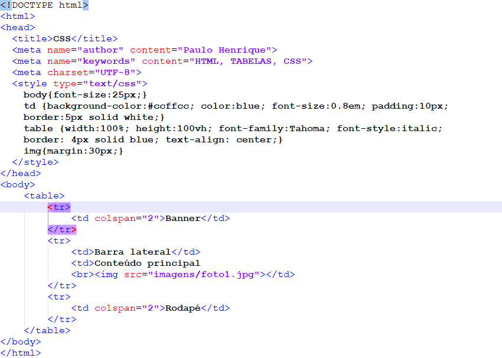
			   <figcaption>O layout da nossa primeira página com CSS será feito usando uma tabela. A primeira linha da tabela contém o banner da página, com o atributo <code>colspan="2"</code> para ocupar toda a largura da página. Insira uma imagem nesta tag.</figcaption>
		   </li>
		   <li>
			   <input type="radio" id="097" name="sl">
			   <label for="097"></label>
			   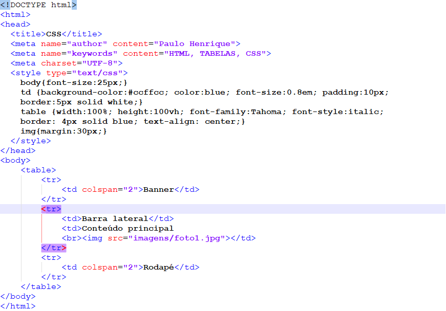
			   <figcaption>A segunda linha da tabela contém uma barra lateral esquerda e o conteúdo principal com uma imagem inserida. Vamos testar os alinhamentos do texto e da imagem nesta página.</figcaption>
		   </li>
		   <li>
			   <input type="radio" id="098" name="sl">
			   <label for="098"></label>
			   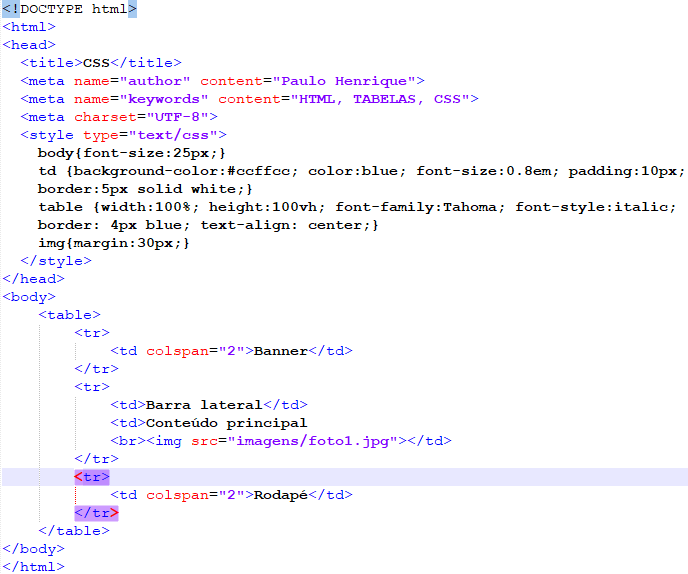
			   <figcaption>A terceira linha contém o rodapé, também com o atributo <code>colspan="2"</code> para usar a largura toda da página.</figcaption>
		   </li>
		   <li>
			   <input type="radio" id="099" name="sl">
			   <label for="099"></label>
			   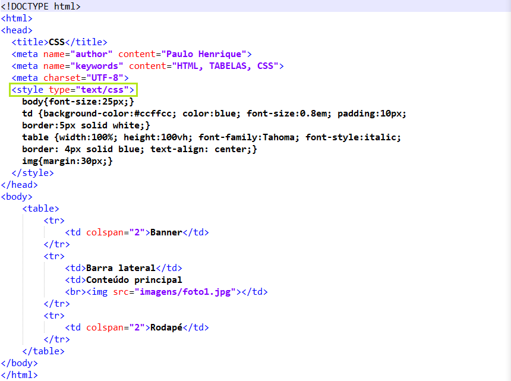
			   <figcaption>Agora vamos analisar a estrutura do CSS. Nestes primeiros exemplos, vamos usar as folhas de estilos dentro das páginas, nos cabeçalhos com a tag <code>&lt;style&gt;</code>.</figcaption>
		   </li>
		   <li>
			   <input type="radio" id="100" name="sl">
			   <label for="100"></label>
			   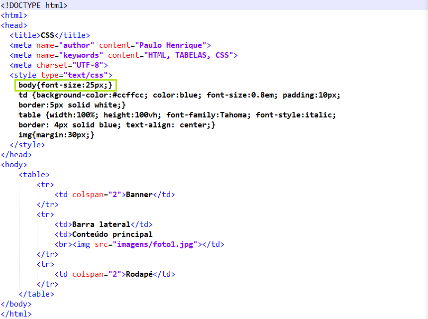
			   <figcaption>Podemos definir atributos gerais no CSS quando nos referimos ao corpo da página <code>body</code>. Estes atributos podem incluir tamanhos de fontes e cores de fundos. Modifique estes valores para visualizar o layout da sua página.</figcaption>
		   </li>
		   <li>
			   <input type="radio" id="101" name="sl">
			   <label for="101"></label>
			   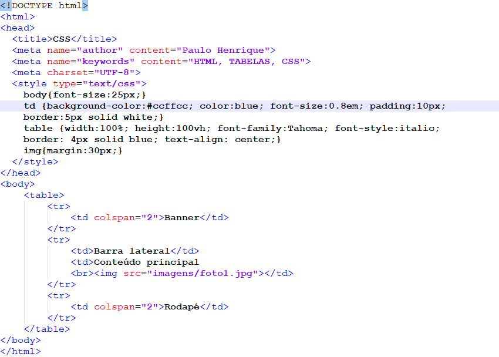
			   <figcaption>De uma maneira bem mais simples, definimos bordas, cores de fundo das células <code>td</code> com as folhas de estilos. Note que o tamanho da fonte foi colocado com <b>0.8em</b>, ou seja, corresponde a <b>80%</b> do tamanho de fonte da tag mãe <code>body</code>.</figcaption>
		   </li>
		   <li>
			   <input type="radio" id="102" name="sl">
			   <label for="102"></label>
			   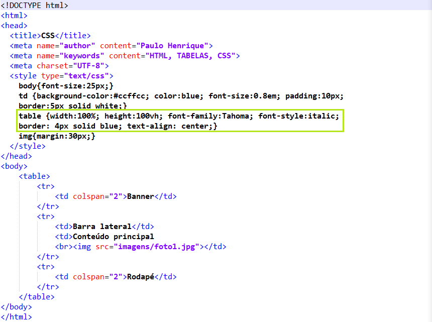
			   <figcaption>Um atributo importante que usamos no CSS é da altura da página. Neste caso, foi colocado que a altura mede <b>100vh</b>, ou seja, <b>100%</b> da altura do navegador. Podemos usar no lugar do atributo <code>height:100vh;</code> o atributo <code>min-height:100vh;</code>, que deixaria a altura mínima com a altura do navegador. </figcaption>
		   </li>
		   <li>
			   <input type="radio" id="103" name="sl">
			   <label for="103"></label>
			   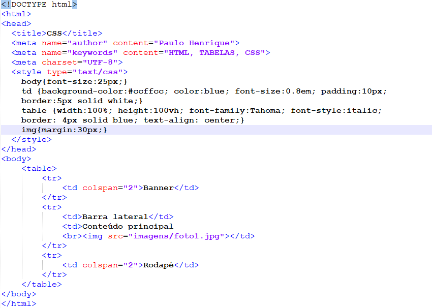
			   <figcaption>Para imagens não ficarem "grudadas" nos textos, podemos definir as margens com CSS. Os atributos ficam valendo para todas as imagens que você insere na página. Modifique atributos nesta nossa página, para treinar para a próxima Atividade.</figcaption>
		   </li>
		   <li>
			   <input type="radio" id="103a" name="sl">
			   <label for="103a"></label>
			   <figcaption>
<button type="button" onclick="copyEvent('cod66', 'cd66')" onmouseout="outFunc('cd66')">Copiar o código</button>
Trecho do código HTML com CSS interno:
<pre><code id="cod66">&lt;!DOCTYPE html&gt;
&lt;html&gt;
&lt;head&gt;
  &lt;title&gt;CSS&lt;/title&gt;
  &lt;meta name="author" content="Paulo Henrique"&gt;
  &lt;meta name="keywords" content="HTML, TABELAS, CSS"&gt;
  &lt;meta charset="UTF-8"&gt;
  <a alt="tag &lt;style&gt; com propriedades CSS">&lt;style type="text/css"&gt;</a>
	<a alt="propriedades da tag &lt;body&gt;">body</a> {font-size:25px;}
	<a alt="propriedades das células &lt;td&gt;">td</a> {background-color:#ccffcc; color:blue; font-size:0.8em; padding:10px; 
	border:5px solid white;}
	<a alt="propriedades da tabela">table</a> {width:100%; height:100vh; font-family:Tahoma; font-style:italic; 
	border: 4px solid blue; text-align: center;}
	<a alt="propriedades das imagens &lt;img&gt;">img</a> {margin:30px;}
  &lt;/style&gt;
&lt;/head&gt;
&lt;body&gt;
	&lt;table&gt;
		&lt;tr&gt;
			<a alt="tag do banner da página">&lt;td colspan="2"&gt;Banner&lt;/td&gt;</a>
		&lt;/tr&gt;
		&lt;tr&gt;
			<a alt="barra lateral à esquerda">&lt;td&gt;Barra lateral&lt;/td&gt;</a>
			<a alt="conteúdo principal à direita">&lt;td&gt;Conteúdo principal</a>
			&lt;br&gt;&lt;img src="imagens/foto1.jpg"&gt;&lt;/td&gt;
		&lt;/tr&gt;
		&lt;tr&gt;
			<a alt="rodapé">&lt;td colspan="2"&gt;Rodapé&lt;/td&gt;</a>
		&lt;/tr&gt;
	&lt;/table&gt;
&lt;/body&gt;
&lt;/html&gt;</code></pre>
</figcaption>
		   </li>
		</ul>
		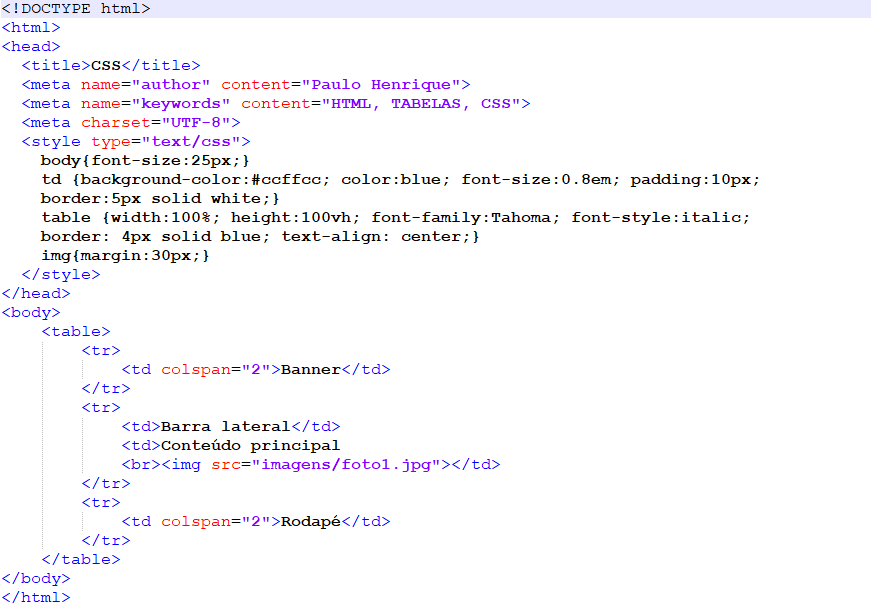
  

  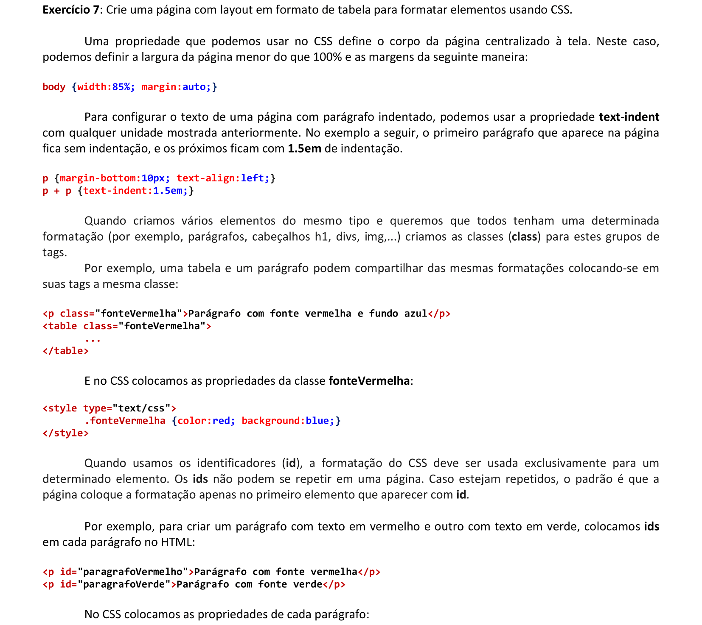
  
<a href="#css1" class="topo">voltar ao topo</a>

  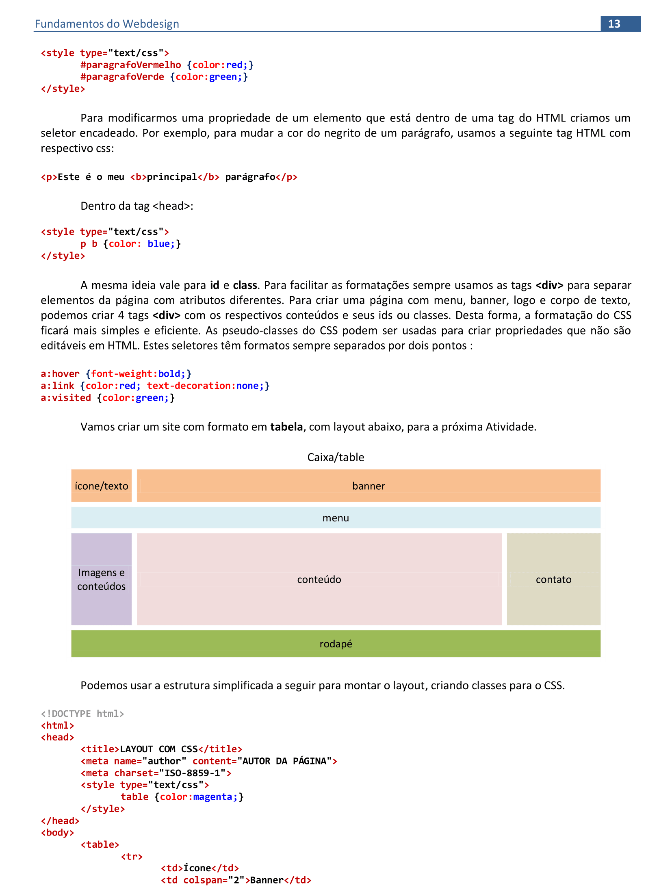
  
<a href="#css1" class="topo">voltar ao topo</a>

  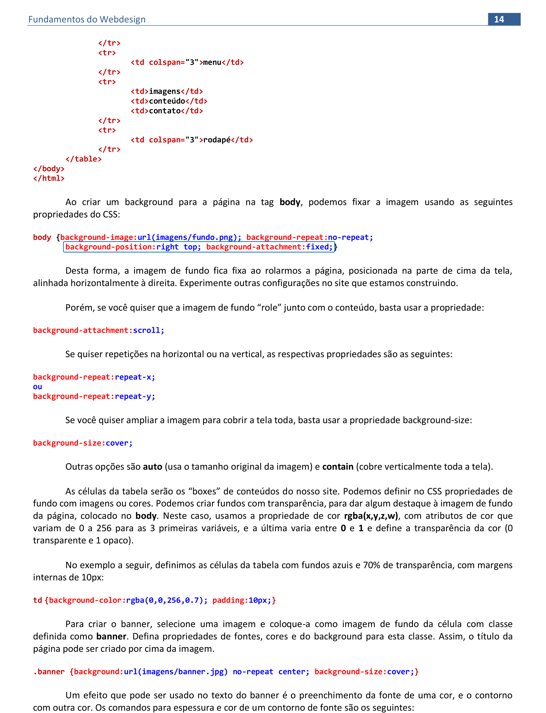
  

&#x1f4c3; Layout da Atividade 4

	
Vamos criar uma pasta para nosso próximo site chamada <code>webdesign/atividade4</code>. Neste projeto vamos criar um layout em forma de tabela, parecido com as Atividades 2 e 3, com formatação CSS. Como é um site com 3 páginas, vamos precisar de uma pasta de imagens:<code>webdesign/atividade4/imagens</code>.

	  <ul class="slider">
		  <li>
			   <input type="radio" id="104" name="sl">
			   <label for="104"></label>
			   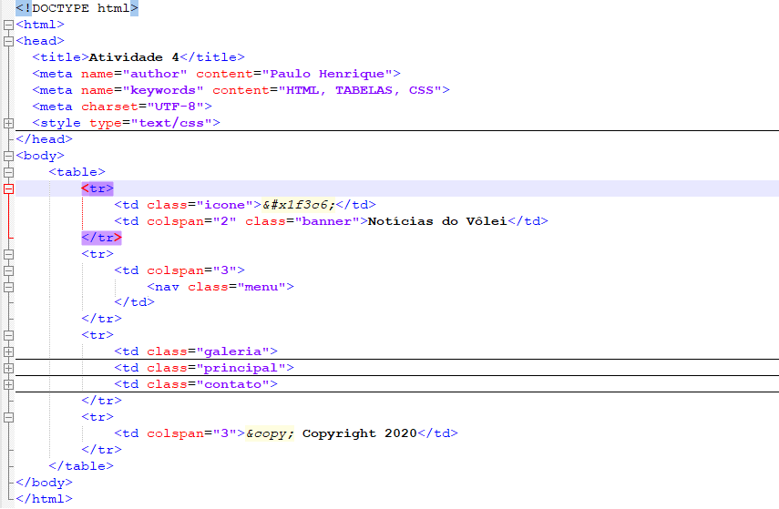
			   <figcaption>O layout da nossa primeira página com CSS será feito usando uma tabela. A primeira linha da tabela contém uma célula com um ícone (logomarca ou pictograma) e na outra célula o banner da página, com o atributo <code>colspan="2"</code> para ocupar a largura restante da página (retirando a parte do ícone. Você pode inserir imagens nestas tags.</figcaption>
		   </li>
		   <li>
			   <input type="radio" id="104a" name="sl">
			   <label for="104a"></label>
			   
			   <figcaption>Note que já vamos criar classes para as partes das nossas páginas: <code>class="icone"</code> e <code>class="banner"</code> para formatação em CSS. Com o tema de Esportes, escolha um título para colocar no Banner da página que terá o nome <code>index.htm</code>.</figcaption>
		   </li>
		   <li>
			   <input type="radio" id="105" name="sl">
			   <label for="105"></label>
			   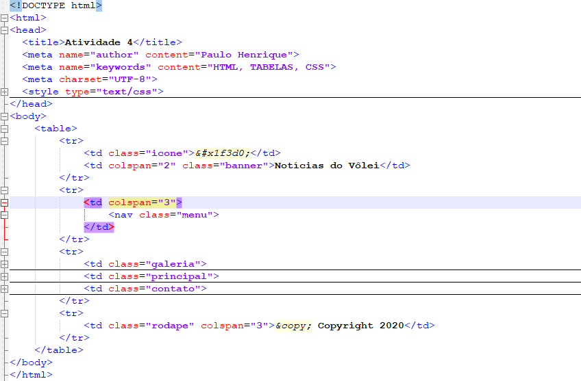
			   <figcaption>A segunda linha da tabela contém o menu, que ocupará a largura toda da página. Por isso, colocamos o atributo <code>colspan="3"</code> nesta célula, que possui classe com o nome <code>class="menu"</code>.</figcaption>
		   </li>
		   <li>
			   <input type="radio" id="106" name="sl">
			   <label for="106"></label>
			   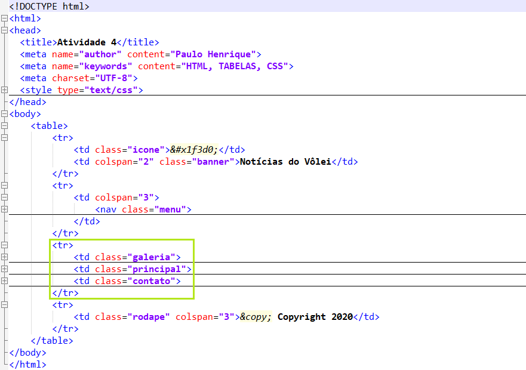
			   <figcaption>Na quarta linha, teremos 3 células: <code>class="galeria"</code>, que contém uma espécie de galeria de notícias e imagens; <code>class="principal"</code>, com o contéudo principal da página que ficará centralizado no layout; e <code>class="contato"</code>, com informações de contatos e redes sociais.</figcaption>
		   </li>
		   <li>
			   <input type="radio" id="107" name="sl">
			   <label for="107"></label>
			   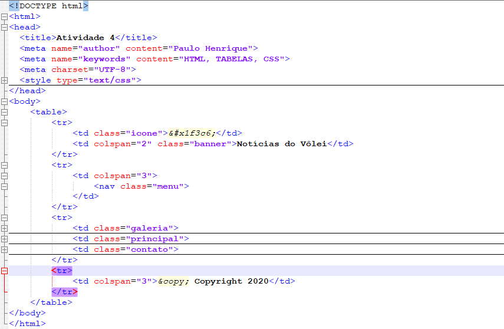
			   <figcaption>A última linha contém o rodapé, com atributo <code>colspan="3"</code> para usar a largura toda da página, definida como <code>class="rodape"</code>.</figcaption>
		   </li>
		   <li>
			   <input type="radio" id="108" name="sl">
			   <label for="108"></label>
			   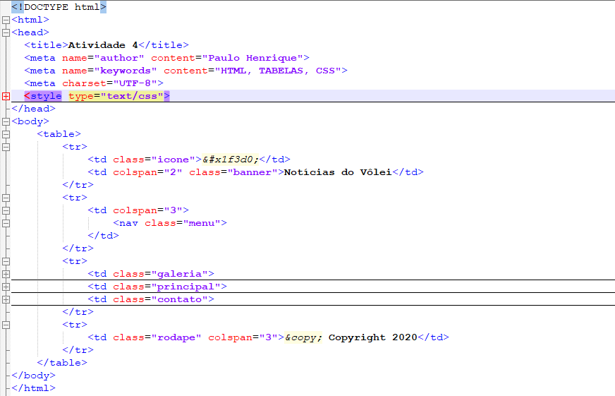
			   <figcaption>A tag dentro do cabeçalho <code>style</code> contém todos os atributos do CSS que vamos definir nestas páginas. Nesta primeira página <code>index.htm</code> vamos definir todos os estilos antes de criar as outras páginas do nosso site.</figcaption>
		   </li>
		   <li>
			   <input type="radio" id="108a" name="sl">
			   <label for="108a"></label>
			   <figcaption>
<button type="button" onclick="copyEvent('cod67', 'cd67')" onmouseout="outFunc('cd67')">Copiar o código</button>
Estrutura em HTML com CSS interno da Atividade 4:
<pre><code id="cod67">&lt;!DOCTYPE html&gt;
&lt;html&gt;
&lt;head&gt;
  &lt;title&gt;Atividade 4&lt;/title&gt;
  &lt;meta name="author" content="Paulo Henrique"&gt;
  &lt;meta name="keywords" content="HTML, TABELAS, CSS"&gt;
  &lt;meta charset="UTF-8"&gt;
  &lt;style type="text/css"&gt;
	<a alt="propriedades CSS da tag &lt;body&gt;">body</a> {width:85%; text-align:center; margin:auto; font-size:16px; 
	<a alt="fundo da página fixo, com imagem ocupando a largura da página">background-size: cover; background-attachment: fixed;</a> background: url(imagens/fundo.jpg)}
  &lt;/style&gt;
&lt;/head&gt;
&lt;body&gt;
	&lt;table&gt;
		&lt;tr&gt;
			<a alt="logomarca ou pictograma">&lt;td class="icone"&gt;&amp;#x1f3d0;&lt;/td&gt;</a>
			<a alt="imagem do banner">&lt;td colspan="2" class="banner"&gt;Notícias do Vôlei&lt;/td&gt;</a>
		&lt;/tr&gt;
		&lt;tr&gt;
			&lt;td colspan="3"&gt;
				<a alt="menu da página">&lt;nav class="menu"&gt;</a>
					MENU
				&lt;/nav&gt;
			&lt;/td&gt;
		&lt;/tr&gt;	
		&lt;tr&gt;
			<a alt="galeria de imagens à esquerda">&lt;td class="galeria"&gt;</a>
				GALERIA LATERAL
			&lt;/td&gt;
			<a alt="conteúdo centralizado">&lt;td class="principal"&gt;</a>
				CONTEÚDO PRINCIPAL
			&lt;/td&gt;
			<a alt="informações de contato à direita">&lt;td class="contato"&gt;</a>
				CONTATO
			&lt;/td&gt;
		&lt;/tr&gt;
		&lt;tr&gt;
			&lt;td class="rodape" colspan="3"&gt;&amp;copy; Copyright 2020&lt;/td&gt;
		&lt;/tr&gt;
	&lt;/table&gt;
&lt;/body&gt;
&lt;/html&gt;</code></pre>
</figcaption>
		   </li>
		</ul>
		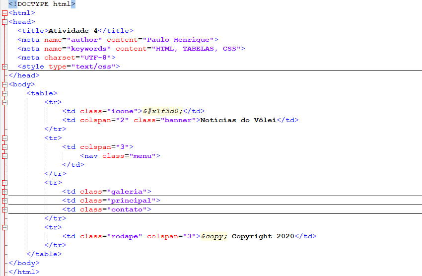
  

  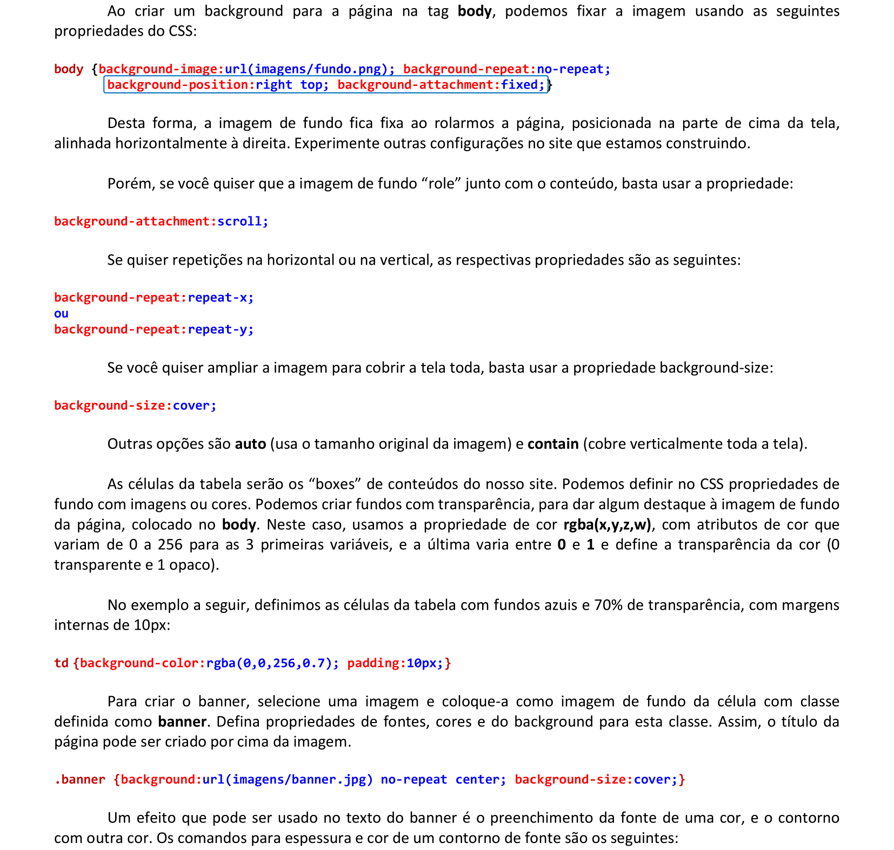
  
<a href="#css1" class="topo">voltar ao topo</a>

  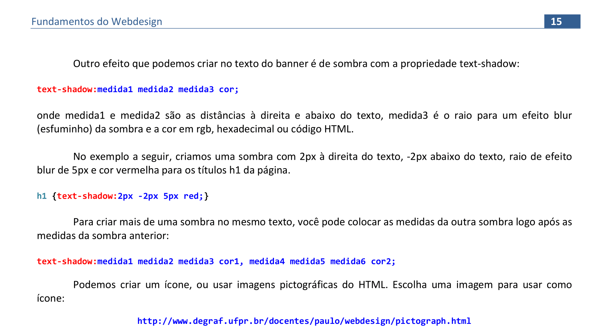
  

&#x1f4c3; Banner da Atividade 4

	
Vamos formatar o banner e o ícone da página <code>index.htm</code> da Atividade 4 com CSS. A estrutura HTML já foi mostrada e comentada em detalhes na página anterior.

	  <ul class="slider">
		  <li>
			   <input type="radio" id="109" name="sl">
			   <label for="109"></label>
			   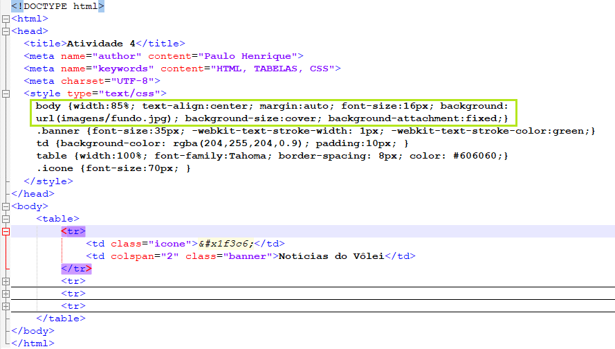
			   <figcaption>O corpo da página <code>body</code> foi definido com uma imagem de fundo (background) que mostra uma partida de vôlei. Note que deixamos as imagens na pasta <code>webdesign/atividade4/imagens</code>. Logo, podemos usar o atributo <code>url(imagens/banner.jpg)</code> que mostra o caminho do arquivo da imagem de fundo do site.</figcaption>
		   </li>
		   <li>
			   <input type="radio" id="109a" name="sl">
			   <label for="109a"></label>
			   
			   <figcaption>Em CSS podemos definir vários elementos para a tag <code>body</code>, que é a "mãe" de todas as tags. Largura, tamanho de fonte, margem automática (que deixa o conteúdo centralizado), além de <code>background-size</code> e <code>background-attachment</code> que deixam a imagem de fundo fixa e "cobrindo" todo o espaço da tela.</figcaption>
		   </li>
		   <li>
			   <input type="radio" id="110" name="sl">
			   <label for="110"></label>
			   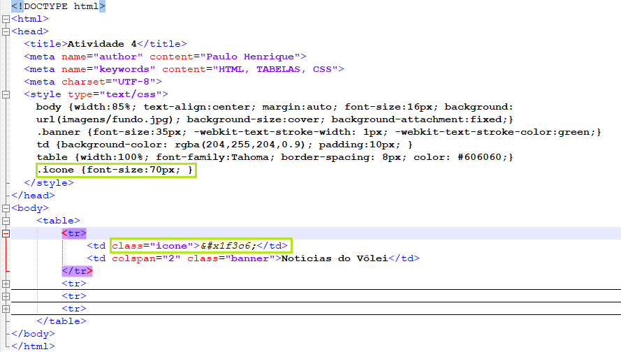
			   <figcaption>A tag de ícone pode conter uma imagem, como uma logomarca, ou podemos usar uma imagem pictográfica. No site <a href="http://www.degraf.ufpr.br/docentes/paulo/webdesign/pictograph.html" target="_blank">http://www.degraf.ufpr.br/docentes/paulo/webdesign/pictograph.html</a> você pode escolher uma imagem pictográfica para ficar nesta tag de ícone desta página.</figcaption>
		   </li>
		   <li>
			   <input type="radio" id="111" name="sl">
			   <label for="111"></label>
			   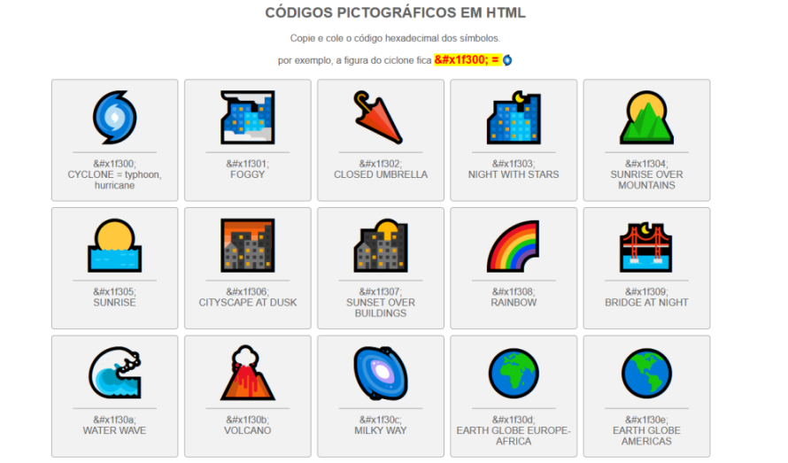
			   <figcaption>Em cada página do nosso site, podemos escolher um destes símbolos pictográficos para inserir na tag de ícone. Visite a página indicada e escolha um símbolo que represente o esporte de cada página. O formato deste tipo de imagem é parecido com o de cores hexadecimais, mas sempre começa com o símbolo <b>&amp;</b>.</figcaption>
		   </li>
		   <li>
			   <input type="radio" id="112" name="sl">
			   <label for="112"></label>
			   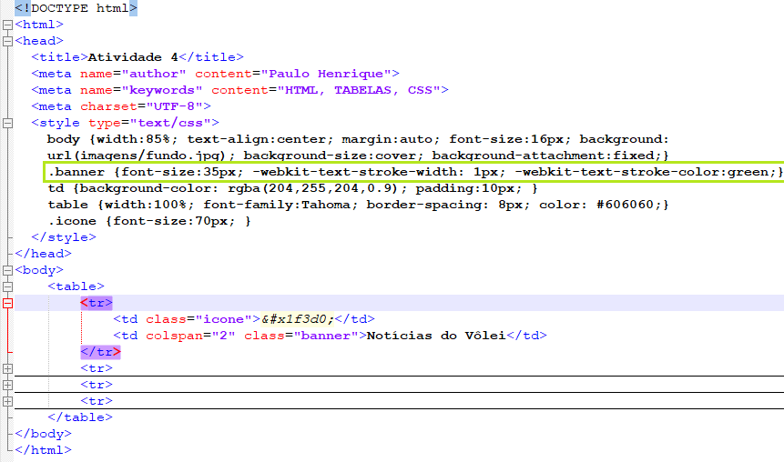
			   <figcaption>Na tag do banner, podemos escolher uma imagem de fundo, inserindo-a como fizemos na imagem do fundo do site na tag <code>body</code>. Outra opção é usar efeitos de texto, como cores diferentes no contorno com o atributo <code>stroke-width</code> mostrado neste exemplo.</figcaption>
		   </li>
		   <li>
			   <input type="radio" id="113" name="sl">
			   <label for="113"></label>
			   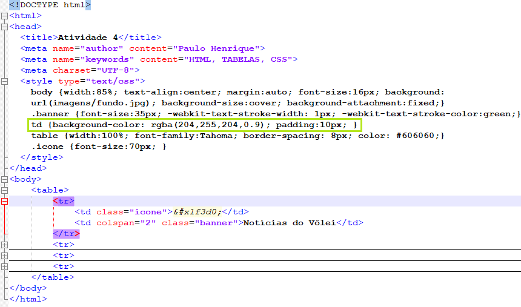
			   <figcaption>As tags <code>td</code> servem de estrutura para o layout do nosso site, e precisam de formatações. Margens internas, cor de fundo e imagem de fundo podem ser definidas no CSS. Note que as tags nativas do HTML não têm o símbolo de ponto . nas atribuições dos estilos. Somente colocamos ponto . nas classes criadas (banner, icone, menu,...).</figcaption>
		   </li>
		   <li>
			   <input type="radio" id="114" name="sl">
			   <label for="114"></label>
			   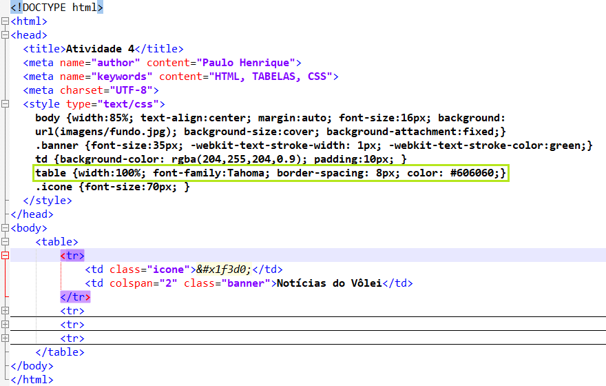
			   <figcaption>Outra tag importante para definirmos atributos no CSS é a <code>table</code>, que contém os espaçamentos das células para separar os blocos de conteúdos, cor de texto e a largura.</figcaption>
		   </li>
		   <li>
			   <input type="radio" id="115" name="sl">
			   <label for="115"></label>
			   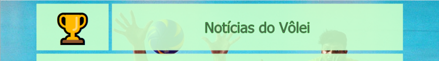
			   <figcaption>
<button type="button" onclick="copyEvent('cod68', 'cd68')" onmouseout="outFunc('cd68')">Copiar o código</button>
Com as propriedades definidas neste exemplo, a página fica com a parte superior desta forma. Formate o layout da sua página com as propriedades que você ache mais adequadas para esta atividade. Seguiremos com as outras partes desta atividade. A estrutura CSS do banner desta atividade fica assim: 
<pre><code id="cod68">&lt;style type="text/css"&gt;
	body {width:85%; text-align:center; margin:auto; font-size:16px; 
	background-size: cover; background-attachment: fixed; background: url(imagens/fundo.jpg)}
	<a alt="propriedades da classe banner">.banner</a> {font-size:35px; -webkit-text-stroke-width: 1px; -webkit-text-stroke-color:green;}
	<a alt="propriedades das células da tabela">td</a> {background-color: rgba(204,255,204,0.9); padding:10px; }
	<a alt="propriedades da tabela">table</a> {width:100%; font-family:Tahoma; border-spacing: 8px; color: #606060;}
	<a alt="propriedades da classe ícone">.icone</a> {font-size:70px; }
&lt;/style&gt;</code></pre>
</figcaption>
		   </li>
		</ul>
		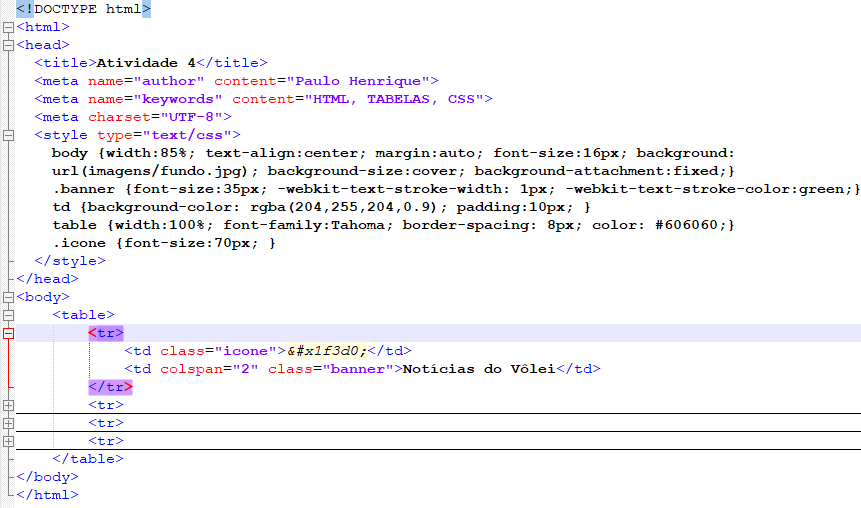
  

  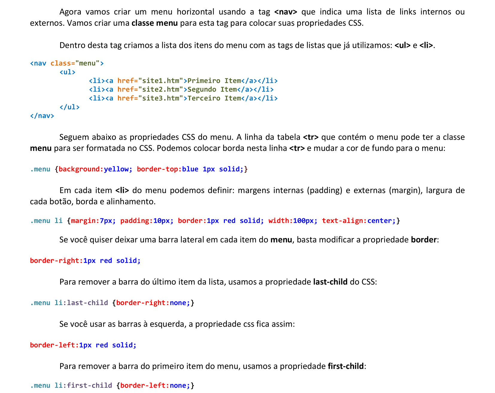
  
<a href="#css1" class="topo">voltar ao topo</a>

  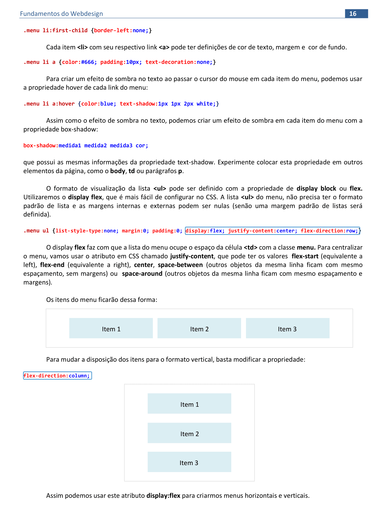
  

&#x1f4c3; Menu da Atividade 4

	
Vamos formatar o menu da página <code>index.htm</code> da Atividade 4 com CSS. A estrutura HTML possui a tag <code>nav</code> descrita a seguir.

	  <ul class="slider">
		  <li>
			   <input type="radio" id="116" name="sl">
			   <label for="116"></label>
			   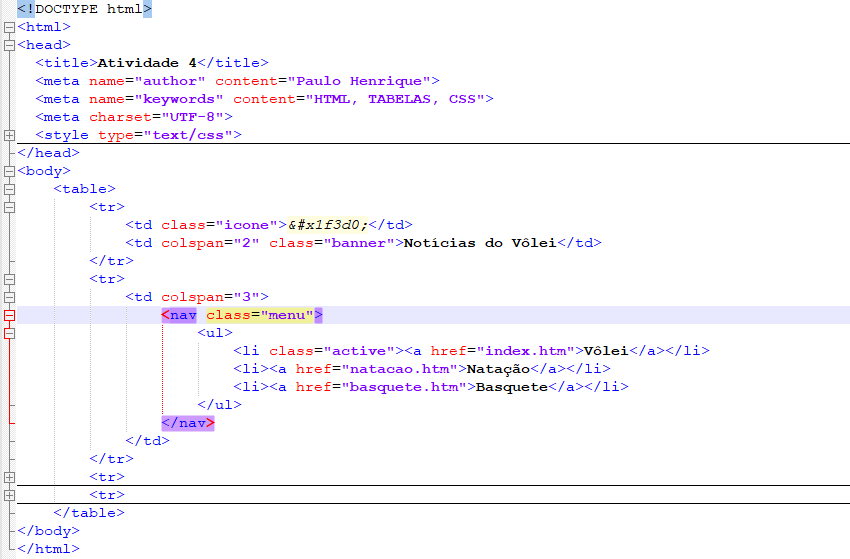
			   <figcaption>Dentro da tag <code>&lt;nav class="menu"&gt;</code> podemos criar uma tag de lista <code>&lt;ul&gt;</code>, com cada item <code>&lt;li&gt;</code> representando a página de um esporte desta atividade. Usamos a tag de link <code>&lt;a&gt;</code> para criar a navegação entre os links do menu. A página <code>index.htm</code> tem classe ativa que vamos configurar a seguir.</figcaption>
		   </li>
		   <li>
			   <input type="radio" id="117" name="sl">
			   <label for="117"></label>
			   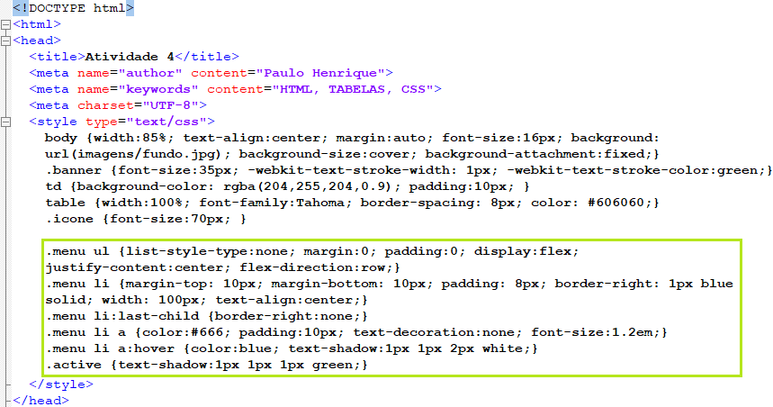
			   <figcaption>Agora vamos focar no cabeçalho da página para criar as propriedades do menu. Note que as propriedades do banner estão logo acima, dentro da mesma tag <code>&lt;style&gt;</code>.</figcaption>
		   </li>
		   <li>
			   <input type="radio" id="118" name="sl">
			   <label for="118"></label>
			   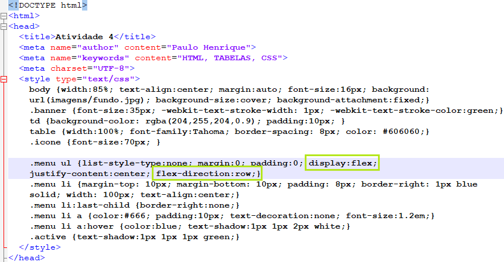
			   <figcaption>A lista dos itens do menu <code>ul</code> tem atributos de margens, estilo sem formato de lista e o <b>display flex</b> que pode ser usado para distribuir os itens dentro da célula da tabela. A direção deste display está em linha (row) pois o menu é horizontal.</figcaption>
		   </li>
		   <li>
			   <input type="radio" id="119" name="sl">
			   <label for="119"></label>
			   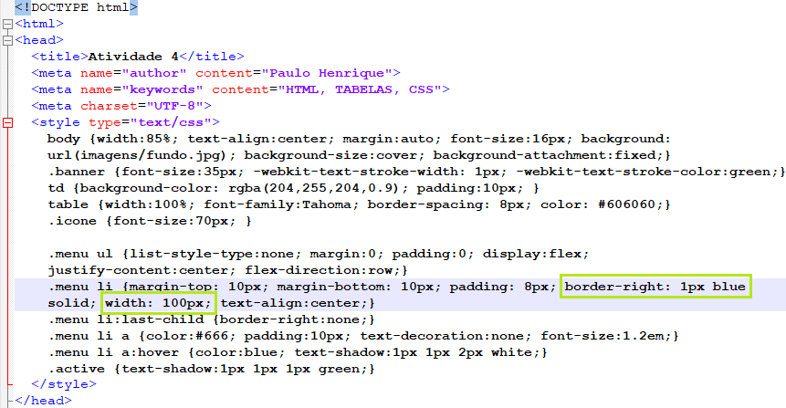
			   <figcaption>Para que a lista não fique "grudada" nas outras partes da página, criamos margens top e bottom. Colocamos uma borda azul à direita e comprimento fixo de <b>100px</b>. Se necessário, ajuste este valor na sua página, para que os textos de todos os itens caibam no menu, sem quebras de linha.</figcaption>
		   </li>
		   <li>
			   <input type="radio" id="120" name="sl">
			   <label for="120"></label>
			   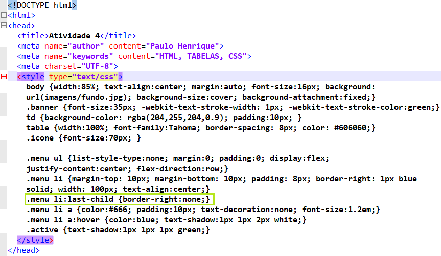
			   <figcaption>O último item da lista <code>last-child</code> ficará sem borda, deixando bordas apenas internas entre os itens do menu.</figcaption>
		   </li>
		   <li>
			   <input type="radio" id="121" name="sl">
			   <label for="121"></label>
			   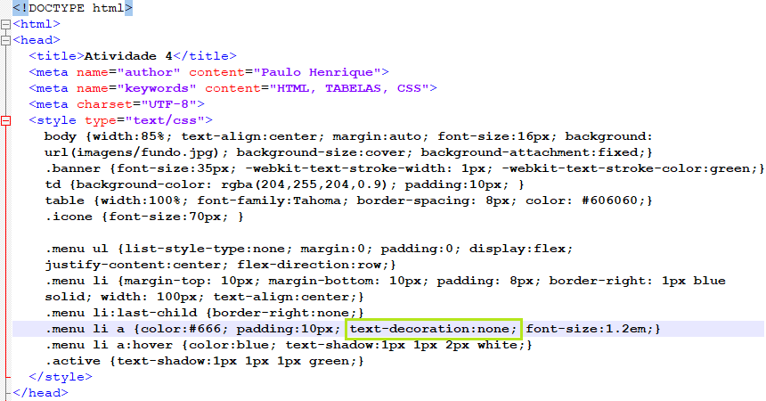
			   <figcaption>Na tag <code>&lt;a&gt;</code> podemos configurar tamanho de fonte e o atributo <code>text-decoration:none;</code> que remove aquelas configurações comuns de links (cor azul, sublinhado).</figcaption>
		   </li>
		   <li>
			   <input type="radio" id="122" name="sl">
			   <label for="122"></label>
			   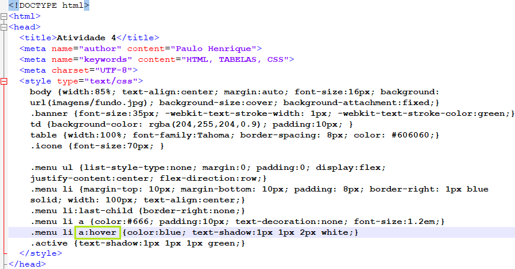
			   <figcaption>Ao passar o cursor do mouse por cima de um item do menu, podemos criar alguns efeitos: mudanças de cor, de fundo, sublinhados ou sombras. Neste caso usamos sombra e mudança de cor da fonte para esse efeito. Escolha um efeito para sua página.</figcaption>
		   </li>
		   <li>
			   <input type="radio" id="123" name="sl">
			   <label for="123"></label>
			   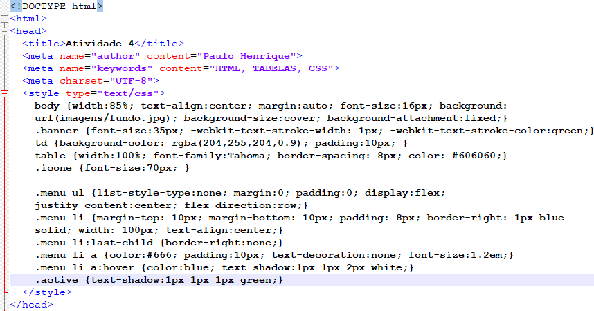
			   <figcaption>A página ativa, neste caso <code>index.htm</code>, pode ter alguma apresentação diferente no menu para destacar ao visitante que ele está nesta página. Quando construir as outras páginas, modifique a classe na tag <code>&lt;nav&gt;</code> o item ativo.</figcaption>
		   </li>
		   <li>
			   <input type="radio" id="124" name="sl">
			   <label for="124"></label>
			   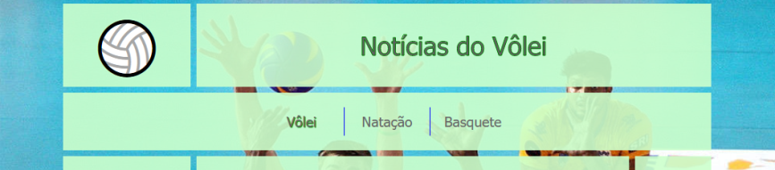
			   <figcaption>Este é o resultado parcial da página, com estas configurações de menu. Usando os atributos mostrados, modifique valores para a apresentação do seu site.</figcaption>
		   </li>
		   <li>
			   <input type="radio" id="124a" name="sl">
			   <label for="124a"></label>
			   <figcaption>
<button type="button" onclick="copyEvent('cod69', 'cd69')" onmouseout="outFunc('cd69')">Copiar o código</button>
Estrutura CSS do menu da Atividade 4:
<pre><code id="cod69">&lt;style type="text/css"&gt;
	body {width:85%; text-align:center; margin:auto; font-size:16px; 
	background-size: cover; background-attachment: fixed; background: url(imagens/fundo.jpg)}
	.banner {font-size:35px; -webkit-text-stroke-width: 1px; -webkit-text-stroke-color:green;}
	td {background-color: rgba(204,255,204,0.9); padding:10px; }
	table {width:100%; font-family:Tahoma; border-spacing: 8px; color: #606060;}
	.icone {font-size:70px; }
	
	<a alt="propriedades da lista &lt;ul&gt; do menu">.menu ul</a> {list-style-type:none; margin:0; padding:0; display:flex; 
	justify-content:center; flex-direction:row;}
	<a alt="propriedades de cada item da lista &lt;li&gt; do menu">.menu li</a> {margin-top: 10px; margin-bottom: 10px; padding: 8px; 
	<a alt="borda direita de cada item do menu">border-right: 1px blue solid;</a> width: 100px; text-align:center;}
	<a alt="último item da lista do menu sem borda">.menu li:last-child</a> {border-right:none;}
	<a alt="propriedades de link de cada item &lt;li&gt; do menu">.menu li a</a> {color:#666; padding:10px; text-decoration:none; font-size:1.2em;}
	<a alt="efeito de hover: quando passamos o cursor do mouse em cada item">.menu li a:hover</a> {color:blue; text-shadow:1px 1px 2px white;}
	<a alt="página ativa do menu">.active</a> {text-shadow:1px 1px 1px green;}
&lt;/style&gt;</code></pre>

<button type="button" onclick="copyEvent('cod47', 'cd47')" onmouseout="outFunc('cd47')">Copiar o código</button>
Estrutura HTML do menu da Atividade 4:
<pre><code id="cod47">&lt;nav class="menu"&gt;
	<a alt="lista de itens do menu">&lt;ul&gt;</a>
		<a alt="em cada item, defina o link e a página ativa">&lt;li class="active"&gt;&lt;a href="index.htm"&gt;Vôlei&lt;/a&gt;&lt;/li&gt;</a>
		&lt;li&gt;&lt;a href="natacao.htm"&gt;Natação&lt;/a&gt;&lt;/li&gt;
		&lt;li&gt;&lt;a href="basquete.htm"&gt;Basquete&lt;/a&gt;&lt;/li&gt;
	&lt;/ul&gt;
&lt;/nav&gt;</code></pre>
</figcaption>
			</li>
		</ul>
		
  

  
<a href="#css1" class="topo">voltar ao topo</a>

  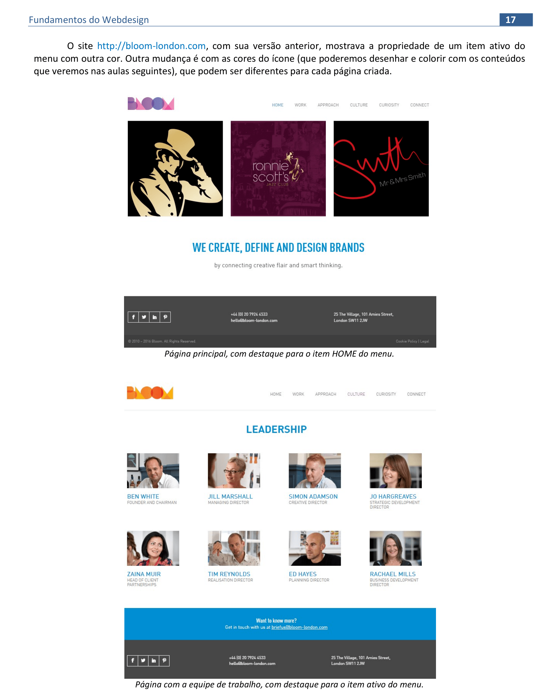
  
<a href="#css1" class="topo">voltar ao topo</a>

  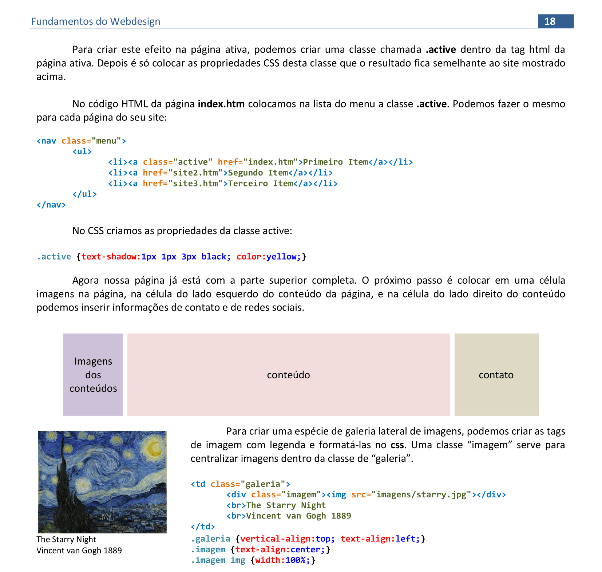
  

&#x1f4c3; Conteúdo da Atividade 4

	
Vamos formatar o conteúdo principal e a barra lateral de galeria da página <code>index.htm</code> da Atividade 4 com CSS. Antes vamos ver a estrutura HTML destas partes da página.

	  <ul class="slider">
		  <li>
			   <input type="radio" id="125" name="sl">
			   <label for="125"></label>
			   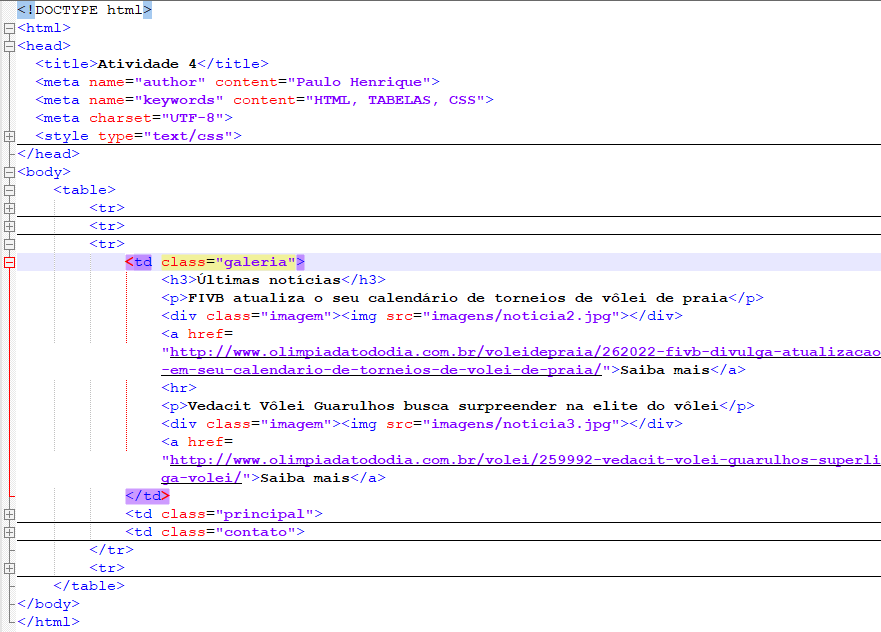
			   <figcaption>A barra esquerda será a galeria de notícias <code>class="galeria"</code>. Podemos criar um cabeçalho <code>&lt;h3&gt;</code>, um parágrafo <code>&lt;p&gt;</code> com descrição do título da notícia, uma imagem <code>&lt;img&gt;</code> e um link <code>&lt;a&gt;</code>. Nesta barra podemos inserir 2 ou 3 notícias com estes elementos, separadas por uma tag <code>&lt;hr&gt;</code>.</figcaption>
		   </li>
		   <li>
			   <input type="radio" id="126" name="sl">
			   <label for="126"></label>
			   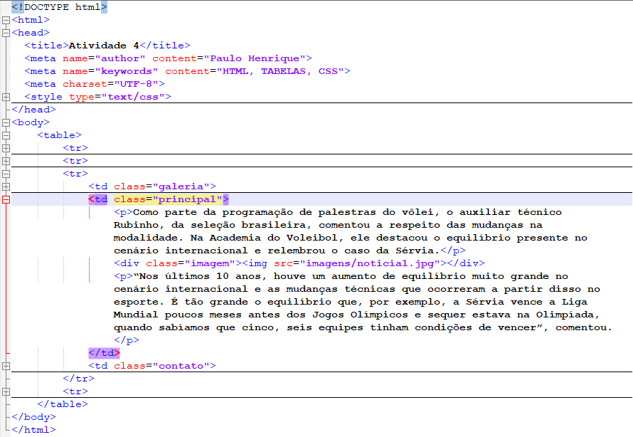
			   <figcaption>O conteúdo da página da tag <code>class="principal"</code> contém parágrafos <code>&lt;p&gt;</code> e imagens. Podemos criar uma div <code>class="imagem"</code> para formatar imagens dentro desta parte da página.</figcaption>
		   </li>
		   <li>
			   <input type="radio" id="127" name="sl">
			   <label for="127"></label>
			   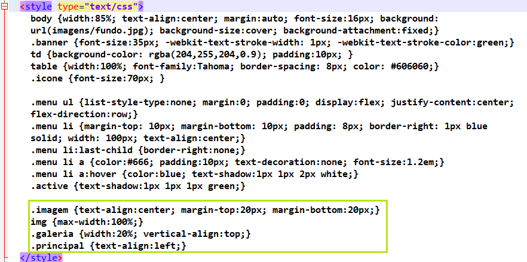
			   <figcaption>Na tag de estilo <code>&lt;style&gt;</code> vamos focar nos atributos das classes <b>galeria</b> e <b>principal</b>.</figcaption>
		   </li>
		   <li>
			   <input type="radio" id="128" name="sl">
			   <label for="128"></label>
			   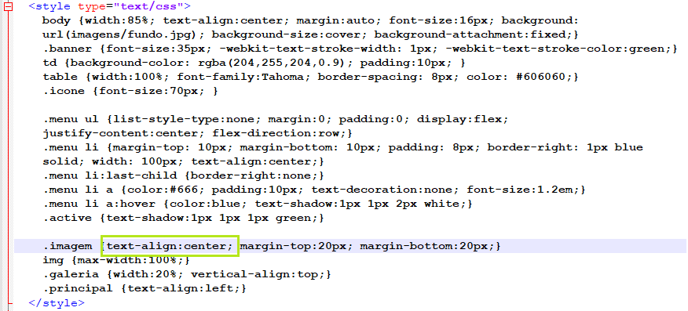
			   <figcaption>A classe <code>imagem</code> serve para alinhar as fotos com o texto na tag principal. Podemos definir margens para não deixar as fotos "grudadas" nos textos.</figcaption>
		   </li>
		   <li>
			   <input type="radio" id="129" name="sl">
			   <label for="129"></label>
			   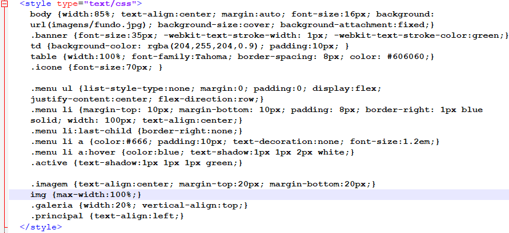
			   <figcaption>De maneira geral, as imagens das páginas podem ser colocadas com largura máxima de <b>100%</b>.</figcaption>
		   </li>
		   <li>
			   <input type="radio" id="130" name="sl">
			   <label for="130"></label>
			   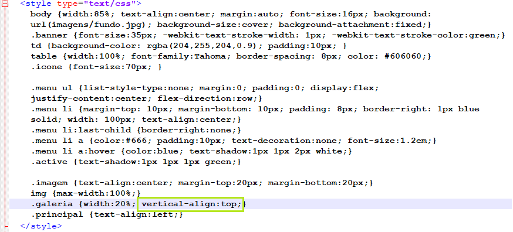
			   <figcaption>O alinhamento <code>vertical-align:top;</code> faz com que o conteúdo da galeria fique alinhado com os conteúdos das outras barras: principal e contato. Podemos definir a largura da galeria: <b>20%</b>, por exemplo. Faça testes com os conteúdos de sua página para encontrar o melhor valor.</figcaption>
		   </li>
		   <li>
			   <input type="radio" id="131" name="sl">
			   <label for="131"></label>
			   
			   <figcaption>Defina o alinhamento do texto da tag principal da página. Você pode definir também cor de texto e mais efeitos no CSS. Vamos definir mais adiante os atributos das outras tags da página.</figcaption>
		   </li>
		   <li>
			   <input type="radio" id="131a" name="sl">
			   <label for="131a"></label>
			   <figcaption>
<button type="button" onclick="copyEvent('cod70', 'cd70')" onmouseout="outFunc('cd70')">Copiar o código</button>
Estrutura CSS do conteúdo da Atividade 4:
<pre><code id="cod70">&lt;style type="text/css"&gt;
	body {width:85%; text-align:center; margin:auto; font-size:16px; 
	background-size: cover; background-attachment: fixed; background: url(imagens/fundo.jpg)}
	.banner {font-size:35px; -webkit-text-stroke-width: 1px; -webkit-text-stroke-color:green;}
	td {background-color: rgba(204,255,204,0.9); padding:10px; }
	table {width:100%; font-family:Tahoma; border-spacing: 8px; color: #606060;}
	.icone {font-size:70px; }
	
	.menu ul {list-style-type:none; margin:0; padding:0; display:flex; 
	justify-content:center; flex-direction:row;}
	.menu li {margin-top: 10px; margin-bottom: 10px; padding: 8px; 
	border-right: 1px blue solid; width: 100px; text-align:center;}
	.menu li:last-child {border-right:none;}
	.menu li a {color:#666; padding:10px; text-decoration:none; font-size:1.2em;}
	.menu li a:hover {color:blue; text-shadow:1px 1px 2px white;}
	.active {text-shadow:1px 1px 1px green;}
	
	<a alt="propriedades da classe imagem do conteúdo">.imagem</a> {text-align:center; margin-top:20px; margin-bottom:20px;}
	<a alt="limite para largura de imagens">img</a> {max-width:100%;}
	<a alt="propriedades para a barra de galeria">.galeria</a> {width:20%; vertical-align:top;}
	<a alt="propriedades para o conteúdo">.principal</a> {text-align:left;}
&lt;/style&gt;</code></pre></figcaption>
		   </li>
		</ul>
		
  

  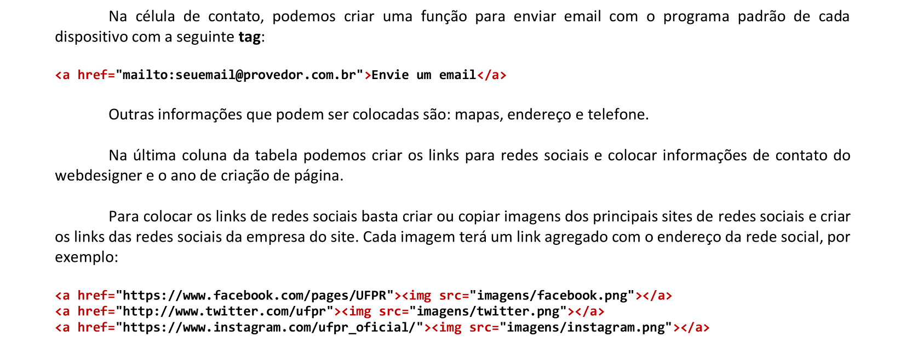
  
<a href="#css1" class="topo">voltar ao topo</a>

  
  

&#x1f4c3; Contato e rodapé da Atividade 4

	
Vamos formatar os conteúdos da barra de contato e do rodapé da página <code>index.htm</code> da Atividade 4 com CSS. Antes vamos ver a estrutura HTML destas partes da página.

	  <ul class="slider">
		  <li>
			   <input type="radio" id="132" name="sl">
			   <label for="132"></label>
			   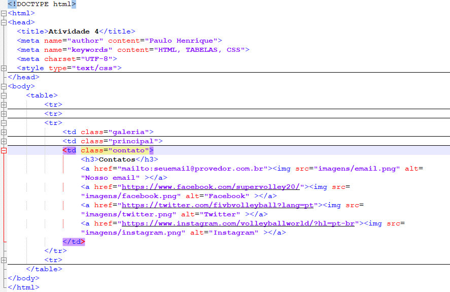
			   <figcaption>A barra direita será de contatos de email e de redes sociais <code>class="contato"</code>. Podemos criar links <code>&lt;a&gt;</code> para email e acesso às redes sociais. Insira imagens na pasta <code>webdesign/atividade4/imagens</code> de email, facebook e mais redes sociais para colocar dentro das tags de link as imagens <code>&lt;img&gt;</code>.</figcaption>
		   </li>
		   <li>
			   <input type="radio" id="133" name="sl">
			   <label for="133"></label>
			   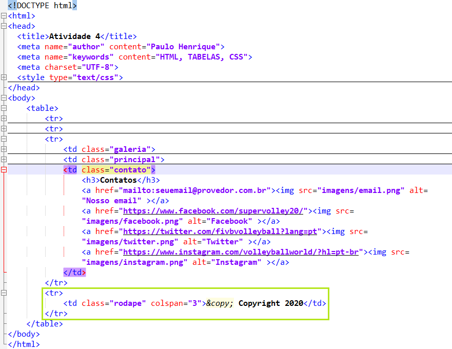
			   <figcaption>A tag <code>class="rodape"</code> contém as informações que já usamos em outras páginas. Agora vamos ver as propriedades CSS destas partes da página.</figcaption>
		   </li>
		   <li>
			   <input type="radio" id="134" name="sl">
			   <label for="134"></label>
			   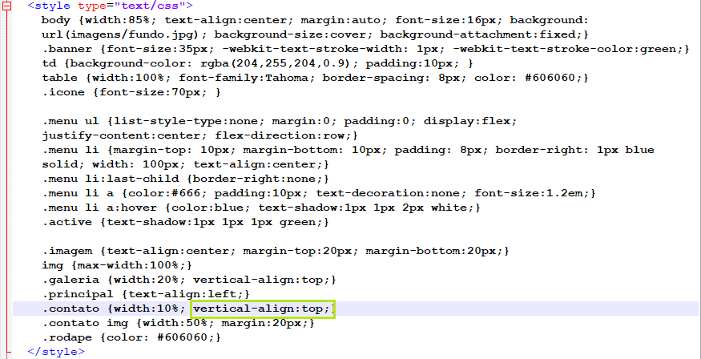
			   <figcaption>A tag de contato tem o alinhamento vertical definido no topo da célula com o atributo <code>vertical-align:top;</code>. Se definirmos a largura desta barra como <b>10%</b>, teremos <b>70%</b> para o conteúdo principal (pois a galeria ficou com <b>20%</b>). Teste diferentes valores para o conteúdo de sua página.</figcaption>
		   </li>
		   <li>
			   <input type="radio" id="135" name="sl">
			   <label for="135"></label>
			   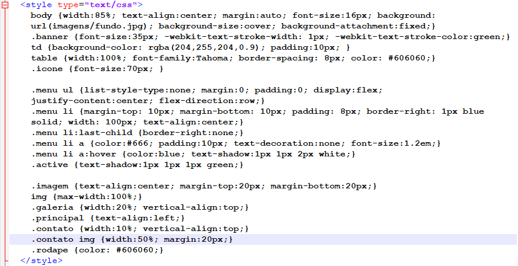
			   <figcaption>As imagens dentro desta classe podem ser menores, pois funcionam como ícones de acesso. Logo, usamos o atributo <code>.contato img</code> que significa que as larguras de dentro da classe de contato serão menores. Neste caso, usamos <b>50%</b>. Teste valores diferentes em sua página.</figcaption>
		   </li>
		   <li>
			   <input type="radio" id="136" name="sl">
			   <label for="136"></label>
			   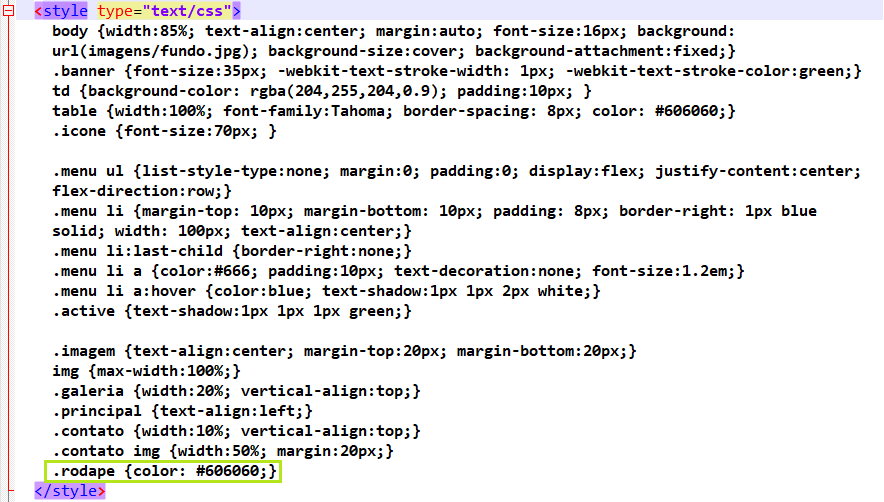
			   <figcaption>A tag de rodapé tem a configuração mais simples. Usamos as mesmas propriedades das páginas anteriores.</figcaption>
		   </li>
		   <li>
			   <input type="radio" id="137" name="sl">
			   <label for="137"></label>
			   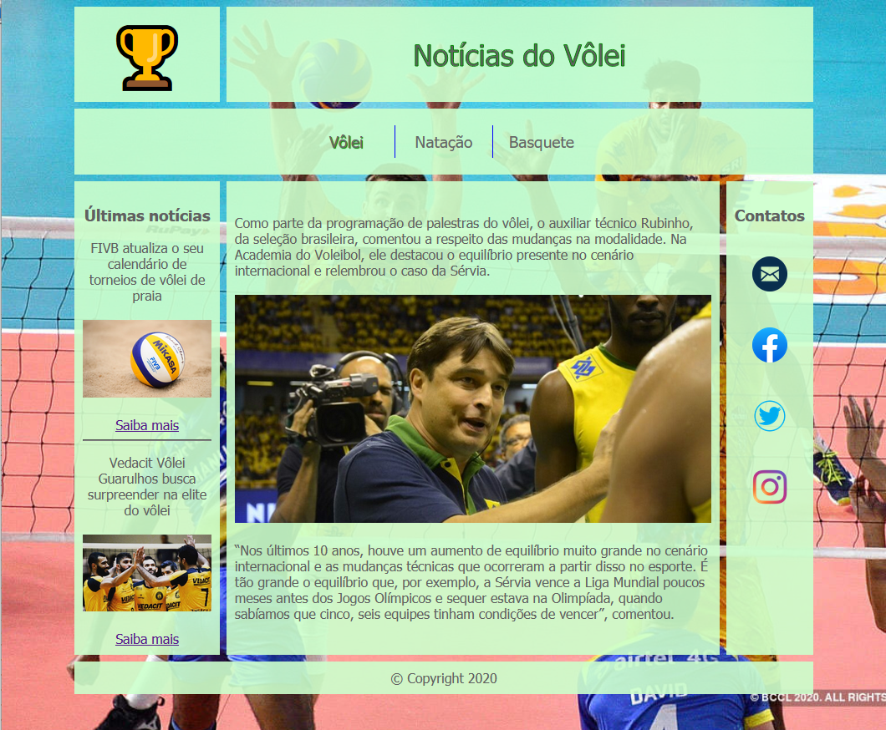
			   <figcaption>Com as propriedades definidas, a página <code>index.htm</code> fica com este layout. Teste medidas e cores para sua página. Depois de definir os valores mais adequados, você pode construir as outras 2 páginas: basta copiar e colar este código nos outros arquivos de esportes: no meu caso, <code>basquete.htm</code> e <code>natacao.htm</code>. Não esqueça de definir os menus das outras páginas com o item <code>active</code>. Coloque os 3 arquivos na mesma pasta, compartilhando a mesma pasta de imagens.</figcaption>
		   </li>
		   <li>
			   <input type="radio" id="138b" name="sl">
			   <label for="138b"></label>
			   <figcaption>
<button type="button" onclick="copyEvent('cod71', 'cd71')" onmouseout="outFunc('cd71')">Copiar o código</button>
Trecho da estrutura HTML do contato e do rodapé da Atividade 4:
<pre><code id="cod71"><a alt="classe de informações de contato">&lt;td class="contato"&gt;</a>
		<a alt="crie os links de emails e redes sociais">&lt;h3&gt;Contatos&lt;/h3&gt;</a>
		&lt;a href="mailto:seuemail@provedor.com.br"&gt;&lt;img src="imagens/email.png" alt="Nosso email" &gt;&lt;/a&gt;
		&lt;a href="https://www.facebook.com/supervolley20/"&gt;&lt;img src="imagens/facebook.png" alt="Facebook" &gt;&lt;/a&gt;
		&lt;a href="https://twitter.com/fivbvolleyball?lang=pt"&gt;&lt;img src="imagens/twitter.png" alt="Twitter" &gt;&lt;/a&gt;
		&lt;a href="https://www.instagram.com/volleyballworld/?hl=pt-br"&gt;&lt;img src="imagens/instagram.png" alt="Instagram" &gt;&lt;/a&gt;
	&lt;/td&gt;
&lt;/tr&gt;
&lt;tr&gt;
	&lt;td class="rodape" colspan="3"&gt;&amp;copy; Copyright 2020&lt;/td&gt;
&lt;/tr&gt;</code></pre></figcaption>
		   </li>
		   <li>
			   <input type="radio" id="138a" name="sl">
			   <label for="138a"></label>
			   <figcaption>
<button type="button" onclick="copyEvent('cod72', 'cd72')" onmouseout="outFunc('cd72')">Copiar o código</button>
Estrutura CSS do contato e do rodapé da Atividade 4:
<pre><code id="cod72">&lt;style type="text/css"&gt;
	body {width:85%; text-align:center; margin:auto; font-size:16px; 
	background-size: cover; background-attachment: fixed; background: url(imagens/fundo.jpg)}
	.banner {font-size:35px; -webkit-text-stroke-width: 1px; -webkit-text-stroke-color:green;}
	td {background-color: rgba(204,255,204,0.9); padding:10px; }
	table {width:100%; font-family:Tahoma; border-spacing: 8px; color: #606060;}
	.icone {font-size:70px; }
	
	.menu ul {list-style-type:none; margin:0; padding:0; display:flex; 
	justify-content:center; flex-direction:row;}
	.menu li {margin-top: 10px; margin-bottom: 10px; padding: 8px; 
	border-right: 1px blue solid; width: 100px; text-align:center;}
	.menu li:last-child {border-right:none;}
	.menu li a {color:#666; padding:10px; text-decoration:none; font-size:1.2em;}
	.menu li a:hover {color:blue; text-shadow:1px 1px 2px white;}
	.active {text-shadow:1px 1px 1px green;}
	
	.imagem {text-align:center; margin-top:20px; margin-bottom:20px;}
	img {max-width:100%;}
	.galeria {width:20%; vertical-align:top;}
	.principal {text-align:left;}
	<a alt="propriedades da barra de contato">.contato</a> {width:10%; vertical-align:top;}
	<a alt="propriedades das imagens da classe de contato">.contato img</a> {width:50%; margin:20px;}
	<a alt="propriedades da classe do rodapé">.rodape</a> {color: #606060;}
&lt;/style&gt;</code></pre></figcaption>
		   </li>
		</ul>
		
  

  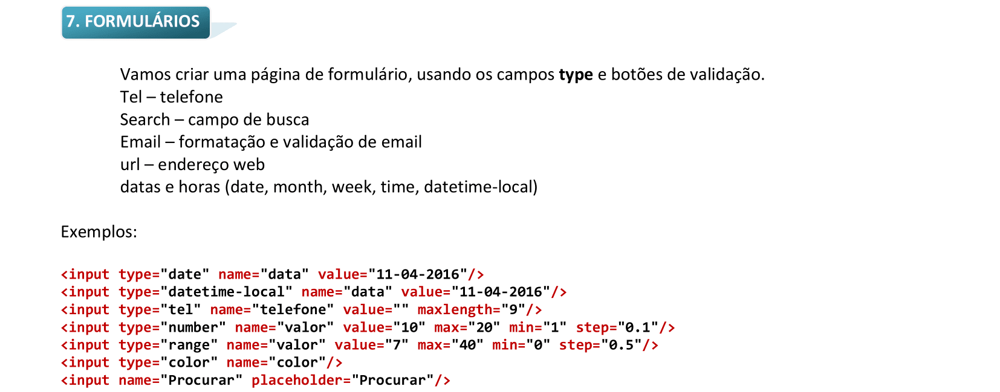
  
<a href="#css1" class="topo">voltar ao topo</a>

  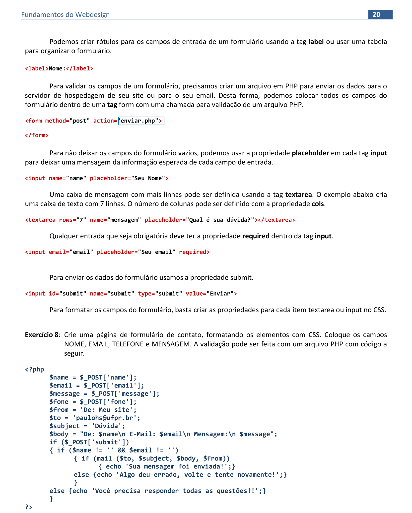
  

&#x1f4c3; Formulário de Contato

	
Crie uma página na nossa pasta de exercícios <code>webdesign/exercicios</code> com nome <code>contato.htm</code>. Outro arquivo que vamos criar nesta pasta chama-se <code>enviar.php</code>, com o código mostrado na apostila. Vamos mostrar a criação e layout de uma página de formulário, sem a configuração de um servidor para receber os dados enviados.

	  <ul class="slider">
		  <li>
			   <input type="radio" id="139" name="sl">
			   <label for="139"></label>
			   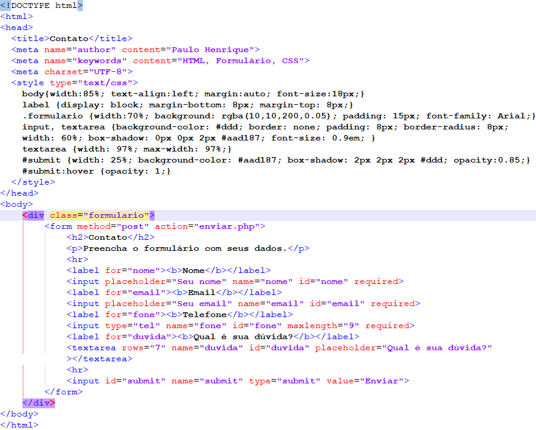
			   <figcaption>Podemos criar uma tag "mãe" do formulário <code>class="formulario"</code> para atribuir as propriedades de seus componentes.</figcaption>
		   </li>
		   <li>
			   <input type="radio" id="140" name="sl">
			   <label for="140"></label>
			   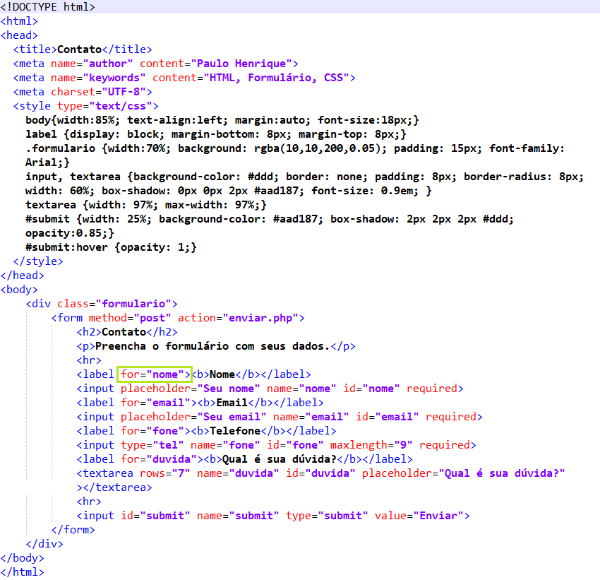
			   <figcaption>Cada entrada terá um rótulo "agregado" <code>&lt;label&gt;</code>. Este rótulo pode ser referenciado com o atributo <code>for</code>, com o nome da respectiva entrada.</figcaption>
		   </li>
		   <li>
			   <input type="radio" id="141" name="sl">
			   <label for="141"></label>
			   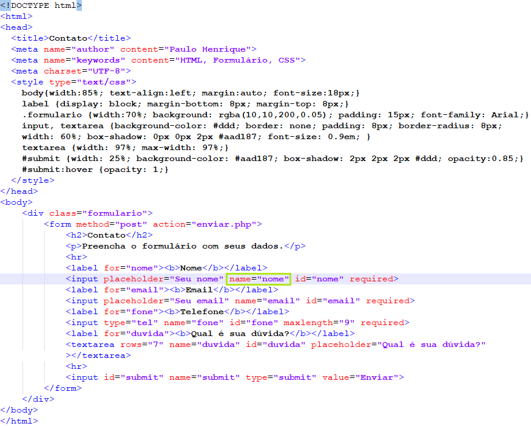
			   <figcaption>As entradas são colocadas no HTML na sequência de cada um de seus rótulos. Se você quiser fazer o formulário com rótulos ao lado das entradas, pode usar uma tabela para ajudar a organizar os dados da página.</figcaption>
		   </li>
		   <li>
			   <input type="radio" id="141a" name="sl">
			   <label for="141a"></label>
			   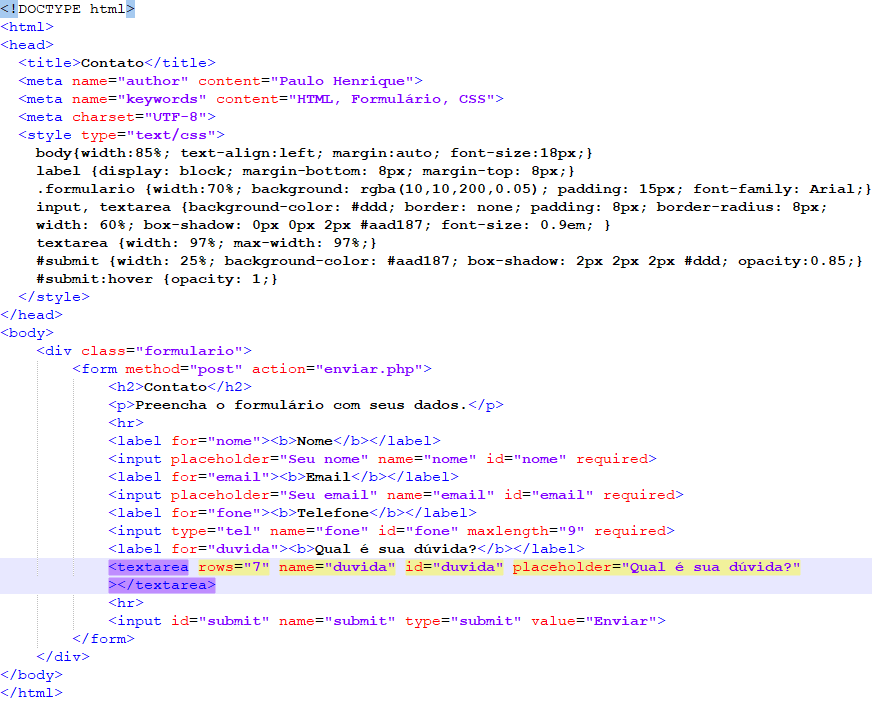
			   <figcaption>No final do formulário, criamos uma caixa de texto <code>&lt;textarea&gt;</code>, que pode ser deixada com mais linhas (neste caso, deixamos com 7 linhas).</figcaption>
		   </li>
		   <li>
			   <input type="radio" id="142" name="sl">
			   <label for="142"></label>
			   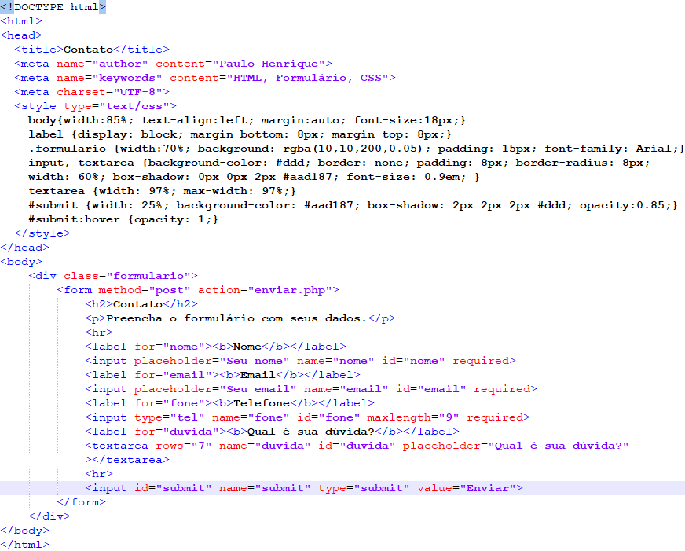
			   <figcaption>O botão de enviar tem o atributo <code>type="submit"</code> para caracterizá-lo com a interação com o visitante para enviar os dados.</figcaption>
		   </li>
		   <li>
			   <input type="radio" id="143" name="sl">
			   <label for="143"></label>
			   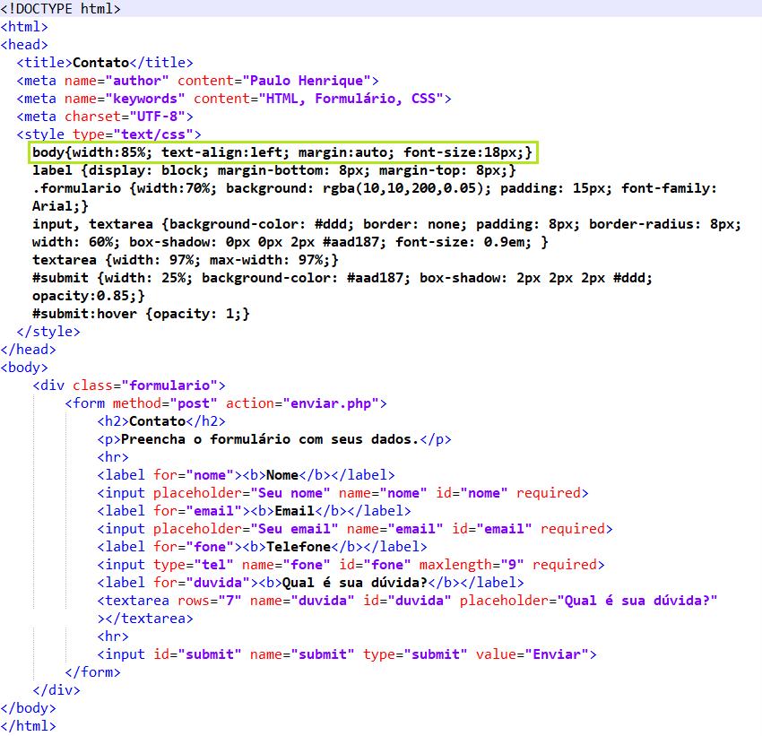
			   <figcaption>Agora vamos formatar as tags da página com CSS. O corpo da página <code>body</code> tem margem automática e uma largura de <b>85%</b>. Formate os elementos principais da página nesta tag.</figcaption>
		   </li>
		   <li>
			   <input type="radio" id="144" name="sl">
			   <label for="144"></label>
			   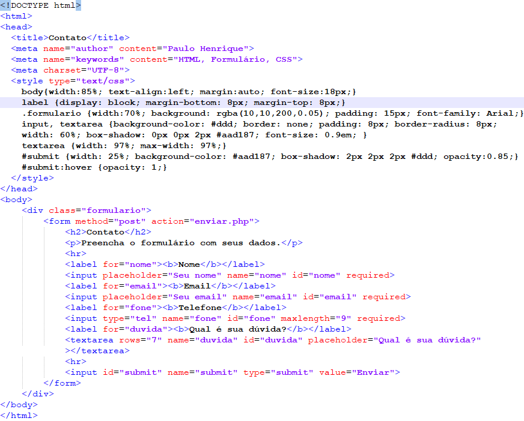
			   <figcaption>Os rótulos <code>label</code> têm atributo <code>display: block;</code>, que usa a linha inteira sem precisarmos de tags de parágrafos e de quebras de linhas para inserir as entradas <code>input</code>. Note que colocamos margens para não "grudar" os rótulos com as entradas.</figcaption>
		   </li>
		   <li>
			   <input type="radio" id="145" name="sl">
			   <label for="145"></label>
			   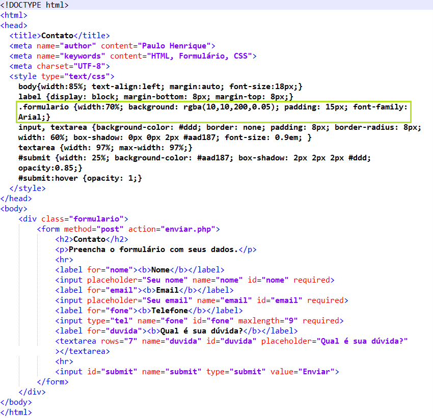
			   <figcaption>A classe <code>formulario</code> serve como um "container" do formulário, onde podemos atribuir cor de fundo, margem interna e tipo de fonte.</figcaption>
		   </li>
		   <li>
			   <input type="radio" id="146" name="sl">
			   <label for="146"></label>
			   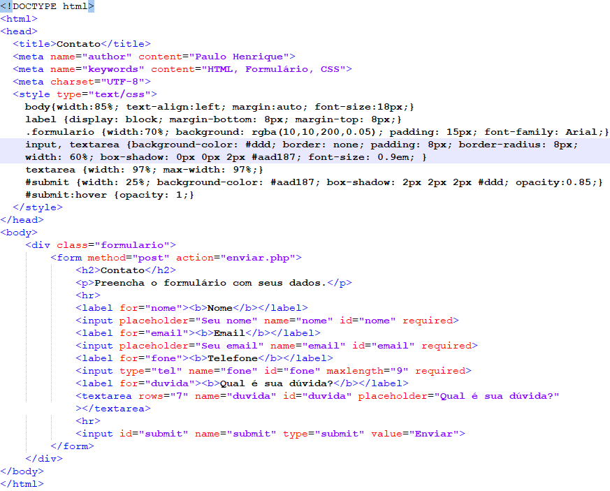
			   <figcaption>As entradas com tags nativas <code>input</code> e <code>textarea</code> têm propriedades de largura, cor de fundo, sombras e margens internas que podem ser alteradas. Neste exemplo, criamos bordas arredondadas com o atributo <code>border-radius</code>.</figcaption>
		   </li>
		   <li>
			   <input type="radio" id="147" name="sl">
			   <label for="147"></label>
			   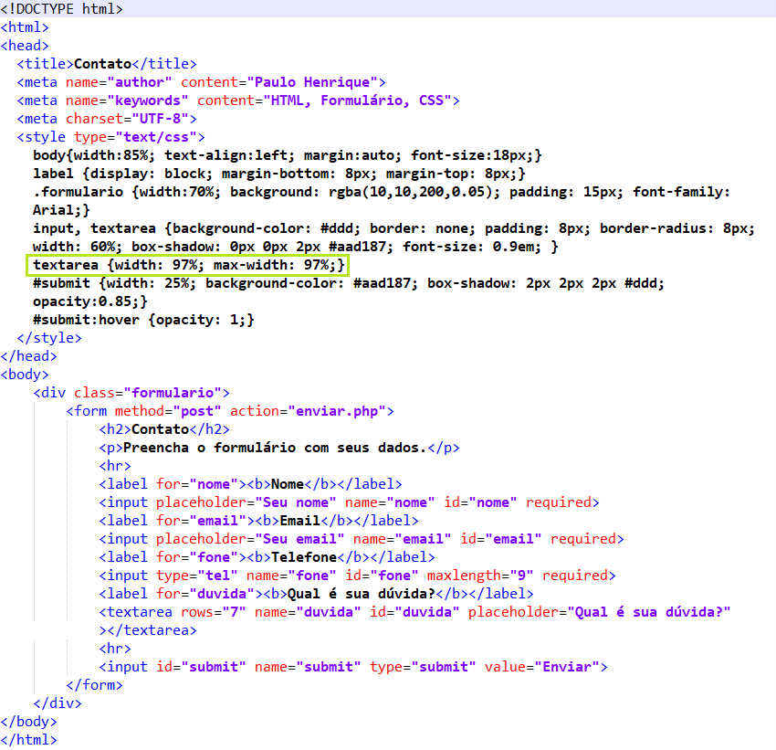
			   <figcaption>A tag <code>textarea</code> pode ser inserida com largura maior do que as outras entradas. Por tratar-se de uma tag "elástica", que o visitante pode "abrir" com o cursor do mouse, colocamos também o tamanho de largura máxima <code>max-width</code>.</figcaption>
		   </li>
		   <li>
			   <input type="radio" id="148" name="sl">
			   <label for="148"></label>
			   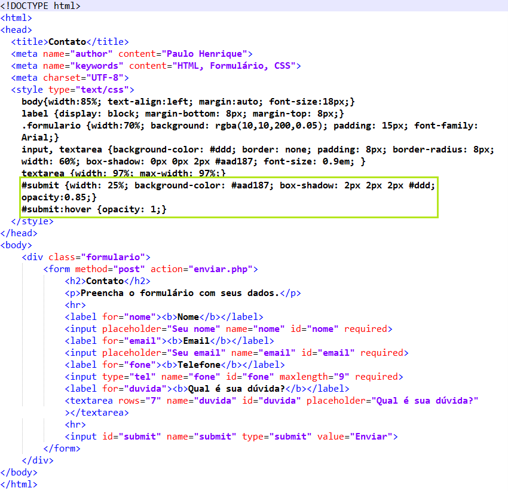
			   <figcaption>Como o botão para enviar os dados tem <code>id="submit"</code> no código HTML, sua formatação usa a hashtag <code>#submit</code> para referência. Este botão pode ter uma opacidade definida (neste exemplo é de <b>85%</b>), que modifica quando o visitante passa o cursor do mouse por cima do botão. Colocamos também a sombra <code>box-shadow</code> para dar um efeito de 3D.</figcaption>
		   </li>
		   <li>
			   <input type="radio" id="149" name="sl">
			   <label for="149"></label>
			   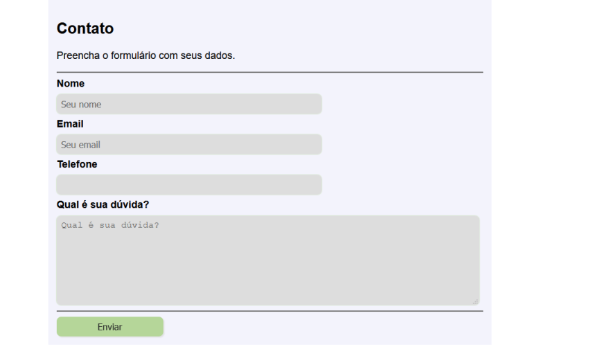
			   <figcaption>A página com contato fica com este layout. Modifique medidas, cores e crie sua página de contato. Vamos utilizá-la em próximas Atividades. </figcaption>
		   </li>
		   <li>
			   <input type="radio" id="149a" name="sl">
			   <label for="149a"></label>
			   <figcaption>
<button type="button" onclick="copyEvent('cod73', 'cd73')" onmouseout="outFunc('cd73')">Copiar o código</button>
Estrutura CSS do formulário:
<pre><code id="cod73">&lt;style type="text/css"&gt;
	body {width:85%; text-align:left; margin:auto; font-size:18px;}
	<a alt="propriedades dos rótulos do formulário">label</a> {display: block; margin-bottom: 8px; margin-top: 8px;}
	<a alt="propriedades da classe formulario">.formulario</a> {width:70%; background: rgba(10,10,200,0.05); padding: 15px; font-family: Arial;}
	<a alt="propriedades das tags de caixas de texto">input, textarea</a> {background-color: #ddd; border: none; padding: 8px; 
	border-radius: 8px; width: 60%; box-shadow: 0px 0px 2px #aad187; font-size: 0.9em; }
	textarea {width: 97%; max-width: 97%;}
	<a alt="propriedades do botão para enviar o formulário">#submit</a> {width: 25%; background-color: #aad187; box-shadow: 2px 2px 2px #ddd; opacity:0.85;}
	#submit:hover {opacity: 1;}
&lt;/style&gt;</code></pre>

<button type="button" onclick="copyEvent('cod74', 'cd74')" onmouseout="outFunc('cd74')">Copiar o código</button>
Estrutura PHP do formulário:
<pre><code id="cod74">&lt;?php  
	<a alt="tags de cada item do formulário">$name</a> = $_POST['name'];  
	$email = $_POST['email'];  
	$message = $_POST['message']; 
	$fone = $_POST['fone'];  
	$from = 'De: Meu site';  
	$to = 'paulohs@ufpr.br';  
	$subject = 'Dúvida';  
	$body = "De: $name\n E-Mail: $email\n Mensagem:\n $message";  
	<a alt="condicional de verificação de erros do envio do formulário">if ($_POST['submit'])  { if ($name != '' && $email != '')</a> 
		{ if (mail ($to, $subject, $body, $from))  
			{ echo 'Sua mensagem foi enviada!';} 
		else {echo 'Algo deu errado, volte e tente novamente!';} 
		} 
	else {echo 'Você precisa responder todas as questões!!';} 
	} 
?&gt;</code></pre></figcaption>
		   </li>
		   <li>
			   <input type="radio" id="149b" name="sl">
			   <label for="149b"></label>
			   <figcaption>
<button type="button" onclick="copyEvent('cod75', 'cd75')" onmouseout="outFunc('cd75')">Copiar o código</button>
Estrutura HTML do formulário:
<pre><code id="cod75"><a alt="tag principal do formulário">&lt;div class="formulario"&gt;</a>
	&lt;form method="post" action="enviar.php"&gt;
		&lt;h2&gt;Contato&lt;/h2&gt;
		&lt;p&gt;Preencha o formulário com seus dados.&lt;/p&gt;
		&lt;hr&gt;
		<a alt="rótulos de informações para o usuário">&lt;label for="nome"&gt;&lt;b&gt;Nome&lt;/b&gt;&lt;/label&gt;</a>
		&lt;input placeholder="Seu nome" name="nome" id="nome" required&gt;
		&lt;label for="email"&gt;&lt;b&gt;Email&lt;/b&gt;&lt;/label&gt;
		&lt;input placeholder="Seu email" name="email" id="email" required&gt;
		&lt;label for="fone"&gt;&lt;b&gt;Telefone&lt;/b&gt;&lt;/label&gt;
		&lt;input type="tel" name="fone" id="fone" maxlength="9" required&gt;
		&lt;label for="duvida"&gt;&lt;b&gt;Qual é sua dúvida?&lt;/b&gt;&lt;/label&gt;
		&lt;textarea rows="7" name="duvida" id="duvida" placeholder="Qual é sua dúvida?"&gt;&lt;/textarea&gt;
		&lt;hr&gt;
		<a alt="botão de envio do formulário">&lt;input id="submit" name="submit" type="submit" value="Enviar"&gt;</a>
	&lt;/form&gt;
&lt;/div&gt;</code></pre></figcaption>
		   </li>
		</ul>
		
  

  
<a href="#css1" class="topo">voltar ao topo</a>

3. CSS, Flexbox e Mapeamentos de imagens

	
Material da pág. 21 até a pág. 27

	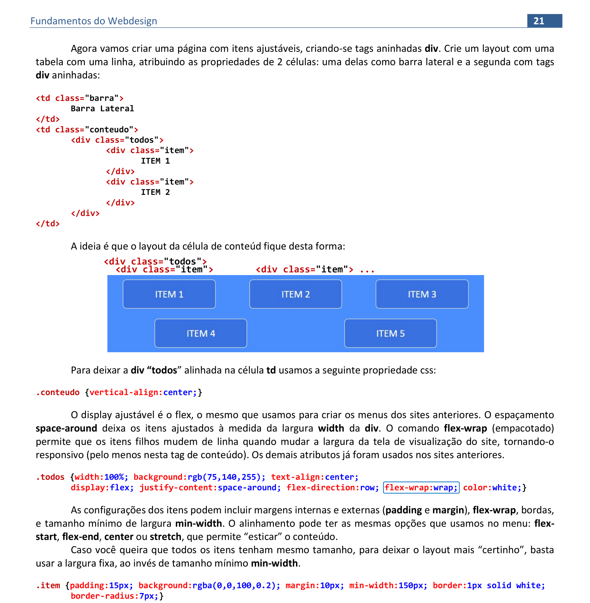
	

&#x1f4c3; FlexBox para itens

	
Crie uma página na nossa pasta de exercícios <code>webdesign/exercicios</code> com nome <code>itens.htm</code>. Dentro desta pasta, use a pasta de imagens para inserir fotos dos itens que vamos criar com o atributo FlexBox. É o mesmo que já usamos nos itens dos menus.

	  <ul class="slider">
		  <li>
			   <input type="radio" id="150" name="sl">
			   <label for="150"></label>
			   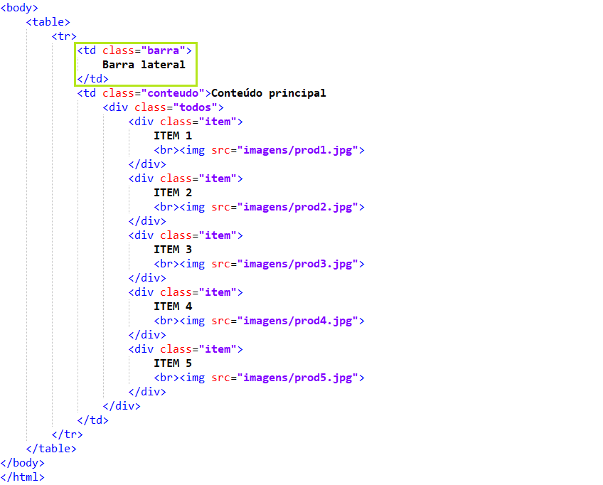
			   <figcaption>Usando a estrutura em tabela, vamos criar somente uma linha com a tag <code>&lt;tr&gt;</code> com duas barras: <b>lateral</b>, na primeira célula <code>&lt;td&gt;</code> e <b>conteúdo</b>, na segunda célula.</figcaption>
		   </li>
		   <li>
			   <input type="radio" id="151" name="sl">
			   <label for="151"></label>
			   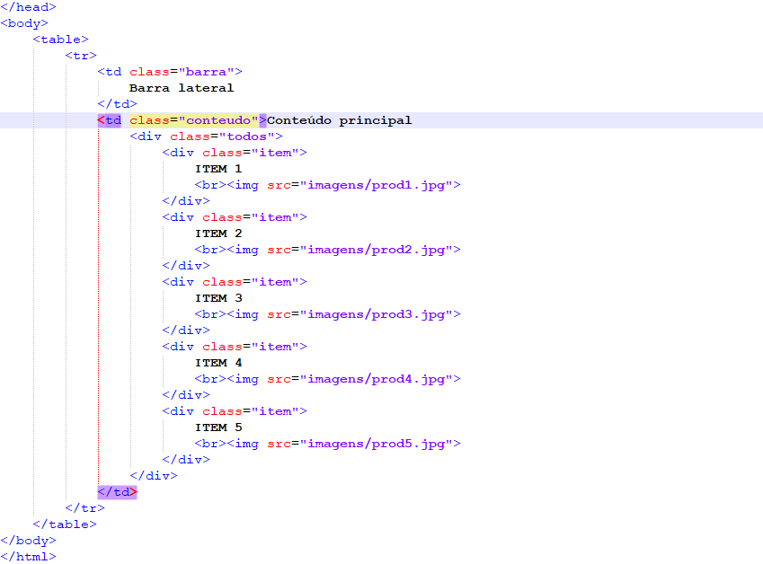
			   <figcaption>As tags podem ser referenciadas com as classes <code>class="barra"</code> e <code>class="conteudo"</code>.</figcaption>
		   </li>
		   <li>
			   <input type="radio" id="153" name="sl">
			   <label for="153"></label>
			   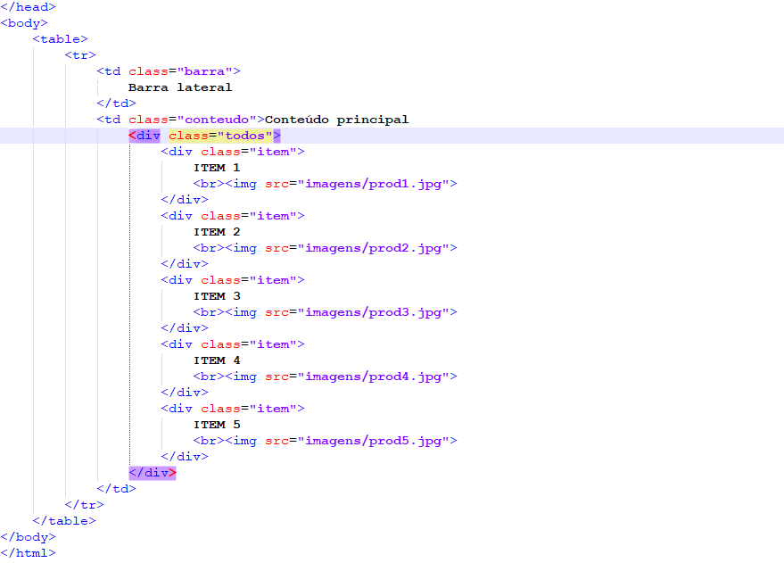
			   <figcaption>Dentro da célula de <b>conteúdo</b>, crie uma nova classe para formatarmos no CSS: <code>class="todos"</code>, que será a tag mãe dos itens.</figcaption>
		   </li>
		   <li>
			   <input type="radio" id="154" name="sl">
			   <label for="154"></label>
			   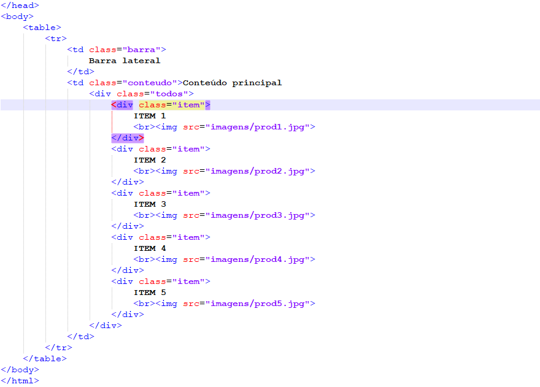
			   <figcaption>Dentro desta <b>div</b>, podemos criar as tags filhas, que terão nomes <code>class="item"</code>. Em cada uma, coloque um texto e a respectiva imagem que está salva na pasta de imagens. Crie 5 ou mais itens, para testarmos o layout que será usado na próxima Atividade.</figcaption>
		   </li>
		   <li>
			   <input type="radio" id="155" name="sl">
			   <label for="155"></label>
			   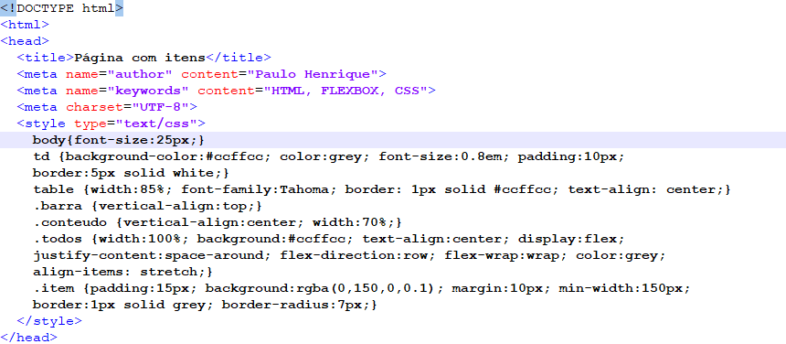
			   <figcaption>Agora vamos formatar as tags da página com CSS. Nesta página somente foi atribuído o tamanho da fonte na tag <code>body</code>.</figcaption>
		   </li>
		   <li>
			   <input type="radio" id="156" name="sl">
			   <label for="156"></label>
			   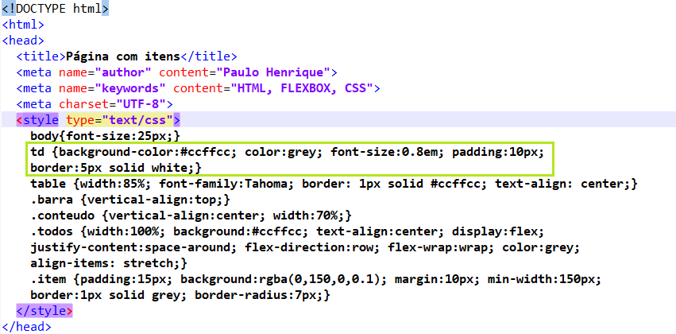
			   <figcaption>Neste exemplo, foi usado <code>font-size:0.8em</code>, ou seja, teremos 80% do tamanho da fonte dentro das células. Atributos de cor de fundo e margens também podem ser colocados nesta tag <code>td</code>.</figcaption>
		   </li>
		   <li>
			   <input type="radio" id="157" name="sl">
			   <label for="157"></label>
			   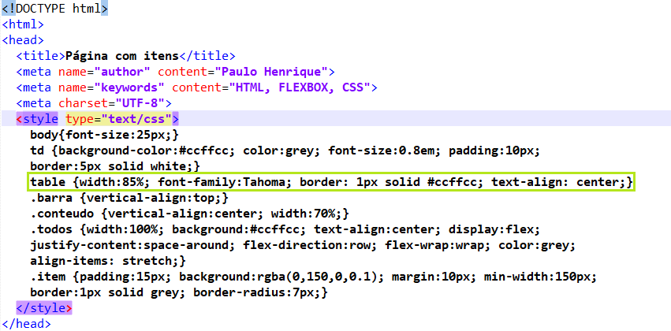
			   <figcaption>A tag mãe das células, <code>table</code>, pode ser usada para a largura do layout, bordas e alinhamento de texto.</figcaption>
		   </li>
		   <li>
			   <input type="radio" id="158" name="sl">
			   <label for="158"></label>
			   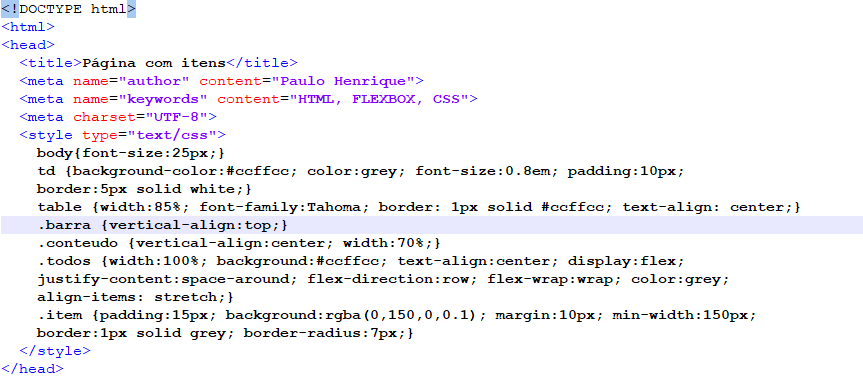
			   <figcaption>Use atributos para formatar a barra lateral. Neste caso, foi usado o alinhamento vertical <code>vertical-align:top</code> para deixá-la na mesma altura do conteúdo.</figcaption>
		   </li>
		   <li>
			   <input type="radio" id="159" name="sl">
			   <label for="159"></label>
			   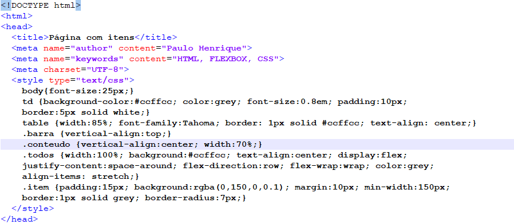
			   <figcaption>A tag de conteúdo pode ter atributos configurados de alinhamento vertical e largura. Se atribuirmos 70% de largura, automaticamente a barra lateral fica com os 30% restantes.</figcaption>
		   </li>
		   <li>
			   <input type="radio" id="160" name="sl">
			   <label for="160"></label>
			   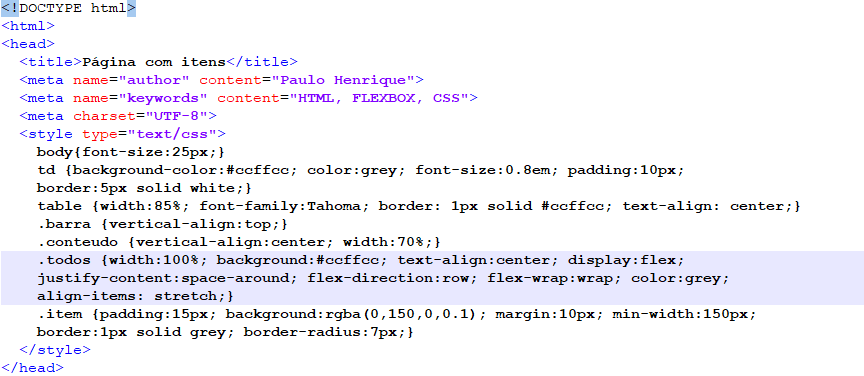
			   <figcaption>A tag com todos os itens ficou com atributo de <code>display:flex;</code>, distribuição em linha <code>flex-direction:row;</code> e o atributo <code>flex-wrap:wrap;</code> para deixar que os itens mudem de linha automaticamente se o navegador não conseguir exibí-los todos na mesma linha.</figcaption>
		   </li>
		   <li>
			   <input type="radio" id="161" name="sl">
			   <label for="161"></label>
			   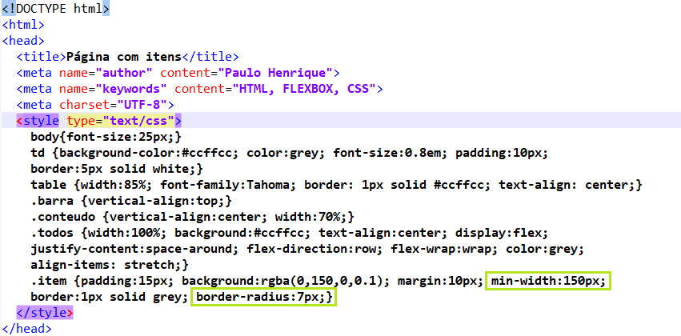
			   <figcaption>Os itens herdam a propriedade flex da tag mãe "todos". Os itens podem ter o atributo de largura mínima <code>min-width:150px;</code>, evitando que o respectivo conteúdo seja "espremido" demais para caber em uma linha só. Cor de fundo, borda e arredondamento de bordas podem ser atribuídos nos itens. Faça testes do layout do flexbox que criamos.</figcaption>
		   </li>
		   <li>
			   <input type="radio" id="162" name="sl">
			   <label for="162"></label>
			   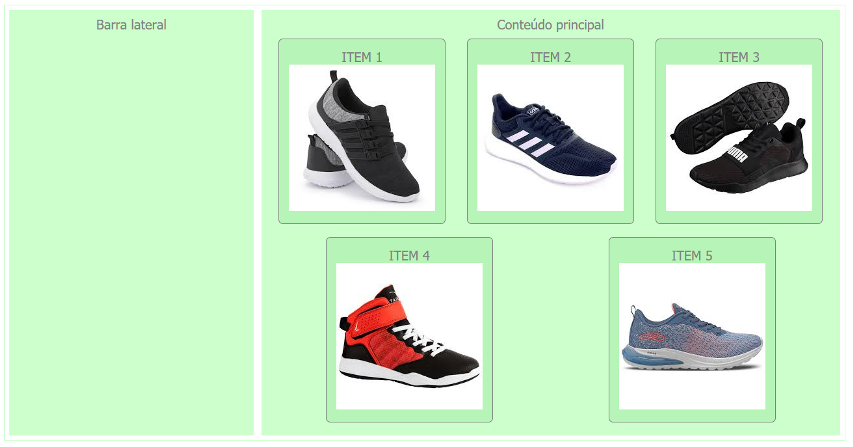
			   <figcaption>A página de itens fica com este layout. Modifique medidas, cores e crie sua página de itens, que será utilizada em próximas Atividades. Se as alturas das imagens ficarem muito diferentes, você pode usar altura mínima <code>min-height</code> ou editar as imagens externamente, deixando-as com mesmo tamanho.</figcaption>
		   </li>
		   <li>
			   <input type="radio" id="162a" name="sl">
			   <label for="162a"></label>
			   <figcaption>
<button type="button" onclick="copyEvent('cod76', 'cd76')" onmouseout="outFunc('cd76')">Copiar o código</button>
Trecho da estrutura HTML:
<pre><code id="cod76">&lt;table&gt;
	&lt;tr&gt;
		<a alt="espaço da barra lateral que vamos preencher">&lt;td class="barra"&gt;</a>
			Barra lateral
		&lt;/td&gt;
		&lt;td class="conteudo"&gt;Conteúdo principal
			<a alt="tag da classe todos, com os itens flexbox">&lt;div class="todos"&gt;</a>
				<a alt="tags separadas dos itens">&lt;div class="item"&gt;</a>
					ITEM 1
					&lt;br&gt;&lt;img src="imagens/prod1.jpg"&gt;
				&lt;/div&gt;
				&lt;div class="item"&gt;
					ITEM 2
					&lt;br&gt;&lt;img src="imagens/prod2.jpg"&gt;
				&lt;/div&gt;
				&lt;div class="item"&gt;
					ITEM 3
					&lt;br&gt;&lt;img src="imagens/prod3.jpg"&gt;
				&lt;/div&gt;
				&lt;div class="item"&gt;
					ITEM 4
					&lt;br&gt;&lt;img src="imagens/prod4.jpg"&gt;
				&lt;/div&gt;
				&lt;div class="item"&gt;
					ITEM 5
					&lt;br&gt;&lt;img src="imagens/prod5.jpg"&gt;
				&lt;/div&gt;
			&lt;/div&gt;
		&lt;/td&gt;
	&lt;/tr&gt;
&lt;/table&gt;</code></pre></figcaption>
		   </li>
			<li>
			   <input type="radio" id="162b" name="sl">
			   <label for="162b"></label>
			   <figcaption>
<button type="button" onclick="copyEvent('cod77', 'cd77')" onmouseout="outFunc('cd77')">Copiar o código</button>
Estrutura CSS:
<pre><code id="cod77">&lt;style&gt;
	body {font-size:25px;}
	<a alt="propriedades das células da tabela">td</a> {background-color:#ccffcc; color:grey; font-size:0.8em; padding:10px; 
	border:5px solid white;}
	<a alt="propriedades da tabela">table</a> {width:85%; font-family:Tahoma; border: 1px solid #ccffcc; text-align: center;}
	<a alt="classe da barra lateral">.barra</a> {vertical-align:top;}
	<a alt="classe da barra de conteúdo">.conteudo</a> {vertical-align:center; width:70%;}
	<a alt="classe de todos os itens com propriedade flexbox">.todos</a> {width:100%; background:#ccffcc; text-align:center; display:flex; color:grey;
	<a alt="display flex com preenchimento do conteúdo em linhas">justify-content:space-around; flex-direction:row;</a> flex-wrap:wrap; align-items:stretch;}
	<a alt="propriedades da classe de cada item">.item</a> {padding:15px; background:rgba(0,150,0,0.1); margin:10px; min-width:150px;
	border:1px solid grey; border-radius:7px;}
&lt;/style&gt;</code></pre></figcaption>
		   </li>
		</ul>
		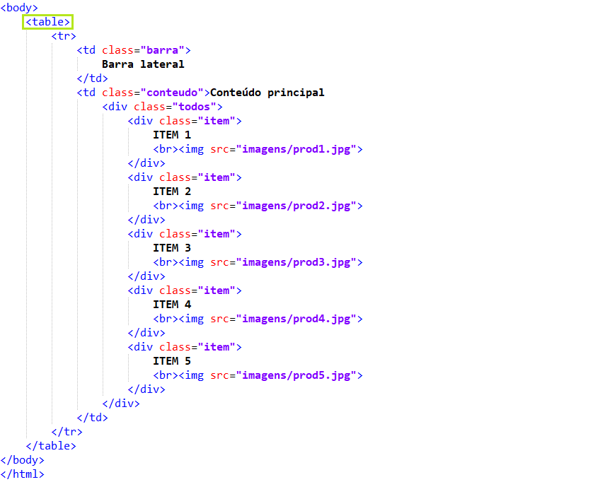
  

	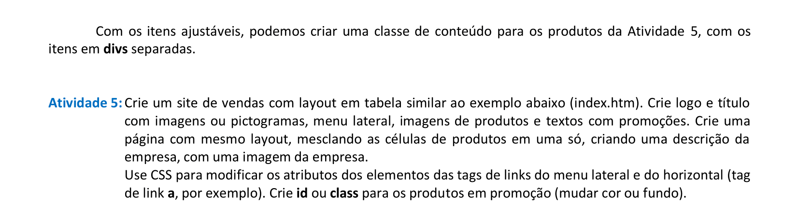
	
<a href="#css2" class="topo">voltar ao topo</a>

	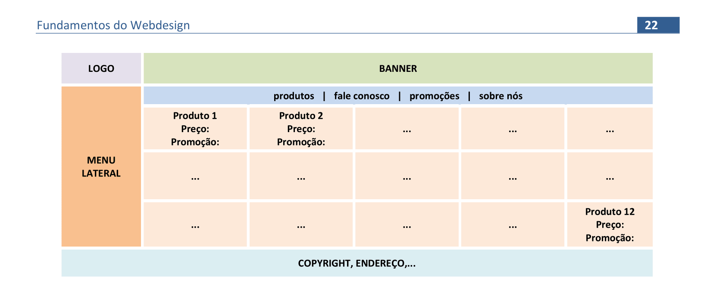
	

&#x1f4c3; Detalhes da página principal

	
Crie uma pasta chamada <code>webdesign/atividade5</code>, com a página principal com nome <code>index.htm</code>. Dentro desta pasta, crie a pasta de imagens para inserir fotos dos 12 itens que aparecem na página criada. Vamos usar muitos recursos da página que construímos com Flexbox.

	  <ul class="slider">
		  <li>
			   <input type="radio" id="163" name="sl">
			   <label for="163"></label>
			   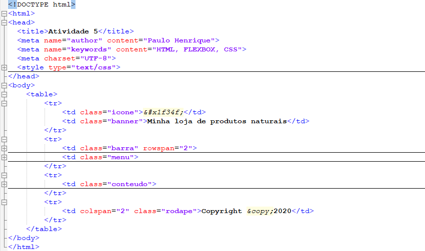
			   <figcaption>A estrutura HTML desta Atividade terá 1 linha com o <b>ícone</b> e o <b>banner</b> da loja, uma linha com a <b>barra lateral</b> e o <b>menu</b>, na outra linha aparece o <b>conteúdo</b> com itens da loja e finalizamos com o <b>rodapé</b> na última linha.</figcaption>
		   </li>
		  <li>
			   <input type="radio" id="164" name="sl">
			   <label for="164"></label>
			   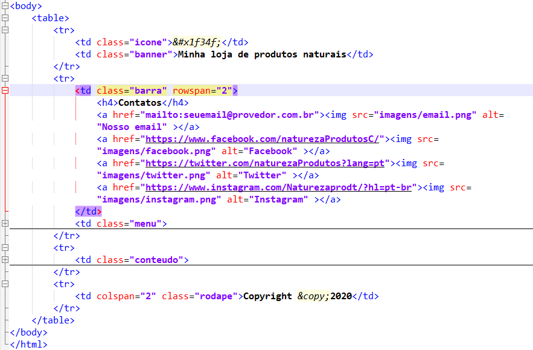
			   <figcaption>Na <b>barra lateral</b>, podemos usar a mesma estrutura da Atividade 4, com email e links para redes sociais fictícias, da loja virtual que estamos criando.</figcaption>
		   </li>
		   <li>
			   <input type="radio" id="165" name="sl">
			   <label for="165"></label>
			   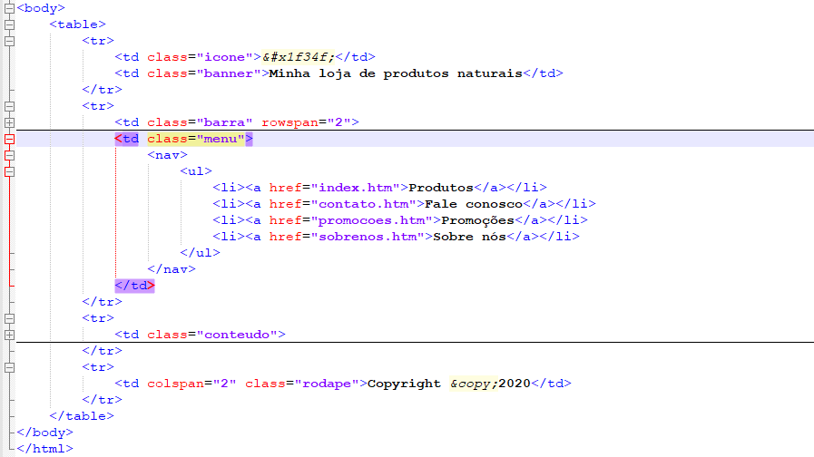
			   <figcaption>O <b>menu</b> terá estrutura parecida com a que usamos na Atividade 4, inclusive na sua programação CSS.</figcaption>
		   </li>
		   <li>
			   <input type="radio" id="166" name="sl">
			   <label for="166"></label>
			   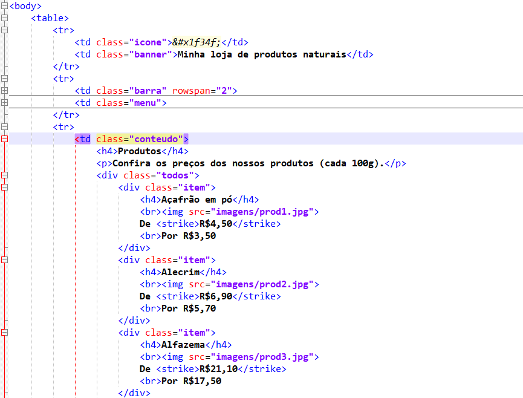
			   <figcaption>Os itens da loja podem ser colocados dentro da tag <code>class="todos"</code>, que usamos na página anterior. Cada item aparece dentro de uma classe <code>class="item"</code>, onde colocamos um título do produto, uma imagem e o preço, com a tag <code>&lt;strike&gt;</code> para os preços antigos de cada um dos 12 produtos.</figcaption>
		   </li>
		   <li>
			   <input type="radio" id="167" name="sl">
			   <label for="167"></label>
			   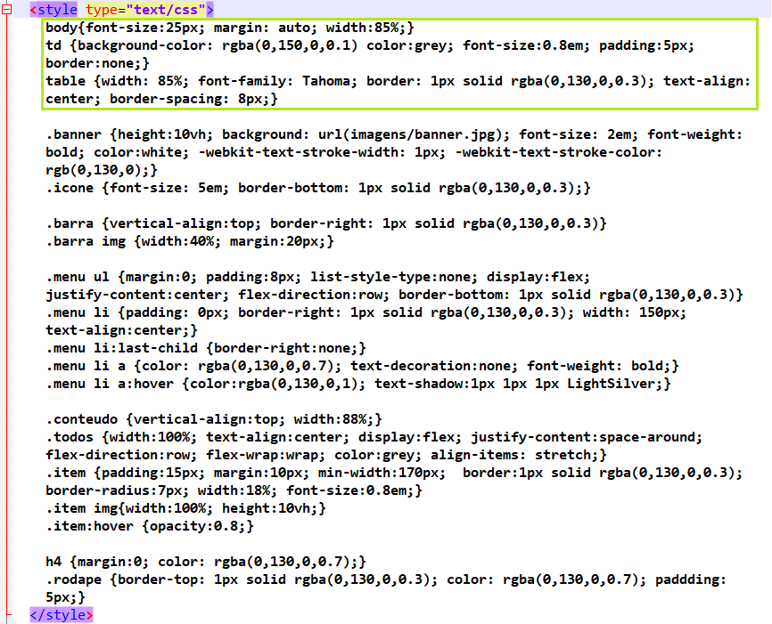
			   <figcaption>A programação da página CSS tem itens que valem para a página principal e para as páginas filhas. A tabela está com fundo branco, com bordas em tom verde claro. O atributo <code>border-spacing</code> separa as partes das páginas.</figcaption>
		   </li>
		   <li>
			   <input type="radio" id="168" name="sl">
			   <label for="168"></label>
			   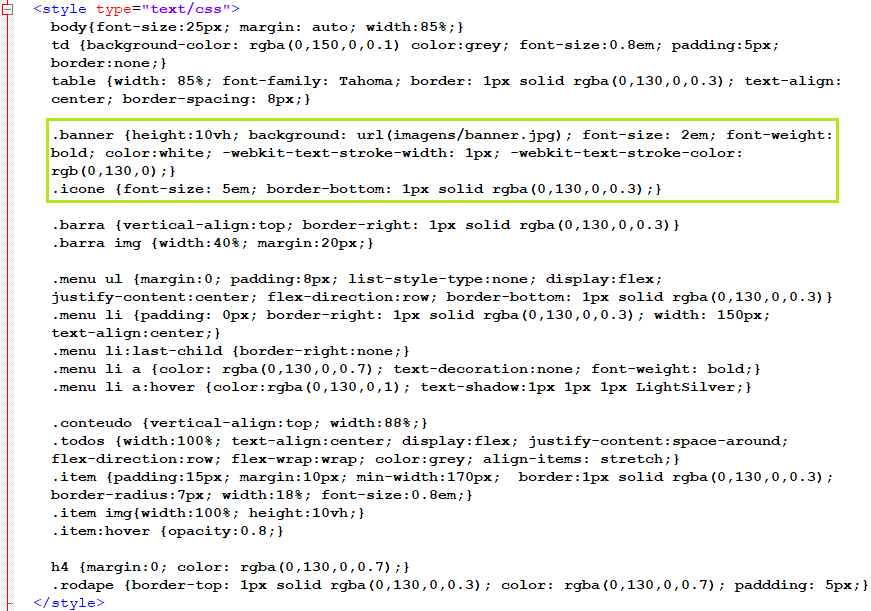
			   <figcaption>O banner está referenciado com a altura da tela do navegador com o atributo <code>height:10vh;</code>, ou seja, <b>10%</b> da altura da tela. Uma imagem de fundo dos produtos e a cor do texto também podem ser configurados no CSS. Escolha um <a href="http://www.degraf.ufpr.br/docentes/paulo/webdesign/pictograph.html" target="_blank">pictograma</a> para colocar na tag de ícone.</figcaption>
		   </li>
		   <li>
			   <input type="radio" id="169" name="sl">
			   <label for="169"></label>
			   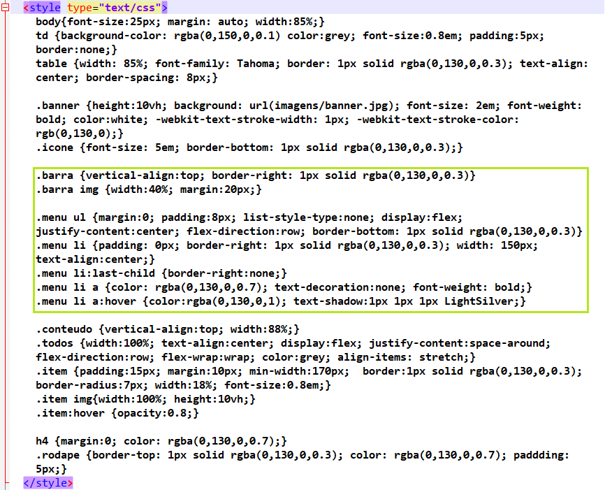
			   <figcaption>A barra lateral e o menu também ficarão fixos, valendo para todas as páginas do site desta atividade. Você pode usar os mesmos atributos da Atividade 4, modificando cores e espaçamentos para a loja virtual</figcaption>
		   </li>
		   <li>
			   <input type="radio" id="170" name="sl">
			   <label for="170"></label>
			   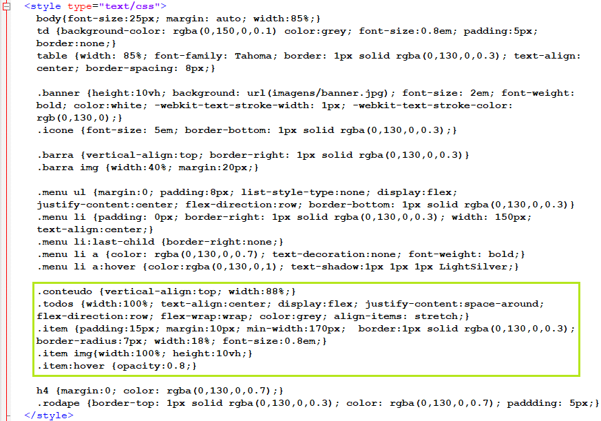
			   <figcaption>O conteúdo pode ter propriedades diferentes em cada página do site. Nesta primeira página, estamos colocando os itens com atributos <b>flexbox</b> para os produtos da loja. Margens, cores e configurações de fonte podem ser modificadas nesta tag.Para deixar as imagens com mesmo tamanho, foi usada a propriedade de altura no atributo <code>.item img {}</code>.</figcaption>
		   </li>
		   <li>
			   <input type="radio" id="171" name="sl">
			   <label for="171"></label>
			   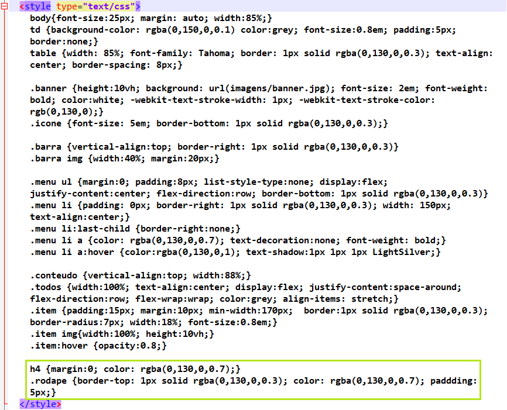
			   <figcaption>Os cabeçalhos dos produtos e o rodapé podem ser configurados em CSS.</figcaption>
		   </li>
		   <li>
			   <input type="radio" id="172" name="sl">
			   <label for="172"></label>
			   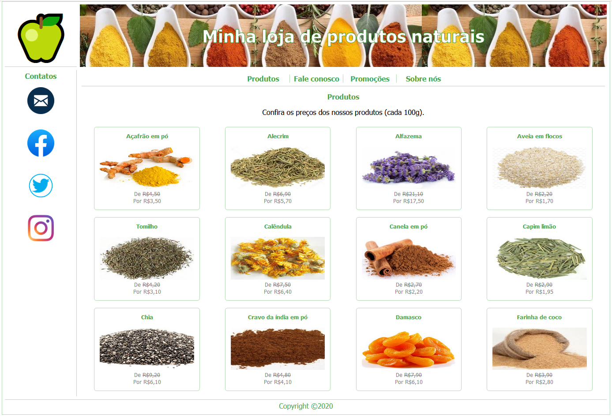
			   <figcaption>Usando os atributos mostrados, a página <code>index.htm</code> fica com este layout. Monte a sua página da Atividade da loja virtual. Agora, vamos ver como criar as "páginas filhas".</figcaption>
		   </li>
		   <li>
			   <input type="radio" id="172a" name="sl">
			   <label for="172a"></label>
			   <figcaption>
<button type="button" onclick="copyEvent('cod78', 'cd78')" onmouseout="outFunc('cd78')">Copiar o código</button>
Trecho da estrutura HTML:
<pre><code id="cod78">&lt;table&gt;
	&lt;tr&gt;
		<a alt="tag para o ícone: imagem ou pictograma">&lt;td class="icone"&gt;&amp;#x1f34f;&lt;/td&gt;</a>
		<a alt="tag do banner: imagem com texto">&lt;td class="banner"&gt;Minha loja de produtos naturais&lt;/td&gt;</a>
	&lt;/tr&gt;
	&lt;tr&gt;
		<a alt="barra lateral com informações de contato">&lt;td class="barra" rowspan="2"&gt;</a>
			&lt;h4&gt;Contatos&lt;/h4&gt;
			&lt;a href="mailto:seuemail@provedor.com.br"&gt;&lt;img src="imagens/email.png" alt="Nosso email" &gt;&lt;/a&gt;
			&lt;a href="https://www.facebook.com/naturezaProdutosC/"&gt;&lt;img src="imagens/facebook.png" alt="Facebook" &gt;&lt;/a&gt;
			&lt;a href="https://twitter.com/naturezaProdutos?lang=pt"&gt;&lt;img src="imagens/twitter.png" alt="Twitter" &gt;&lt;/a&gt;
			&lt;a href="https://www.instagram.com/Naturezaprodt/?hl=pt-br"&gt;&lt;img src="imagens/instagram.png" alt="Instagram" &gt;&lt;/a&gt;
		&lt;/td&gt;
		<a alt="menu do site">&lt;td class="menu"&gt;</a>
			&lt;nav&gt;
				&lt;ul&gt;
					&lt;li&gt;&lt;a href="index.htm"&gt;Produtos&lt;/a&gt;&lt;/li&gt;
					&lt;li&gt;&lt;a href="contato.htm"&gt;Fale conosco&lt;/a&gt;&lt;/li&gt;
					&lt;li&gt;&lt;a href="promocoes.htm"&gt;Promoções&lt;/a&gt;&lt;/li&gt;
					&lt;li&gt;&lt;a href="sobrenos.htm"&gt;Sobre nós&lt;/a&gt;&lt;/li&gt;
				&lt;/ul&gt;
			&lt;/nav&gt;
		&lt;/td&gt;
	&lt;/tr&gt;
	&lt;tr&gt;
		<a alt="conteúdo principal de cada página">&lt;td class="conteudo"&gt;</a>
			&lt;h4&gt;Produtos&lt;/h4&gt;
			&lt;p&gt;Confira os preços dos nossos produtos (cada 100g).&lt;/p&gt;
			<a alt="classe que engloba todos os itens">&lt;div class="todos"&gt;</a>
				<a alt="classe de um dos itens da loja">&lt;div class="item"&gt;</a>
					&lt;h4&gt;Açafrão em pó&lt;/h4&gt;
					&lt;br&gt;&lt;img src="imagens/prod1.jpg"&gt;
					De &lt;strike&gt;R$4,50&lt;/strike&gt;
					&lt;br&gt;Por R$3,50
				&lt;/div&gt;
				&lt;div class="item"&gt;
					&lt;h4&gt;Alecrim&lt;/h4&gt;
					&lt;br&gt;&lt;img src="imagens/prod2.jpg"&gt;
					De &lt;strike&gt;R$6,90&lt;/strike&gt;
					&lt;br&gt;Por R$5,70
				&lt;/div&gt;
			&lt;/div&gt;
		&lt;/td&gt;
	&lt;/tr&gt;
	&lt;tr&gt;
		&lt;td colspan="2" class="rodape"&gt;Copyright &amp;copy;2020&lt;/td&gt;
	&lt;/tr&gt;
&lt;/table&gt;</code></pre></figcaption>
		   </li>
		   <li>
			   <input type="radio" id="172b" name="sl">
			   <label for="172b"></label>
			   <figcaption>
<button type="button" onclick="copyEvent('cod79', 'cd79')" onmouseout="outFunc('cd79')">Copiar o código</button>
Estrutura CSS:
<pre><code id="cod79">&lt;style&gt;
	body {font-size:25px; margin: auto; width:85%;}
	td {background-color: rgba(0,150,0,0.1) color:grey; font-size:0.8em; 
	padding:5px; border:none;}
	table {width:85%; font-family:Tahoma; border:1px solid rgba(0,130,0,0.3); 
	text-align:center; border-spacing:8px;}
	
	<a alt="classe do banner, com 10% da altura do navegador">.banner</a> {height:10vh; background:url(imagens/banner.jpg); font-size:2em; font-weight:bold;
	color:white; -webkit-text-stroke-width: 1px; -webkit-text-stroke-color: rgb(0,130,0);}
	<a alt="classe do ícone da loja">.icone</a> {font-size:5em; border-bottom:1px solid rgba(0,130,0,0.3);}
	
	<a alt="classe da barra lateral com informações de contato">.barra</a> {vertical-align:top; border-right: 1px solid rgba(0,130,0,0.3)}
	.barra img {width:40%; margin:20px;}

	<a alt="configurações básicas do menu">.menu ul</a> {margin:0; padding:8px; list-style-type:none; display:flex; justify-content:center; 
	flex-direction:row; border-bottom:1px solid rgba(0,130,0,0.3)}
	.menu li {padding:0px; border-right:1px solid rgba(0,130,0,0.3); width:150px; 
	text-align:center;}
	.menu li:last-child {border-right:none;}
	.menu li a {color:rgba(0,130,0,0.7); text-decoration:none; font-weight:bold;}
	.menu li a:hover {color:rgba(0,130,0,1); text-shadow:1px 1px 1px LightSilver;}
	
	<a alt="classe de conteúdo principal dos sites">.conteudo</a> {vertical-align:top; width:88%;}
	<a alt="classe de todos os itens com propriedade flexbox">.todos</a> {width:100%; text-align:center; display:flex; justify-content:space-around; 
	flex-direction:row; flex-wrap:wrap; color:grey; align-items: stretch;}
	<a alt="classe de cada produto/item">.item</a> {padding:15px; margin:10px; min-width:170px; border:1px solid rgba(0,130,0,0.3); 
	border-radius:7px; width:18%; font-size:0.8em;}
	<a alt="classe das imagens de cada item">.item img</a> {width:100%; height:10vh;}
	.item:hover {opacity:0.8;}
	
	<a alt="propriedades dos cabeçalhos">h4</a> {margin:0; color: rgba(0,130,0,0.7);}
	<a alt="classe do rodapé">.rodape</a> {border-top: 1px solid rgba(0,130,0,0.3); color: rgba(0,130,0,0.7); paddding: 5px;}
&lt;/style&gt;</code></pre></figcaption>
		   </li>
		</ul>
		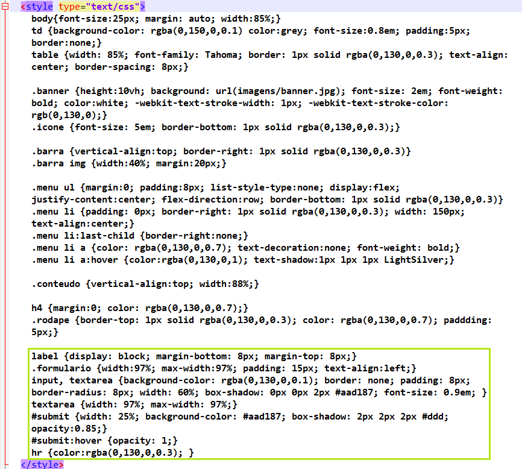
  

  

&#x1f4c3; Detalhes das outras páginas

	
Na pasta chamada <code>webdesign/atividade5</code>, crie as páginas <code>sobrenos.htm</code> e <code>contato.htm</code>. Estas páginas usarão a mesma pasta de imagens criada para a página principal.

	  <ul class="slider">
		  <li>
			   <input type="radio" id="173" name="sl">
			   <label for="173"></label>
			   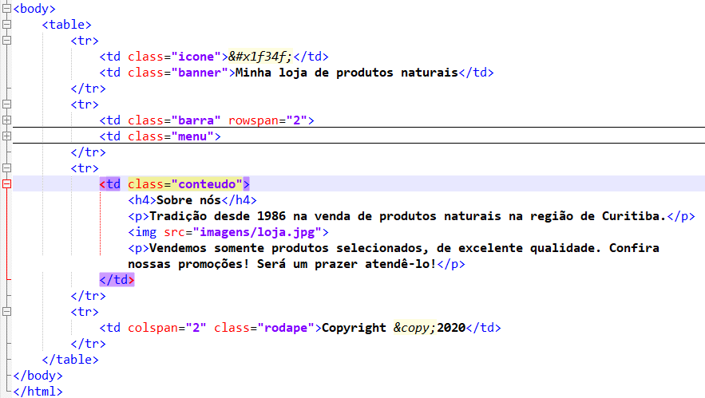
			   <figcaption>A página <code>sobrenos.htm</code> contém informações genéricas da loja virtual. Insira uma imagem e um pouco de texto sobre o atendimento da loja.</figcaption>
		   </li>
		  <li>
			   <input type="radio" id="174" name="sl">
			   <label for="174"></label>
			   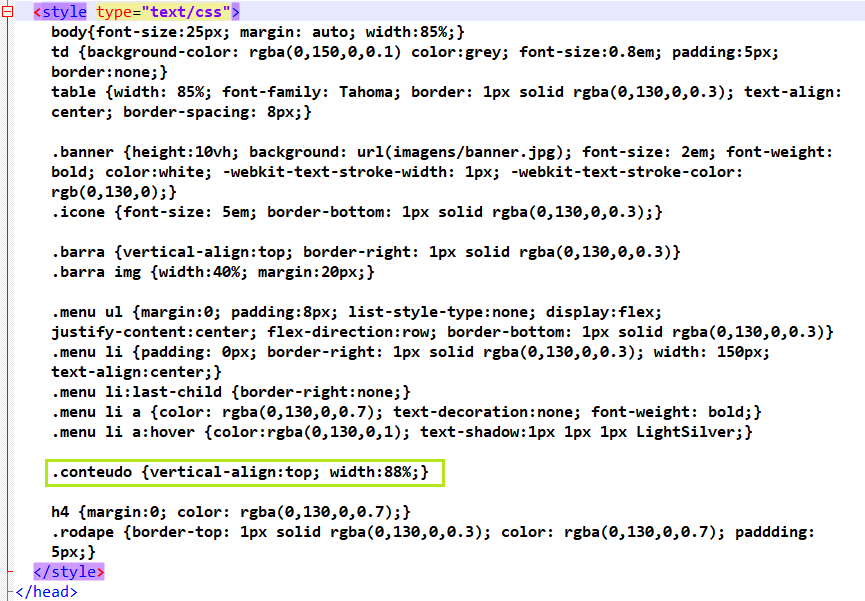
			   <figcaption>Podemos copiar toda a configuração CSS da página <code>index.htm</code>. A tag de conteúdo pode conter apenas atributos de alinhamento vertical e de largura nesta página.</figcaption>
		   </li>
		   <li>
			   <input type="radio" id="175" name="sl">
			   <label for="175"></label>
			   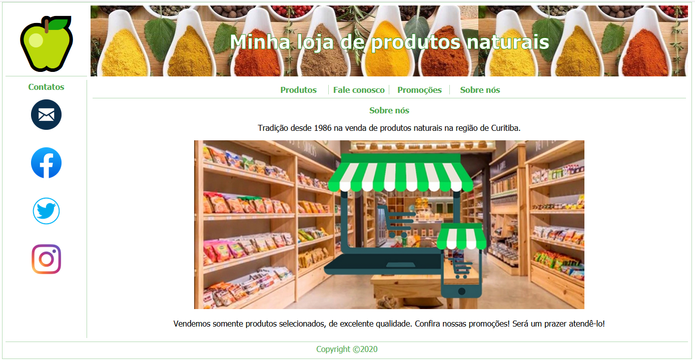
			   <figcaption>O layout da página fica com esta configuração. Note que o ícone, banner, barra lateral, menu e rodapé ficam com mesmo layout da página <code>index.htm</code>.</figcaption>
		   </li>
		   <li>
			   <input type="radio" id="176" name="sl">
			   <label for="176"></label>
			   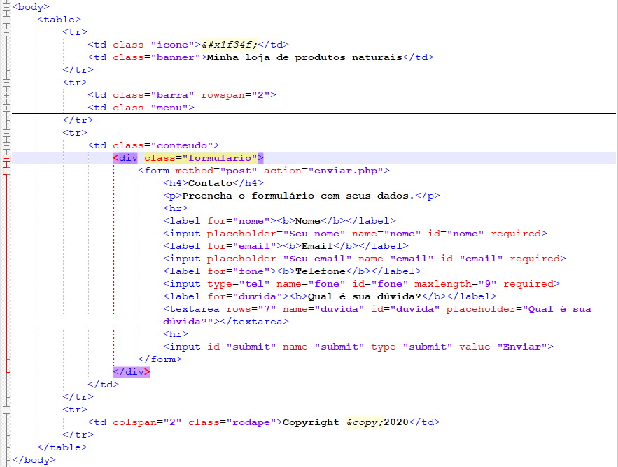
			   <figcaption>Na página de contato, podemos usar a mesma estrutura HTML usada na Atividade 4. Crie o arquivo <code>enviar.php</code> com mesmo código que usamos nos formulários de contato que já criamos.</figcaption>
		   </li>
		   <li>
			   <input type="radio" id="177" name="sl">
			   <label for="177"></label>
			   
			   <figcaption>Configure os atributos dos itens do formulário de acordo com as cores usadas no layout do site. Note que o conteúdo desta página de contato também pode ser configurado de forma simplificada, sem os itens dos produtos.</figcaption>
		   </li>
		   <li>
			   <input type="radio" id="178" name="sl">
			   <label for="178"></label>
			   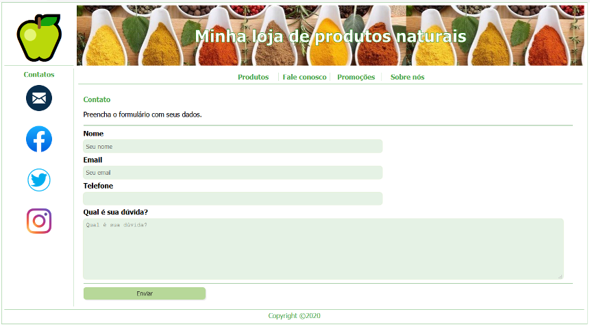
			   <figcaption>Com as propriedades e atributos mostrados, a página de contato fica com esse layout. Crie suas páginas de contato e "Sobre nós". A página de promoções é opcional, que pode mostrar alguns produtos em destaque.</figcaption>
		   </li>
		</ul>
		
  

	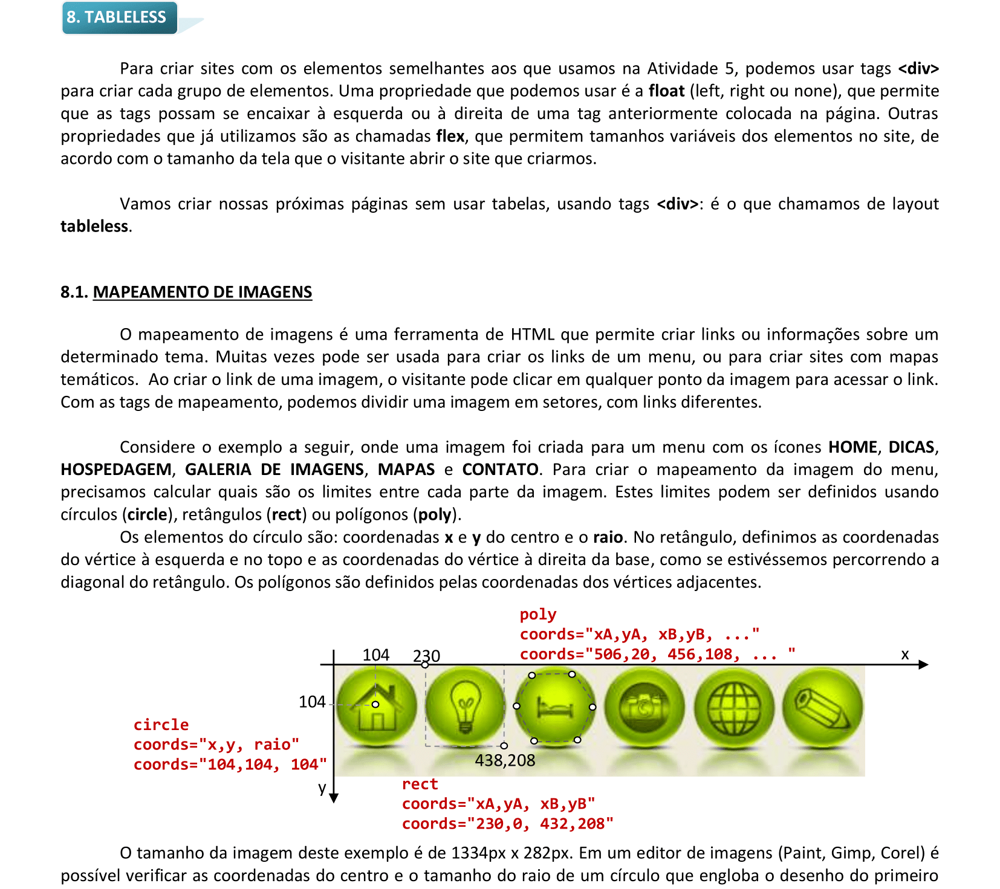
	
<a href="#css2" class="topo">voltar ao topo</a>

	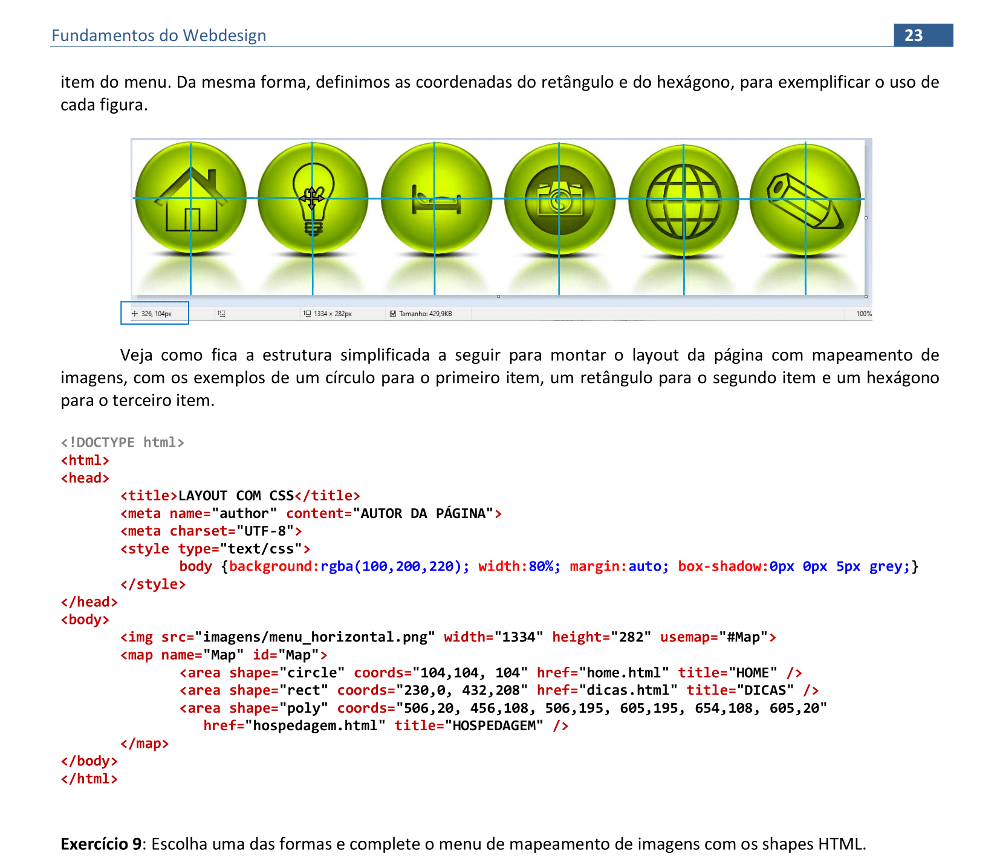
	

&#x1f4c3; Mapeamento de imagens

	
Vamos criar uma pasta chamada <code>webdesign/mapeamento</code>. Nesta pasta, crie um arquivo chamado <code>mapeamento.htm</code>. Escolha um dos arquivos para fazer o mapeamento: <a href="css2/menu_horizontal.png" download>menu verde</a>, <a href="css2/menu_horizontal1.png" download>menu branco</a> ou encontre outra imagem de um menu completo.

	  <ul class="slider">
		  <li>
			   <input type="radio" id="179" name="sl">
			   <label for="179"></label>
			   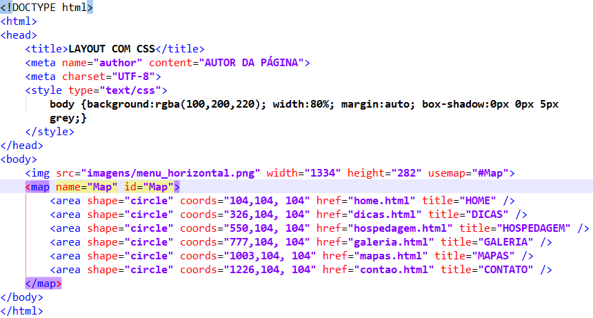
			   <figcaption>Um mapeamento de imagens usa a tag <code>&lt;map&gt;</code>, que contém os shapes com links. A primeira tag desta página é a imagem que será mapeada com a tag <code>&lt;img&gt;</code>.</figcaption>
		   </li>
		  <li>
			   <input type="radio" id="180" name="sl">
			   <label for="180"></label>
			   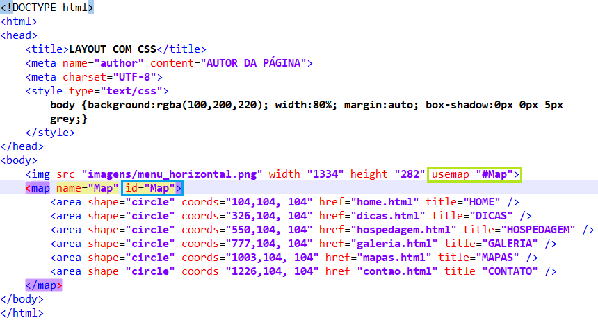
			   <figcaption>Como precisamos referenciar qual será a imagem mapeada, usamos os atributos <code>usemap="#Map"</code> na tag <code>&lt;img&gt;</code> e o identificador <code>id="#Map"</code>. Desta forma, os shapes aparecerão por cima da imagem com identificador <code>#Map</code>.</figcaption>
		   </li>
		   <li>
			   <input type="radio" id="181" name="sl">
			   <label for="181"></label>
			   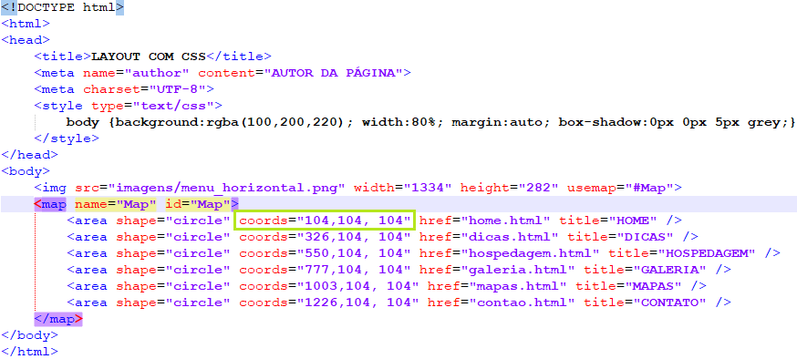
			   <figcaption>Neste exemplo, mostraremos o uso dos círculos para mapear. Eles criam uma área invisível para o visitante, mas que ao passar o cursor do mouse por cima da área na imagem, aparece o link. Os círculos possuem as coordenadas do centro <b>X</b> e <b>Y</b> e a medida do <b>RAIO</b>: <code>coords="X,Y,RAIO"</code>. As coordenadas da imagem de menu que você mapear podem ser obtidas em um editor de imagens.</figcaption>
		   </li>
		   <li>
			   <input type="radio" id="183" name="sl">
			   <label for="183"></label>
			   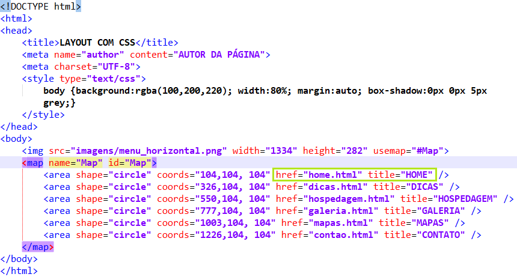
			   <figcaption>Outras informações que precisamos inserir na tag de cada shape é do link e seu título: <code>href</code> e <code>title</code>. Crie o mapeamento, salve a página e teste o layout. Vamos fazer outros mapeamentos a seguir.</figcaption>
		   </li>
		   <li>
			   <input type="radio" id="183a" name="sl">
			   <label for="183a"></label>
			   <figcaption>
<button type="button" onclick="copyEvent('cod80', 'cd80')" onmouseout="outFunc('cd80')">Copiar o código</button>
Estrutura HTML do mapeamento:
<pre><code id="cod80"><a alt="tag com a imagem que será mapeada">&lt;img src="imagens/menu_horizontal.png" width="1334" height="282" usemap="#Map"&gt;</a>
&lt;map name="Map" id="Map"&gt;
	<a alt="primeiro item do menu com círculo">&lt;area shape="circle" coords="104,104, 104" href="home.html" title="HOME" /&gt;</a>
	<a alt="mudança de coordenada x do segundo item do menu">&lt;area shape="circle" coords="326,104, 104" href="dicas.html" title="DICAS" /&gt;</a>
	&lt;area shape="circle" coords="550,104, 104" href="hospedagem.html" title="HOSPEDAGEM" /&gt;
	&lt;area shape="circle" coords="777,104, 104" href="galeria.html" title="GALERIA" /&gt;
	&lt;area shape="circle" coords="1003,104, 104" href="mapas.html" title="MAPAS" /&gt;
	&lt;area shape="circle" coords="1226,104, 104" href="contao.html" title="CONTATO" /&gt;
&lt;/map&gt;</code></pre></figcaption>
		   </li>
		</ul>
		
  

	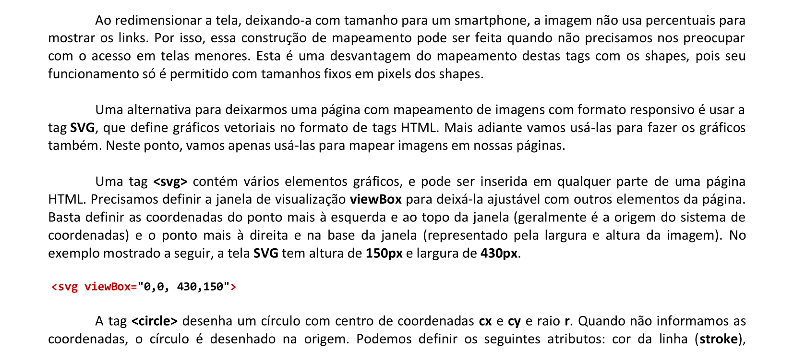
	
<a href="#css2" class="topo">voltar ao topo</a>

	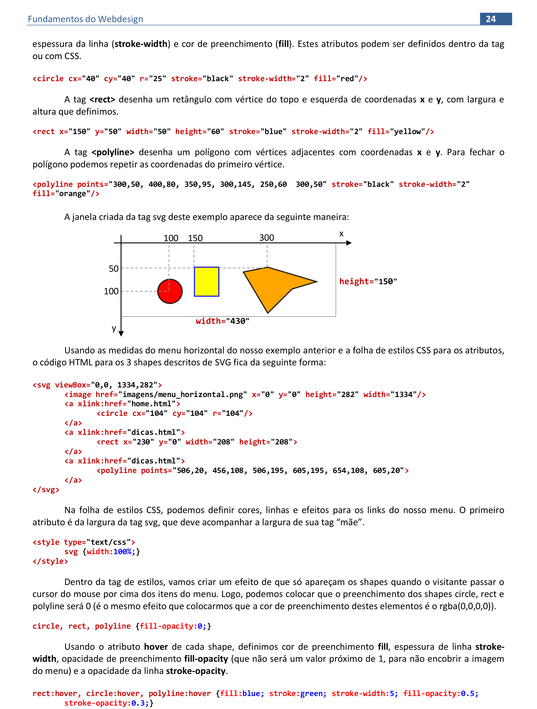
	
<a href="#css2" class="topo">voltar ao topo</a>

	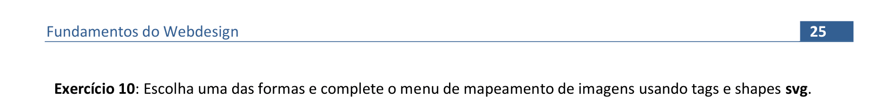
	

&#x1f4c3; Mapeamento de imagens com SVG

	
Vamos usar a pasta <code>webdesign/mapeamento</code> para este exercício. Crie um arquivo chamado <code>mapeamento-svg.htm</code>. Escolha um dos arquivos para fazer o mapeamento: <a href="css2/menu_horizontal.png" download>menu verde</a>, <a href="css2/menu_horizontal1.png" download>menu branco</a> ou encontre outra imagem de um menu completo.

	  <ul class="slider">
		  <li>
			   <input type="radio" id="184" name="sl">
			   <label for="184"></label>
			   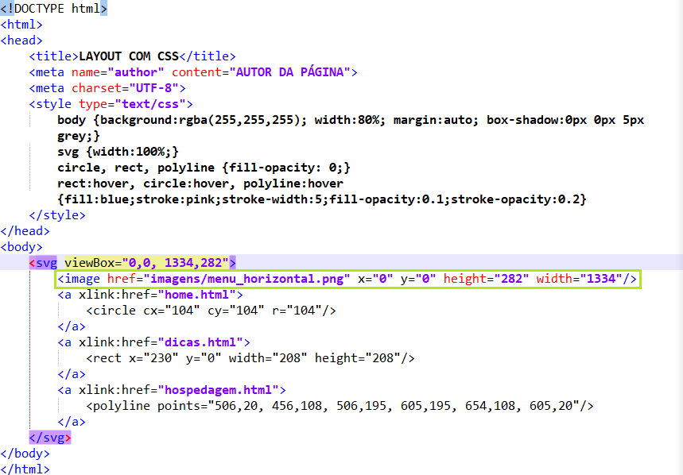
			   <figcaption>Usando SVG, nosso mapeamento ficará responsivo. Com a tag <code>&lt;svg&gt;</code>, crie a janela de visualização <code>viewBox</code> com as mesmas dimensões da imagem que será mapeada.</figcaption>
		   </li>
		   <li>
			   <input type="radio" id="185a" name="sl">
			   <label for="185a"></label>
			   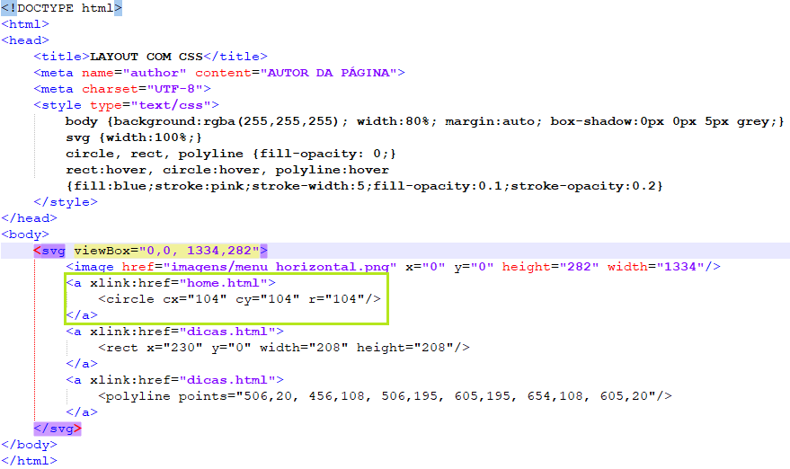
			   <figcaption>A estrutura com SVG é basicamente a mesma que usamos com tags HTML, modificando apenas a forma de escrever os comandos. Dentro de uma tag de link <code>&lt;a&gt;</code>, colocamos os shapes. Neste exemplo, são mostrados o círculo, o retângulo e o polígono com SVG.</figcaption>
		   </li>
		   <li>
			   <input type="radio" id="186" name="sl">
			   <label for="186"></label>
			   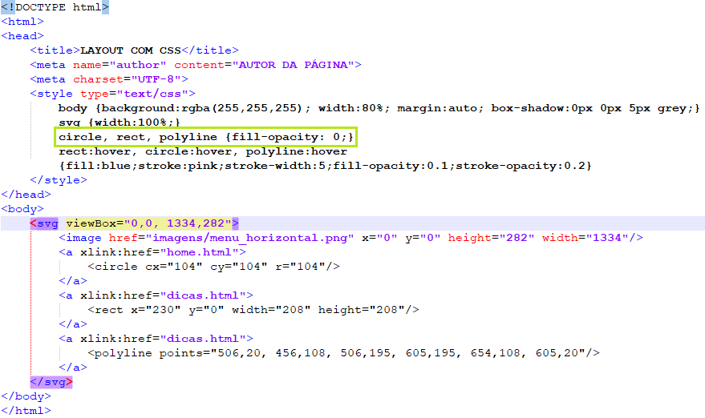
			   <figcaption>Podemos usar atributos de opacidade nos shapes usando <code>fill-opacity:0;</code>.</figcaption>
		   </li>
		   <li>
			   <input type="radio" id="187" name="sl">
			   <label for="187"></label>
			   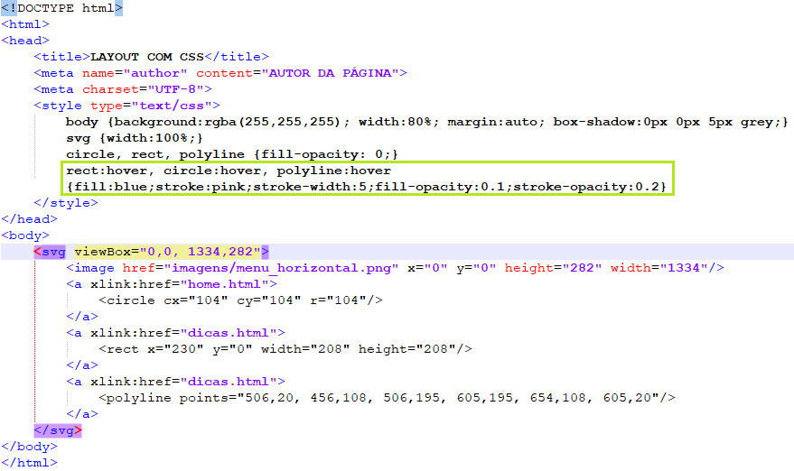
			   <figcaption>Quando o visitante passar o cursor do mouse sobre os mapeamentos, usamos o atributo <code>hover</code> de cada shape para definir linhas e opacidade diferente de 0. Teste o layout e os mapeamentos. Experimente diminuir o tamanho da tela do navegador para testar se o site fica responsivo.</figcaption>
		   </li>
		   <li>
			   <input type="radio" id="187a" name="sl">
			   <label for="187a"></label>
			   <figcaption>
<button type="button" onclick="copyEvent('cod81', 'cd81')" onmouseout="outFunc('cd81')">Copiar o código</button>
Estrutura CSS do mapeamento:
<pre><code id="cod81">&lt;style type="text/css"&gt;
	body {background:rgba(255,255,255); width:80%; margin:auto; box-shadow:0px 0px 5px grey;}
	<a alt="propriedades das tags svg">svg</a> {width:100%;}
	<a alt="propriedades das figuras, que começam invisíveis">circle, rect, polyline</a> {fill-opacity: 0;}
	<a alt="as figuras que mapeiam o menu só aparecem com hover">rect:hover, circle:hover, polyline:hover</a> {fill:blue; stroke:pink; stroke-width:5; 
	fill-opacity:0.1; stroke-opacity:0.2}
&lt;/style&gt;</code></pre>

<button type="button" onclick="copyEvent('cod82', 'cd82')" onmouseout="outFunc('cd82')">Copiar o código</button>
Trecho da estrutura HTML do mapeamento:
<pre><code id="cod82">&lt;svg viewBox="0,0, 1334,282"&gt;
	&lt;image href="imagens/menu_horizontal.png" x="0" y="0" height="282" width="1334"/&gt;
	<a alt="tag svg de link">&lt;a xlink:href="home.html"&gt;</a>
		<a alt="tag svg de círculo">&lt;circle cx="104" cy="104" r="104"/&gt;</a>
	&lt;/a&gt;
	&lt;a xlink:href="dicas.html"&gt;	
		<a alt="tag svg de retângulo">&lt;rect x="230" y="0" width="208" height="208"/&gt;</a>
	&lt;/a&gt;
	&lt;a xlink:href="dicas.html"&gt;	
		<a alt="tag svg de poligonal: hexágono">&lt;polyline points="506,20, 456,108, 506,195, 605,195, 654,108, 605,20"/&gt;</a>
	&lt;/a&gt;
&lt;/svg&gt;</code></pre></figcaption>
		   </li>
		</ul>
		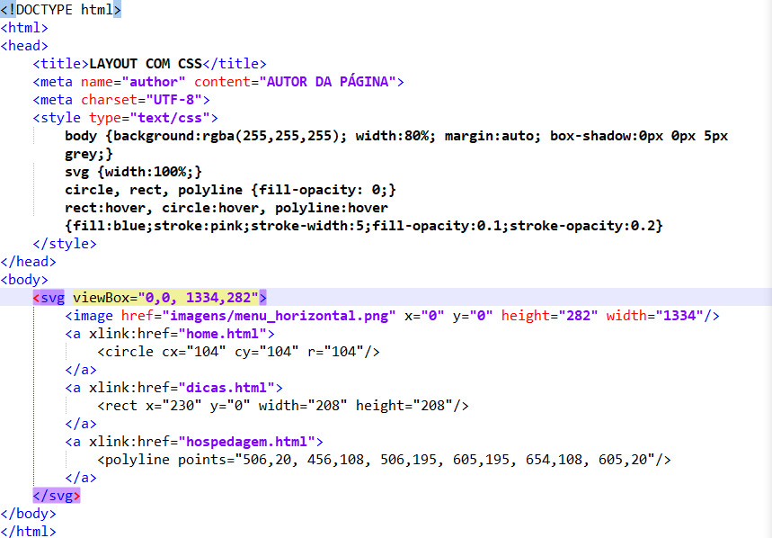
  

	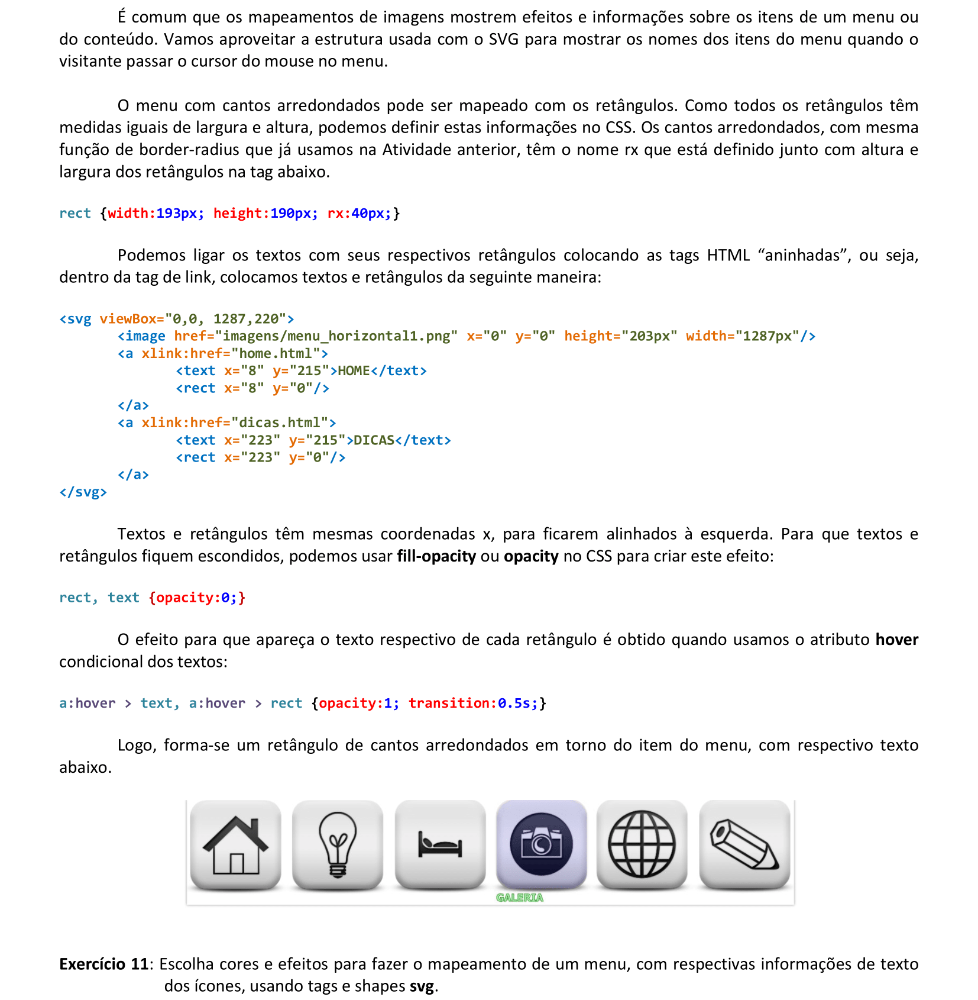
	

&#x1f4c3; Mapeamento com SVG e texto

	
Vamos usar a pasta <code>webdesign/mapeamento</code> para este exercício. Crie um arquivo chamado <code>mapeamento-svg-info.htm</code>, que usaremos para criar o mapeamento do menu com informações de texto. Escolha um dos arquivos para fazer o mapeamento: <a href="css2/menu_horizontal.png" download>menu verde</a>, <a href="css2/menu_horizontal1.png" download>menu branco</a> ou encontre outra imagem de um menu completo.

	  <ul class="slider">
		  <li>
			   <input type="radio" id="188" name="sl">
			   <label for="188"></label>
			   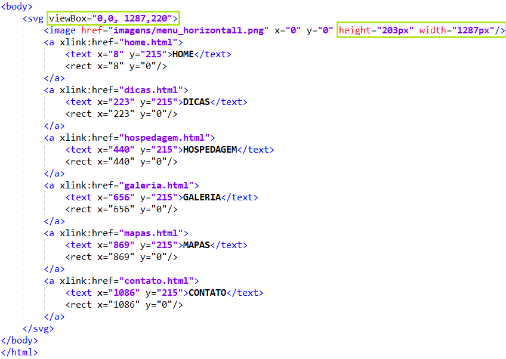
			   <figcaption>Neste exemplo, o menu branco foi usado. Note que a janela <code>viewBox</code> do SVG foi criada com altura um pouco maior, para que as informações de texto apareçam logo abaixo dos ícones do menu.</figcaption>
		   </li>
		   <li>
			   <input type="radio" id="189" name="sl">
			   <label for="189"></label>
			   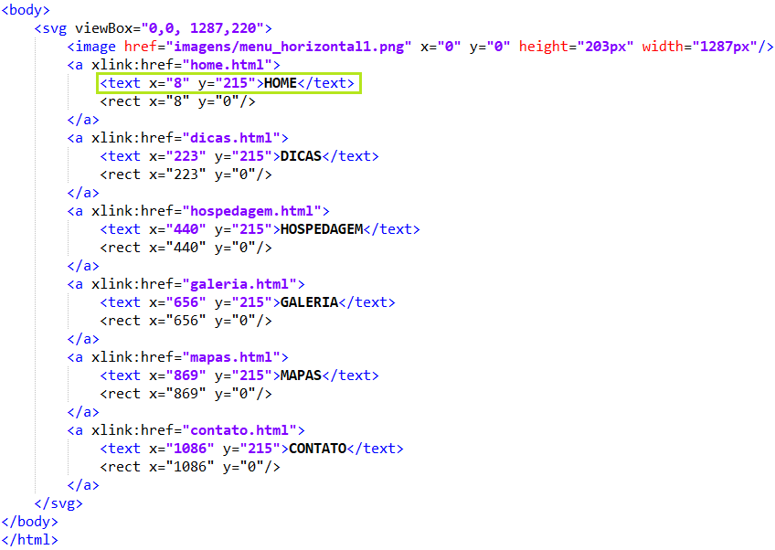
			   <figcaption>Dentro da mesma estrutura criada na página anterior, colocamos a tag <code>&lt;text&gt;</code> com respectivos shapes de retângulos. Para alinhar à esquerda o texto com o ícone, as coordenadas <b>x</b> do texto e dos retângulos são as mesmas. As coordenadas <b>y</b> serão iguais a 215px.</figcaption>
		   </li>
		   <li>
			   <input type="radio" id="190" name="sl">
			   <label for="190"></label>
			   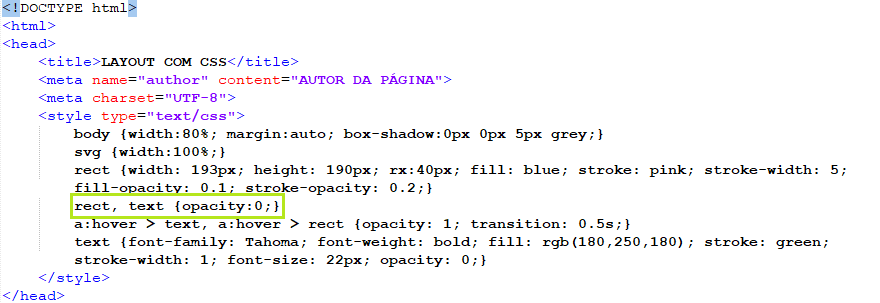
			   <figcaption>Definimos como padrão de visualização de retângulos e textos no CSS as opacidades nulas de tags <code>rect</code> e <code>text</code>.</figcaption>
		   </li>
		   <li>
			   <input type="radio" id="191" name="sl">
			   <label for="191"></label>
			   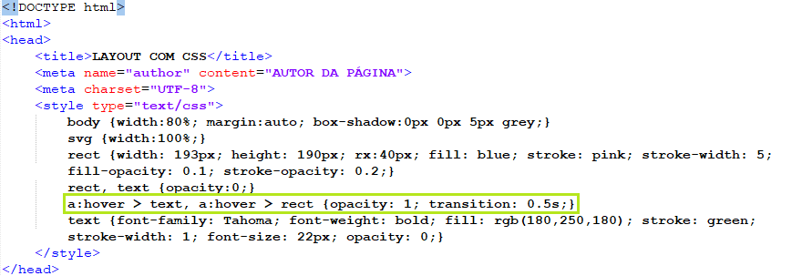
			   <figcaption>Quando o visitante passar o cursor do mouse por cima de uma região com tag mapeada <code>&lt;a&gt;</code>, os respectivos textos e retângulos aparecerão com a definição do atributo de opacidade em <code>a:hover > text</code> e <code>a:hover > rect</code>.</figcaption>
		   </li>
		   <li>
			   <input type="radio" id="192" name="sl">
			   <label for="192"></label>
			   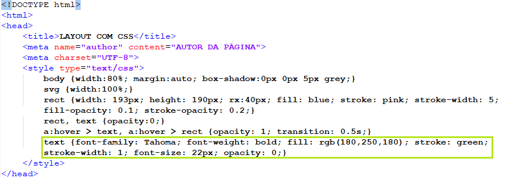
			   <figcaption>Defina os atributos de cores de preenchimento, linhas, tipos de fonte e opacidade nula para os textos. A opacidade só ficará igual a 1 quando o atributo <code>hover</code> ficar ativo. Configure também o atributo <code>transition: 0.5s</code> para fazer uma transição de meio segundo na mudança de opacidade.</figcaption>
		   </li>
		   <li>
			   <input type="radio" id="193" name="sl">
			   <label for="193"></label>
			   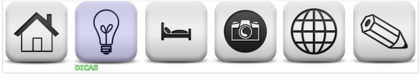
			   <figcaption>O layout do menu fica desta maneira. Configure outros valores e faça teste de layout no menu de sua página para usarmos em outras páginas a seguir.</figcaption>
		   </li>
		   <li>
			   <input type="radio" id="193a" name="sl">
			   <label for="193a"></label>
			   <figcaption>
<button type="button" onclick="copyEvent('cod83', 'cd83')" onmouseout="outFunc('cd83')">Copiar o código</button>
Estrutura CSS do mapeamento:
<pre><code id="cod83">&lt;style type="text/css"&gt;
	body {width:80%; margin:auto; box-shadow:0px 0px 5px grey;}
	svg {width:100%;}
	rect {width:193px; height:190px; rx:40px; fill:blue; stroke:pink; stroke-width:5; 
	fill-opacity: 0.1; stroke-opacity: 0.2;}
	<a alt="retângulos e textos começam invisíveis">rect, text</a> {opacity:0;}
	<a alt="só aparecem quando o visitante passar o cursor do mouse sobre os itens">a:hover > text, a:hover > rect</a> {opacity:1; transition:0.5s;}
	text {font-family:Tahoma; font-weight:bold; fill:rgb(180,250,180); stroke:green; 
	stroke-width:1; font-size:22px; opacity:0;}
&lt;/style&gt;</code></pre>

<button type="button" onclick="copyEvent('cod84', 'cd84')" onmouseout="outFunc('cd84')">Copiar o código</button>
Trecho da estrutura HTML do mapeamento:
<pre><code id="cod84">&lt;svg viewBox="0,0, 1287,220"&gt;
	&lt;image href="imagens/menu_horizontal1.png" x="0" y="0" height="203px" width="1287px"/&gt;
		&lt;a xlink:href="home.html"&gt;
			<a alt="tags de textos, posicionados logo abaixo de cada item do menu">&lt;text x="8" y="215"&gt;HOME&lt;/text&gt;</a>
			&lt;rect x="8" y="0"/&gt;
		&lt;/a&gt;
		&lt;a xlink:href="dicas.html"&gt;	
			&lt;text x="223" y="215"&gt;DICAS&lt;/text&gt;
			&lt;rect x="223" y="0"/&gt;
		&lt;/a&gt;
		&lt;a xlink:href="hospedagem.html"&gt;	
			&lt;text x="440" y="215"&gt;HOSPEDAGEM&lt;/text&gt;
			&lt;rect x="440" y="0"/&gt;
		&lt;/a&gt;
&lt;/svg&gt;</code></pre></figcaption>
		   </li>
		</ul>
		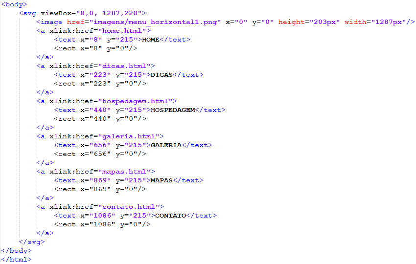
  

	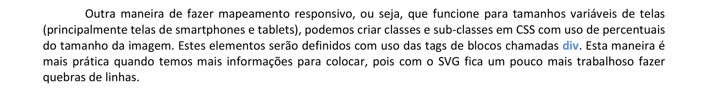
	
<a href="#css2" class="topo">voltar ao topo</a>

	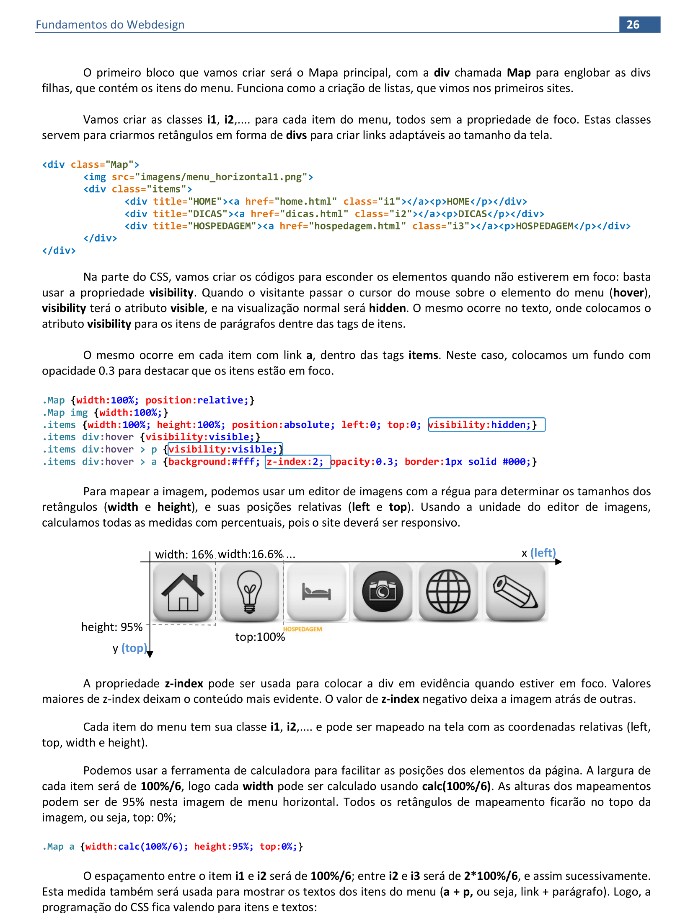
	
<a href="#css2" class="topo">voltar ao topo</a>

	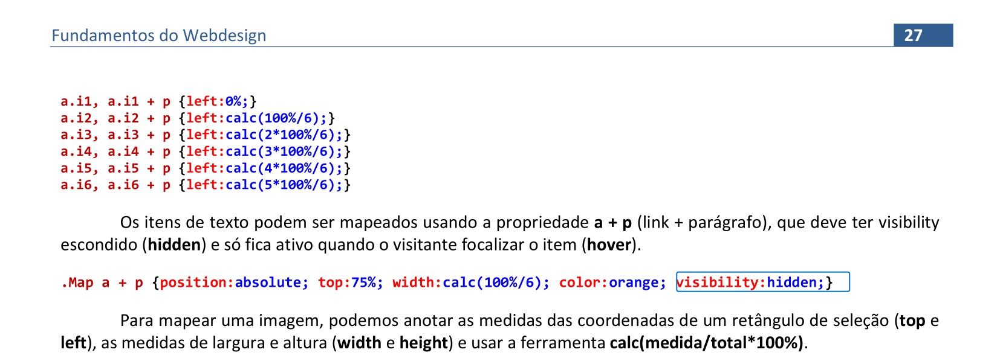
	

&#x1f4c3; Mapeamento com div e texto

	
Vamos usar a pasta <code>webdesign/mapeamento</code> para este exercício. Crie um arquivo chamado <code>mapeamento-div-info.htm</code>, que usaremos para criar o mapeamento do menu com tags <code>div</code> e informações de texto. Escolha um dos arquivos para fazer o mapeamento: <a href="css2/menu_horizontal.png" download>menu verde</a>, <a href="css2/menu_horizontal1.png" download>menu branco</a> ou encontre outra imagem de um menu completo.

	  <ul class="slider">
		  <li>
			   <input type="radio" id="194" name="sl">
			   <label for="194"></label>
			   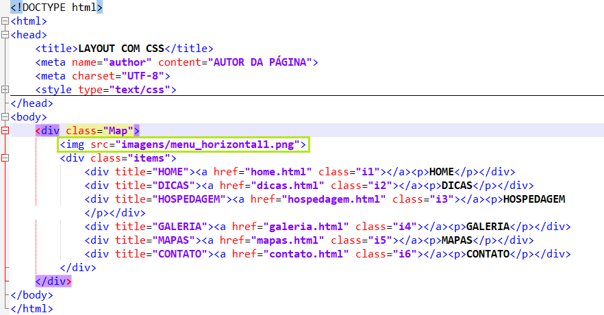
			   <figcaption>Neste exemplo, foi usado o menu branco. Criamos uma div "mãe" <code>class="Map"</code> que contém a imagem <code>&lt;img&gt;</code> e as <code>div</code> dos itens do menu.</figcaption>
		   </li>
		   <li>
			   <input type="radio" id="195" name="sl">
			   <label for="195"></label>
			   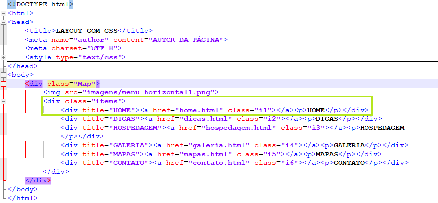
			   <figcaption>A <b>div</b> <code>class="items"</code> agrupa cada item do menu. Definimos uma <b>div</b> de item, com o texto <code>&lt;p&gt;</code> e o link <code>&lt;a&gt;</code> para cada parte do menu.</figcaption>
		   </li>
		   <li>
			   <input type="radio" id="196" name="sl">
			   <label for="196"></label>
			   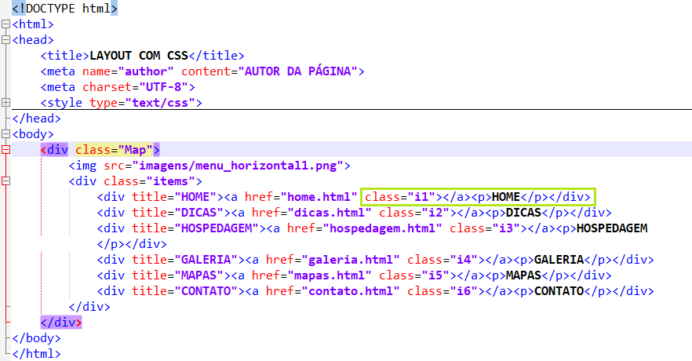
			   <figcaption>Cada item tem uma posição específica no mapeamento. Logo, criamos as classes <code>class="i1"</code>, <code>class="i2"</code>, ..., <code>class="i6"</code> dos itens do menu.</figcaption>
		   </li>
		   <li>
			   <input type="radio" id="197" name="sl">
			   <label for="197"></label>
			   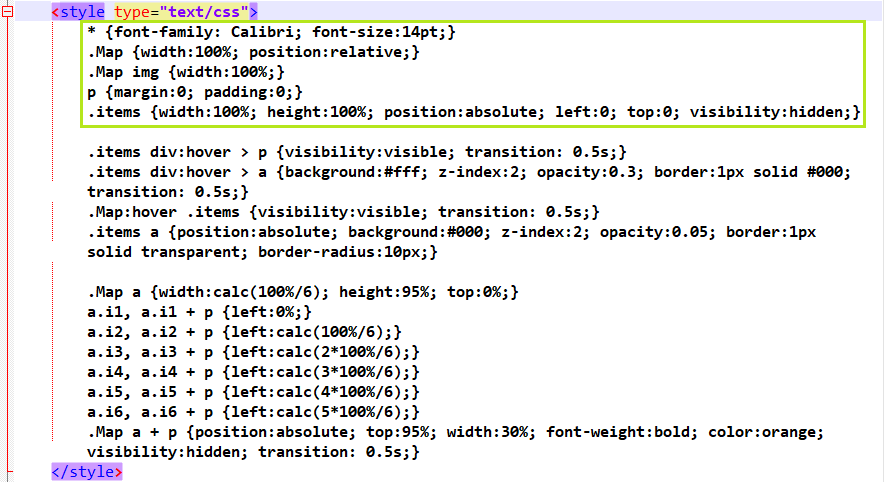
			   <figcaption>Na programação CSS, definimos os atributos mais gerais, com a classe <code>.Map</code> com imagens de largura 100%, parágrafos sem margens e os itens escondidos, com o atributo <code>visibility:hidden;</code>.</figcaption>
		   </li>
		   <li>
			   <input type="radio" id="198" name="sl">
			   <label for="198"></label>
			   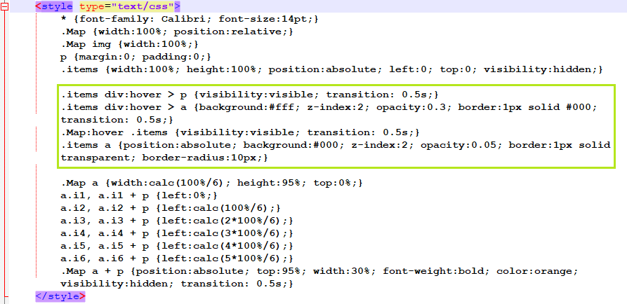
			   <figcaption>Ao ativar os itens com o cursor do mouse sobre cada um deles <code>items div:hover</code>, definimos que os itens serão visíveis, com bordas e opacidade de um fundo sobre cada parte do item, e o texto visível com atributo <code>visibility:visible;</code></figcaption>
		   </li>
		   <li>
			   <input type="radio" id="199" name="sl">
			   <label for="199"></label>
			   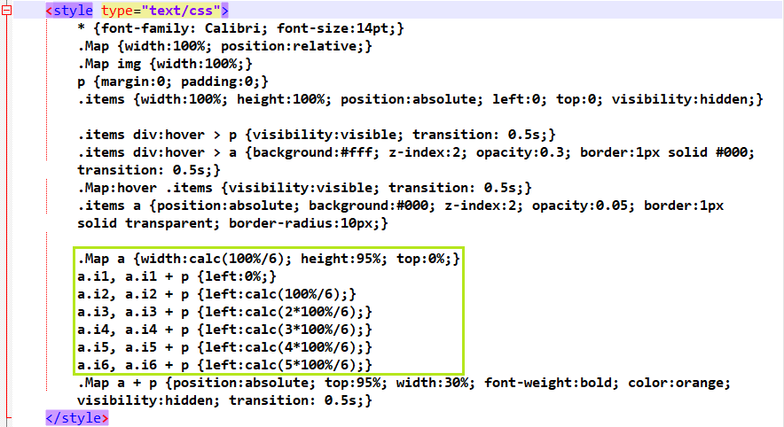
			   <figcaption>A altura da posição do texto foi fixada em 95%, e os itens foram posicionados levando-se em conta que todos têm mesmo tamanho <code>width:calc(100%/6);</code>. Logo, o primeiro item fica em <code>left:0%;</code>, o segundo em <code>left:calc(100%/6);</code> e assim sucessivamente, até <code>left:calc(5*100%/6);</code></figcaption>
		   </li>
		   <li>
			   <input type="radio" id="200" name="sl">
			   <label for="200"></label>
			   
			   <figcaption>Para finalizar, os textos aparecem na posição <code>top:95%;</code>, e devemos deixá-los escondidos com <code>visibility:hidden;</code>. Colocando-se o <code>transition:05s;</code>, ocorre uma suavidade na mudança do estágio invisível para visível.</figcaption>
		   </li>
		   <li>
			   <input type="radio" id="200a" name="sl">
			   <label for="200a"></label>
			   <figcaption>
<button type="button" onclick="copyEvent('cod85', 'cd85')" onmouseout="outFunc('cd85')">Copiar o código</button>
Estrutura HTML do mapeamento:
<pre><code id="cod85">&lt;div class="Map"&gt;
	<a alt="tag da imagem que será mapeada">&lt;img src="imagens/menu_horizontal1.png"&gt;</a>
	&lt;div class="items"&gt;
		<a alt="cada item terá uma classe CSS: i1, i2, ..., i6.">&lt;div title="HOME"&gt;&lt;a href="home.html" class="i1"&gt;&lt;/a&gt;&lt;p&gt;HOME&lt;/p&gt;&lt;/div&gt;</a>
		&lt;div title="DICAS"&gt;&lt;a href="dicas.html" class="i2"&gt;&lt;/a&gt;&lt;p&gt;DICAS&lt;/p&gt;&lt;/div&gt;
		&lt;div title="HOSPEDAGEM"&gt;&lt;a href="hospedagem.html" class="i3"&gt;&lt;/a&gt;&lt;p&gt;HOSPEDAGEM&lt;/p&gt;&lt;/div&gt;
		&lt;div title="GALERIA"&gt;&lt;a href="galeria.html" class="i4"&gt;&lt;/a&gt;&lt;p&gt;GALERIA&lt;/p&gt;&lt;/div&gt;
		&lt;div title="MAPAS"&gt;&lt;a href="mapas.html" class="i5"&gt;&lt;/a&gt;&lt;p&gt;MAPAS&lt;/p&gt;&lt;/div&gt;
		&lt;div title="CONTATO"&gt;&lt;a href="contato.html" class="i6"&gt;&lt;/a&gt;&lt;p&gt;CONTATO&lt;/p&gt;&lt;/div&gt;
	&lt;/div&gt;
&lt;/div&gt;</code></pre></figcaption>
		   </li>
		   <li>
			   <input type="radio" id="200b" name="sl">
			   <label for="200b"></label>
			   <figcaption>
<button type="button" onclick="copyEvent('cod86', 'cd86')" onmouseout="outFunc('cd86')">Copiar o código</button>
Estrutura CSS do mapeamento:
<pre><code id="cod86">&lt;style type="text/css"&gt;
	* {font-family:Calibri; font-size:14pt;}
	.Map {width:100%; position:relative;}
	.Map img {width:100%;}
	p {margin:0; padding:0;}
	<a alt="tag dos itens, que começam invisíveis">.items</a> {width:100%; height:100%; position:absolute; left:0; top:0; visibility:hidden;}

	<a alt="cada item aparece quando o usuário acionar hover.">.items div:hover > p</a> {visibility:visible; transition:0.5s;}
	<a alt="z-index é importante para deixar os itens em primeiro plano">.items div:hover > a</a> {background:#fff; z-index:2; opacity:0.3; border:1px solid #000; 
	transition: 0.5s;}
	<a alt="os itens mapeados aparecem quando o usuário acionar hover">.Map:hover .items</a> {visibility:visible; transition: 0.5s;}
	<a alt="propriedades dos nomes dos itens.">.items a</a> {position:absolute; background:#000; z-index:2; opacity:0.05; 
	border:1px solid transparent; border-radius:10px;}

	<a alt="largura e altura de cada mapeamento em percentual para 6 itens">.Map a</a> {width:calc(100%/6); height:95%; top:0%;}
	<a alt="primeiro item fica à esquerda, com distância 0.">a.i1, a.i1 + p</a> {left:0%;}
	<a alt="o segundo item fica proporcionalmente posicionado com razão 1/6.">a.i2, a.i2 + p</a> {left:calc(100%/6);}
	<a alt="o próximo item fica na razão 2/6, e assim sucessivamente.">a.i3, a.i3 + p</a> {left:calc(2*100%/6);}
	a.i4, a.i4 + p {left:calc(3*100%/6);}
	a.i5, a.i5 + p {left:calc(4*100%/6);}
	a.i6, a.i6 + p {left:calc(5*100%/6);}
	<a alt="Configurações do texto e da largura de cada item.">.Map a + p</a> {position:absolute; top:95%; width:30%; font-weight:bold; color:orange; 
	visibility:hidden; transition:0.5s;}
&lt;/style&gt;</code></pre></figcaption>
		   </li>
		</ul>
		
  

	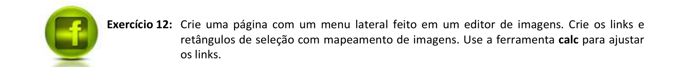
	

&#x1f4c3; Mapeamento lateral com div e texto

	
Vamos usar a pasta <code>webdesign/mapeamento</code> para este exercício. Crie um arquivo chamado <code>mapeamento-lateral-div-info.htm</code>, que usaremos para criar o mapeamento do menu lateral com tags <code>div</code> e informações de texto. Escolha um dos arquivos para fazer o mapeamento: <a href="css2/menu_lateral.png" download>menu verde</a>, <a href="css2/menu_lateral1.png" download>menu branco</a> ou encontre outra imagem de um menu completo.

	  <ul class="slider">
		  <li>
			   <input type="radio" id="201" name="sl">
			   <label for="201"></label>
			   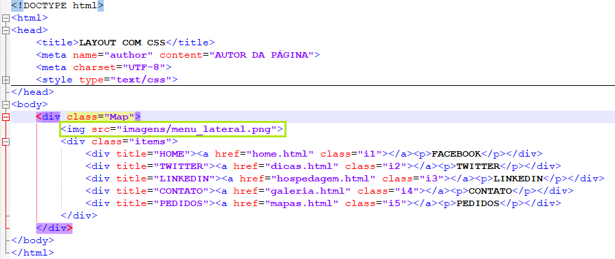
			   <figcaption>Neste exemplo, foi usado o menu verde. Criamos uma div "mãe" <code>class="Map"</code> que contém a imagem <code>&lt;img&gt;</code> e as <code>div</code> dos itens do menu.</figcaption>
		   </li>
		   <li>
			   <input type="radio" id="202" name="sl">
			   <label for="202"></label>
			   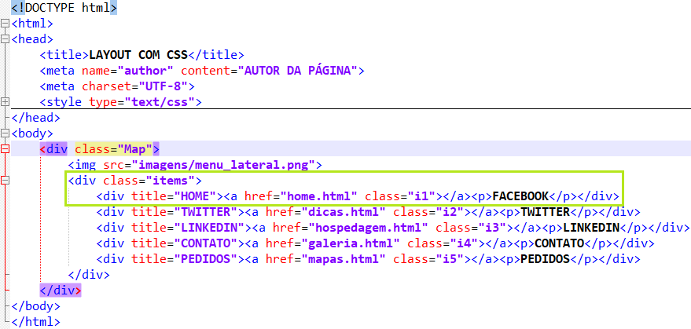
			   <figcaption>A <b>div</b> <code>class="items"</code> agrupa cada item do menu. Definimos uma <b>div</b> de item, com o texto <code>&lt;p&gt;</code> e o link <code>&lt;a&gt;</code> para cada parte do menu.</figcaption>
		   </li>
		   <li>
			   <input type="radio" id="203" name="sl">
			   <label for="203"></label>
			   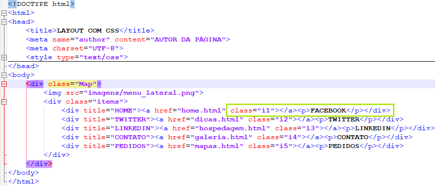
			   <figcaption>Cada item tem uma posição específica no mapeamento. Logo, criamos as classes <code>class="i1"</code>, <code>class="i2"</code>, ..., <code>class="i5"</code> dos itens do menu.</figcaption>
		   </li>
		   <li>
			   <input type="radio" id="204" name="sl">
			   <label for="204"></label>
			   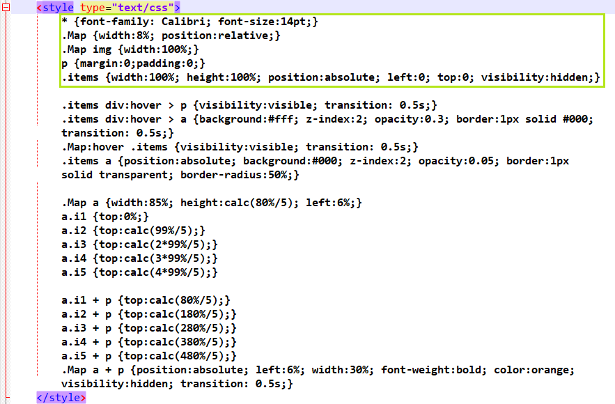
			   <figcaption>Na programação CSS, definimos os atributos mais gerais, com a classe <code>.Map</code> com imagens de largura 100%, parágrafos sem margens e os itens escondidos, com o atributo <code>visibility:hidden;</code>.</figcaption>
		   </li>
		   <li>
			   <input type="radio" id="205" name="sl">
			   <label for="205"></label>
			   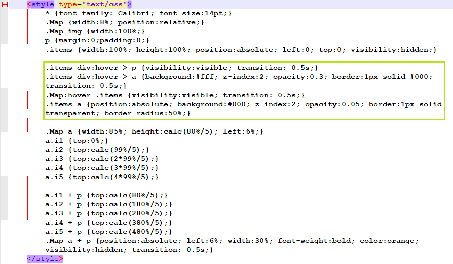
			   <figcaption>Ao ativar os itens com o cursor do mouse sobre cada um deles <code>items div:hover</code>, definimos que os itens serão visíveis, com bordas e opacidade de um fundo sobre cada parte do item, e o texto visível com atributo <code>visibility:visible;</code></figcaption>
		   </li>
		   <li>
			   <input type="radio" id="206" name="sl">
			   <label for="206"></label>
			   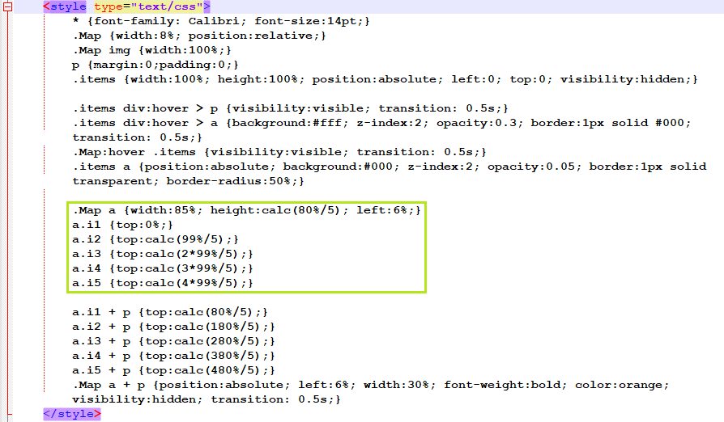
			   <figcaption>No menu lateral a posição do texto à esquerda foi fixada em 6%, e os itens foram posicionados levando-se em conta que todos têm mesmo tamanho <code>height:calc(80%/5);</code>. O primeiro item fica posicionado em <code>top:0%;</code>, o segundo em <code>top:calc(99%/5);</code> e assim sucessivamente, até <code>left:calc(4*99%/6);</code>. Como existem espaçamentos entre os itens, não usamos 100% nos cálculos.</figcaption>
		   </li>
		   <li>
			   <input type="radio" id="207" name="sl">
			   <label for="207"></label>
			   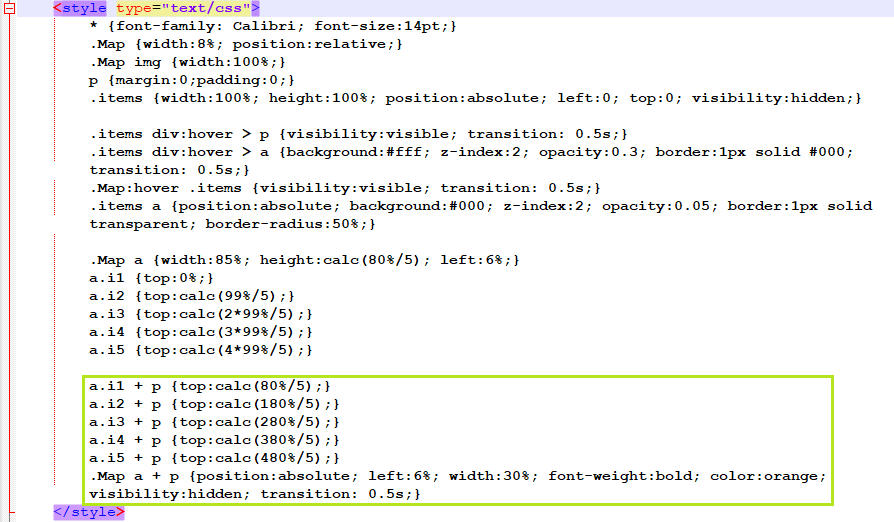
			   <figcaption>Para finalizar, os textos aparecem na posição <code>left:6%;</code>, e devemos deixá-los escondidos com <code>visibility:hidden;</code>. A posição do primeiro item deste menu fica em <code>top:calc(80%/5);</code>, o segundo em <code>top:calc(180%/5);</code> e assim sucessivamente. Estas medidas seriam relativas a 100% do primeiro item se não existissem espaçamentos entre os itens do menu.</figcaption>
		   </li>
		   <li>
			   <input type="radio" id="207a" name="sl">
			   <label for="207a"></label>
			   <figcaption>
<button type="button" onclick="copyEvent('cod87', 'cd87')" onmouseout="outFunc('cd87')">Copiar o código</button>
Estrutura HTML do mapeamento:
<pre><code id="cod87">&lt;div class="Map"&gt;
	<a alt="mapeamento de um menu vertical com 5 itens.">&lt;img src="imagens/menu_lateral.png"&gt;</a>
	<a alt="A estrutura HTML fica parecida com os menus horizontais que já vimos.">&lt;div class="items"&gt;</a>
		&lt;div title="HOME"&gt;&lt;a href="home.html" class="i1"&gt;&lt;/a&gt;&lt;p&gt;FACEBOOK&lt;/p&gt;&lt;/div&gt;
		&lt;div title="TWITTER"&gt;&lt;a href="dicas.html" class="i2"&gt;&lt;/a&gt;&lt;p&gt;TWITTER&lt;/p&gt;&lt;/div&gt;
		&lt;div title="LINKEDIN"&gt;&lt;a href="hospedagem.html" class="i3"&gt;&lt;/a&gt;&lt;p&gt;LINKEDIN&lt;/p&gt;&lt;/div&gt;
		&lt;div title="CONTATO"&gt;&lt;a href="galeria.html" class="i4"&gt;&lt;/a&gt;&lt;p&gt;CONTATO&lt;/p&gt;&lt;/div&gt;
		&lt;div title="PEDIDOS"&gt;&lt;a href="mapas.html" class="i5"&gt;&lt;/a&gt;&lt;p&gt;PEDIDOS&lt;/p&gt;&lt;/div&gt;
	&lt;/div&gt;
&lt;/div&gt;&lt;</code></pre></figcaption>
		   </li>
		   <li>
			   <input type="radio" id="207b" name="sl">
			   <label for="207b"></label>
			   <figcaption>
<button type="button" onclick="copyEvent('cod88', 'cd88')" onmouseout="outFunc('cd88')">Copiar o código</button>
Estrutura CSS do mapeamento:
<pre><code id="cod88">&lt;style type="text/css"&gt;
	* {font-family:Calibri; font-size:14pt;}
	<a alt="largura do mapeamento de acordo com a imagem mapeada">.Map</a> {width:8%; position:relative;}
	.Map img {width:100%;}
	p {margin:0; padding:0;}
	.items {width:100%; height:100%; position:absolute; left:0; top:0; visibility:hidden;}

	.items div:hover > p {visibility:visible; transition:0.5s;}
	.items div:hover > a {background:#fff; z-index:2; opacity:0.3; border:1px solid #000; 
	transition:0.5s;}
	.Map:hover .items {visibility:visible; transition: 0.5s;}
	.items a {position:absolute; background:#000; z-index:2; opacity:0.05; 
	border:1px solid transparent; border-radius:50%;}

	<a alt="as alturas dos itens devem prever os espaçamentos para textos.">.Map a</a> {width:85%; height:calc(80%/5); left:6%;}
	<a alt="primeiro item fica no topo, com distância 0.">a.i1</a> {top:0%;}
	<a alt="O segundo item fica posicionado proporcionalmente com a razão 1/5 na vertical.">a.i2</a> {top:calc(99%/5);}
	<a alt="O terceiro item fica com a razão 2/5 e assim sucessivamente.">a.i3</a> {top:calc(2*99%/5);}
	a.i4 {top:calc(3*99%/5);}
	a.i5 {top:calc(4*99%/5);}

	<a alt="as posições dos textos prevêem os espaços entre as imagens de cada item.">a.i1 + p</a> {top:calc(80%/5);}
	a.i2 + p {top:calc(180%/5);}
	a.i3 + p {top:calc(280%/5);}
	a.i4 + p {top:calc(380%/5);}
	a.i5 + p {top:calc(480%/5);}
	<a alt="largura e posicionamento de cada item.">.Map a + p</a> {position:absolute; left:6%; width:30%; font-weight:bold; color:orange; 
	visibility:hidden; transition: 0.5s;}
&lt;/style&gt;</code></pre></figcaption>
		   </li>
		</ul>
		
  

	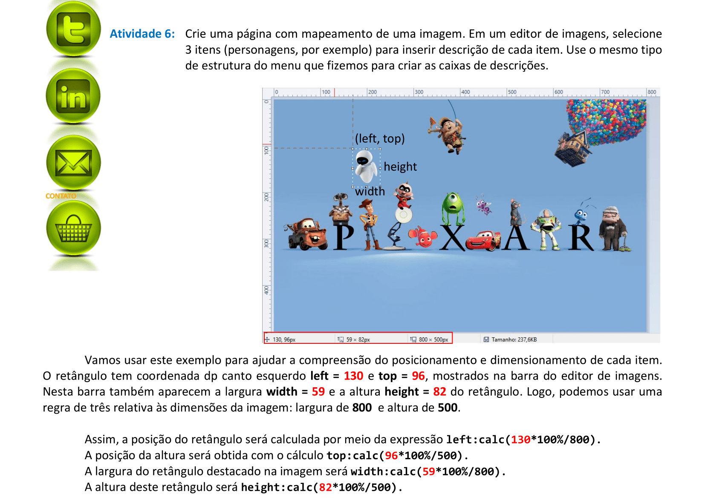
	

&#x1f4c3; Detalhes da Atividade

	
Crie a pasta <code>webdesign/atividade6</code> com o arquivo <code>index.htm</code>. Nesta atividade, podemos usar as estruturas dos exemplos anteriores para fazer o mapeamento de 3 personagens em uma imagem. Crie a pasta das imagens <code>webdesign/atividade6/imagens</code>.

	  <ul class="slider">
		  <li>
			   <input type="radio" id="208" name="sl">
			   <label for="208"></label>
			   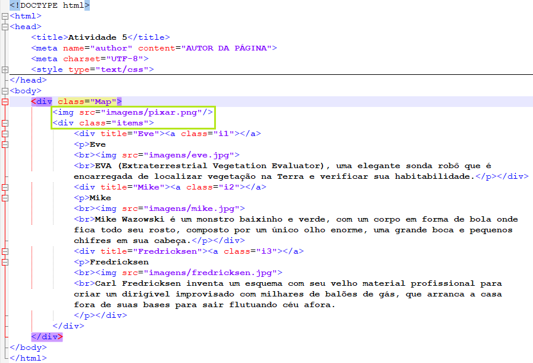
			   <figcaption>Podemos criar a div "mãe" <code>class="Map"</code> que contém a imagem <code>&lt;img&gt;</code> dos personagens e as <code>div</code> de cada personagem que será mapeado. A div <code>class="items"</code> agrupa as div dos personagens.</figcaption>
		   </li>
		   <li>
			   <input type="radio" id="209" name="sl">
			   <label for="209"></label>
			   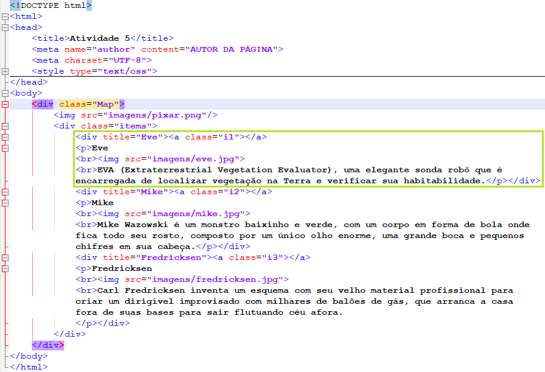
			   <figcaption>Usando a programação CSS dos exemplos anteriores, podemos abrir a tag de parágrafo <code>&lt;p&gt;</code> que abriga o nome, uma imagem e uma breve descrição do personagem. A classe desta div será <code>class="i1"</code>.</figcaption>
		   </li>
		   <li>
			   <input type="radio" id="210" name="sl">
			   <label for="210"></label>
			   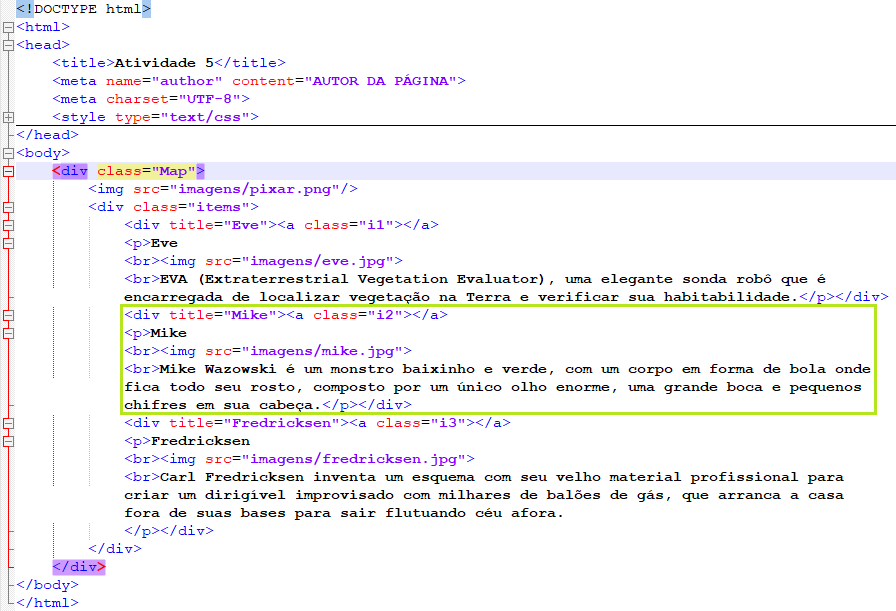
			   <figcaption>Os outros personagens têm a estrutura HTML igual: nome, imagem e descrição.</figcaption>
		   </li>
		   <li>
			   <input type="radio" id="211" name="sl">
			   <label for="211"></label>
			   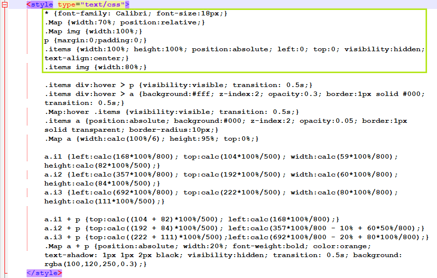
			   <figcaption>Na programação CSS, definimos os atributos mais gerais, com a classe <code>.Map</code> com imagens de largura 70%, parágrafos sem margens e os itens escondidos, com o atributo <code>visibility:hidden;</code>.</figcaption>
		   </li>
		   <li>
			   <input type="radio" id="212" name="sl">
			   <label for="212"></label>
			   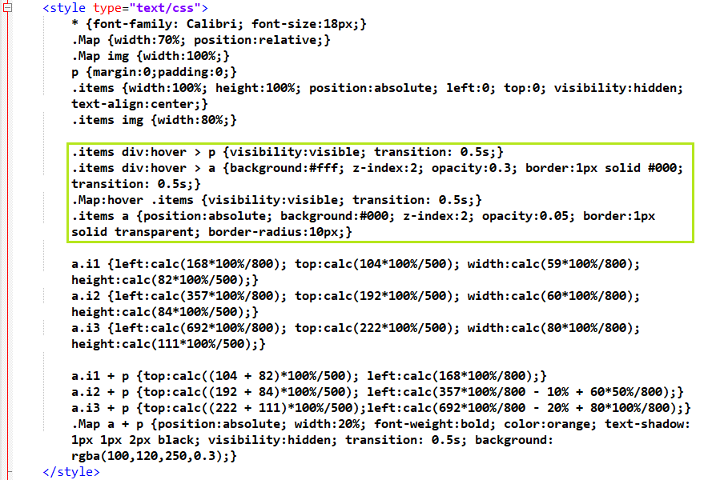
			   <figcaption>Ao ativar os itens com o cursor do mouse sobre cada um deles <code>items div:hover</code>, definimos que os itens serão visíveis, com bordas e opacidade de um fundo sobre cada parte do item, e o texto visível com atributo <code>visibility:visible;</code></figcaption>
		   </li>
		   <li>
			   <input type="radio" id="213" name="sl">
			   <label for="213"></label>
			   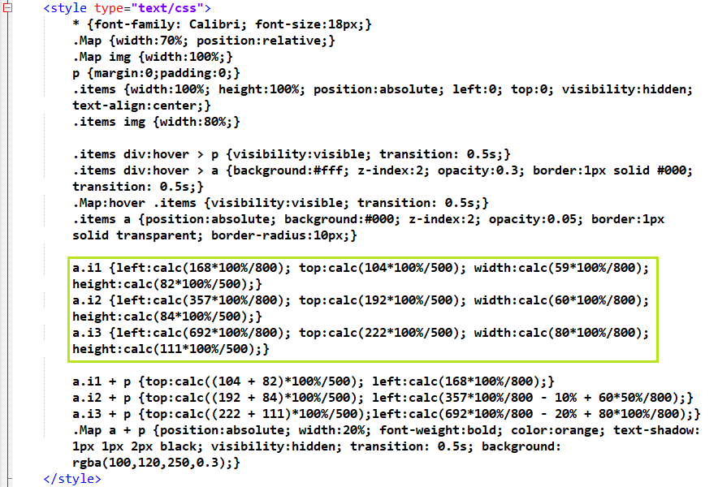
			   <figcaption>Em um editor de imagens, pegue as coordenadas <b>top</b>, <b>left</b>, <b>width</b> e <b>height</b> do mapeamento de cada personagem. Com estas coordenadas, calculamos as posições dos retângulos com as regras de três mostradas, relativas à largura e à altura da imagem de todos os personagens.</figcaption>
		   </li>
		   <li>
			   <input type="radio" id="213a" name="sl">
			   <label for="213a"></label>
			   
			   <figcaption>Neste exemplo, as medidas para o mapeamento do primeiro personagem são: <b>top=104</b>, <b>left=168</b>, <b>width=59</b>, <b>height=82</b>, e as dimensões da imagem dos personagens é <b>width=800</b> e <b>height=500</b>.</figcaption>
		   </li>
		   <li>
			   <input type="radio" id="214" name="sl">
			   <label for="214"></label>
			   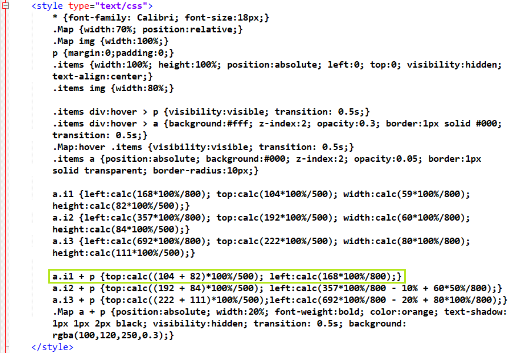
			   <figcaption>Se você quiser deixar o texto alinhado à esquerda, basta usar a mesma medida à esquerda do retângulo <code>left:calc(168*100%/800);</code>. O atributo <b>top</b> do texto é definido pelo atributo <b>top</b> do retângulo (104) somado com a altura do retângulo (82). Logo, o cálculo fica: <code>top:calc((104 + 82)*100%/500);</code>.</figcaption>
		   </li>
		   <li>
			   <input type="radio" id="215" name="sl">
			   <label for="215"></label>
			   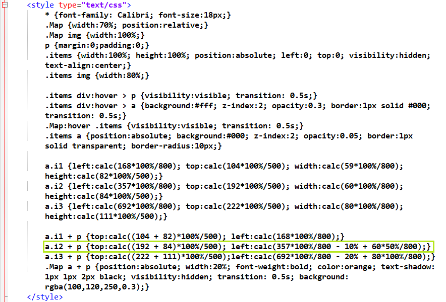
			   <figcaption>A posição vertical <b>top</b> pode ser calculada da mesma forma para todos os mapeamentos. Neste exemplo, estamos usando a largura dos textos como 20%. Logo, se você quiser deixar o texto centralizado, basta subtrair a metade da largura (10%) e somar com a metade do tamanho do retângulo (no caso do segundo personagem mede 60) proporcional a 50% do retângulo.</figcaption>
		   </li>
		   <li>
			   <input type="radio" id="215a" name="sl">
			   <label for="215a"></label>
			   
			   <figcaption>Portanto, para ficar centralizado com o retângulo, o texto do segundo personagem usamos <code>left:calc(357*100%/800 - 10% + 60*50%/800);</code>.</figcaption>
		   </li>
		   <li>
			   <input type="radio" id="216" name="sl">
			   <label for="216"></label>
			   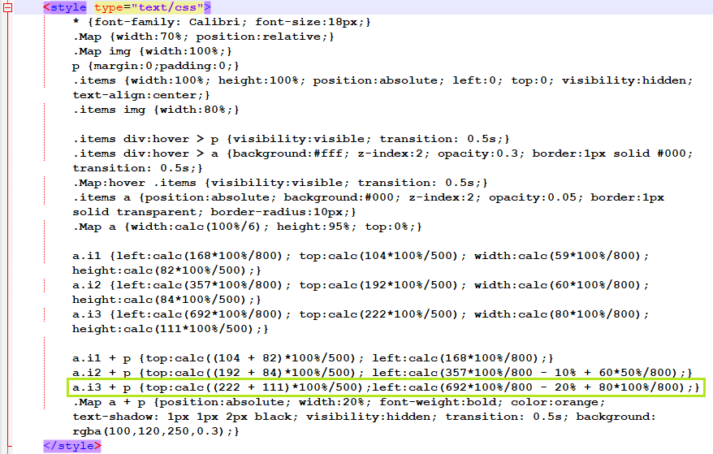
			   <figcaption>Como exemplo, se você quiser alinhar o texto à direita, basta subtrair a largura do texto de 20% e somar com o tamanho proporcional da largura do retângulo. Logo, o alinhamento à direita do terceiro personagem fica: <code>left:calc(692*100%/800 - 20% + 80*100%/800);</code>.</figcaption>
		   </li>
		   <li>
			   <input type="radio" id="217" name="sl">
			   <label for="217"></label>
			   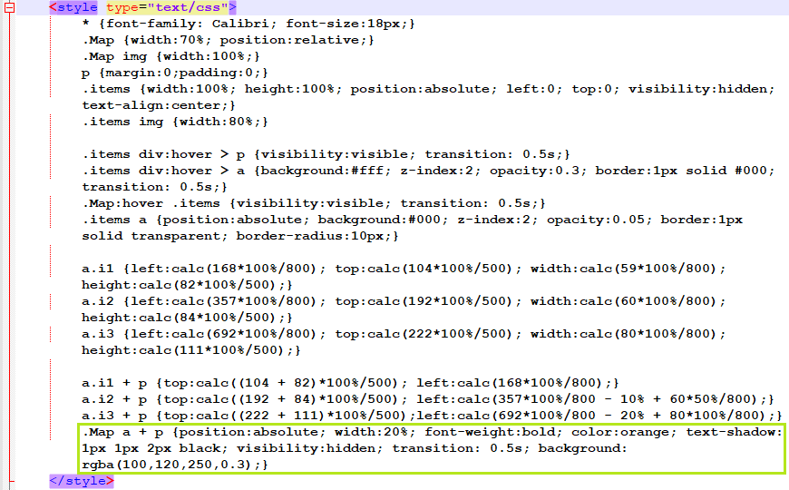
			   <figcaption>Para finalizar, os textos aparecem com a largura <code>width:20%;</code>, e devemos deixá-los escondidos com <code>visibility:hidden;</code>.</figcaption>
		   </li>
		   <li>
			   <input type="radio" id="218" name="sl">
			   <label for="218"></label>
			   
			   <figcaption>O layout desta Atividade, com os atributos mostrados fica desta forma. Modifique atributos e escolha um dos alinhamentos de texto mostrados para fazer sua atividade.</figcaption>
		   </li>
		   <li>
			   <input type="radio" id="218a" name="sl">
			   <label for="218a"></label>
			   <figcaption>
<button type="button" onclick="copyEvent('cod89', 'cd89')" onmouseout="outFunc('cd89')">Copiar o código</button>
Estrutura CSS da Atividade 6:
<pre><code id="cod89">&lt;style type="text/css"&gt;
	* {font-family: Calibri; font-size:18px;}
	.Map {width:70%; position:relative;}
	.Map img {width:100%;}
	p {margin:0;padding:0;}
	.items {width:100%; height:100%; position:absolute; left:0; top:0; visibility:hidden; 
	text-align:center;}
	.items img {width:80%;}

	.items div:hover > p {visibility:visible; transition:0.5s;}
	.items div:hover > a {background:#fff; z-index:2; opacity:0.3; border:1px solid #000; 
	transition:0.5s;}
	.Map:hover .items {visibility:visible; transition:0.5s;}
	.items a {position:absolute; background:#000; z-index:2; opacity:0.05; 
	border:1px solid transparent; border-radius:10px;}

	<a alt="top e height proporcionais à altura da imagem.">a.i1</a> {left:calc(168*100%/800); top:calc(104*100%/500); width:calc(59*100%/800); 
	height:calc(82*100%/500);}
	<a alt="left e width proporcionais à largura da imagem.">a.i2</a> {left:calc(357*100%/800); top:calc(192*100%/500); width:calc(60*100%/800); 
	height:calc(84*100%/500);}
	a.i3 {left:calc(692*100%/800); top:calc(222*100%/500); width:calc(80*100%/800); 
	height:calc(111*100%/500);}

	<a alt="descrição alinhada à esquerda com o mapeamento do item.">a.i1 + p</a> {top:calc((104 + 82)*100%/500); left:calc(168*100%/800);}
	<a alt="descrição centralizada com o mapeamento do item.">a.i2 + p</a> {top:calc((192 + 84)*100%/500); left:calc(357*100%/800 - 10% + 60*50%/800);}
	<a alt="descrição alinhada à direita com o mapeamento do item.">a.i3 + p</a> {top:calc((222 + 111)*100%/500); left:calc(692*100%/800 - 20% + 80*100%/800);}
	.Map a + p {position:absolute; width:20%; font-weight:bold; color:orange; visibility:hidden;
	text-shadow:1px 1px 2px black; transition:0.5s; background:rgba(100,120,250,0.3);}
&lt;/style&gt;</code></pre></figcaption>
		   </li>
		</ul>
		
  

	
<a href="#css2" class="topo">voltar ao topo</a>

4. CSS e Animações

	
Material da pág. 28 até a pág. 39

	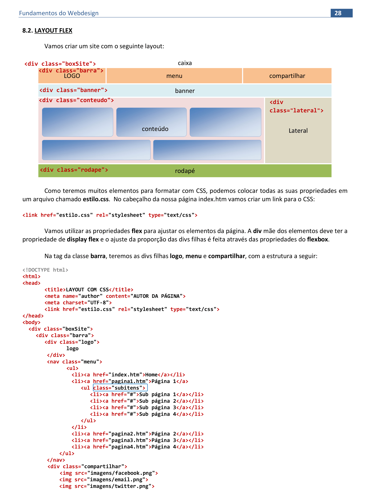
	
<a href="#css3" class="topo">voltar ao topo</a>

	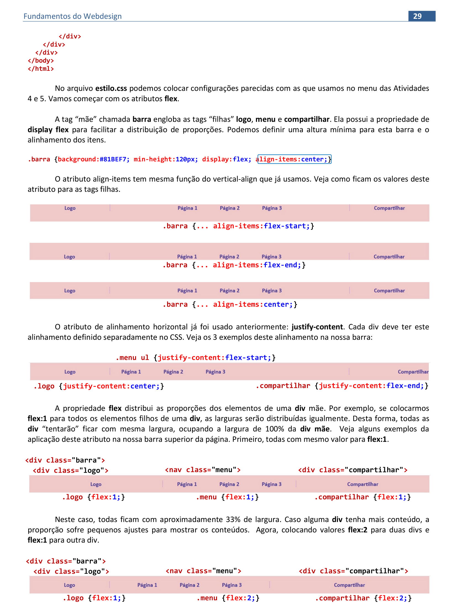
	
<a href="#css3" class="topo">voltar ao topo</a>

	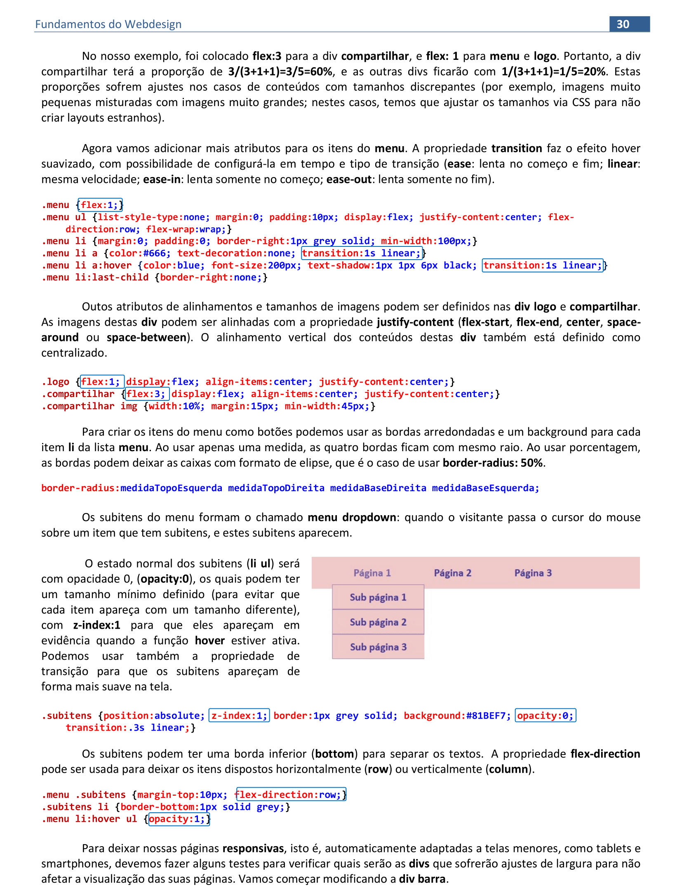
	
<a href="#css3" class="topo">voltar ao topo</a>

	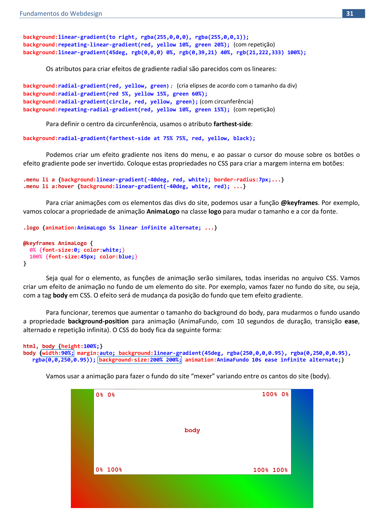
	

&#x1f4c3; Atividade 7: HTML do menu superior

	
Crie a pasta <code>webdesign/atividade7</code> com os arquivos <code>index.htm</code> e <code>estilo.css</code>. Nesta atividade, podemos usar a estrutura que usamos nos exemplos anteriores para fazer o menu. Crie a pasta das imagens <code>webdesign/atividade7/imagens</code>. Vamos criar um site com páginas sobre filmes nesta atividade. Escolha arquivos de imagens sobre seu filme favorito. A logomarca terá efeito de animação com rotação, e deve ser uma imagem de fundo transparente e com formato redondo. <a href="css3/icone_filme.png" download>Neste link</a> pode pode baixar a imagem da logomarca usada nesta atividade.

	  <ul class="slider">
		  <li>
			   <input type="radio" id="219" name="sl">
			   <label for="219"></label>
			   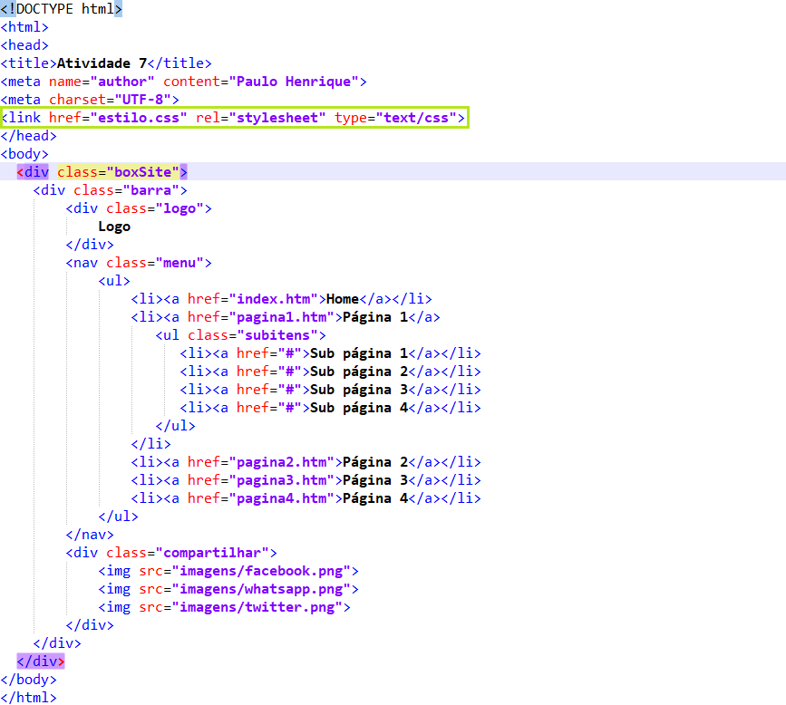
			   <figcaption>No cabeçalho da página, colocamos a referência da folha de estilos com a tag <code>&lt;link&gt;</code>. Se salvarmos o arquivo <code>estilo.css</code> na mesma pasta do <code>index.htm</code>, o caminho fica como <code>href="estilo.css"</code>.</figcaption>
		   </li>
		   <li>
			   <input type="radio" id="220" name="sl">
			   <label for="220"></label>
			   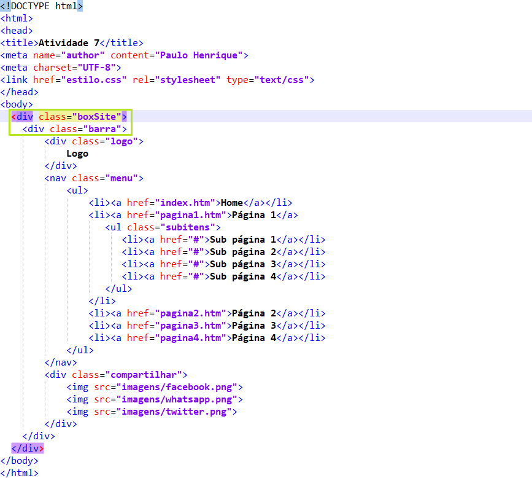
			   <figcaption>A tag "mãe" do site é a <code>class="boxSite"</code>, que contém todas as outras <b>div</b>. A primeira div será chamada de <code>class="barra"</code>, que contém a logomarca, o menu e os itens para compartilhar a página.</figcaption>
		   </li>
		   <li>
			   <input type="radio" id="221" name="sl">
			   <label for="221"></label>
			   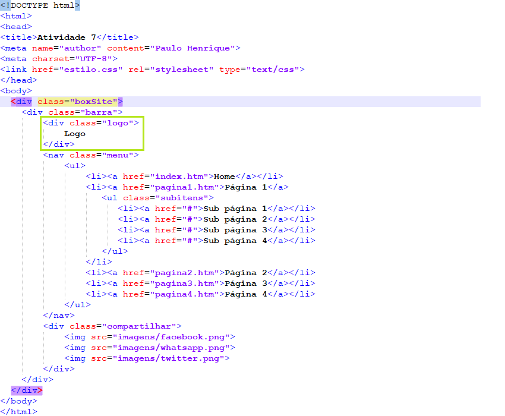
			   <figcaption>Na div <code>class="logo"</code>, podemos colocar uma imagem ou um <a href="http://www.degraf.ufpr.br/docentes/paulo/webdesign/pictograph.html" target="_blank">pictograma</a>.</figcaption>
		   </li>
		   <li>
			   <input type="radio" id="222" name="sl">
			   <label for="222"></label>
			   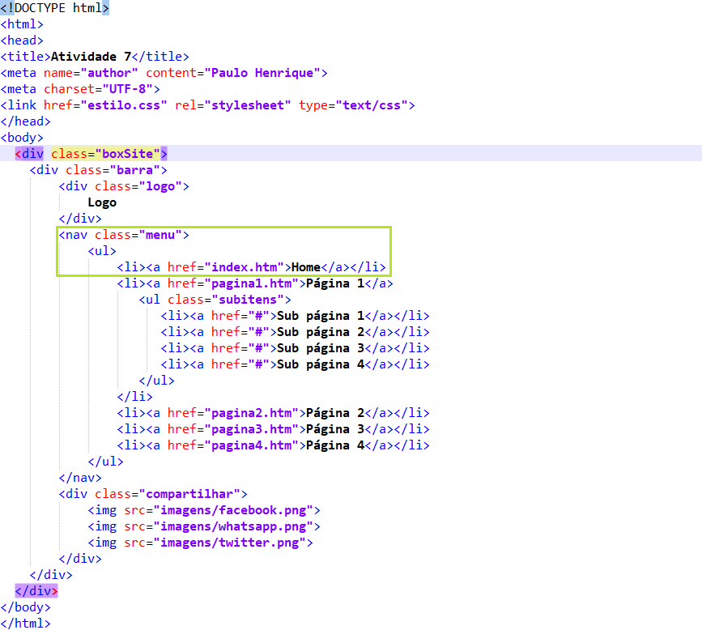
			   <figcaption>A <code>class="menu"</code> contém uma lista, bem parecida com as que já usamos em outras páginas.</figcaption>
		   </li>
		   <li>
			   <input type="radio" id="223" name="sl">
			   <label for="223"></label>
			   
			   <figcaption>Como exemplo, vamos criar um menu chamado "dropdown": é aquele que tem subitens. Basta criar uma lista com tag <code>&lt;ul&gt;</code> logo abaixo do item do menu que tem a sublista. Neste exemplo, criamos a lista <code>&lt;ul class="subitens"&gt;</code> logo abaixo do item <code>href="pagina1.htm"</code>. Note que o fechamento deste item é feito depois do fechamento dos subitens.</figcaption>
		   </li>
		   <li>
			   <input type="radio" id="224" name="sl">
			   <label for="224"></label>
			   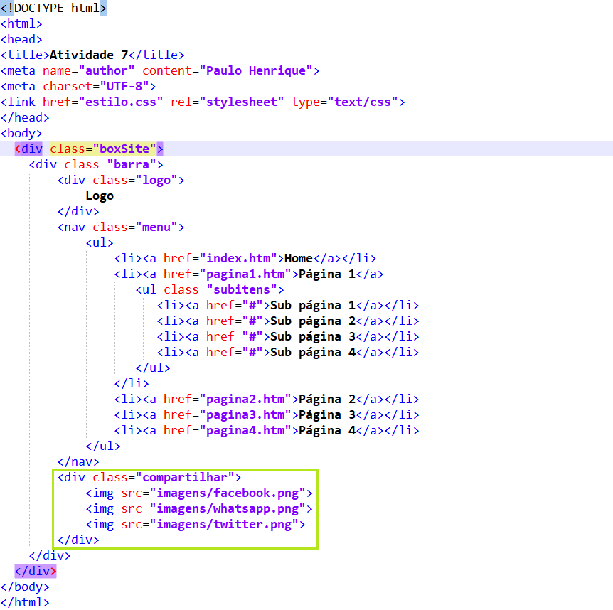
			   <figcaption>Finalizando a nossa barra de menu, colocamos as imagens de compartilhamento. Os links podem ser colocados como fizemos nas Atividades 4 e 5.</figcaption>
		   </li>
		   <li>
			   <input type="radio" id="224a" name="sl">
			   <label for="224a"></label>
			   <figcaption>
<button type="button" onclick="copyEvent('cod90', 'cd90')" onmouseout="outFunc('cd90')">Copiar o código</button>
Trecho da estrutura HTML da página index.htm da Atividade 7:
<pre><code id="cod90">&lt;div class="boxSite"&gt;
	&lt;div class="barra"&gt;
		&lt;div class="logo"&gt;
			&lt;img src="imagens/icone_filme.png"&gt;
		&lt;/div&gt;
		&lt;nav class="menu"&gt;
			&lt;ul&gt;
				&lt;li&gt;&lt;a href="index.htm"&gt;Home&lt;/a&gt;&lt;/li&gt;
				&lt;li&gt;&lt;a href="pagina1.htm"&gt;Página 1&lt;/a&gt;
				   &lt;ul class="subitens"&gt;
					  &lt;li&gt;&lt;a href="#"&gt;Sub página 1&lt;/a&gt;&lt;/li&gt;
					  &lt;li&gt;&lt;a href="#"&gt;Sub página 2&lt;/a&gt;&lt;/li&gt;
					  &lt;li&gt;&lt;a href="#"&gt;Sub página 3&lt;/a&gt;&lt;/li&gt;
					  &lt;li&gt;&lt;a href="#"&gt;Sub página 4&lt;/a&gt;&lt;/li&gt;
				   &lt;/ul&gt;
				&lt;/li&gt;
				&lt;li&gt;&lt;a href="pagina2.htm"&gt;Página 2&lt;/a&gt;&lt;/li&gt;
				&lt;li&gt;&lt;a href="pagina3.htm"&gt;Página 3&lt;/a&gt;&lt;/li&gt;
				&lt;li&gt;&lt;a href="pagina4.htm"&gt;Página 4&lt;/a&gt;&lt;/li&gt;
			&lt;/ul&gt;
		&lt;/nav&gt;
		&lt;div class="compartilhar"&gt;
			&lt;img src="imagens/facebook.png"&gt;
			&lt;img src="imagens/whatsapp.png"&gt;
			&lt;img src="imagens/twitter.png"&gt; 
		&lt;/div&gt;
	&lt;/div&gt;
&lt;/div&gt;</code></pre></figcaption>
		   </li>
		</ul>
		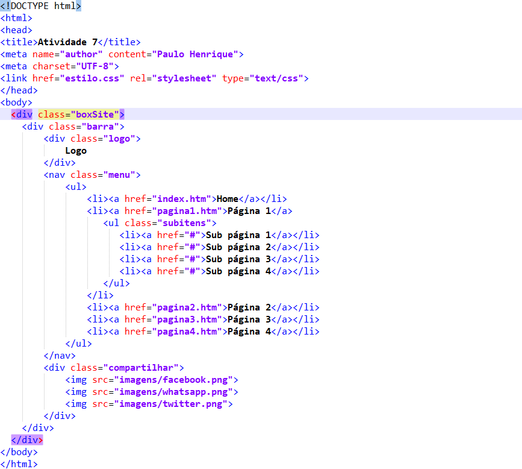
  
		   
  

&#x1f4c3; CSS do menu superior

	
Agora vamos ver a programação do menu superior em CSS.

	  <ul class="slider">		   
		   <li>
			   <input type="radio" id="225" name="sl">
			   <label for="225"></label>
			   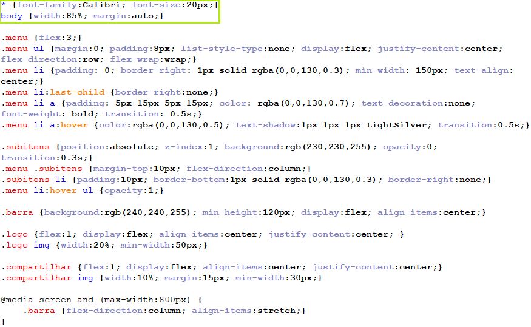
			   <figcaption>No arquivo <code>estilo.css</code>, podemos usar o marcador <b>*</b> para definir uma propriedade que vale para todas as tags da página: tipos e tamanhos de fonte, cores e margens. O atributo <code>margin:auto;</code> serve para deixar o conteúdo centralizado nos navegadores.</figcaption>
		   </li>
		   <li>
			   <input type="radio" id="226" name="sl">
			   <label for="226"></label>
			   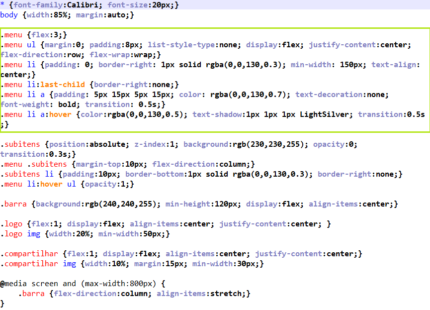
			   <figcaption>A estrutura CSS do menu é praticamente a mesma que usamos anteriormente. Modifique cores, margens e bordas. Neste exemplo, estamos usando o menu com a borda direita, parecido com aquele que mostramos nas Atividades 4 e 5.</figcaption>
		   </li>
		   <li>
			   <input type="radio" id="227" name="sl">
			   <label for="227"></label>
			   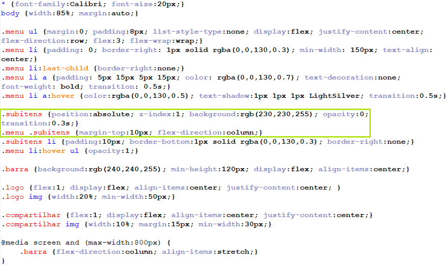
			   <figcaption>Os subitens ficam escondidos <code>opacity:0;</code>, e quando ativados têm a posição absoluta na tela. Colocamos <code>z-index:1;</code> para ter certeza de que aparecerão na frente dos outros elementos da página. O menu dropdown pode ser mostrado em linha ou em coluna. Neste caso, ficará em coluna com o atributo <code>flex-direction:column;</code>.</figcaption>
		   </li>
		   <li>
			   <input type="radio" id="228" name="sl">
			   <label for="228"></label>
			   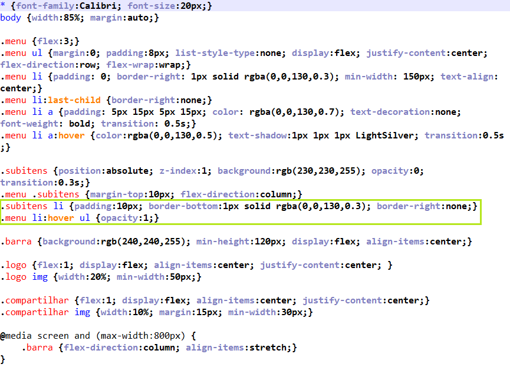
			   <figcaption>Ao passar o cursor do mouse sobre o item do menu que tem subitem, a opacidade da lista dos subitens tem valor modificado para 1 com o atributo <code>.menu li:hover ul {opacity:1;}</code>. Foram colocadas bordas inferiores para separar os subitens. Teste estas propriedades no layout de sua página.</figcaption>
		   </li>
		   <li>
			   <input type="radio" id="229" name="sl">
			   <label for="229"></label>
			   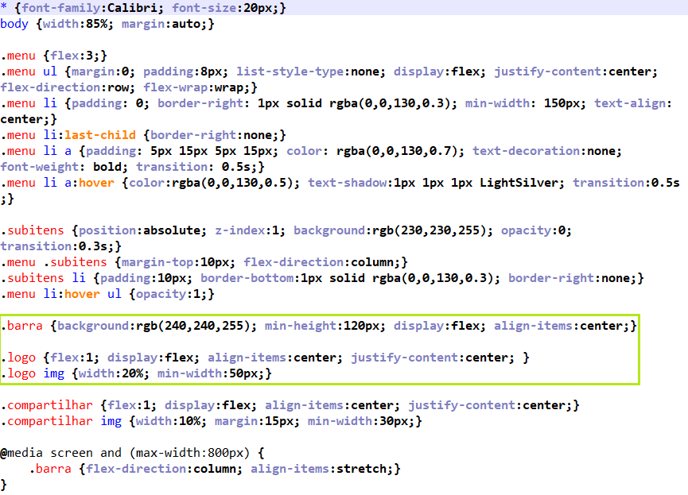
			   <figcaption>Foram colocados atributos de fundo gradiente e alinhamento centralizado para os itens das classes <code>.barra</code> e <code>.logo</code>. Teste valores para dimensionar a imagem da logomarca em <code>.logo img</code>.</figcaption>
		   </li>
		   <li>
			   <input type="radio" id="230" name="sl">
			   <label for="230"></label>
			   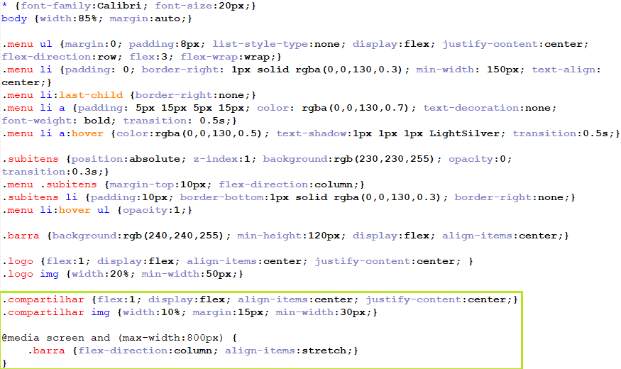
			   <figcaption>Nos links de compartilhamento, usamos atributos parecidos com os que usamos em páginas anteriores. Teste valores para dimensionar as imagens dos ícones de sua página. Em telas menores, a barra terá os itens dispostos em coluna <code>flex-direction:column;</code></figcaption>
		   </li>
		   <li>
			   <input type="radio" id="231" name="sl">
			   <label for="231"></label>
			   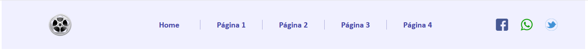
			   <figcaption>Usando os atributos mostrados, o layout da barra de menu fica desta maneira. Configure a sua barra testando as melhores medidas e cores.</figcaption>
		   </li>
		   <li>
			   <input type="radio" id="231a" name="sl">
			   <label for="231a"></label>
			   <figcaption>
<button type="button" onclick="copyEvent('cod91', 'cd91')" onmouseout="outFunc('cd91')">Copiar o código</button>
Estrutura CSS do menu superior da Atividade 7:
<pre><code id="cod91">* {font-family:Calibri; font-size:20px;}
body {width:85%; margin:auto;}

<a alt="menu com razão de proporção 3.">.menu</a> {flex:3;}
<a alt="configurações básicas dos itens do menu.">.menu ul</a> {margin:0; padding:8px; list-style-type:none; display:flex; justify-content:center; 
flex-direction:row; flex-wrap:wrap;}
.menu li {padding: 0; border-right: 1px solid rgba(0,0,130,0.3); min-width: 150px; 
text-align:center;}
.menu li:last-child {border-right:none;}
.menu li a {padding: 5px 15px 5px 15px; color: rgba(0,0,130,0.7); text-decoration:none; 
font-weight: bold; transition: 0.5s;}
.menu li a:hover {color:rgba(0,0,130,0.5); text-shadow:1px 1px 1px LightSilver; transition:0.5s;}

<a alt="subitens do menu, que devem ficar escondidos.">.subitens</a> {position:absolute; z-index:1; background:rgb(230,230,255); opacity:0; transition:0.3s;}
.menu .subitens {margin-top:10px; flex-direction:column;}
.subitens li {padding:10px; border-bottom:1px solid rgba(0,0,130,0.3); border-right:none;}
<a alt="ativação dos subitens do menu: hover.">.menu li:hover ul</a> {opacity:1;}

<a alt="barra que contém menu, logo e compartilhar.">.barra</a> {background:rgb(240,240,255); min-height:120px; display:flex; align-items:center;}

<a alt="logo com razão de proporção 1.">.logo</a> {flex:1; display:flex; align-items:center; justify-content:center; }
.logo img {width:20%; min-width:50px;}

<a alt="barra de compartilhar com razão de proporção 1.">.compartilhar</a> {flex:1; display:flex; align-items:center; justify-content:center;}
.compartilhar img {width:10%; margin:15px; min-width:30px;}

<a alt="mudança de layout para telas com largura menor do que 800px.">@media screen and (max-width:800px)</a> {
	.barra {flex-direction:column; align-items:stretch;}
}</code></pre></figcaption>
		   </li>
		</ul>
		
  

	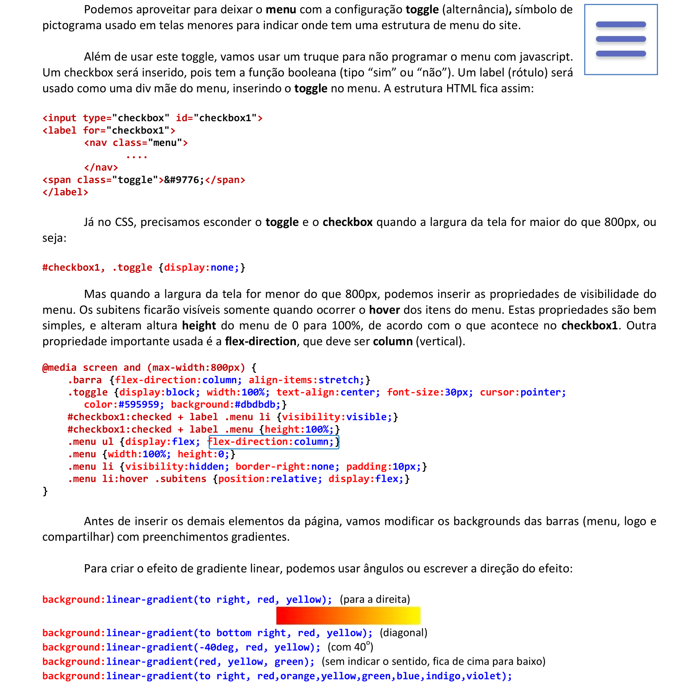
	
<a href="#css3" class="topo">voltar ao topo</a>

	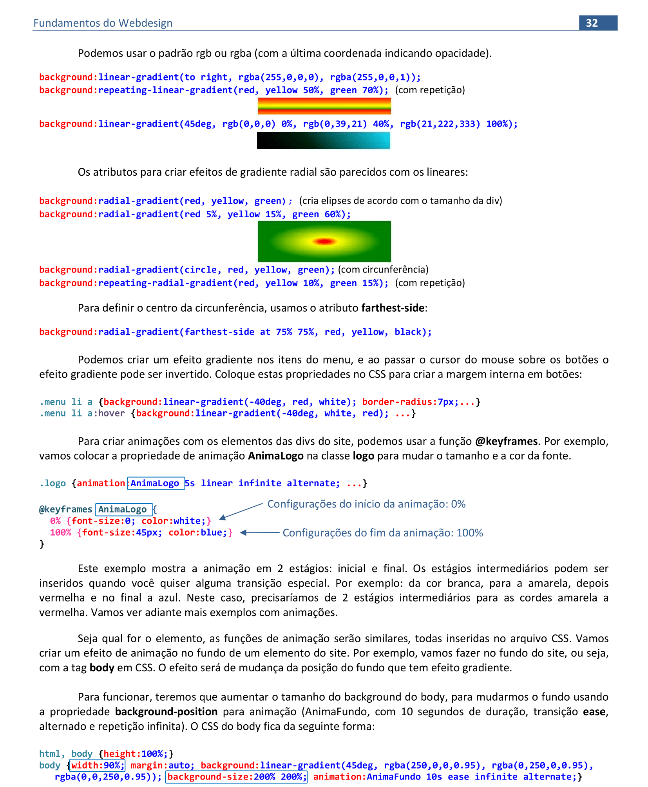
	
<a href="#css3" class="topo">voltar ao topo</a>

	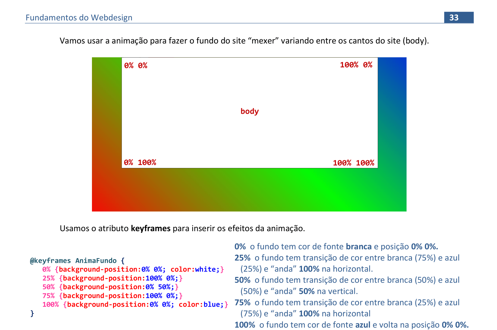
	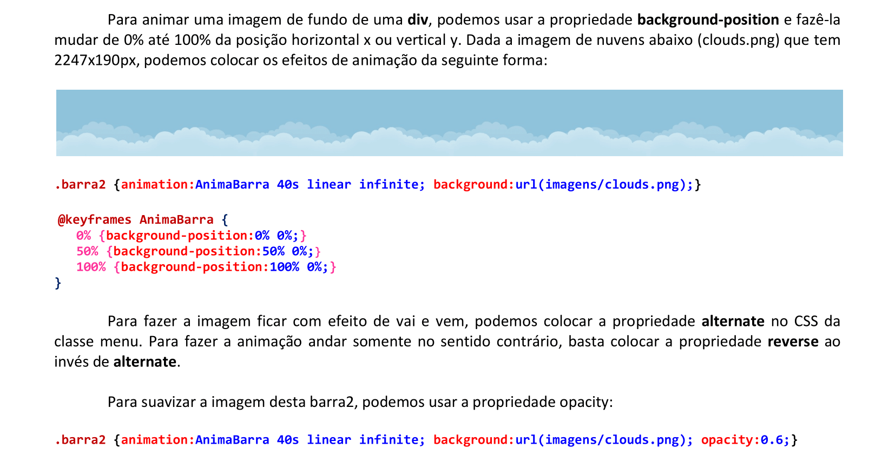
	

&#x1f4c3; Atividade 7: backgrounds e animações

	
Neste ponto, podemos criar animações nos itens que já estão programados. A imagem com um filme está disponível no link: <a href="css3/filme.png" download>filme</a>; e a imagem de nuvens, mostrada na apostila, está disponível no link: <a href="css3/clouds.png" download>nuvens</a>. Se você quiser encontrar outra imagem para colocar na barra superior da página, lembre-se que deve ser uma imagem bem larga, com altura reduzida.

	  <ul class="slider">
		  <li>
			   <input type="radio" id="232" name="sl">
			   <label for="232"></label>
			   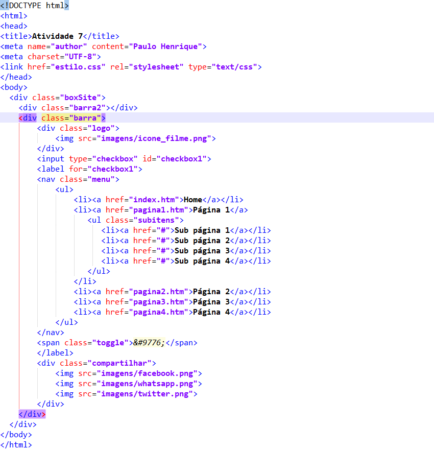
			   <figcaption>Criando a <code>class="barra2"</code>, podemos definir um fundo desta tag. Ela pode ser colocada antes ou depois da <code>class="barra"</code>. Dentro da <code>class="logo"</code>, podemos inserir uma imagem ou <a href="http://www.degraf.ufpr.br/docentes/paulo/webdesign/pictograph.html" target="_blank">pictograma</a> como logomarca da página.</figcaption>
		   </li>
		   <li>
			   <input type="radio" id="233" name="sl">
			   <label for="233"></label>
			   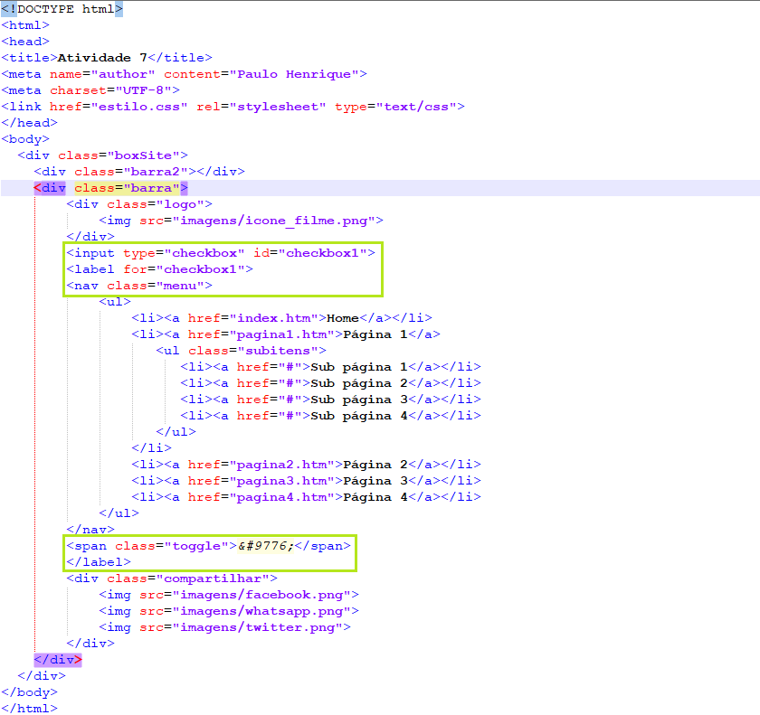
			   <figcaption>A estrutura do <b>toggle</b> deve ser colocada englobando a tag de menu. O <b>checkbox</b> fica antes da tag <code>&lt;label&gt;</code>, inserindo o <b>toggle</b> junto com o menu nesta tag de rótulo.</figcaption>
		   </li>
		   <li>
			   <input type="radio" id="234" name="sl">
			   <label for="234"></label>
			   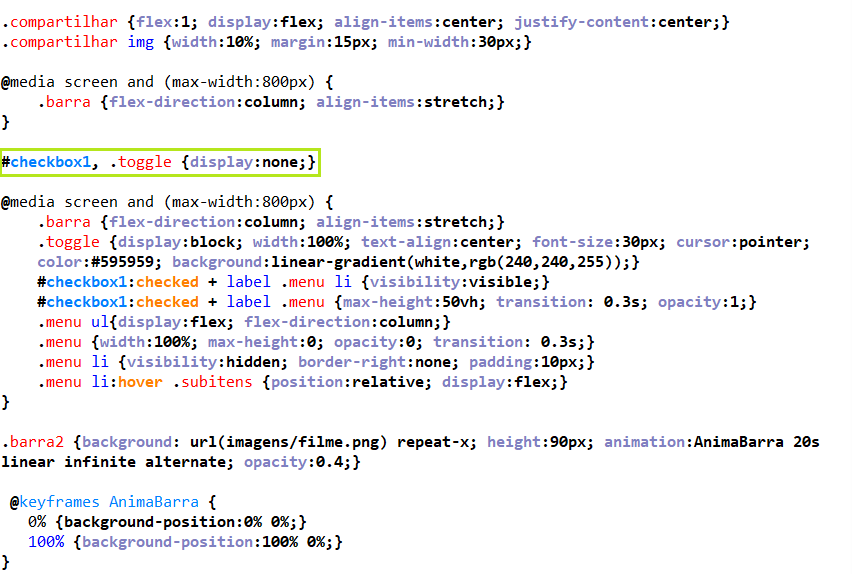
			   <figcaption>Na continuação do arquivo CSS, temos os atributos para esconder o <b>checkbox</b> e o <b>toggle</b> do menu. Eles só aparecem em navegadores com largura menor do que 800px. Redimensione o seu navegador para testar estes atributos.</figcaption>
		   </li>
		   <li>
			   <input type="radio" id="235" name="sl">
			   <label for="235"></label>
			   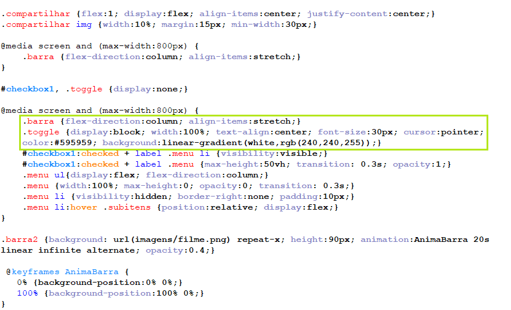
			   <figcaption>Usando os atributos de <code>@media screen</code> com largura menor do que 800px, definimos que a tag <code>.barra</code> será mostrada com itens na vertical, e o <b>toggle</b> ficará visível. Neste caso, podemos atribuir propriedades para os itens visíveis (cor, tamanho, margem,...).</figcaption>
		   </li>
		   <li>
			   <input type="radio" id="236" name="sl">
			   <label for="236"></label>
			   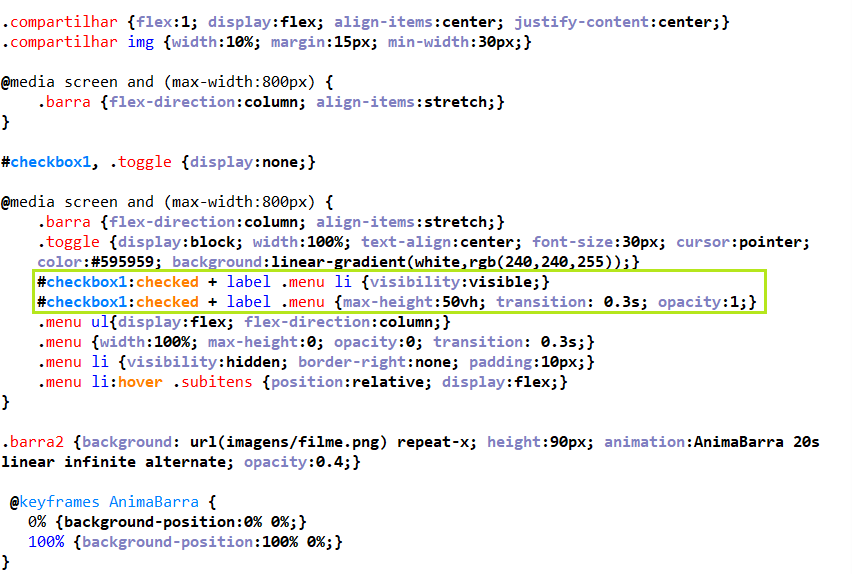
			   <figcaption>Neste ponto está definido o critério para o menu e o toggle aparecerem: <code>#checkbox1:checked</code>, ou seja, quando o visitante clicar no menu. Definimos também qual será a altura máxima do menu: <code>max-height:50vh;</code>, ou seja, metade da altura do navegador.</figcaption>
		   </li>
		   <li>
			   <input type="radio" id="237" name="sl">
			   <label for="237"></label>
			   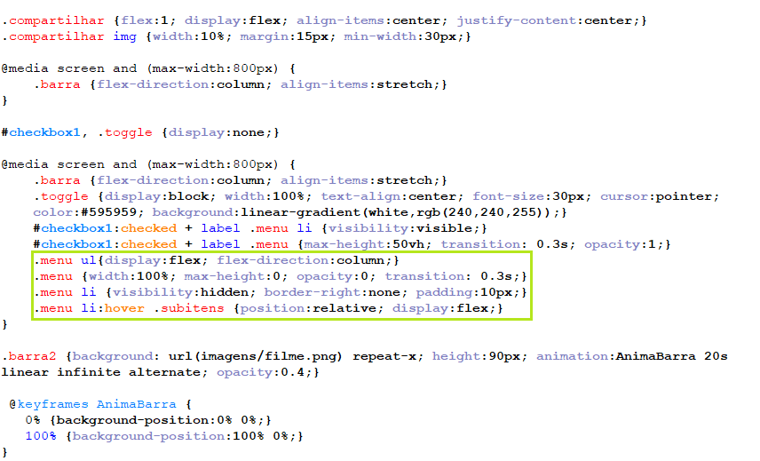
			   <figcaption>No caso do <b>checkbox</b> não estar ativado, o menu terá a altura máxima como 0. Os itens estão com atributos escondidos <code>hidden</code>, em formato vertical (coluna).</figcaption>
		   </li>
		   <li>
			   <input type="radio" id="238" name="sl">
			   <label for="238"></label>
			   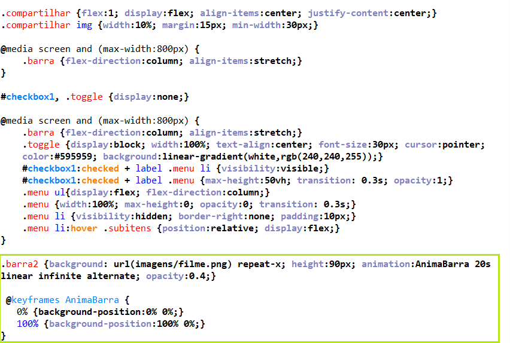
			   <figcaption>A classe <code>.barra2</code> está com a imagem de fundo definida, com repetição na horizontal <code>repeat-x</code>, com a altura igual à altura da imagem de 90px. A animação de deslocamento do fundo começa na posição 0% 0% e termina em 100% 0%. Modifique os valores, caso necessário, e escolha uma imagem para ficar no fundo desta tag.</figcaption>
		   </li>
		   <li>
			   <input type="radio" id="239" name="sl">
			   <label for="239"></label>
			   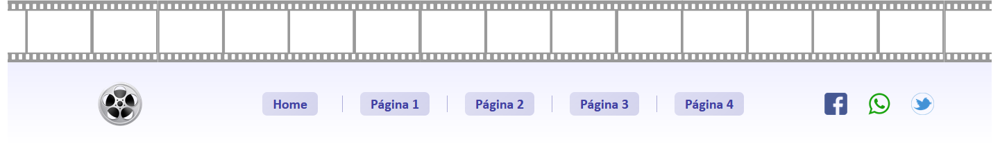
			   <figcaption>Com todos os atributos mostrados até agora, o layout com as duas barras superiores fica desta maneira. O fundo da tag do menu foi modificado usando o atributo <code>linear-gradient</code>. Aqui temos um trecho HTML com menu modificado para modo responsivo:
<button type="button" onclick="copyEvent('cod92', 'cd92')" onmouseout="outFunc('cd92')">Copiar o código</button>

<pre><code id="cod92"><a alt="inserção do toggle para deixar o site com todos os itens responsivos.">&lt;input type="checkbox" id="checkbox1"&gt;</a>
<a alt="ativação do toggle usando checkbox.">&lt;label for="checkbox1"&gt;</a>
&lt;nav class="menu"&gt;
	&lt;ul&gt;
		&lt;li&gt;&lt;a href="index.htm"&gt;Home&lt;/a&gt;&lt;/li&gt;
		&lt;li&gt;&lt;a href="pagina1.htm"&gt;Página 1&lt;/a&gt;
		   &lt;ul class="subitens"&gt;
			  &lt;li&gt;&lt;a href="#"&gt;Sub página 1&lt;/a&gt;&lt;/li&gt;
			  &lt;li&gt;&lt;a href="#"&gt;Sub página 2&lt;/a&gt;&lt;/li&gt;
			  &lt;li&gt;&lt;a href="#"&gt;Sub página 3&lt;/a&gt;&lt;/li&gt;
			  &lt;li&gt;&lt;a href="#"&gt;Sub página 4&lt;/a&gt;&lt;/li&gt;
		   &lt;/ul&gt;
		&lt;/li&gt;
		&lt;li&gt;&lt;a href="pagina2.htm"&gt;Página 2&lt;/a&gt;&lt;/li&gt;
		&lt;li&gt;&lt;a href="pagina3.htm"&gt;Página 3&lt;/a&gt;&lt;/li&gt;
		&lt;li&gt;&lt;a href="pagina4.htm"&gt;Página 4&lt;/a&gt;&lt;/li&gt;
	&lt;/ul&gt;
&lt;/nav&gt;
<a alt="menu do tipo toggle que aparece para o visitante.">&lt;span class="toggle"&gt;&amp;#9776;&lt;/span&gt;</a>
&lt;/label&gt;</code></pre></figcaption>
		   </li>
		   <li>
			   <input type="radio" id="239b" name="sl">
			   <label for="239b"></label>
			   <figcaption>
<button type="button" onclick="copyEvent('cod93', 'cd93')" onmouseout="outFunc('cd93')">Copiar o código</button>
Trecho CSS com menu modificado e animações:
<pre><code id="cod93"><a alt="mudanças dos itens para telas com larguras menores que 800px.">@media screen and (max-width:800px)</a> {
	<a alt="barra com itens distribuídos verticalmentoe.">.barra</a> {flex-direction:column; align-items:stretch;}
	<a alt="posição do menu toggle acima do menu horizontal.">.toggle</a> {display:block; width:100%; text-align:center; font-size:30px; cursor:pointer; 
	color:#595959; background:linear-gradient(white,rgb(240,240,255));}
	<a alt="menu visível quando o usuário clicar no toggle.">#checkbox1:checked + label .menu li</a> {visibility:visible;}
	<a alt="configuração de visualização do menu visível.">#checkbox1:checked + label .menu</a> {max-height:50vh; transition: 0.3s; opacity:1;}
	<a alt="disposição vertical dos itens do menu.">.menu ul</a> {display:flex; flex-direction:column;}
	.menu {width:100%; max-height:0; opacity:0; transition: 0.3s;}
	<a alt="subitens escondidos.">.menu li</a> {visibility:hidden; border-right:none; padding:10px;}
	<a alt="subitens visíveis com hover.">.menu li:hover .subitens</a> {position:relative; display:flex;}
}

<a alt="barra2: fundo da página com animação AnimaBarra.">.barra2</a> {background:url(imagens/filme.png) repeat-x; height:90px; 
animation:AnimaBarra 20s linear infinite alternate; opacity:0.4;}

<a alt="efeitos de animação do fundo da página.">@keyframes AnimaBarra</a> { 
	0% {background-position:0% 0%;}
	100% {background-position:100% 0%;}
}</code></pre></figcaption>
		   </li>
		</ul>
		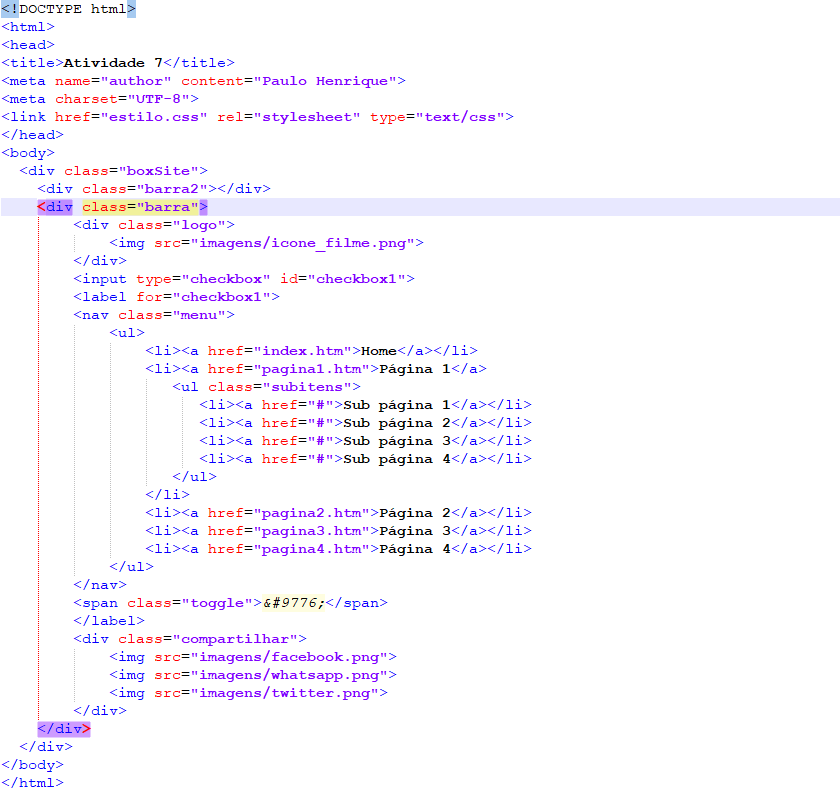
  

	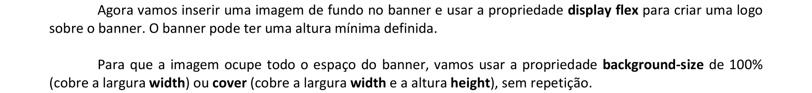
	
<a href="#css3" class="topo">voltar ao topo</a>

	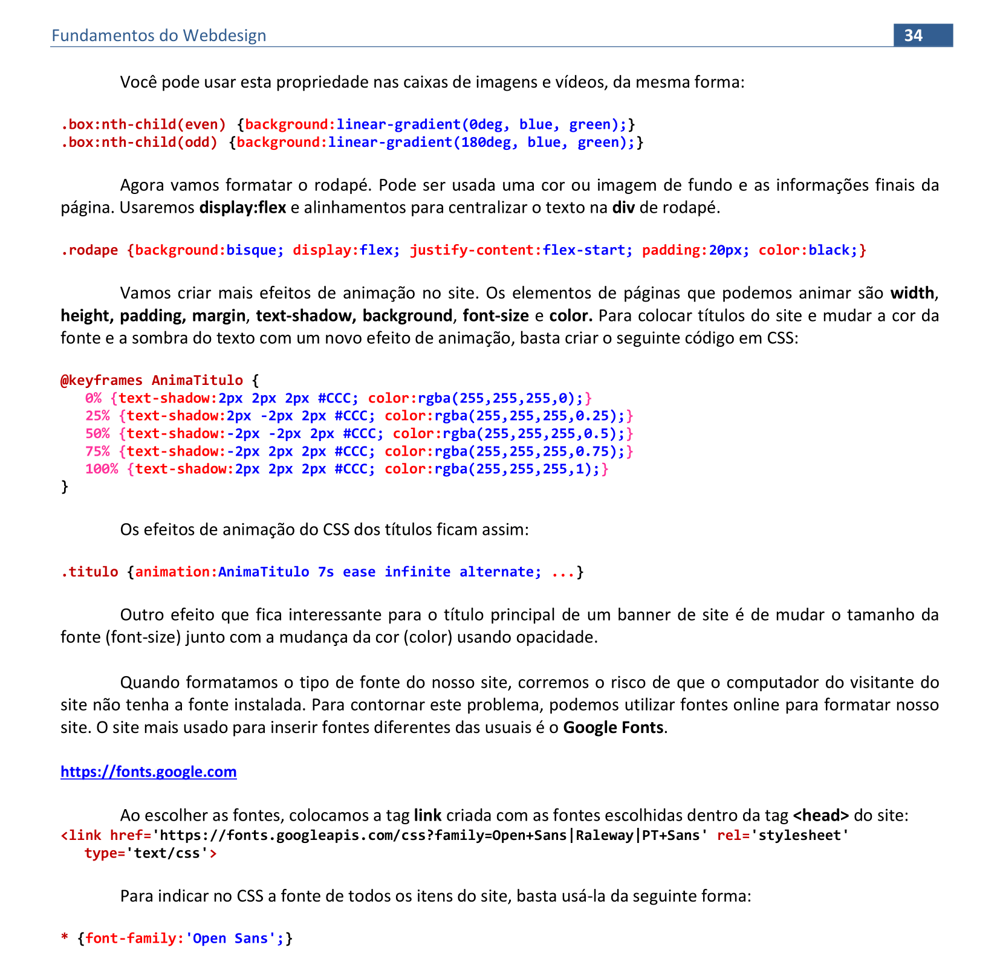
	

&#x1f4c3; Atividade 7: banner e descrição

	
Neste ponto, podemos criar o banner e uma logo para ficar flutuando sobre o banner. Escolha uma imagem com boa resolução para ficar no banner, e uma logo do filme.

	  <ul class="slider">
		  <li>
			   <input type="radio" id="240" name="sl">
			   <label for="240"></label>
			   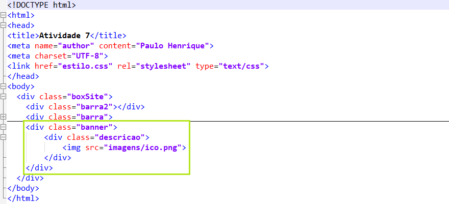
			   <figcaption>A tag <code>class="banner"</code> pode ser inserida logo após a tag <code>class="barra"</code>. Dentro desta tag, criamos a tag filha <code>class="descricao"</code> para criarmos uma logo flutuante sobre o banner.</figcaption>
		   </li>
		   <li>
			   <input type="radio" id="241" name="sl">
			   <label for="241"></label>
			   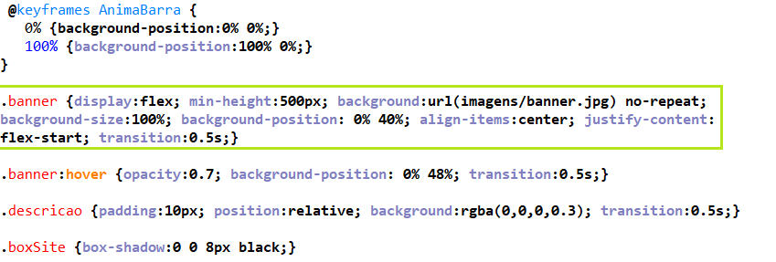
			   <figcaption>Na continuação do arquivo CSS, temos os atributos da classe <code>.banner</code>, com o background que você escolheu (sem repetição), com as propriedades para cobrir a largura da tag. O alinhamento da tag <code>.descricao</code> ficará à esquerda pois <code>flex-direction:flex-start;</code>. Se você quiser colocá-la centralizada no banner, basta mudar esta propriedade para <code>center</code> ou à direita ficaria <code>flex-end</code>.</figcaption>
		   </li>
		   <li>
			   <input type="radio" id="242" name="sl">
			   <label for="242"></label>
			   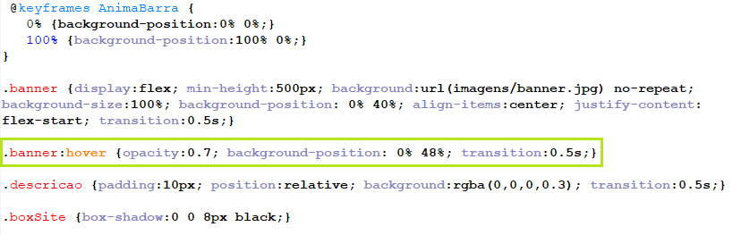
			   <figcaption>Quando o visitante passar o cursor do mouse sobre o banner, ele sofre um deslocamento na vertical: vai para a coordenada 0% 48%. Note que colocamos o efeito <b>transition</b> nesta tag e na tag do banner sem hover. Assim, o efeito é suavizado tanto no momento de passar o cursor quanto de retirar o cursor de cima do banner.</figcaption>
		   </li>
		   <li>
			   <input type="radio" id="243" name="sl">
			   <label for="243"></label>
			   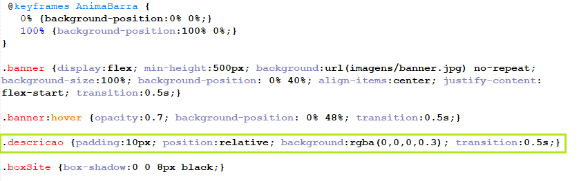
			   <figcaption>A tag filha <code>.descricao</code> fica com posição relativa, com fundo com transparência usada na cor RGBA. Defina margem interna para que a imagem não fique "grudada" nos cantos.</figcaption>
		   </li>
		   <li>
			   <input type="radio" id="244" name="sl">
			   <label for="244"></label>
			   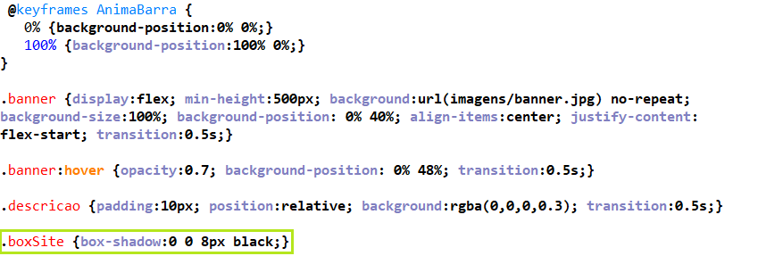
			   <figcaption>Para dar um efeito de profundidade, podemos colocar uma sombra na tag mãe das páginas usando o atributo <code>box-shadow</code>.</figcaption>
		   </li>
		   <li>
			   <input type="radio" id="245" name="sl">
			   <label for="245"></label>
			   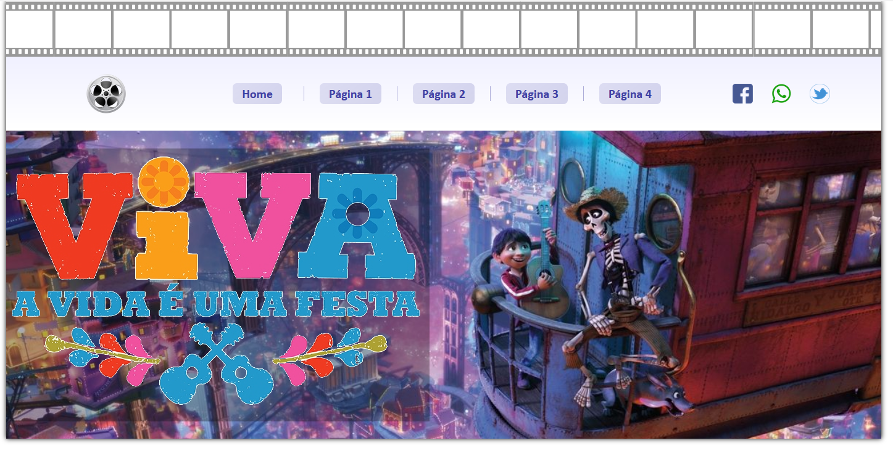
			   <figcaption>Com os valores dos atributos mostrados até agora, o site fica com este layout. Modifique os valores para a página do seu filme.</figcaption>
		   </li>
		   <li>
			   <input type="radio" id="245a" name="sl">
			   <label for="245a"></label>
			   <figcaption>
<button type="button" onclick="copyEvent('cod94', 'cd94')" onmouseout="outFunc('cd94')">Copiar o código</button>
Trecho HTML da barra banner com a descrição:
<pre><code id="cod94"><a alt="banner colocado abaixo das tags da classe barra.">&lt;div class="banner"&gt;</a>
	&lt;div class="descricao"&gt;
		&lt;img src="imagens/ico.png"&gt;
	&lt;/div&gt;
&lt;/div&gt;</code></pre>

<button type="button" onclick="copyEvent('cod95', 'cd95')" onmouseout="outFunc('cd95')">Copiar o código</button>
Trecho CSS da barra banner com a descrição:
<pre><code id="cod95"><a alt="banner com distribuição de itens flexbox.">.banner</a> {display:flex; min-height:500px; background:url(imagens/banner.jpg) no-repeat; 
background-size:100%; background-position: 0% 40%; align-items:center; transition:0.5s;
justify-content:flex-start;}

<a alt="efeito hover para mudar posição e opacidade do fundo do banner.">.banner:hover</a> {opacity:0.7; background-position: 0% 48%; transition:0.5s;}

<a alt="item flutuante sobre o banner, com descrição ou imagem.">.descricao</a> {padding:10px; position:relative; background:rgba(0,0,0,0.3); transition:0.5s;}

<a alt="efeito de contorno da página.">.boxSite</a> {box-shadow:0 0 8px black;}
 </code></pre></figcaption>
	   </li>
		</ul>
		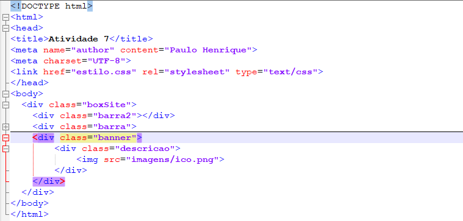
  

  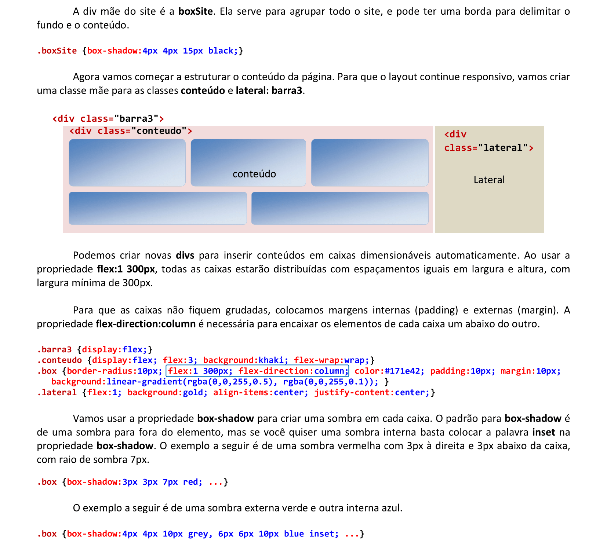
	
<a href="#css3" class="topo">voltar ao topo</a>

	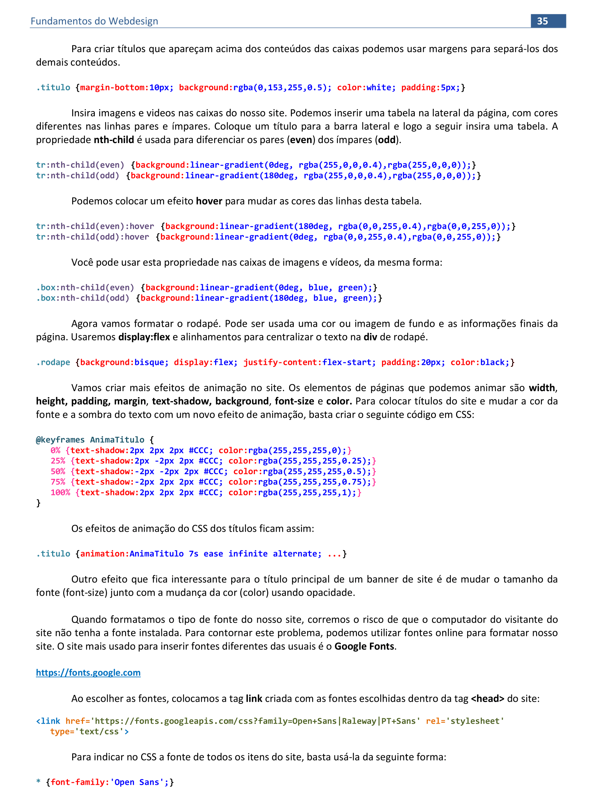
	

&#x1f4c3; Atividade 7: conteúdos, fontes e rodapé

	
Neste ponto, podemos criar conteúdos em duas barras: uma principal e outra lateral. Escolha imagens do filme para ficarem como uma espécie de galeria. Outras imagens podem ser colocadas na barra lateral, com alguns personagens formando outra galeria.

	  <ul class="slider">
		  <li>
			   <input type="radio" id="246" name="sl">
			   <label for="246"></label>
			   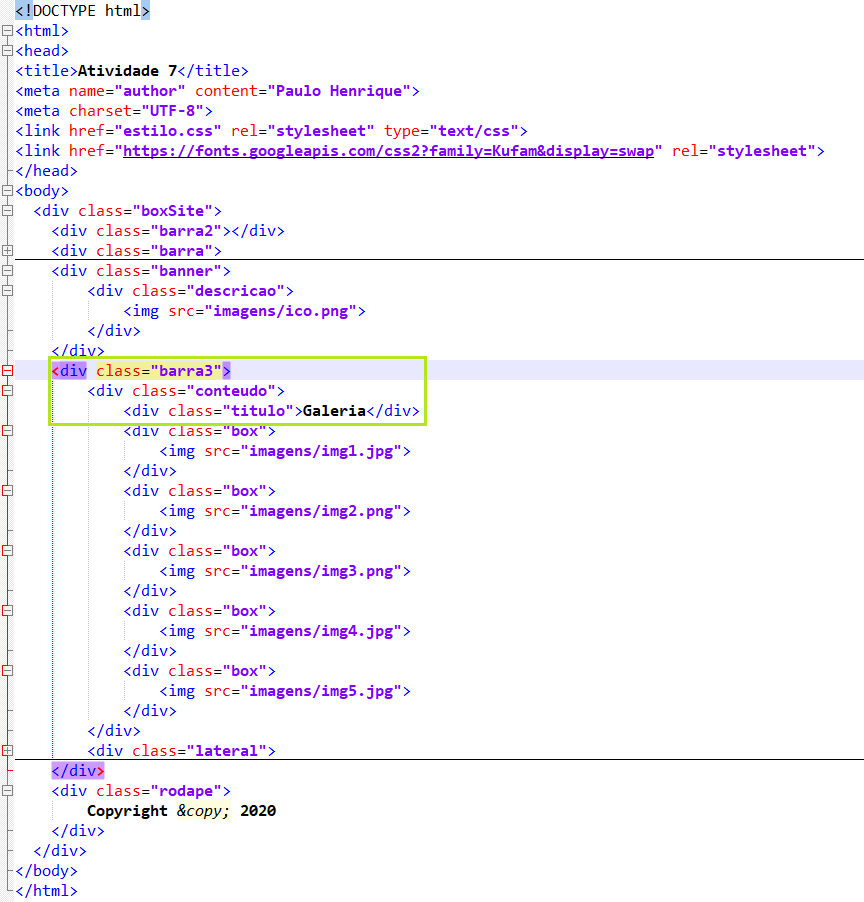
			   <figcaption>A tag <code>class="barra3"</code> pode ser inserida logo após a tag <code>class="banner"</code>. Dentro desta tag, criamos as tags filhas <code>class="conteudo"</code> e <code>class="box"</code> que contém as imagens do filme. Colocamos também uma tag <code>class="titulo"</code> para usar nesta barra.</figcaption>
		   </li>
		   <li>
			   <input type="radio" id="247" name="sl">
			   <label for="247"></label>
			   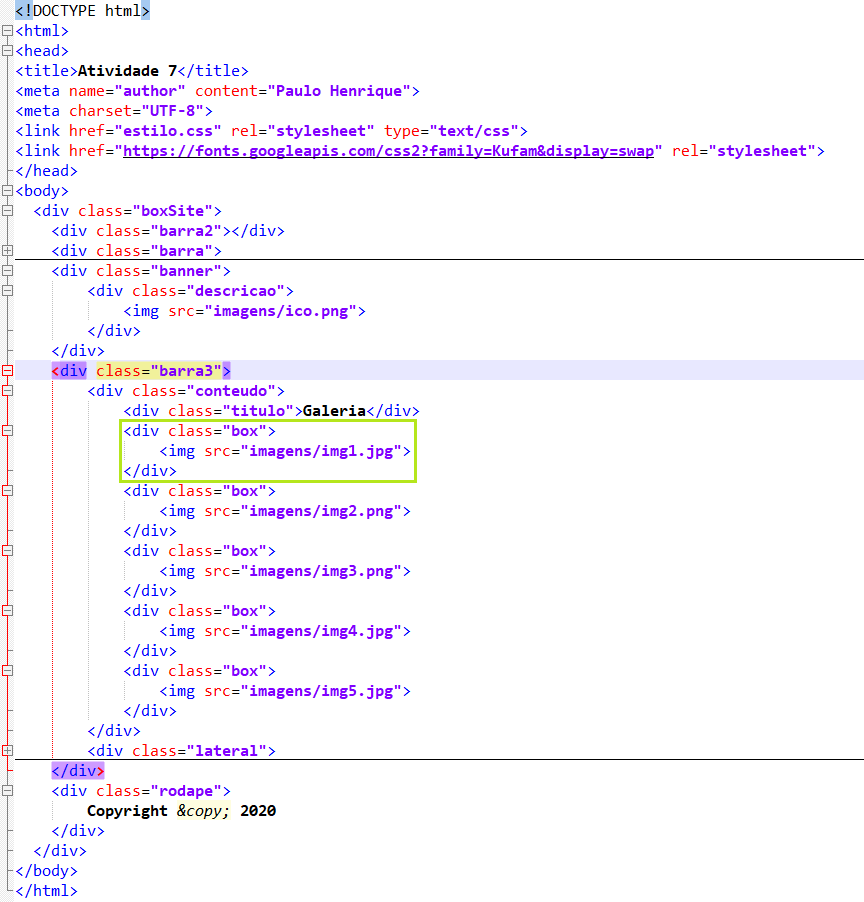
			   <figcaption>Escolha pelo menos 5 imagens para colocar nas tags <code>class="box"</code> dentro da tag de <code>class="conteudo"</code>.</figcaption>
		   </li>
		   <li>
			   <input type="radio" id="248" name="sl">
			   <label for="248"></label>
			   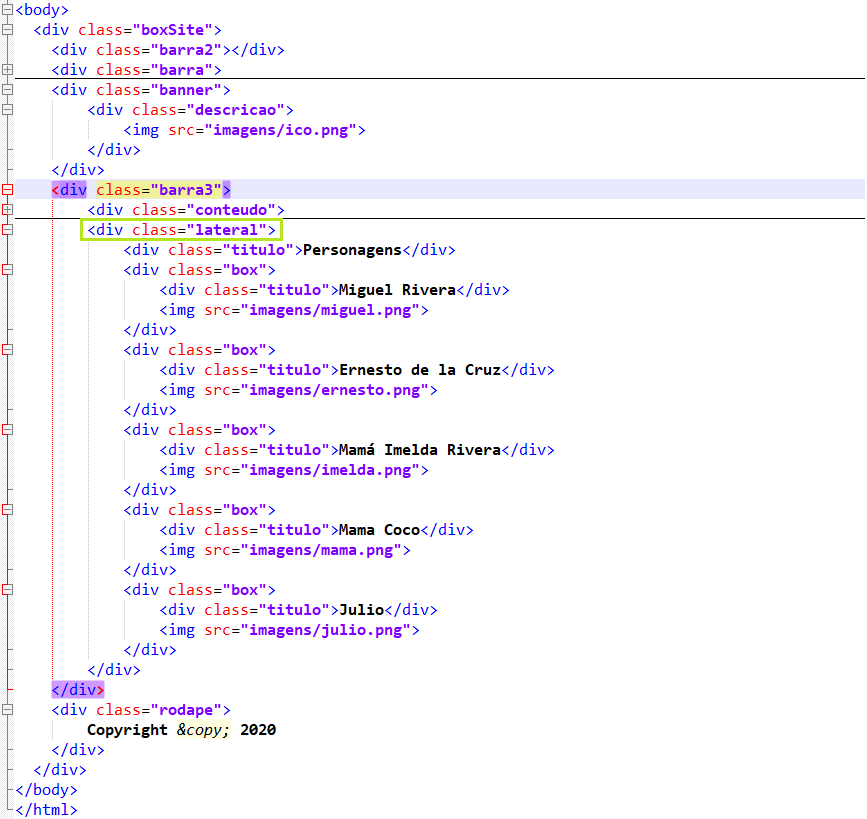
			   <figcaption>A tag <code>class="lateral"</code> tem mesma estrutura da tag <code>class="conteudo"</code>: título e as tags <code>class="box"</code> com as imagens. Escolha pelo menos 5 personagens para colocar nesta barra lateral.</figcaption>
		   </li>
		   <li>
			   <input type="radio" id="249" name="sl">
			   <label for="249"></label>
			   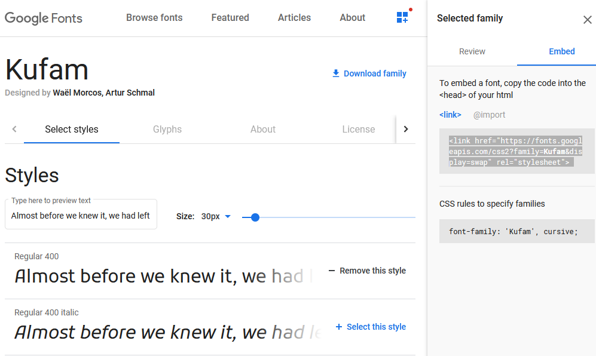
			   <figcaption>Podemos colocar as fontes online em nossas páginas. Acesse o site <a href="https://fonts.google.com/" target="_blank">fonts.google.com/</a>, escolha uma fonte e clique em <b>Select this style</b>. Você pode escolher mais de uma fonte. Note que as fontes escolhidas aparecem ao lado, com os links prontos para colocarmos no HTML e no CSS.</figcaption>
		   </li>
		   <li>
			   <input type="radio" id="249a" name="sl">
			   <label for="249a"></label>
			   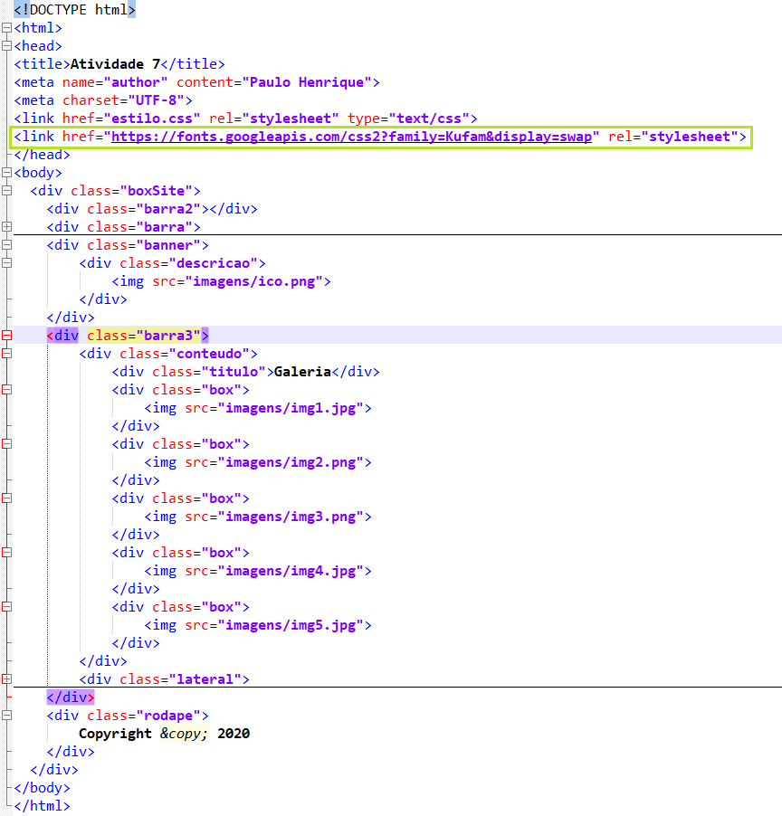
			   <figcaption>No cabeçalho da página em HTML colocamos o link das fontes escolhidas. Neste caso, eu escolhi a fonte <b>Kufam</b>, que será colocada naquela tag principal do CSS, que usamos com <b>*</b> no começo da Atividade 7.</figcaption>
		   </li>
		   <li>
			   <input type="radio" id="250" name="sl">
			   <label for="250"></label>
			   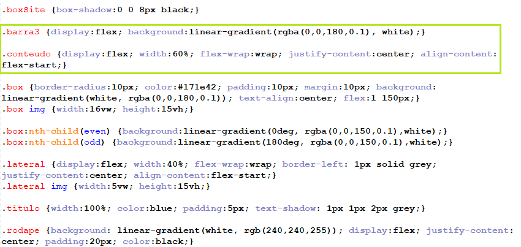
			   <figcaption>Na continuação do nosso arquivo CSS, colocamos os atributos da classe <code>.barra3</code> com display flexbox e fundo com gradiente. Para alinhar os conteúdos na vertical, usamos o atributo <code>align-content:flex-start</code>, que tem a mesma função do <code>vertical-align</code> das tabelas.</figcaption>
		   </li>
		   <li>
			   <input type="radio" id="251" name="sl">
			   <label for="251"></label>
			   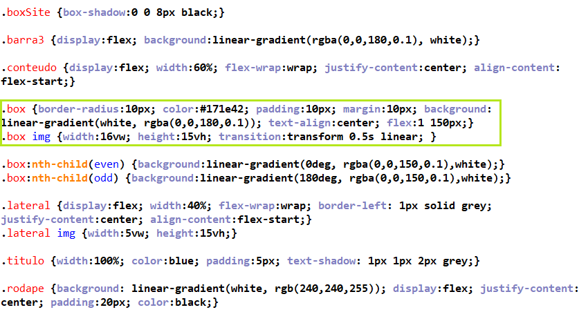
			   <figcaption>As caixas com conteúdos <code>.box</code> tem os atributos: bordas arredondadas, margens, fundo gradiente, alinhamento de texto e tamanhos iguais de no mínimo 150px <code>flex:1 150px</code>. As imagens destas caixas têm larguras e alturas ajustadas de acordo com as dimensões do navegador. Ajuste os valores para as imagens de sua página.</figcaption>
		   </li>
		   <li>
			   <input type="radio" id="252" name="sl">
			   <label for="252"></label>
			   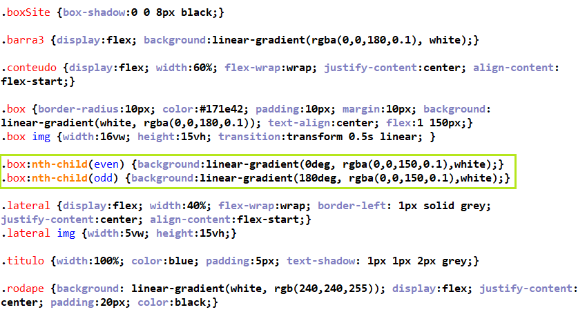
			   <figcaption>Nesta página, ao invés de usar a tabela "zebrada", podemos usar os box com este atributo. Os pares (even) ficam com um tipo de fundo gradiente, e os ímpares (odd) ficam com outro tipo.</figcaption>
		   </li>
		   <li>
			   <input type="radio" id="253" name="sl">
			   <label for="253"></label>
			   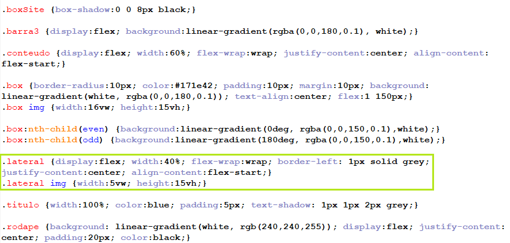
			   <figcaption>Os ajustes da tag <code>.lateral</code> são similares às caixas, com alinhamentos horizontais centralizados e verticais no topo (flex-start). Ajuste os valores das dimensões das imagens de sua página. No caso desta página, as imagens tem largura bem menor do que a altura, pois mostram apenas 1 personagem cada.</figcaption>
		   </li>
		   <li>
			   <input type="radio" id="254" name="sl">
			   <label for="254"></label>
			   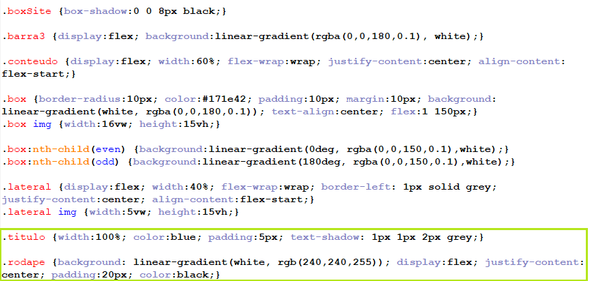
			   <figcaption>Os atributos dos títulos usam margens, cores e uma sombra de texto. O rodapé está com conteúdo centralizado, margem interna e fundo com gradiente.</figcaption>
		   </li>
		   <li>
			   <input type="radio" id="255" name="sl">
			   <label for="255"></label>
			   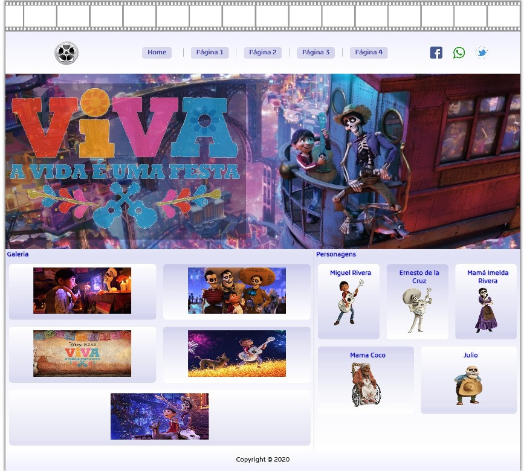
			   <figcaption>O layout da página fica com esta visualização usando os atributos definidos até o momento. Configure a sua página com as novas tags de imagens nas galerias criadas.</figcaption>
		   </li>
		   <li>
			   <input type="radio" id="255a" name="sl">
			   <label for="255a"></label>
			   <figcaption>
<button type="button" onclick="copyEvent('cod96', 'cd96')" onmouseout="outFunc('cd96')">Copiar o código</button>
Trecho HTML do conteúdo e da barra lateral:
<pre><code id="cod96"><a alt="barra3 com os conteúdos de galerias de imagens da página.">&lt;div class="barra3"&gt;</a>
	<a alt="galeria de imagens com classe conteudo.">&lt;div class="conteudo"&gt;</a>
		&lt;div class="titulo"&gt;Galeria&lt;/div&gt;
		<a alt="podemos inserir algumas imagens na galeria, com classe box.">&lt;div class="box"&gt;</a>
			&lt;img src="imagens/img1.jpg"&gt;
		&lt;/div&gt;
		&lt;div class="box"&gt;
			&lt;img src="imagens/img2.png"&gt;
		&lt;/div&gt;
	&lt;/div&gt;
	<a alt="galeria lateral com imagens de personagens.">&lt;div class="lateral"&gt;</a>
		&lt;div class="titulo"&gt;Personagens&lt;/div&gt;
		<a alt="podemos inserir imagens e os nomes de cada personagem.">&lt;div class="box"&gt;</a>
			&lt;div class="titulo"&gt;Miguel Rivera&lt;/div&gt;
			&lt;img src="imagens/miguel.png"&gt;
		&lt;/div&gt;
		&lt;div class="box"&gt;
			&lt;div class="titulo"&gt;Ernesto de la Cruz&lt;/div&gt;
			&lt;img src="imagens/ernesto.png"&gt;
		&lt;/div&gt;
		&lt;div class="box"&gt;
			&lt;div class="titulo"&gt;Mamá Imelda Rivera&lt;/div&gt;
			&lt;img src="imagens/imelda.png"&gt;
		&lt;/div&gt;
	&lt;/div&gt;
&lt;/div&gt;</code></pre></figcaption>
		   </li>
		   <li>
			   <input type="radio" id="255b" name="sl">
			   <label for="255b"></label>
			   <figcaption>
<button type="button" onclick="copyEvent('cod97', 'cd97')" onmouseout="outFunc('cd97')">Copiar o código</button>
Trecho CSS do conteúdo e da barra lateral:
<pre><code id="cod97"><a alt="flexbox da barra de galeria de imagens.">.barra3</a> {display:flex; background:linear-gradient(rgba(0,0,180,0.1), white);}

<a alt="distribuição de itens flexbox da galeria de imagens.">.conteudo</a> {display:flex; width:60%; flex-wrap:wrap; justify-content:center; 
align-content:flex-start;}

<a alt="configuração de cada box de imagem.">.box</a> {border-radius:10px; color:#171e42; padding:10px; margin:10px; text-align:center;
background:linear-gradient(white, rgba(0,0,180,0.1)); flex:1 150px;}
.box img {width:16vw; height:15vh; transition:transform 0.5s linear; }

<a alt="ordem par da coleção de box com uma configuração.">.box:nth-child(even)</a> {background:linear-gradient(0deg, rgba(0,0,150,0.1),white);}
<a alt="ordem ímpar da coleção de box com outra configuração.">.box:nth-child(odd)</a> {background:linear-gradient(180deg, rgba(0,0,150,0.1),white);}

<a alt="galeria lateral flexbox de imagens da página.">.lateral</a> {display:flex; width:40%; flex-wrap:wrap; border-left:1px solid grey; 
justify-content:center; align-content:flex-start;}
.lateral img {width:5vw; height:15vh;}

<a alt="títulos das imagens da galeria lateral.">.titulo</a> {width:100%; color:blue; padding:5px; text-shadow: 1px 1px 2px grey;}

<a alt="configuração do rodapé da página.">.rodape</a> {background: linear-gradient(white, rgb(240,240,255)); display:flex; 
justify-content:center; padding:20px; color:black;}</code></pre></figcaption>
		   </li>
		</ul>
		
  

	
<a href="#css3" class="topo">voltar ao topo</a>

	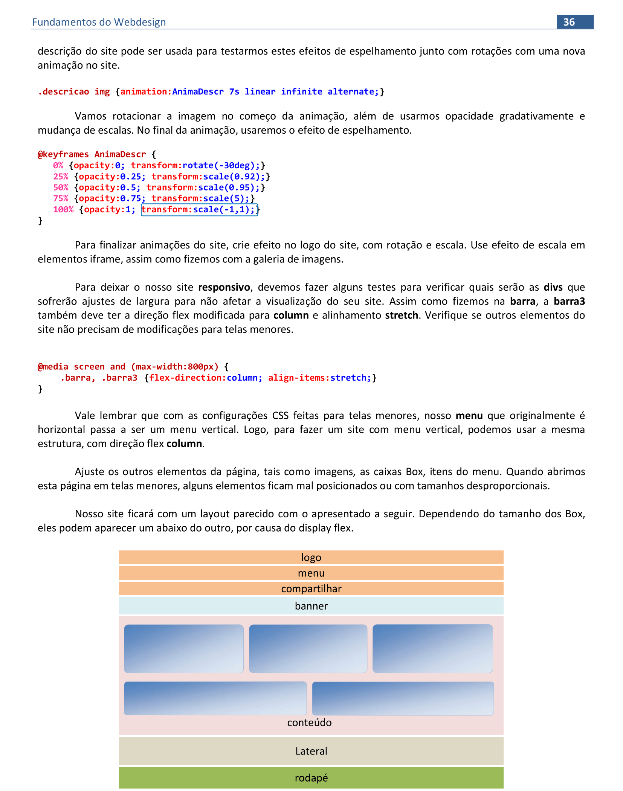
	
<a href="#css3" class="topo">voltar ao topo</a>

	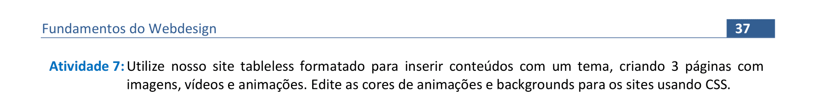
	
<a href="#css3" class="topo">voltar ao topo</a>

	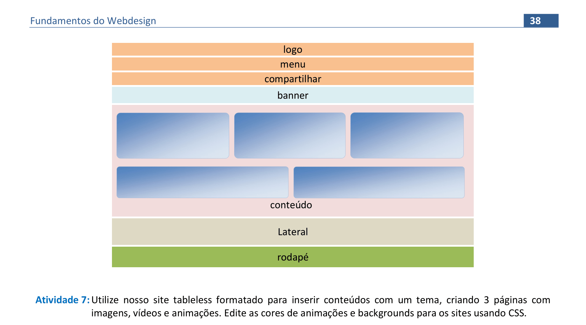
	

&#x1f4c3; Detalhes finais e animações

	
Vamos criar efeitos de galeria na nossa página de filmes. Coloque os nomes dos filmes nos itens do menu.

	  <ul class="slider">
		  <li>
			   <input type="radio" id="256" name="sl">
			   <label for="256"></label>
			   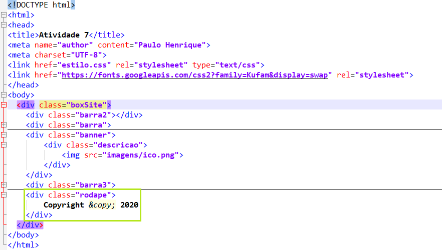
			   <figcaption>A estrutura final do HTML, com itens anteriores recolhidos, fica desta maneira: dentro de <code>boxSite</code> temos <code>barra2</code>,  <code>barra</code>, <code>banner</code>, <code>barra3</code> e <code>rodape</code>.</figcaption>
		   </li>
		   <li>
			   <input type="radio" id="257" name="sl">
			   <label for="257"></label>
			   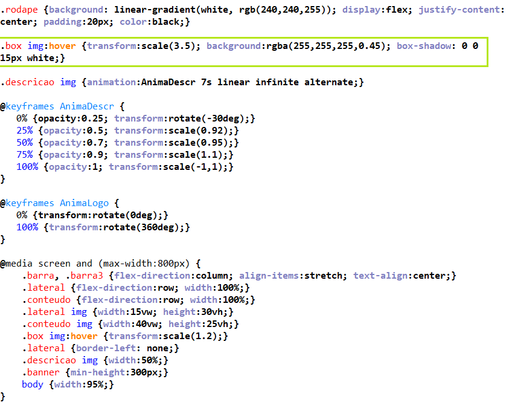
			   <figcaption>No CSS, podemos criar efeitos com transformações de escala, cisalhamento, rotação ou translação. Neste exemplo usamos uma escala com sombra nas imagens das tags <code>.box</code> quando passamos o cursor do mouse sobre as respectivas imagens.</figcaption>
		   </li>
		   <li>
			   <input type="radio" id="258" name="sl">
			   <label for="258"></label>
			   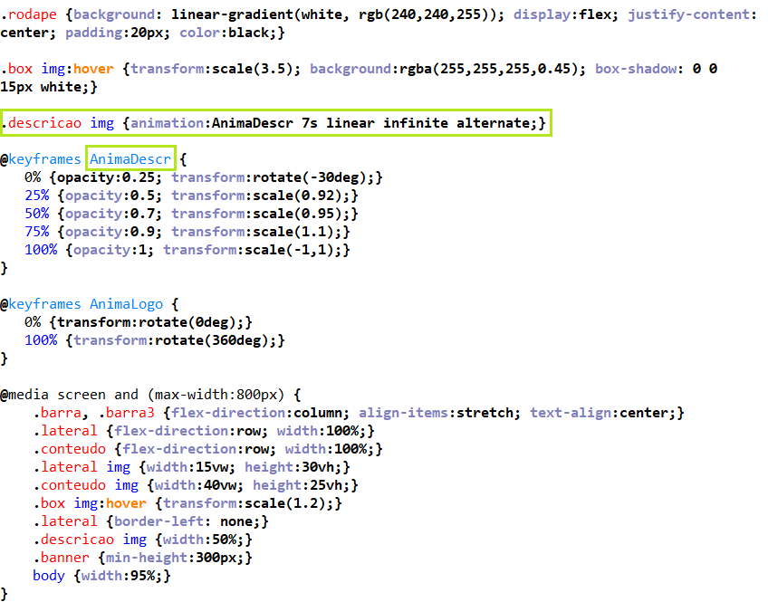
			   <figcaption>Uma animação na logomarca de descrição do site que usa rotação e escalas está atribuída com nome <code>@keyframes AnimaDescr</code>. Dentro da tag <code>.descricao img</code> colocamos a duração de 7 segundos com alternância e duração constante.</figcaption>
		   </li>
		   <li>
			   <input type="radio" id="259" name="sl">
			   <label for="259"></label>
			   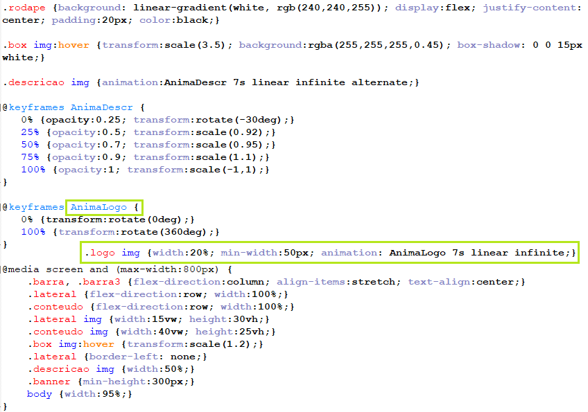
			   <figcaption>A logomarca de filme, com formato redondo é ótima para usarmos a rotação de 0 a 360&deg;. Na tag <code>.logo img</code> colocamos o nome desta animação <code>AnimaLogo</code> com 7 segundos também. Ajuste valores e efeitos nas imagens de sua página.</figcaption>
		   </li>
		   <li>
			   <input type="radio" id="260" name="sl">
			   <label for="260"></label>
			   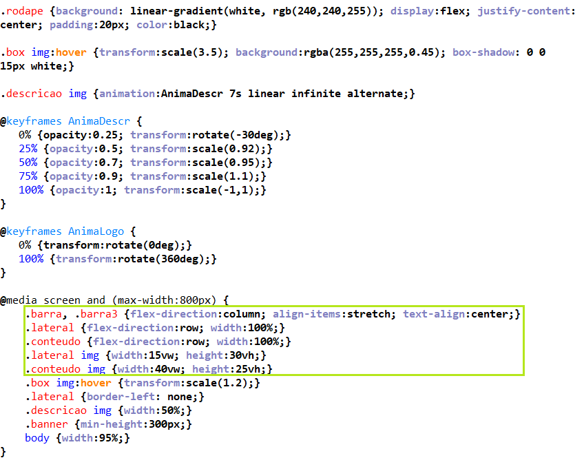
			   <figcaption>Em telas de larguras menores do que 800px, ajustamos as barras flexbox com visualização em coluna, larguras de 100% e alinhamentos centralizados. As imagens das barras de conteúdo e lateral também podem ser redimensionadas para telas menores. Faça testes ajustanto a tela do seu navegador para escolher os melhores valores para as imagens de sua página.</figcaption>
		   </li>
		   <li>
			   <input type="radio" id="261" name="sl">
			   <label for="261"></label>
			   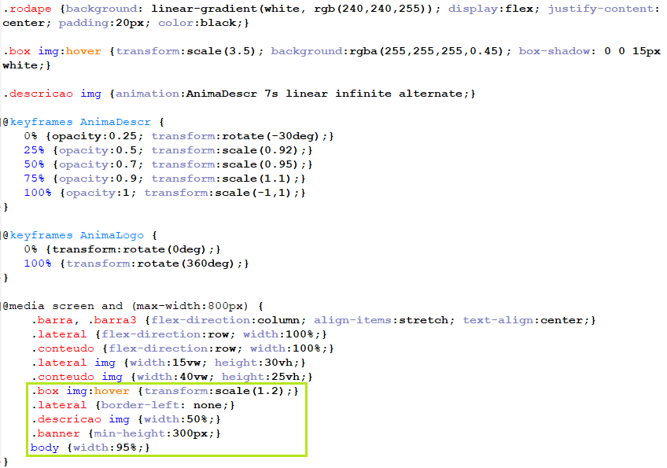
			   <figcaption>Os efeitos de transformação, bordas laterais e a imagem da descrição do site também podem ficar com valores ajustados para telas menores. O tamanho do banner pode ser reduzido, assim como a largura da imagem de descrição da página.</figcaption>
		   </li>
		   <li>
			   <input type="radio" id="262" name="sl">
			   <label for="262"></label>
			   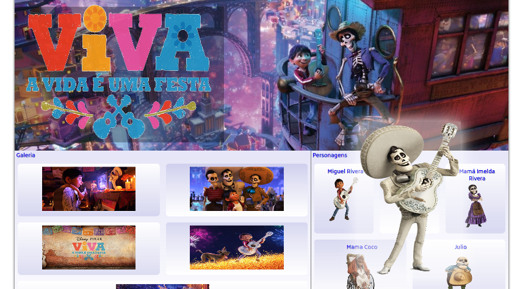
			   <figcaption>Ao passar o cursor do mouse por cima de cada imagem das tags <code>.box</code>, o efeito do layout fica desta maneira.</figcaption>
		   </li>
		   <li>
			   <input type="radio" id="263" name="sl">
			   <label for="263"></label>
			   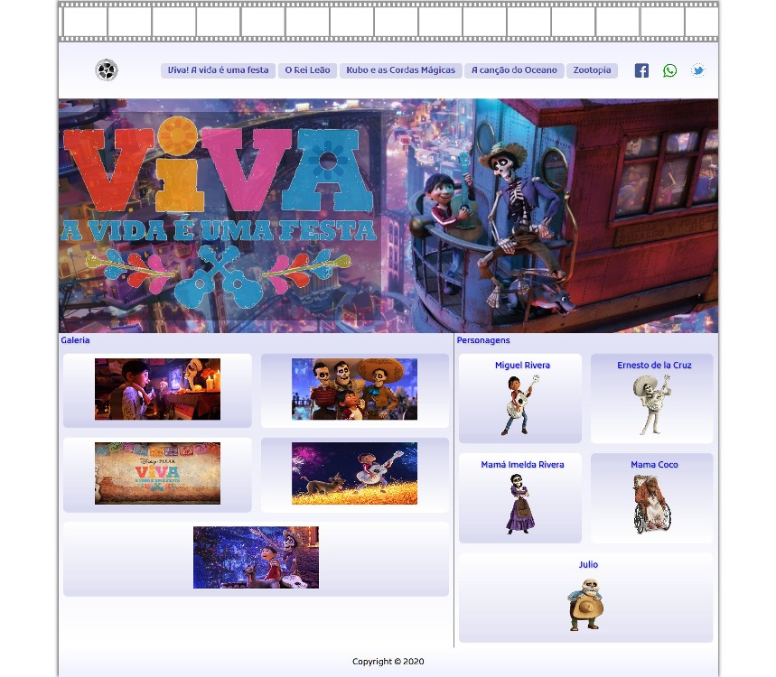
			   <figcaption>Com os valores e atributos mostrados, a página da Atividade 7 fica com este layout. Ajuste os valores, cores e margens para sua página. Coloque os nomes de outros 4 filmes nos itens do menu do site.</figcaption>
		   </li>
		   <li>
			   <input type="radio" id="263e" name="sl">
			   <label for="263e"></label>
			   <figcaption>
<button type="button" onclick="copyEvent('cod98', 'cd98')" onmouseout="outFunc('cd98')">Copiar o código</button>
Trecho CSS com atributos de animações:
<pre><code id="cod98"><a alt="ampliação de imagens da classe box com hover.">.box img:hover</a> {transform:scale(3.5); background:rgba(255,255,255,0.45); box-shadow:0 0 15px white;}

<a alt="animação da classe descrição que fica sobre o banner.">.descricao img</a> {animation:AnimaDescr 7s linear infinite alternate;}

<a alt="animação da descrição: rotação e variação de escala.">@keyframes AnimaDescr { </a>
   0% {opacity:0.25; transform:rotate(-30deg);}
   25% {opacity:0.5; transform:scale(0.92);}
   50% {opacity:0.7; transform:scale(0.95);}
   75% {opacity:0.9; transform:scale(1.1);}
   100% {opacity:1; transform:scale(-1,1);}
}

<a alt="animação de rotação para a logo da página.">@keyframes AnimaLogo { </a>
   0% {transform:rotate(0deg);}
   100% {transform:rotate(360deg);}
}

<a alt="mudanças de layout para telas com larguras menores que 800px.">@media screen and (max-width:800px) {</a>
	.barra, .barra3 {flex-direction:column; align-items:stretch; text-align:center;}
	.lateral {flex-direction:row; width:100%;}
	.conteudo {flex-direction:row; width:100%;}
	.lateral img {width:15vw; height:30vh;}
	.conteudo img {width:40vw; height:25vh;}
	.box img:hover {transform:scale(1.2);}
	.lateral {border-left: none;}
	.descricao img {width:50%;}
	.banner {min-height:300px;}
	body {width:95%;}
}</code></pre></figcaption>
		   </li>
		   <li>
			   <input type="radio" id="263a" name="sl">
			   <label for="263a"></label>
			   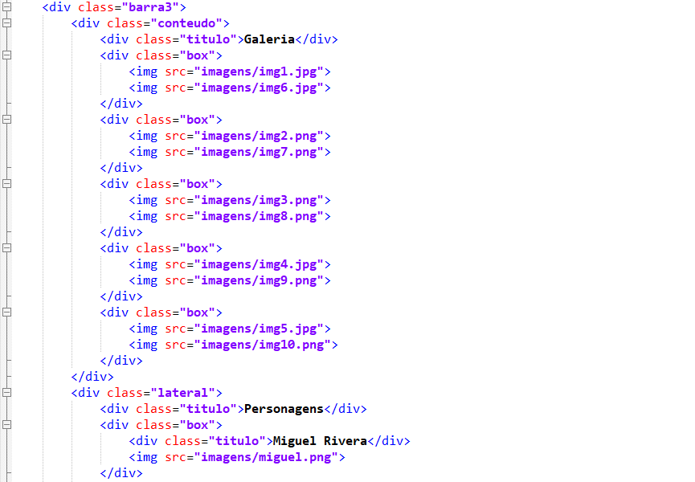
			   <figcaption>Podemos modificar o efeito ao passar o cursor do mouse sobre cada imagem da galeria. Um efeito interessante é o que muda de imagem ao passar o cursor sobre a foto.</figcaption>
		   </li>
		   <li>
			   <input type="radio" id="263d" name="sl">
			   <label for="263d"></label>
			   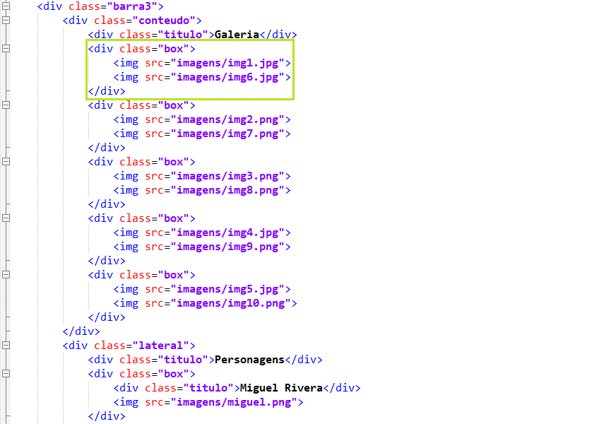
			   <figcaption>Para isso acontecer, no HTML você modifica cada tag <code>class="box"</code> inserindo 2 imagens: a primeira aparece automaticamente, e a segunda apenas quando o visitante passar o cursor do mouse sobre a <code>class="box"</code>.</figcaption>
		   </li>
		   <li>
			   <input type="radio" id="263b" name="sl">
			   <label for="263b"></label>
			   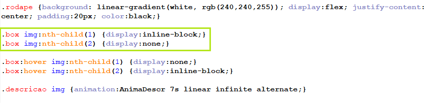
			   <figcaption>No arquivo CSS, você precisa substituir os atributos de <code>.box img:hover</code> pelas regras: <code>.box img:nth-child(1)</code> que mostra a primeira imagem da tag <code>class="box"</code>, e <code>.box img:nth-child(2)</code> que esconde a segunda imagem da tag <code>class="box"</code>.</figcaption>
		   </li>
		   <li>
			   <input type="radio" id="263c" name="sl">
			   <label for="263c"></label>
			   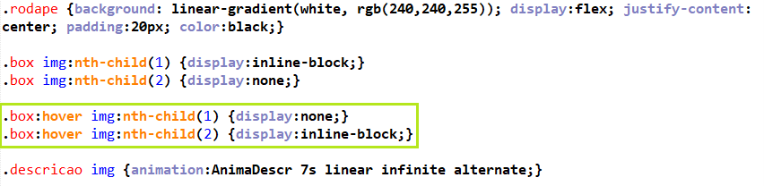
			   <figcaption>Outras regras que criamos são as seguintes: <code>.box:hover img:nth-child(1)</code> que esconde a primeira imagem da tag <code>class="box"</code> quando passamos o cursor do mouse sobre a imagem, e <code>.box:hover img:nth-child(2)</code> que mostra a segunda imagem da <code>class="box"</code> quando passamos o cursor do mouse sobre a imagem da <code>class="box"</code>.</figcaption>
		   </li>
		</ul>
		
  

	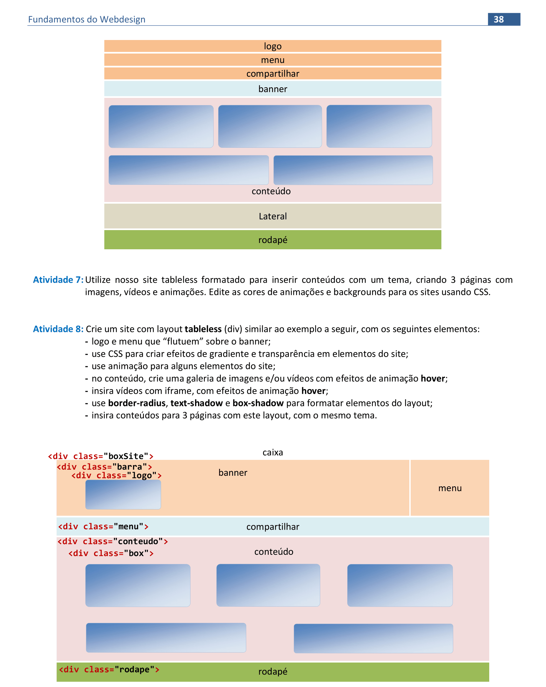
	
<a href="#css3" class="topo">voltar ao topo</a>

	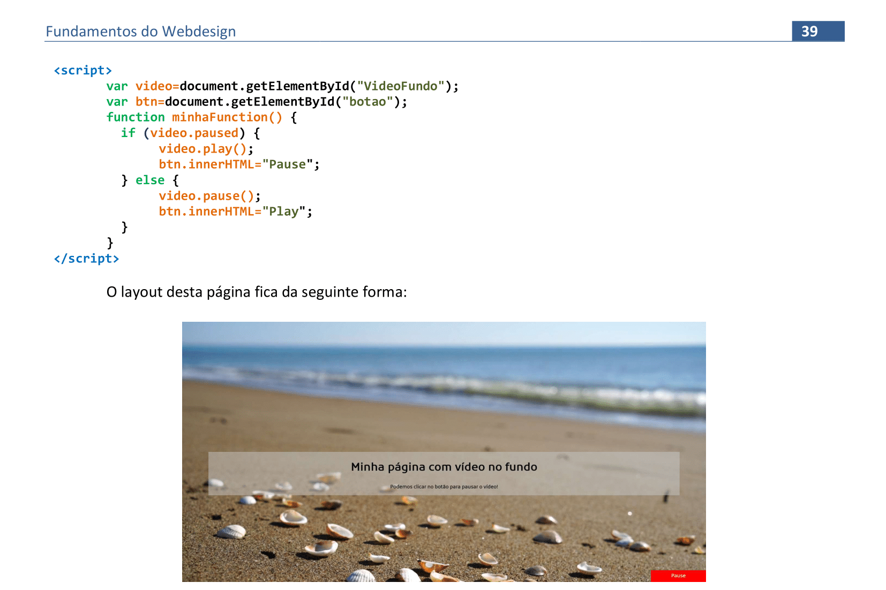
	

&#x1f4c3; Página com vídeo no fundo

	
Crie uma pasta chamada <code>webdesign/paginaVideo</code> e escolha um vídeo com curta duração em formato mp4 para colocarmos no background.

	  <ul class="slider">
		  <li>
			   <input type="radio" id="264a" name="sl">
			   <label for="264a"></label>
			   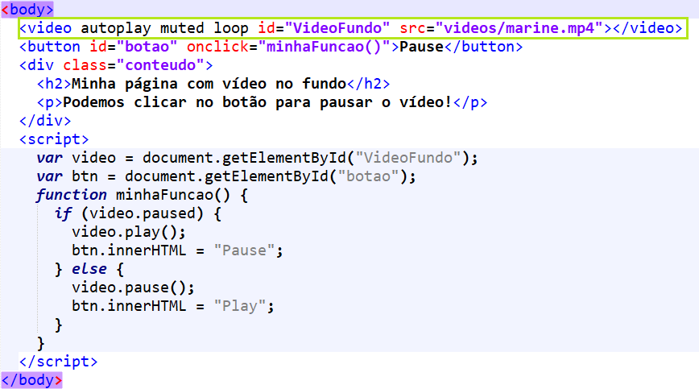
			   <figcaption>Insira a tag de vídeo com id <code>#VideoFundo</code> com as opções loop, autoplay e muted.</figcaption>
		   </li>
		   <li>
			   <input type="radio" id="265a" name="sl">
			   <label for="265a"></label>
			   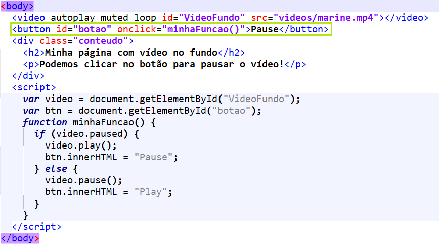
			   <figcaption>O botão de interação deve ter a ligação com a função javascript com nome <code>minhaFuncao()</code> e com id <code>#botao</code>.</figcaption>
		   </li>
		   <li>
			   <input type="radio" id="266a" name="sl">
			   <label for="266a"></label>
			   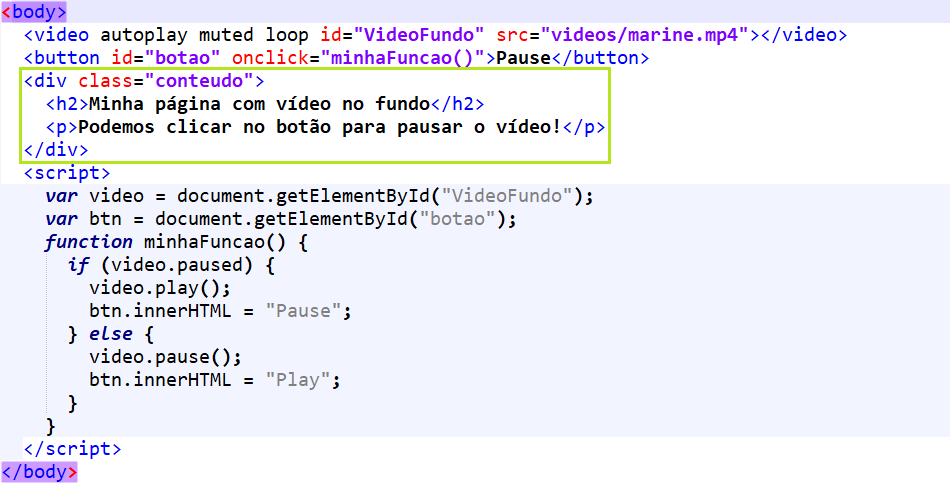
			   <figcaption>Insira uma tag de conteúdo para aparecer sobre o vídeo.</figcaption>
		   </li>
		   <li>
			   <input type="radio" id="267a" name="sl">
			   <label for="267a"></label>
			   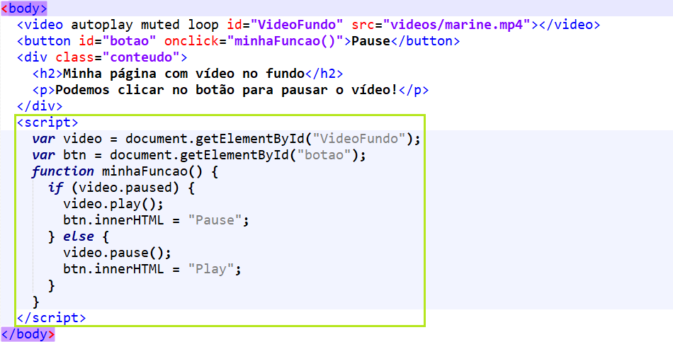
			   <figcaption>A função javascript deve ficar dentro da tag <code>body</code>, pausando o vídeo quando o vídeo estiver sendo tocado (play) e tocando o vídeo (play) quando o vídeo estiver pausado.</figcaption>
		   </li>
		   <li>
			   <input type="radio" id="268a" name="sl">
			   <label for="268a"></label>
			   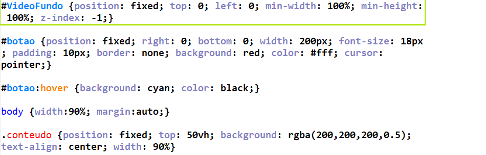
			   <figcaption>No arquivo css, inserimos o vídeo de fundo fixo, ocupando toda a tela do navegador, com z-index negativo: assim, o resto do conteúdo ficará visível sobre o vídeo.</figcaption>
		   </li>
		   <li>
			   <input type="radio" id="269a" name="sl">
			   <label for="269a"></label>
			   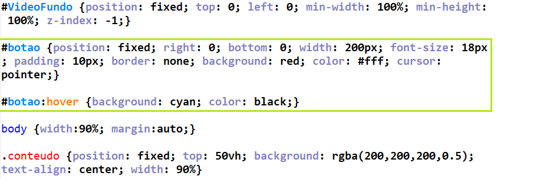
			   <figcaption>Escolha uma posição e as configurações do botão de interação.</figcaption>
		   </li>
		   <li>
			   <input type="radio" id="270a" name="sl">
			   <label for="270a"></label>
			   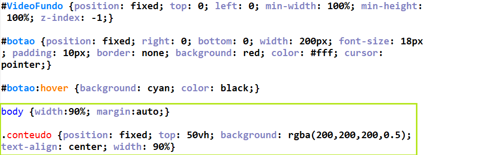
			   <figcaption>O conteúdo pode ficar em uma posição fixa, sobre o vídeo da página.</figcaption>
		   </li>
		   <li>
			   <input type="radio" id="271b" name="sl">
			   <label for="271b"></label>
			   <figcaption>
<button type="button" onclick="copyEvent('cod99', 'cd99')" onmouseout="outFunc('cd99')">Copiar o código</button>
Trecho da estrutura HTML:
<pre><code id="cod99">&lt;body&gt;
  <a alt="tag do vídeo com autoplay, muted e loop ativados.">&lt;video autoplay muted loop id="VideoFundo" src="videos/marine.mp4"&gt;&lt;/video&gt;</a>
  <a alt="botão de interação do vídeo.">&lt;button id="botao" onclick="minhaFuncao()"&gt;Pause&lt;/button&gt;</a>
  <a alt="conteúdo da página">&lt;div class="conteudo"&gt;</a>
	&lt;h2&gt;Minha página com vídeo no fundo&lt;/h2&gt;
	&lt;p&gt;Podemos clicar no botão para pausar o vídeo!&lt;/p&gt;
  &lt;/div&gt;
  <a alt="função de interação do vídeo com o usuário">&lt;script&gt;</a>
	var video = document.getElementById("VideoFundo");
	var btn = document.getElementById("botao");
	function minhaFuncao() {
	  if (video.paused) {
		video.play();
		btn.innerHTML = "Pause";
	  } else {
		video.pause();
		btn.innerHTML = "Play";
	  }
	}
  &lt;/script&gt; 
&lt;/body&gt;</code></pre></figcaption>
		   </li>
		   <li>
			   <input type="radio" id="271c" name="sl">
			   <label for="271c"></label>
			   <figcaption>
<button type="button" onclick="copyEvent('cod100', 'cd100')" onmouseout="outFunc('cd100')">Copiar o código</button>
Trecho da estrutura CSS:
<pre><code id="cod100"><a alt="posição, largura e altura do vídeo de fundo da página.">#VideoFundo</a> {position:fixed; top:0; left:0; min-width:100%; min-height:100%; z-index:-1;}

<a alt="posição e propriedades do botão de interação.">#botao</a> {position:fixed; right:0; bottom:0; width:200px; font-size:18px; padding:10px; border:none; 
background:red; color:#fff; cursor:pointer;}

#botao:hover {background:cyan; color:black;} 

body {width:100%; margin:auto;}

<a alt="propriedades do conteúdo.">.conteudo</a> {position:fixed; top:50vh; background:rgba(200,200,200,0.5); text-align:center; width:90%}
 </code></pre></figcaption>
		   </li>
		</ul>
		
  

	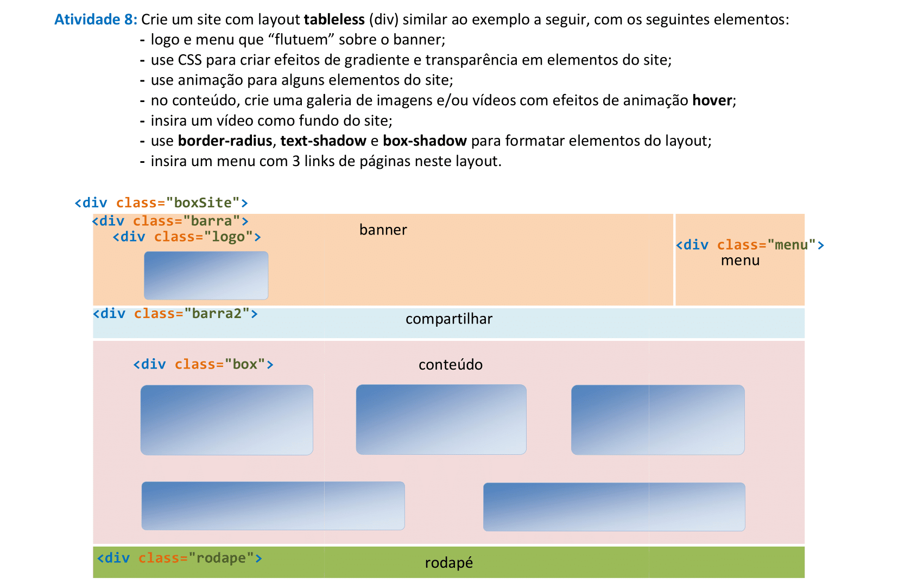
	

&#x1f4c3; Detalhes da estrutura em HTML

	
Esta página tem estrutura HTML parecida com a que montamos na página da Atividade 7. Crie uma pasta chamada <code>webdesign/atividade8</code> com a página inicial <code>index.htm</code>. Vamos precisar também das pastas<code>webdesign/atividade8/imagens</code> e <code>webdesign/atividade8/videos</code>.

	  <ul class="slider">
		  <li>
			   <input type="radio" id="264" name="sl">
			   <label for="264"></label>
			   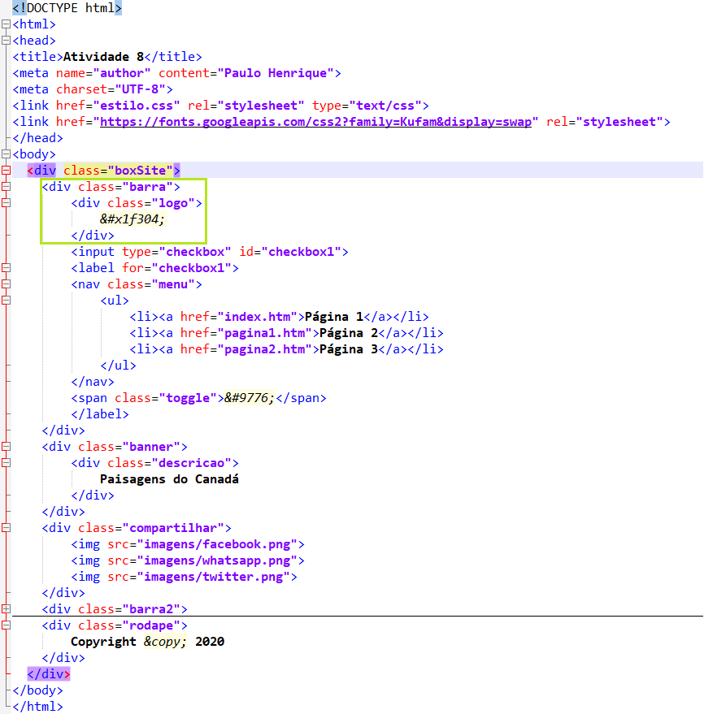
			   <figcaption>A tag "mãe" do site será <code>class="boxSite"</code>, com a barra de menu <code>class="barra"</code>, onde colocaremos uma logo. Vamos fazer uma página de algum lugar com belas paisagens. Escolha um vídeo para inserir no fundo da página na pasta <code>videos/"</code>.</figcaption>
		   </li>
		   <li>
			   <input type="radio" id="265" name="sl">
			   <label for="265"></label>
			   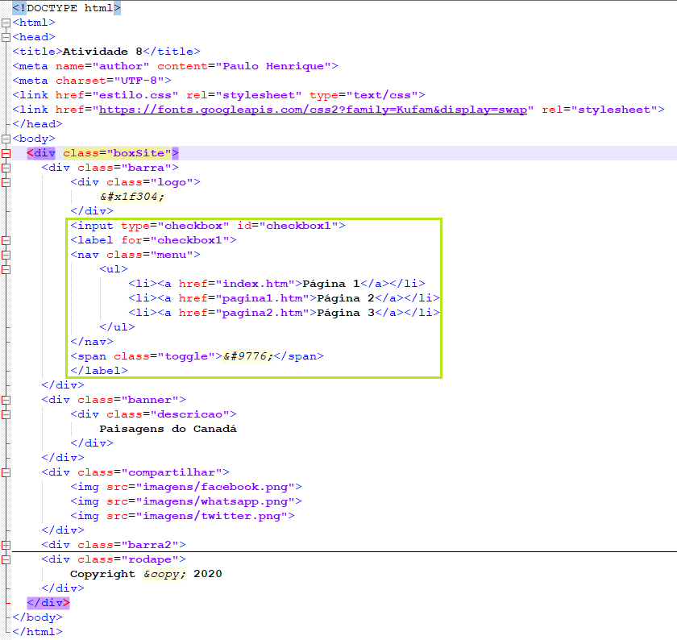
			   <figcaption>Escolha um <a href="http://www.degraf.ufpr.br/docentes/paulo/webdesign/pictograph.html" target="_blank">pictograma</a> ou coloque uma imagem na tag <code>class="logo"</code>.</figcaption>
		   </li>
		   <li>
			   <input type="radio" id="266" name="sl">
			   <label for="266"></label>
			   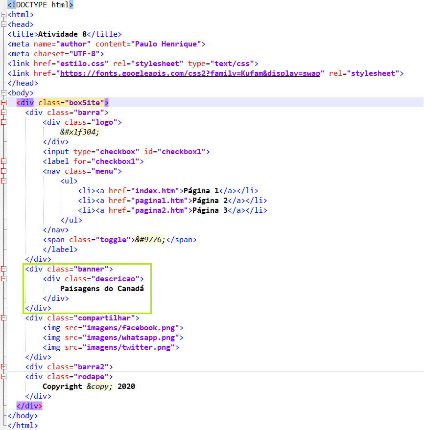
			   <figcaption>A estrutura de menu será a mesma que usamos na atividade anterior. Alguns atributos CSS ficarão diferentes, pois a tag <code>&lt;label&gt;</code> está englobando os itens do menu.</figcaption>
		   </li>
		   <li>
			   <input type="radio" id="267" name="sl">
			   <label for="267"></label>
			   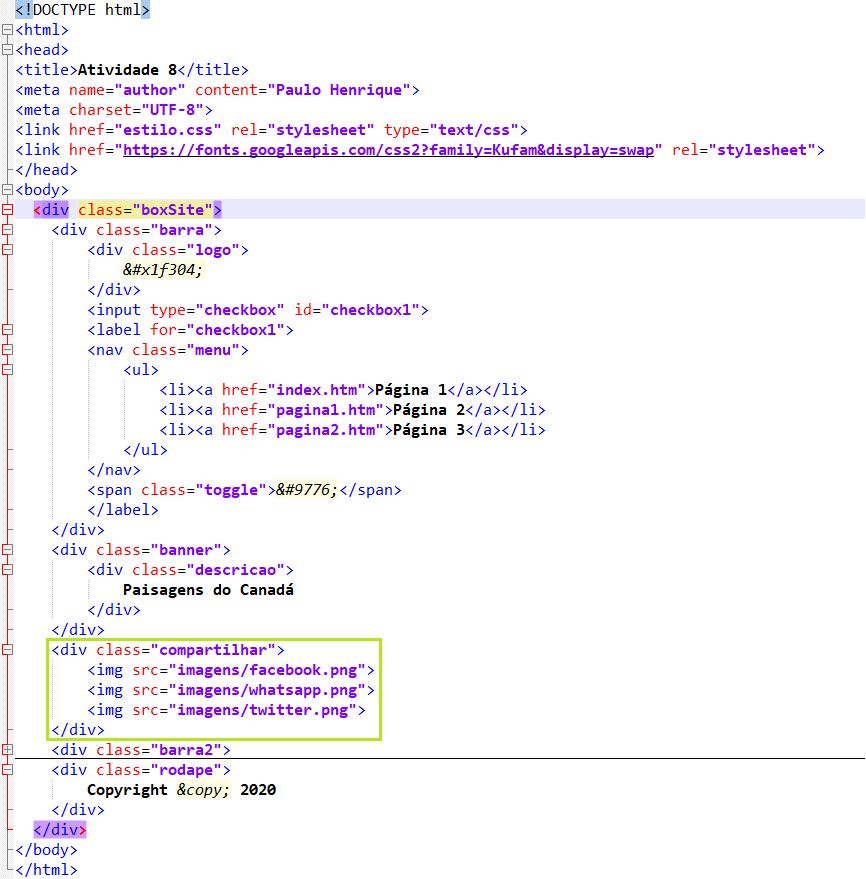
			   <figcaption>Depois da tag <code>class="barra"</code>, podemos inserir a <code>class="banner"</code>, que contém a <code>class="descricao"</code>. Neste caso, coloque um texto ou uma imagem para ser o título da página.</figcaption>
		   </li>
		   <li>
			   <input type="radio" id="268" name="sl">
			   <label for="268"></label>
			   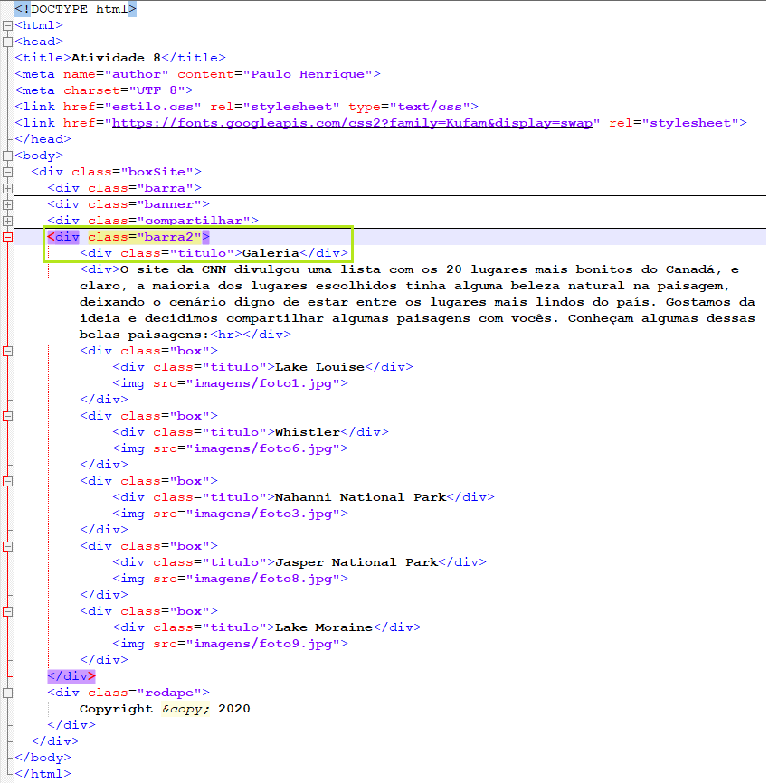
			   <figcaption>A barra <code>class="compartilhar"</code> pode ser inserida na tag <code>class="barra2"</code>, junto com a galeria de imagens. Insira links para os itens desta barra de compartilhamento.</figcaption>
		   </li>
		   <li>
			   <input type="radio" id="269" name="sl">
			   <label for="269"></label>
			   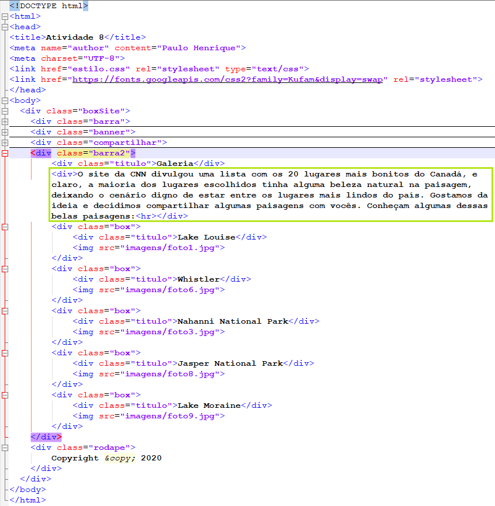
			   <figcaption>Depois da barra <code>class="compartilhar"</code>, podemos criar a galeria de imagens das paisagens que vamos inserir. Insira o texto sobre o local escolhido em uma <code>&lt;div&gt;</code>, pois vamos distribuir os conteúdos usando <code>display:flex;</code> no CSS.</figcaption>
		   </li>
		   <li>
			   <input type="radio" id="270" name="sl">
			   <label for="270"></label>
			   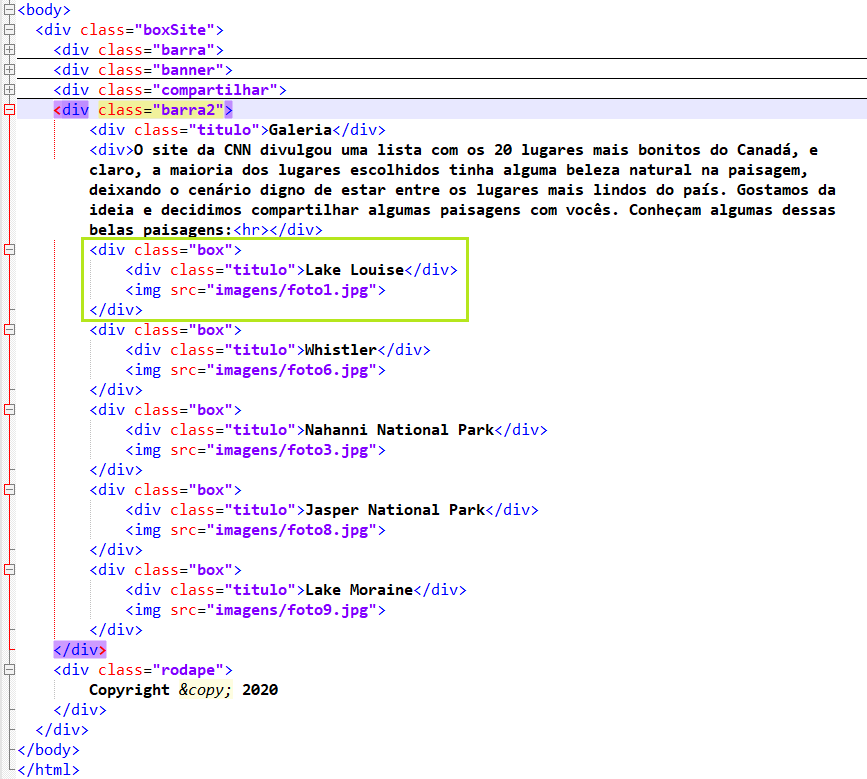
			   <figcaption>Crie títulos para cada imagem colocada em tag <code>class="box"</code>. Este título pode ficar antes ou depois da imagem.</figcaption>
		   </li>
		   <li>
			   <input type="radio" id="271" name="sl">
			   <label for="271"></label>
			   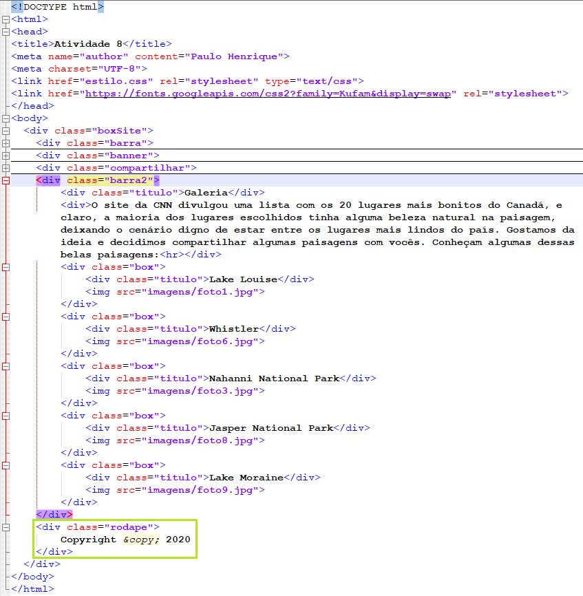
			   <figcaption>Finalizamos o layout da página com a tag mais simples de nossas páginas: o rodapé. Logo após a tag <code>class=boxSite</code> podemos inserir a função javascript do botão de interação do vídeo de fundo.</figcaption>
		   </li>
		   <li>
			   <input type="radio" id="271a" name="sl">
			   <label for="271a"></label>
			   <figcaption>
<button type="button" onclick="copyEvent('cod101', 'cd101')" onmouseout="outFunc('cd101')">Copiar o código</button>
Trecho da estrutura HTML da Atividade 8:
<pre><code id="cod101">&lt;body&gt;
	<a alt="tag mãe da página">&lt;div class="boxSite"&gt;</a>
		<a alt="tag do vídeo de fundo da página">&lt;video autoplay muted loop id="VideoFundo" src="videos/mountain.mp4"&gt;&lt;/video&gt;</a>
		<a alt="tag do botão de interação com o usuário">&lt;button id="botao" onclick="minhaFuncao()"&gt;Pause&lt;/button&gt;</a>
		<a alt="primeira barra de conteúdo com logo e menu">&lt;div class="barra"&gt;</a>
			<a alt="tag de logo da página">&lt;div class="logo"&gt;</a>
				&amp;#x1f304;
			&lt;/div&gt;
			<a alt="tag completa de menu, parecida com a que usamos na Atividade 7">&lt;input type="checkbox" id="checkbox1"&gt;</a>
			&lt;label for="checkbox1"&gt;
				&lt;nav class="menu"&gt;
					&lt;ul&gt;
						&lt;li&gt;&lt;a href="index.htm"&gt;Página 1&lt;/a&gt;&lt;/li&gt;
						&lt;li&gt;&lt;a href="pagina1.htm"&gt;Página 2&lt;/a&gt;&lt;/li&gt;
						&lt;li&gt;&lt;a href="pagina2.htm"&gt;Página 3&lt;/a&gt;&lt;/li&gt;
					&lt;/ul&gt;
				&lt;/nav&gt;
				&lt;span class="toggle"&gt;&#9776;&lt;/span&gt;
			&lt;/label&gt;	
		&lt;/div&gt;
		<a alt="tag do banner da página">&lt;div class="banner"&gt;</a>
			&lt;div class="descricao"&gt;
				Paisagens do Canadá
			&lt;/div&gt;
		&lt;/div&gt;
		<a alt="barra de conteúdo de compartilhamento e galeria de imagens">&lt;div class="barra2"&gt;</a>
			&lt;div class="compartilhar"&gt;
				&lt;a href="#"&gt;&lt;img src="imagens/facebook.png"&gt;&lt;/a&gt;
				&lt;a href="#"&gt;&lt;img src="imagens/whatsapp.png"&gt;&lt;/a&gt;
				&lt;a href="#"&gt;&lt;img src="imagens/twitter.png"&gt;&lt;/a&gt; 
			&lt;/div&gt;
			&lt;div class="titulo"&gt;Galeria&lt;/div&gt;
			&lt;div&gt;O site da CNN divulgou uma lista com os 20 lugares mais ...&lt;/div&gt;
			<a alt="box com uma das imagens da galeria">&lt;div class="box"&gt;</a>
				&lt;div class="titulo"&gt;Lake Louise&lt;/div&gt;
				&lt;img src="imagens/foto1.jpg"&gt;
			&lt;/div&gt;
			&lt;div class="box"&gt;
				&lt;div class="titulo"&gt;Whistler&lt;/div&gt;
				&lt;img src="imagens/foto6.jpg"&gt;
			&lt;/div&gt;
		&lt;/div&gt;
		&lt;div class="rodape"&gt;
			Copyright &copy; 2022
		&lt;/div&gt;
	&lt;/div&gt;
	<a alt="função de interação do vídeo com o usuário">&lt;script&gt;</a>
		var video = document.getElementById("VideoFundo");
		var btn = document.getElementById("botao");
			function minhaFuncao() {
			if (video.paused) {
				video.play();
				btn.innerHTML = "Pause";
			} else {
				video.pause();
				btn.innerHTML = "Play";
			}
		}
	&lt;/script&gt; 
&lt;/body&gt;</code></pre></figcaption>
		   </li>
		</ul>
		
  

  

&#x1f4c3; Detalhes da estrutura em CSS

	
A estrutura CSS desta página fica um pouco mais simplificada em relação à Atividade 7. Crie o arquivo de folha de estilos na pasta <code>webdesign/atividade8</code> com nome <code>estilo.css</code>.

	  <ul class="slider">
		  <li>
			   <input type="radio" id="272" name="sl">
			   <label for="272"></label>
			   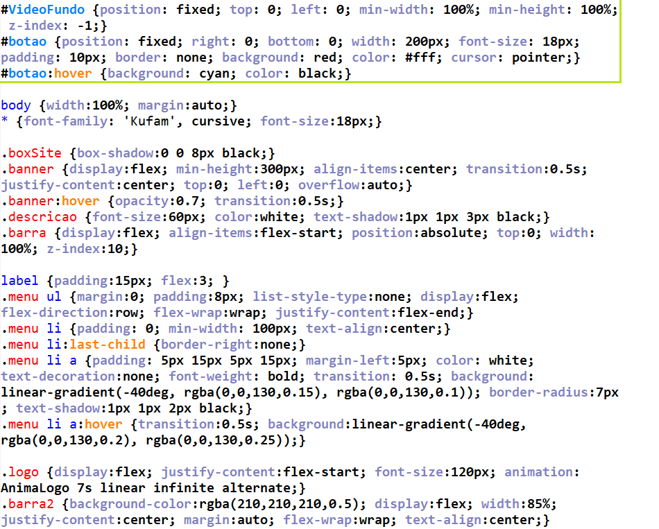
			   <figcaption>Podemos usar os mesmos atritutos usados da página com fundo de vídeo para os elementos inseridos no HTML: <code>#VideoFundo</code> e <code>#botao</code>.</figcaption>
		   </li>
		   <li>
			   <input type="radio" id="272z" name="sl">
			   <label for="272z"></label>
			   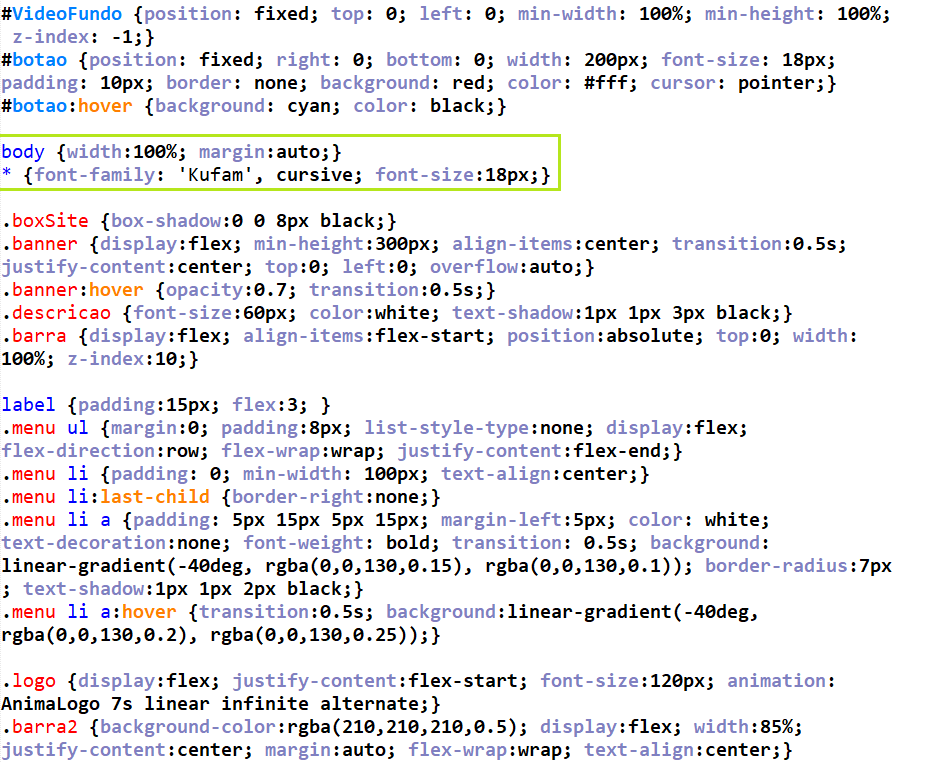
			   <figcaption>Escolha a fonte do site <b>google fonts</b> e defina os elementos genéricos da página com o indicar <b>*</b>.</figcaption>
		   </li>
		   <li>
			   <input type="radio" id="273" name="sl">
			   <label for="273"></label>
			   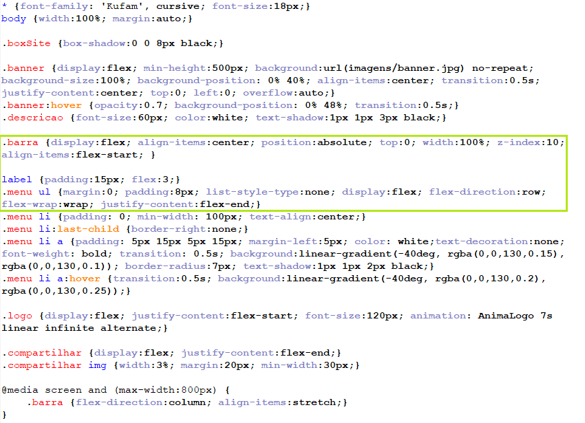
			   <figcaption>Defina altura mínima do banner, posição, alinhamentos e efeitos com <code>hover</code>. Nesta página, vamos usar o atributo <code>overflow:auto;</code> que permite sobreposições de elementos. Defina um valor grande para o <code>z-index</code> para deixar a barra de menu sobre o banner. Para deixá-la alinhada na vertical, usamos <code>align-items:flex-start;</code>.</figcaption>
		   </li>
		   <li>
			   <input type="radio" id="274" name="sl">
			   <label for="274"></label>
			   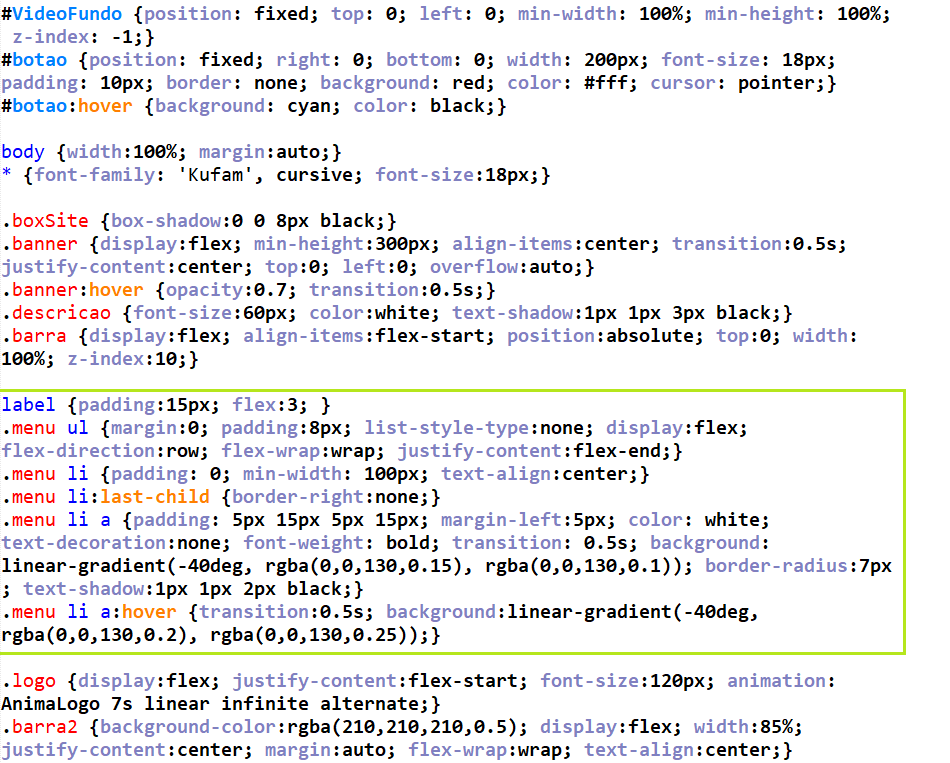
			   <figcaption>A tag <code>label</code> é "mãe" do menu: logo, definimos margem e tamanho <code>flex:3;</code> nesta tag. Para deixar o menu alinhado à direita, basta usar <code>justify-content:flex-end;</code>. Os itens do menu têm estrutura de programação CSS parecida com a que usamos na atividade 7. Escolha cores adequadas para ter um contraste com a imagem de fundo do banner. Neste caso, foi escolhida a cor branca com sombra de texto <code>text-shadow</code>.</figcaption>
		   </li>
		   <li>
			   <input type="radio" id="275" name="sl">
			   <label for="275"></label>
			   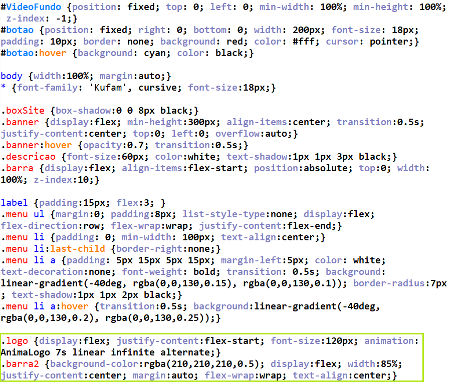
			   <figcaption>Para alinhar a <code>.logo</code> à esquerda usamos <code>justify-content:flex-start;</code>. Neste exemplo vamos utilizar um pictograma: logo, definimos <code>font-size</code> com tamanho maior do que o usual. A animação será a mesma da página da atividade anterior. Vamos usar a largura da <code>barra2</code> com 85%.</figcaption>
		   </li>
		   <li>
			   <input type="radio" id="276" name="sl">
			   <label for="276"></label>
			   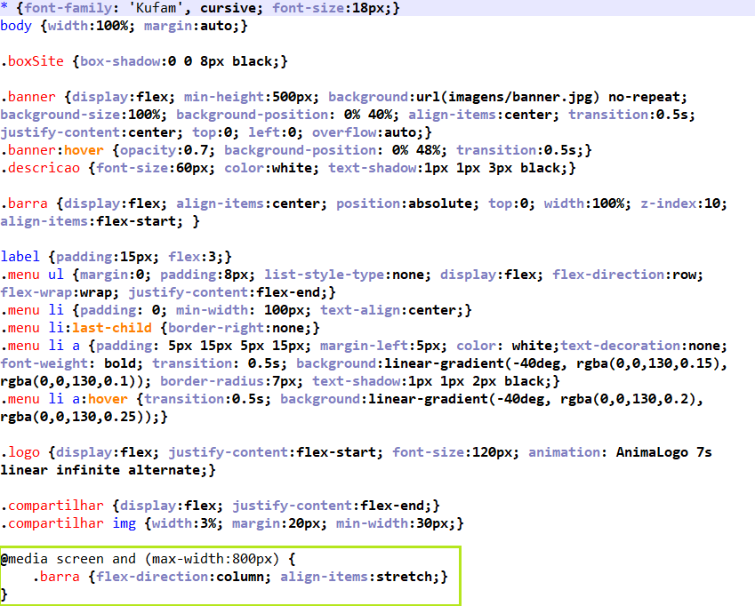
			   <figcaption>A barra de compartilhamento pode ter os valores ajustados de acordo com as dimensões das imagens.</figcaption>
		   </li>
		   <li>
			   <input type="radio" id="277" name="sl">
			   <label for="277"></label>
			   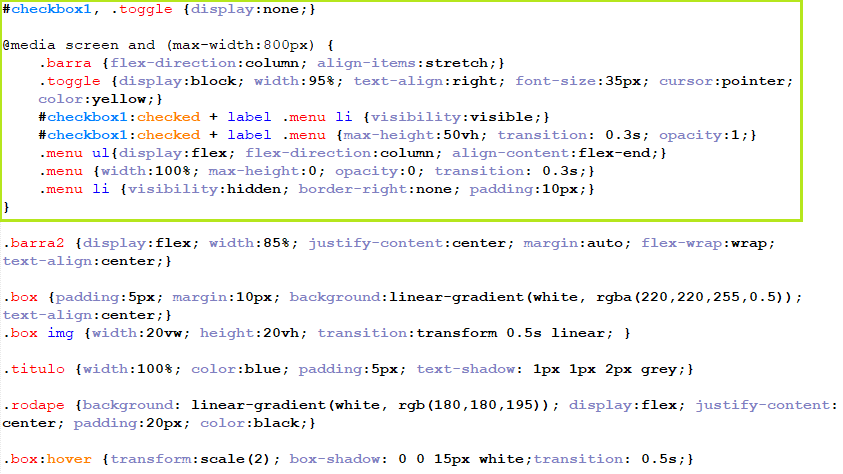
			   <figcaption>Os atributos da <code>.barra2</code> e dos <code>.box</code> são similares aos que usamos na atividade anterior. O efeito de transformação de imagens que usamos na atividade anterior pode ser usado nos <code>.box</code>. Assim, as imagens são ampliadas com os títulos, como se fossem legendas. </figcaption>
		   </li>
		   <li>
			   <input type="radio" id="278" name="sl">
			   <label for="278"></label>
			   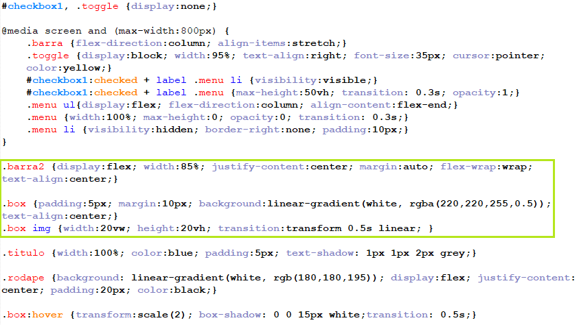
			   <figcaption>Ajuste os valores de todos os elementos programados para visualizar tanto em um navegador com mais e com menos de 800px de largura. A tag <code>.barra</code> tem o atributo <code>flex-direction:column;</code> em navegadores com larguras reduzidas. </figcaption>
		   </li>
		   <li>
			   <input type="radio" id="279" name="sl">
			   <label for="279"></label>
			   
			   <figcaption>Tanto o toggle quando o checkbox ficam invisíveis em telas maiores. Note que nas configurações de telas menores, não temos os subitens. Nesta página o menu é simplificado, com apenas itens principais. .</figcaption>
		   </li>
		   <li>
			   <input type="radio" id="280" name="sl">
			   <label for="280"></label>
			   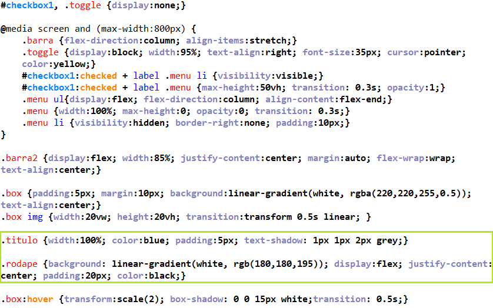
			   <figcaption>Atribua as propriedades para visualização dos títulos e do rodapé da página. Defina as propriedades de animação da tag <code>.logo</code>.</figcaption>
		   </li>
		   <li>
			   <input type="radio" id="281" name="sl">
			   <label for="281"></label>
			   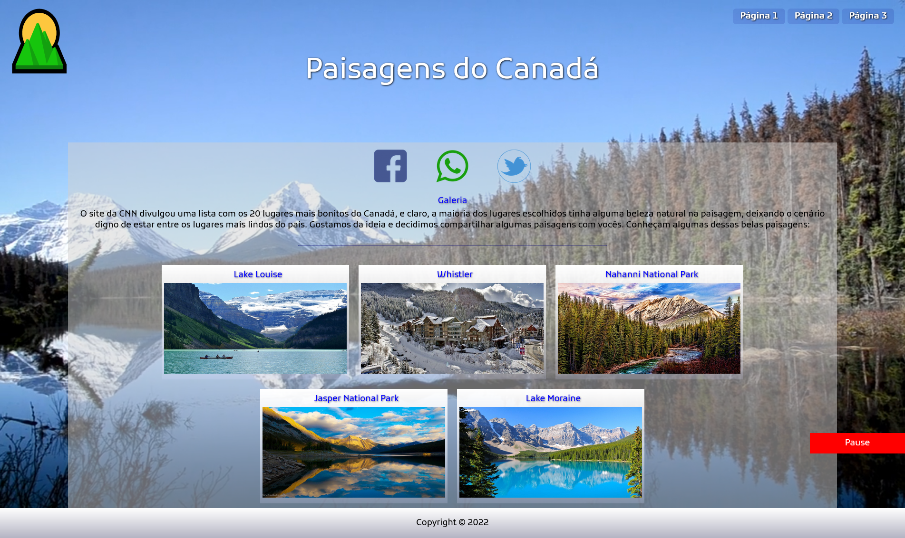
			   <figcaption>O layout da página fica desta maneira. Ajuste os valores e atributos para a finalização desta atividade. Coloque nomes nos títulos das 3 páginas para que apareçam no menu.</figcaption>
		   </li>
		   <li>
			   <input type="radio" id="284a" name="sl">
			   <label for="284a"></label>
			   <figcaption>
<button type="button" onclick="copyEvent('cod102', 'cd102')" onmouseout="outFunc('cd102')">
			   Copiar o código</button>
Trecho da estrutura CSS da Atividade 8:
<pre><code id="cod102"><a alt="propriedades do vídeo de fundo da página">#VideoFundo </a>{position:fixed; top:0; left:0; min-width:100%;	min-height:100%; z-index:-1;}
<a alt="botão de interação com o usuário e o vídeo de fundo">#botao</a> {position:fixed; right:0; bottom:0; width:200px; font-size:18px; padding:10px; border:none; 
background:red; color:#fff; cursor:pointer;}
#botao:hover {background:cyan; color:black;} 

body {width:100%; margin:auto;}
* {font-family:'Kufam', cursive; font-size:18px;}

<a alt="atributos das barras principais da página e do banner">.boxSite</a> {box-shadow:0 0 8px black;}
.banner {display:flex; min-height:300px; align-items:center; transition:0.5s; top:0; left:0;
justify-content:center; overflow:auto;}
.banner:hover {opacity:0.7; transition:0.5s;}
.descricao {font-size:60px; color:white; text-shadow:1px 1px 3px black;}
.barra {display:flex; align-items:flex-start; position:absolute; top:0; width:100%; z-index:10;}

<a alt="propriedades do menu, parecidas com as que já usamos na atividade anterior">label</a> {padding:15px; flex:3; }
.menu ul {margin:0; padding:8px; list-style-type:none; display:flex; flex-direction:row; 
flex-wrap:wrap; justify-content:flex-end;}
.menu li {padding: 0; min-width: 100px; text-align:center;}
.menu li:last-child {border-right:none;}
.menu li a {padding: 5px 15px 5px 15px; margin-left:5px; color: white;text-decoration:none; 
font-weight:bold; background:linear-gradient(-40deg, rgba(0,0,130,0.15), rgba(0,0,130,0.1)); 
transition:0.5s; border-radius:7px; text-shadow:1px 1px 2px black;}
.menu li a:hover {background:linear-gradient(-40deg, rgba(0,0,130,0.2), rgba(0,0,130,0.25));
transition:0.5s;}

<a alt="atributos da logo e barra de galeria">.logo</a> {display:flex; justify-content:flex-start; font-size:120px; 
animation: AnimaLogo 7s linear infinite alternate;}
.barra2 {background-color:rgba(210,210,210,0.5); display:flex; width:85%; justify-content:center; 
margin:auto; flex-wrap:wrap; text-align:center;}

.compartilhar {display:flex;}
.compartilhar img {width:30%; margin:15px; min-width: 70px; max-width:100px;}
#checkbox1, .toggle {display:none;}

<a alt="atributos dos itens da galeria">.box</a> {padding:5px; margin:10px; text-align:center; 
background:linear-gradient(white, rgba(220,220,255,0.2));}
.box img {width:20vw; height:20vh; transition:transform 0.5s linear;}
.box:hover {transform:scale(1.5); box-shadow: 0 0 15px white;transition: 0.5s;}
hr {width:40%; margin: 30px auto; color:rgba(0,0,140,0.3);}

<a alt="atributos dos elementos para aparecerem corretamente em telas menores">@media screen and (max-width:800px) {</a>
	.box img {width:50vw;}
	.box:hover {transform:scale(1.1);}
	.toggle {display:block; width:95%; text-align:right; font-size:35px; 
	cursor:pointer; color:yellow;}
	#checkbox1:checked + label .menu li {visibility:visible;}
	#checkbox1:checked + label .menu {max-height:50vh; transition: 0.3s; opacity:1;}
	.menu ul{display:flex; flex-direction:column; align-content:flex-end;}
	.menu {width:100%; max-height:0; opacity:0; transition: 0.3s;}
	.menu li {visibility:hidden; border-right:none; padding:10px;}
	.barra, .barra2 {flex-direction:column; align-items:stretch; text-align:center; width:100%;}
	.banner {min-height:300px;}
	body {width:95%;}
	.logo {font-size:60px; max-width:60px; justify-content:center;}
	.descricao {font-size:40px;}
}

<a alt="títulos das imagens da galeria">.titulo</a> {width:100%; color:blue; padding:5px; text-shadow: 1px 1px 2px grey;}
.rodape {background:linear-gradient(white, rgb(180,180,195)); display:flex; justify-content:center; 
padding:20px; color:black;}

<a alt="animação da logo da página">@keyframes</a> AnimaLogo { 
   0% {opacity:0.25; transform:rotate(-30deg);}
   25% {opacity:0.5; transform:scale(0.92);}
   50% {opacity:0.7; transform:scale(0.95);}
   75% {opacity:0.9; transform:scale(1.1);}
   100% {opacity:1; transform:scale(-1,1);}
}</code></pre></figcaption>
		   </li>
		</ul>
		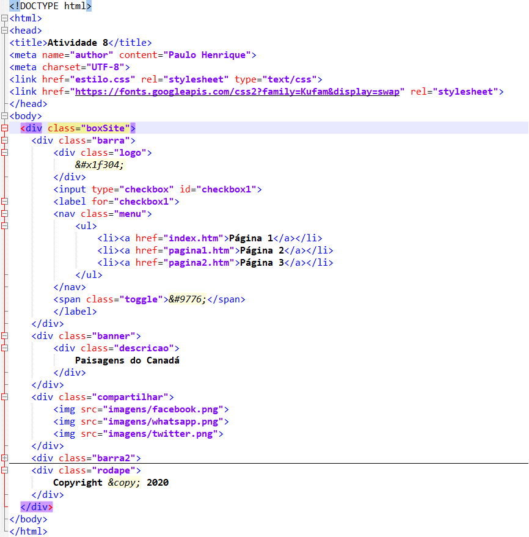
  

	
<a href="#css3" class="topo">voltar ao topo</a>

5. Imagens Vetoriais

	
Material da pág. 40 até a pág. 55

	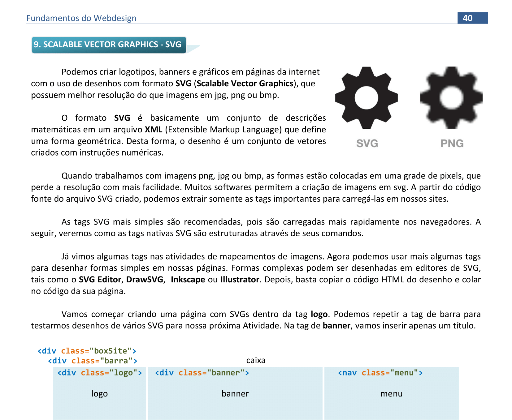
	

&#x1f4c3; Estrutura em HTML e CSS

	
Vamos criar uma pasta chamada <code>webdesign/atividade9</code>. Nesta pasta, crie os arquivos com nomes <code>index.htm</code> e <code>estilo.css</code>. Além disso, vamos criar uma pasta para inserir as imagens dos banners que criaremos na Atividade 9, com o caminho <code>webdesign/atividade9/imagens</code>.

	  <ul class="slider">
		  <li>
			   <input type="radio" id="285" name="sl">
			   <label for="285"></label>
			   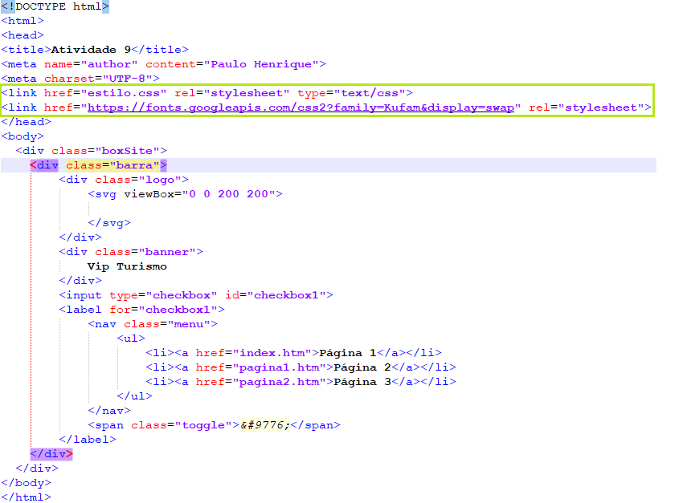
			   <figcaption>No cabeçalho da página, insira as referências de fonte externa e do arquivo <code>estilo.css</code>.</figcaption>
		   </li>
		   <li>
			   <input type="radio" id="286" name="sl">
			   <label for="286"></label>
			   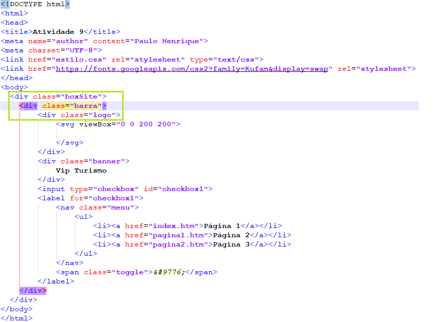
			   <figcaption>A tag mãe do site será <code>class="boxSite"</code>, com as tags que formam um banner dentro da tag <code>class="barra"</code>. Primeiro definimos a <code>class="logo"</code>, onde vamos desenhar algumas logomarcas com SVG.</figcaption>
		   </li>
		   <li>
			   <input type="radio" id="287" name="sl">
			   <label for="287"></label>
			   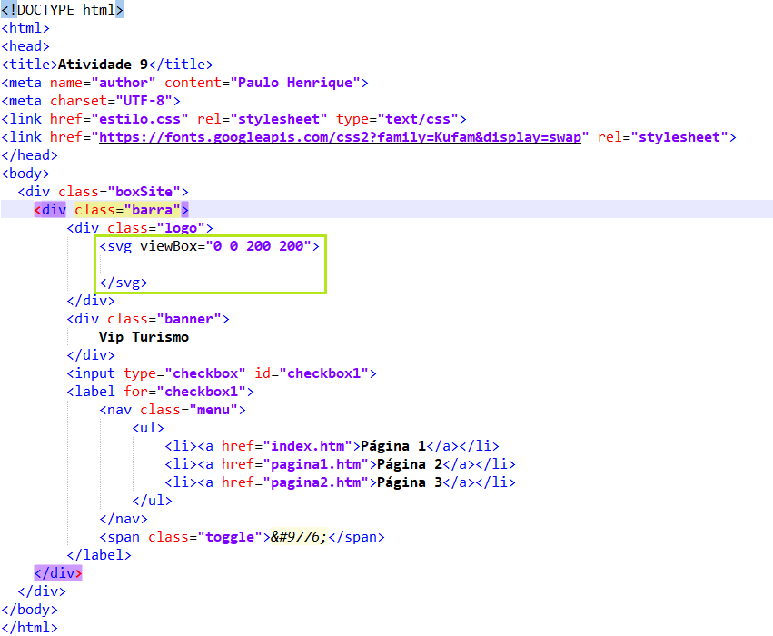
			   <figcaption>Na tag <code>class="logo"</code>, criamos a janela de visualização de desenhos SVG. Vamos criar vários banners, então cada svg ficará em um elemento <code>class="boxSite"</code> diferente. Cada janela de tag <code>&lt;svg&gt;</code> será dimensionada de acordo com o tamanho do desenho que criaremos.</figcaption>
		   </li>
		   <li>
			   <input type="radio" id="288" name="sl">
			   <label for="288"></label>
			   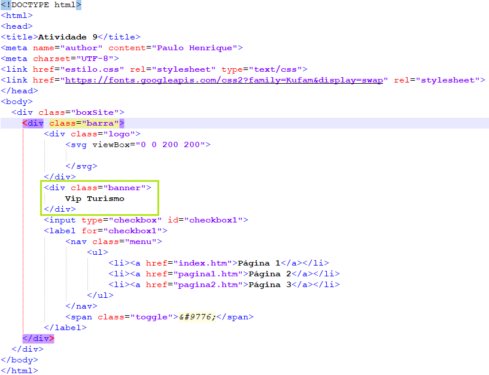
			   <figcaption>Logo após a div de logomarca, criamos a <code>class="banner"</code>, que pode ficar apenas com um título que será formatado no arquivo CSS.</figcaption>
		   </li>
		   <li>
			   <input type="radio" id="289" name="sl">
			   <label for="289"></label>
			   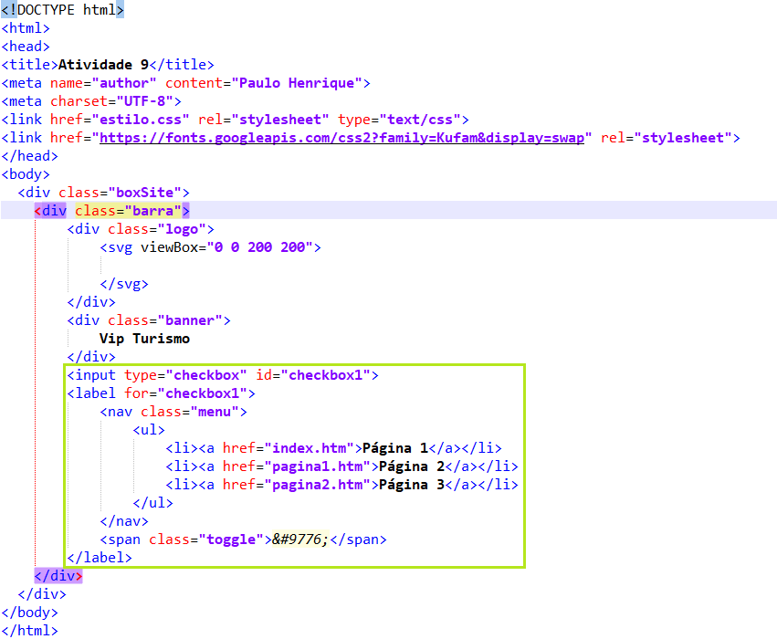
			   <figcaption>Depois do banner, inserimos a estrutura básica de menu que já usamos nas duas últimas atividades. Este menu será usado apenas para visualizarmos os layouts com os desenhos SVG com uma estrutura de menu.</figcaption>
		   </li>
		   <li>
			   <input type="radio" id="290" name="sl">
			   <label for="290"></label>
			   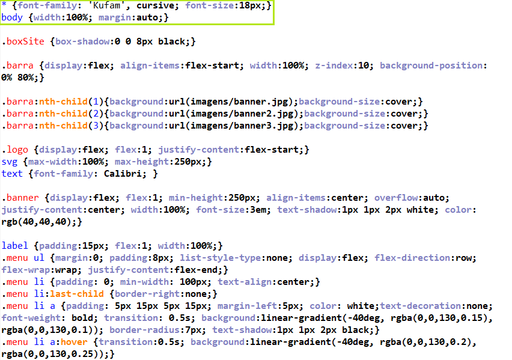
			   <figcaption>No arquivo <code>estilo.css</code>, definimos as tags principais, com fonte e margem automática.</figcaption>
		   </li>
		   <li>
			   <input type="radio" id="291" name="sl">
			   <label for="291"></label>
			   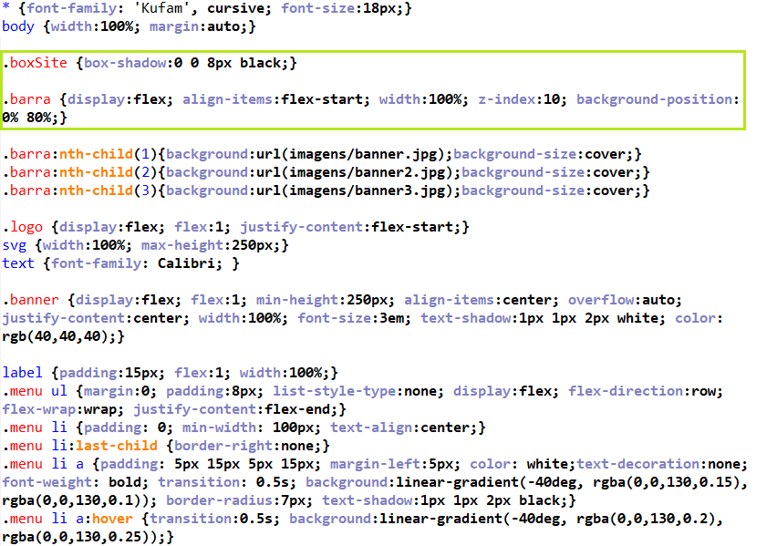
			   <figcaption>Podemos colocar uma sombra na tag principal da página <code>.boxSite</code>. A tag <code>.barra</code> terá display flex, onde definimos o alinhamento, largura e a posição do background.</figcaption>
		   </li>
		   <li>
			   <input type="radio" id="292" name="sl">
			   <label for="292"></label>
			   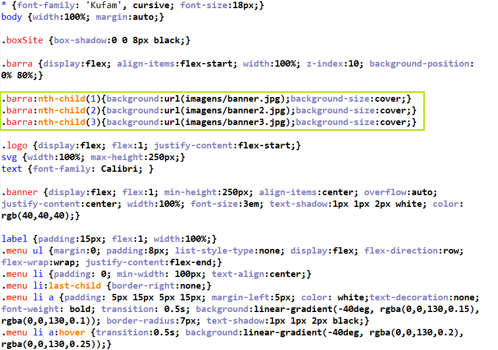
			   <figcaption>Como vamos criar várias estruturas <code>class="barra"</code> no arquivo HTML, podemos criar um background para cada "filha", usando o atributo <code>nth-child()</code>. O banner da primeira barra é o arquivo que está na pasta <code>imagens/banner.jpg</code>. Escolha uma imagem de paisagem para este primeiro banner.</figcaption>
		   </li>
		   <li>
			   <input type="radio" id="293" name="sl">
			   <label for="293"></label>
			   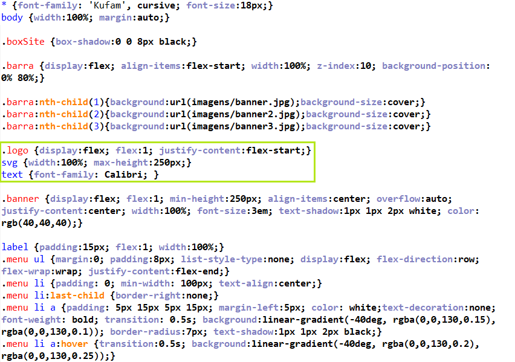
			   <figcaption>Na tag <code>.logo</code>, podemos definir uma largura padrão usando o atributo <code>flex:1</code> e alinhamento à esquerda com <code>flex-start</code>. As tags svg podem ter largura de 100% e altura máxima definida, que será igual à altura máxima da tag <code>.banner</code>. Assim, o layout não terá uma logomarca com tamanho muito diferente do banner. Defina também a fonte dos textos svg.</figcaption>
		   </li>
		   <li>
			   <input type="radio" id="294" name="sl">
			   <label for="294"></label>
			   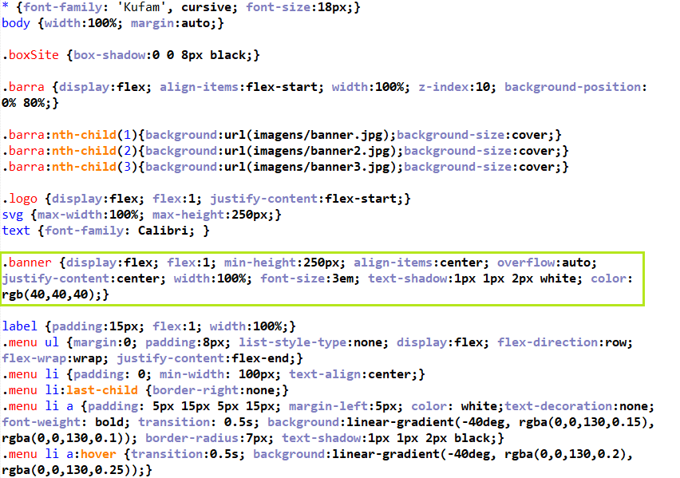
			   <figcaption>Na tag <code>.banner</code>, podemos definir a altura máxima (igual aos desenhos svg), tamanho <code>flex:1</code> e outros atributos de cor de fonte, alinhamento e <code>overflow:auto</code>, que permite a visualização de itens que ultrapassem as medidas do banner.</figcaption>
		   </li>
		   <li>
			   <input type="radio" id="295" name="sl">
			   <label for="295"></label>
			   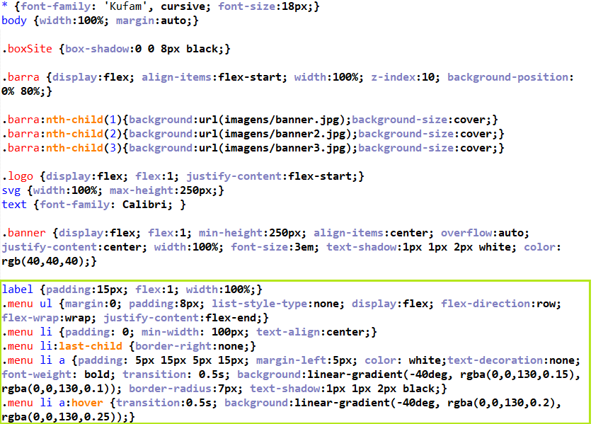
			   <figcaption>A estrutura do menu é a mesma que usamos nas atividades anteriores. Neste caso, o menu terá tamanho <code>flex:1</code> definido na tag <code>&lt;label&gt;</code> e alinhamento à direita. Configure medidas e cores para sua página de Atividade.</figcaption>
		   </li>
		   <li>
			   <input type="radio" id="295a" name="sl">
			   <label for="295a"></label>
			   <figcaption>Estrutura HTML da Atividade 9:
<pre><code>&lt;!DOCTYPE html&gt;
&lt;html&gt;
&lt;head&gt;
&lt;title&gt;Atividade 9&lt;/title&gt;
&lt;meta name="author" content="Paulo Henrique"&gt;
&lt;meta charset="UTF-8"&gt;
&lt;link href="estilo.css" rel="stylesheet" type="text/css"&gt;
&lt;link href="https://fonts.googleapis.com/css2?family=Kufam&display=swap" rel="stylesheet"&gt; 
&lt;/head&gt;
&lt;body&gt;
  &lt;div class="boxSite"&gt;
	&lt;div class="barra"&gt;
		&lt;div class="logo"&gt;
        	&lt;svg viewBox="0 0 200 200"&gt;
				DESENHOS SVG
			&lt;/svg&gt;
        &lt;/div&gt;
		&lt;div class="banner"&gt;
			Vip Turismo
		&lt;/div&gt;
		&lt;input type="checkbox" id="checkbox1"&gt;
		&lt;label for="checkbox1"&gt;
			&lt;nav class="menu"&gt;
				&lt;ul&gt;
					&lt;li&gt;&lt;a href="index.htm"&gt;Página 1&lt;/a&gt;&lt;/li&gt;
					&lt;li&gt;&lt;a href="pagina1.htm"&gt;Página 2&lt;/a&gt;&lt;/li&gt;
					&lt;li&gt;&lt;a href="pagina2.htm"&gt;Página 3&lt;/a&gt;&lt;/li&gt;
				&lt;/ul&gt;
			&lt;/nav&gt;
			&lt;span class="toggle"&gt;&amp;#9776;&lt;/span&gt;
		&lt;/label&gt;	
	&lt;/div&gt;
  &lt;/div&gt;
&lt;/body&gt;
&lt;/html&gt;</code></pre></figcaption>
		   </li>
		   <li>
			   <input type="radio" id="295b" name="sl">
			   <label for="295b"></label>
			   <figcaption>Estrutura CSS da Atividade 9:
<pre><code>* {font-family: 'Kufam', cursive; font-size:18px;}
body {width:100%; margin:auto;}

.boxSite {box-shadow:0 0 8px black;}

.barra {display:flex; align-items:flex-start; width:100%; z-index:10; background-position: 0% 80%;}

.barra:nth-child(1){background:url(imagens/banner.jpg);background-size:cover;}
.barra:nth-child(2){background:url(imagens/banner2.jpg);background-size:cover;}
.barra:nth-child(3){background:url(imagens/banner3.jpg);background-size:cover;}

.logo {display:flex; flex:1; justify-content:flex-start;}
svg {width:100%; max-height:250px;}
text {font-family: Calibri; }

.banner {display:flex; flex:1; min-height:250px; align-items:center; overflow:auto; justify-content:center; width:100%; font-size:3em; text-shadow:1px 1px 2px white; color:rgb(40,40,40);}

label {padding:15px; flex:1; width:100%;}
.menu ul {margin:0; padding:8px; list-style-type:none; display:flex; flex-direction:row; flex-wrap:wrap; justify-content:flex-end;}
.menu li {padding: 0; min-width: 100px; text-align:center;}
.menu li:last-child {border-right:none;}
.menu li a {padding: 5px 15px 5px 15px; margin-left:5px; color: white;text-decoration:none; font-weight: bold; transition: 0.5s; background:linear-gradient(-40deg, rgba(0,0,130,0.15), rgba(0,0,130,0.1)); border-radius:7px; text-shadow:1px 1px 2px black;}
.menu li a:hover {transition:0.5s; background:linear-gradient(-40deg, rgba(0,0,130,0.2), rgba(0,0,130,0.25));}</code></pre></figcaption>   
		   </li>
		</ul>
		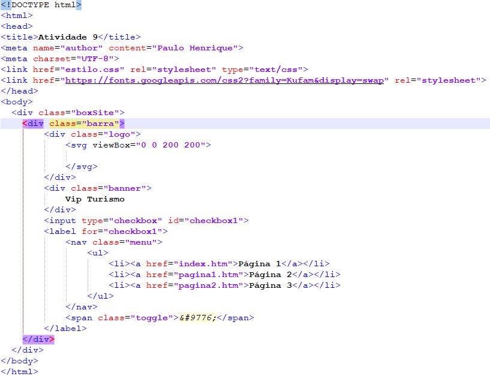
  

	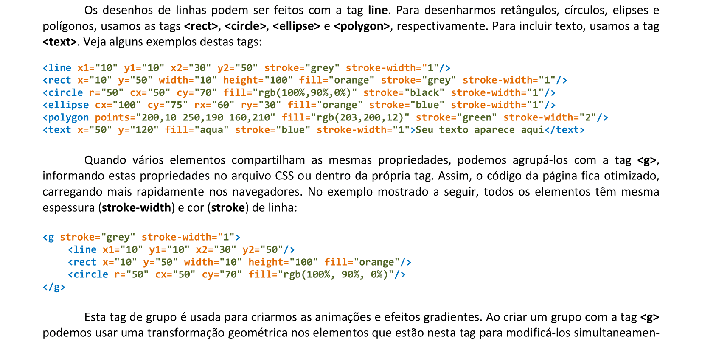
	
<a href="#css4" class="topo">voltar ao topo</a>

	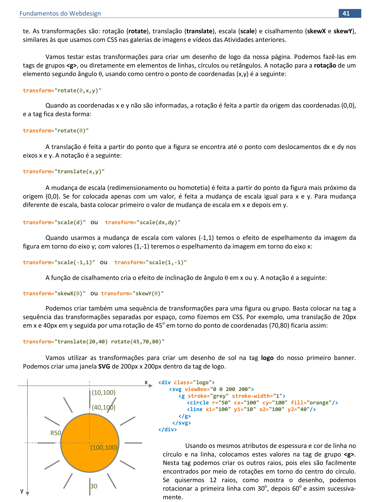
	
<a href="#css4" class="topo">voltar ao topo</a>

	

		<iframe width="100%" src="https://www.youtube.com/embed/UWNFfDTYlxc " frameborder="0" allow="accelerometer; clipboard-write; encrypted-media; gyroscope; picture-in-picture" allowfullscreen></iframe>
    

	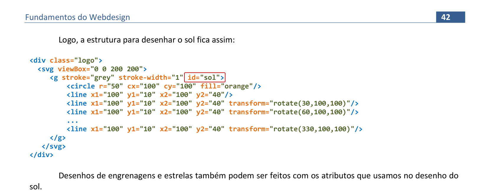
	

&#x1f4c3; Primeiro banner

	
Vamos criar nosso primeiro desenho SVG dentro da classe <code>class="logo"</code>. Este desenho usará apenas as tags <code>circle</code> e <code>line</code>.

	  <ul class="slider">
		  <li>
			   <input type="radio" id="296" name="sl">
			   <label for="296"></label>
			   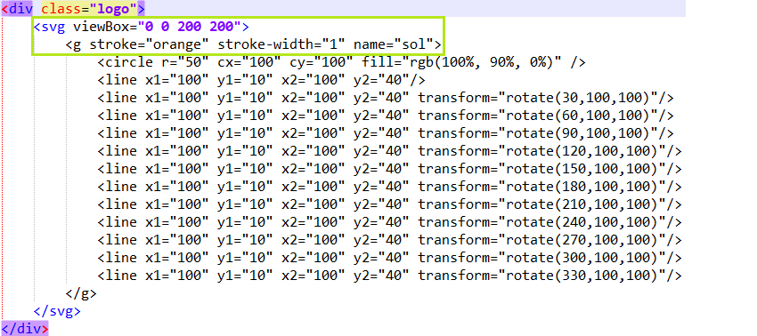
			   <figcaption>Podemos definir a janela de visualização <code>viewBox</code> com tamanho de 200 x 200 pixels. Além disso, vamos usar uma tag de grupo <code>&lt;g&gt;</code> com os atributos comuns definidos nesta tag: cor da linha, espessura da linha e um nome para o grupo: <code>name="sol"</code>.</figcaption>
		   </li>
		   <li>
			   <input type="radio" id="297" name="sl">
			   <label for="297"></label>
			   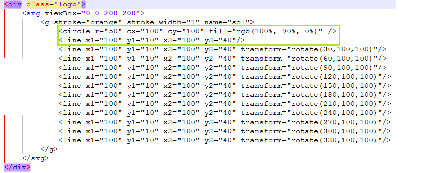
			   <figcaption>O círculo tem centro no ponto de coordenadas (100,100) e raio 50. Defina também a cor do preenchimento com o atributo <code>fill</code> que pode ser informado com padrão RGB, Hexadecimal ou HTML. A primeira linha construída do raio do sol foi na parte superior do desenho, que começa no ponto (100,10) e termina em (100,40).</figcaption>
		   </li>
		   <li>
			   <input type="radio" id="298" name="sl">
			   <label for="298"></label>
			   
			   <figcaption>Nosso desenho fica desta forma. Agora vamos usar rotações de 30&deg; da primeira linha do raio de sol para desenhar os outros raios.</figcaption>
		   </li>
		   <li>
			   <input type="radio" id="299" name="sl">
			   <label for="299"></label>
			   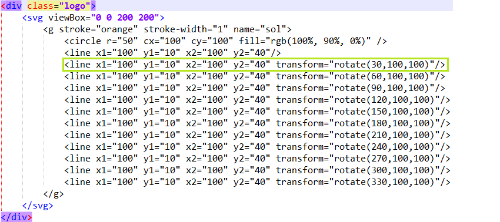
			   <figcaption>Note que usamos exatamente a mesma tag do primeiro raio, adicionando a rotação de 30&deg; em torno do centro (100,100). O comando fica <code>transform="rotate(30,100,100)"</code>.</figcaption>
		   </li>
		   <li>
			   <input type="radio" id="300" name="sl">
			   <label for="300"></label>
			   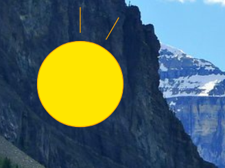
			   <figcaption>Ótimo! Nosso segundo raio foi desenhado. Já coloquei a imagem de uma paisagem na pasta das imagens com o nome <code>banner.jpg</code>.</figcaption>
		   </li>
		   <li>
			   <input type="radio" id="301" name="sl">
			   <label for="301"></label>
			   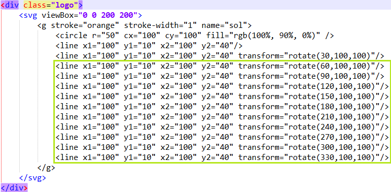
			   <figcaption>Agora copiamos e colamos a tag da primeira rotação, substituindo apenas o valor do ângulo: 60, 90, 120,... até o ângulo de 330. Salve e visualize o banner. Coloque um título no HTML dentro da tag <code>class="banner"</code></figcaption>
		   </li>
		   <li>
			   <input type="radio" id="302" name="sl">
			   <label for="302"></label>
			   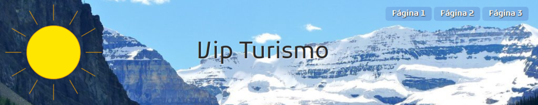
			   <figcaption>Nosso primeiro banner fica desta forma. Modifique cores e atributos do layout no CSS para testar se está ficando bom. As próximas barras serão inseridas abaixo desta que acabamos de construir.</figcaption>
		   </li>
		   <li>
			   <input type="radio" id="302a" name="sl">
			   <label for="302a"></label>
			   <figcaption>Estrutura HTML do primeiro desenho de banner da Atividade 9:
<pre><code>&lt;div class="logo"&gt;
	&lt;svg viewBox="0 0 200 200"&gt;
		&lt;g stroke="orange" stroke-width="1" name="sol"&gt;
			&lt;circle r="50" cx="100" cy="100" fill="rgb(100%, 90%, 0%)" /&gt;
			&lt;line x1="100" y1="10" x2="100" y2="40"/&gt;
			&lt;line x1="100" y1="10" x2="100" y2="40" transform="rotate(30,100,100)"/&gt;
			&lt;line x1="100" y1="10" x2="100" y2="40" transform="rotate(60,100,100)"/&gt;
			&lt;line x1="100" y1="10" x2="100" y2="40" transform="rotate(90,100,100)"/&gt;
			&lt;line x1="100" y1="10" x2="100" y2="40" transform="rotate(120,100,100)"/&gt;
			&lt;line x1="100" y1="10" x2="100" y2="40" transform="rotate(150,100,100)"/&gt;
			&lt;line x1="100" y1="10" x2="100" y2="40" transform="rotate(180,100,100)"/&gt;
			&lt;line x1="100" y1="10" x2="100" y2="40" transform="rotate(210,100,100)"/&gt;
			&lt;line x1="100" y1="10" x2="100" y2="40" transform="rotate(240,100,100)"/&gt;
			&lt;line x1="100" y1="10" x2="100" y2="40" transform="rotate(270,100,100)"/&gt;
			&lt;line x1="100" y1="10" x2="100" y2="40" transform="rotate(300,100,100)"/&gt;
			&lt;line x1="100" y1="10" x2="100" y2="40" transform="rotate(330,100,100)"/&gt;
		&lt;/g&gt;
	&lt;/svg&gt;
&lt;/div&gt;
&lt;div class="banner"&gt;
	Vip Turismo
&lt;/div&gt;</code></pre></figcaption>   
		   </li>
		</ul>
		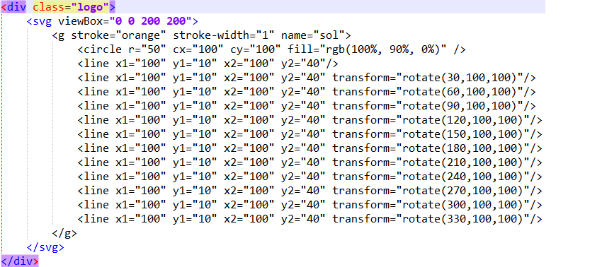
  

	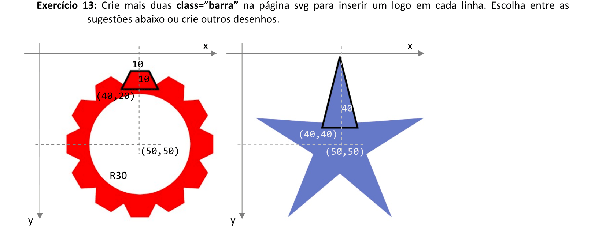
	

&#x1f4c3; 2&deg; e 3&deg; banners

	
Vamos criar os outros 2 desenhos SVG dentro de classes <code>class="logo"</code> em novas classes <code>class="barra"</code>, colocadas logo após o fechamento da primeira tag que fizemos de <code>barra</code>.

	  <ul class="slider">
		  <li>
			   <input type="radio" id="303" name="sl">
			   <label for="303"></label>
			   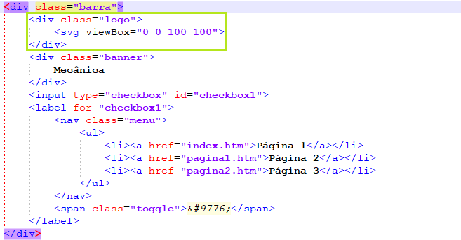
			   <figcaption>Podemos definir a janela de visualização <code>viewBox</code> com tamanho de 100 x 100 pixels para o desenho da roda dentada. Coloque um título de Mecânica na tag <code>class="banner"</code> e escolha uma imagem desta área para inserir como <code>imagens/banner2.jpg</code>.</figcaption>
		   </li>
		  <li>
			   <input type="radio" id="304" name="sl">
			   <label for="304"></label>
			   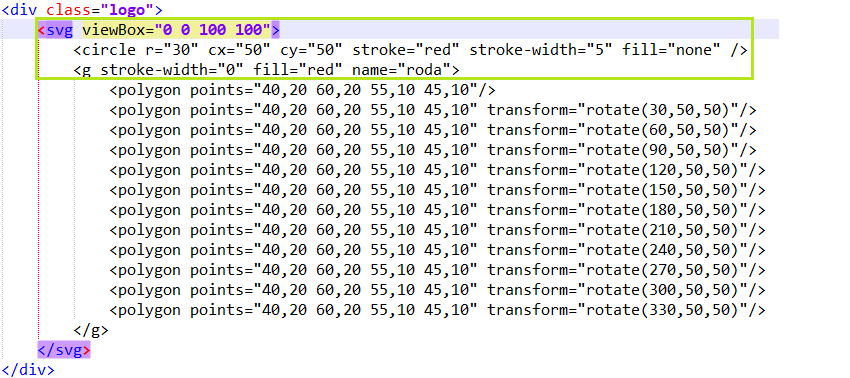
			   <figcaption>A parte interior do desenho será um círculo com espessura de linha de 5px. Desta forma, ele esconderá os encaixes dos trapézios que vamos desenhar usando o atributo <code>polygon</code>. Podemos digitar a sequência dos vértices adjacentes para o desenho do trapézio: (40,20); (60,20); (55,10) e (45,10).</figcaption>
		   </li>
		   <li>
			   <input type="radio" id="305" name="sl">
			   <label for="305"></label>
			   
			   <figcaption>Neste ponto, o desenho fica desta forma. Note que o círculo cobre o trapézio e podemos continuar para desenhar os outros dentes da roda.</figcaption>
		   </li>
		   <li>
			   <input type="radio" id="306" name="sl">
			   <label for="306"></label>
			   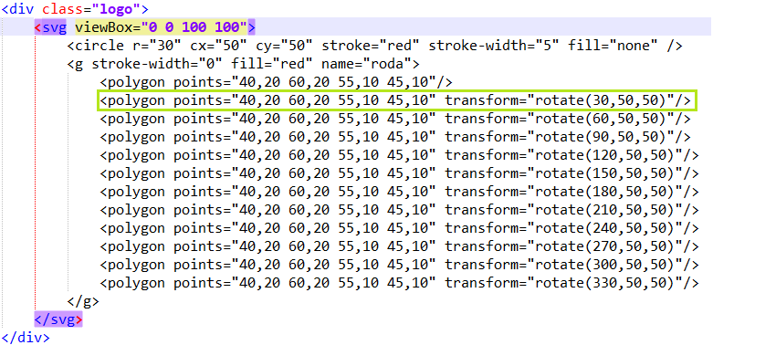
			   <figcaption>Da mesma maneira que fizemos com os raios do sol, usamos a mesma tag do primeiro dente e rotacionamos este desenho com ângulo de 30&deg; com centro de rotação no ponto (50,50): <code>transform="rotate(30,50,50)"</code>.</figcaption>
		   </li>
		   <li>
			   <input type="radio" id="307" name="sl">
			   <label for="307"></label>
			   
			   <figcaption>O segundo dente da roda está desenhado. Agora podemos copiar e colar a tag de rotação para finalizar este desenho.</figcaption>
		   </li>
		   <li>
			   <input type="radio" id="308" name="sl">
			   <label for="308"></label>
			   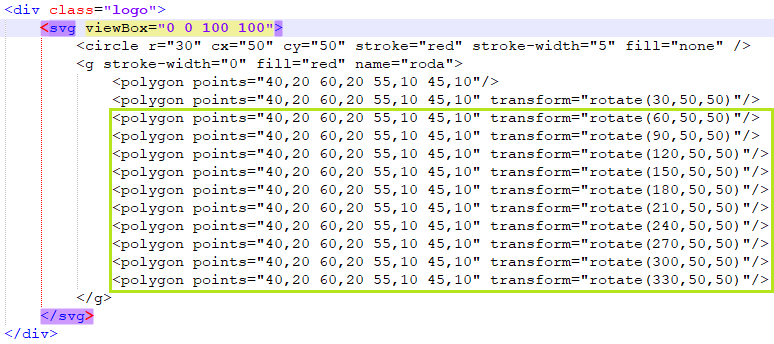
			   <figcaption>Lembre-se de modificar apenas o ângulo de rotação: de 30&deg; em 30&deg;.</figcaption>
		   </li>
		   <li>
			   <input type="radio" id="309" name="sl">
			   <label for="309"></label>
			   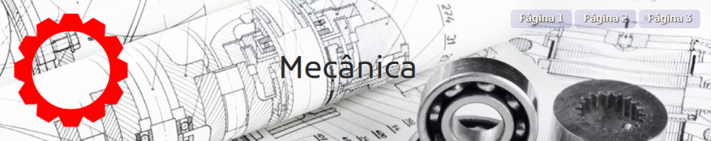
			   <figcaption>Ótimo, o nosso banner fica com este layout. Veja a estrutura SVG deste banner:
<pre><code>&lt;svg viewBox="0 0 100 100"&gt;
	&lt;circle r="30" cx="50" cy="50" stroke="red" stroke-width="5" fill="none" /&gt;
	&lt;g stroke-width="0" fill="red" name="roda"&gt;
		&lt;polygon points="40,20 60,20 55,10 45,10"/&gt;
		&lt;polygon points="40,20 60,20 55,10 45,10" transform="rotate(30,50,50)"/&gt;
		&lt;polygon points="40,20 60,20 55,10 45,10" transform="rotate(60,50,50)"/&gt;
		&lt;polygon points="40,20 60,20 55,10 45,10" transform="rotate(90,50,50)"/&gt;
		&lt;polygon points="40,20 60,20 55,10 45,10" transform="rotate(120,50,50)"/&gt;
		&lt;polygon points="40,20 60,20 55,10 45,10" transform="rotate(150,50,50)"/&gt;
		&lt;polygon points="40,20 60,20 55,10 45,10" transform="rotate(180,50,50)"/&gt;
		&lt;polygon points="40,20 60,20 55,10 45,10" transform="rotate(210,50,50)"/&gt;
		&lt;polygon points="40,20 60,20 55,10 45,10" transform="rotate(240,50,50)"/&gt;
		&lt;polygon points="40,20 60,20 55,10 45,10" transform="rotate(270,50,50)"/&gt;
		&lt;polygon points="40,20 60,20 55,10 45,10" transform="rotate(300,50,50)"/&gt;
		&lt;polygon points="40,20 60,20 55,10 45,10" transform="rotate(330,50,50)"/&gt;
	&lt;/g&gt;
&lt;/svg&gt;</code></pre></figcaption>
		   </li>
		   <li>
			   <input type="radio" id="310" name="sl">
			   <label for="310"></label>
			   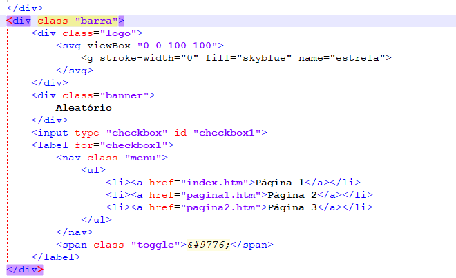
			   <figcaption>Logo após o fechamento da tag de barra da roda dentada, crie a nova tag <code>class="barra"</code> para desenharmos a estrela. Escolha uma imagem para ser o background desta barra em <code>imagens/banner3.jpg</code>.</figcaption>
		   </li>
		   <li>
			   <input type="radio" id="311" name="sl">
			   <label for="311"></label>
			   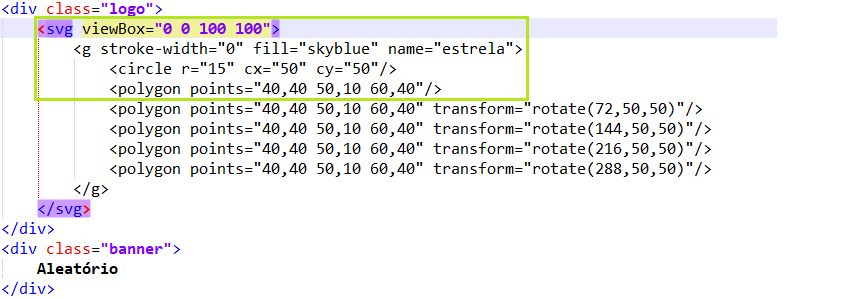
			   <figcaption>Podemos definir a janela de visualização <code>viewBox</code> com tamanho de 100 x 100 pixels para o desenho da estrela. O tom de azul <code>skyblue</code> foi definido como preenchimento. Usando mesmo raciocínio da roda dentada, desenhamos um círculo de raio 15 para a parte interior da estrela, e uma das pontas é o triângulo com as coordenadas desenhadas com a ferramenta <code>polygon</code>: (40,40); (50,10); (60,40).</figcaption>
		   </li>
		   <li>
			   <input type="radio" id="312" name="sl">
			   <label for="312"></label>
			   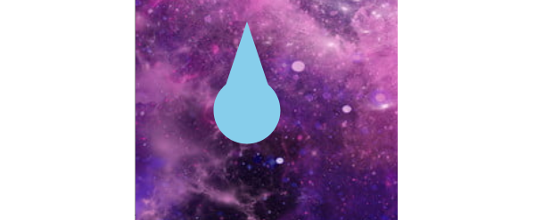
			   <figcaption>O desenho fica com o círculo e o triângulo encoberto na base. Podemos continuar para desenhar as outras pontas da estrela.</figcaption>
		   </li>
		   <li>
			   <input type="radio" id="313" name="sl">
			   <label for="313"></label>
			   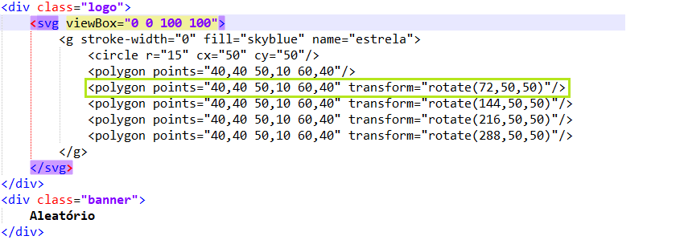
			   <figcaption>A segunda ponta será construída usando-se a rotação de 72&deg; em torno do centro (50,50).</figcaption>
		   </li>
		   <li>
			   <input type="radio" id="315" name="sl">
			   <label for="315"></label>
			   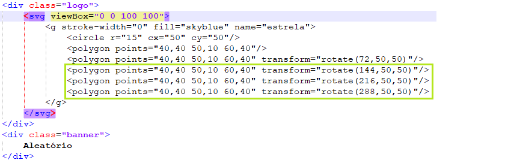
			   <figcaption>Agora basta rotacionar os outros triângulos de 72 em 72 graus.</figcaption>
		   </li>
		   <li>
			   <input type="radio" id="316" name="sl">
			   <label for="316"></label>
			   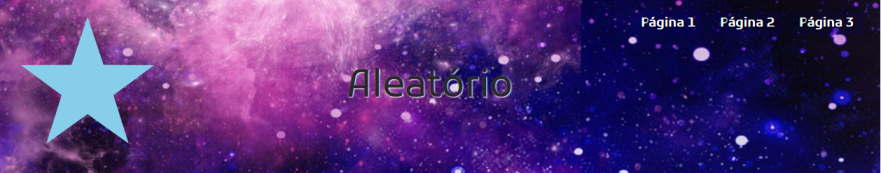
			   <figcaption>E assim fica o desenho do nosso banner. Se necessário, mude configurações CSS e os arquivos dos backgrounds. A estrutura SVG deste banner fica assim:
<pre><code>&lt;svg viewBox="0 0 100 100"&gt;
	&lt;g stroke-width="0" fill="skyblue" name="estrela"&gt;
		&lt;circle r="15" cx="50" cy="50"/&gt;
		&lt;polygon points="40,40 50,10 60,40"/&gt;
		&lt;polygon points="40,40 50,10 60,40" transform="rotate(72,50,50)"/&gt;
		&lt;polygon points="40,40 50,10 60,40" transform="rotate(144,50,50)"/&gt;
		&lt;polygon points="40,40 50,10 60,40" transform="rotate(216,50,50)"/&gt;
		&lt;polygon points="40,40 50,10 60,40" transform="rotate(288,50,50)"/&gt;
	&lt;/g&gt;
&lt;/svg&gt;</code></pre></figcaption>
		   </li>
		</ul>
		
  

	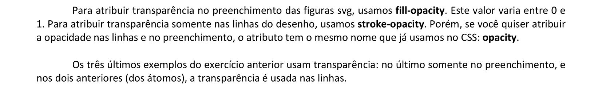
	

&#x1f4c3; 4&deg; e 5&deg; banners

	
Vamos criar os outros 2 desenhos SVG dentro de classes <code>class="logo"</code> em novas classes <code>class="barra"</code>, colocadas logo após o fechamento da tag da terceira <code>barra</code> que desenhamos com a estrela.

	  <ul class="slider">
		  <li>
			   <input type="radio" id="317" name="sl">
			   <label for="317"></label>
			   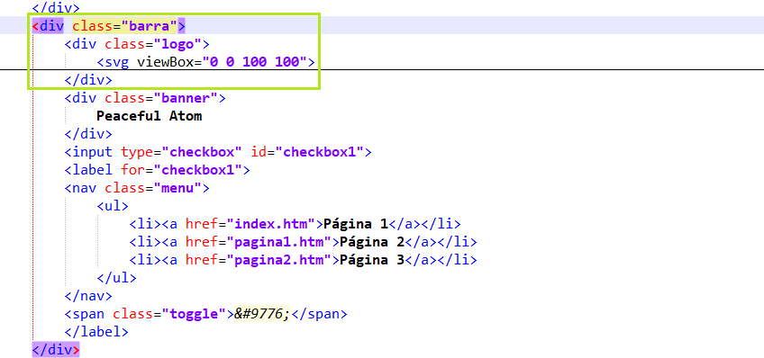
			   <figcaption>Podemos definir a janela de visualização <code>viewBox</code> com tamanho de 100 x 100 pixels para o desenho do símbolo de um átomo. Coloque um título na tag <code>class="banner"</code> e escolha uma imagem desta área para inserir como <code>imagens/banner4.jpg</code>. Lembre-se de arrumar o arquivo css com o atributo <code>.barra:nth-child(4) {background: url(imagens/banner4.jpg);}</code></figcaption>
		   </li>
		  <li>
			   <input type="radio" id="318" name="sl">
			   <label for="318"></label>
			   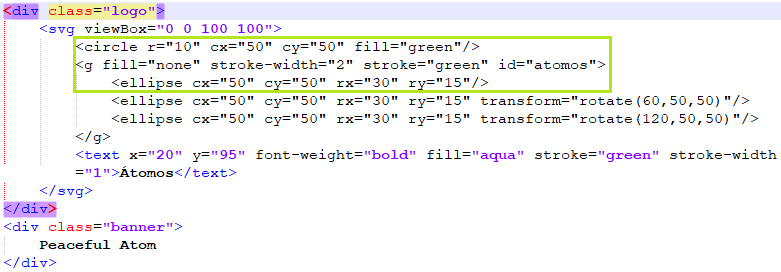
			   <figcaption>Como vamos colocar um texto logo abaixo do desenho, fazemos uma translação de 8px para cima. O círculo terá raio 8px, com centro no meio da janela svg, ou seja, no ponto de coordenadas (50,50). Defina a espessura da linha e a cor, sem usar preenchimento. A primeira elipse pode ser desenhada com raios <code>rx="15"</code> e <code>ry="35"</code>. Experimente valores diferentes para seu desenho.</figcaption>
		   </li>
		   <li>
			   <input type="radio" id="318a" name="sl">
			   <label for="318a"></label>
			   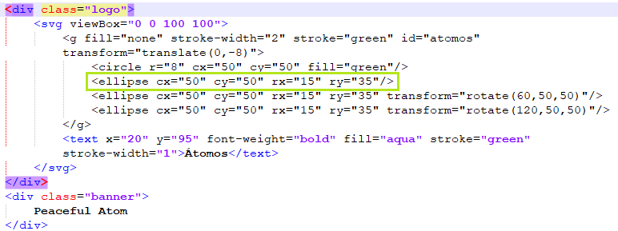
			   <figcaption>As outras elipses podem ser desenhadas com duas rotações: de 60&deg; e de 120&deg; em torno do centro (50,50). O outro átomo pode ser feito com rotações de 45&deg;, 90&deg; e 135&deg;. Escolha um dos átomos para o seu banner.</figcaption>
		   </li>
		   <li>
			   <input type="radio" id="319" name="sl">
			   <label for="319"></label>
			   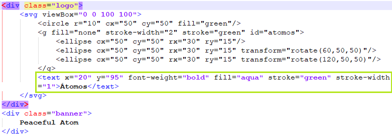
			   <figcaption>Defina os atributos de cor e contorno do texto  desta logomarca. Se necessário, ajuste as coordenadas do texto. O tamanho e a família da fonte podem ser definidos apenas no arquivo CSS, no atributo <code>text {font-family:Calibri; font-size:25px;}</code>. Ajuste o tamanho ideal para seu desenho.</figcaption>
		   </li>
		   <li>
			   <input type="radio" id="320" name="sl">
			   <label for="320"></label>
			   
			   <figcaption>O banner fica com este layout. Teste os atributos de cores e tamanhos em seu desenho. Veja a estrutura SVG deste banner:
<pre><code>&lt;svg viewBox="0 0 100 100"&gt;
	&lt;g fill="none" stroke-width="2" stroke="green" id="atomos" transform="translate(0,-8)"&gt;
		&lt;circle r="8" cx="50" cy="50" fill="green"/&gt;
		&lt;ellipse cx="50" cy="50" rx="15" ry="35"/&gt;
		&lt;ellipse cx="50" cy="50" rx="15" ry="35" transform="rotate(60,50,50)"/&gt;
		&lt;ellipse cx="50" cy="50" rx="15" ry="35" transform="rotate(120,50,50)"/&gt;
	&lt;/g&gt;
	&lt;text x="20" y="95" font-weight="bold" font-size="20pt" fill="aqua" stroke="green" stroke-width="1"&gt;Átomos&lt;/text&gt;
&lt;/svg&gt;</code></pre></figcaption>
		   </li>
		   <li>
			   <input type="radio" id="321" name="sl">
			   <label for="321"></label>
			   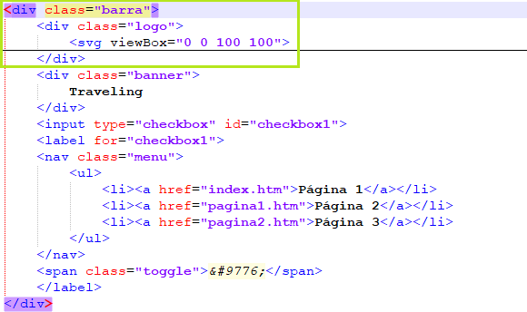
			   <figcaption>Vamos desenhar outro símbolo, com retângulos. Logo abaixo do fechamento da barra do átomo, crie uma nova tag de barra. Insira uma imagem para o fundo deste banner em <code>imagens/banner5.jpg</code>. A janela de visualização <code>viewBox</code> pode ser usada com 100 x 100 pixels.</figcaption>
		   </li>
		   <li>
			   <input type="radio" id="322" name="sl">
			   <label for="322"></label>
			   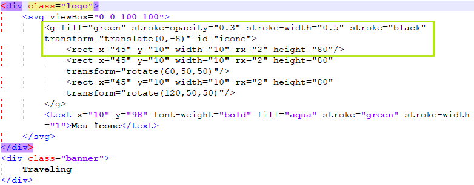
			   <figcaption>Criamos um grupo com tag <code>&lt;g&gt;</code>, para definir atributos de cores e contornos do desenho. O primeiro retângulo foi desenhado na vertical, com largura 10px e altura 80px. Os cantos arredondados estão com <code>rx="2"</code>.</figcaption>
		   </li>
		   <li>
			   <input type="radio" id="322a" name="sl">
			   <label for="322a"></label>
			   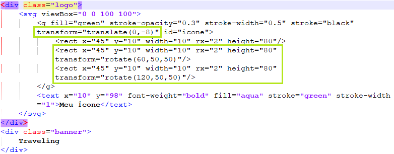
			   <figcaption>Os outros dois retângulos foram desenhados com rotações de 60&deg; e 120&deg; em torno do centro (50,50). Para que o desenho fique com o texto logo abaixo, foi feita uma translação de -8 pixels na coordenada y, ou seja, o desenho "subiu" 8px.</figcaption>
		   </li>
		   <li>
			   <input type="radio" id="323" name="sl">
			   <label for="323"></label>
			   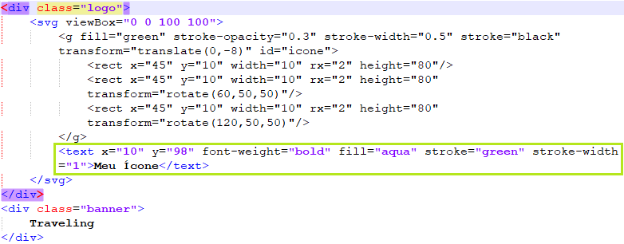
			   <figcaption>Ajuste os atributos do texto desta logomarca. As coordenadas sugeridas são <code>x="10"</code> e <code>y="98"</code>.</figcaption>
		   </li>
		   <li>
			   <input type="radio" id="324" name="sl">
			   <label for="324"></label>
			   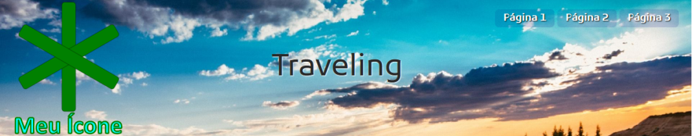
			   <figcaption>O layout deste banner fica desta forma. Configure os atributos para fazer o seu banner. Veja a estrutura SVG deste banner:
<pre><code>&lt;svg viewBox="0 0 100 100"&gt;
	&lt;g fill="green" stroke-opacity="0.3" stroke-width="0.5" stroke="black" transform="translate(0,-8)" id="icone"&gt;
		&lt;rect x="45" y="10" width="10" rx="2" height="80"/&gt;
		&lt;rect x="45" y="10" width="10" rx="2" height="80" transform="rotate(60,50,50)"/&gt;
		&lt;rect x="45" y="10" width="10" rx="2" height="80" transform="rotate(120,50,50)"/&gt;
	&lt;/g&gt;
	&lt;text x="10" y="98" fill="aqua" stroke="green" stroke-width="1"&gt;Meu Ícone&lt;/text&gt;
&lt;/svg&gt;</code></pre></figcaption>
		   </li>
		</ul>
		
  

	
	
<a href="#css4" class="topo">voltar ao topo</a>

	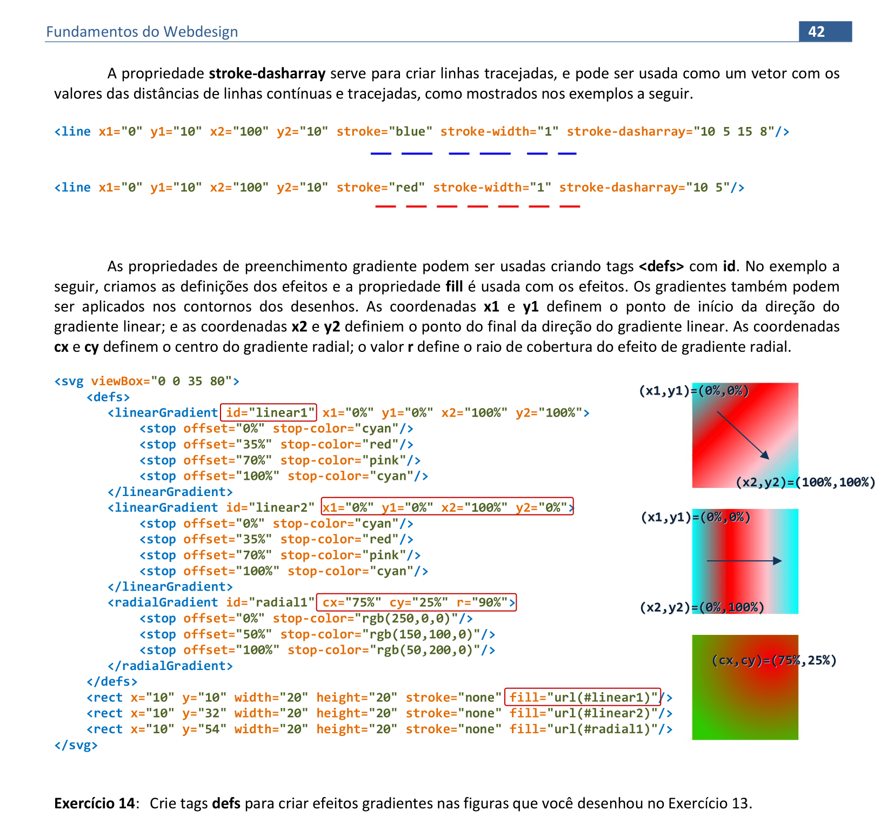
	

&#x1f4c3; Gradientes nos banners

	
Vamos colocar efeitos de gradiente nos preenchimentos e linhas dos desenhos que fizemos dos 5 primeiros banners.

	  <ul class="slider">
		  <li>
			   <input type="radio" id="325" name="sl">
			   <label for="325"></label>
			   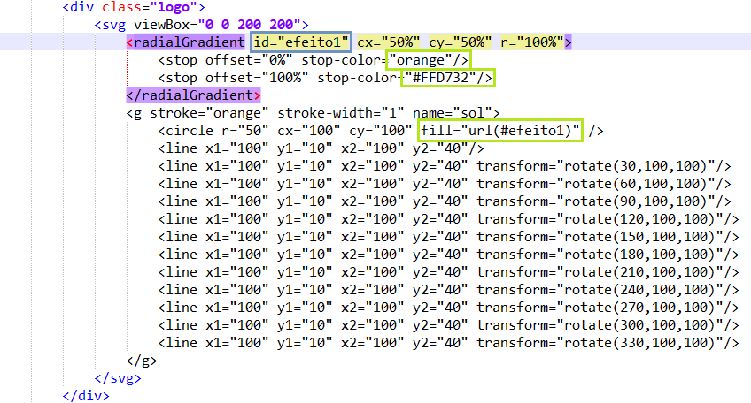
			   <figcaption>Vamos criar o <code>id="efeito1"</code> como gradiente radial de um tom de laranja mais claro para um pouco mais escuro. O centro deste efeito está no ponto de coordenadas (50%,50%) com raio que abrange 100% do desenho. Ajuste cores e valores para seu banner. Na tag do círculo, colocamos a referência do efeito no preenchimento: <code>fill="url(#efeito1)"</code>.</figcaption>
		   </li>
		  <li>
			   <input type="radio" id="326" name="sl">
			   <label for="326"></label>
			   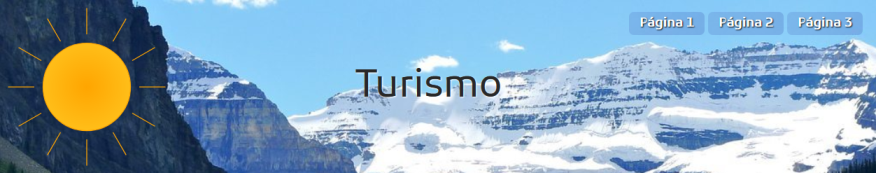
			   <figcaption>O desenho do sol fica com esse efeito. Ajuste os valores para seu desenho. A estrutura SVG do efeito 1 de gradiente é a seguinte:
<pre><code>&lt;radialGradient id="efeito1" cx="50%" cy="50%" r="100%"&gt;
	&lt;stop offset="0%" stop-color="orange"/&gt;
	&lt;stop offset="100%" stop-color="#FFD732"/&gt;
&lt;/radialGradient&gt;</code></pre>
			   </figcaption>
		   </li>
		   <li>
			   <input type="radio" id="327" name="sl">
			   <label for="327"></label>
			   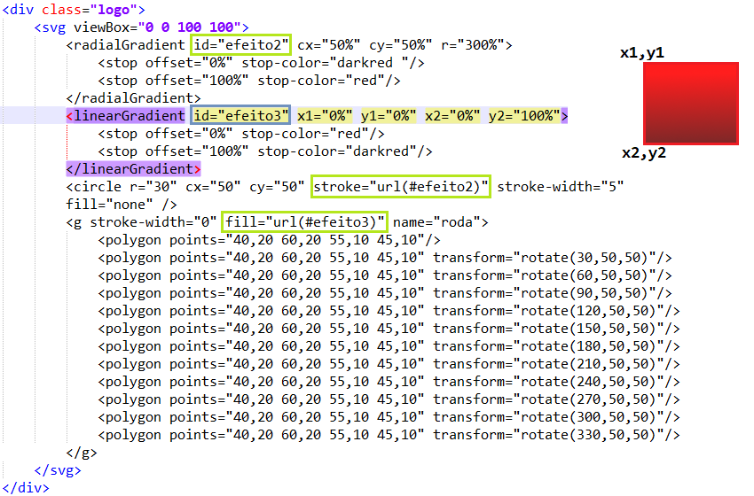
			   <figcaption>Na roda dentada, temos que criar 2 efeitos: um radial, para o círculo e outro linear, para os trapézios. Estes efeitos variam de uma tonalidade <code>darkred</code> para o <code>red</code>. Consulte o site <a href="https://html-color.codes/" target="_blank">https://html-color.codes/</a> para combinar cores. O efeito linear começa em <code>x1="0%, y1="0%</code> e termina em <code>x2="0%, y2="100%</code>, ou seja, vai de cima para baixo.</figcaption>
		   </li>
		   <li>
			   <input type="radio" id="328" name="sl">
			   <label for="328"></label>
			   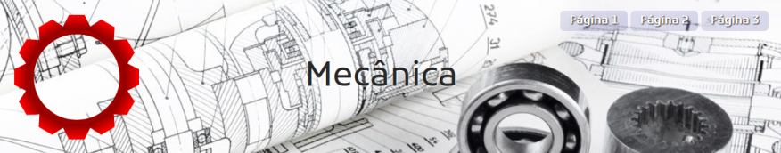
			   <figcaption>O layout com gradiente no SVG fica desta forma. Ajuste valores e cores para seu banner. A estrutura SVG dos efeitos 2 e 3 de gradiente é a seguinte:
<pre><code>&lt;radialGradient id="efeito2" cx="50%" cy="50%" r="300%"&gt;
	&lt;stop offset="0%" stop-color="darkred "/&gt;
	&lt;stop offset="100%" stop-color="red"/&gt;
&lt;/radialGradient&gt;
&lt;linearGradient id="efeito3" x1="0%" y1="0%" x2="0%" y2="100%"&gt;
	&lt;stop offset="0%" stop-color="red"/&gt;
	&lt;stop offset="100%" stop-color="darkred"/&gt;
&lt;/linearGradient&gt;</code></pre></figcaption>
		   </li>
		   <li>
			   <input type="radio" id="329" name="sl">
			   <label for="329"></label>
			   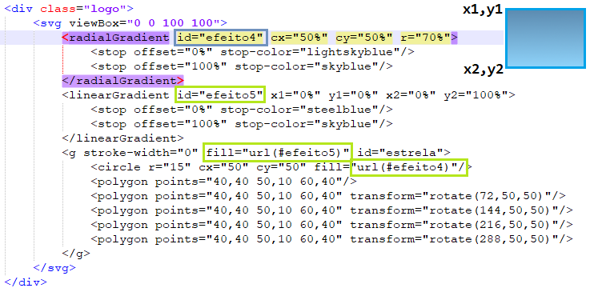
			   <figcaption>O efeito gradiente da estrela também pode ser feito com um gradiente radial, para o círculo que desenhamos no meio da estrela, e outro linear para os triângulos. Escolha cores e coloque as referências nos preenchimentos para conseguir o efeito criado. Como estamos variando apenas 2 cores, usamos apenas os atributos <code>&lt;stop offset="0%&gt;</code> e <code>&lt;stop offset="100%&gt;</code> para os tons de azul. O efeito linear começa em <code>x1="0%, y1="0%</code> e termina em <code>x2="0%, y2="100%</code>, ou seja, vai de cima para baixo.</figcaption>
		   </li>
		   <li>
			   <input type="radio" id="330" name="sl">
			   <label for="330"></label>
			   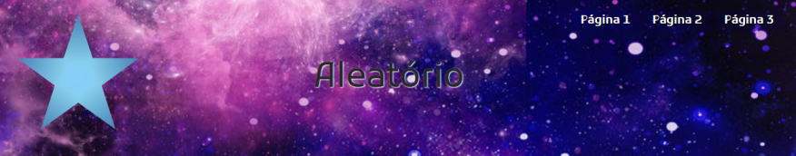
			   <figcaption>O layout com gradiente fica desta forma. Ajuste cores e efeitos para seu desenho. A estrutura SVG dos efeitos 4 e 5 de gradiente é a seguinte:
<pre><code>&lt;radialGradient id="efeito4" cx="50%" cy="50%" r="70%"&gt;
	&lt;stop offset="0%" stop-color="lightskyblue"/&gt;
	&lt;stop offset="100%" stop-color="skyblue"/&gt;
&lt;/radialGradient&gt;
&lt;linearGradient id="efeito5" x1="0%" y1="0%" x2="0%" y2="100%"&gt;
	&lt;stop offset="0%" stop-color="steelblue"/&gt;
	&lt;stop offset="100%" stop-color="skyblue"/&gt;
&lt;/linearGradient&gt;</code></pre></figcaption>
		   </li>
		   <li>
			   <input type="radio" id="331" name="sl">
			   <label for="331"></label>
			   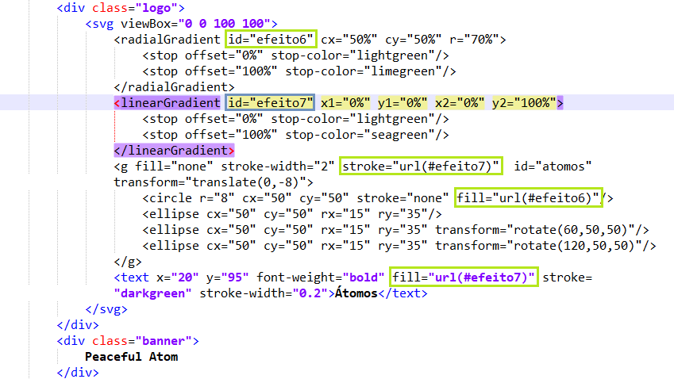
			   <figcaption>No desenho do átomo, criamos um efeito de gradiente linear para as elipses nos contornos <code>stroke</code> e um efeito de gradiente radial no círculo. Podemos usar o efeito de gradiente linear no texto também. Neste caso, são mostradas variações de tons de verde. Escolha cores e ajuste valores para o seu banner. O efeito linear começa de cima e vai para baixo.</figcaption>
		   </li>
		   <li>
			   <input type="radio" id="332" name="sl">
			   <label for="332"></label>
			   
			   <figcaption>O desenho com gradiente fica desta forma. A estrutura SVG dos efeitos 6 e 7 de gradiente é a seguinte:
<pre><code>&lt;radialGradient id="efeito6" cx="50%" cy="50%" r="70%"&gt;
	&lt;stop offset="0%" stop-color="lightgreen"/&gt;
	&lt;stop offset="100%" stop-color="limegreen"/&gt;
&lt;/radialGradient&gt;
&lt;linearGradient id="efeito7" x1="0%" y1="0%" x2="0%" y2="100%"&gt;
	&lt;stop offset="0%" stop-color="lightgreen"/&gt;
	&lt;stop offset="100%" stop-color="seagreen"/&gt;
&lt;/linearGradient&gt;</code></pre></figcaption>
		   </li>
		   <li>
			   <input type="radio" id="333" name="sl">
			   <label for="333"></label>
			   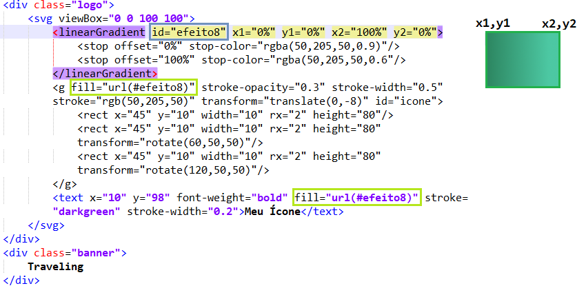
			   <figcaption>O último banner que desenhamos, do asterisco, pode ter um efeito gradiente linear. Neste caso, usamos tons de verde com transparência RGBA. O texto tem mesmo efeito de gradiente dos retângulos. O efeito linear começa em <code>x1="0%, y1="0%</code> e termina em <code>x2="100%, y2="0%</code>, ou seja, vai da esquerda para a direita.</figcaption>
		   </li>
		   <li>
			   <input type="radio" id="334" name="sl">
			   <label for="334"></label>
			   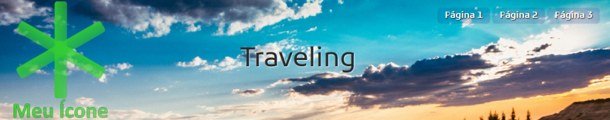
			   <figcaption>O layout deste banner com gradiente fica desta forma. Ajuste cores e valores de gradiente para seu desenho de banner. A estrutura SVG do efeito 8 de gradiente é a seguinte:
<pre><code>&lt;linearGradient id="efeito8" x1="0%" y1="0%" x2="100%" y2="0%"&gt;
	&lt;stop offset="0%" stop-color="rgba(50,205,50,0.9)"/&gt;
	&lt;stop offset="100%" stop-color="rgba(50,205,50,0.6"/&gt;
&lt;/linearGradient&gt;</code></pre></figcaption>
		   </li>
		</ul>
		
  

	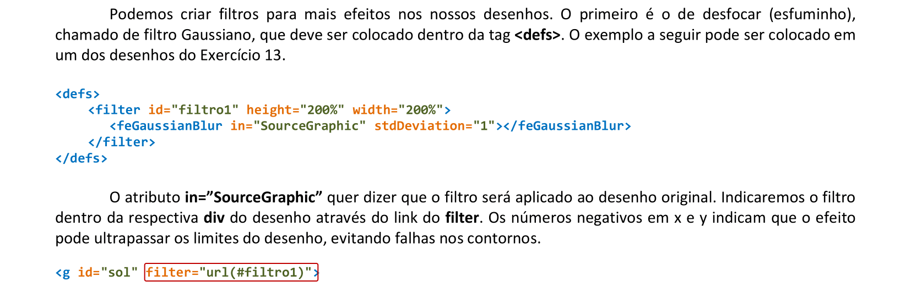
	
<a href="#css4" class="topo">voltar ao topo</a>

	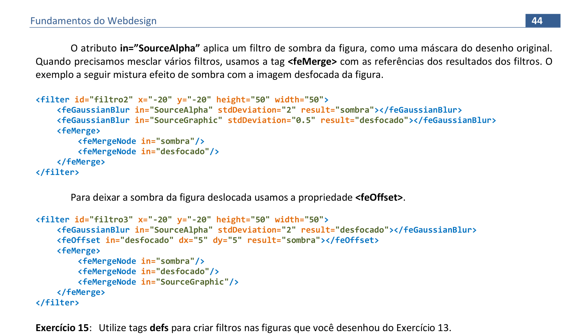
	

&#x1f4c3; Filtros nos banners

	
Vamos colocar efeitos de filtros de sombras nos desenhos que fizemos dos 5 primeiros banners.

	  <ul class="slider">
		  <li>
			   <input type="radio" id="335" name="sl">
			   <label for="335"></label>
			   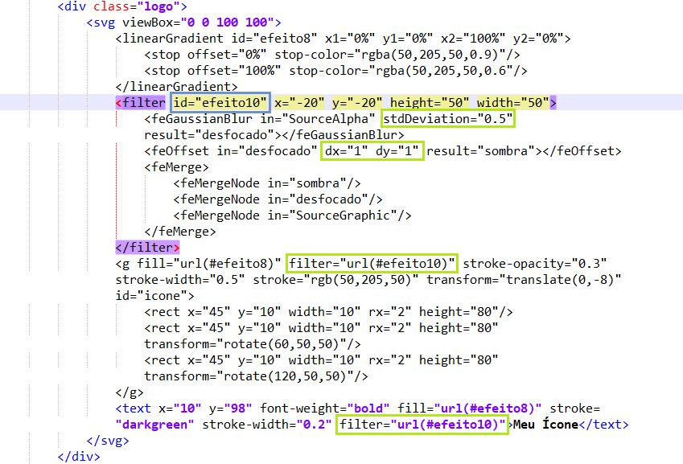
			   <figcaption>Vamos criar o <code>id="efeito10"</code> como filtro de sombra desfocada, com desvio padrão 0.5 e distâncias do gráfico com 1px à direita e abaixo do desenho. Precisamos colocar indicação nos gráficos que terão este efeito com o atributo <code>filter="url(#efeito10)"</code>. Neste primeiro exemplo, os desenhos do 5&deg; banner estão com o filtro</figcaption>
		   </li>
		  <li>
			   <input type="radio" id="336" name="sl">
			   <label for="336"></label>
			   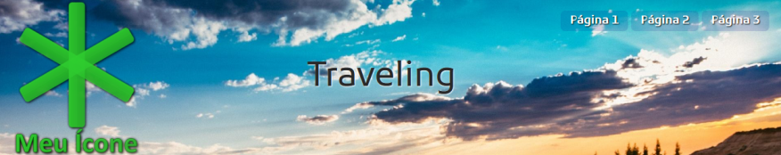
			   <figcaption>O banner fica com esse efeito no SVG. Ajuste os valores do filtro para seu desenho. Vamos usar o mesmo efeito nos próximos desenhos.</figcaption>
		   </li>
		   <li>
			   <input type="radio" id="337" name="sl">
			   <label for="337"></label>
			   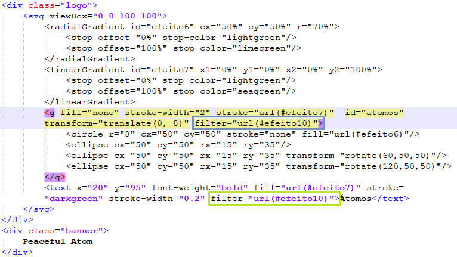
			   <figcaption>Para usarmos o mesmo efeito nos outros desenhos, não precisamos inserir a tag <code>&lt;filter&gt;</code> novamente. Basta colocar a indicação deste filtro nos desenhos. O mesmo vale para os gradientes: se você quiser usar um mesmo efeito já definido em outra tag <code>&lt;svg&gt;</code>, basta colocar sua indicação.</figcaption>
		   </li>
		   <li>
			   <input type="radio" id="338" name="sl">
			   <label for="338"></label>
			   
			   <figcaption>O layout com filtro no SVG do banner de átomo fica desta maneira. Se necessário, ajuste valores e cores para o filtro. Caso precise de outro filtro, basta definir suas configurações e colocar outro nome id.</figcaption>
		   </li>
		   <li>
			   <input type="radio" id="339" name="sl">
			   <label for="339"></label>
			   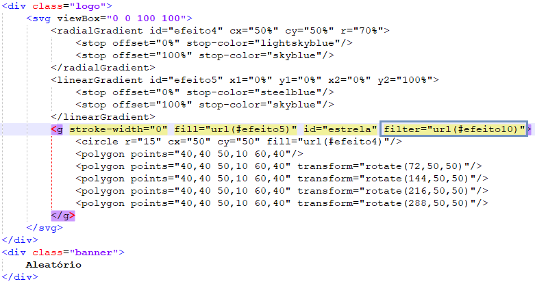
			   <figcaption>Colocando o filtro no desenho da estrela, basta indicar na tag de grupo <code>&lt;g&gt;</code> o nome do filtro.</figcaption>
		   </li>
		   <li>
			   <input type="radio" id="340" name="sl">
			   <label for="340"></label>
			   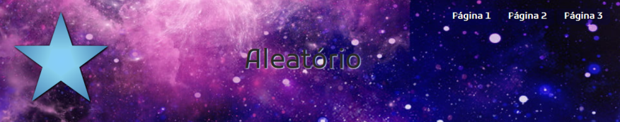
			   <figcaption>O layout com filtro fica desta forma. Ajuste cores e efeitos para seu desenho.</figcaption>
		   </li>
		   <li>
			   <input type="radio" id="341" name="sl">
			   <label for="341"></label>
			   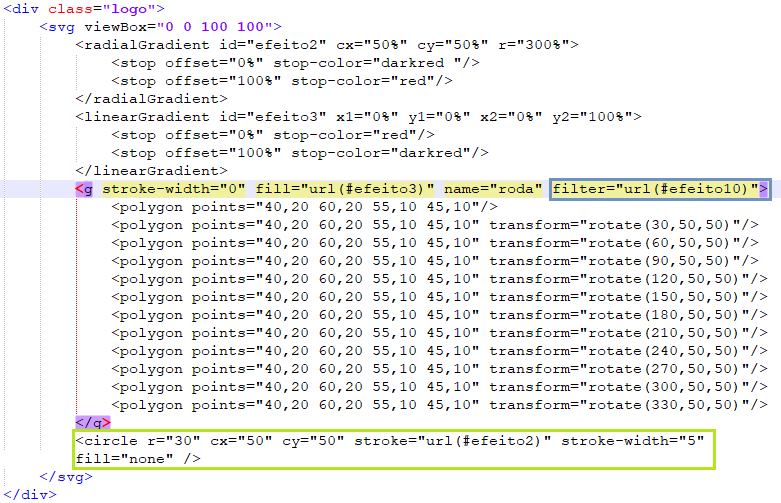
			   <figcaption>Na roda dentada, temos um problema: se colocarmos o filtro, as sombras dos trapézios ficarão sobre o desenho do círculo. Para corrigir este erro, podemos colocar a tag <code>&lt;circle&gt;</code> depois da tag do grupo dos dentes da roda. Assim, não aplicamos o filtro no círculo, deixando o desenho sobrepondo as sombras dos dentes da roda.</figcaption>
		   </li>
		   <li>
			   <input type="radio" id="342" name="sl">
			   <label for="342"></label>
			   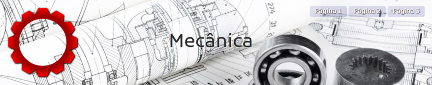
			   <figcaption>O desenho com filtro fica desta forma. Ajuste valores e cores do filtro, e se necessário, crie outro filtro para este desenho. A estrutura SVG do efeito de filtro 10 é a seguinte:
<pre><code>&lt;filter id="efeito10" x="-20" y="-20" height="50" width="50"&gt;
	&lt;feGaussianBlur in="SourceAlpha" stdDeviation="0.5" result="desfocado"&gt;&lt;/feGaussianBlur&gt;
	&lt;feOffset in="desfocado" dx="1" dy="1" result="sombra"&gt;&lt;/feOffset&gt;
	&lt;feMerge&gt;
		&lt;feMergeNode in="sombra"/&gt;
		&lt;feMergeNode in="desfocado"/&gt;
		&lt;feMergeNode in="SourceGraphic"/&gt;
	&lt;/feMerge&gt;
&lt;/filter&gt;</code></pre></figcaption>
		   </li>
		</ul>
		
  

	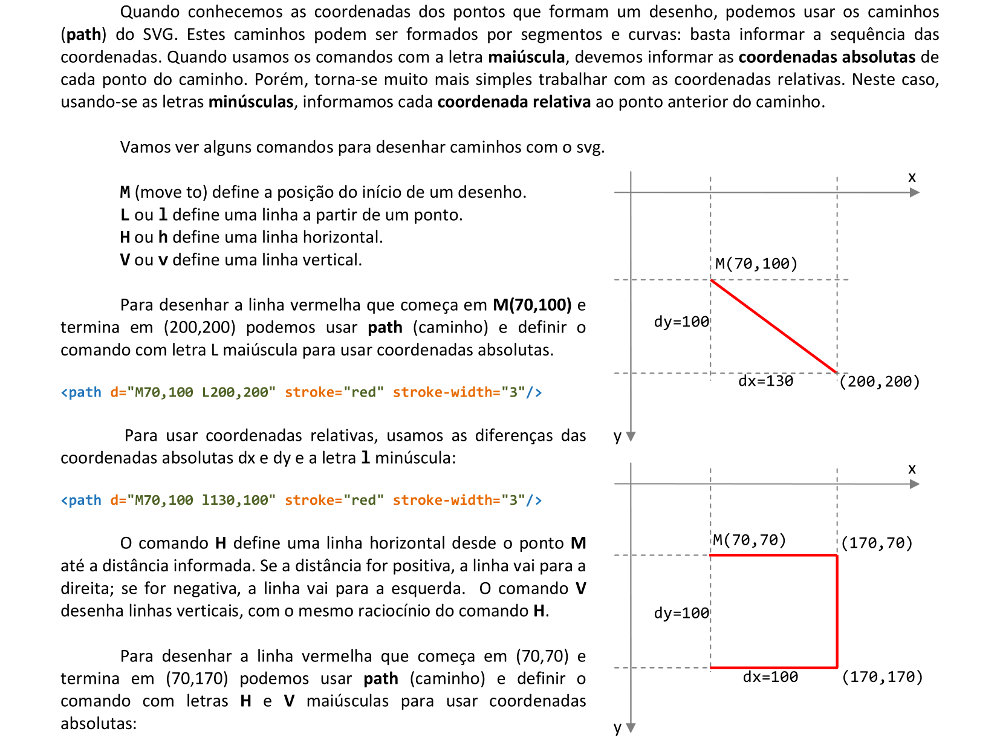
	
<a href="#css4" class="topo">voltar ao topo</a>

	

		<iframe width="100%" src="https://www.youtube.com/embed/Go-n5SUpy7o" frameborder="0" allow="accelerometer; clipboard-write; encrypted-media; gyroscope; picture-in-picture" allowfullscreen></iframe>
    

	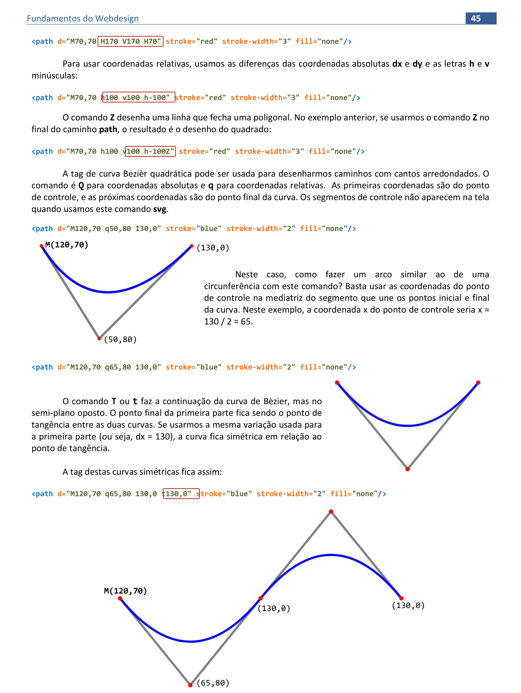
	
<a href="#css4" class="topo">voltar ao topo</a>

	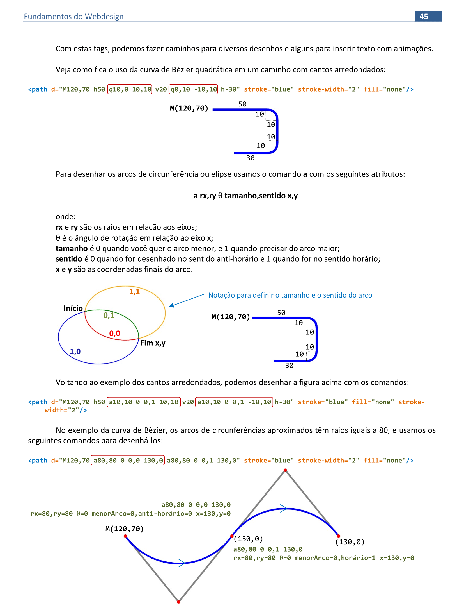
	
<a href="#css4" class="topo">voltar ao topo</a>

	

		<iframe width="100%" src="https://www.youtube.com/embed/RvqjM3mcX94" frameborder="0" allow="accelerometer; clipboard-write; encrypted-media; gyroscope; picture-in-picture" allowfullscreen></iframe>
    

	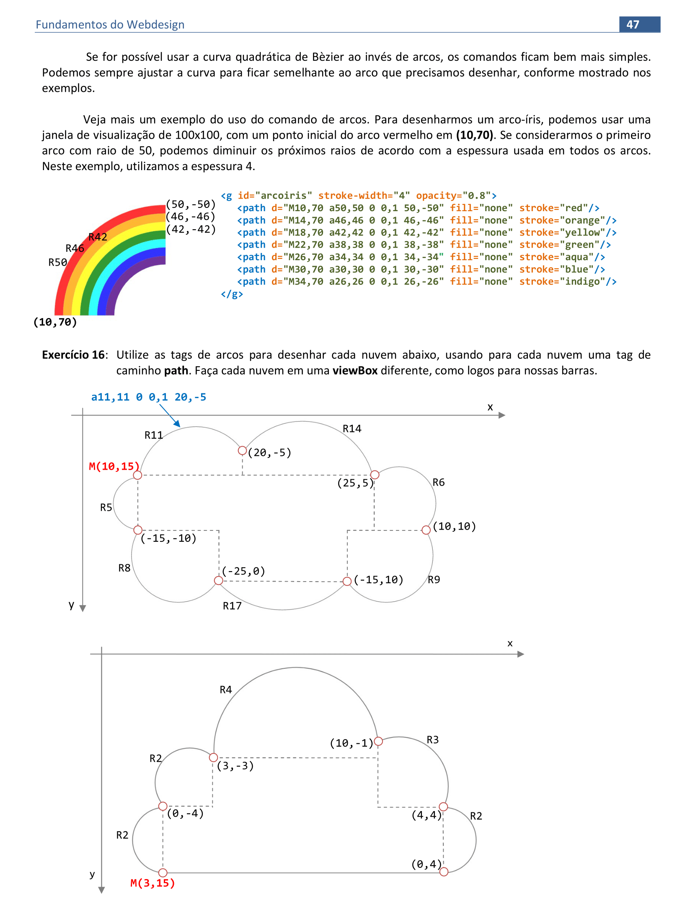
	

&#x1f4c3; 6&deg; e 7&deg; banners

	
Vamos desenhar nuvens com arcos nos dois banners deste exercício. Escolha imagens para colocar nos fundos destas tags: <code>imagens/banner6.jpg</code> e <code>imagens/banner7.jpg</code>.

	  <ul class="slider">
		  <li>
			   <input type="radio" id="342b" name="sl">
			   <label for="342b"></label>
			   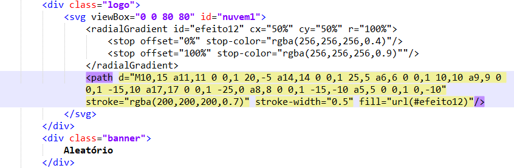
			   <figcaption>Crie uma tag <code>class="barra"</code> e vamos desenhar a nuvem na tag <code>class="logo"</code>. O desenho da nuvem pode ser feito com apenas um caminho <code>&lt;path&gt;</code>, pois temos os raios e as coordenadas relativas das extremidades de cada arco.</figcaption>
		   </li>
		  <li>
			   <input type="radio" id="343" name="sl">
			   <label for="343"></label>
			   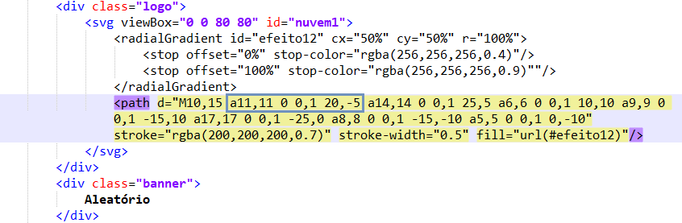
			   <figcaption>O primeiro arco tem raio 11, sentido horário e termina em (20,-5) Logo, o comando fica <code>a11,11 0 0,1 20,-5</code>. Todos os arcos estão sem inclinação, são os menores e estão no sentido horário. Logo, a parte central dos comandos será igual para todos os arcos: <code>0 0,1</code>.</figcaption>
		   </li>
		   <li>
			   <input type="radio" id="344" name="sl">
			   <label for="344"></label>
			   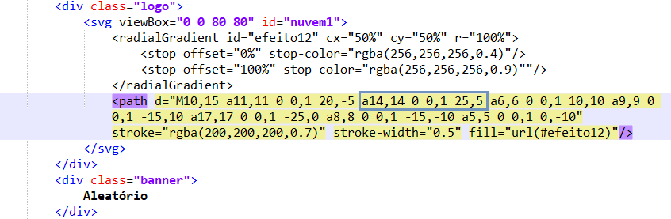
			   <figcaption>O segundo arco tem raio 14 e termina no ponto de coordenadas relativas (25,5). Seu comando fica <code>a14,14 0 0,1 25,5</code>. Os outros arcos são feitos de maneira análoga.</figcaption>
		   </li>
		   <li>
			   <input type="radio" id="345" name="sl">
			   <label for="345"></label>
			   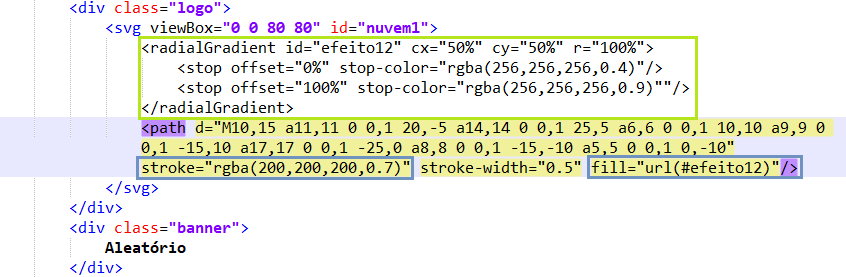
			   <figcaption>Podemos criar um efeito gradiente radial para a nuvem, com transparência de cor com o comando RGBA. A linha também pode ter cor com transparência. Ajuste cores e a espessura das linhas para seu desenho.</figcaption>
		   </li>
		   <li>
			   <input type="radio" id="346" name="sl">
			   <label for="346"></label>
			   
			   <figcaption>O banner com desenho da primeira nuvem fica com esse layout.</figcaption>
		   </li>
		   <li>
			   <input type="radio" id="346a" name="sl">
			   <label for="346a"></label>
			   <figcaption>Estrutura SVG do 6&ordm; banner:
<pre><code>&lt;div class="logo"&gt;
	&lt;svg viewBox="0 0 80 80" id="nuvem1"&gt;
		&lt;radialGradient id="efeito12" cx="50%" cy="50%" r="100%"&gt;
			&lt;stop offset="0%" stop-color="rgba(256,256,256,0.4)"/&gt;
			&lt;stop offset="100%" stop-color="rgba(256,256,256,0.9)""/&gt;
		&lt;/radialGradient&gt;
		&lt;path d="M10,15 a11,11 0 0,1 20,-5 a14,14 0 0,1 25,5 a6,6 0 0,1 10,10 a9,9 0 0,1 -15,10 a17,17 0 0,1 -25,0 a8,8 0 0,1 -15,-10 a5,5 0 0,1 0,-10" stroke="rgba(200,200,200,0.7)" stroke-width="0.5" fill="url(#efeito12)"/&gt;
	&lt;/svg&gt;
&lt;/div&gt;
&lt;div class="banner"&gt;
	Aleatório
&lt;/div&gt;</code></pre></figcaption>
		   </li>
		   <li>
			   <input type="radio" id="347" name="sl">
			   <label for="347"></label>
			   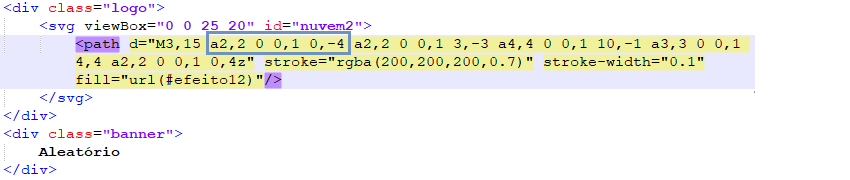
			   <figcaption>Crie uma nova tag <code>class="barra"</code> para desenhar a próxima nuvem. O comando do primeiro arco, de raio 2, que termina no ponto de coordenadas relativas (0,-4) fica <code>a2,2 0 0,1 0,-4</code>.</figcaption>
		   </li>
		   <li>
			   <input type="radio" id="348" name="sl">
			   <label for="348"></label>
			   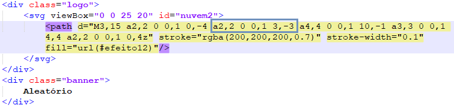
			   <figcaption>O comando do segundo arco, de raio 2, que termina no ponto de coordenadas relativas (3,-3) fica <code>a2,2 0 0,1 3,-3</code>. Os outros arcos são feitos de maneira análoga. Note que para finalizar a nuvem, com a linha horizontal usamos a letra <b>Z</b> depois das coordenadas do último arco.</figcaption>
		   </li>
		   <li>
			   <input type="radio" id="349" name="sl">
			   <label for="349"></label>
			   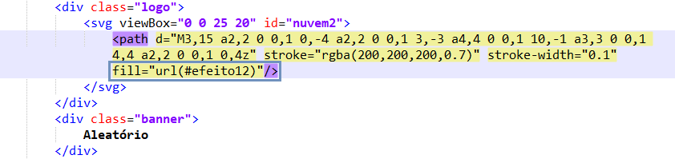
			   <figcaption>Podemos usar o mesmo efeito de preenchimento da outra nuvem. Se necessário, crie outro efeito de gradiente para este desenho. Ajuste cores e espessura das linhas para seu desenho.</figcaption>
		   </li>
		   <li>
			   <input type="radio" id="350" name="sl">
			   <label for="350"></label>
			   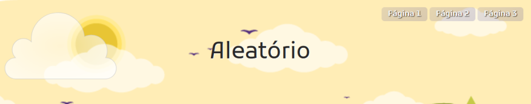
			   <figcaption>O desenho da nuvem no layout de banner fica desta forma.</figcaption>
		   </li>
		   <li>
			   <input type="radio" id="350a" name="sl">
			   <label for="350a"></label>
			   <figcaption>Estrutura SVG do 7&ordm; banner:
<pre><code>&lt;div class="logo"&gt;
	&lt;svg viewBox="0 0 25 20" id="nuvem2"&gt;
		&lt;path d="M3,15 a2,2 0 0,1 0,-4 a2,2 0 0,1 3,-3 a4,4 0 0,1 10,-1 a3,3 0 0,1 4,4 a2,2 0 0,1 0,4z" stroke="rgba(200,200,200,0.7)" stroke-width="0.1" fill="url(#efeito12)"/&gt;
	&lt;/svg&gt;
&lt;/div&gt;
&lt;div class="banner"&gt;
	Aleatório
&lt;/div&gt;</code></pre></figcaption>
		   </li>
		</ul>
		
  

	
<a href="#css4" class="topo">voltar ao topo</a>

	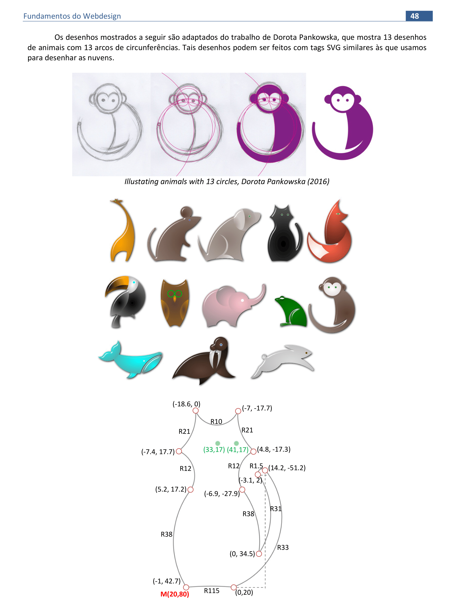
	
<a href="#css4" class="topo">voltar ao topo</a>

	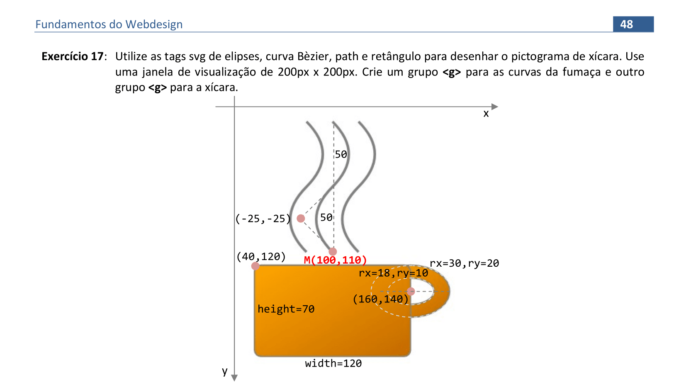
	

&#x1f4c3; 8&deg; banner

	
Vamos desenhar uma xícara neste exercício. Escolha uma imagem de fundo e salve-a em <code>imagens/banner8.jpg</code>. Não esqueça de atualizar o arquivo CSS com o atributo <code>.barra: nth-child(8) {background: url(imagens/banner8.jpg);}</code>.

	  <ul class="slider">
		  <li>
			   <input type="radio" id="351" name="sl">
			   <label for="351"></label>
			   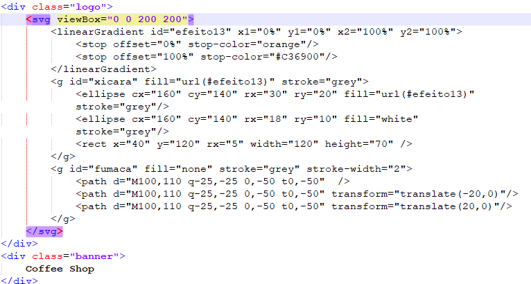
			   <figcaption>Crie uma tag <code>class="barra"</code> e vamos desenhar a xícara na tag <code>class="logo"</code>. A janela de visualização pode ficar com tamanho de 200 x 200 pixels.</figcaption>
		   </li>
		  <li>
			   <input type="radio" id="352" name="sl">
			   <label for="352"></label>
			   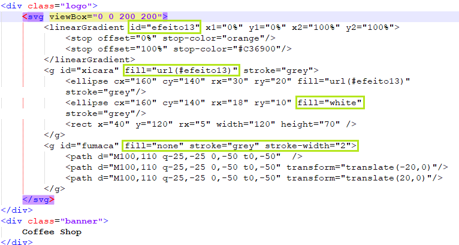
			   <figcaption>Podemos criar um efeito gradiente para este desenho. Escolha as cores e crie o efeito. Neste caso, o efeito começa em <code>x1=0%, y1=0%</code> e termina em <code>x2="100%", y2="100%"</code>, ou seja, será feito na diagonal. Vamos criar duas elipses que formam o cabo: a maior com preenchimento igual ao da xícara e a menor com preenchimento branco.</figcaption>
		   </li>
		   <li>
			   <input type="radio" id="353" name="sl">
			   <label for="353"></label>
			   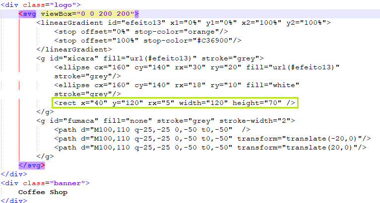
			   <figcaption>A xícara será um retângulo com as medidas indicadas no desenho da apostila. Podemos colocar cantos arredondados com <code>rx="5"</code>. As elipses formam o cabo da xícara, com as medidas dos centros coincidentes, mudando apenas as medidas dos raios. Ajuste valores e cores no seu desenho.</figcaption>
		   </li>
		   <li>
			   <input type="radio" id="354" name="sl">
			   <label for="354"></label>
			   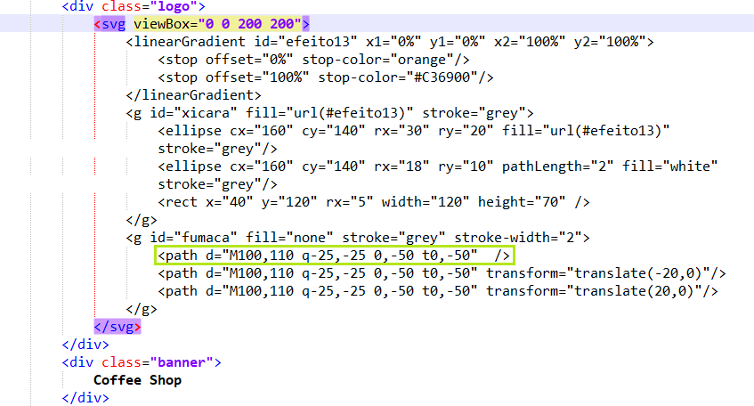
			   <figcaption>No grupo <code>&lt;g id="fumaca"&gt;</code> podemos desenhar os arcos com comandos de curvas Bèzier, com as medidas indicadas na apostila. O primeiro arco tem ponto de controle em (-25,-25) e finaliza em (0,-50). Logo, o comando fica <code>q-25,-25 0,-50</code>. O comando <code>t0,-50</code> faz a parte simétrica da curva.</figcaption>
		   </li>
		   <li>
			   <input type="radio" id="355" name="sl">
			   <label for="355"></label>
			   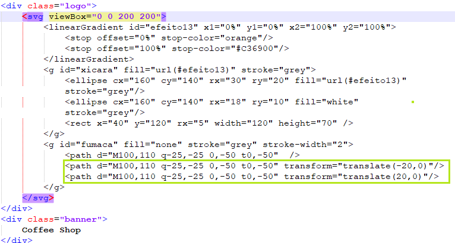
			   <figcaption>Os outros dois arcos podem ser feitos com translação à direita e à esquerda com 20px: <code>transform="translate(-20,0)"</code> e <code>transform="translate(20,0)"</code>.</figcaption>
		   </li>
		   <li>
			   <input type="radio" id="356" name="sl">
			   <label for="356"></label>
			   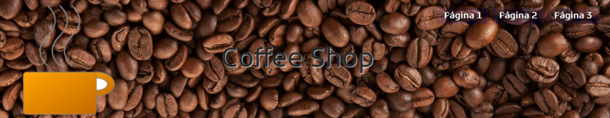
			   <figcaption>Se o fundo do banner for branco, não temos problemas com as elipses. Podemos substituí-las por caminhos de arcos <code>&lt;path&gt;</code> para que tenham o fundo transparente.</figcaption>
		   </li>
		   <li>
			   <input type="radio" id="357" name="sl">
			   <label for="357"></label>
			   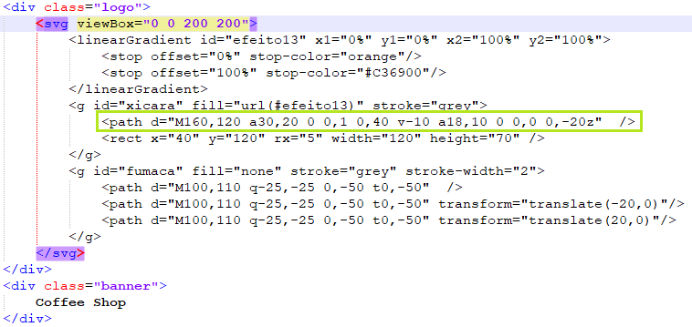
			   <figcaption>O caminho com arcos de elipse começa em <code>M160,120</code>, e tem o primeiro arco com raios 30 e 20, finalizando no ponto de coordenadas (0,40): <code>a30,20 0 0,1 0,40</code>. Depois temos uma linha vertical que sobe 10px e o arco menor, com raios 18 e 10, sentido anti-horário, que termina em (0,-20): <code>a18,10 0 0,0 0,-20</code>.</figcaption>
		   </li>
		   <li>
			   <input type="radio" id="358" name="sl">
			   <label for="358"></label>
			   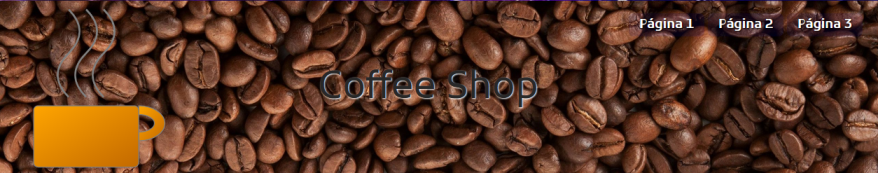
			   <figcaption>O layout com o caminho de arcos fica assim. Ajuste cores de linhas e de preenchimentos para este banner.</figcaption>
		   </li>
		   <li>
			   <input type="radio" id="358a" name="sl">
			   <label for="358a"></label>
			   <figcaption>Estrutura SVG do 8&ordm; banner:
<pre><code>&lt;svg viewBox="0 0 200 200"&gt;
	&lt;linearGradient id="efeito13" x1="0%" y1="0%" x2="100%" y2="100%"&gt;
		&lt;stop offset="0%" stop-color="orange"/&gt;
		&lt;stop offset="100%" stop-color="#C36900"/&gt;
	&lt;/linearGradient&gt;
	&lt;g id="xicara" fill="url(#efeito13)" stroke="grey"&gt;
		&lt;ellipse cx="160" cy="140" rx="30" ry="20" fill="url(#efeito13)" stroke="grey"/&gt;
		&lt;ellipse cx="160" cy="140" rx="18" ry="10" pathLength="2" fill="white" stroke="grey"/&gt;
		&lt;path d="M160,120 a30,20 0 0,1 0,40 v-10 a18,10 0 0,0 0,-20z"/&gt;
	&lt;/g&gt;
	&lt;g id="fumaca" fill="none" stroke="grey" stroke-width="2"&gt;
		&lt;path d="M100,110 q-25,-25 0,-50 t0,-50"  /&gt;
		&lt;path d="M100,110 q-25,-25 0,-50 t0,-50" transform="translate(-20,0)"/&gt;
		&lt;path d="M100,110 q-25,-25 0,-50 t0,-50" transform="translate(20,0)"/&gt;
	&lt;/g&gt;
&lt;/svg&gt;</code></pre></figcaption>
		   </li>
		</ul>
		
  

	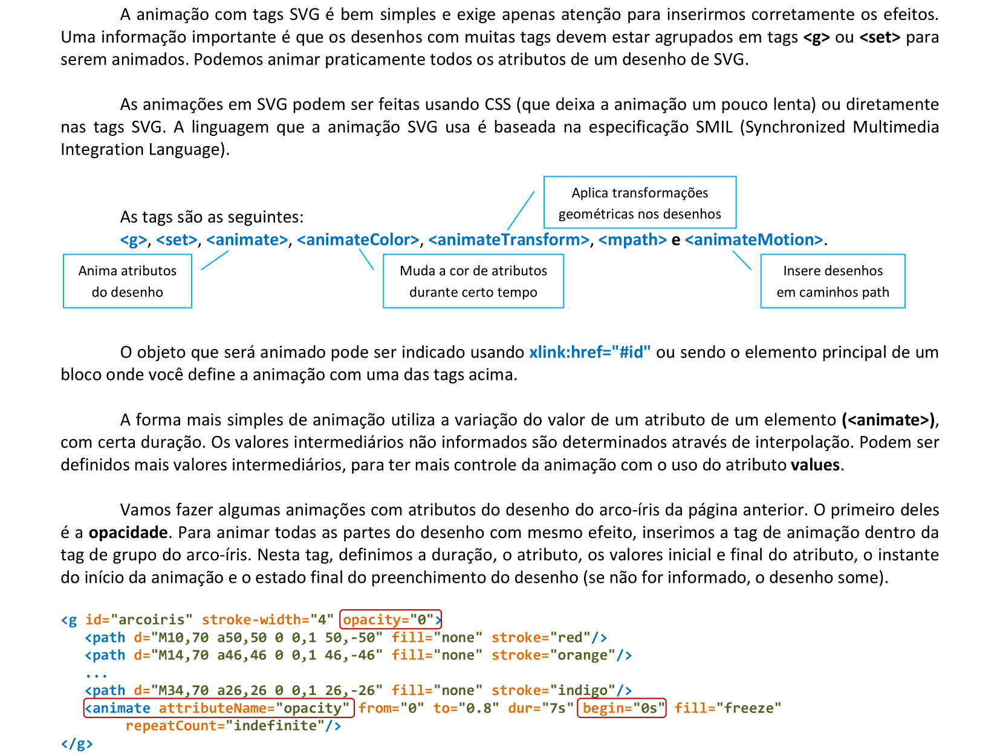
	
<a href="#css4" class="topo">voltar ao topo</a>

	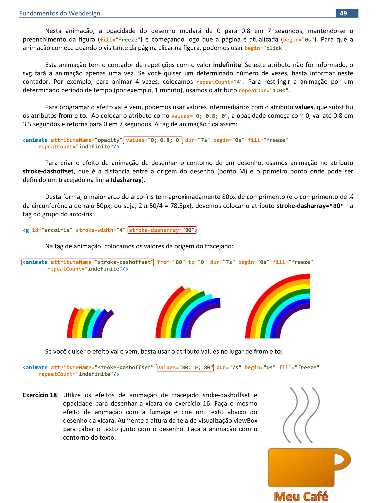
	

&#x1f4c3; Animações no 8&deg; banner

	
Vamos colocar efeitos de animações no banner da xícara.

	  <ul class="slider">
		  <li>
			   <input type="radio" id="359" name="sl">
			   <label for="359"></label>
			   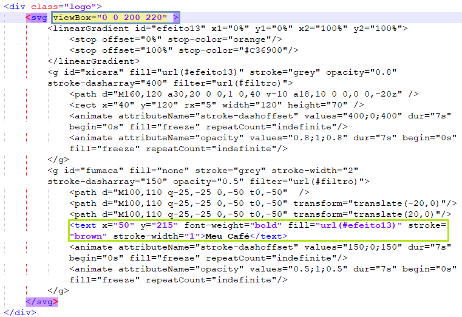
			   <figcaption>Vamos aumentar a janela de visualização do SVG da xícara para 200 x 220 pixels, inserindo a tag <code>&lt;text&gt;</code> para a logomarca.</figcaption>
		   </li>
		  <li>
			   <input type="radio" id="360" name="sl">
			   <label for="360"></label>
			   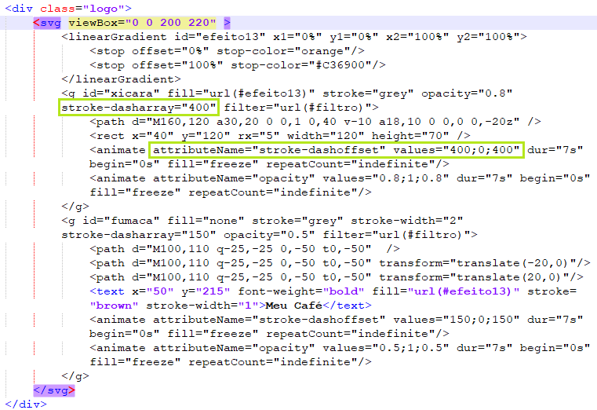
			   <figcaption>No grupo <code>id="xicara"</code>definimos o tracejado com 400 pixels e a animação de vai e vem, que começa o tracejado no ponto 400px, vai até 0px e retorna ao 400px. Assim, a animação é de desenhar o contorno da xícara. Note que o atributo <code>&lt;animate&gt;</code> fica dentro da tag de grupo da xícara.</figcaption>
		   </li>
		   <li>
			   <input type="radio" id="361" name="sl">
			   <label for="361"></label>
			   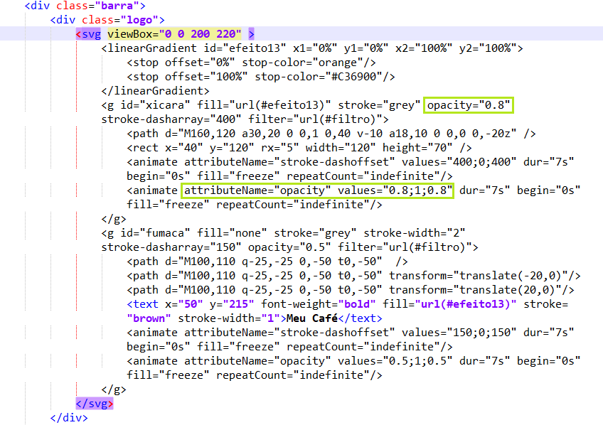
			   <figcaption>Outra animação pode ser feita com a opacidade. No grupo <code>id="xicara"</code>, defina a opacidade com 0.8. A tag de animação pode variar a opacidade de 0.8 até 1, retornando a 0.8. O efeito de animação também é de vai e vem.</figcaption>
		   </li>
		   <li>
			   <input type="radio" id="362" name="sl">
			   <label for="362"></label>
			   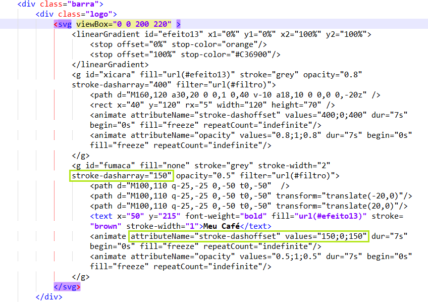
			   <figcaption>No grupo <code>id="fumaca"</code>, o efeito de desenhar os elementos necessita de um tracejado menor, de 150px. O mesmo efeito da xícara, de deslocamento do início do tracejado foi aplicado à fumaça e ao texto da logomarca.</figcaption>
		   </li>
		   <li>
			   <input type="radio" id="363" name="sl">
			   <label for="363"></label>
			   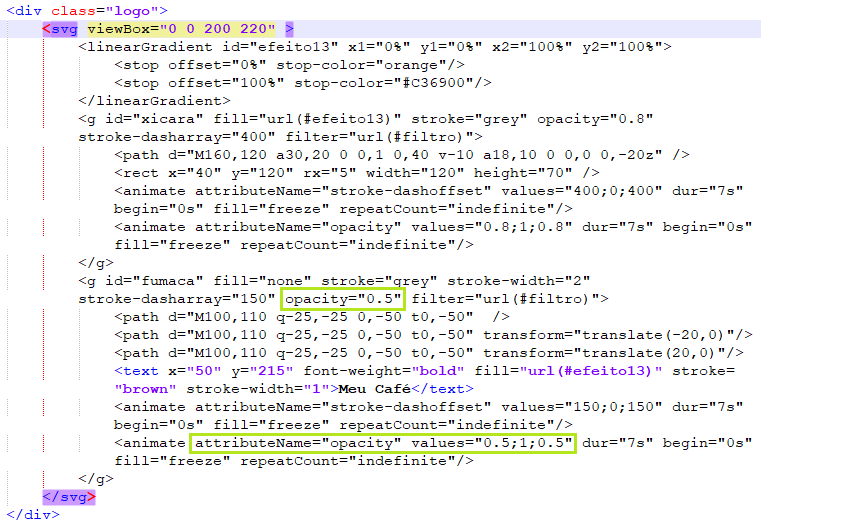
			   <figcaption>Podemos definir efeito de opacidade na fumaça e no texto. Neste caso, foi colocada opacidade inicial de 0.5, com a animação variando entre 0.5 e 1.</figcaption>
		   </li>
		   <li>
			   <input type="radio" id="364" name="sl">
			   <label for="364"></label>
			   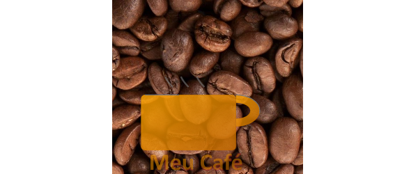
			   <figcaption>O efeito no início da animação fica assim.</figcaption>
		   </li>
		   <li>
			   <input type="radio" id="365" name="sl">
			   <label for="365"></label>
			   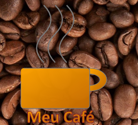
			   <figcaption>E no final, com opacidade e os desenhos dos contornos completos, fica dessa forma. Ajuste os valores para animação no seu banner da xícara.</figcaption>
		   </li>
		   <li>
			   <input type="radio" id="365a" name="sl">
			   <label for="365a"></label>
			   <figcaption>Estrutura SVG das animações do 8&ordm; banner:
<pre><code>&lt;svg viewBox="0 0 200 220" &gt;
	&lt;linearGradient id="efeito13" x1="0%" y1="0%" x2="100%" y2="100%"&gt;
		&lt;stop offset="0%" stop-color="orange"/&gt;
		&lt;stop offset="100%" stop-color="#C36900"/&gt;
	&lt;/linearGradient&gt;
	&lt;g id="xicara" fill="url(#efeito13)" stroke="grey" opacity="0.8" stroke-dasharray="400" filter="url(#filtro)"&gt;
		&lt;path d="M160,120 a30,20 0 0,1 0,40 v-10 a18,10 0 0,0 0,-20z" /&gt;
		&lt;rect x="40" y="120" rx="5" width="120" height="70" /&gt;
		&lt;animate attributeName="stroke-dashoffset" values="400;0;400" dur="7s" begin="0s" fill="freeze" repeatCount="indefinite"/&gt;
		&lt;animate attributeName="opacity" values="0.8;1;0.8" dur="7s" begin="0s" fill="freeze" repeatCount="indefinite"/&gt;
	&lt;/g&gt;
	&lt;g id="fumaca" fill="none" stroke="grey" stroke-width="2" stroke-dasharray="150" opacity="0.5" filter="url(#filtro)"&gt; 
		&lt;path d="M100,110 q-25,-25 0,-50 t0,-50"  /&gt;
		&lt;path d="M100,110 q-25,-25 0,-50 t0,-50" transform="translate(-20,0)"/&gt;
		&lt;path d="M100,110 q-25,-25 0,-50 t0,-50" transform="translate(20,0)"/&gt;
		&lt;text x="50" y="215" font-weight="bold" fill="url(#efeito13)" stroke="brown" stroke-width="1"&gt;Meu Café&lt;/text&gt;
		&lt;animate attributeName="stroke-dashoffset" values="150;0;150" dur="7s" begin="0s" fill="freeze" repeatCount="indefinite"/&gt;
		&lt;animate attributeName="opacity" values="0.5;1;0.5" dur="7s" begin="0s" fill="freeze" repeatCount="indefinite"/&gt;
	&lt;/g&gt;
&lt;/svg&gt;</code></pre></figcaption>
		   </li> 
		</ul>
		
  

	
<a href="#css4" class="topo">voltar ao topo</a>

	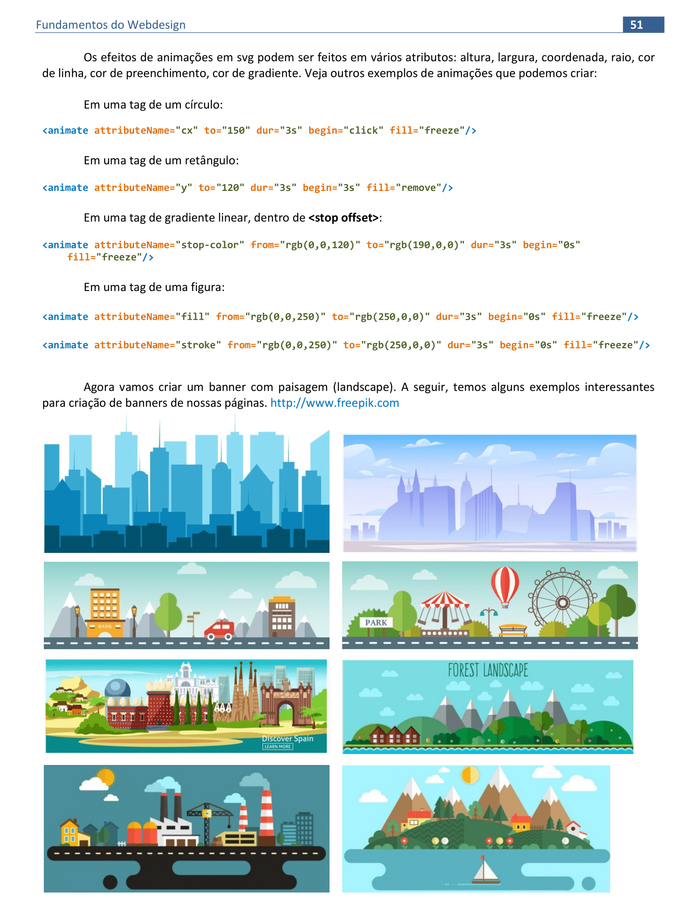
	
<a href="#css4" class="topo">voltar ao topo</a>

	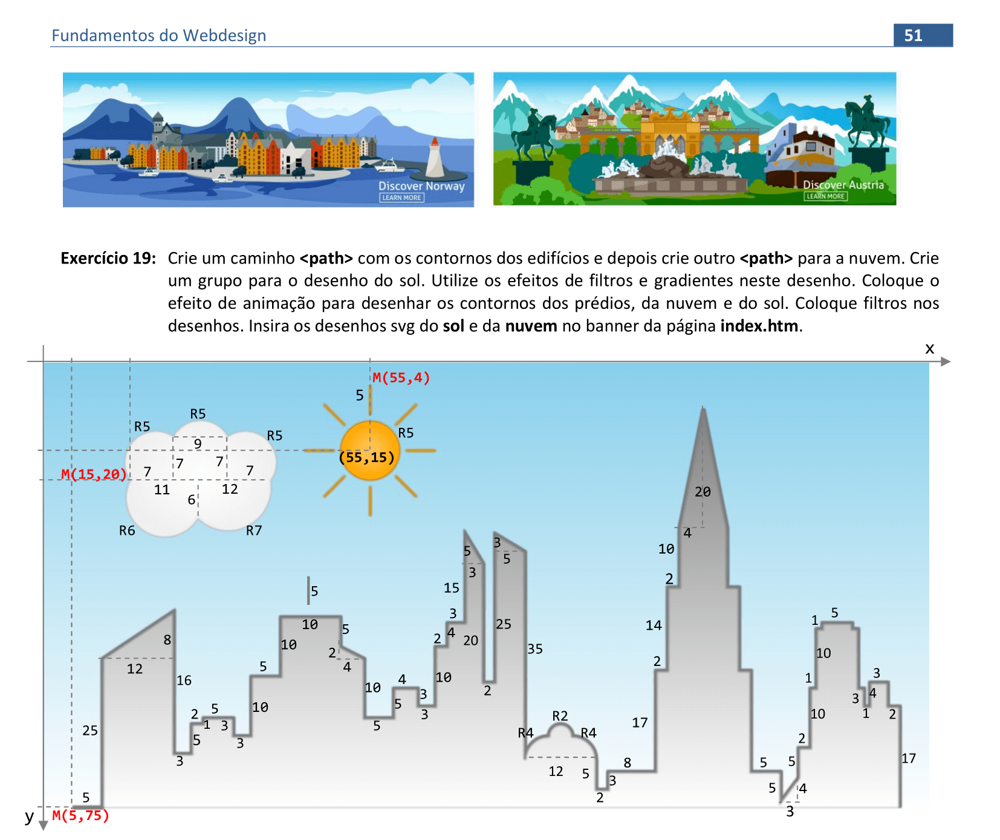
	

&#x1f4c3; 9&deg; banner

	
Vamos criar o outro banner em uma nova classe: <code>class="banner2"</code>.

	  <ul class="slider">
		  <li>
			   <input type="radio" id="366" name="sl">
			   <label for="366"></label>
			   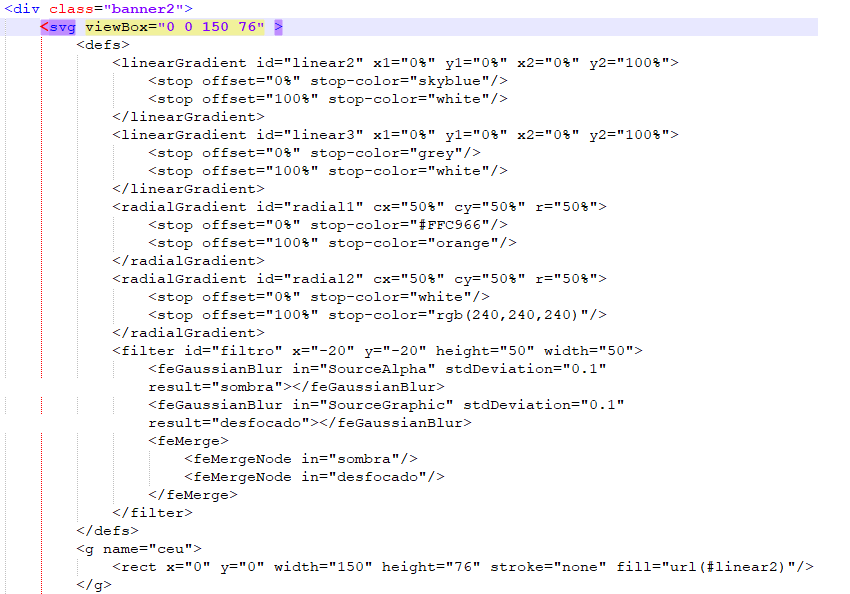
			   <figcaption>Neste banner, vamos criar a paisagem junto com a logomarca e o menu. Ao invés de usar <code>class="barra"</code>, vamos criar a estrutura <code>&lt;svg&gt;</code> dentro da tag <code>class="banner2"</code>.</figcaption>
		   </li>
		  <li>
			   <input type="radio" id="367" name="sl">
			   <label for="367"></label>
			   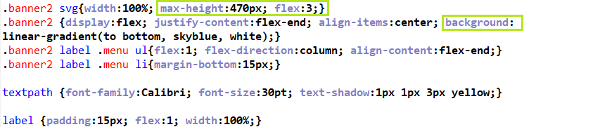
			   <figcaption>No arquivo CSS, vamos definir os atributos da classe <code>.banner2</code>. A altura máxima será fixada em 470px, com largura <code>flex:3</code>. O fundo pode ter o mesmo efeito de gradiente usado no desenho SVG.</figcaption>
		   </li>
		   <li>
			   <input type="radio" id="368" name="sl">
			   <label for="368"></label>
			   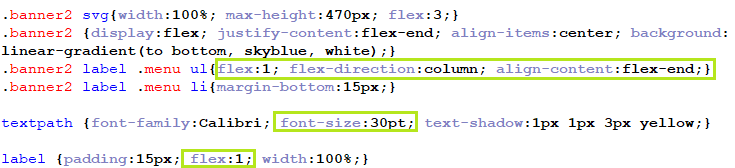
			   <figcaption>O menu terá largura <code>flex:1</code> e pode ser configurado na vertical (column) e com alinhamento à direita (flex-end). Veja qual configuração fica melhor no seu layout de banner. Podemos definir o tamanho da fonte da tag <code>textpath</code>, que usaremos adiante.</figcaption>
		   </li>
		   <li>
			   <input type="radio" id="369" name="sl">
			   <label for="369"></label>
			   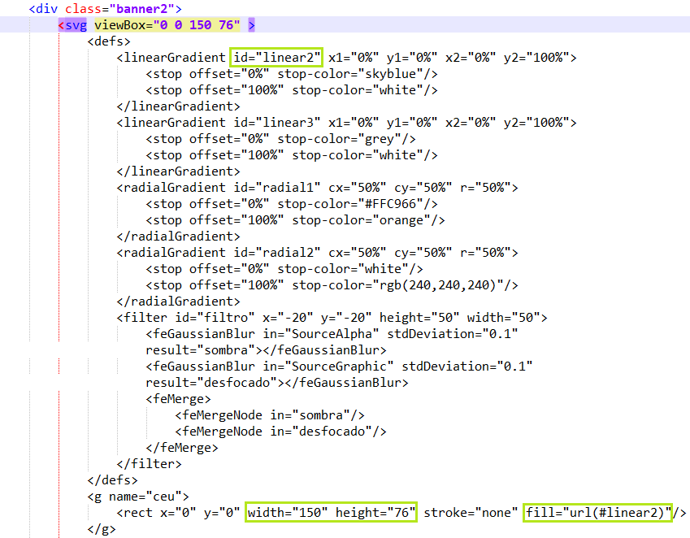
			   <figcaption>Podemos definir os efeitos gradientes do céu <code>id="linear2"</code>, variando de azul claro para branco. O retângulo que define o céu tem mesma dimensão da janela de visualização do svg: 150 x 76 pixels.</figcaption>
		   </li>
		   <li>
			   <input type="radio" id="370" name="sl">
			   <label for="370"></label>
			   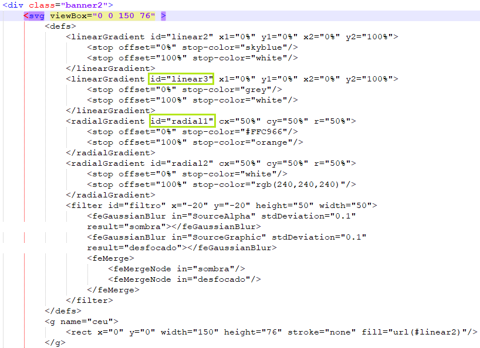
			   <figcaption>Definimos também os efeitos gradientes do perfil arquitetônico e do sol: <code>id="linear3"</code> e <code>id="radial1"</code>.</figcaption>
		   </li>
		   <li>
			   <input type="radio" id="371" name="sl">
			   <label for="371"></label>
			   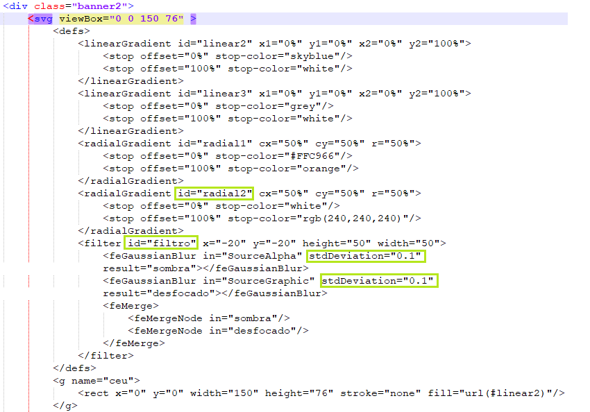
			   <figcaption>Podemos definir um efeito gradiente para as nuvens <code>id="radial2"</code> e um filtro <code>id="filtro"</code> para desfocar o desenho e as sombras, com desvio padrão 0.1. Ajuste valores e cores para seu desenho de banner.</figcaption>
		   </li>
		   <li>
			   <input type="radio" id="372" name="sl">
			   <label for="372"></label>
			   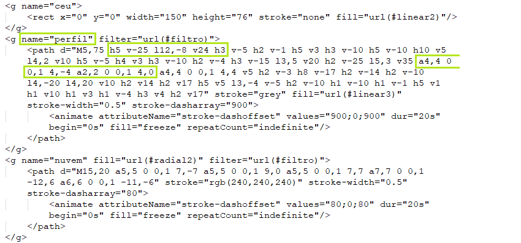
			   <figcaption>Com apenas uma tag de caminho <code>&lt;path&gt;</code> podemos definir o perfil arquitetônico: começando no ponto (5,75), a primeira linha é horizontal <code>h5</code>, que sobe com uma linha vertical <code>v-25</code>, passa por uma linha inclinada <code>l12,-8</code>, desce com a linha vertical <code>v24</code> e passa pela linha horizontal <code>h3</code>.</figcaption>
		   </li>
		   <li>
			   <input type="radio" id="372a" name="sl">
			   <label for="372a"></label>
			   
			   <figcaption>Os arcos que aparecem têm raios iguais a 4 e 2 e são desenhados no sentido horário. Os comandos dos dois primeiros arcos ficam como: <code>a4,4 0 0,1 4,-4</code> e <code>a2,2 0 0,1 4,0</code>.</figcaption>
		   </li>
		   <li>
			   <input type="radio" id="373" name="sl">
			   <label for="373"></label>
			   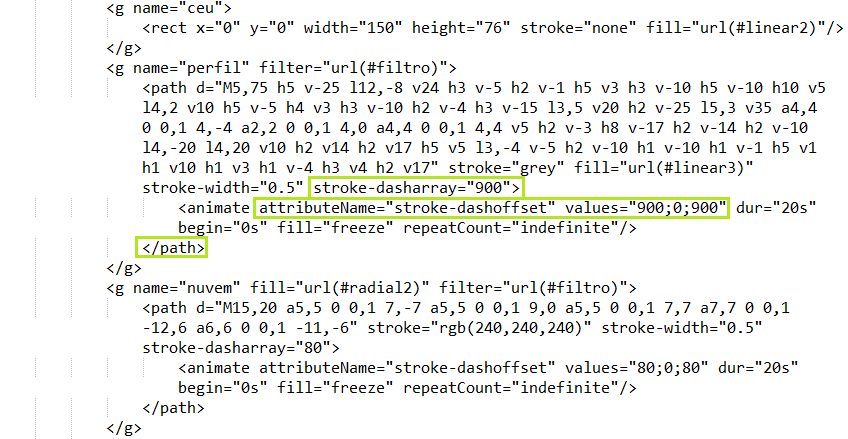
			   <figcaption>Usando a animação que faz o efeito de desenhar o perfil, definimos o tracejado com 900px e a variação do ponto de início do tracejado de 900 para 0, voltando depois para 900. Note que precisamos fechar a tag <code>&lt;path&gt;</code>, pois inserimos a animação no caminho do desenho do perfil.</figcaption>
		   </li>
		   <li>
			   <input type="radio" id="374" name="sl">
			   <label for="374"></label>
			   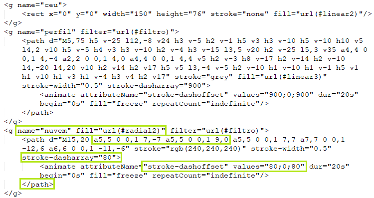
			   <figcaption>A tag <code>name="nuvem"</code> tem o gradiente indicado por <code>url(#radial2)</code>. O desenho é similar aos de nuvens que já fizemos: os dois primeiros arcos têm raios de 5px, sentido horário, e finalizam nos pontos com coordenadas relativas (7,-7) e (9,0). Os outros arcos são desenhados da mesma forma. Podemos definir o tracejado do desenho da nuvem com 80px, e o efeito de desenhar a nuvem que começa em 80px, vai até 0 e volta para 80px. Esta tag de animação está dentro da tag de caminho da nuvem, que precisa ser fechada: <code>&lt;/path&gt;</code>.</figcaption>
		   </li>
		   <li>
			   <input type="radio" id="375" name="sl">
			   <label for="375"></label>
			   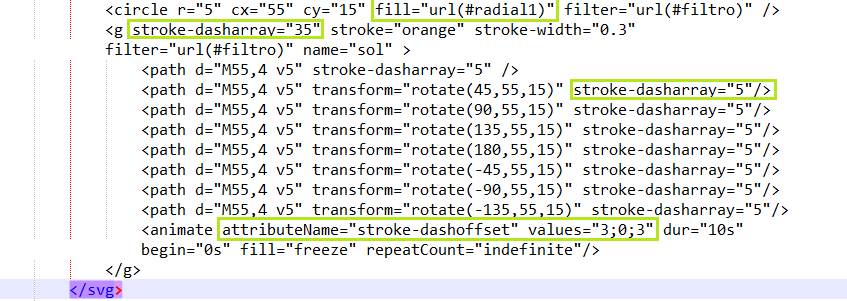
			   <figcaption>No desenho do sol, temos o efeito de gradiente <code>url(#radial1)</code> e o tracejado com tamanho 35px. Em cada <code>&lt;path&gt;</code> de raio, precisamos definir o tamanho do tracejado de 5px. Assim, a animação pode ser usada com valores de 0 a 5. Neste caso, estão com 3px, ou seja, os raios não sumirão. Se colocarmos 5px, os raios somem e voltam. Teste valores para a animação do seu banner.</figcaption>
		   </li>
		   <li>
			   <input type="radio" id="376" name="sl">
			   <label for="376"></label>
			   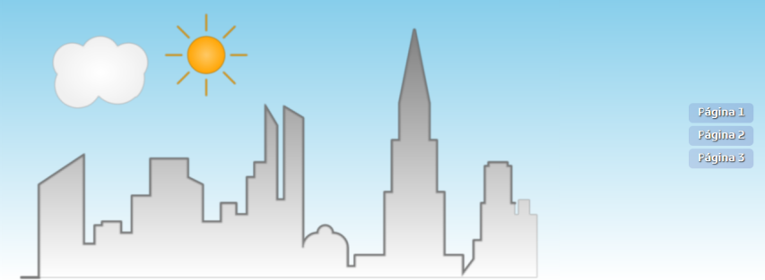
			   <figcaption>Este é o layout do banner com as configurações mostradas. Ajuste cores e valores de atributos para o seu banner.</figcaption>
		   </li>
		   <li>
			   <input type="radio" id="376a" name="sl">
			   <label for="376a"></label>
			   <figcaption>Trecho da estrutura CSS do 9&ordm; banner, configurando o novo banner:
<pre><code>.banner2 svg{width:100%; max-height:470px; flex:3;}
.banner2 {display:flex; justify-content:flex-end; align-items:center; background:linear-gradient(to bottom, skyblue, white);}
.banner2 label .menu ul{flex:1; flex-direction:column; align-content:flex-end;}
.banner2 label .menu li{margin-bottom:15px;}

textpath {font-family:Calibri; font-size:30pt; text-shadow:1px 1px 3px yellow;}

label {padding:15px; flex:1; width:100%;}</code></pre>1&ordf; parte da estrutura HTML do 9&ordm; banner:
<pre><code>&lt;div class="banner2"&gt;
	&lt;svg viewBox="0 0 150 76" &gt;
		&lt;defs&gt;
			&lt;linearGradient id="linear2" x1="0%" y1="0%" x2="0%" y2="100%"&gt;
				&lt;stop offset="0%" stop-color="skyblue"/&gt;
				&lt;stop offset="100%" stop-color="white"/&gt;
			&lt;/linearGradient&gt;
			&lt;linearGradient id="linear3" x1="0%" y1="0%" x2="0%" y2="100%"&gt;
				&lt;stop offset="0%" stop-color="grey"/&gt;
				&lt;stop offset="100%" stop-color="white"/&gt;
			&lt;/linearGradient&gt;
			&lt;radialGradient id="radial1" cx="50%" cy="50%" r="50%"&gt;
				&lt;stop offset="0%" stop-color="#FFC966"/&gt;
				&lt;stop offset="100%" stop-color="orange"/&gt;
			&lt;/radialGradient&gt;
			&lt;radialGradient id="radial2" cx="50%" cy="50%" r="50%"&gt;
				&lt;stop offset="0%" stop-color="white"/&gt;
				&lt;stop offset="100%" stop-color="rgb(240,240,240)"/&gt;
			&lt;/radialGradient&gt;
			&lt;filter id="filtro" x="-20" y="-20" height="50" width="50"&gt;
				&lt;feGaussianBlur in="SourceAlpha" stdDeviation="0.1" result="sombra"&gt;&lt;/feGaussianBlur&gt;
				&lt;feGaussianBlur in="SourceGraphic" stdDeviation="0.1" result="desfocado"&gt;&lt;/feGaussianBlur&gt;
				&lt;feMerge&gt;
					&lt;feMergeNode in="sombra"/&gt;
					&lt;feMergeNode in="desfocado"/&gt;
				&lt;/feMerge&gt;
			&lt;/filter&gt;
		&lt;/defs&gt;</code></pre></figcaption>
		   </li>
		   <li>
			   <input type="radio" id="376b" name="sl">
			   <label for="376b"></label>
			   <figcaption>2&ordf; parte da estrutura SVG do 9&ordm; banner:
<pre><code>		&lt;g name="ceu"&gt;
			&lt;rect x="0" y="0" width="150" height="76" stroke="none" fill="url(#linear2)"/&gt;
		&lt;/g&gt;
		&lt;g name="perfil" filter="url(#filtro)"&gt;
			&lt;path d="M5,75 h5 v-25 l12,-8 v24 h3 v-5 h2 v-1 h5 v3 h3 v-10 h5 v-10 h10 v5 l4,2 v10 h5 v-5 h4 v3 h3 v-10 h2 v-4 h3 v-15 l3,5 v20 h2 v-25 l5,3 v35 a4,4 0 0,1 4,-4 a2,2 0 0,1 4,0 a4,4 0 0,1 4,4 v5 h2 v-3 h8 v-17 h2 v-14 h2 v-10 l4,-20 l4,20 v10 h2 v14 h2 v17 h5 v5 l3,-4 v-5 h2 v-10 h1 v-10 h1 v-1 h5 v1 h1 v10 h1 v3 h1 v-4 h3 v4 h2 v17" stroke="grey" fill="url(#linear3)" stroke-width="0.5" stroke-dasharray="900"&gt;
				&lt;animate attributeName="stroke-dashoffset" values="900;0;900" dur="20s" begin="0s" fill="freeze" repeatCount="indefinite"/&gt;
			&lt;/path&gt;
		&lt;/g&gt;
		&lt;g name="nuvem" fill="url(#radial2)" filter="url(#filtro)"&gt;
			&lt;path d="M15,20 a5,5 0 0,1 7,-7 a5,5 0 0,1 9,0 a5,5 0 0,1 7,7 a7,7 0 0,1 -12,6 a6,6 0 0,1 -11,-6" stroke="rgb(240,240,240)" stroke-width="0.5" stroke-dasharray="80"&gt;
				&lt;animate attributeName="stroke-dashoffset" values="80;0;80" dur="20s" begin="0s" fill="freeze" repeatCount="indefinite"/&gt;
			&lt;/path&gt;
		&lt;/g&gt;
		&lt;circle r="5" cx="55" cy="15" fill="url(#radial1)" filter="url(#filtro)" /&gt;
		&lt;g stroke-dasharray="35" stroke="orange" stroke-width="0.3" filter="url(#filtro)" name="sol" &gt;
			&lt;path d="M55,4 v5" stroke-dasharray="5" /&gt;
			&lt;path d="M55,4 v5" transform="rotate(45,55,15)" stroke-dasharray="5"/&gt;
			&lt;path d="M55,4 v5" transform="rotate(90,55,15)" stroke-dasharray="5"/&gt;
			&lt;path d="M55,4 v5" transform="rotate(135,55,15)" stroke-dasharray="5"/&gt;
			&lt;path d="M55,4 v5" transform="rotate(180,55,15)" stroke-dasharray="5"/&gt;
			&lt;path d="M55,4 v5" transform="rotate(-45,55,15)" stroke-dasharray="5"/&gt;
			&lt;path d="M55,4 v5" transform="rotate(-90,55,15)" stroke-dasharray="5"/&gt;
			&lt;path d="M55,4 v5" transform="rotate(-135,55,15)" stroke-dasharray="5"/&gt;
			&lt;animate attributeName="stroke-dashoffset" values="3;0;3" dur="10s" begin="0s" fill="freeze" repeatCount="indefinite"/&gt;
		&lt;/g&gt;
	&lt;/svg&gt;
	&lt;input type="checkbox" id="checkbox1"&gt;
	&lt;label for="checkbox1"&gt;
	&lt;nav class="menu"&gt;
		&lt;ul&gt;
			&lt;li&gt;&lt;a href="index.htm"&gt;Página 1&lt;/a&gt;&lt;/li&gt;
			&lt;li&gt;&lt;a href="pagina1.htm"&gt;Página 2&lt;/a&gt;&lt;/li&gt;
			&lt;li&gt;&lt;a href="pagina2.htm"&gt;Página 3&lt;/a&gt;&lt;/li&gt;
		&lt;/ul&gt;
	&lt;/nav&gt;
	&lt;span class="toggle"&gt;&amp;#9776;&lt;/span&gt;
	&lt;/label&gt;
&lt;/div&gt;</code></pre></figcaption>
		   </li>
		</ul>
		
  

	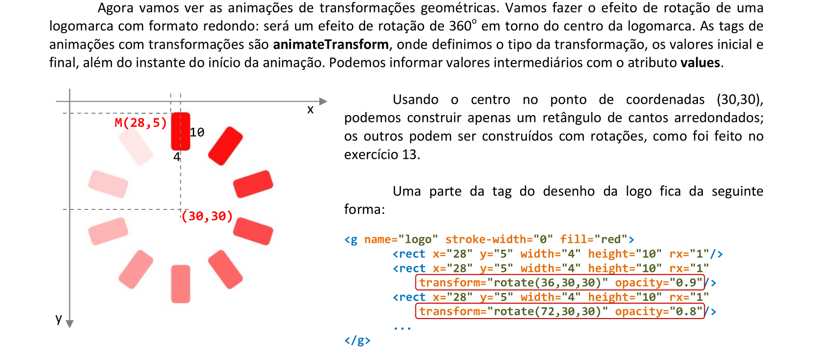
	
<a href="#css4" class="topo">voltar ao topo</a>

	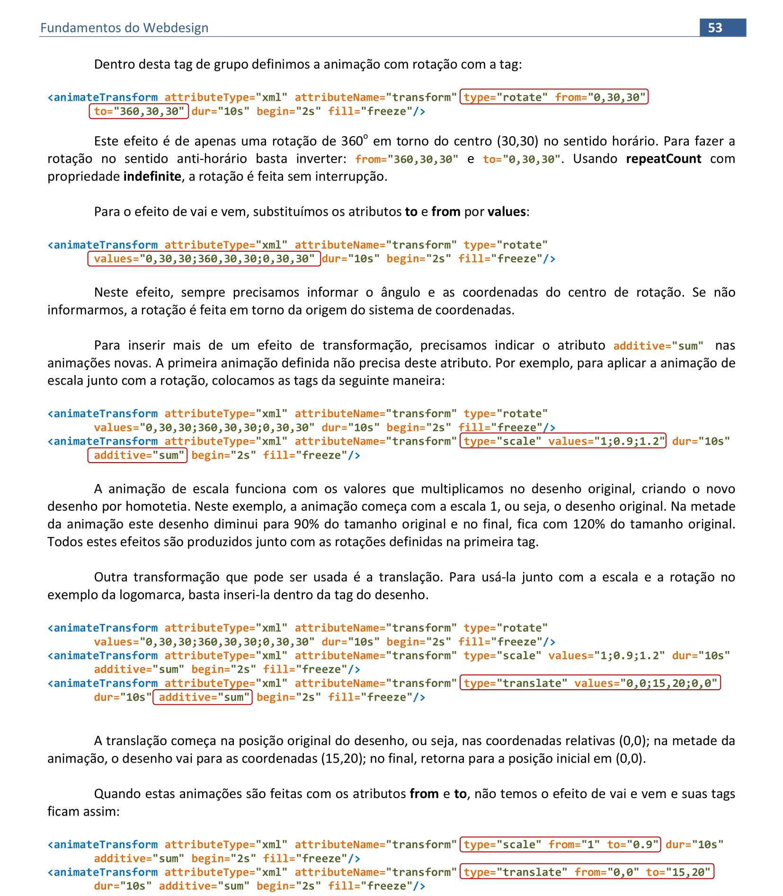
	

&#x1f4c3; 10&deg; banner: animações

	
Vamos criar o outro banner usando: <code>class="barra"</code>. Insira uma imagem de fundo para este banner na pasta <code>imagens/banner10.jpg</code>

	  <ul class="slider">
		  <li>
			   <input type="radio" id="377" name="sl">
			   <label for="377"></label>
			   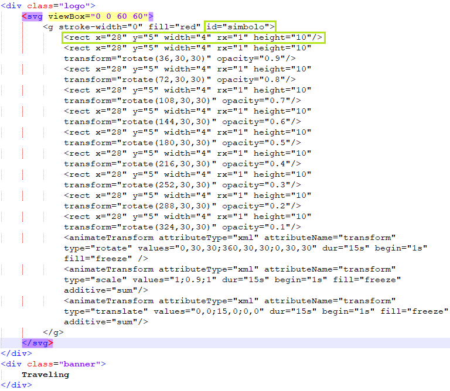
			   <figcaption>Dentro da tag <code>class="logo"</code> vamos desenhar um dos retângulos com as medidas indicadas na apostila. Os cantos arredondados podem ser feitos com o atributo <code>rx="1"</code>.</figcaption>
		   </li>
		   <li>
			   <input type="radio" id="378" name="sl">
			   <label for="378"></label>
			   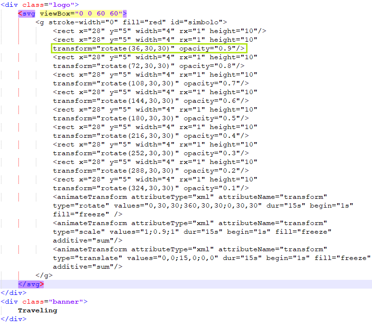
			   <figcaption>O segundo retângulo tem mesma tag do primeiro, sendo rotacionado com ângulo de 36&deg; em torno do centro (30,30). Mudamos a opacidade para <code>opacity="0.9"</code>.</figcaption>
		   </li>
		   <li>
			   <input type="radio" id="379" name="sl">
			   <label for="379"></label>
			   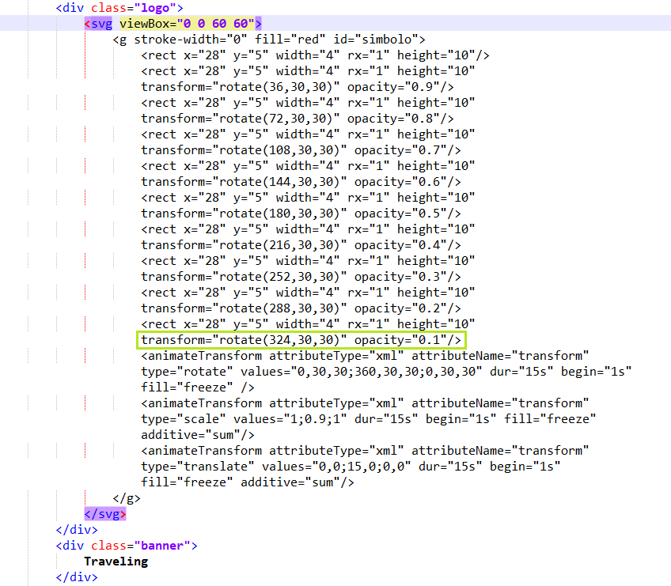
			   <figcaption>Os outros retângulos são rotacionados de 36&deg; em 36&deg;, até chegar em 324&deg;. Neste retângulo, colocamos <code>opacity="0.1"</code>.</figcaption>
		   </li>
		   <li>
			   <input type="radio" id="380" name="sl">
			   <label for="380"></label>
			   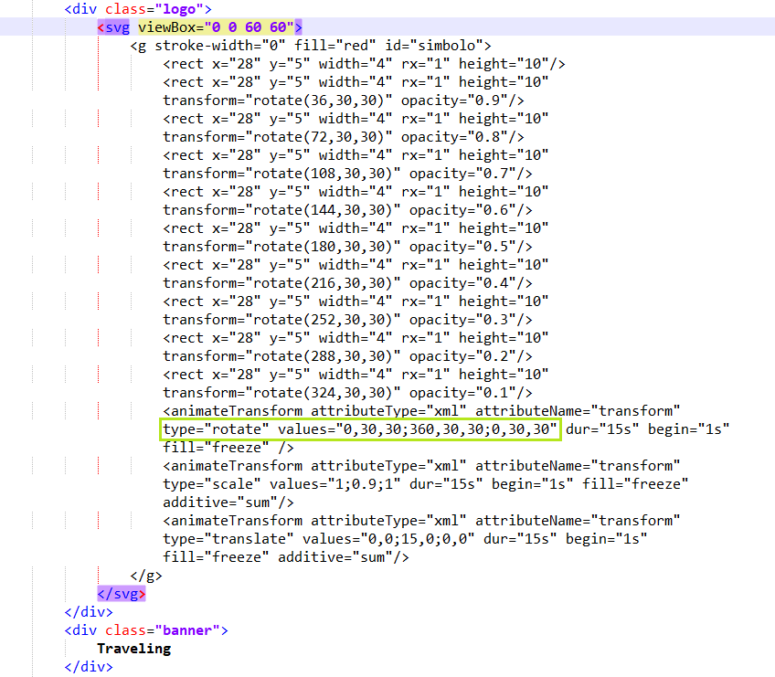
			   <figcaption>A primeira animação, comum neste tipo de desenho, é de rotação em torno do centro. Para ter o efeito vai e vem, usamos o atributo <code>values="0,30,30;360,30,30;0,30,30"</code>, que indica que a rotação começa no 0, vai até 360 e depois volta ao 0. Logo, o efeito será feito no sentido horário, e depois no sentido anti-horário.</figcaption>
		   </li>
		   <li>
			   <input type="radio" id="381" name="sl">
			   <label for="381"></label>
			   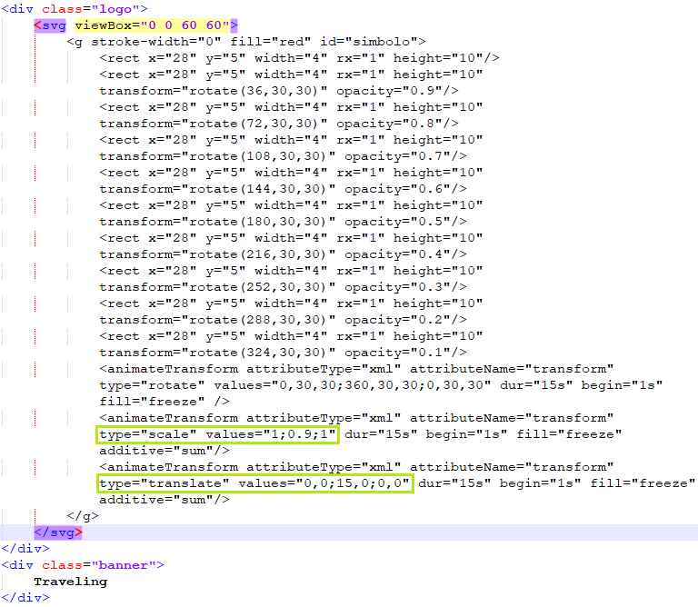
			   <figcaption>Outros efeitos que podem ser usados são de escala (neste caso diminui de 1 para 0.9) e translação (neste caso, a figura "anda" 15px para a direita e depois retorna à posição original).</figcaption>
		   </li>
		   <li>
			   <input type="radio" id="382" name="sl">
			   <label for="382"></label>
			   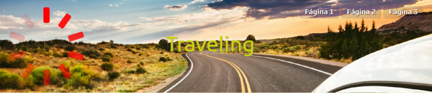
			   <figcaption>Com os atributos mostrados, este é o layout do banner com o símbolo apresentado. Modifique valores e cores para fazer o seu banner.A estrutura SVG do 10&ordm; banner é a seguinte:
<pre><code>&lt;svg viewBox="0 0 60 60"&gt;
	&lt;g stroke-width="0" fill="red" id="simbolo"&gt;
		&lt;rect x="28" y="5" width="4" rx="1" height="10"/&gt;
		&lt;rect x="28" y="5" width="4" rx="1" height="10" transform="rotate(36,30,30)" opacity="0.9"/&gt;
		&lt;rect x="28" y="5" width="4" rx="1" height="10" transform="rotate(72,30,30)" opacity="0.8"/&gt;
		&lt;rect x="28" y="5" width="4" rx="1" height="10" transform="rotate(108,30,30)" opacity="0.7"/&gt;
		&lt;rect x="28" y="5" width="4" rx="1" height="10" transform="rotate(144,30,30)" opacity="0.6"/&gt;
		&lt;rect x="28" y="5" width="4" rx="1" height="10" transform="rotate(180,30,30)" opacity="0.5"/&gt;
		&lt;rect x="28" y="5" width="4" rx="1" height="10" transform="rotate(216,30,30)" opacity="0.4"/&gt;
		&lt;rect x="28" y="5" width="4" rx="1" height="10" transform="rotate(252,30,30)" opacity="0.3"/&gt;
		&lt;rect x="28" y="5" width="4" rx="1" height="10" transform="rotate(288,30,30)" opacity="0.2"/&gt;
		&lt;rect x="28" y="5" width="4" rx="1" height="10" transform="rotate(324,30,30)" opacity="0.1"/&gt;
		&lt;animateTransform attributeType="xml" attributeName="transform" type="rotate" values="0,30,30;360,30,30;0,30,30" dur="15s" begin="1s" fill="freeze" /&gt;
		&lt;animateTransform attributeType="xml" attributeName="transform" type="scale" values="1;0.9;1" dur="15s" begin="1s" fill="freeze" additive="sum"/&gt;
		&lt;animateTransform attributeType="xml" attributeName="transform" type="translate" values="0,0;15,0;0,0" dur="15s" begin="1s" fill="freeze" additive="sum"/&gt;
	&lt;/g&gt;
&lt;/svg&gt;</code></pre></figcaption>
		   </li>		   
		</ul>
		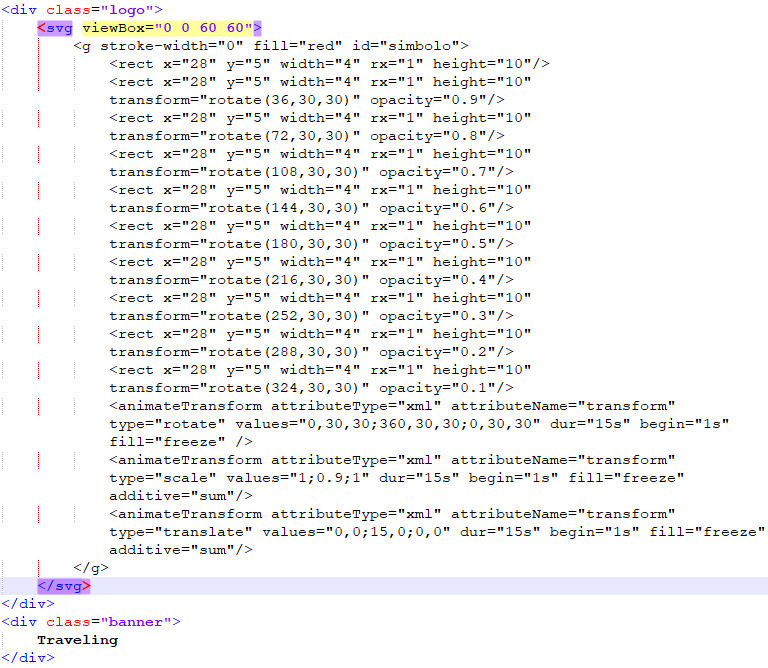
  

	
<a href="#css4" class="topo">voltar ao topo</a>

	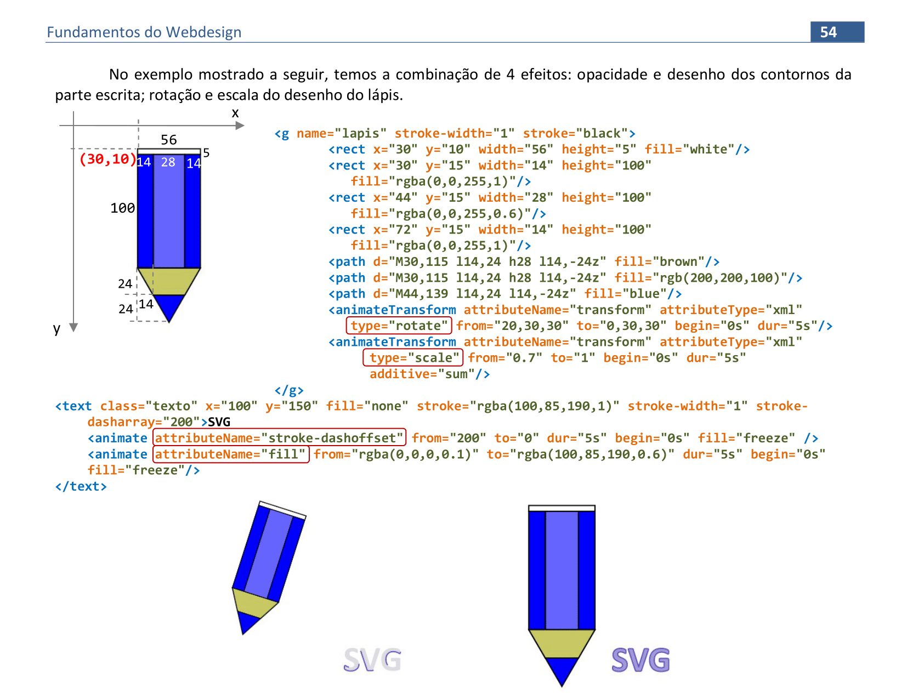
	

&#x1f4c3; 11&deg; banner

	
Usando as tags mostradas do lápis em uma <code>class="barra"</code>, temos o layout mostrado abaixo. Insira uma imagem de fundo para este banner na pasta <code>imagens/banner11.jpg</code> e coloque as tags do lápis em uma <code>class="logo"</code>.

	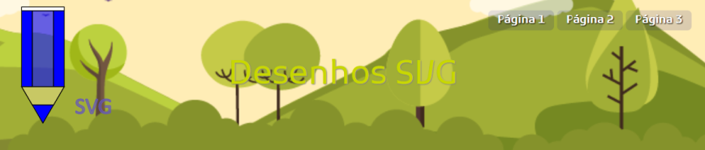
<figcaption>Estrutura SVG do 11&ordm; banner:
<pre><code>&lt;svg viewBox="0 0 200 200"&gt;
	&lt;g id="lapis" stroke-width="1" stroke="black"&gt;
		&lt;rect x="30" y="10" width="56" height="5" fill="white"/&gt;
		&lt;rect x="30" y="15" width="14" height="100" fill="rgba(0,0,255,1)"/&gt;
		&lt;rect x="44" y="15" width="28" height="100" fill="rgba(0,0,255,0.6)"/&gt;
		&lt;rect x="72" y="15" width="14" height="100" fill="rgba(0,0,255,1)"/&gt;
		&lt;path d="M30,115 l14,24 h28 l14,-24z" fill="brown"/&gt;
		&lt;path d="M30,115 l14,24 h28 l14,-24z" fill="rgb(200,200,100)"/&gt;
		&lt;path d="M44,139 l14,24 l14,-24z" fill="blue"/&gt;
		&lt;animateTransform attributeName="transform" attributeType="xml" type="rotate" from="20,30,30"
				to="0,30,30" begin="2s" dur="5s" /&gt;
		&lt;animateTransform attributeName="transform" attributeType="xml" type="scale" from="0.7" to="1" begin="2s" dur="5s" additive="sum" /&gt;
	&lt;/g&gt;
	&lt;text class="texto" x="100" y="150" fill="none" stroke="rgba(100,85,190,1)" stroke-width="1" stroke-dasharray="200"&gt;SVG
		&lt;animate attributeName="stroke-dashoffset" from="200" to="0" dur="5s" begin="2s" fill="freeze" /&gt;
		&lt;animate attributeName="fill" from="rgba(0,0,0,0.1)" to="rgba(100,85,190,0.6)" dur="5s" begin="2s" fill="freeze" /&gt;
	&lt;/text&gt;
&lt;/svg&gt;</code></pre></figcaption>
  

	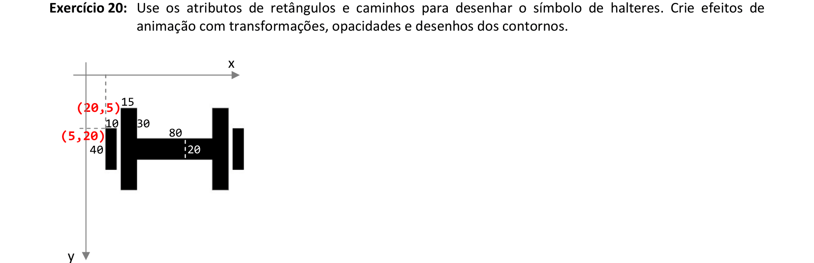
	

&#x1f4c3; 12&deg; banner

	
Vamos criar o outro banner usando <code>class="barra"</code>. Insira uma imagem de fundo para este banner na pasta <code>imagens/banner12.jpg</code>

	  <ul class="slider">
			<li>
			   <input type="radio" id="383" name="sl">
			   <label for="383"></label>
			   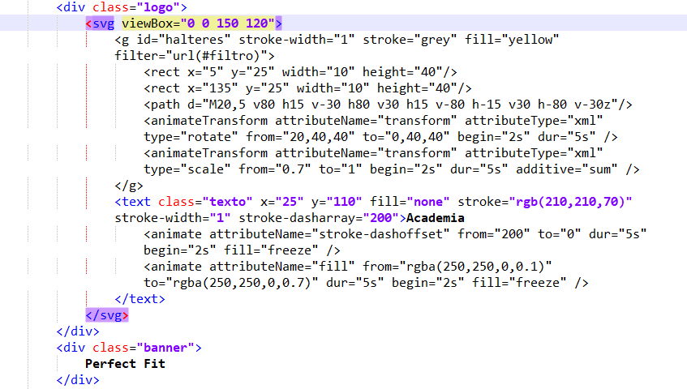
			   <figcaption>Com as medidas do halteres que vamos desenhar, a janela de visualização <code>viewBox</code> pode ser definida com tamanho de 150 x 120 pixels.</figcaption>
		   </li>
		  <li>
			   <input type="radio" id="384" name="sl">
			   <label for="384"></label>
			   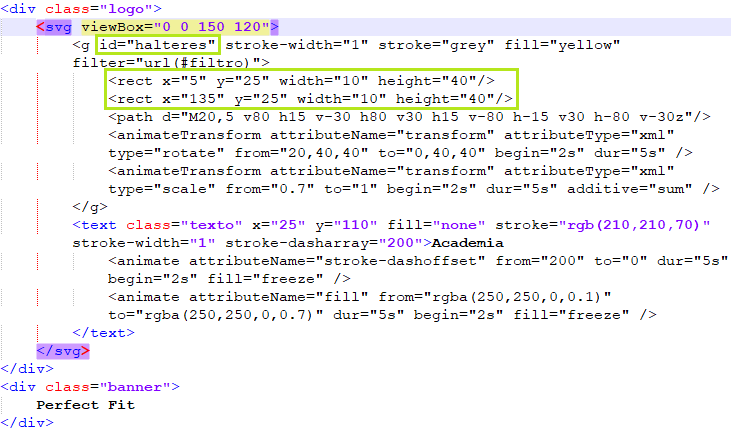
			   <figcaption>Começando pelos dois retângulos menores, temos as coordenadas do primeiro vértice (5,25), e o segundo ficará na coordenada (135,25): 5px da coordenada do vértice + 10px da largura do primeiro retângulo + 5px da distância até a barra + 15px da largura da parte maior + 80px da largura total da barra + 15px da largura da parte maior à direita + 5px da distância = 135px.</figcaption>
		   </li>
		   <li>
			   <input type="radio" id="385" name="sl">
			   <label for="385"></label>
			   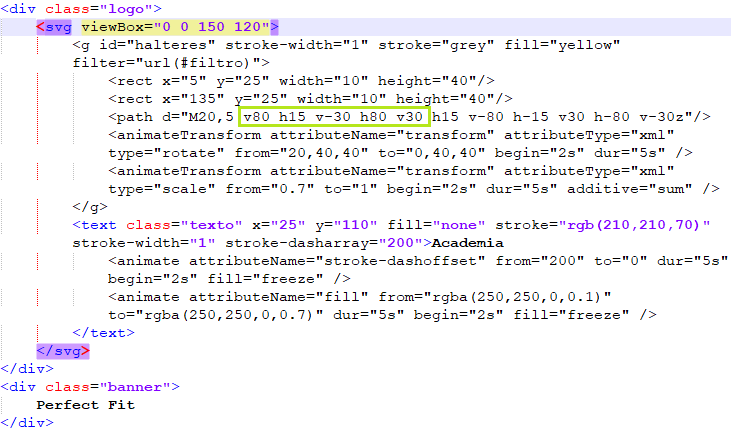
			   <figcaption>A parte maior da barra pode ser feita com uma tag de caminho <code>&lt;path&gt;</code>: começando no ponto de coordenadas (20,5), usamos uma linha vertical v80, depois a largura com a horizontal h15, uma vertical subindo com v-30, a horizontal da largura da barra h80, seguida de uma vertical v30. Os outros comandos são similares.</figcaption>
		   </li>
		   <li>
			   <input type="radio" id="386" name="sl">
			   <label for="386"></label>
			   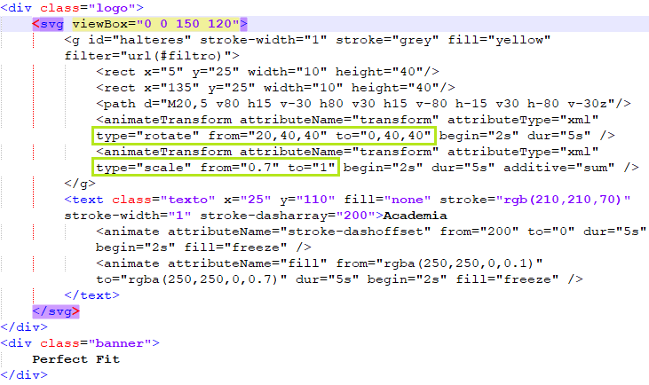
			   <figcaption>Crie duas animações de transformação na barra. Neste exemplo, temos uma animação de rotação de 20&deg; para 0&deg; em torno do ponto de coordenadas (40,40) junto com a escala que começa em 0.7 e vai até 1.</figcaption>
		   </li>
		   <li>
			   <input type="radio" id="387" name="sl">
			   <label for="387"></label>
			   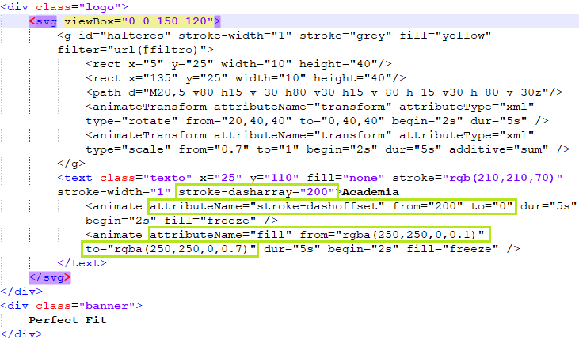
			   <figcaption>Outra animação colocada dentro da tag de texto faz o desenho do texto e modifica a cor de preenchimento.</figcaption>
		   </li>
		   <li>
			   <input type="radio" id="388" name="sl">
			   <label for="388"></label>
			   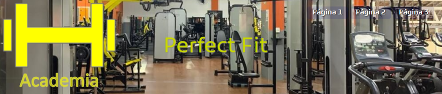
			   <figcaption>Com estas animações, o layout deste banner fica desta forma. Modifique valores de atributos e cores para criar o seu banner.</figcaption>
		   </li>
		   <li>
			   <input type="radio" id="388a" name="sl">
			   <label for="388a"></label>
			   <figcaption>Estrutura SVG do 12&ordm; banner:
<pre><code>&lt;div class="logo"&gt;
	&lt;svg viewBox="0 0 150 120"&gt;
		&lt;g id="halteres" stroke-width="1" stroke="grey" fill="yellow" filter="url(#filtro)"&gt;
			&lt;rect x="5" y="25" width="10" height="40"/&gt;
			&lt;rect x="135" y="25" width="10" height="40"/&gt;
			&lt;path d="M20,5 v80 h15 v-30 h80 v30 h15 v-80 h-15 v30 h-80 v-30z"/&gt;
			&lt;animateTransform attributeName="transform" attributeType="xml" type="rotate" from="20,40,40" to="0,40,40" begin="2s" dur="5s" /&gt;
			&lt;animateTransform attributeName="transform" attributeType="xml" type="scale" from="0.7" to="1" begin="2s" dur="5s" additive="sum" /&gt;
		&lt;/g&gt;
		&lt;text class="texto" x="25" y="110" fill="none" stroke="rgb(210,210,70)" stroke-width="1" stroke-dasharray="200"&gt;Academia
			&lt;animate attributeName="stroke-dashoffset" from="200" to="0" dur="5s" begin="2s" fill="freeze" /&gt;
			&lt;animate attributeName="fill" from="rgba(250,250,0,0.1)" to="rgba(250,250,0,0.7)" dur="5s" begin="2s" fill="freeze" /&gt;
		&lt;/text&gt;
	&lt;/svg&gt;
&lt;/div&gt;
&lt;div class="banner"&gt;
	Perfect Fit
&lt;/div&gt;</code></pre></figcaption>
		   </li>
		</ul>
		
  

	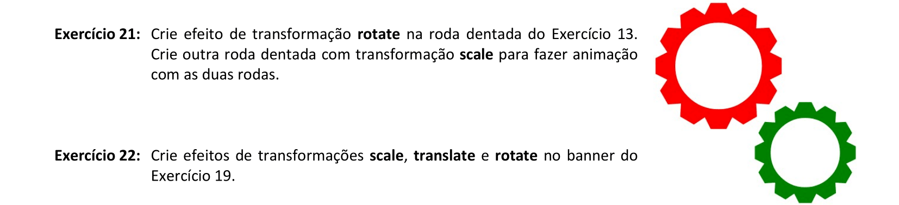
	

&#x1f4c3; Animações no 2&deg; banner

	
Vamos criar efeitos de animação no 2&deg; banner da nossa página. Podemos desenhar uma segunda roda, com outra cor, um pouco menor (usando scale) e deslocada para a direita (usando translate).

	  <ul class="slider">
			<li>
			   <input type="radio" id="389" name="sl">
			   <label for="389"></label>
			   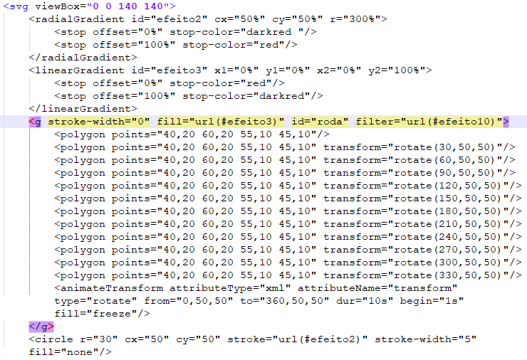
			   <figcaption>Dentro da tag de grupo da primeira roda <code>&lt;g&gt;</code>, podemos inserir o efeito de animação.</figcaption>
		   </li>
		  <li>
			   <input type="radio" id="390" name="sl">
			   <label for="390"></label>
			   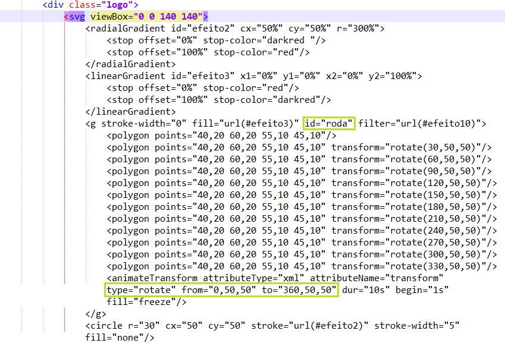
			   <figcaption>A animação de rotação de 0&deg; a 360&deg; está definida no final da tag de grupo.</figcaption>
		   </li>
		   <li>
			   <input type="radio" id="391" name="sl">
			   <label for="391"></label>
			   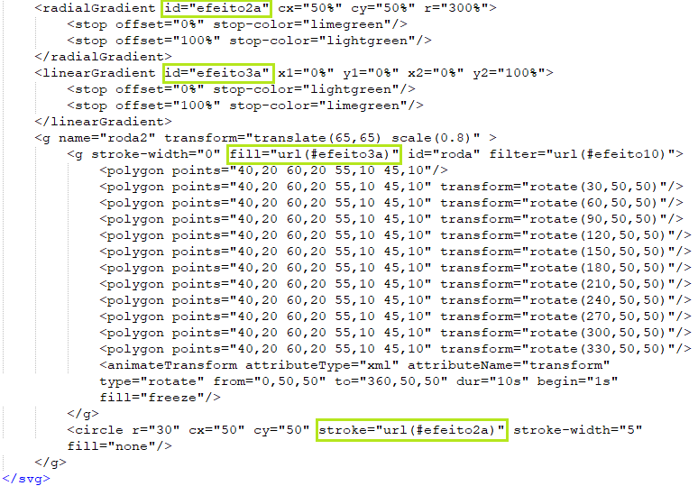
			   <figcaption>O desenho da segunda roda, com tons de verde, tem efeitos gradientes definidos com <code>id="efeito2a"</code> e <code>id="efeito3a"</code>. Criamos uma tag nova de grupo chamada <code>&lt;g name="roda2"&gt;</code> para usar os mesmos desenhos da roda original.</figcaption>
		   </li>
		   <li>
			   <input type="radio" id="392" name="sl">
			   <label for="392"></label>
			   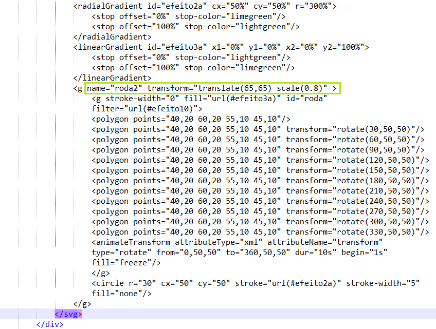
			   <figcaption>Fazendo a translação de 65px à direita e 65px para baixo junto com a escala de 0.8, temos a segunda roda desenhada.</figcaption>
		   </li>
		   <li>
			   <input type="radio" id="393" name="sl">
			   <label for="393"></label>
			   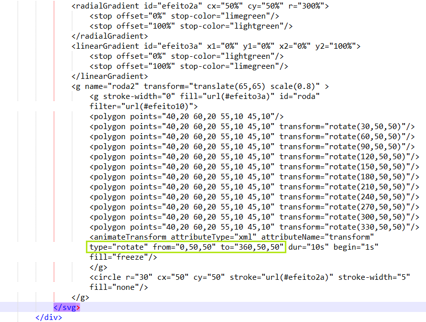
			   <figcaption>O efeito de animação é o mesmo da primeira roda. Se você quiser inverter o sentido da rotação, basta trocar os limites para <code>from="360,50,50"</code> e <code>to="0,50,50"</code>.</figcaption>
		   </li>
		   <li>
			   <input type="radio" id="394" name="sl">
			   <label for="394"></label>
			   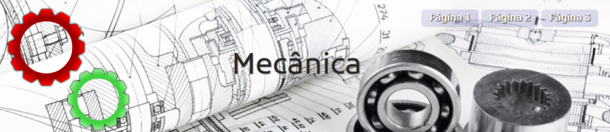
			   <figcaption>O banner fica com este layout com as animações programadas. Ajuste atributos e cores para o seu layout.</figcaption>
		   </li>
		   <li>
			   <input type="radio" id="394a" name="sl">
			   <label for="394a"></label>
			   <figcaption>Estrutura SVG do 2&ordm; banner com animações:
<pre><code>&lt;svg viewBox="0 0 140 140"&gt;
	&lt;radialGradient id="efeito2" cx="50%" cy="50%" r="300%"&gt;
		&lt;stop offset="0%" stop-color="darkred "/&gt;
		&lt;stop offset="100%" stop-color="red"/&gt;
	&lt;/radialGradient&gt;
	&lt;linearGradient id="efeito3" x1="0%" y1="0%" x2="0%" y2="100%"&gt;
		&lt;stop offset="0%" stop-color="red"/&gt;
		&lt;stop offset="100%" stop-color="darkred"/&gt;
	&lt;/linearGradient&gt;
	&lt;g stroke-width="0" fill="url(#efeito3)" id="roda" filter="url(#efeito10)"&gt;
		&lt;polygon points="40,20 60,20 55,10 45,10"/&gt;
		&lt;polygon points="40,20 60,20 55,10 45,10" transform="rotate(30,50,50)"/&gt;
		&lt;polygon points="40,20 60,20 55,10 45,10" transform="rotate(60,50,50)"/&gt;
		&lt;polygon points="40,20 60,20 55,10 45,10" transform="rotate(90,50,50)"/&gt;
		&lt;polygon points="40,20 60,20 55,10 45,10" transform="rotate(120,50,50)"/&gt;
		&lt;polygon points="40,20 60,20 55,10 45,10" transform="rotate(150,50,50)"/&gt;
		&lt;polygon points="40,20 60,20 55,10 45,10" transform="rotate(180,50,50)"/&gt;
		&lt;polygon points="40,20 60,20 55,10 45,10" transform="rotate(210,50,50)"/&gt;
		&lt;polygon points="40,20 60,20 55,10 45,10" transform="rotate(240,50,50)"/&gt;
		&lt;polygon points="40,20 60,20 55,10 45,10" transform="rotate(270,50,50)"/&gt;
		&lt;polygon points="40,20 60,20 55,10 45,10" transform="rotate(300,50,50)"/&gt;
		&lt;polygon points="40,20 60,20 55,10 45,10" transform="rotate(330,50,50)"/&gt;
		&lt;animateTransform attributeType="xml" attributeName="transform" type="rotate" from="0,50,50" to="360,50,50" dur="10s" begin="1s" fill="freeze"/&gt;
	&lt;/g&gt;
	&lt;circle r="30" cx="50" cy="50" stroke="url(#efeito2)" stroke-width="5" fill="none"/&gt;
	&lt;radialGradient id="efeito2a" cx="50%" cy="50%" r="300%"&gt;
		&lt;stop offset="0%" stop-color="limegreen"/&gt;
		&lt;stop offset="100%" stop-color="lightgreen"/&gt;
	&lt;/radialGradient&gt;
	&lt;linearGradient id="efeito3a" x1="0%" y1="0%" x2="0%" y2="100%"&gt;
		&lt;stop offset="0%" stop-color="lightgreen"/&gt;
		&lt;stop offset="100%" stop-color="limegreen"/&gt;
	&lt;/linearGradient&gt;
	&lt;g name="roda2" transform="translate(65,65) scale(0.8)" &gt;
		&lt;g stroke-width="0" fill="url(#efeito3a)" id="roda" filter="url(#efeito10)"&gt;
			&lt;polygon points="40,20 60,20 55,10 45,10"/&gt;
			&lt;polygon points="40,20 60,20 55,10 45,10" transform="rotate(30,50,50)"/&gt;
			&lt;polygon points="40,20 60,20 55,10 45,10" transform="rotate(60,50,50)"/&gt;
			&lt;polygon points="40,20 60,20 55,10 45,10" transform="rotate(90,50,50)"/&gt;
			&lt;polygon points="40,20 60,20 55,10 45,10" transform="rotate(120,50,50)"/&gt;
			&lt;polygon points="40,20 60,20 55,10 45,10" transform="rotate(150,50,50)"/&gt;
			&lt;polygon points="40,20 60,20 55,10 45,10" transform="rotate(180,50,50)"/&gt;
			&lt;polygon points="40,20 60,20 55,10 45,10" transform="rotate(210,50,50)"/&gt;
			&lt;polygon points="40,20 60,20 55,10 45,10" transform="rotate(240,50,50)"/&gt;
			&lt;polygon points="40,20 60,20 55,10 45,10" transform="rotate(270,50,50)"/&gt;
			&lt;polygon points="40,20 60,20 55,10 45,10" transform="rotate(300,50,50)"/&gt;
			&lt;polygon points="40,20 60,20 55,10 45,10" transform="rotate(330,50,50)"/&gt;
			&lt;animateTransform attributeType="xml" attributeName="transform" type="rotate" from="0,50,50" to="360,50,50" dur="10s" begin="1s" fill="freeze"/&gt;
		&lt;/g&gt;
		&lt;circle r="30" cx="50" cy="50" stroke="url(#efeito2a)" stroke-width="5" fill="none"/&gt;
	&lt;/g&gt;
&lt;/svg&gt;</code></pre></figcaption>
		   </li>
		</ul>
		
  

  

&#x1f4c3; Animações no 9&deg; banner

	
Vamos criar animações de transformação no 9&deg; banner.

	  <ul class="slider">
			<li>
			   <input type="radio" id="395" name="sl">
			   <label for="395"></label>
			   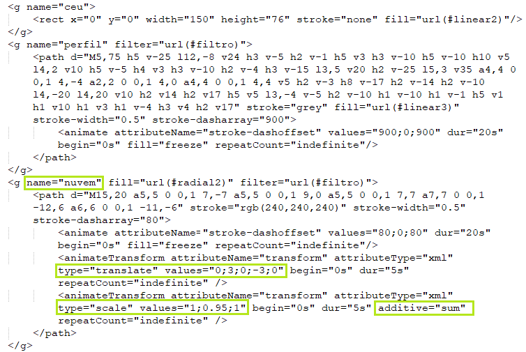
			   <figcaption>No desenho da nuvem, podemos criar pequenas translações. Neste exemplo, a nuvem vai de 3px para a direita, depois volta ao ponto inicial; depois disso, vai para 3px à esquerda, retornando ao ponto inicial. A escala também foi usada variando de 0.95 a 1. Ajuste valores para fazer a animação do seu banner.</figcaption>
		   </li>
		  <li>
			   <input type="radio" id="396" name="sl">
			   <label for="396"></label>
			   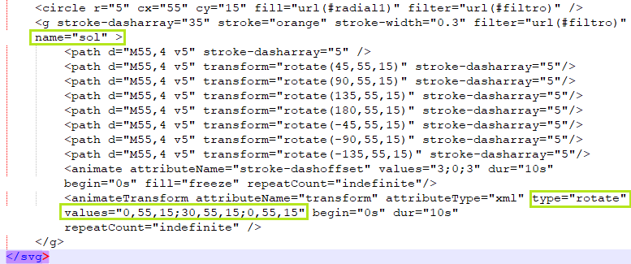
			   <figcaption>Podemos inserir uma animação de rotação nos raios do sol. Neste caso, foi colocada uma rotação que varia de 0&deg; a 30&deg; em torno do centro (55,15). Note que as tags de animações estão dentro das respectivas tags de grupos dos desenhos.</figcaption>
		   </li>
		   <li>
			   <input type="radio" id="397" name="sl">
			   <label for="397"></label>
			   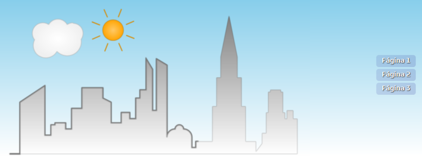
			   <figcaption>O layout fica desta forma. Ajuste valores e atributos de animação para seu banner.</figcaption>
		   </li>
		   <li>
			   <input type="radio" id="397a" name="sl">
			   <label for="397a"></label>
			   <figcaption>Trecho da estrutura SVG do 9&ordm; banner com animações:
<pre><code>&lt;g name="ceu"&gt;
	&lt;rect x="0" y="0" width="150" height="76" stroke="none" fill="url(#linear2)"/&gt;
&lt;/g&gt;
&lt;g name="perfil" filter="url(#filtro)"&gt;
	&lt;path d="M5,75 h5 v-25 l12,-8 v24 h3 v-5 h2 v-1 h5 v3 h3 v-10 h5 v-10 h10 v5 l4,2 v10 h5 v-5 h4 v3 h3 v-10 h2 v-4 h3 v-15 l3,5 v20 h2 v-25 l5,3 v35 a4,4 0 0,1 4,-4 a2,2 0 0,1 4,0 a4,4 0 0,1 4,4 v5 h2 v-3 h8 v-17 h2 v-14 h2 v-10 l4,-20 l4,20 v10 h2 v14 h2 v17 h5 v5 l3,-4 v-5 h2 v-10 h1 v-10 h1 v-1 h5 v1 h1 v10 h1 v3 h1 v-4 h3 v4 h2 v17" stroke="grey" fill="url(#linear3)" stroke-width="0.5" stroke-dasharray="900"&gt;
		&lt;animate attributeName="stroke-dashoffset" values="900;0;900" dur="20s" begin="0s" fill="freeze" repeatCount="indefinite"/&gt;
	&lt;/path&gt;
&lt;/g&gt;
&lt;g name="nuvem" fill="url(#radial2)" filter="url(#filtro)"&gt;
	&lt;path d="M15,20 a5,5 0 0,1 7,-7 a5,5 0 0,1 9,0 a5,5 0 0,1 7,7 a7,7 0 0,1 -12,6 a6,6 0 0,1 -11,-6" stroke="rgb(240,240,240)" stroke-width="0.5" stroke-dasharray="80"&gt;
		&lt;animate attributeName="stroke-dashoffset" values="80;0;80" dur="20s" begin="0s" fill="freeze" repeatCount="indefinite"/&gt;
		&lt;animateTransform attributeName="transform" attributeType="xml" type="translate" values="0,0;3,0;0,0;-3,0;0,0" begin="0s" dur="5s" repeatCount="indefinite" /&gt;
		&lt;animateTransform attributeName="transform" attributeType="xml" type="scale" values="1;0.95;1" begin="0s" dur="5s" additive="sum" repeatCount="indefinite" /&gt;
	&lt;/path&gt;
&lt;/g&gt;</code></pre></figcaption>
		   </li>
		</ul>
		
  

	
<a href="#css4" class="topo">voltar ao topo</a>

	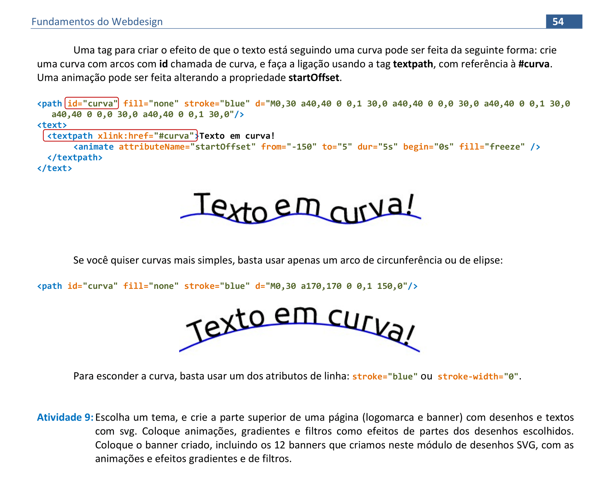
	

&#x1f4c3; Detalhes da Atividade

	
Agora você pode montar o 13&deg; banner. Use um dos logos que você desenhou, o banner e o menu para colocá-los na tag <code>class="banner2"</code>.

	  <ul class="slider">
			<li>
			   <input type="radio" id="398" name="sl">
			   <label for="398"></label>
			   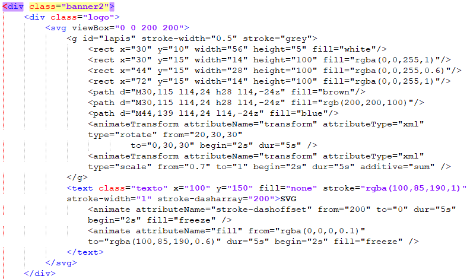
			   <figcaption>Usando a <code>class="banner2"</code>, vamos colocar os elementos na ordem: logo, banner e menu. Tente outras configurações em seu banner da Atividade.</figcaption>
		   </li>
		  <li>
			   <input type="radio" id="399" name="sl">
			   <label for="399"></label>
			   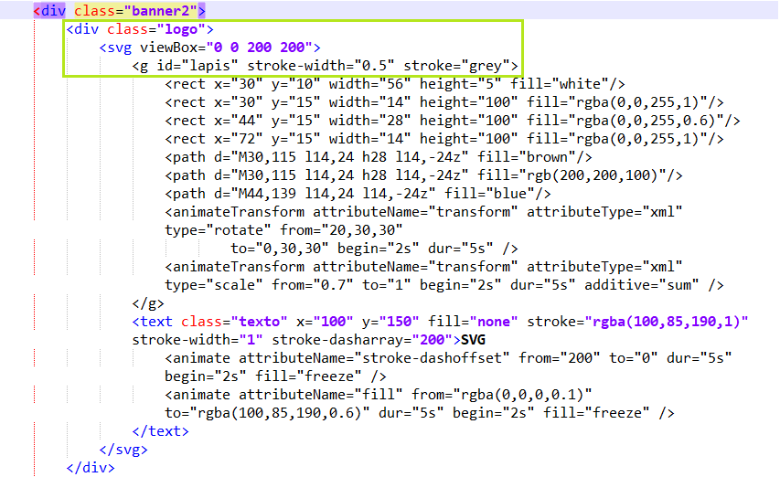
			   <figcaption>Para usar o desenho do lápis, podemos colocá-lo em uma tag <code>class="logo"</code> que já configuramos no CSS.</figcaption>
		   </li>
		   <li>
			   <input type="radio" id="400" name="sl">
			   <label for="400"></label>
			   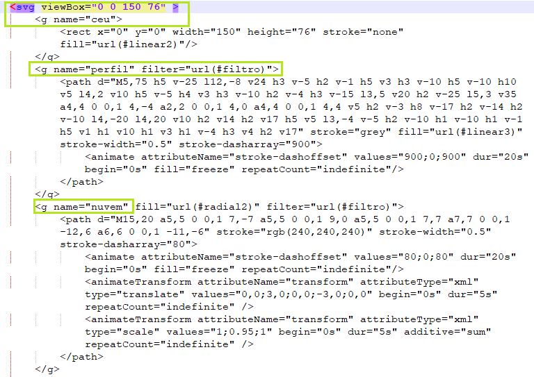
			   <figcaption>Logo depois, colocamos a tag de <code>&lt;svg&gt;</code> do banner, com as devidas animações já programadas.</figcaption>
		   </li>
		   <li>
			   <input type="radio" id="401" name="sl">
			   <label for="401"></label>
			   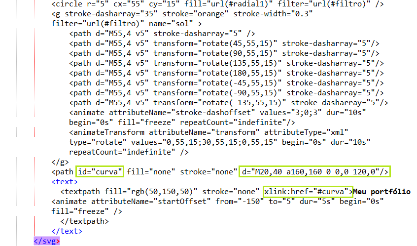
			   <figcaption>Depois do banner, antes de fechar a tag <code>&lt;svg&gt;</code>, crie uma curva <code>id="curva"</code>para desenhar o título do banner alinhado com esta curva. Usando a tag <code>&lt;textpath&gt;</code>, coloque o título na página, com animação to tipo<code>startOffset</code>. Ajuste o valor inicial, pois depende do número de caracteres do título que você escolher.</figcaption>
		   </li>
		   <li>
			   <input type="radio" id="402" name="sl">
			   <label for="402"></label>
			   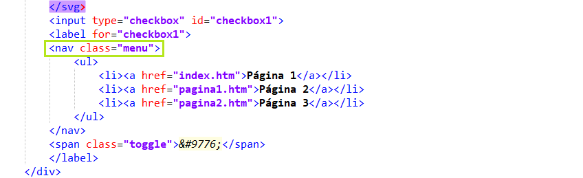
			   <figcaption>Para finalizar o banner, insira a estrutura de menu da página.</figcaption>
		   </li>
		   <li>
			   <input type="radio" id="403" name="sl">
			   <label for="403"></label>
			   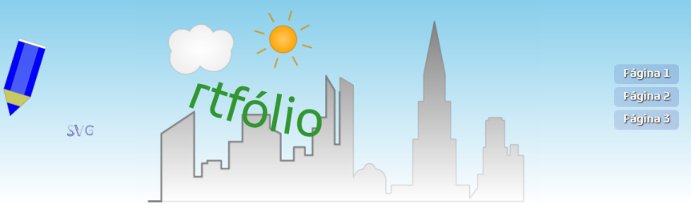
			   <figcaption>O banner fica com este layout com as animações programadas. Ajuste atributos e cores para o layout do seu banner.</figcaption>
		   </li>
		   <li>
			   <input type="radio" id="404" name="sl">
			   <label for="404"></label>
			   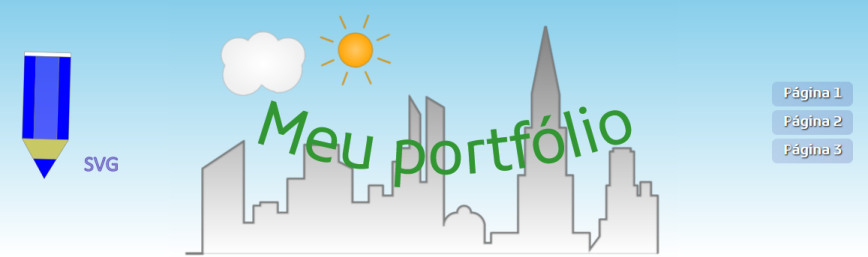
			   <figcaption>No final da animação do texto, o banner fica desta forma. Veja uma parte da estrutura SVG com animação do texto em curva:
<pre><code>&lt;path id="curva" fill="none" stroke="none" d="M20,40 a160,160 0 0,0 120,0"/&gt;
&lt;text&gt;
  &lt;textpath fill="rgb(50,150,50)" stroke="none" xlink:href="#curva"&gt;Meu portfólio
&lt;animate attributeName="startOffset" from="-150" to="5" dur="5s" begin="0s" fill="freeze" /&gt;
  &lt;/textpath&gt;
&lt;/text&gt;</code></pre></figcaption>
		   </li>
		</ul>
		
  

	
<a href="#css4" class="topo">voltar ao topo</a>

6. Galeria de Imagens

	
Material da pág. 56 até a pág. 61

	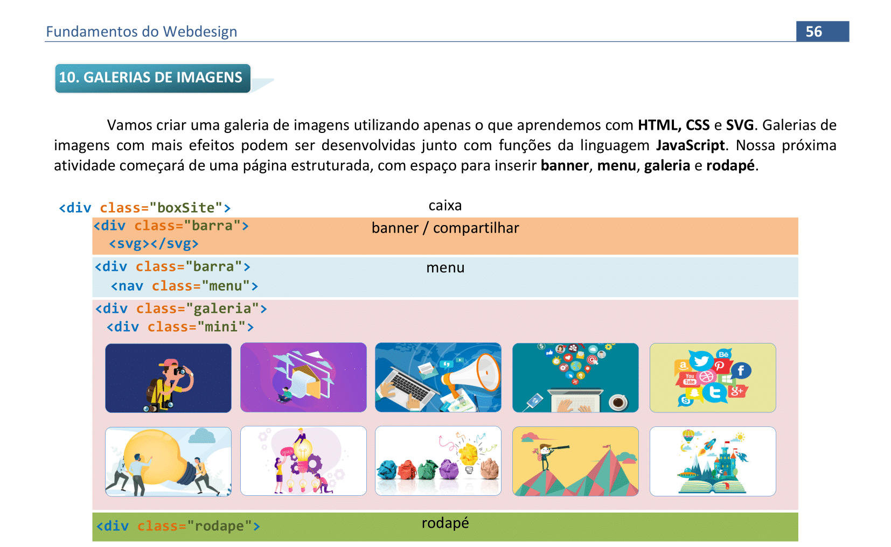
	

&#x1f4c3; Atividade 10: HTML

	
Na pasta <code>webdesign/atividade10</code>, crie os arquivos <code>index.htm</code>  e <code>estilo.css</code>, além da pasta <code>webdesign/atividade10/imagens</code>.

	  <ul class="slider">
			<li>
			   <input type="radio" id="405" name="sl">
			   <label for="405"></label>
			   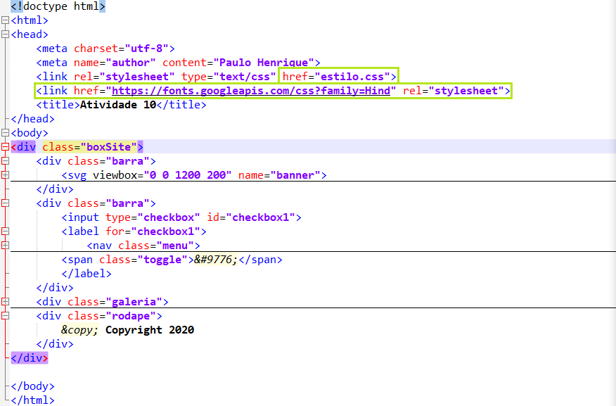
			   <figcaption>No arquivo <code>index.htm</code>, vamos criar as referências do arquivo CSS e da fonte externa escolhida no Google Fonts.</figcaption>
		   </li>
		  <li>
			   <input type="radio" id="406" name="sl">
			   <label for="406"></label>
			   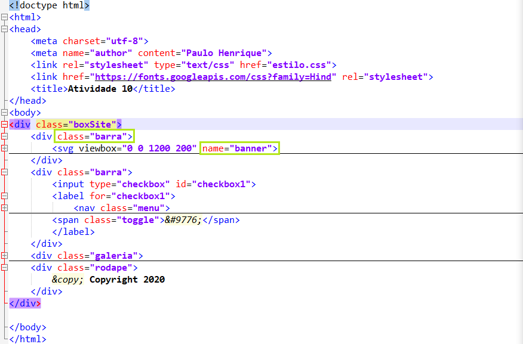
			   <figcaption>Com a tag mãe <code>class="boxSite"</code>, vamos criar a primeira tag <code>class="barra"</code> com os desenhos do banner do site em SVG.</figcaption>
		   </li>
		   <li>
			   <input type="radio" id="407" name="sl">
			   <label for="407"></label>
			   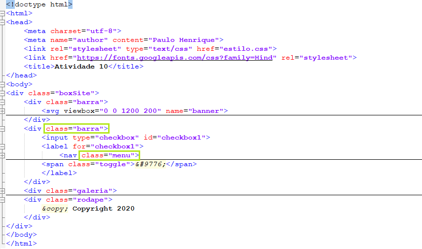
			   <figcaption>A segunda tag <code>class="barra"</code> contém o menu do site.</figcaption>
		   </li>
		   <li>
			   <input type="radio" id="408" name="sl">
			   <label for="408"></label>
			   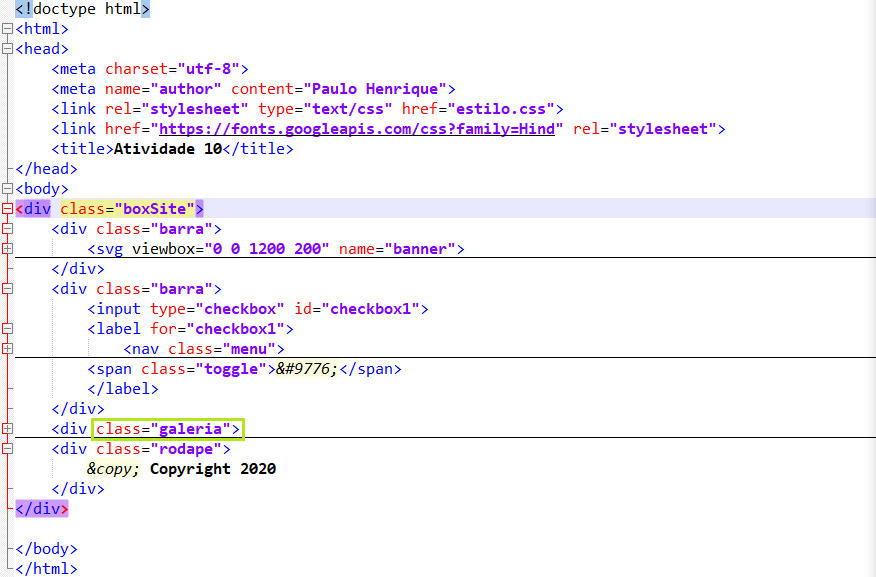
			   <figcaption>A terceira tag será chamada de <code>class="galeria"</code>, com as imagens em miniatura e as ampliadas.</figcaption>
		   </li>
		   <li>
			   <input type="radio" id="409" name="sl">
			   <label for="409"></label>
			   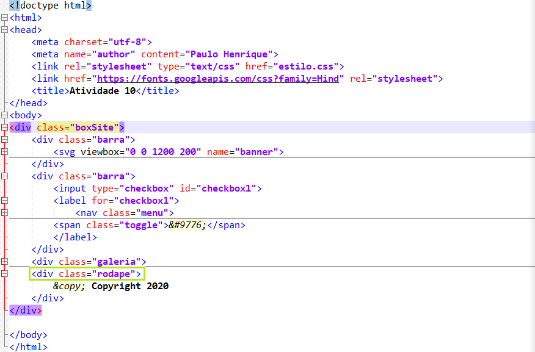
			   <figcaption>A última tag será <code>class="rodape"</code>.</figcaption>
		   </li>
		   <li>
			   <input type="radio" id="410" name="sl">
			   <label for="410"></label>
			   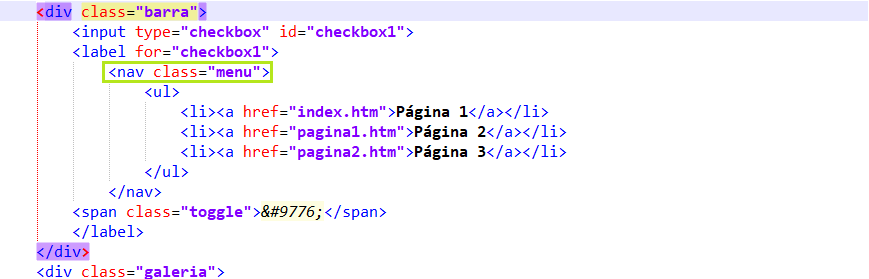
			   <figcaption>A estrutura da tag menu é a mesma que já usamos nas outras atividades. A seguir, vamos ver as demais tags com mais detalhes.</figcaption>
		   </li>
		    <li>
			   <input type="radio" id="410a" name="sl">
			   <label for="410a"></label>
			   <figcaption>Estrutura HTML da galeria da Atividade 10:
<pre><code>&lt;div class="boxSite"&gt;
	&lt;div class="barra"&gt;
		&lt;svg viewbox="0 0 1200 200" name="banner"&gt;
			BANNER SVG
		&lt;/svg&gt;	
	&lt;/div&gt;
	&lt;div class="barra"&gt;
		&lt;input type="checkbox" id="checkbox1"&gt;
		&lt;label for="checkbox1"&gt;
			&lt;nav class="menu"&gt;
				&lt;ul&gt;
					&lt;li&gt;&lt;a href="index.htm"&gt;Página 1&lt;/a&gt;&lt;/li&gt;
					&lt;li&gt;&lt;a href="pagina1.htm"&gt;Página 2&lt;/a&gt;&lt;/li&gt;
					&lt;li&gt;&lt;a href="pagina2.htm"&gt;Página 3&lt;/a&gt;&lt;/li&gt;
				&lt;/ul&gt;
			&lt;/nav&gt;
		&lt;span class="toggle"&gt;&amp;#9776;&lt;/span&gt;
		&lt;/label&gt;
	&lt;/div&gt;
	&lt;div class="galeria"&gt;
		GALERIA
	&lt;/div&gt;
	&lt;div class="rodape"&gt;
		&amp;copy; Copyright 2020
    &lt;/div&gt;
&lt;/div&gt;</code></pre></figcaption>
		   </li>
		</ul>
		
  

	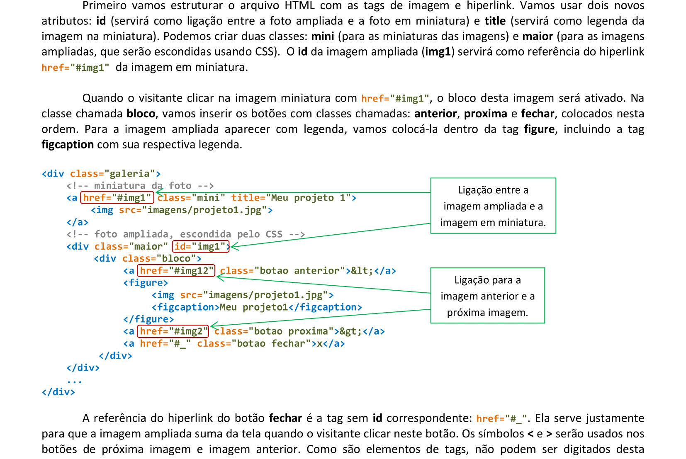
	

&#x1f4c3; Atividade 10: banner

	
Podemos usar alguns desenhos SVG que criamos na atividade anterior, encaixando com outros para criarmos o banner desta atividade. Algumas sugestões de desenhos que você pode usar e adaptar à sua página são mostrados a seguir. Você pode fazer apenas uma tag SVG, como mostrado, ou uma tag com uma logo e outra com o desenho do banner. Se usar duas tags, lembre-se de deixá-las com mesma medida de altura.

	  <ul class="slider">
			<li>
			   <input type="radio" id="411" name="sl">
			   <label for="411"></label>
			   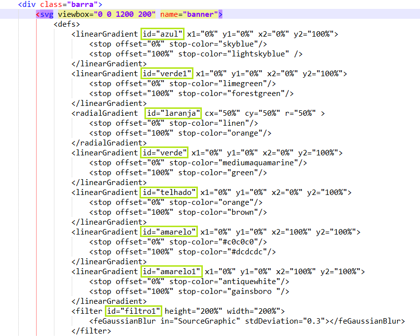
			   <figcaption>Neste exemplo, usamos a tag única de banner com janela de visualização <code>viewBox</code> de 1200 x 200 pixels. As primeiras tags são dos efeitos gradientes usados nos desenhos em tons de verde, azul, amarelo e um filtro para desfocar os contornos dos desenhos. Cada tag de efeito deve ter um <code>id</code> diferente.</figcaption>
		   </li>
		  <li>
			   <input type="radio" id="412" name="sl">
			   <label for="412"></label>
			   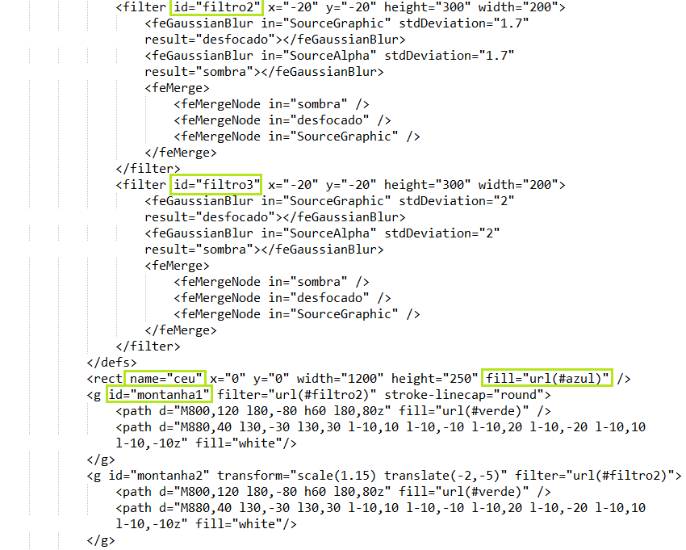
			   <figcaption>Seguindo com os efeitos, temos <code>id="filtro2"</code> e <code>id="filtro3"</code> que produzem sombras com intensidades diferentes. O primeiro desenho é do céu com um retângulo que cobre a janela de visualização SVG. Depois, temos o desenho de duas montanhas.</figcaption>
		   </li>
		   <li>
			   <input type="radio" id="413" name="sl">
			   <label for="413"></label>
			   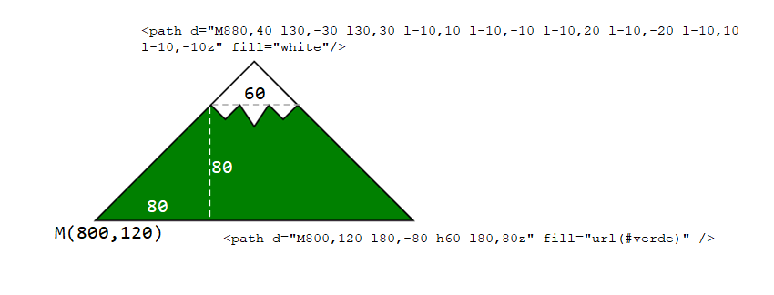
			   <figcaption>A parte de cima foi desenhada com uma única tag de caminho com as medidas indicadas. Esta tag usa apenas linhas com coordenadas (30,-30) e (30,30) para o triângulo maior, depois com linhas alternando coordenadas relativas (-10,10), (-10,-10), (-10,20) para o efeito vai e vem.</figcaption>
		   </li>
		   <li>
			   <input type="radio" id="413a" name="sl">
			   <label for="413a"></label>
			   
			   <figcaption>A tag da parte de baixo é de um trapézio com coordenada inicial (800,120). A primeira linha vai para as coordenadas relativas (80,-80), depois uma linha horizontal de 60 e outra linha para as coordenadas relativas (80,80).</figcaption>
		   </li>
		   <li>
			   <input type="radio" id="414" name="sl">
			   <label for="414"></label>
			   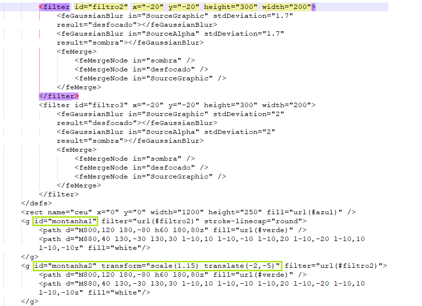
			   <figcaption>A segunda montanha foi feita com as mesmas coordenadas da primeira, com translação e escala.</figcaption>
		   </li>
		   <li>
			   <input type="radio" id="415" name="sl">
			   <label for="415"></label>
			   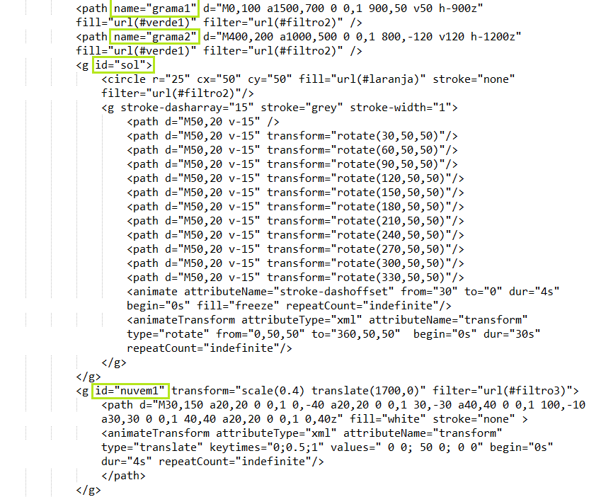
			   <figcaption>Os desenhos de gramados foram feitos com arcos com as medidas dos raios entre 500px e 1500px. As tags de sol e de nuvens foram feitas da mesma maneira que fizemos na atividade anterior.</figcaption>
		   </li>
		   <li>
			   <input type="radio" id="416" name="sl">
			   <label for="416"></label>
			   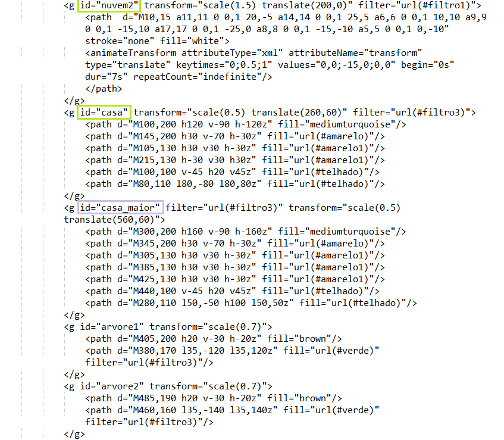
			   <figcaption>Os desenhos das casas foram feitos usando caminhos, similares aos usados nos desenhos das montanhas.</figcaption>
		   </li>
		   <li>
			   <input type="radio" id="417" name="sl">
			   <label for="417"></label>
			   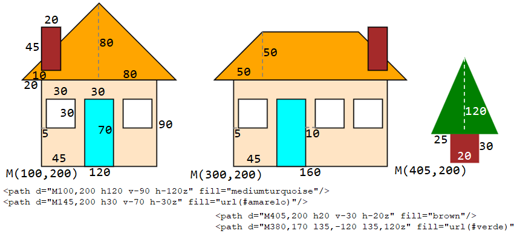
			   <figcaption>Podemos usar tags de retângulos para as janelas, portas e o tronco da árvore. Neste exemplo, foram usadas tags de caminho <code>&lt;path&gt;</code>. As duas primeiras tags mostram os desenhos dos retângulos da primeira casa e da porta. As duas outras tags são do desenho da árvore.</figcaption>
		   </li>
		  <li>
			   <input type="radio" id="418" name="sl">
			   <label for="418"></label>
			   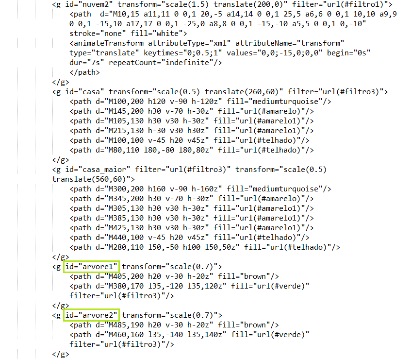
			   <figcaption>A segunda árvore foi feita parecida com a primeira, com altura um pouco maior e coordenada inicial modificada para (485,190).</figcaption>
		   </li>
		   <li>
			   <input type="radio" id="419" name="sl">
			   <label for="419"></label>
			   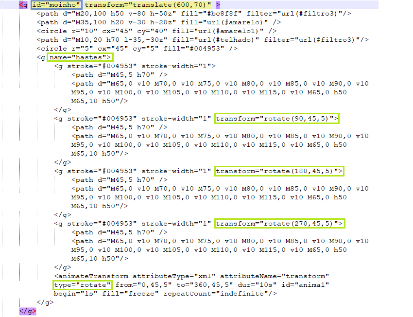
			   <figcaption>O desenho do moinho pode ser feito com os elementos mais simples: como janela, porta e telhado. Em uma tag separada, com animação programada, desenhamos as hastes. Precisamos nos preocupar só com o desenho da primeira. As outras foram feitas com rotações de 90&deg;, 180&deg; e 270&deg;.</figcaption>
		   </li>
		   <li>
			   <input type="radio" id="420" name="sl">
			   <label for="420"></label>
			   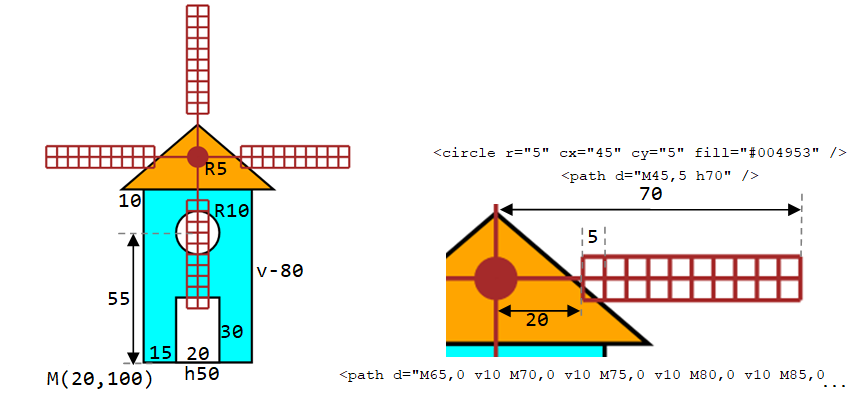
			   <figcaption>No detalhe de uma haste, temos as tags do círculo e da linha horizontal de tamanho 70. Na tag seguinte, temos cada trecho da haste: a primeira linha vertical <code>M70,0 v10</code>, a segunda com coordenada x com mais 5px <code>M75,0 v10</code> e assim sucessivamente.</figcaption>
		   </li>
		   <li>
			   <input type="radio" id="421" name="sl">
			   <label for="421"></label>
			   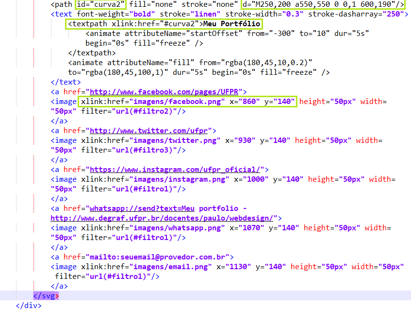
			   <figcaption>O título do banner pode ser feito com o texto sobre uma curva. Para finalizar, os links de compartilhamento ficam como mapeamentos de imagens dentro da tag SVG, no canto direito inferior da tag.</figcaption>
		   </li>
		   <li>
			   <input type="radio" id="422" name="sl">
			   <label for="422"></label>
			   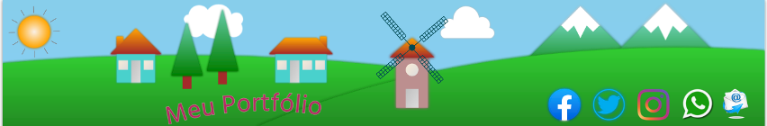
			   <figcaption>Este é o resultado do banner com as tags mostradas. Faça o seu desenho de banner para esta atividade.
			    1&ordf; parte da estrutura SVG do banner da Atividade 10:
<pre><code>&lt;svg viewbox="0 0 1200 200" name="banner"&gt;
	&lt;defs&gt;
		&lt;linearGradient id="azul" x1="0%" y1="0%" x2="0%" y2="100%"&gt;
			&lt;stop offset="0%" stop-color="skyblue"/&gt;
			&lt;stop offset="100%" stop-color="lightskyblue" /&gt;
		&lt;/linearGradient&gt;
		&lt;linearGradient id="verde1" x1="0%" y1="0%" x2="0%" y2="100%"&gt;
			&lt;stop offset="0%" stop-color="limegreen"/&gt;
			&lt;stop offset="100%" stop-color="forestgreen"/&gt;
		&lt;/linearGradient&gt;
		&lt;radialGradient  id="laranja" cx="50%" cy="50%" r="50%" &gt;
			&lt;stop offset="0%" stop-color="linen"/&gt;
			&lt;stop offset="100%" stop-color="orange"/&gt;
		&lt;/radialGradient&gt;						
		&lt;linearGradient id="verde" x1="0%" y1="0%" x2="0%" y2="100%"&gt;
			&lt;stop offset="0%" stop-color="mediumaquamarine"/&gt;
			&lt;stop offset="100%" stop-color="green"/&gt;
		&lt;/linearGradient&gt;
		&lt;linearGradient id="telhado" x1="0%" y1="0%" x2="0%" y2="100%"&gt;
			&lt;stop offset="0%" stop-color="orange"/&gt;
			&lt;stop offset="100%" stop-color="brown"/&gt;
		&lt;/linearGradient&gt;
		&lt;linearGradient id="amarelo" x1="0%" y1="0%" x2="100%" y2="100%"&gt;
			&lt;stop offset="0%" stop-color="#c0c0c0"/&gt;
			&lt;stop offset="100%" stop-color="#dcdcdc"/&gt;
		&lt;/linearGradient&gt;
		&lt;linearGradient id="amarelo1" x1="0%" y1="0%" x2="100%" y2="100%"&gt;
			&lt;stop offset="0%" stop-color="antiquewhite"/&gt;
			&lt;stop offset="100%" stop-color="gainsboro "/&gt;
		&lt;/linearGradient&gt;
		&lt;filter id="filtro1" height="200%" width="200%"&gt;
			&lt;feGaussianBlur in="SourceGraphic" stdDeviation="0.3"&gt;&lt;/feGaussianBlur&gt;
		&lt;/filter&gt;
		&lt;filter id="filtro2" x="-20" y="-20" height="300" width="200"&gt;
			&lt;feGaussianBlur in="SourceGraphic" stdDeviation="1.7" result="desfocado"&gt;&lt;/feGaussianBlur&gt;
			&lt;feGaussianBlur in="SourceAlpha" stdDeviation="1.7" result="sombra"&gt;&lt;/feGaussianBlur&gt;
			&lt;feMerge&gt;
				&lt;feMergeNode in="sombra" /&gt;
				&lt;feMergeNode in="desfocado" /&gt;
				&lt;feMergeNode in="SourceGraphic" /&gt;
			&lt;/feMerge&gt;
		&lt;/filter&gt; 
		&lt;filter id="filtro3" x="-20" y="-20" height="300" width="200"&gt;
			&lt;feGaussianBlur in="SourceGraphic" stdDeviation="2" result="desfocado"&gt;&lt;/feGaussianBlur&gt;
			&lt;feGaussianBlur in="SourceAlpha" stdDeviation="2" result="sombra"&gt;&lt;/feGaussianBlur&gt;
			&lt;feMerge&gt;
				&lt;feMergeNode in="sombra" /&gt;
				&lt;feMergeNode in="desfocado" /&gt;
				&lt;feMergeNode in="SourceGraphic" /&gt;
			&lt;/feMerge&gt;
		&lt;/filter&gt; 
	&lt;/defs&gt;</code></pre></figcaption>
		   </li>
		   <li>
			   <input type="radio" id="422a" name="sl">
			   <label for="422a"></label>
			   <figcaption>2&ordf; parte da estrutura SVG do banner da Atividade 10:
<pre><code>	&lt;rect name="ceu" x="0" y="0" width="1200" height="250" fill="url(#azul)" /&gt;
	&lt;g id="montanha1" filter="url(#filtro2)" stroke-linecap="round"&gt;
		&lt;path d="M800,120 l80,-80 h60 l80,80z" fill="url(#verde)" /&gt;
		&lt;path d="M880,40 l30,-30 l30,30 l-10,10 l-10,-10 l-10,20 l-10,-20 l-10,10 l-10,-10z" fill="white"/&gt;
	&lt;/g&gt;
	&lt;g id="montanha2" transform="scale(1.15) translate(-2,-5)" filter="url(#filtro2)"&gt;
		&lt;path d="M800,120 l80,-80 h60 l80,80z" fill="url(#verde)" /&gt;
		&lt;path d="M880,40 l30,-30 l30,30 l-10,10 l-10,-10 l-10,20 l-10,-20 l-10,10 l-10,-10z" fill="white"/&gt;
	&lt;/g&gt;
	&lt;path name="grama1" d="M0,100 a1500,700 0 0,1 900,50 v50 h-900z" fill="url(#verde1)" filter="url(#filtro2)" /&gt;
	&lt;path name="grama2" d="M400,200 a1000,500 0 0,1 800,-120 v120 h-1200z" fill="url(#verde1)" filter="url(#filtro2)" /&gt;
	&lt;g id="sol"&gt;
		&lt;circle r="25" cx="50" cy="50" fill="url(#laranja)" stroke="none" filter="url(#filtro2)"/&gt;
		&lt;g stroke-dasharray="15" stroke="grey" stroke-width="1"&gt;
			&lt;path d="M50,20 v-15" /&gt;
			&lt;path d="M50,20 v-15" transform="rotate(30,50,50)"/&gt;
			&lt;path d="M50,20 v-15" transform="rotate(60,50,50)"/&gt;
			&lt;path d="M50,20 v-15" transform="rotate(90,50,50)"/&gt;
			&lt;path d="M50,20 v-15" transform="rotate(120,50,50)"/&gt;
			&lt;path d="M50,20 v-15" transform="rotate(150,50,50)"/&gt;
			&lt;path d="M50,20 v-15" transform="rotate(180,50,50)"/&gt;
			&lt;path d="M50,20 v-15" transform="rotate(210,50,50)"/&gt;
			&lt;path d="M50,20 v-15" transform="rotate(240,50,50)"/&gt;
			&lt;path d="M50,20 v-15" transform="rotate(270,50,50)"/&gt;
			&lt;path d="M50,20 v-15" transform="rotate(300,50,50)"/&gt;
			&lt;path d="M50,20 v-15" transform="rotate(330,50,50)"/&gt;
			&lt;animate attributeName="stroke-dashoffset" from="30" to="0" dur="4s" begin="0s" fill="freeze" repeatCount="indefinite"/&gt;
			&lt;animateTransform attributeType="xml" attributeName="transform" type="rotate" from="0,50,50" to="360,50,50"  begin="0s" dur="30s" repeatCount="indefinite"/&gt;
		&lt;/g&gt;
	&lt;/g&gt;
	&lt;g id="nuvem1" transform="scale(0.4) translate(1700,0)" filter="url(#filtro3)"&gt;
		&lt;path d="M30,150 a20,20 0 0,1 0,-40 a20,20 0 0,1 30,-30 a40,40 0 0,1 100,-10 a30,30 0 0,1 40,40 a20,20 0 0,1 0,40z" fill="white" stroke="none" &gt;
			&lt;animateTransform attributeType="xml" attributeName="transform" type="translate" keytimes="0;0.5;1" values=" 0 0; 50 0; 0 0" begin="0s" dur="4s" repeatCount="indefinite"/&gt;
		&lt;/path&gt;
	&lt;/g&gt;
	&lt;g id="nuvem2" transform="scale(1.5) translate(200,0)" filter="url(#filtro1)"&gt;
		&lt;path  d="M10,15 a11,11 0 0,1 20,-5 a14,14 0 0,1 25,5 a6,6 0 0,1 10,10 a9,9 0 0,1 -15,10 a17,17 0 0,1 -25,0 a8,8 0 0,1 -15,-10 a5,5 0 0,1 0,-10" stroke="none" fill="white"&gt;
			&lt;animateTransform attributeType="xml" attributeName="transform" type="translate" keytimes="0;0.5;1" values="0,0;-15,0;0,0" begin="0s" dur="7s" repeatCount="indefinite"/&gt;
		&lt;/path&gt;
	&lt;/g&gt;		
	&lt;g id="casa" transform="scale(0.5) translate(260,60)" filter="url(#filtro3)"&gt;
		&lt;path d="M100,200 h120 v-90 h-120z" fill="mediumturquoise"/&gt;
		&lt;path d="M145,200 h30 v-70 h-30z" fill="url(#amarelo)"/&gt;
		&lt;path d="M105,130 h30 v30 h-30z" fill="url(#amarelo1)"/&gt;
		&lt;path d="M215,130 h-30 v30 h30z" fill="url(#amarelo1)"/&gt;
		&lt;path d="M100,100 v-45 h20 v45z" fill="url(#telhado)"/&gt;
		&lt;path d="M80,110 l80,-80 l80,80z" fill="url(#telhado)"/&gt;
	&lt;/g&gt;
	&lt;g id="casa_maior" filter="url(#filtro3)" transform="scale(0.5) translate(560,60)"&gt;
		&lt;path d="M300,200 h160 v-90 h-160z" fill="mediumturquoise"/&gt;
		&lt;path d="M345,200 h30 v-70 h-30z" fill="url(#amarelo)"/&gt;
		&lt;path d="M305,130 h30 v30 h-30z" fill="url(#amarelo1)"/&gt;
		&lt;path d="M385,130 h30 v30 h-30z" fill="url(#amarelo1)"/&gt;
		&lt;path d="M425,130 h30 v30 h-30z" fill="url(#amarelo1)"/&gt;
		&lt;path d="M440,100 v-45 h20 v45z" fill="url(#telhado)"/&gt;
		&lt;path d="M280,110 l50,-50 h100 l50,50z" fill="url(#telhado)"/&gt;
	&lt;/g&gt;
	&lt;g id="arvore1" transform="scale(0.7)"&gt;
		&lt;path d="M405,200 h20 v-30 h-20z" fill="brown"/&gt;
		&lt;path d="M380,170 l35,-120 l35,120z" fill="url(#verde)" filter="url(#filtro3)"/&gt;
	&lt;/g&gt; 
	&lt;g id="arvore2" transform="scale(0.7)"&gt;
		&lt;path d="M485,190 h20 v-30 h-20z" fill="brown"/&gt;
		&lt;path d="M460,160 l35,-140 l35,140z" fill="url(#verde)" filter="url(#filtro3)"/&gt;
	&lt;/g&gt; 
	&lt;g id="moinho" transform="translate(600,70)" &gt;
		&lt;path d="M20,100 h50 v-80 h-50z" fill="#bc8f8f" filter="url(#filtro3)"/&gt;
		&lt;path d="M35,100 h20 v-30 h-20z" fill="url(#amarelo)" /&gt;
		&lt;circle r="10" cx="45" cy="40" fill="url(#amarelo1)" /&gt;
		&lt;path d="M10,20 h70 l-35,-30z" fill="url(#telhado)" filter="url(#filtro3)"/&gt;
		&lt;circle r="5" cx="45" cy="5" fill="#004953" /&gt;
		&lt;g name="hastes"&gt;
			&lt;g stroke="#004953" stroke-width="1"&gt;
				&lt;path d="M45,5 h70" /&gt;
				&lt;path d="M65,0 v10 M70,0 v10 M75,0 v10 M80,0 v10 M85,0 v10 M90,0 v10 M95,0 v10 M100,0 v10 M105,0 v10 M110,0 v10 M115,0 v10 M65,0 h50 M65,10 h50"/&gt;
			&lt;/g&gt;
			&lt;g stroke="#004953" stroke-width="1" transform="rotate(90,45,5)"&gt;
				&lt;path d="M45,5 h70" /&gt;
				&lt;path d="M65,0 v10 M70,0 v10 M75,0 v10 M80,0 v10 M85,0 v10 M90,0 v10 M95,0 v10 M100,0 v10 M105,0 v10 M110,0 v10 M115,0 v10 M65,0 h50 M65,10 h50"/&gt;
			&lt;/g&gt;
			&lt;g stroke="#004953" stroke-width="1" transform="rotate(180,45,5)"&gt;
				&lt;path d="M45,5 h70" /&gt;
				&lt;path d="M65,0 v10 M70,0 v10 M75,0 v10 M80,0 v10 M85,0 v10 M90,0 v10 M95,0 v10 M100,0 v10 M105,0 v10 M110,0 v10 M115,0 v10 M65,0 h50 M65,10 h50"/&gt;
			&lt;/g&gt;
			&lt;g stroke="#004953" stroke-width="1" transform="rotate(270,45,5)"&gt;
				&lt;path d="M45,5 h70" /&gt;
				&lt;path d="M65,0 v10 M70,0 v10 M75,0 v10 M80,0 v10 M85,0 v10 M90,0 v10 M95,0 v10 M100,0 v10 M105,0 v10 M110,0 v10 M115,0 v10 M65,0 h50 M65,10 h50"/&gt;
			&lt;/g&gt;
			&lt;animateTransform attributeType="xml" attributeName="transform" type="rotate" from="0,45,5" to="360,45,5" dur="10s" id="anima1" begin="1s" fill="freeze" repeatCount="indefinite"/&gt;
		&lt;/g&gt;
	&lt;/g&gt;
	&lt;path id="curva2" fill="none" stroke="none" d="M250,200 a550,550 0 0,1 600,190"/&gt;
	&lt;text font-weight="bold" stroke="linen" stroke-width="0.3" stroke-dasharray="250"&gt;
		&lt;textpath xlink:href="#curva2"&gt;Meu Portfólio
			&lt;animate attributeName="startOffset" from="-300" to="10" dur="5s" begin="0s" fill="freeze" /&gt;
		&lt;/textpath&gt;
		&lt;animate attributeName="fill" from="rgba(180,45,10,0.2)" to="rgba(180,45,100,1)" dur="5s" begin="0s" fill="freeze" /&gt;
	&lt;/text&gt;
	&lt;a href="http://www.facebook.com/pages/UFPR"&gt;
		&lt;image xlink:href="imagens/facebook.png" x="860" y="140" height="50px" width="50px" filter="url(#filtro2)"/&gt;
	&lt;/a&gt;
	&lt;a href="http://www.twitter.com/ufpr"&gt;
		&lt;image xlink:href="imagens/twitter.png" x="930" y="140" height="50px" width="50px" filter="url(#filtro3)"/&gt;
	&lt;/a&gt;
	&lt;a href="https://www.instagram.com/ufpr_oficial/"&gt;
		&lt;image xlink:href="imagens/instagram.png" x="1000" y="140" height="50px" width="50px" filter="url(#filtro1)"/&gt;
	&lt;/a&gt;
	&lt;a href="whatsapp://send?text=Meu portfolio - http://www.degraf.ufpr.br/docentes/paulo/webdesign/"&gt;
		&lt;image xlink:href="imagens/whatsapp.png" x="1070" y="140" height="50px" width="50px" filter="url(#filtro1)"/&gt;
	&lt;/a&gt;
	&lt;a href="mailto:seuemail@provedor.com.br"&gt;
		&lt;image xlink:href="imagens/email.png" x="1130" y="140" height="50px" width="50px" filter="url(#filtro1)"/&gt;
	&lt;/a&gt;	
&lt;/svg&gt;</code></pre></figcaption>
		   </li>
		</ul>
		
  

	
<a href="#css5" class="topo">voltar ao topo</a>

	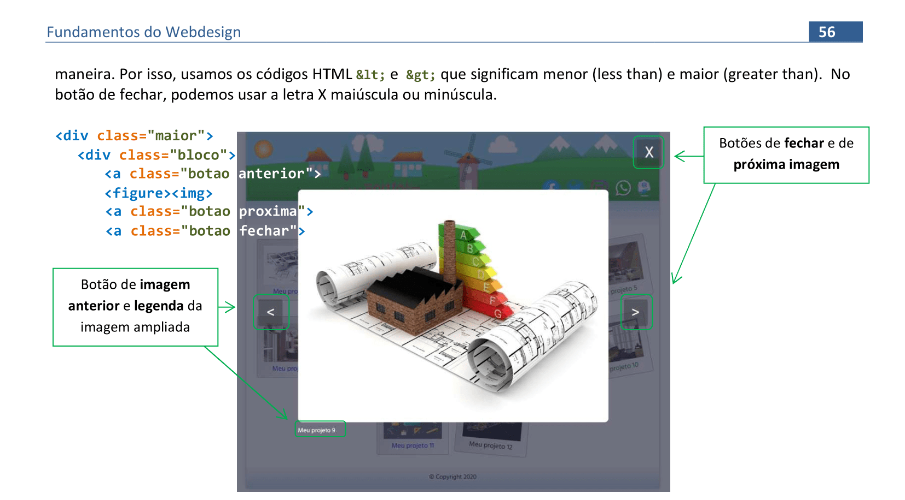
	

&#x1f4c3; Atividade 10: HTML da galeria

	
Vamos ver a estrutura HTML para as imagens da galeria. Insira as imagens de projetos feitos em disciplinas que você quer colocar no portfólio que vamos criar nesta atividade. Coloque no mínimo 12 imagens para esta atividade.

	  <ul class="slider">
			<li>
			   <input type="radio" id="423" name="sl">
			   <label for="423"></label>
			   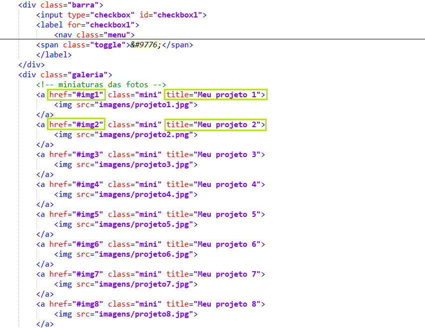
			   <figcaption>Depois do fechamento da tag de menu, crie a tag <code>class="galeria"</code>. Agrupe as miniaturas das imagens. Cada uma deve ter um link <code>href="#img"</code> com o mesmo nome que usaremos nas respectivas imagens ampliadas. Coloque os títulos das imagens no atributo <code>title</code></figcaption>
		   </li>
		  <li>
			   <input type="radio" id="424" name="sl">
			   <label for="424"></label>
			   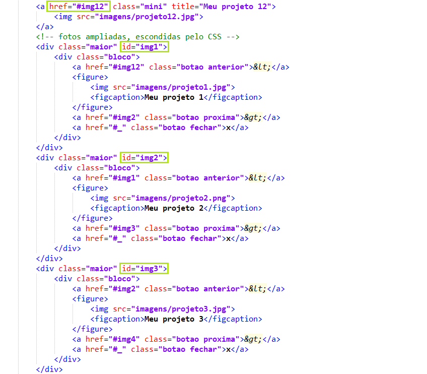
			   <figcaption>Depois da última miniatura de imagem <code>href="#img12"</code>, começamos a inserir as tags das imagens ampliadas. Serão 12 blocos com <code>class="maior"</code> e os <code>ids</code> correspondentes das miniaturas.</figcaption>
		   </li>
		   <li>
			   <input type="radio" id="425" name="sl">
			   <label for="425"></label>
			   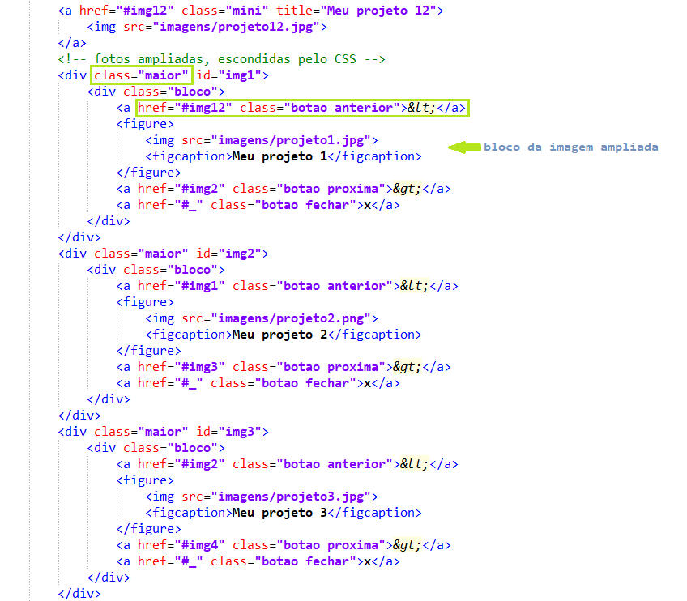
			   <figcaption>Colocamos os elementos na ordem: 1&deg; - botão de imagem anterior (da primeira imagem, é a imagem 12); 2&deg; - bloco de imagem com título usando tags <code>&lt;figure&gt;</code> e <code>&lt;figcaption&gt;</code>;</figcaption>
		   </li>
		   <li>
			   <input type="radio" id="426" name="sl">
			   <label for="426"></label>
			   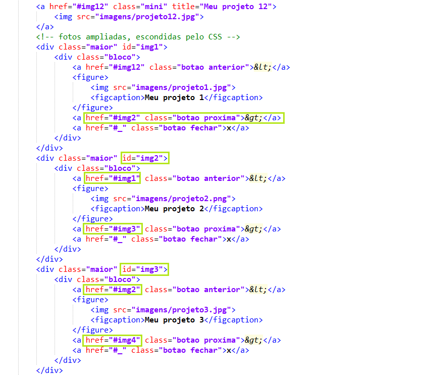
			   <figcaption>3&deg; - botão de próxima imagem (da primeira imagem, é a imagem 2); 4&deg; - botão de fechar com <code>href="#_"</code>. No bloco da imagem 2, a imagem anterior tem a referência para <code>href="#img1"</code> e de próxima imagem para <code>href="#img3"</code>.</figcaption>
		   </li>
		   <li>
			   <input type="radio" id="427" name="sl">
			   <label for="427"></label>
			   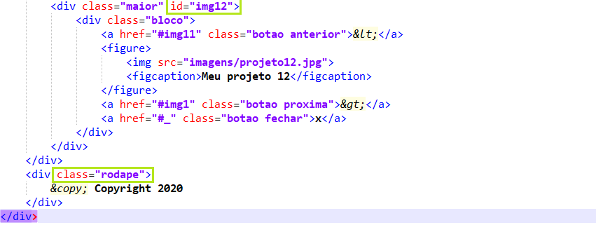
			   <figcaption>A última tag será <code>class="rodape"</code>, colocada depois do fechamento da tag <code>class="galeria"</code> após a imagem ampliada <code>href="#img12"</code>.</figcaption>
		   </li>
		   <li>
			   <input type="radio" id="427a" name="sl">
			   <label for="427a"></label>
			   <figcaption>Trecho da estrutura HTML da galeria da Atividade 10:
<pre><code>&lt;div class="galeria"&gt;
	&lt;!-- miniaturas das fotos --&gt;
	&lt;a href="#img1" class="mini" title="Meu projeto 1"&gt;
		&lt;img src="imagens/projeto1.jpg"&gt;
	&lt;/a&gt;		
	&lt;a href="#img2" class="mini" title="Meu projeto 2"&gt;
		&lt;img src="imagens/projeto2.png"&gt;
	&lt;/a&gt;		
	&lt;!-- fotos ampliadas, escondidas pelo CSS --&gt;
	&lt;div class="maior" id="img1"&gt;
		&lt;div class="bloco"&gt;
			&lt;a href="#img12" class="botao anterior"&gt;&lt;&lt;/a&gt;
			&lt;figure&gt;
				&lt;img src="imagens/projeto1.jpg"&gt;
				&lt;figcaption&gt;Meu projeto 1&lt;/figcaption&gt;
			&lt;/figure&gt;
			&lt;a href="#img2" class="botao proxima"&gt;&gt;&lt;/a&gt;
			&lt;a href="#_" class="botao fechar"&gt;x&lt;/a&gt;
		&lt;/div&gt;
	&lt;/div&gt;
	&lt;div class="maior" id="img2"&gt;
		&lt;div class="bloco"&gt;
			&lt;a href="#img1" class="botao anterior"&gt;&lt;&lt;/a&gt;
			&lt;figure&gt;
				&lt;img src="imagens/projeto2.png"&gt;
				&lt;figcaption&gt;Meu projeto 2&lt;/figcaption&gt;
			&lt;/figure&gt;
			&lt;a href="#img3" class="botao proxima"&gt;&gt;&lt;/a&gt;
			&lt;a href="#_" class="botao fechar"&gt;x&lt;/a&gt;
		&lt;/div&gt;
	&lt;/div&gt;
&lt;/div&gt;</code></pre></figcaption>
		   </li>
		</ul>
		
  

	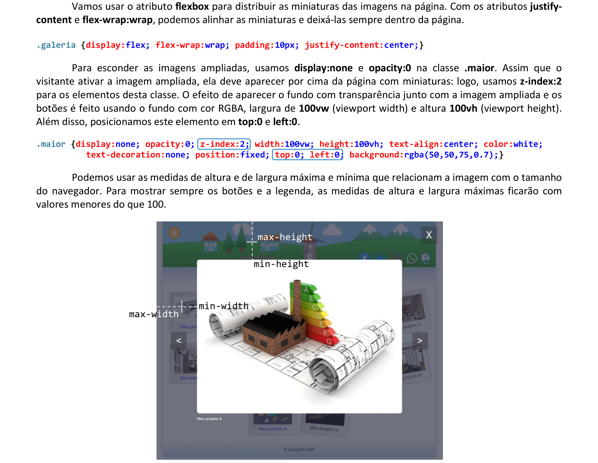
	
<a href="#css5" class="topo">voltar ao topo</a>

	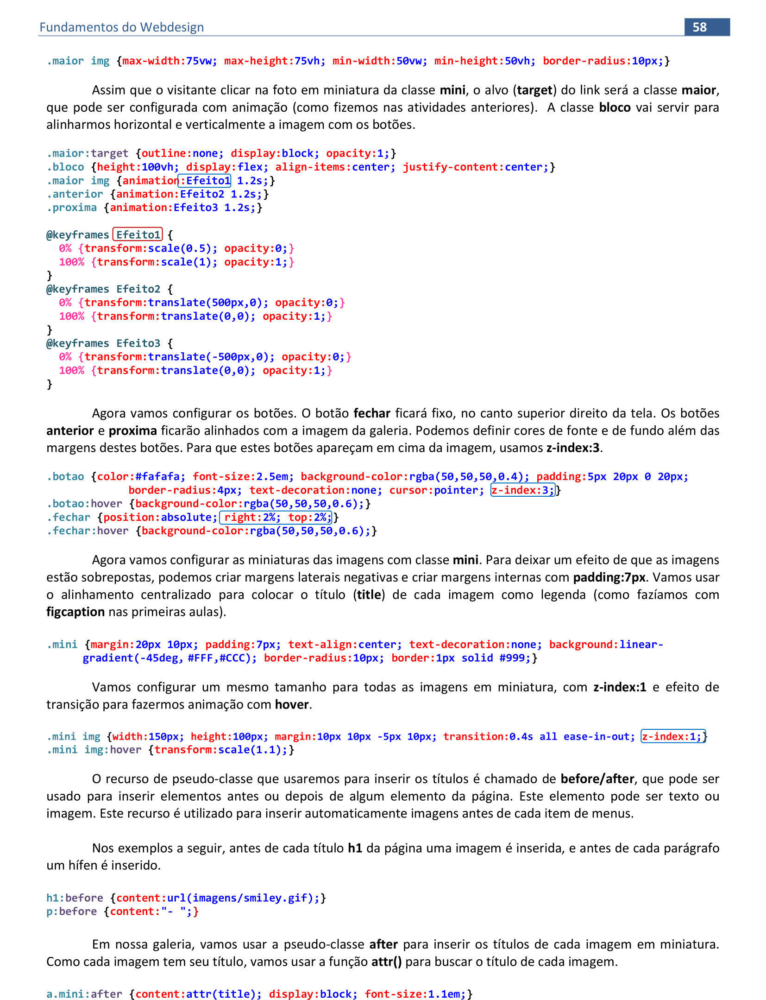
	
<a href="#css5" class="topo">voltar ao topo</a>

	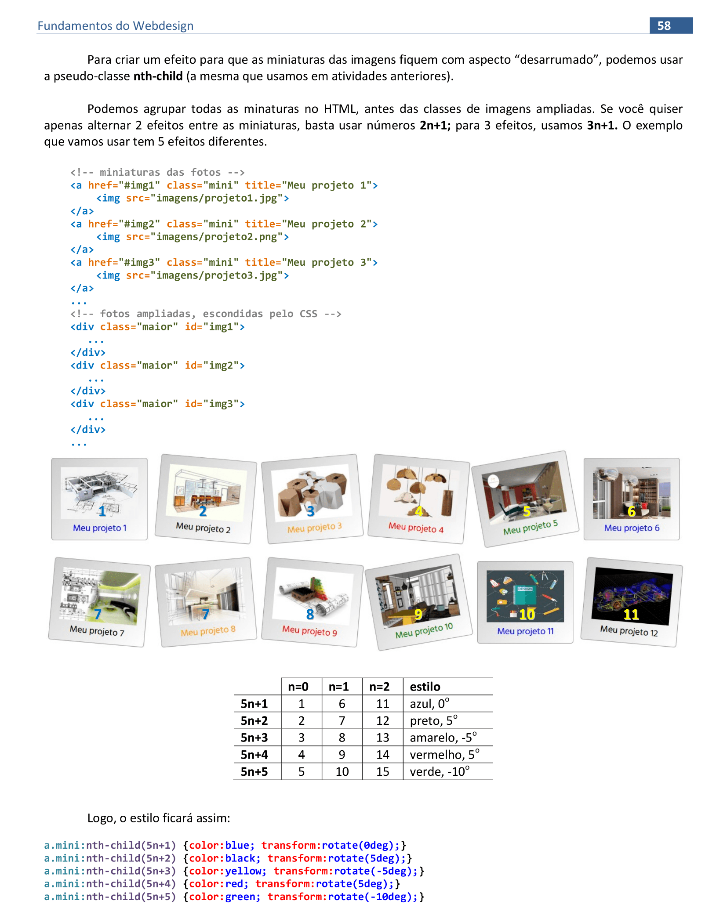
	

&#x1f4c3; Atividade 10: CSS da galeria

	
Vamos ver a estrutura CSS para a página de galeria.

	  <ul class="slider">
			<li>
			   <input type="radio" id="428" name="sl">
			   <label for="428"></label>
			   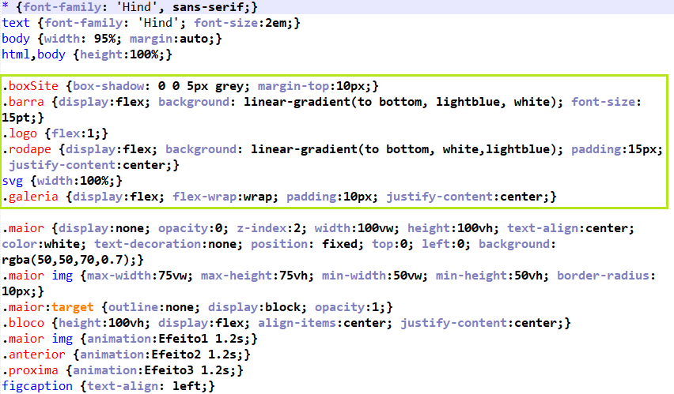
			   <figcaption>Após os atributos gerais da página, colocamos as propriedades dos blocos: <code>boxSite</code>, <code>barra</code>, <code>logo</code>, <code>rodape</code> e <code>galeria</code>. Defina os alinhamentos, cores e margens destes blocos.</figcaption>
		   </li>
		  <li>
			   <input type="radio" id="429" name="sl">
			   <label for="429"></label>
			   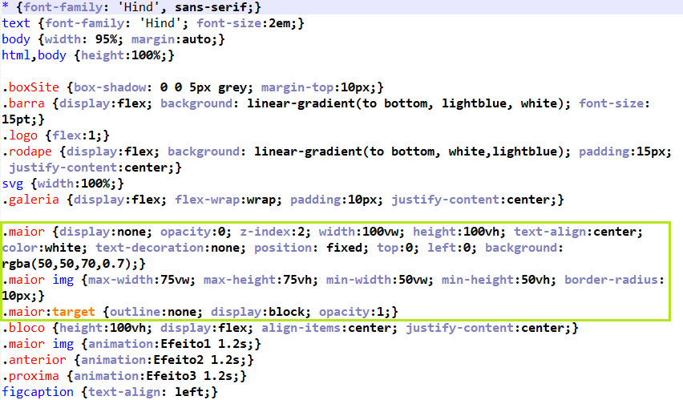
			   <figcaption>A classe <code>.maior</code> fica escondida, e só pode ser ativada quando a miniatura apontar para o <code>id</code> desta classe. Isso acontece quando a classe estiver no alvo: <code>.maior:target</code>. Defina margens e alinhamentos dos elementos desta classe.</figcaption>
		   </li>
		   <li>
			   <input type="radio" id="430" name="sl">
			   <label for="430"></label>
			   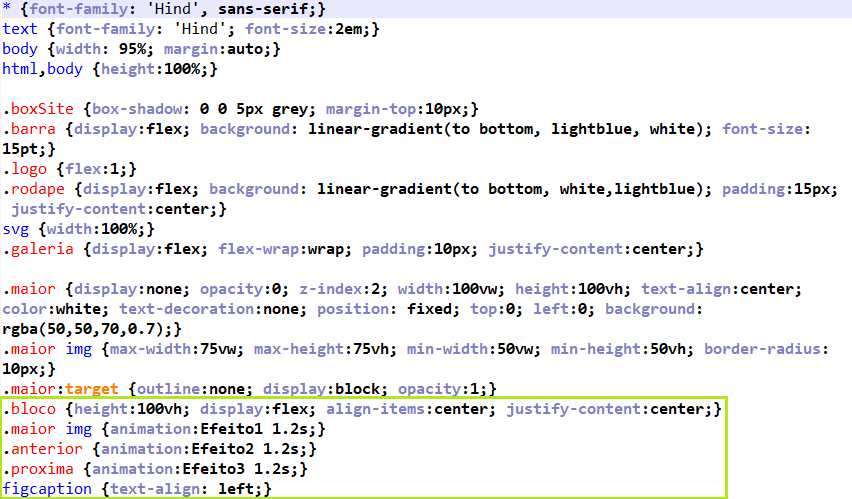
			   <figcaption>A classe <code>.bloco</code> tem display flexbox para alinharmos os itens como já fizemos em outras atividades. Coloque efeitos na imagem ampliada e nos botões de imagem anterior e próxima imagem.</figcaption>
		   </li>
		   <li>
			   <input type="radio" id="431" name="sl">
			   <label for="431"></label>
			   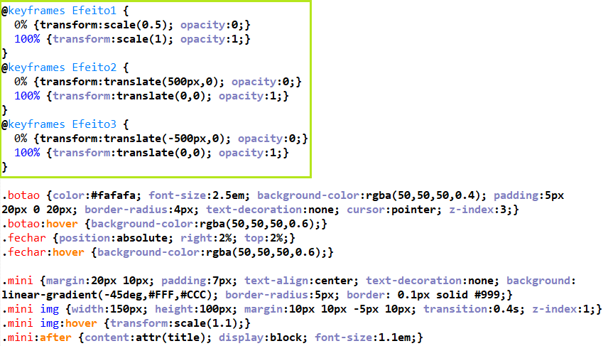
			   <figcaption>Podemos usar efeitos de opacidade, escala, rotação, translação ou cisalhamento, como já vimos em atividades anteriores. Escolha os efeitos e ajuste os valores para sua página.</figcaption>
		   </li>
		   <li>
			   <input type="radio" id="432" name="sl">
			   <label for="432"></label>
			   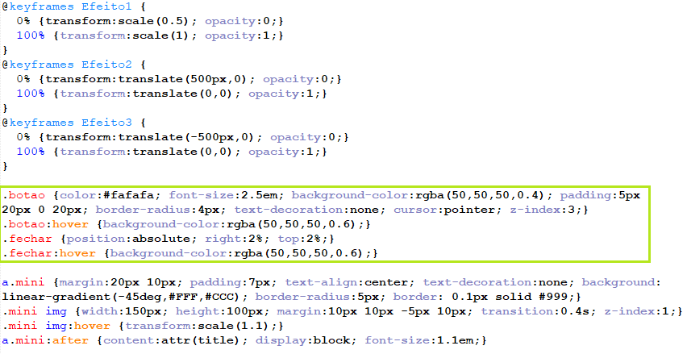
			   <figcaption>Defina os atributos de cores e margens dos botões. Podemos usar cores com transparência RGBA.</figcaption>
		   </li>
		   <li>
			   <input type="radio" id="433" name="sl">
			   <label for="433"></label>
			   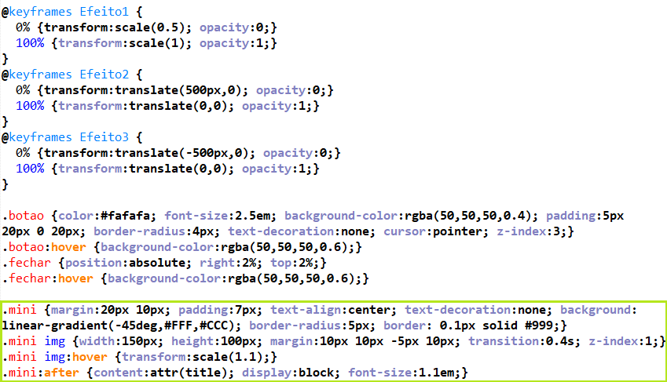
			   <figcaption>Defina as margens, cores e efeitos das imagens em miniatura.</figcaption>
		   </li>
		   <li>
			   <input type="radio" id="434" name="sl">
			   <label for="434"></label>
			   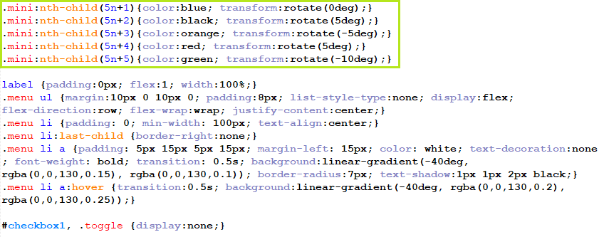
			   <figcaption>O efeito "desarrumado", com rotações está programado para parecer de 5 em 5 imagens. Ajuste valores para as imagens de sua página. Os atributos de menu são os mesmos que já usamos nas atividades anteriores.</figcaption>
		   </li>
		   <li>
			   <input type="radio" id="435" name="sl">
			   <label for="435"></label>
			   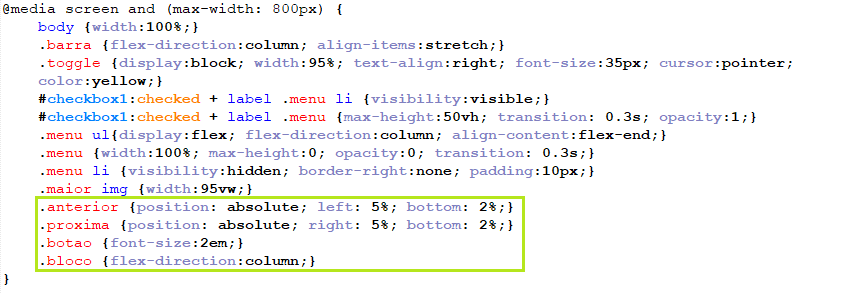
			   <figcaption>As configurações para visualização da página em telas menores são as mesmas que já usamos em itens já conhecidos. As posições de botões de imagens ampliadas podem ser ajustadas para aparecerem abaixo das imagens, com <code>flex-direction:column</code> na classe <code>.bloco</code>.</figcaption>
		   </li>
		   <li>
			   <input type="radio" id="436" name="sl">
			   <label for="436"></label>
			   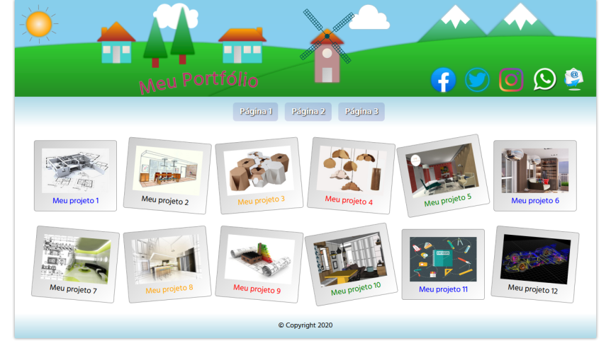
			   <figcaption>Esta é a visualização da página com os atributos mostrados. Ajuste sua página de portfólio desta atividade. Ao clicar na imagem miniatura 9...</figcaption>
		   </li>
		   <li>
			   <input type="radio" id="437" name="sl">
			   <label for="437"></label>
			   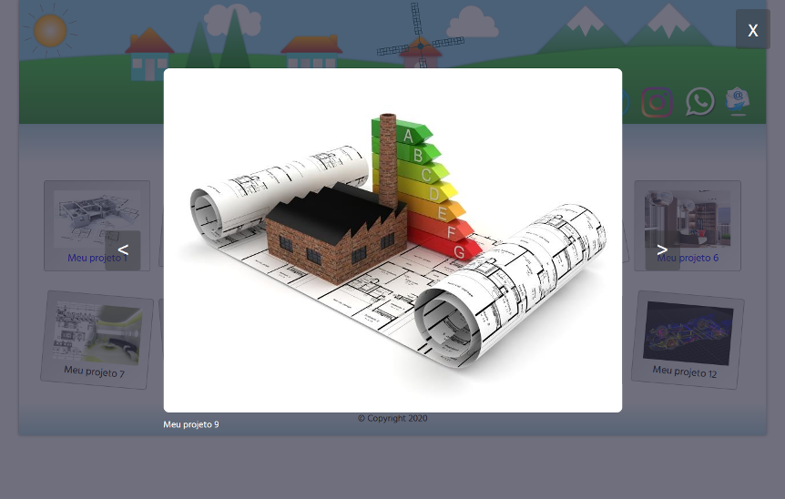
			   <figcaption>... este é o resultado da ampliação da imagem do projeto 9.</figcaption>
		   </li>
		   <li>
			   <input type="radio" id="437a" name="sl">
			   <label for="437a"></label>
			   <figcaption>1&ordf; parte da estrutura CSS da galeria da Atividade 10:
<pre><code>* {font-family: 'Hind', sans-serif;}
text {font-family: 'Hind'; font-size:2em;}
body {width: 95%; margin:auto;}
html,body {height:100%;}

.boxSite {box-shadow: 0 0 5px grey; margin-top:10px;}
.barra {display:flex; background: linear-gradient(to bottom, lightblue, white); font-size:15pt;}
.logo {flex:1;}
.rodape {display:flex; background: linear-gradient(to bottom, white,lightblue); padding:15px; justify-content:center;}
svg {width:100%;}
.galeria {display:flex; flex-wrap:wrap; padding:10px; justify-content:center;}

.maior {display:none; opacity:0; z-index:2; width:100vw; height:100vh; text-align:center; color:white; text-decoration:none; position: fixed; top:0; left:0; background:rgba(50,50,70,0.7);} 
.maior img {max-width:75vw; max-height:75vh; min-width:50vw; min-height:50vh; border-radius:10px;} 
.maior:target {outline:none; display:block; opacity:1;}
.bloco {height:100vh; display:flex; align-items:center; justify-content:center;}
.maior img {animation:Efeito1 1.2s;}
.anterior {animation:Efeito2 1.2s;}
.proxima {animation:Efeito3 1.2s;}
figcaption {text-align: left;}

@keyframes Efeito1 {
  0% {transform:scale(0.5); opacity:0;}
  100% {transform:scale(1); opacity:1;}
}
@keyframes Efeito2 {
  0% {transform:translate(500px,0); opacity:0;}
  100% {transform:translate(0,0); opacity:1;}
}
@keyframes Efeito3 {
  0% {transform:translate(-500px,0); opacity:0;}
  100% {transform:translate(0,0); opacity:1;}
}

.botao {color:#fafafa; font-size:2.5em; background-color:rgba(50,50,50,0.4); padding:5px 20px 0 20px; border-radius:4px; text-decoration:none; cursor:pointer; z-index:3;}
.botao:hover {background-color:rgba(50,50,50,0.6);}
.fechar {position:absolute; right:2%; top:2%;}
.fechar:hover {background-color:rgba(50,50,50,0.6);}</code></pre></figcaption>
		   </li>
		   <li>
			   <input type="radio" id="437b" name="sl">
			   <label for="437b"></label>
			   <figcaption>2&ordf; parte da estrutura CSS da galeria da Atividade 10:
<pre><code>.mini {margin:20px 10px; padding:7px; text-align:center; text-decoration:none; background:linear-gradient(-45deg,#FFF,#CCC); border-radius:5px; border: 0.1px solid #999;}
.mini img {width:150px; height:100px; margin:10px 10px -5px 10px; transition:0.4s; z-index:1;}
.mini img:hover {transform:scale(1.1);}
.mini:after {content:attr(title); display:block; font-size:1.1em;}

.mini:nth-child(5n+1){color:blue; transform:rotate(0deg);}
.mini:nth-child(5n+2){color:black; transform:rotate(5deg);}
.mini:nth-child(5n+3){color:orange; transform:rotate(-5deg);}
.mini:nth-child(5n+4){color:red; transform:rotate(5deg);}
.mini:nth-child(5n+5){color:green; transform:rotate(-10deg);}

label {padding:0px; flex:1; width:100%;}
.menu ul {margin:10px 0 10px 0; padding:8px; list-style-type:none; display:flex; flex-direction:row; flex-wrap:wrap; justify-content:center;}
.menu li {padding: 0; min-width: 100px; text-align:center;}
.menu li:last-child {border-right:none;}
.menu li a {padding: 5px 15px 5px 15px; margin-left: 15px; color: white; text-decoration:none; font-weight: bold; transition: 0.5s; background:linear-gradient(-40deg, rgba(0,0,130,0.15), rgba(0,0,130,0.1)); border-radius:7px; text-shadow:1px 1px 2px black;}
.menu li a:hover {transition:0.5s; background:linear-gradient(-40deg, rgba(0,0,130,0.2), rgba(0,0,130,0.25));}

#checkbox1, .toggle {display:none;}

@media screen and (max-width: 800px) {
	body {width:100%;}
	.barra {flex-direction:column; align-items:stretch;}
	.toggle {display:block; width:95%; text-align:right; font-size:35px; cursor:pointer; 
	color:yellow;}
	#checkbox1:checked + label .menu li {visibility:visible;}
	#checkbox1:checked + label .menu {max-height:50vh; transition: 0.3s; opacity:1;}
	.menu ul{display:flex; flex-direction:column; align-content:flex-end;}
	.menu {width:100%; max-height:0; opacity:0; transition: 0.3s;}
	.menu li {visibility:hidden; border-right:none; padding:10px;}
	.maior img {width:95vw;}
	.anterior {position: absolute; left: 5%; bottom: 2%;}
	.proxima {position: absolute; right: 5%; bottom: 2%;}
	.botao {font-size:2em;}
	.bloco {flex-direction:column;}
}</code></pre></figcaption>
		   </li>
		</ul>
		
  

	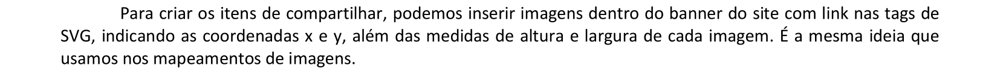
	
<a href="#css5" class="topo">voltar ao topo</a>

	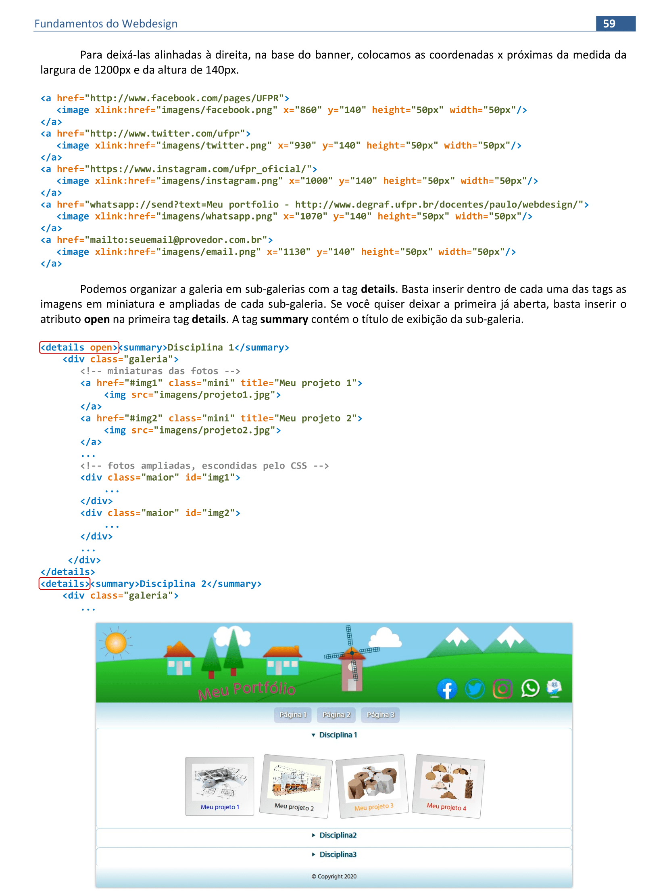
	
<a href="#css5" class="topo">voltar ao topo</a>

	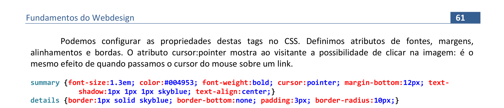
	

&#x1f4c3; Atividade 10: galeria com divisões

	
Vamos ver a estrutura CSS para a página de galeria com divisões da tag <code>details</code>.

	  <ul class="slider">
			<li>
			   <input type="radio" id="438" name="sl">
			   <label for="438"></label>
			   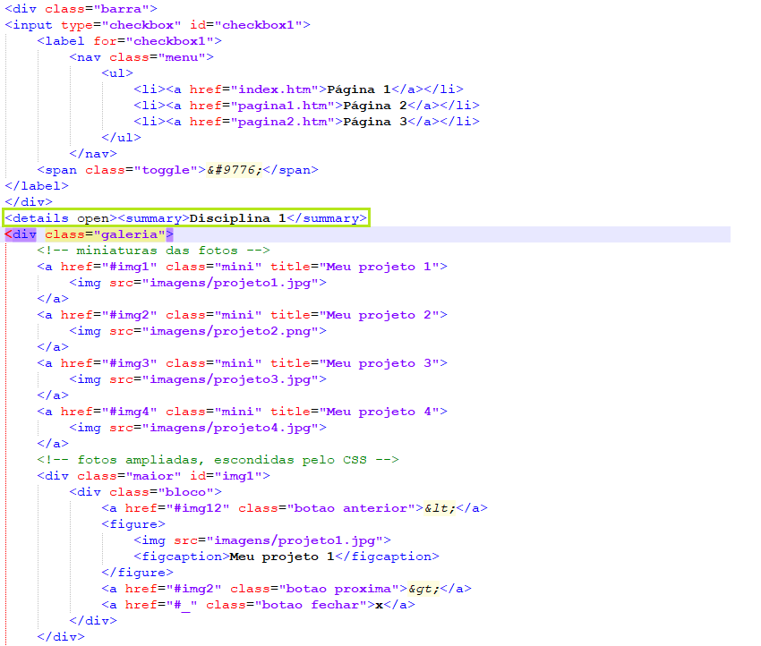
			   <figcaption>Podemos separar as galerias em sub-galerias. Coloque dentro da tag <code>&lt;details&gt;</code> a tag <code>class="galeria"</code> com as imagens escolhidas da primeira divisão.</figcaption>
		   </li>
		  <li>
			   <input type="radio" id="439" name="sl">
			   <label for="439"></label>
			   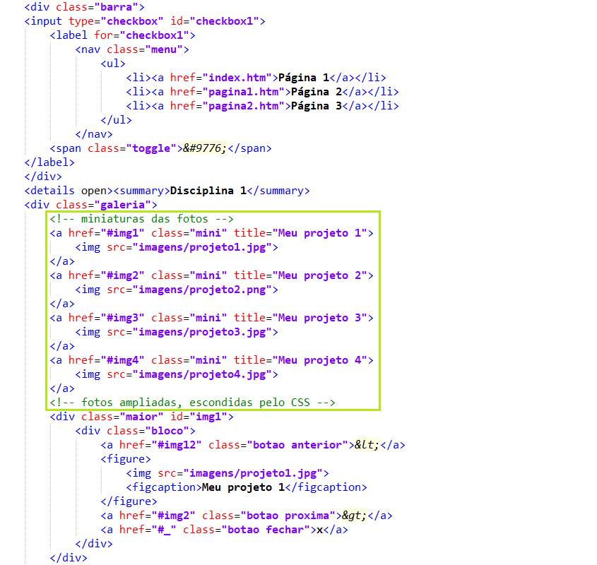
			   <figcaption>Colocamos as miniaturas das imagens escolhidas, seguidas das respectivas imagens ampliadas. Neste caso, escolhi 4 imagens, com as 4 classes de imagens ampliadas.</figcaption>
		   </li>
		   <li>
			   <input type="radio" id="440a" name="sl">
			   <label for="440a"></label>
			   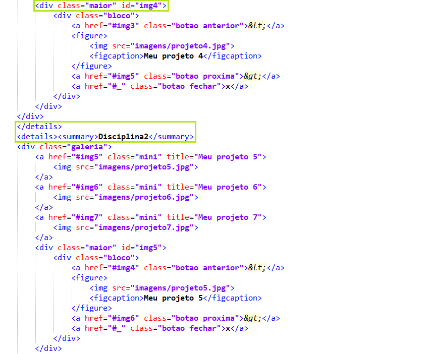
			   <figcaption>Depois do bloco da 4&ordf; imagem, fechamos a tag <code>&lt;/details&gt;</code> para começar a próxima sub-galeria.</figcaption>
		   </li>
		   <li>
			   <input type="radio" id="440" name="sl">
			   <label for="440"></label>
			   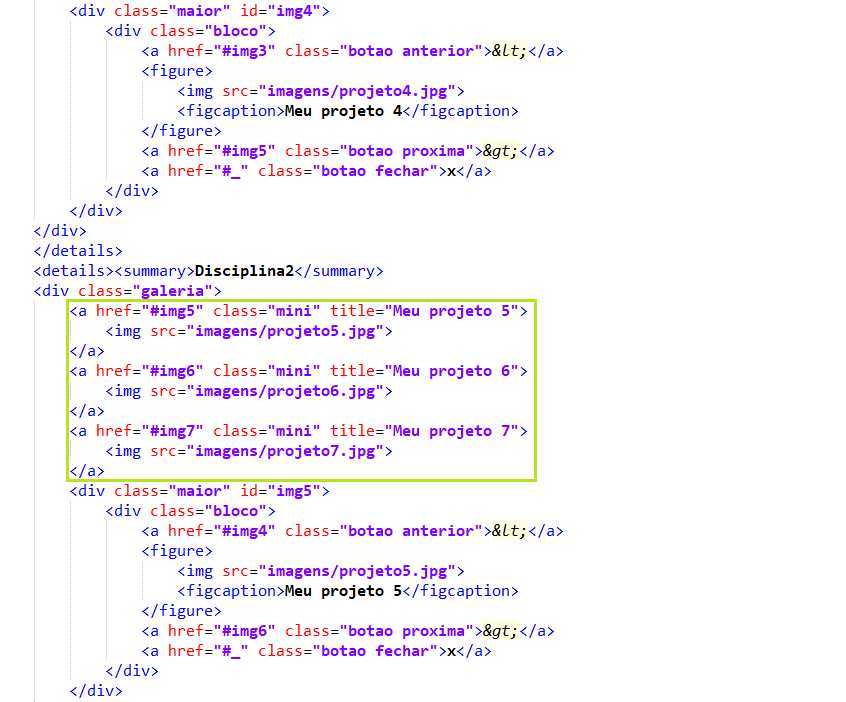
			   <figcaption>Escolha as imagens do próximo grupo da tag <code>&lt;details&gt;</code>.</figcaption>
		   </li>
		   <li>
			   <input type="radio" id="441" name="sl">
			   <label for="441"></label>
			   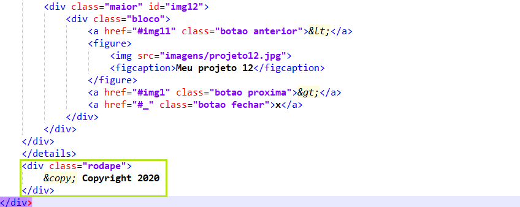
			   <figcaption>Depois da última sub-galeria, não se esqueça de fechar a tag <code>&lt;/details&gt;</code> para iniciar a tag de rodapé.</figcaption>
		   </li>
		   <li>
			   <input type="radio" id="442" name="sl">
			   <label for="442"></label>
			   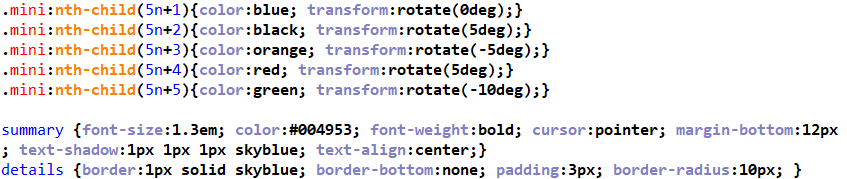
			   <figcaption>No CSS, basta inserir propriedades de cores, margens e bordas. Como são tags nativas, não precisam de "ponto" e nem de "hashtag" antes de seus nomes.</figcaption>
		   </li>
		   <li>
			   <input type="radio" id="443" name="sl">
			   <label for="443"></label>
			   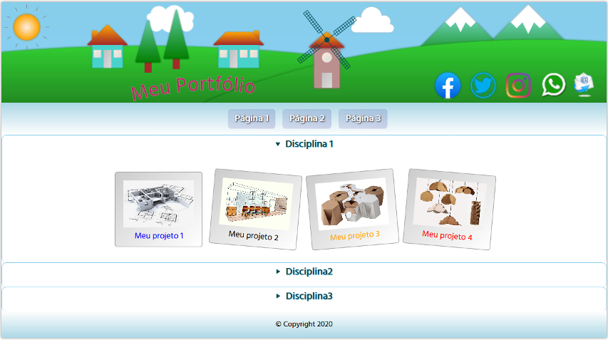
			   <figcaption>Este é o resultado com a primeira sub-galeria aberta.</figcaption>
		   </li>
		   <li>
			   <input type="radio" id="444" name="sl">
			   <label for="444"></label>
			   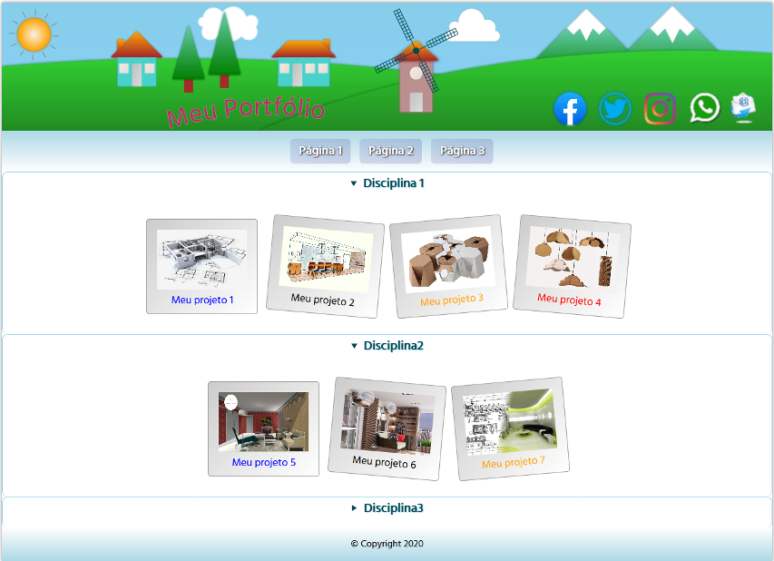
			   <figcaption>Com as duas primeiras sub-galerias abertas.</figcaption>
		   </li>
		   <li>
			   <input type="radio" id="445" name="sl">
			   <label for="445"></label>
			   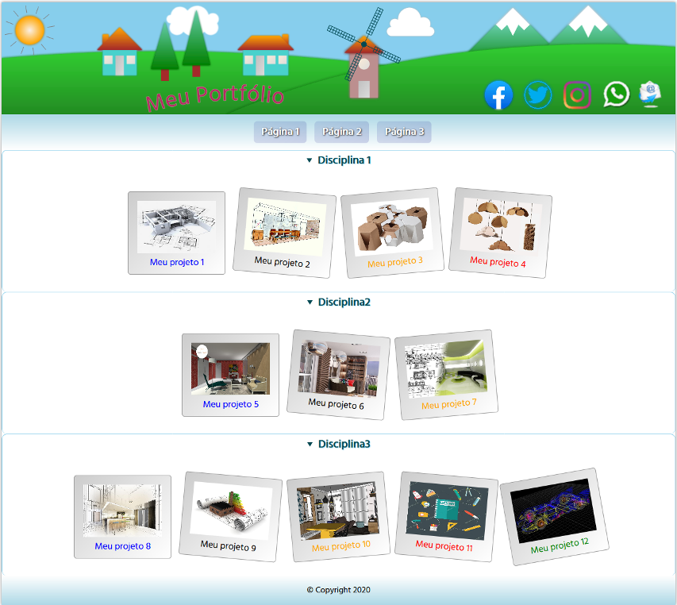
			   <figcaption>E com as 3 sub-galerias abertas. Crie sua página de portfólio com a quantidade necessária de sub-galerias.</figcaption>
		   </li>
		   <li>
			   <input type="radio" id="445a" name="sl">
			   <label for="445a"></label>
			   <figcaption>Trecho da estrutura CSS da galeria da Atividade 10 com divisões:
<pre><code>summary {font-size:1.3em; color:#004953; font-weight:bold; cursor:pointer; margin-bottom:12px; text-shadow:1px 1px 1px skyblue; text-align:center;}
details {border:1px solid skyblue; border-bottom:none; padding:3px; border-radius:10px; }</code></pre>
Trecho da estrutura HTML da galeria da Atividade 10 com divisões:
<pre><code>&lt;details open&gt;&lt;summary&gt;Disciplina 1&lt;/summary&gt;
&lt;div class="galeria"&gt;
	MINIATURAS DAS IMAGENS DA DISCIPLINA 1
	IMAGENS AMPLIADAS DA DISCIPLINA 1
&lt;/div&gt;
&lt;/details&gt;
&lt;details open&gt;&lt;summary&gt;Disciplina 2&lt;/summary&gt;
&lt;div class="galeria"&gt;
	MINIATURAS DAS IMAGENS DA DISCIPLINA 2
	IMAGENS AMPLIADAS DA DISCIPLINA 2
&lt;/div&gt;
&lt;/details&gt;</code></pre></figcaption>
		   </li>
		</ul>
		
  

	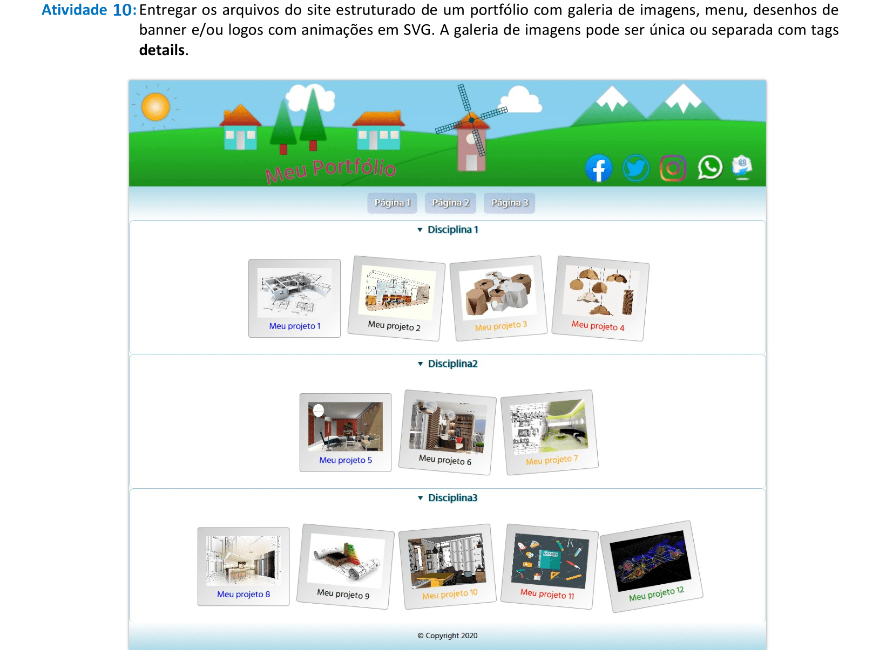
	
<a href="#css5" class="topo">voltar ao topo</a>

<h4>página desenvolvida por:</h4> 

Paulo Henrique Siqueira
  

<b>contato:</b> paulohscwb@gmail.com 
 

 Fundamentos do Webdesign de <a xmlns:cc="http://creativecommons.org/ns#" href="https://paulohscwb.github.io/webdesign/" property="cc:attributionName" rel="cc:attributionURL">Paulo Henrique Siqueira</a> está licenciado com uma Licença <a rel="license" href="http://creativecommons.org/licenses/by-nc-nd/4.0/">Creative Commons Atribuição-NãoComercial-SemDerivações 4.0 Internacional</a>.

<h4>Como citar este trabalho:</h4> 

Siqueira, P.H., "Fundamentos do Webdesign". Disponível em: <https://paulohscwb.github.io/webdesign/>, Setembro de 2020.

<h4>Referências:</h4>
<ol>
	<li>W3Schools. <i>HTML - The language for building web pages:</i> <a href="https://www.w3schools.com/" target="_blank">https://www.w3schools.com/</a></li>
	<li>Origamid. <i>Flex Container:</i> <a href="https://origamid.com/projetos/flexbox-guia-completo/" target="blank">https://origamid.com/projetos/flexbox-guia-completo/</a></li>
	<li>Soueidan, S. <i>A Guide to SVG Animations (SMIL):</i> <a href="https://css-tricks.com/guide-svg-animations-smil/" target="_blank">https://css-tricks.com/guide-svg-animations-smil/</a></li>
	<li>Bracey, K. <i>How to Use “animateTransform” for Inline SVG Animation:</i> <a href="https://webdesign.tutsplus.com/tutorials/how-to-use-animatetransform-for-inline-svg-animation--cms-22296" target="_blank">https://webdesign.tutsplus.com/tutorials/how-to-use-animatetransform-for-inline-svg-animation--cms-22296</a></li>
	<li>Adams, C., Bolton, J., Johnson, D., Smith, S., Snook, J. <i>A arte e a ciência da
	CSS</i>. Sitepoint, 2009</li>
	<li>Marcotte, E. <i>Responsive Web Design</i>. A Book Apart. 2011</li>
	<li>Mazza, L. <i>HTML5 e CSS3: Domine a Web do futuro</i>. Casa do código, 2012</li>
	<li>Kalbach, J. <i>Design de navegação web: otimizando a experiência do usuário</i>. Porto
	Alegre, RS: Bookman, 2009</li>
	<li>Mathis, L. <i>Designed for Use: Usable Interfaces for Applications and the Web</i>. The
	Pragmatic Bookshelf, 2011</li>
	<li>Powers, D. <i>O guia essencial para dreamweaver CS4 com CSS, ajax e PHP</i>. Ed. Alta
	Books, 2009</li>
	<li>Souders, S. <i>High performance web sites: essential knowledge for frontend
	engineers</i>. Sebastopol; Farnham: O&#39;Reilly, 2007</li>
	<li>Zemel, T. <i>Web design responsivo: páginas adaptáveis para todos os
	dispositivos</i>. São Paulo, SP: Casa do Código, 2015</li>
<ol>
