<head>
<link rel="stylesheet" href="scripts/style.css">
</head>

<h2 id="inicio">Construção de páginas com HTML</h2>

Este site contém os procedimentos para construirmos sites em HTML, foco da disciplina Fundamentos do Webdesign

A apostila está disponível no link: <a href="http://www.exatas.ufpr.br/portal/degraf_paulo/wp-content/uploads/sites/4/2014/09/tags001.pdf" target="_blank">apostila de Webdesign</a>

Os materiais usados estão indicados nos links dos tópicos das atividades.

  
Estruturas básicas: pág. 1-10

   
   

&#x1f4c3; Escolha de cores

	
Existem vários sites que mostram as escolhas de cores para usar em HTML. Vamos começar usando as cores com códigos HTML ou hexadecimais. Clique nos passos abaixo para ver como podemos escolher cores em 2 sites.

	  <ul class="slider">
		  <li>
			   <input type="radio" id="slide001" name="slide" checked>
			   <label for="slide001"></label>
			   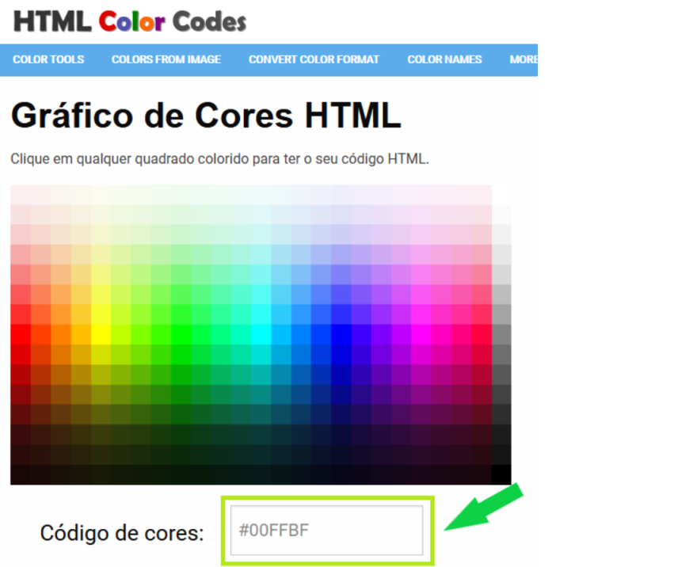
			   <figcaption>Acessando o site <a href="http://html-color-codes.info/Codigos-de-Cores-HTML/" target="_blank">http://html-color-codes.info/Codigos-de-Cores-HTML/</a>, você pode clicar em cores pré-definidas pelo site. Note que o código hexadecimal aparece logo abaixo das cores.</figcaption>
		   </li>
		   <li>
			   <input type="radio" id="slide002" name="slide">
			   <label for="slide002"></label>
			   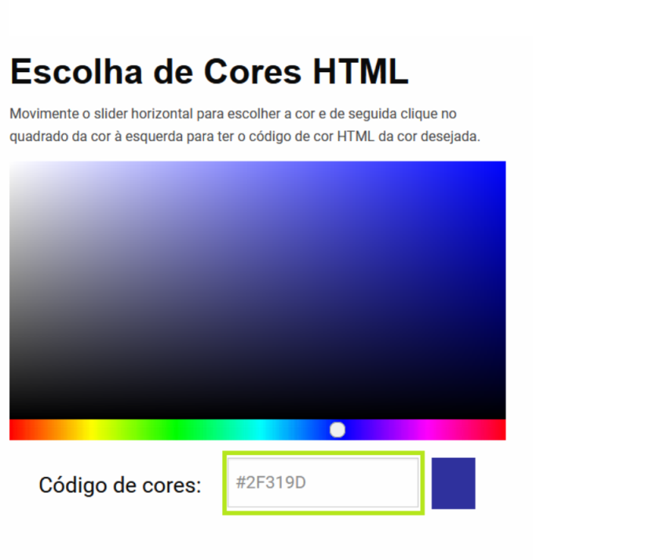
			   <figcaption>Logo abaixo, você encontra outra maneira de escolher cores neste mesmo site. Basta escolher o tom da cor e clicar sobre a cor escolhida.</figcaption>
		   </li>
		   <li>
			   <input type="radio" id="slide003" name="slide">
			   <label for="slide003"></label>
			   
			   <figcaption>Acessando o site <a href="https://color.adobe.com/pt/create/color-wheel/" target="_blank">https://color.adobe.com/pt/create/color-wheel/</a>, você pode escolher as cores de forma análoga. Note que aparecem os códigos hexadecimais e RGB logo abaixo do disco de cores.</figcaption>
		   </li>
		   <li>
			   <input type="radio" id="slide004" name="slide">
			   <label for="slide004"></label>
			   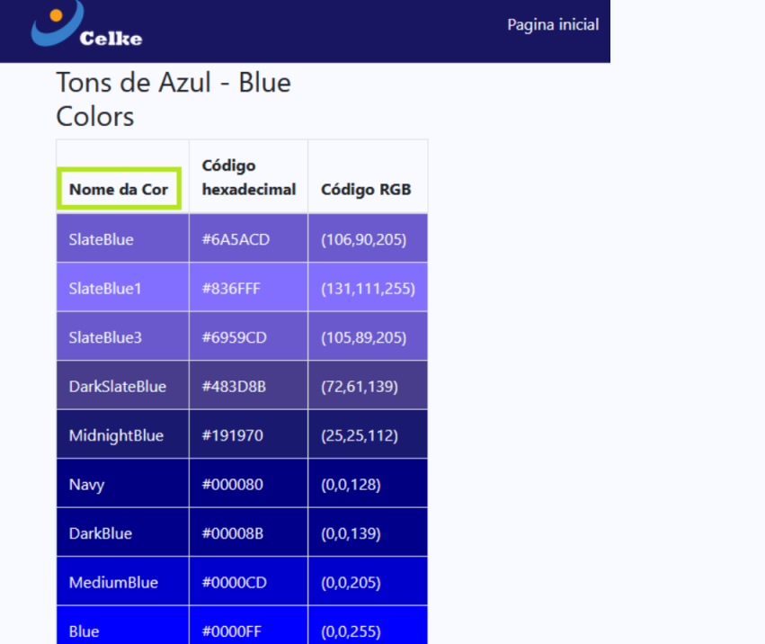
			   <figcaption>Outro site interessante é <a href="https://celke.com.br/artigo/tabela-de-cores-html-nome-hexadecimal-rgb" target="_blank">https://celke.com.br/artigo/tabela-de-cores-html-nome-hexadecimal-rgb</a>, que além dos códigos RGB e hexadecimais mostra os nomes das cores usadas em HTML na primeira coluna da tabela.</figcaption>
		   </li>
		</ul>
		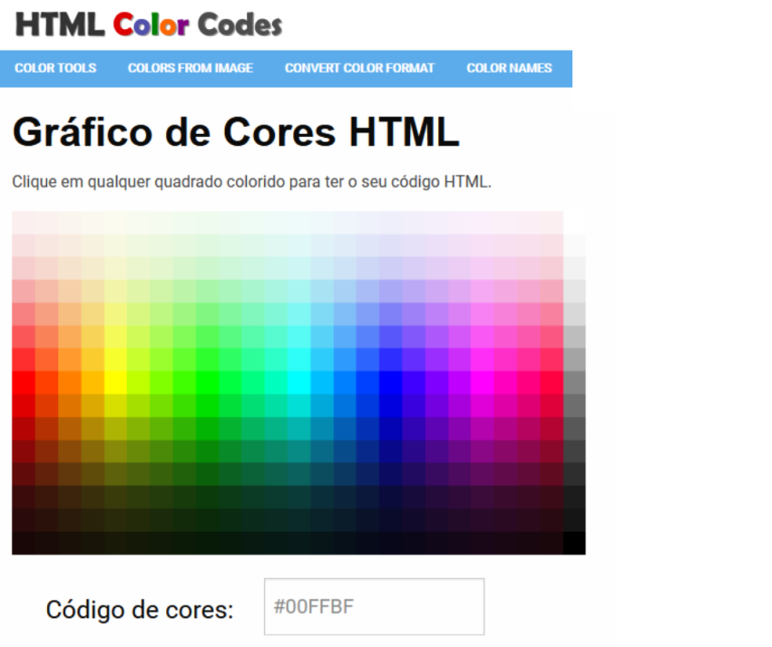
  

  
   

&#x1f4c3; Texto para testar layouts

	
Muitas vezes, nosso foco é de testar somente o layout de um site. Podemos preenchê-lo com textos e listas usando o site mostrado nesta página. Clique nos passos abaixo para ver como produzir estes conteúdos.

	  <ul class="slider">
		  <li>
			   <input type="radio" id="slide005" name="slide">
			   <label for="slide005"></label>
			   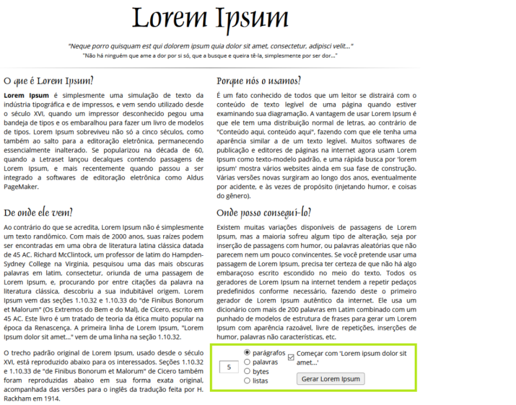
			   <figcaption>Acessando o site <a href="http://br.lipsum.com/" target="_blank">http://br.lipsum.com/</a>, você pode criar blocos de textos ou listas, usados para testarmos layouts.</figcaption>
		   </li>
		   <li>
			   <input type="radio" id="slide006" name="slide">
			   <label for="slide006"></label>
			   
			   <figcaption>Escolha a criação de 2 parágrafos para fazermos um teste. Copie e cole este texto produzido no programa <code>Notepad</code> (<code>Bloco de Notas</code>) do Windows.</figcaption>
		   </li>
		</ul>
		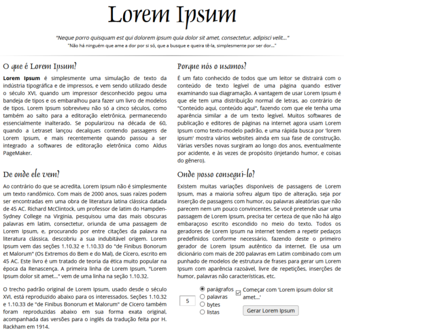
  

  
<a href="#basico" class="topo">voltar ao topo</a>

  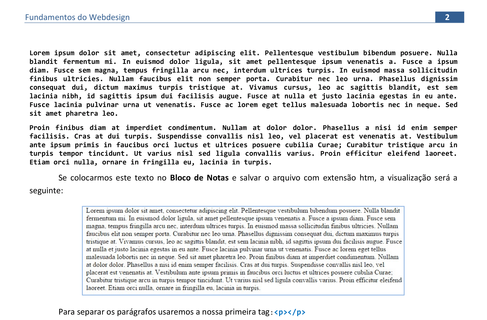
  

&#x1f4c3; Texto para testar layouts

	
Vamos salvar nosso arquivo em uma pasta chamada <code>webdesign</code>.

	  <ul class="slider">
		  <li>
			   <input type="radio" id="slide007" name="slide">
			   <label for="slide007"></label>
			   
			   <figcaption>Escolha a opção do Bloco de Notas <code>Salvar como</code>. Salve o arquivo como <code>pagina1.htm</code>. Uma dica importantíssima é de <b>não usar acentuação para nomear as páginas</b>!!!</figcaption>
		   </li>
		   <li>
			   <input type="radio" id="slide008" name="slide">
			   <label for="slide008"></label>
			   
			   <figcaption>É muito importante lembrar que a extensão do arquivo deve ser <code>.htm</code> ou <code>.html</code>. Abra o arquivo em um navegador de internet. Como não foram feitas as marcações dos parágrafos, vamos colocá-las no arquivo.</figcaption>
		   </li>
		   <li>
			   <input type="radio" id="slide009" name="slide">
			   <label for="slide009"></label>
			   
			   <figcaption>Antes de cada parágrafo, devemos colocar a tag <code>&lt;p&gt;</code>. Logo após o parágrafo, colocamos a tag de fechamento de parágrafo <code>&lt;/p&gt;</code>. Faça isso nos 2 parágrafos e visualize a página em um navegador.</figcaption>
		   </li>
		</ul>
		
  

  
  
<a href="#basico" class="topo">voltar ao topo</a>

  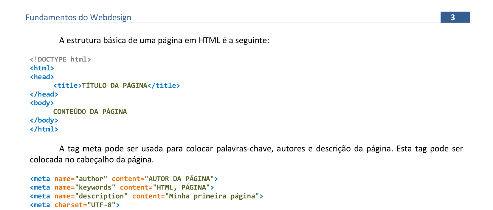
  

&#x1f4c3; Layout básico de uma página

	
O layout básico de uma página HTML tem as seguintes partes: cabeçalho (<code>head</code>) e corpo da página (<code>body</code>). Vamos ver os elementos de cada parte:

	  <ul class="slider">
		  <li>
			   <input type="radio" id="slide010" name="slide">
			   <label for="slide010"></label>
			   
			   <figcaption>O cabeçalho <code>&lt;head&gt;</code> contém informações autorais, título, codificação de caracteres, palavras-chave, scripts e referências externas. Nem todos os elementos desta tag são visíveis para os visitantes da página.</figcaption>
		   </li>
		   <li>
			   <input type="radio" id="slide011" name="slide">
			   <label for="slide011"></label>
			   
			   <figcaption>Dentro da tag do corpo da página <code>&lt;body&gt;</code> devemos colocar todos os contéudos visíveis para os visitantes.</figcaption>
		   </li>
		</ul>
		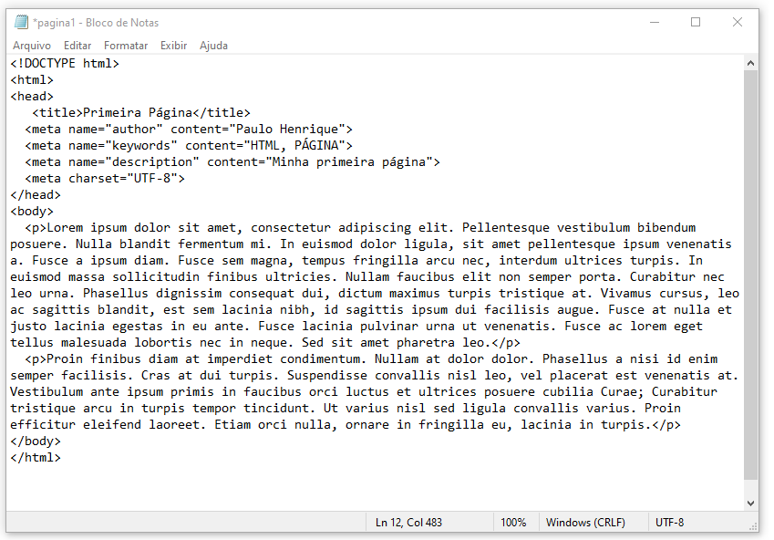
  

  
  

&#x1f4c3; Fundo da página, alinhamentos

	
Vamos deixar todos os arquivos desta disciplina organizados. Podemos criar uma pasta chamada <code>pagina1</code> para colocar todos os arquivos desta primeira página. É importante deixar os arquivos sempre organizados em pastas para usarmos as referências corretas na hora de montar o site.

	  <ul class="slider">
		  <li>
			   <input type="radio" id="slide012" name="slide">
			   <label for="slide012"></label>
			   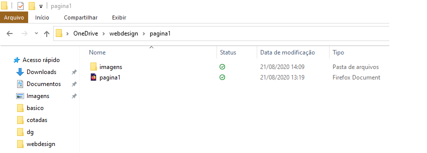
			   <figcaption>Crie uma pasta dentro da pasta <code>pagina1</code> para colocarmos as imagens. Podemos chamá-la de <code>imagens</code>.</figcaption>
		   </li>
		   <li>
			   <input type="radio" id="slide012a" name="slide">
			   <label for="slide012a"></label>
			   
			   <figcaption>Podemos escolher uma imagem para colocar no fundo da página (<code>background</code>). Escolha uma com largura maior do que 1000px, para cobrir todo o fundo da página, e salve na pasta que criamos <code>/imagens</code>.</figcaption>
		   </li>
		   <li>
			   <input type="radio" id="slide013" name="slide">
			   <label for="slide013"></label>
			   
			   <figcaption>Na tag do corpo da página, colocamos o caminho da imagem salva: <code>&lt;body background="imagens/fundo.jpg"&gt;</code>. Salve e veja a página renderizada em um navegador.</figcaption>
		   </li>
		   <li>
			   <input type="radio" id="slide014a" name="slide">
			   <label for="slide014a"></label>
			   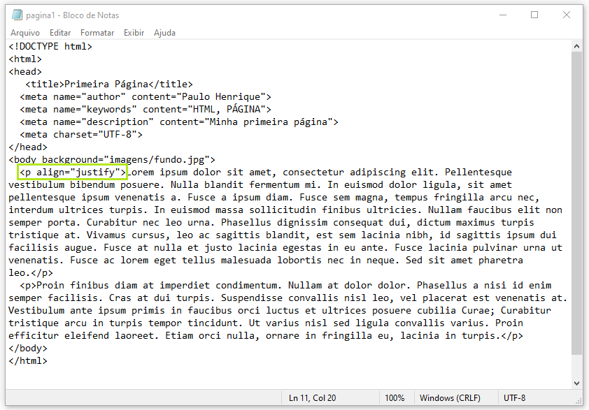
			   <figcaption>Os alinhamentos dos parágrafos podem ser definidos dentro de cada tag. Por exemplo, se você quiser deixar o primeiro parágrafo justificado, basta usar a tag <code>&lt;p align="justify"&gt;</code>.</figcaption>
		   </li>
		   <li>
			   <input type="radio" id="slide014" name="slide">
			   <label for="slide014"></label>
			   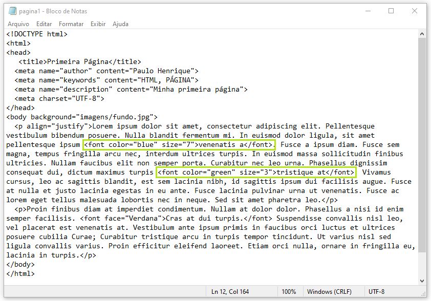
			   <figcaption>Para destacar partes do texto, podemos mudar cores e tamanhos. Neste exemplo, dois trechos estão destacados com cores diferentes usando a tag <code>&lt;font&gt;</code>. Dentro desta tag, você muda cor, tamanho e família da fonte (face). Note que ela precisa de fechamento para o fim do destaque: <code>&lt;/font&gt;</code></figcaption>
		   </li>
		   <li>
			   <input type="radio" id="slide015" name="slide">
			   <label for="slide015"></label>
			   
			   <figcaption>Se você quiser que a página toda tenha uma configuração específica de fonte, basta abrir a tag no começo do corpo da página, e fechá-la antes do fechamento da tag <code>&lt;/body&gt;</code>. No exemplo, foi colocada a fonte <b>Verdana</b> na página toda.</figcaption>
		   </li>
		</ul>
		
  

  
  

&#x1f4c3; Barra separadora e títulos

	
Podemos separar conteúdos usando uma tag simples de barra horizontal. Além disso, podemos destacar trechos do texto colocando negrito, itálico ou sublinhado. Títulos de seções também podem ser feitos com tags simples mostradas a seguir:

	  <ul class="slider">
		  <li>
			   <input type="radio" id="slide016" name="slide">
			   <label for="slide016"></label>
			   
			   <figcaption>Usando a tag <code>&lt;hr&gt;</code>, podemos separar conteúdos na página. Essa tag não precisa ser fechada! Você pode configurar a altura, largura e cor. A largura em percentual é muito usada para deixar o site responsivo, ou seja, que abre em qualquer dispositivo.</figcaption>
		   </li>
		   <li>
			   <input type="radio" id="slide017" name="slide">
			   <label for="slide017"></label>
			   
			   <figcaption>Os títulos de seções podem ser definidos com as tags h1, h2, ..., h6. No exemplo, usamos o título com a tag <code>&lt;h3&gt;</code>. Quanto maior o número, menor o tamanho da fonte desta tag. Experimente mudar essa tag para h1 e h6.</figcaption>
		   </li>
		   <li>
			   <input type="radio" id="slide018" name="slide">
			   <label for="slide018"></label>
			   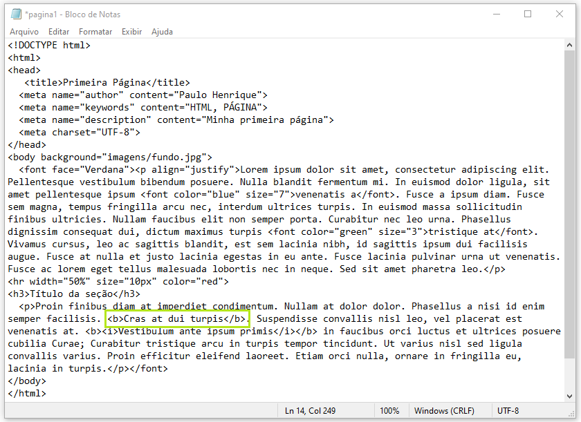
			   <figcaption>A tag de negrito <code>&lt;b&gt;</code> foi usada neste exemplo para um trecho do texto. Não esqueça de fechá-la para que seu site apareça corretamente. Salve a página renderizada em um navegador.</figcaption>
		   </li>
		   <li>
			   <input type="radio" id="slide019" name="slide">
			   <label for="slide019"></label>
			   
			   <figcaption>Neste exemplo, foi usada uma tag por dentro da outra (aninhada). Um trecho foi destacado em negrito e itálico com as tags <code>&lt;b&gt;&lt;i&gt;</code>. Note que ambas precisam ser fechadas.</figcaption>
		   </li>
		   <li>
			   <input type="radio" id="slide020" name="slide">
			   <label for="slide020"></label>
			   
			   <figcaption>Se você quiser destacar um trecho do texto deixando-o riscado, basta usar a tag <code>&lt;strike&gt;Sed sit amet pharetra leo.&lt;/strike&gt;</code>. Essa tag é usada em sites para mostrar preços de produtos.</figcaption>
		   </li>
		</ul>
		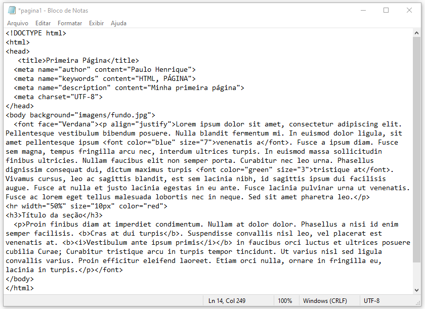
  

  
<a href="#basico" class="topo">voltar ao topo</a>

  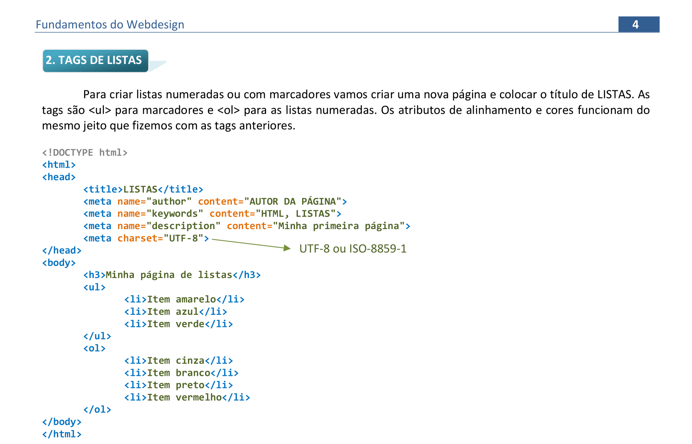
  

&#x1f4c3; Listas

	
Agora vamos criar uma outra página, dentro da pasta da disciplina, crie a pasta <code>webdesign/pagina2/</code>. Nesta página, vamos criar elementos de listas.

	  <ul class="slider">
		  <li>
			   <input type="radio" id="slide021" name="slide">
			   <label for="slide021"></label>
			   
			   <figcaption>Dependendo do servidor usado para hospedar sua página, devemos modificar a codificação de caracteres charset de <b>UTF-8</b> para <b>ISO-8859-1</b>. Porém, a maioria dos servidores usa o <b>UTF-8</b>.</figcaption>
		   </li>
		   <li>
			   <input type="radio" id="slide022" name="slide">
			   <label for="slide022"></label>
			   
			   <figcaption>Usando a tag <code>&lt;ul&gt;</code>, podemos criar listas na página. Este exemplo mostra os marcadores circulares da lista.</figcaption>
		   </li>
		   <li>
			   <input type="radio" id="slide023" name="slide">
			   <label for="slide023"></label>
			   
			   <figcaption>Os itens das listas têm tags <code>&lt;li&gt;</code>. Note que cada tag de item precisa ser fechada, depois que você coloca o conteúdo. Para mudar de cor, coloque a tag de fonte aninhada na tag de item da lista. Mude as cores dos outros itens.</figcaption>
		   </li>
		   <li>
			   <input type="radio" id="slide024" name="slide">
			   <label for="slide024"></label>
			   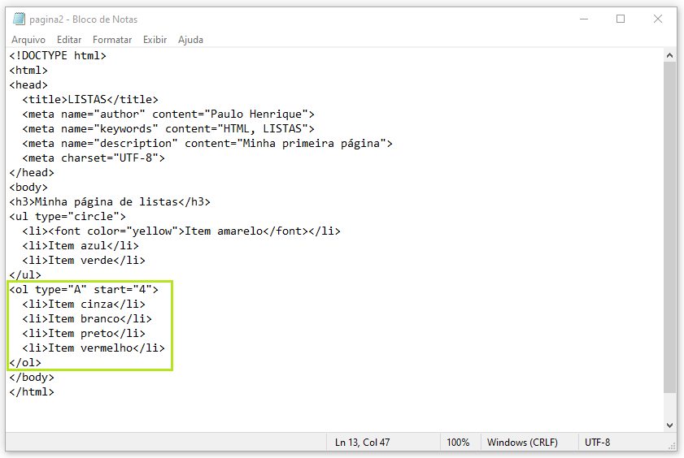
			   <figcaption>As listas ordenadas têm a mesma estrutura da lista norma, com a tag principal <code>&lt;ol&gt;</code>. Estas tags podem ser numéricas ou com letras. Neste exemplo, a lista com letras começa na 4a letra, ou seja, a letra <b>D</b>.</figcaption>
		   </li>
		</ul>
		
  

  
  
<a href="#basico" class="topo">voltar ao topo</a>

  
  

&#x1f4c3; Imagens

	
Agora vamos criar uma outra página, dentro da pasta da disciplina: crie a pasta <code>webdesign/pagina3/</code>. Nesta página, vamos inserir imagens, por isso, crie uma pasta <code>webdesign/pagina3/imagens</code> para colocarmos todas as imagens do site. Escolha 3 imagens e coloque nesta pasta. As extensões podem ser <b>png</b>, <b>jpg</b> ou <b>jpeg</b>. Preste atenção no atributo <code>src</code>, que contém o caminho da imagem.

	  <ul class="slider">
		  <li>
			   <input type="radio" id="slide025" name="slide">
			   <label for="slide025"></label>
			   
			   <figcaption>A tag de imagem pode ser colocada no meio do texto usando o código <code>&lt;img&gt;</code>. Todos os atributos desta tag ficam dentro da <code>&lt;img&gt;</code>, não precisando ser fechada. A largura em percentual é importante para deixar o site responsivo.</figcaption>
		   </li>
		   <li>
			   <input type="radio" id="slide026" name="slide">
			   <label for="slide026"></label>
			   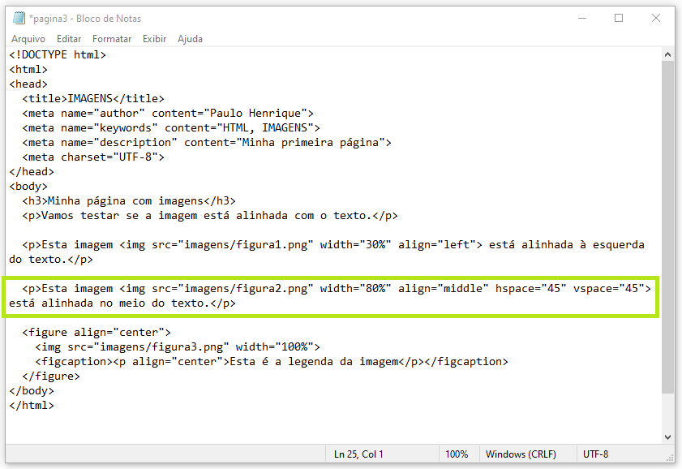
			   <figcaption>Neste segundo exemplo, a imagem também está misturada com o texto, alinhada no meio do texto. Não recomenda-se o uso das imagens misturadas, pois o layout da página fica prejudicado.</figcaption>
		   </li>
		   <li>
			   <input type="radio" id="slide026a" name="slide">
			   <label for="slide026a"></label>
			   
			   <figcaption>Os atributos <code>hspace</code> e <code>vspace</code> criam margens horizontais e verticais em torno da imagem. São ótimas para não deixar outros elementos "grudados" nas imagens.</figcaption>
		   </li>
		   <li>
			   <input type="radio" id="slide027" name="slide">
			   <label for="slide027"></label>
			   
			   <figcaption>De uma forma bem mais organizada, podemos criar a tag-mãe <code>&lt;figure&gt;</code>, que contém a imagem, e logo depois uma tag de legenda <code>&lt;figcaption&gt;</code>. Neste caso, a tag de parágrafo centralizado foi usada para deixar a legenda alinhada com a imagem.</figcaption>
		   </li>
		</ul>
		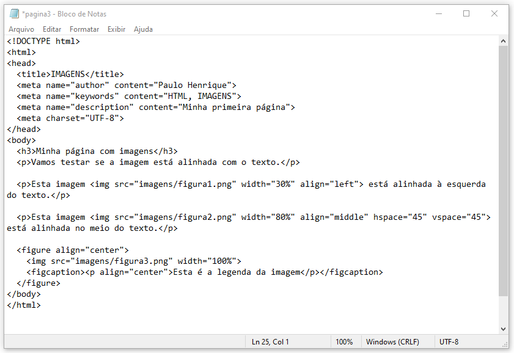
  

  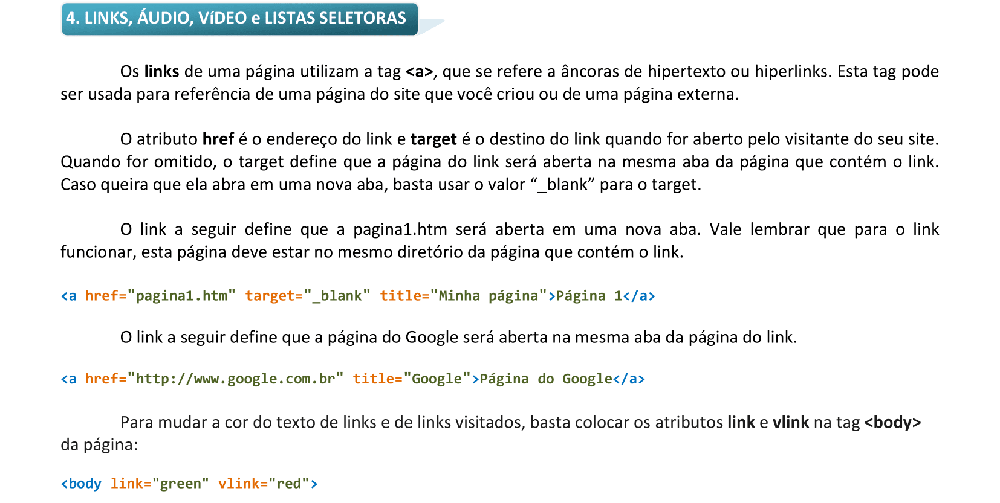
  

&#x1f4c3; Links

	
Usando a mesma <code>pagina3.htm</code>, vamos criar links. Os links podem ser criados em textos ou imagens.

	  <ul class="slider">
		  <li>
			   <input type="radio" id="slide028" name="slide">
			   <label for="slide028"></label>
			   
			   <figcaption>A tag de link é <code>&lt;a&gt;</code>, e precisa de fechamento para você limitar o que o visitante clica para visitar uma outra página. Neste primeiro exemplo, o link está em um texto.</figcaption>
		   </li>
		   <li>
			   <input type="radio" id="slide029" name="slide">
			   <label for="slide029"></label>
			   
			   <figcaption>O atributo <code>href</code> é obrigatório, e indica o endereço da página que será visitada. O atributo <code>target="_blank"</code> indica que a página será aberta em outra aba.</figcaption>
		   </li>
		   <li>
			   <input type="radio" id="slide030" name="slide">
			   <label for="slide030"></label>
			   
			   <figcaption>Para inserir um link em uma imagem, basta deixar a tag <code>&lt;a&gt;</code> aninhada com a tag <code>&lt;img&gt;</code>, como mostra este segundo exemplo. Crie os links, salve a página e teste em um navegador.</figcaption>
		   </li>
		</ul>
		
  

  
<a href="#basico" class="topo">voltar ao topo</a>

  
  

&#x1f4c3; Áudios

	
Usando a mesma <code>pagina3.htm</code>, vamos inserir tags de áudios. Quando você salvar a página e visualizar em um navegador, a opção com controles fornece um "frame" para o vídeo que fica similar à seguinte imagem:

	

	  <ul class="slider">
		  <li>
			   <input type="radio" id="slide031" name="slide">
			   <label for="slide031"></label>
			   
			   <figcaption>Na mesma pasta da nossa<code>pagina3</code>, podemos criar uma subpasta chamada <code>audios</code>. Assim, a estrutura de arquivos da nossa página fica organizada.</figcaption>
		   </li>
		   <li>
			   <input type="radio" id="slide032" name="slide">
			   <label for="slide032"></label>
			   
			   <figcaption>Podemos usar a tag <code>audio</code> em uma única linha, com todas as propriedades definidas dentro desta tag. Esta maneira é comum quando apenas um arquivo é inserido. Os navegadores atuais suportam arquivos com extensão <code>mp3</code>.</figcaption>
		   </li>
		   <li>
			   <input type="radio" id="slide033" name="slide">
			   <label for="slide033"></label>
			   
			   <figcaption>Em navegadores muito antigos, por precaução, podemos definir os formatos <code>mp3</code> e <code>ogg</code>. Esta tag é do tipo aninhada, com os caminhos (src) dos 2 arquivos definidos.</figcaption>
		   </li>
		   <li>
			   <input type="radio" id="slide034" name="slide">
			   <label for="slide034"></label>
			   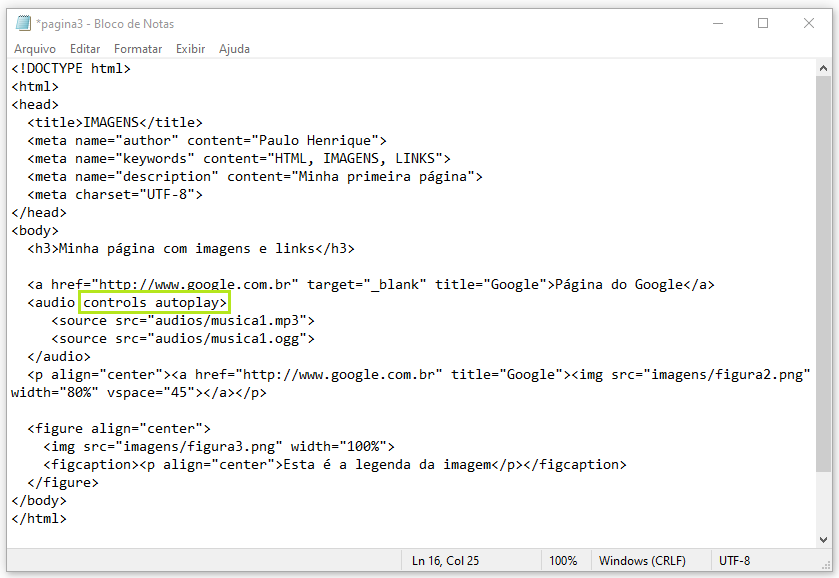
			   <figcaption>O atributo <code>controls</code> serve para mostrar os controles para o visitante interagir com o audio. O atributo <code>autoplay</code> define a reprodução automática do arquivo.</figcaption>
		   </li>
		   <li>
			   <input type="radio" id="slide034a" name="slide">
			   <label for="slide034a"></label>
			   
			   <figcaption>Você pode colocar links para áudios em uma página. Acessando o site <code>open.spotify.com</code>, você pode selecionar as músicas e copiar seus links.</figcaption>
		   </li>
		   <li>
			   <input type="radio" id="slide034b" name="slide">
			   <label for="slide034b"></label>
			   
			   <figcaption>Você pode criar também os links para álbuns, da mesma maneira mostrada para músicas. Na página HTML usamos a tag de link <code>&lt;a&gt;</code> para os álbuns.</figcaption>
		   </li>
		   <li>
			   <input type="radio" id="slide034c" name="slide">
			   <label for="slide034c"></label>
			   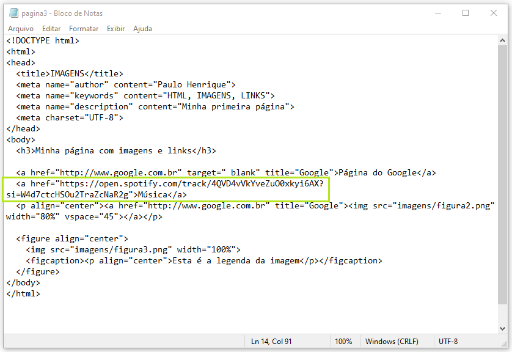
			   <figcaption>Usando a tag de link <code>&lt;a&gt;</code>, você insere os links de músicas em sua página.</figcaption>
		   </li>
		</ul>
		
  

  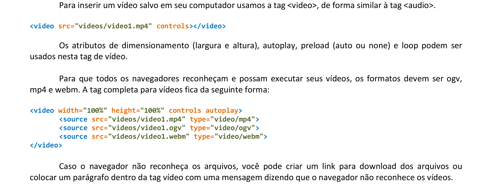
  

&#x1f4c3; Vídeos

	
Vamos criar uma nova pasta chamada <code>webdesign/pagina4</code>. Dentro desta pasta, crie as subpastas de <code>imagens</code> e de <code>videos</code>. Quando você salvar a página e visualizar em um navegador, a opção com controles fornece uma imagem similar à esta:

	

	  <ul class="slider">
		  <li>
			   <input type="radio" id="slide035" name="slide">
			   <label for="slide035"></label>
			   
			   <figcaption>Escolha um arquivo de imagem (pode ser no google) para colocar como um banner da nossa <code>pagina4.htm</code>. Cuidado com a extensão da imagem (jpg, png, jpeg) para indicar o caminho no código HTML.</figcaption>
		   </li>
		   <li>
			   <input type="radio" id="slide036" name="slide">
			   <label for="slide036"></label>
			   
			   <figcaption>Podemos usar a tag <code>video</code> em uma única linha, com todas as propriedades definidas dentro desta tag. Esta maneira é comum quando apenas um arquivo é inserido. A maioria dos navegadores atuais suportam arquivos com extensões <code>mp4</code>, <code>webm</code> e <code>ogv</code>.</figcaption>
		   </li>
		   <li>
			   <input type="radio" id="slide037" name="slide">
			   <label for="slide037"></label>
			   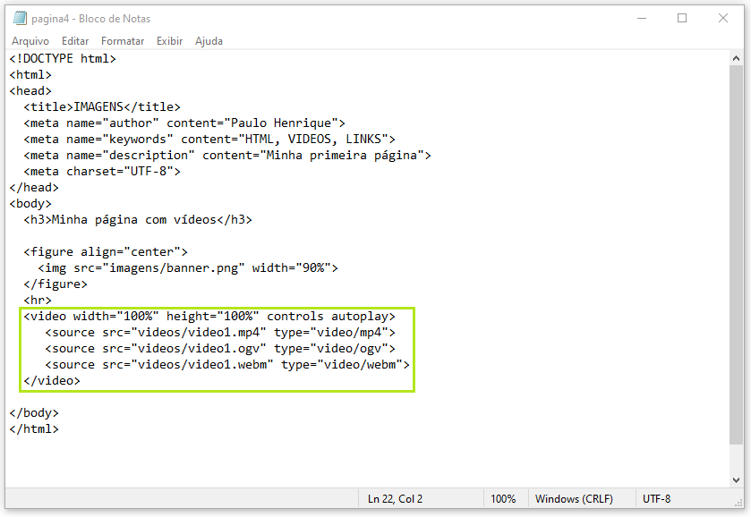
			   <figcaption>Por precaução, podemos definir os formatos <code>mp4</code>, <code>webm </code>e <code>ogv</code> dentro de uma tag de vídeo. Esta tag é do tipo aninhada, com os caminhos (src) dos 3 arquivos de vídeo.</figcaption>
		   </li>
		   <li>
			   <input type="radio" id="slide038" name="slide">
			   <label for="slide038"></label>
			   
			   <figcaption>O atributo <code>controls</code> serve para mostrar os controles para o visitante interagir com o vídeo. O atributo <code>autoplay</code> define a reprodução automática do vídeo.</figcaption>
		   </li>
		   <li>
			   <input type="radio" id="slide039" name="slide">
			   <label for="slide039"></label>
			   
			   <figcaption>Quando inserimos vídeos em uma página, é importante definirmos a altura <code>height</code> e a largura <code>width</code> do vídeo. Estas medidas podem ser indicadas em % ou pixels.</figcaption>
		   </li>
		</ul>
		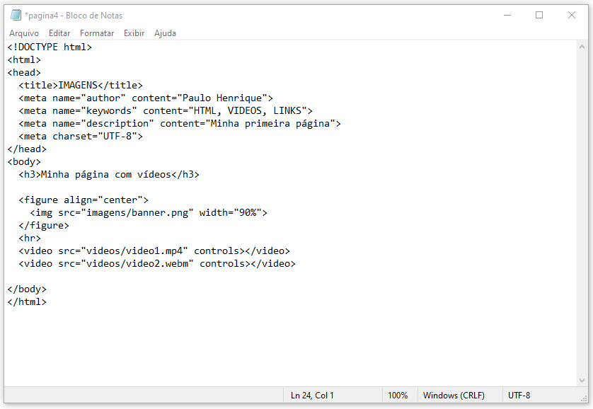
  

  
  

&#x1f4c3; Vídeos do Youtube

	
Para inserir um vídeo do Youtube, usamos a tag <code>iframe</code>. Vamos usar a mesma <code>pagina4.htm</code> para inserir esta tag de vídeo.

	  <ul class="slider">
		  <li>
			   <input type="radio" id="slide040" name="slide">
			   <label for="slide040"></label>
			   
			   <figcaption>Na página do vídeo escolhido, clique em <code>compartilhar</code>, no link que fica logo abaixo da janela do vídeo.</figcaption>
		   </li>
		   <li>
			   <input type="radio" id="slide041" name="slide">
			   <label for="slide041"></label>
			   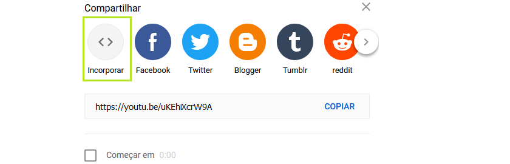
			   <figcaption>Selecione a opção <code>incorporar</code>.</figcaption>
		   </li>
		   <li>
			   <input type="radio" id="slide042" name="slide">
			   <label for="slide042"></label>
			   
			   <figcaption>Agora é só copiar a tag <code>iframe</code> criada. Note que aparecem as medidas que já usamos na tag de <code>video</code>.</figcaption>
		   </li>
		   <li>
			   <input type="radio" id="slide043" name="slide">
			   <label for="slide043"></label>
			   
			   <figcaption>Cole a tag criada na posição da página que você quer mostrar o vídeo. O atributo <code>frameborder</code> tem padrão com valor <b>0</b>. Se você quiser uma borda, basta digitar qualquer valor diferente de <b>0</b> neste atributo.</figcaption>
		   </li>
		</ul>
		
  

  
  

&#x1f4c3; Detalhes da Atividade

	
Usando todas as tags que vimos até agora, vamos montar uma página htm com os elementos descritos abaixo. Crie uma pasta chamada <code>webdesign/atividade1</code> para inserir os arquivos desta atividade. O arquivo principal HTML será chamado de <code>index.htm</code>.

	  <ul class="slider">
		  <li>
			   <input type="radio" id="slide044" name="slide">
			   <label for="slide044"></label>
			   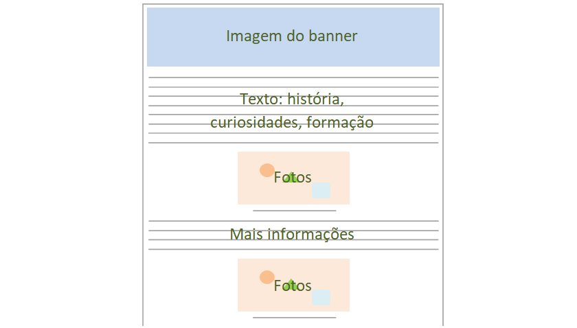
			   <figcaption>Na parte superior da página, que terá um formato tipo blog, coloque uma imagem como <code>banner</code>, textos de informações e curiosidades sobre a banda ou o cantor escolhido.</figcaption>
		   </li>
		   <li>
			   <input type="radio" id="slide045" name="slide">
			   <label for="slide045"></label>
			   
			   <figcaption>Insira imagens, uma imagem de fundo <code>background</code>. Lembre-se de colocar as medidas de altura e largura da imagem na página. Use as tags de linhas horizontais <code>&lt;hr&gt;</code> para separar conteúdos.</figcaption>
		   </li>
		   <li>
			   <input type="radio" id="slide046" name="slide">
			   <label for="slide046"></label>
			   
			   <figcaption>Na parte inferior da página, crie links para áudios e vídeos da banda ou do cantor escolhido. Use links do Spotify ou Youtube. Lembre-se de usar as medidas para criar os <code>iframes</code> dos vídeos.</figcaption>
		   </li>
		   <li>
			   <input type="radio" id="slide047" name="slide">
			   <label for="slide047"></label>
			   
			   <figcaption>No rodapé, você pode colocar informações de copyright com seu nome, usando o código do símbolo &copy;: <code>&amp;copy;</code>.</figcaption>
		   </li>
		</ul>
		
  

  
<a href="#basico" class="topo">voltar ao topo</a>

  
  

&#x1f4c3; Tabelas

	
Crie uma pasta chamada <code>webdesign/pagina5</code> para inserir os arquivos da nossa próxima página, com tabelas. O arquivo principal HTML será chamado de <code>index.htm</code>.

	  <ul class="slider">
		  <li>
			   <input type="radio" id="slide048" name="slide">
			   <label for="slide048"></label>
			   
			   <figcaption>Usamos <code>table</code> como a tag-mãe das células da tabela. Logo, vamos "aninhar" as tags das células da tabela dentro da tag <code>table</code>.</figcaption>
		   </li>
		   <li>
			   <input type="radio" id="slide049" name="slide">
			   <label for="slide049"></label>
			   
			   <figcaption>Toda vez que vamos criar uma linha de tabela, usamos a tag <code>&lt;tr&gt;</code>. Esta tag, por sua vez, terá as tags das células das colunas <code>&lt;td&gt;</code> ou <code>&lt;th&gt;</code> "aninhadas". Dentro destas tags colocamos conteúdos de textos ou imagens.</figcaption>
		   </li>
		   <li>
			   <input type="radio" id="slide050" name="slide">
			   <label for="slide050"></label>
			   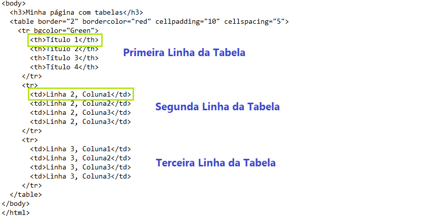
			   <figcaption>As tags <code>&lt;th&gt;</code> podem ser usadas na primeira linha de uma tabela, como linha de títulos. Os textos, podemos digitar diretamente sem tags, como mostra o exemplo. Para colocar imagens, colocamos a tag <code>&lt;img&gt;</code> dentro da tag <code>&lt;td&gt;</code>.</figcaption>
		   </li>
		   <li>
			   <input type="radio" id="slide051" name="slide">
			   <label for="slide051"></label>
			   
			   <figcaption>Os atributos <code>border</code> e <code>bordercolor</code> definem a espessura e a cor da borda de cada célula, respectivamente. O atributo <code>bgcolor</code> pode ser usado para mudar a cor de fundo de uma célula ou de uma linha. No exemplo, o atributo deixa a primeira linha com fundo verde.</figcaption>
		   </li>
		   <li>
			   <input type="radio" id="slide052" name="slide">
			   <label for="slide052"></label>
			   
			   <figcaption>Os atributos <code>cellpadding</code> e <code>cellspacing</code> são as margens interna e externa de cada célula, respectivamente. Salve a página e visualize em um navegador.</figcaption>
		   </li>
		   <li>
			   <input type="radio" id="slide053" name="slide">
			   <label for="slide053"></label>
			   
			   <figcaption>Esta é a função da criação de margens em tabelas. Geralmente usamos o padrão do HTML, com <code>cellspacing="0"</code>.</figcaption>
		   </li>
		</ul>
		
  

  
  

&#x1f4c3; Galeria de imagens

	
Você pode usar a mesma pasta da Atividade 1: <code>webdesign/atividade1</code>. Insira imagens na pasta de <code>webdesign/atividade1/imagens</code>, para criar nossa Galeria.

	  <ul class="slider">
		  <li>
			   <input type="radio" id="slide054" name="slide">
			   <label for="slide054"></label>
			   
			   <figcaption>Podemos criar a tabela que ocupe <b>100%</b> da largura da página. Se criarmos uma galeria com 4 imagens, cada célula terá <b>25%</b> da largura da linha da tabela. Estas dimensões só precisam ser colocadas nas células da primeira linha da tabela. As outras linhas herdarão os valores informados na primeira linha.</figcaption>
		   </li>
		   <li>
			   <input type="radio" id="slide055" name="slide">
			   <label for="slide055"></label>
			   
			   <figcaption>Agora você pode "aninhar" as tags de imagem <code>&lt;img&gt;</code> dentro de tags de link <code>&lt;a&gt;</code>, que estará dentro das respectivas tags de célula <code>&lt;td&gt;</code>. Cuidado com as extensões e os caminhos dos arquivos!</figcaption>
		   </li>
		   <li>
			   <input type="radio" id="slide056" name="slide">
			   <label for="slide056"></label>
			   
			   <figcaption>Este é um exemplo de 8 imagens colocadas em uma tabela de 2 linhas e 4 colunas. Experimente outros formatos. Note que não foram usadas as bordas da tabela neste exemplo. Se necessário, ajuste as alturas das imagens, caso fiquem diferentes na galeria. Salve e teste a página em um navegador.</figcaption>
		   </li>
		</ul>
		
  

  
  

&#x1f4c3; Galeria de vídeos e áudios

	
Você pode usar a mesma pasta da Atividade 1: <code>webdesign/atividade1</code>. Insira arquivos de áudio na pasta de <code>webdesign/atividade1/audios</code>, para criar nossa Galeria.

	  <ul class="slider">
		  <li>
			   <input type="radio" id="slide057" name="slide">
			   <label for="slide057"></label>
			   
			   <figcaption>Podemos criar a tabela que ocupe <b>100%</b> da largura da página. Se criarmos uma galeria com 3 áudios em uma linha e 3 vídeos na outra linha, cada célula terá <b>33%</b> da largura da linha da tabela.</figcaption>
		   </li>
		   <li>
			   <input type="radio" id="slide058" name="slide">
			   <label for="slide058"></label>
			   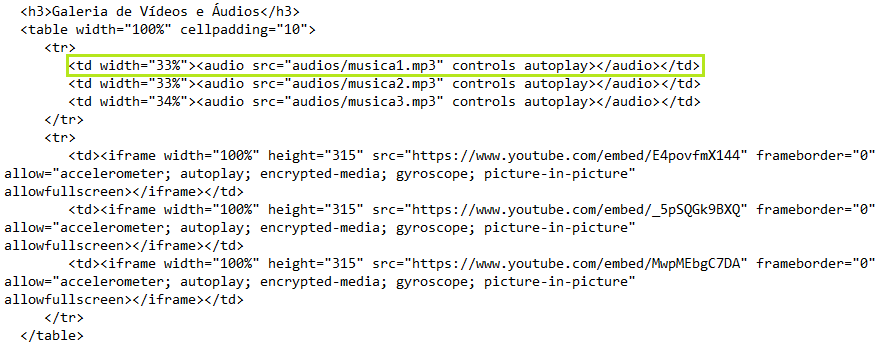
			   <figcaption>Agora você pode "aninhar" as tags <code>&lt;audio&gt;</code> dentro das respectivas tags de célula <code>&lt;td&gt;</code>. Cuidado com as extensões e os caminhos dos arquivos!</figcaption>
		   </li>
		   <li>
			   <input type="radio" id="slide059" name="slide">
			   <label for="slide059"></label>
			   
			   <figcaption>Na linha de vídeos, você pode pegar as estruturas das tags <code>&lt;iframe&gt;</code> do Youtube, ou criar tags <code>&lt;video&gt;</code>. Estas tags devem estar "aninhadas" nas respectivas tags de célula <code>&lt;td&gt;</code>.</figcaption>
		   </li>
		</ul>
		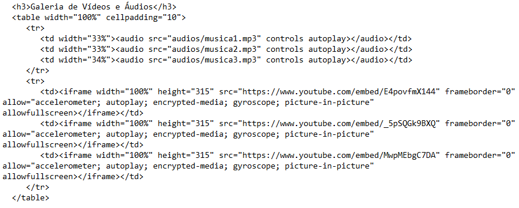
  

  
<a href="#basico" class="topo">voltar ao topo</a>

  
  

&#x1f4c3; Tabela de nutrientes

	
Vamos criar uma pasta para alguns exercícios: <code>webdesign/exercicios</code>. Crie a página do primeiro exercício com o nome <code>webdesign/exercicios/index.htm</code>.

	  <ul class="slider">
		  <li>
			   <input type="radio" id="slide060" name="slide">
			   <label for="slide060"></label>
			   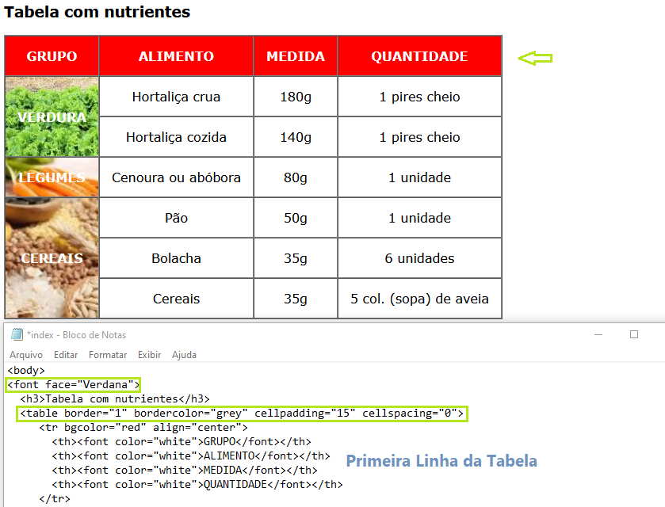
			   <figcaption>Cada célula da tabela tem margem iterna <code>cellpadding</code> de <b>15px</b>, borda na cor <b>cinza</b>. O atributo <code>cellspacing</code> está com valor 0 para não deixar espaços entre as células.</figcaption>
		   </li>
		   <li>
			   <input type="radio" id="slide061" name="slide">
			   <label for="slide061"></label>
			   
			   <figcaption>As tags para criar a primeira linha da tabela usam linha de título <code>&lt;th&gt;</code>, com alinhamento <b>centralizado</b>, fonte com a cor branca e o fundo de cada célula vermelho.</figcaption>
		   </li>
		   <li>
			   <input type="radio" id="slide062" name="slide">
			   <label for="slide062"></label>
			   
			   <figcaption>A segunda linha tem 2 células mescladas na primeira coluna. Para fazer esta operação em HTML usamos o atributo <code>rowspan</code>, indicando quantas linhas serão mescladas. Neste caso, usamos <code>rowspan="2"</code>.</figcaption>
		   </li>
		   <li>
			   <input type="radio" id="slide063" name="slide">
			   <label for="slide063"></label>
			   
			   <figcaption>Temos as outras 3 células da linha 2 normalmente. Como a primeira célula da terceira linha foi mesclada, precisamos apenas das outras 3 células nesta linha.</figcaption>
		   </li>
		   <li>
			   <input type="radio" id="slide064" name="slide">
			   <label for="slide064"></label>
			   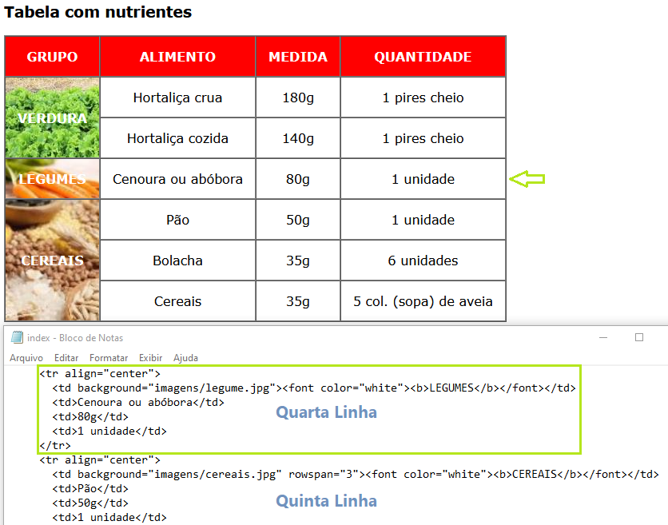
			   <figcaption>A linha dos legumes não tem células mescladas, e os elementos são criados com tags <code>&lt;td&gt;</code>.</figcaption>
		   </li>
		   <li>
			   <input type="radio" id="slide065" name="slide">
			   <label for="slide065"></label>
			   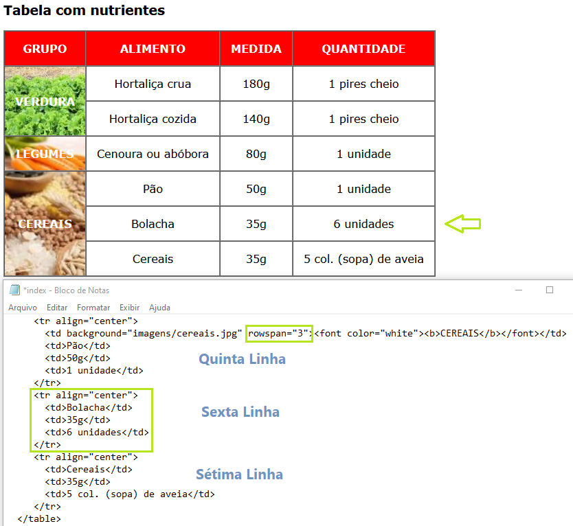
			   <figcaption>Na linha dos cereais, podemos mesclar as três células da primeira coluna com o atributo <code>rowspan="3"</code>. As outras 2 linhas da tabela tem 3 células com os valores indicados no exemplo. Agora complete esta tabela, que vamos utilizar na próxima Atividade.</figcaption>
		   </li>
		</ul>
		
  

  
  

&#x1f4c3; Pesquisa fumantes

	
Este exercício é parecido com o anterior. Na mesma pasta, crie um arquivo: <code>webdesign/exercicios/fumantes.htm</code>.

	  <ul class="slider">
		  <li>
			   <input type="radio" id="slide066" name="slide">
			   <label for="slide066"></label>
			   
			   <figcaption>A primeira célula da primeira linha será mesclada com a célula de baixo. Logo, vamos usar o atributo <code>rowspan="2"</code>.</figcaption>
		   </li>
		   <li>
			   <input type="radio" id="slide067" name="slide">
			   <label for="slide067"></label>
			   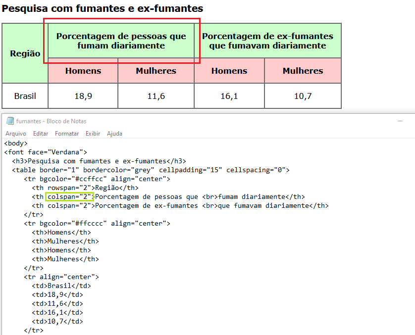
			   <figcaption>A segunda célula da primeira linha será mesclada com a célula do lado. Logo, vamos usar o atributo <code>colspan="2"</code>.</figcaption>
		   </li>
		   <li>
			   <input type="radio" id="slide068" name="slide">
			   <label for="slide068"></label>
			   
			   <figcaption>O mesmo acontece com a quarta célula da primeira linha: <code>colspan="2"</code>. Agora prossiga para concluir a página HTML com esta tabela.</figcaption>
		   </li>
		</ul>
		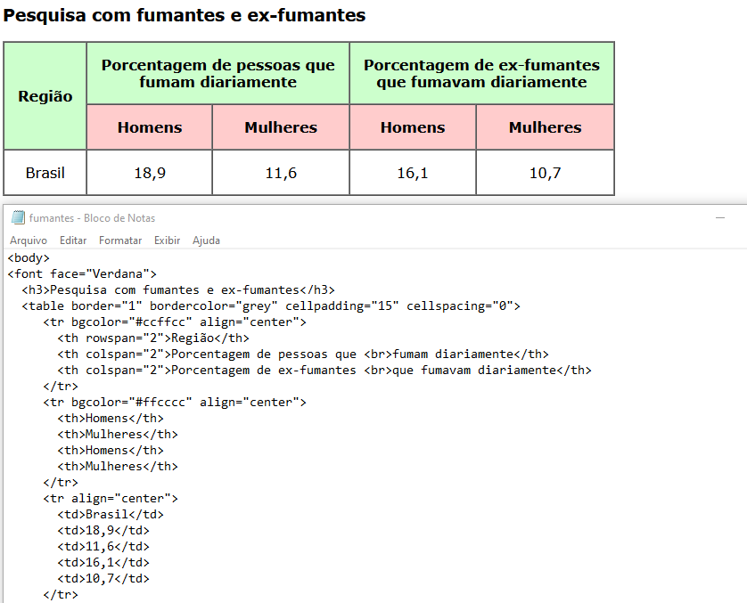
  

  
  
<a href="#basico" class="topo">voltar ao topo</a>

  
  

&#x1f4c3; Tabela de cores

	
Neste exercício vamos criar uma tabela de cores. O exemplo mostra apenas alguns nomes de cores usados em HTML. Na mesma pasta, crie um arquivo: <code>webdesign/exercicios/cores.htm</code>.

	  <ul class="slider">
		  <li>
			   <input type="radio" id="slide069" name="slide">
			   <label for="slide069"></label>
			   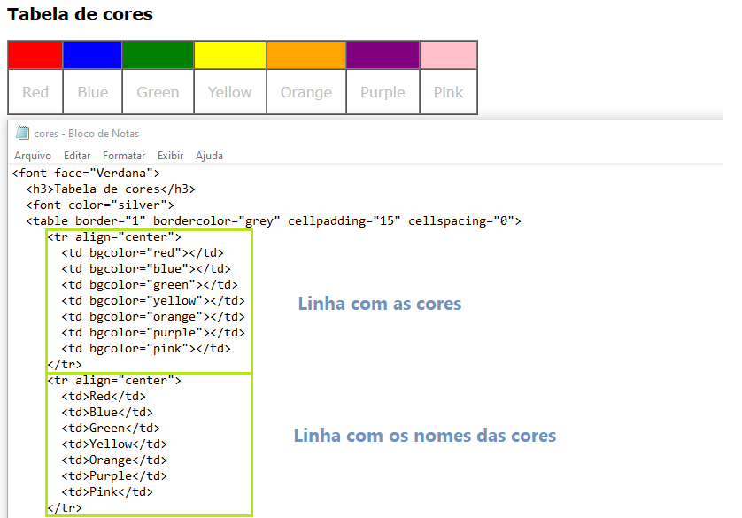
			   <figcaption>Temos duas formas de fazer esta tabela. A primeira é usando exatamente o layout mostrado no exercício. Dessa forma, criaremos sempre 1 linha que mostra somente as cores, e a linha de baixo mostra apenas os nomes das cores.</figcaption>
		   </li>
		   <li>
			   <input type="radio" id="slide070" name="slide">
			   <label for="slide070"></label>
			   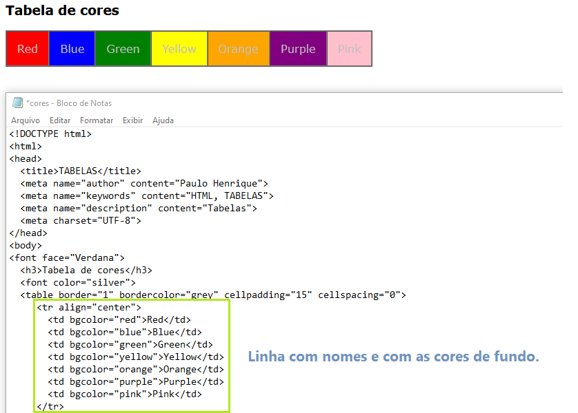
			   <figcaption>Na segunda maneira, podemos criar na mesma célula o nome da cor, com o fundo de mesma cor. Escolha um dos layouts e faça a página completa com a tabela de cores.</figcaption>
		   </li>
		</ul>
		
  

  
  

&#x1f4c3; Detalhes da Atividade

	
A partir desta página, vamos utilizar o software <b>NOTEPAD++</b> para criar nossos próximos projetos. Acesse o endereço <a href="https://notepad-plus-plus.org/downloads/v7.8.8/" target="_blank">https://notepad-plus-plus.org/downloads/v7.8.8/</a> e instale a versão correspondente do seu computador: 32 ou 64 bits. Crie uma pasta <code>webdesign/atividade2</code> para criar os arquivos da próxima atividade. A página principal será <code>index.htm</code>

	  <ul class="slider">
		  <li>
			   <input type="radio" id="slide071" name="slide">
			   <label for="slide071"></label>
			   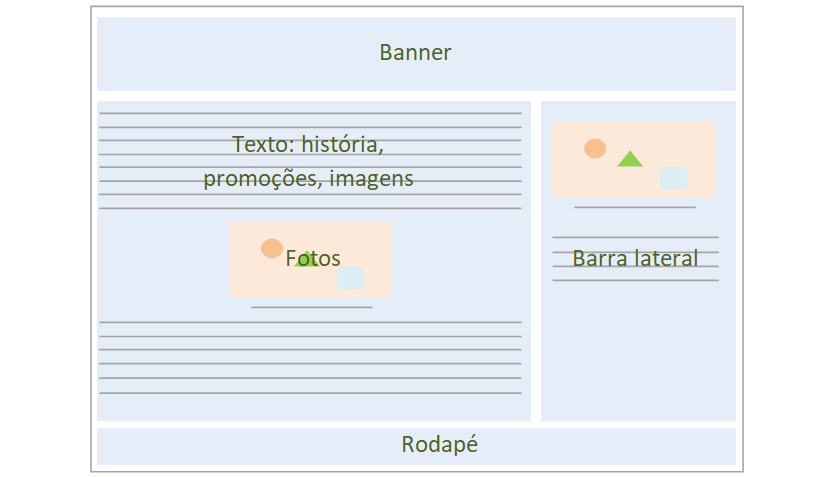
			   <figcaption>O layout da página do nosso site principal da Atividade 2 será feito usando tabelas. A estrutura está mostrada neste exemplo. A primeira tag, logo após começar o corpo da página será <code>&lt;table&gt;</code>.</figcaption>
		   </li>
		   <li>
			   <input type="radio" id="slide072" name="slide">
			   <label for="slide072"></label>
			   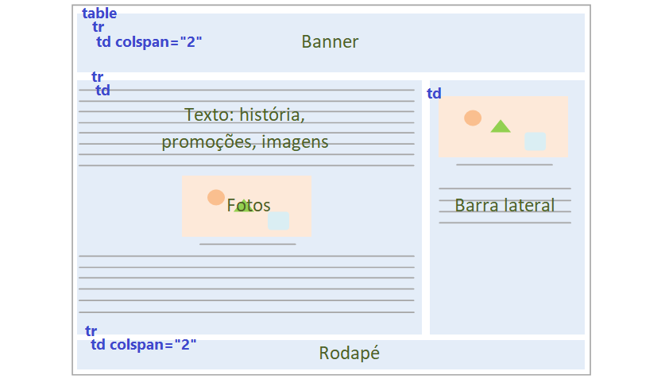
			   <figcaption>O banner da página ocupará o espaço de 2 células, e por isso aplicamos o atributo <code>colspan="2"</code>. Na segunda linha da tabela, criamos uma célula para o conteúdo principal, e outra para a barra lateral com as tags <code>&lt;tr&gt;</code> e <code>&lt;td&gt;</code></figcaption>
		   </li>
		   <li>
			   <input type="radio" id="slide073" name="slide">
			   <label for="slide073"></label>
			   
			   <figcaption>Para finalizar, colocamos o rodapé da página. Este item será inserido com as tags <code>&lt;tr&gt;</code> e <code>&lt;td&gt;</code> usando o atributo de <code>colspan="2"</code> para usar a largura toda da página.</figcaption>
		   </li>
		   <li>
			   <input type="radio" id="slide074" name="slide">
			   <label for="slide074"></label>
			   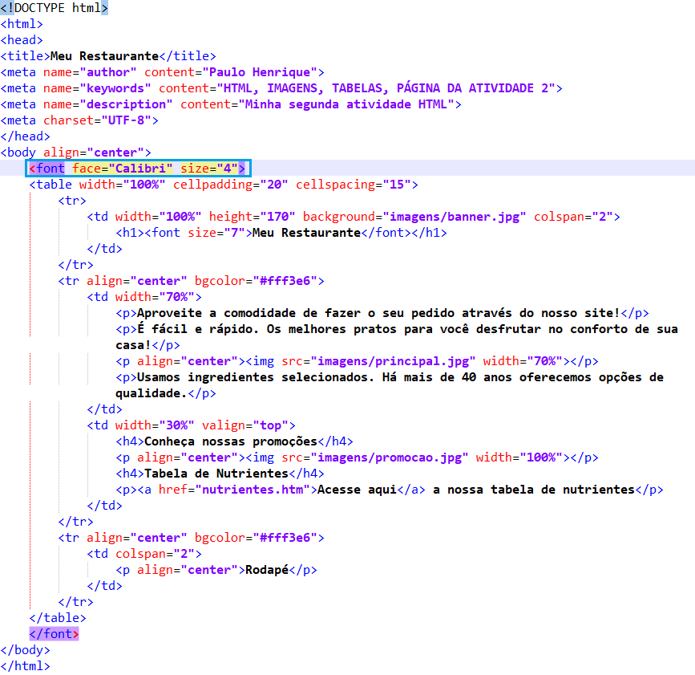
			   <figcaption>A tag de fonte pode ser usada antes da tabela de layout da página. O <b>Notepad++</b> coloca em destaque quando reconhece tags fechadas, facilitando muito a programação da página.</figcaption>
		   </li>
		   <li>
			   <input type="radio" id="slide075" name="slide">
			   <label for="slide075"></label>
			   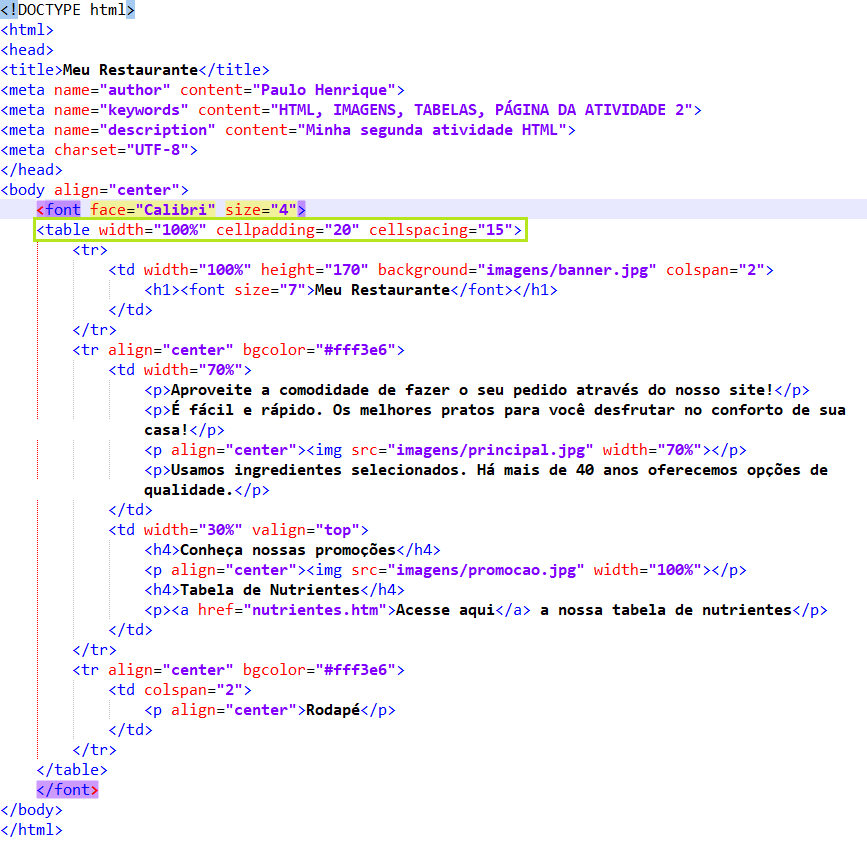
			   <figcaption>As propriedades <code>cellspacing</code> e <code>cellpadding</code> são usadas para fazer as margens interna e externa de cada parte do layout da página. A largura da tabela deve ser de <b>100%</b> para distribuir todo o conteúdo na tela do navegador.</figcaption>
		   </li>
		   <li>
			   <input type="radio" id="slide076" name="slide">
			   <label for="slide076"></label>
			   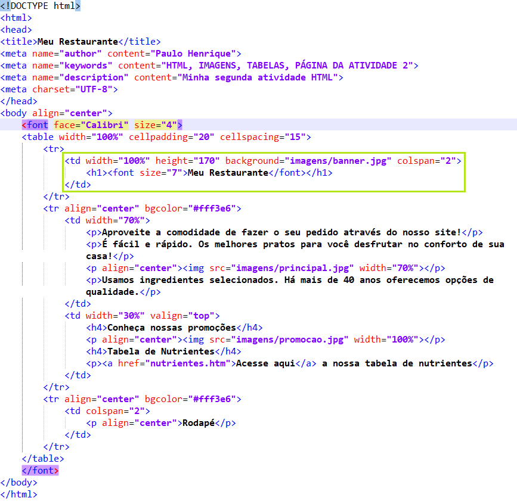
			   <figcaption>A primeira linha, indicada com a tag <code>&lt;tr&gt;</code> contém o banner, com o atributo <code>colspan="2"</code> dentro da tag da célula <code>&lt;td&gt;</code>.</figcaption>
		   </li>
		   <li>
			   <input type="radio" id="slide077" name="slide">
			   <label for="slide077"></label>
			   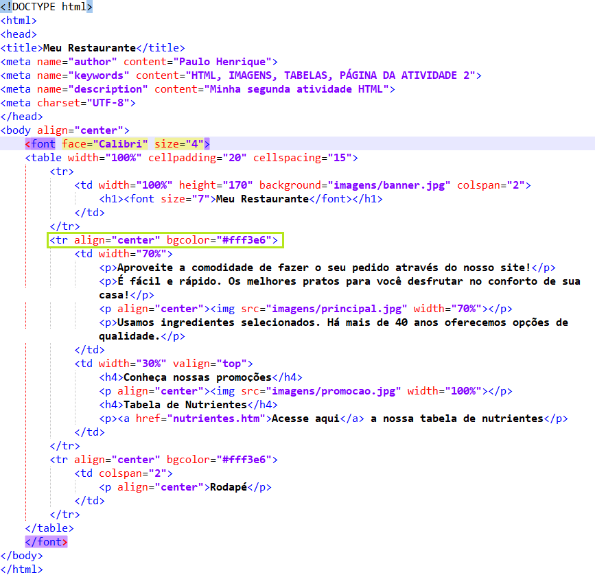
			   <figcaption>A segunda linha da tabela contém a primeira célula do conteúdo principal da página, com a largura de <b>70%</b> e a barra lateral com largura de <b>30%</b>. Dentro das tags <code>&lt;td&gt;</code> podemos inserir os textos e imagens da página.</figcaption>
		   </li>
		   <li>
			   <input type="radio" id="slide078" name="slide">
			   <label for="slide078"></label>
			   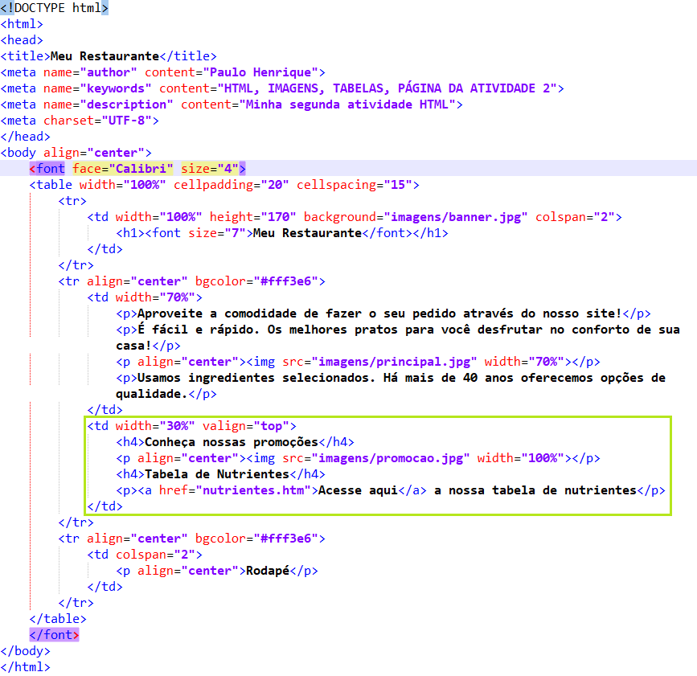
			   <figcaption>Note que o conteúdo da barra lateral geralmente é menor do que o conteúdo principal da página. Por isso, podemos usar o atributo de alinhamento vertical <code>valign="top"</code> para deixar estas partes do site alinhadas. Repare no link para acessar a página de nutrientes.</figcaption>
		   </li>
		   <li>
			   <input type="radio" id="slide079" name="slide">
			   <label for="slide079"></label>
			   
			   <figcaption>Usando o layout dessa página, você pode criar a página <code>nutrientes.htm</code> na mesma pasta da página <code>index.htm</code>. Pegue todo o código da tabela que fizemos dos nutrientes e insira na tag principal desta página (a que tem <b>70%</b> de largura).</figcaption>
			   </li>
		   <li>
			   <input type="radio" id="slide080" name="slide">
			   <label for="slide080"></label>
			   
			   <figcaption>A tag da última linha da tabela contém o rodapé. Nesta tag <code>&lt;td&gt;</code> você pode modificar a cor, alinhamento ou colocar uma imagem de fundo, como foi feito no banner.</figcaption>
		   </li>
		   <li>
			   <input type="radio" id="slide081" name="slide">
			   <label for="slide081"></label>
			   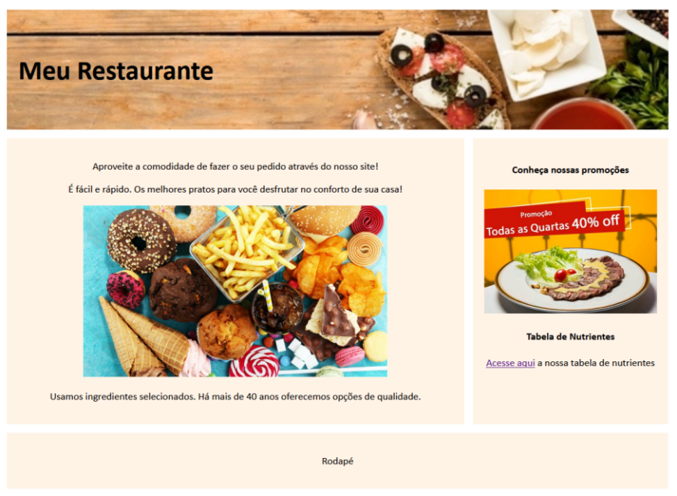
			   <figcaption>O layout mostrado neste exemplo fica desta forma. Usando a estrutura mostrada neste exemplo, crie o site de um restaurante.</figcaption>
		   </li>
		</ul>
		
  

  
  
<a href="#basico" class="topo">voltar ao topo</a>

  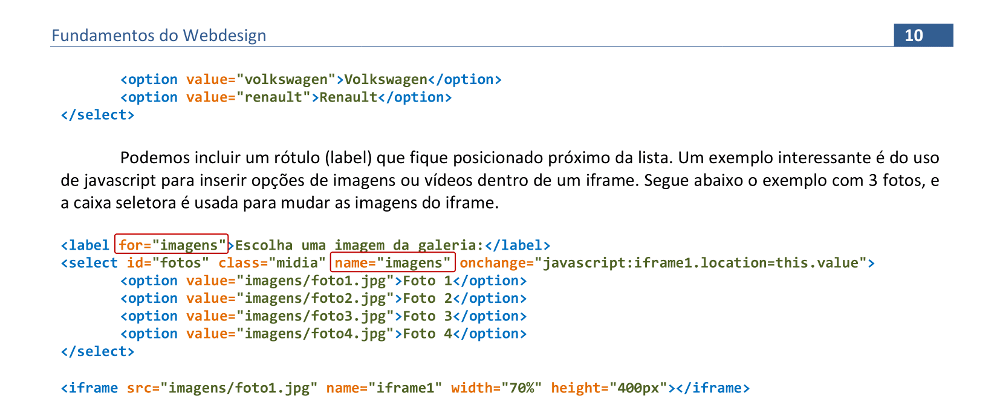
  

&#x1f4c3; Seletor de imagens

	
Neste exemplo, vamos criar uma página com o seletor de imagens mostrado na apostila. Crie um arquivo chamado <code>webdesign/exercicios/seletor.htm</code> na nossa pasta de exercícios. Dentro da pasta de imagens, coloque 4 arquivos. No exemplo, estes arquivos estão com os nomes Foto1.jpg, Foto2.jpg, Foto3.jpg e Foto4.jpg.

	  <ul class="slider">
		  <li>
			   <input type="radio" id="slide082" name="slide">
			   <label for="slide082"></label>
			   
			   <figcaption>O rótulo <code>&lt;label&gt;</code> foi colocado antes da caixa de seleção.</figcaption>
		   </li>
		   <li>
			   <input type="radio" id="slide083" name="slide">
			   <label for="slide083"></label>
			   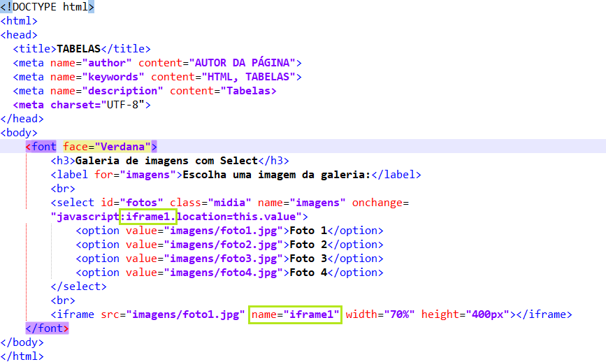
			   <figcaption>Para que o javascript funcione corretamente, o nome <code>iframe1</code> deve ser o mesmo da tag <code>iframe</code>. Preste atenção nos nomes dos arquivos de imagens e seus caminhos para que a página funcione.</figcaption>
		   </li>
		   <li>
			   <input type="radio" id="slide084" name="slide">
			   <label for="slide084"></label>
			   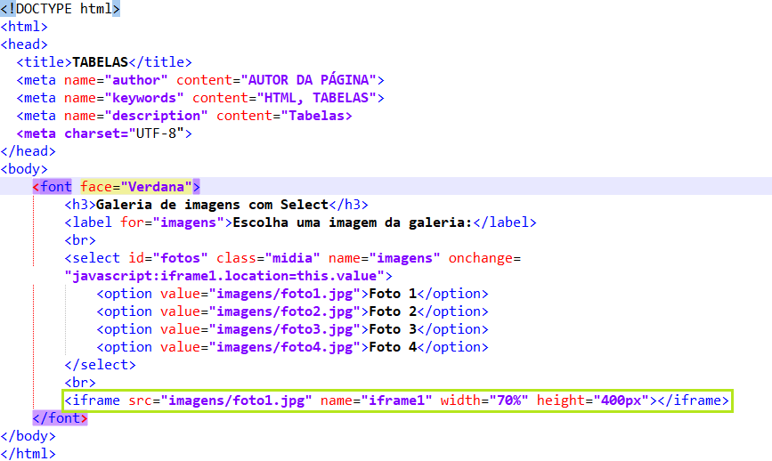
			   <figcaption>A tag do <code>&lt;iframe&gt;</code> deve conter informações de largura e altura, como fizemos nas páginas anteriores que usaram este recurso. Na próxima atividade, vamos usar a tag <code>&lt;select&gt;</code> para mudar páginas.</figcaption>
		   </li>
		</ul>
		
  

  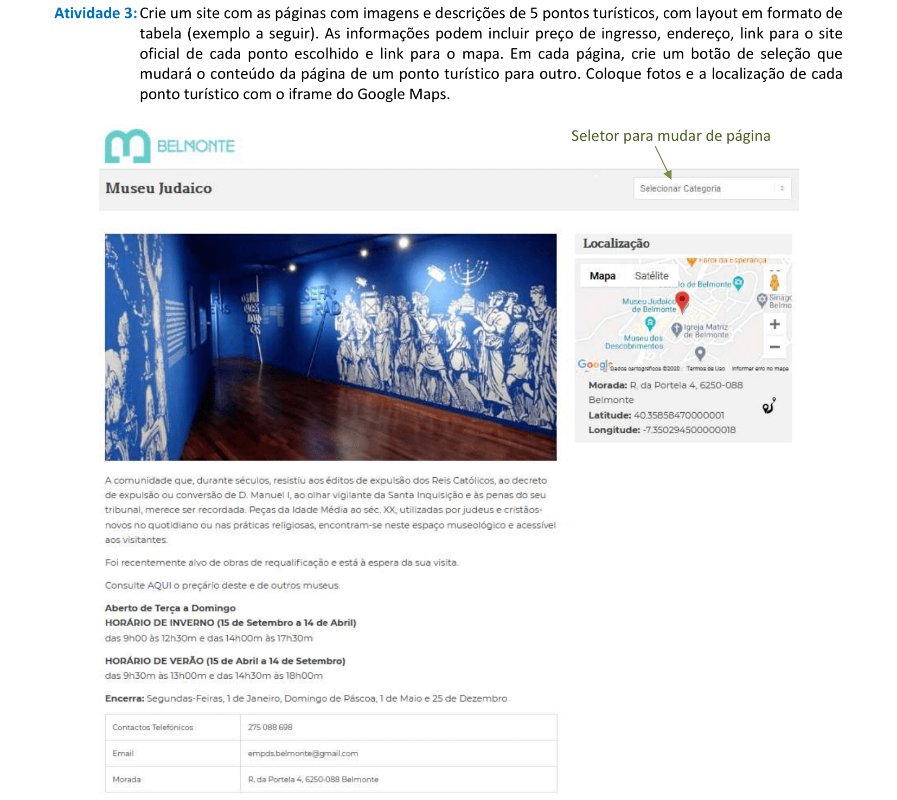
  

&#x1f4c3; Detalhes da Atividade

	
Vamos criar uma pasta <code>webdesign/atividade3</code> para trabalharmos neste projeto. Selecione 5 pontos turísticos, e cada um deles terá uma página, salva na mesma pasta que criamos. Use uma subpasta chamada <code>webdesign/atividade3/imagens</code> para os arquivos das fotos. Neste projeto vamos inserir mapas nos sites.

	  <ul class="slider">
		  <li>
			   <input type="radio" id="slide085" name="slide">
			   <label for="slide085"></label>
			   
			   <figcaption>O layout da página principal do nosso site da Atividade 3 será feito usando tabelas. Coloque o nome de <code>index.htm</code> nesta págin, cuja estrutura está mostrada neste exemplo. A primeira tag, logo após começar o corpo da página será <code>&lt;table&gt;</code>.</figcaption>
		   </li>
		   <li>
			   <input type="radio" id="slide086" name="slide">
			   <label for="slide086"></label>
			   
			   <figcaption>O banner da página fica na primeira linha da tabela. Na segunda linha da tabela, criamos uma célula para o conteúdo principal, que terá um seletor de páginas<code>&lt;select&gt;</code> seguido de um <code>&lt;iframe&gt;</code>, ideia parecida com a que usamos na página de Galeria de Fotos anterior.</figcaption>
		   </li>
		   <li>
			   <input type="radio" id="slide087" name="slide">
			   <label for="slide087"></label>
			   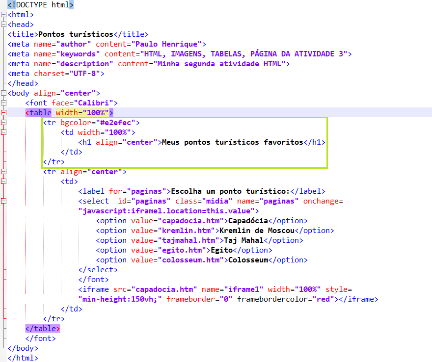
			   <figcaption>No código da página em HTML, a primeira linha da tabela contém a tag do banner. Você pode criar uma imagem de fundo usando o atributo <code>background</code>, como já fizemos em outras páginas.</figcaption>
		   </li>
		   <li>
			   <input type="radio" id="slide088" name="slide">
			   <label for="slide088"></label>
			   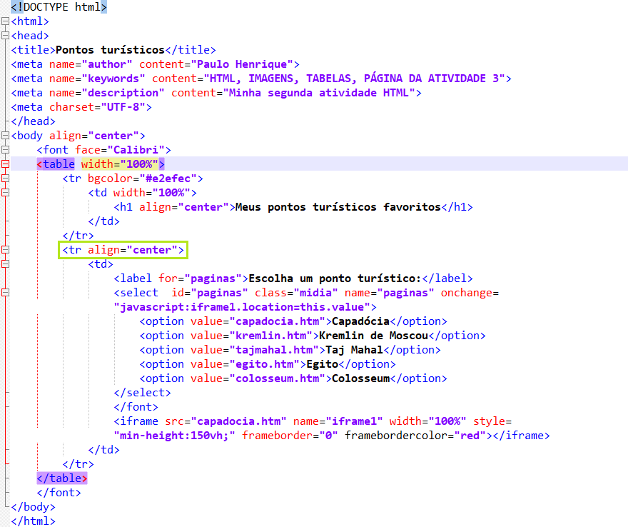
			   <figcaption>A estrutura da tag <code>&lt;select&gt;</code> foi usada para as 5 páginas dos pontos turísticos. Crie estas páginas na mesma pasta da página principal, com os nomes dos pontos turísticos. Não use acentuação, e procure criar nomes com poucos caracteres.</figcaption>
		   </li>
		   <li>
			   <input type="radio" id="slide089" name="slide">
			   <label for="slide089"></label>
			   
			   <figcaption>Para ajustar a altura da tag <code>&lt;iframe&gt;</code>, podemos usar um estilo com altura mínima de 150% da altura da tela: <code>min-height:150vh</code>. Mais adiante vamos trabalhar com estas formatações.</figcaption>
		   </li>
		   <li>
			   <input type="radio" id="slide090" name="slide">
			   <label for="slide090"></label>
			   
			   <figcaption>Agora vamos ver como fica o layout de uma das páginas dos pontos turísticos. Basicamente são 2 colunas: uma com as descrições e fotos, e outra com a localização, e o rodapé. Logo, precisamos de uma tabela com 2 células em uma linha, e duas células mescladas na segunda linha.</figcaption>
		   </li>
		   <li>
			   <input type="radio" id="slide091" name="slide">
			   <label for="slide091"></label>
			   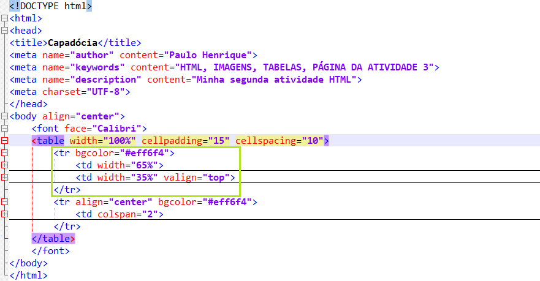
			   <figcaption>Podemos usar a célula com conteúdo principal com a largura de <b>65%</b> e a barra lateral com largura de <b>35%</b>. Dentro das tags <code>&lt;td&gt;</code> podemos inserir os textos e imagens de cada página.</figcaption>
		   </li>
		   <li>
			   <input type="radio" id="slide092" name="slide">
			   <label for="slide092"></label>
			   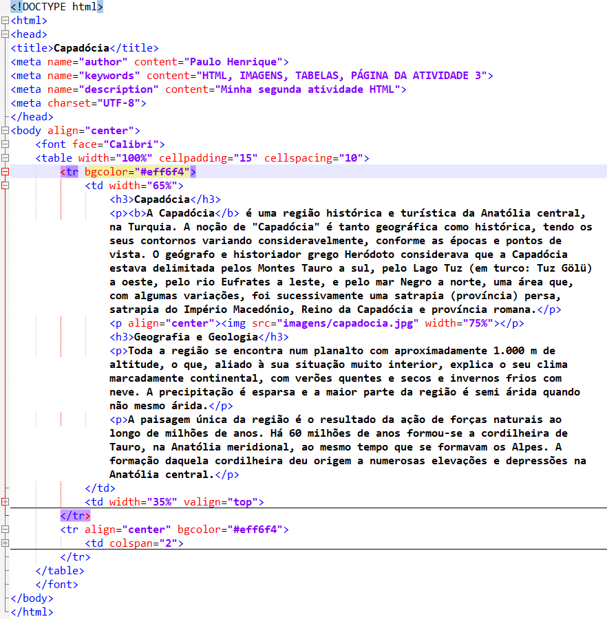
			   <figcaption>É importante separar os parágrafos, e definir larguras de imagens. Neste caso, foi usada a largura de <b>75%</b> para imagens.</figcaption>
		   </li>
		   <li>
			   <input type="radio" id="slide093a" name="slide">
			   <label for="slide093a"></label>
			   
			   <figcaption>A segunda célula com a barra lateral contém o <code>&lt;iframe&gt;</code> com a localização do ponto turístico. Vamos ver como conseguir esta tag na próxima imagem.</figcaption>
			</li>
		   <li>
			   <input type="radio" id="slide094" name="slide">
			   <label for="slide094"></label>
			   
			   <figcaption>Acesse o endereço <a href="https://www.google.com.br/maps/" target="_blank">www.google.com.br/maps/</a> e procure o ponto turístico. Depois, basta clicar em <code>compartilhar</code> e a opção de <code>Incorporar um mapa</code>. Copie e cole a tag criada na página do ponto turístico.</figcaption>
		   </li>
		   <li>
			   <input type="radio" id="slide093" name="slide">
			   <label for="slide093"></label>
			   
			   <figcaption>Voltando ao código da página, a linha de rodapé tem 2 células mescladas, para usar a largura toda da página. Por isso, usamos o atributo <code>colspan="2"</code>. Com a estrutura da página de um ponto turístico pronta, crie as páginas dos outros 4 pontos turísticos.</figcaption>
			</li>
		   <li>
			   <input type="radio" id="slide095" name="slide">
			   <label for="slide095"></label>
			   
			   <figcaption>O layout mostrado neste exemplo fica desta forma. Lembre-se de cuidar com os nomes das páginas, para ver se são iguais aos nomes colocados na página <code>index.htm</code>.</figcaption>
		   </li>
		</ul>
		
  

  
<a href="#basico" class="topo">voltar ao topo</a>

CSS - Cascading Style Sheets: pág. 11-20

	
	
<a href="#css1" class="topo">voltar ao topo</a>

	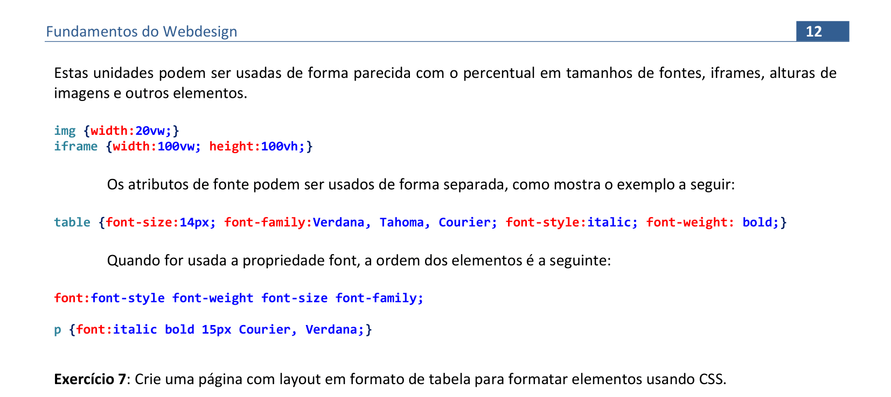
  

&#x1f4c3; Primeiro Layout com CSS

	
Vamos usar a nossa pasta de exercícios para criar a página <code>webdesign/exercicios/layoutCSS.htm</code>. Neste projeto vamos criar um layout em forma de tabela, parecido com as Atividades 2 e 3: serão 2 colunas na parte principal, com banner e um rodapé.

	  <ul class="slider">
		  <li>
			   <input type="radio" id="slide096" name="slide">
			   <label for="slide096"></label>
			   
			   <figcaption>O layout da nossa primeira página com CSS será feito usando uma tabela. A primeira linha da tabela contém o banner da página, com o atributo <code>colspan="2"</code> para ocupar toda a largura da página. Insira uma imagem nesta tag.</figcaption>
		   </li>
		   <li>
			   <input type="radio" id="slide097" name="slide">
			   <label for="slide097"></label>
			   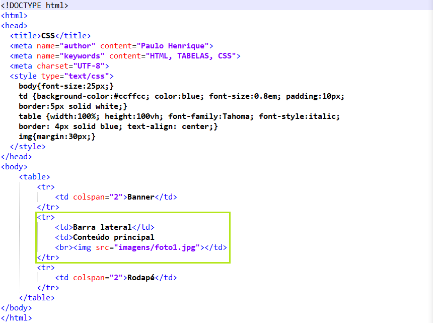
			   <figcaption>A segunda linha da tabela contém uma barra lateral esquerda e o conteúdo principal com uma imagem inserida. Vamos testar os alinhamentos do texto e da imagem nesta página.</figcaption>
		   </li>
		   <li>
			   <input type="radio" id="slide098" name="slide">
			   <label for="slide098"></label>
			   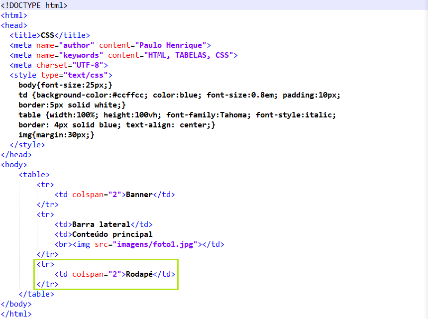
			   <figcaption>A terceira linha contém o rodapé, também com o atributo <code>colspan="2"</code> para usar a largura toda da página.</figcaption>
		   </li>
		   <li>
			   <input type="radio" id="slide099" name="slide">
			   <label for="slide099"></label>
			   
			   <figcaption>Agora vamos analisar a estrutura do CSS. Nestes primeiros exemplos, vamos usar as folhas de estilos por dentro das páginas, dentro do cabeçalho com a tag <code>&lt;style&gt;</code>.</figcaption>
		   </li>
		   <li>
			   <input type="radio" id="slide100" name="slide">
			   <label for="slide100"></label>
			   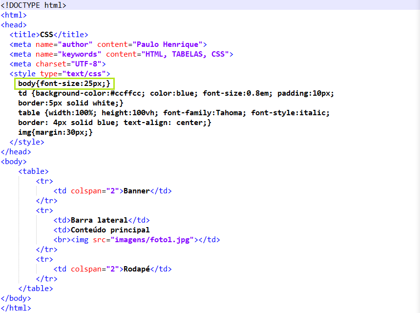
			   <figcaption>Podemos definir atributos gerais no CSS quando nos referimos ao corpo da página <code>body</code>. Estes atributos podem incluir tamanhos de fontes e cores de fundos. Modifique estes valores para visualizar o layout da sua página.</figcaption>
		   </li>
		   <li>
			   <input type="radio" id="slide101" name="slide">
			   <label for="slide101"></label>
			   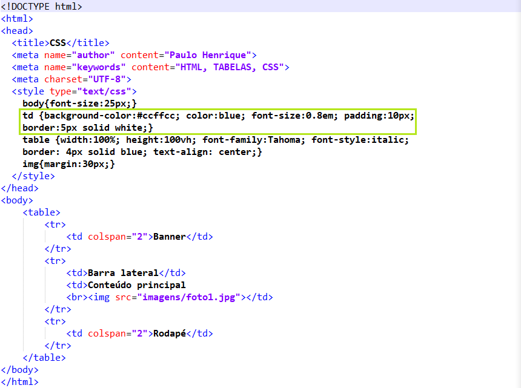
			   <figcaption>De uma maneira bem mais simples, definimos bordas, cores de fundo das células <code>td</code> com as folhas de estilos. Note que o tamanho da fonte foi colocado com <b>0.8em</b>, ou seja, corresponde a <b>80%</b> do tamanho de fonte da tag mãe <code>body</code>.</figcaption>
		   </li>
		   <li>
			   <input type="radio" id="slide102" name="slide">
			   <label for="slide102"></label>
			   
			   <figcaption>Um atributo importante que usamos no CSS é da altura da página. Neste caso, foi colocado que a altura mede <b>100vh</b>, ou seja, <b>100%</b> da altura do navegador. Podemos usar no lugar do atributo <code>height:100vh;</code> o atributo <code>min-height:100vh;</code>, que deixaria a altura mínima com a altura do navegador. </figcaption>
		   </li>
		   <li>
			   <input type="radio" id="slide103" name="slide">
			   <label for="slide103"></label>
			   
			   <figcaption>Para imagens não ficarem "grudadas" nos textos, podemos definir as margens com CSS. Os atributos ficam valendo para todas as imagens que você insere na página. Modifique atributos nesta nossa página, para treinar para a próxima Atividade.</figcaption>
		   </li>
		</ul>
		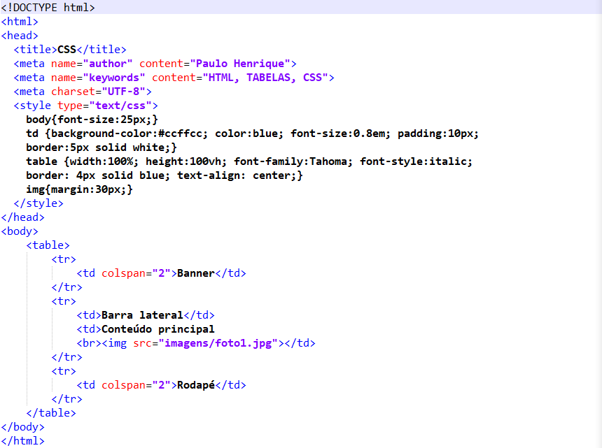
  

  
  
<a href="#css1" class="topo">voltar ao topo</a>

  
  
<a href="#css1" class="topo">voltar ao topo</a>

  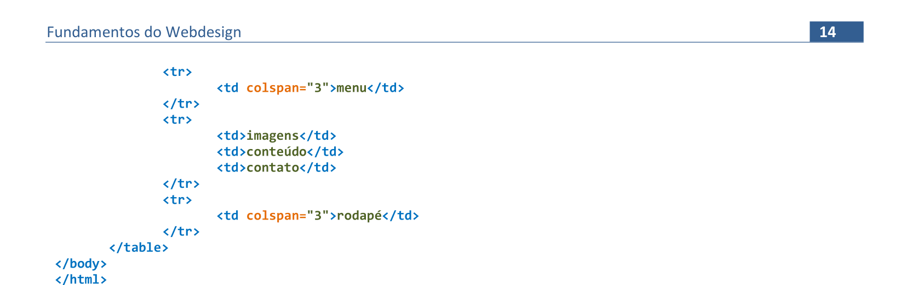
  

&#x1f4c3; Layout da Atividade 4

	
Vamos criar uma pasta para nosso próximo site chamada <code>webdesign/atividade4</code>. Neste projeto vamos criar um layout em forma de tabela, parecido com as Atividades 2 e 3, com formatação CSS. Como é um site com 3 páginas, vamos precisar de uma pasta de imagens:<code>webdesign/atividade4/imagens</code>.

	  <ul class="slider">
		  <li>
			   <input type="radio" id="slide104" name="slide">
			   <label for="slide104"></label>
			   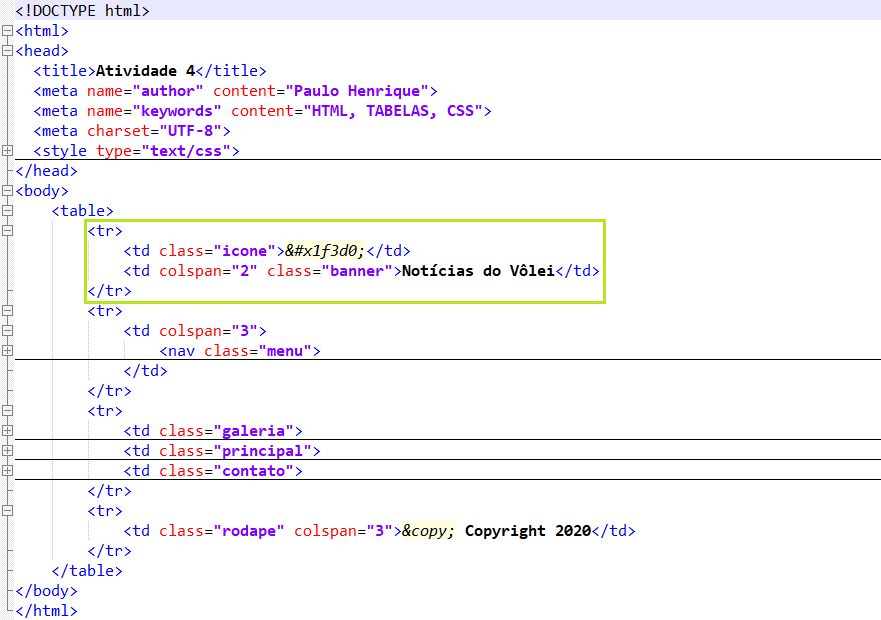
			   <figcaption>O layout da nossa primeira página com CSS será feito usando uma tabela. A primeira linha da tabela contém uma célula com um ícone (logomarca ou pictograma) e na outra célula o banner da página, com o atributo <code>colspan="2"</code> para ocupar a largura restante da página (retirando a parte do ícone. Você pode inserir imagens nestas tags.</figcaption>
		   </li>
		   <li>
			   <input type="radio" id="slide104a" name="slide">
			   <label for="slide104a"></label>
			   
			   <figcaption>Note que já vamos criar classes para as partes das nossas páginas: <code>class="icone"</code> e <code>class="banner"</code> para formatação em CSS. Com o tema de Esportes, escolha um título para colocar no Banner da página que terá o nome <code>index.htm</code>.</figcaption>
		   </li>
		   <li>
			   <input type="radio" id="slide105" name="slide">
			   <label for="slide105"></label>
			   
			   <figcaption>A segunda linha da tabela contém o menu, que ocupará a largura toda da página. Por isso, colocamos o atributo <code>colspan="3"</code> nesta célula, que possui classe definida como <code>class="menu"</code>.</figcaption>
		   </li>
		   <li>
			   <input type="radio" id="slide106" name="slide">
			   <label for="slide106"></label>
			   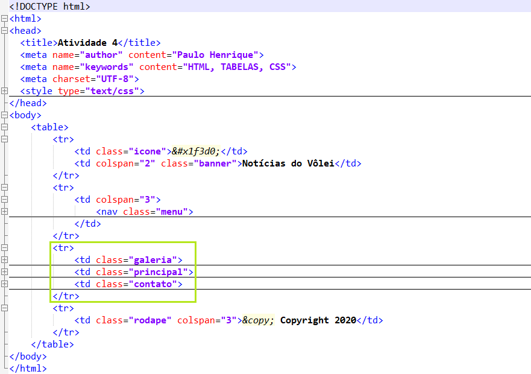
			   <figcaption>Na quarta linha, teremos 3 células: <code>class="galeria"</code>, que contém uma espécie de galeria de notícias e imagens; <code>class="principal"</code>, com o contéudo principal da página que ficará centralizado no layout; e <code>class="contato"</code>, com informações de contatos e redes sociais.</figcaption>
		   </li>
		   <li>
			   <input type="radio" id="slide107" name="slide">
			   <label for="slide107"></label>
			   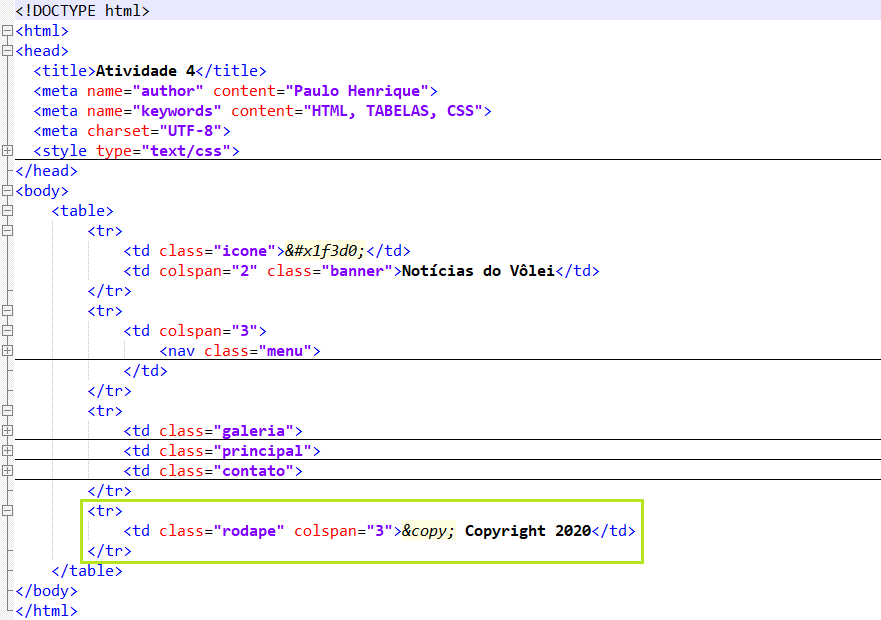
			   <figcaption>A última linha contém o rodapé, com atributo <code>colspan="3"</code> para usar a largura toda da página, e com a classe definida: <code>class="rodape"</code>.</figcaption>
		   </li>
		   <li>
			   <input type="radio" id="slide108" name="slide">
			   <label for="slide108"></label>
			   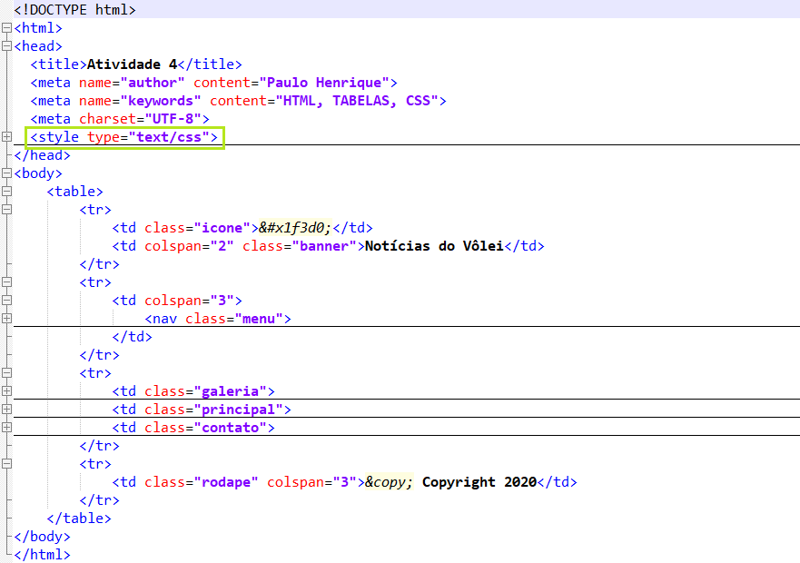
			   <figcaption>A tag dentro do cabeçalho <code>style</code> contém todos os atributos do CSS que vamos definir nestas páginas. Nesta primeira página <code>index.htm</code> vamos definir todos os estilos antes de criar as outras páginas do nosso site.</figcaption>
		   </li>
		</ul>
		
  

  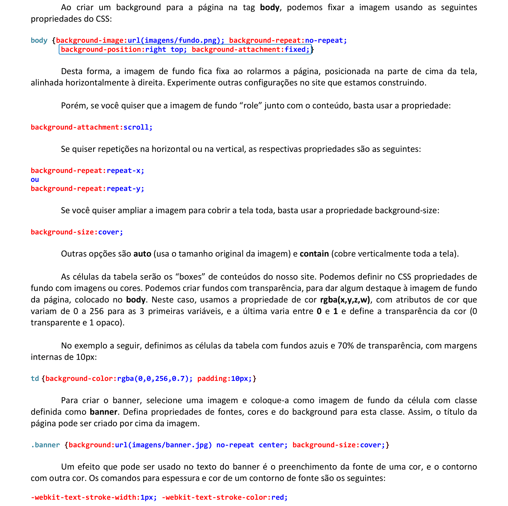
  
<a href="#css1" class="topo">voltar ao topo</a>

  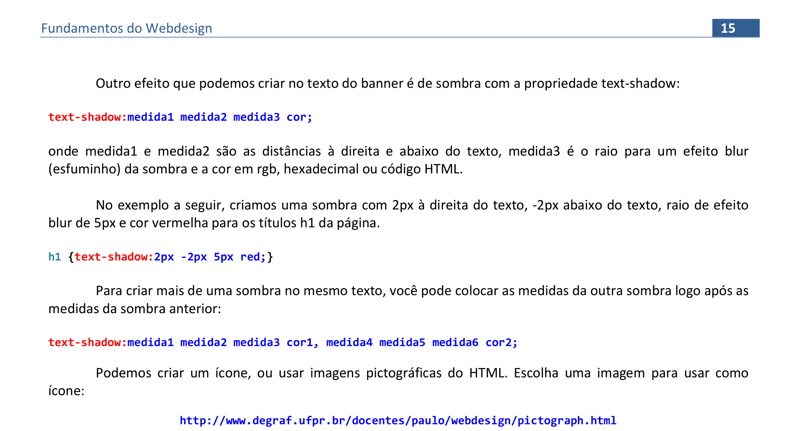
  

&#x1f4c3; Banner da Atividade 4

	
Vamos formatar o banner e o ícone da página <code>index.htm</code> da Atividade 4 com CSS. A estrutura HTML já foi mostrada e comentada em detalhes na página anterior.

	  <ul class="slider">
		  <li>
			   <input type="radio" id="slide109" name="slide">
			   <label for="slide109"></label>
			   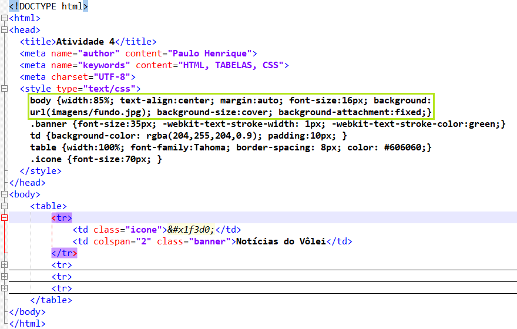
			   <figcaption>O corpo da página <code>body</code> foi definido com uma imagem de fundo (background) que mostra uma partida de vôlei. Note que deixamos as imagens na pasta <code>webdesign/atividade4/imagens</code>. Logo, podemos usar o atributo <code>url(imagens/banner.jpg)</code> que mostra o caminho do arquivo da imagem de fundo do site.</figcaption>
		   </li>
		   <li>
			   <input type="radio" id="slide109a" name="slide">
			   <label for="slide109a"></label>
			   
			   <figcaption>Em CSS podemos definir vários elementos para a tag <code>body</code>, que é a "mãe" de todas as tags. Largura, tamanho de fonte, margem automática (que deixa o conteúdo centralizado), além de <code>background-size</code> e <code>background-attachment</code> que deixam a imagem de fundo fixa e "cobrindo" todo o espaço da tela.</figcaption>
		   </li>
		   <li>
			   <input type="radio" id="slide110" name="slide">
			   <label for="slide110"></label>
			   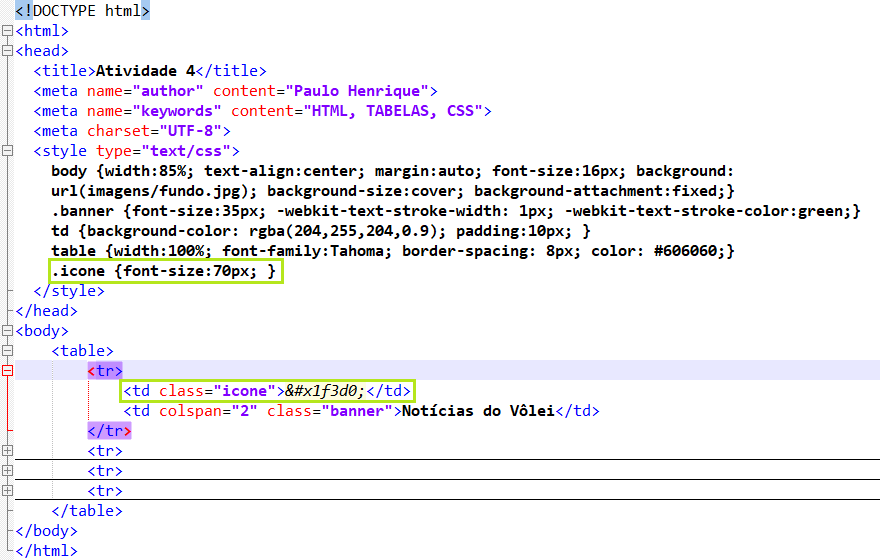
			   <figcaption>A tag de ícone pode conter uma imagem, como uma logomarca, ou podemos usar uma imagem pictográfica. No site <a href="http://www.degraf.ufpr.br/docentes/paulo/webdesign/pictograph.html" target="_blank">http://www.degraf.ufpr.br/docentes/paulo/webdesign/pictograph.html</a> você pode escolher uma imagem pictográfica para ficar nesta tag de ícone desta página.</figcaption>
		   </li>
		   <li>
			   <input type="radio" id="slide111" name="slide">
			   <label for="slide111"></label>
			   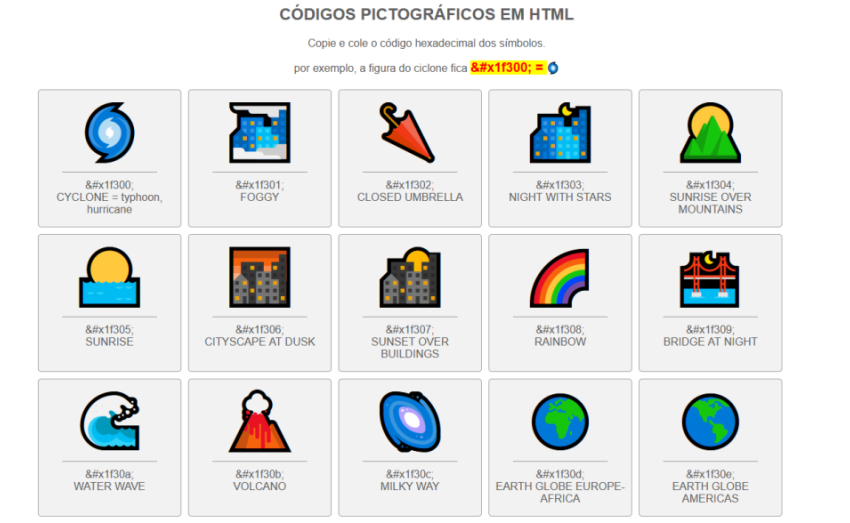
			   <figcaption>Em cada página do nosso site, podemos escolher um destes símbolos pictográficos para inserir na tag de ícone. Visite o site e escolha um símbolo que represente o esporte de cada página. O formato deste tipo de imagem é parecido com o de cores hexadecimais, mas sempre começa com o símbolo <b>&amp;</b>.</figcaption>
		   </li>
		   <li>
			   <input type="radio" id="slide112" name="slide">
			   <label for="slide112"></label>
			   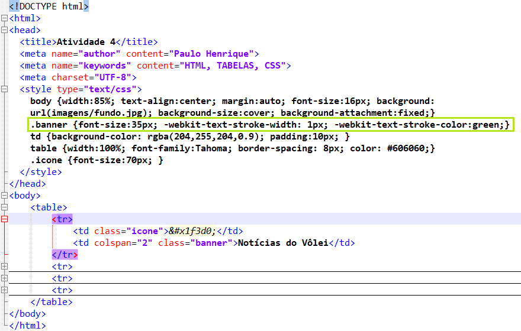
			   <figcaption>Na tag do banner, podemos escolher uma imagem de fundo, inserindo-a como fizemos na imagem do fundo do site na tag <code>body</code>. Outra opção é usar efeitos de texto, como cores diferentes no contorno com o atributo <code>stroke-width</code> mostrado neste exemplo.</figcaption>
		   </li>
		   <li>
			   <input type="radio" id="slide113" name="slide">
			   <label for="slide113"></label>
			   
			   <figcaption>As tags <code>td</code> servem de estrutura para o layout do nosso site, e precisam de formatações. Margens internas, cor de fundo e imagem de fundo podem ser definidas no CSS. Note que as tags nativas do HTML não têm o símbolo de ponto . nas atribuições dos estilos. Somente colocamos ponto . nas classes criadas (banner, icone, menu,...).</figcaption>
		   </li>
		   <li>
			   <input type="radio" id="slide114" name="slide">
			   <label for="slide114"></label>
			   
			   <figcaption>Outra tag importante para definirmos atributos no CSS é a <code>table</code>, que contém os espaçamentos das células para separar os blocos de conteúdos, cor de texto e a largura.</figcaption>
		   </li>
		   <li>
			   <input type="radio" id="slide115" name="slide">
			   <label for="slide115"></label>
			   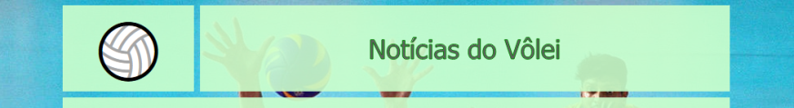
			   <figcaption>Com as propriedades definidas neste exemplo, nossa página fica com a parte superior desta forma. Formate o seu layout com as propriedades que você ache mais adequadas para esta atividade. Seguiremos com as outras partes desta atividade.</figcaption>
		   </li>
		</ul>
		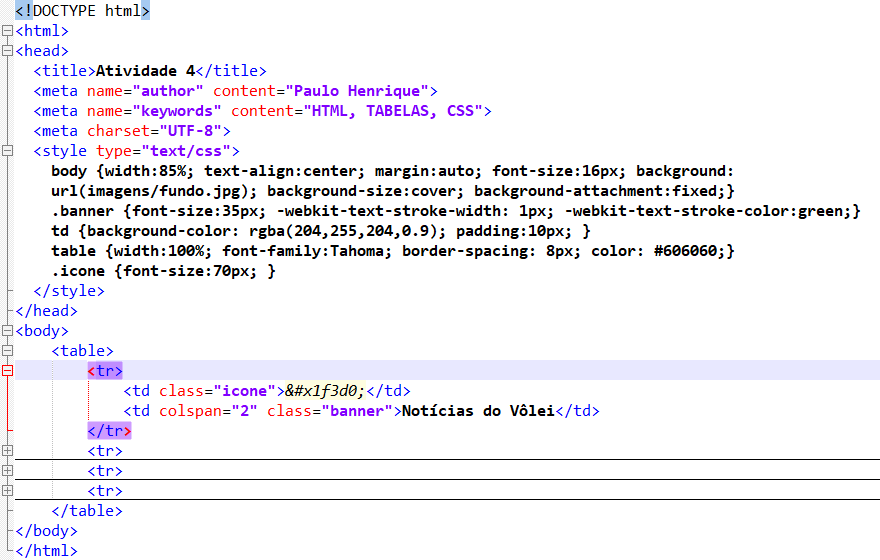
  

  
  
<a href="#css1" class="topo">voltar ao topo</a>

  
  

&#x1f4c3; Menu da Atividade 4

	
Vamos formatar o menu da página <code>index.htm</code> da Atividade 4 com CSS. A estrutura HTML possui a tag <code>nav</code> descrita a seguir.

	  <ul class="slider">
		  <li>
			   <input type="radio" id="slide116" name="slide">
			   <label for="slide116"></label>
			   
			   <figcaption>Dentro da tag <code>&lt;nav class="menu"&gt;</code> podemos criar uma tag de lista <code>&lt;ul&gt;</code>, com cada item <code>&lt;li&gt;</code> representando a página de um esporte desta atividade. Usamos a tag de link <code>&lt;a&gt;</code> para criar a navegação entre os links do menu. A página <code>index.htm</code> tem classe ativa que vamos configurar a seguir.</figcaption>
		   </li>
		   <li>
			   <input type="radio" id="slide117" name="slide">
			   <label for="slide117"></label>
			   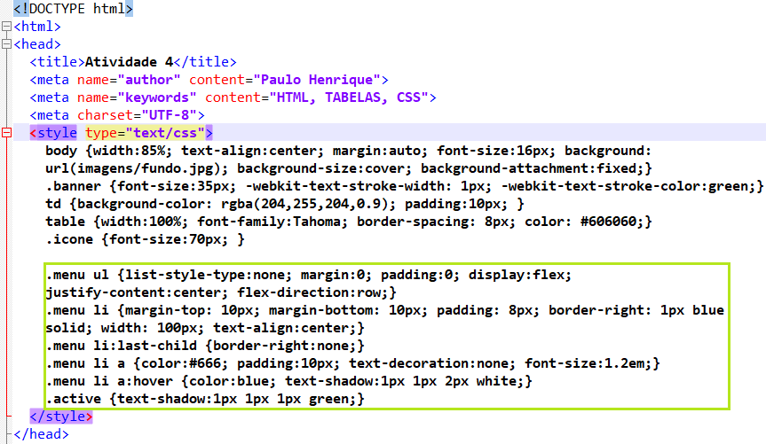
			   <figcaption>Agora vamos focar no cabeçalho da página para criar as propriedades do menu. Note que as propriedades do banner estão logo acima, dentro da mesma tag <code>&lt;style&gt;</code>.</figcaption>
		   </li>
		   <li>
			   <input type="radio" id="slide118" name="slide">
			   <label for="slide118"></label>
			   
			   <figcaption>A lista dos itens do menu <code>ul</code> tem atributos de margens, estilo sem formato de lista e o <b>display flex</b> que pode ser usado para distribuir os itens dentro da célula da tabela. A direção deste display está em linha (row) pois o menu é horizontal.</figcaption>
		   </li>
		   <li>
			   <input type="radio" id="slide119" name="slide">
			   <label for="slide119"></label>
			   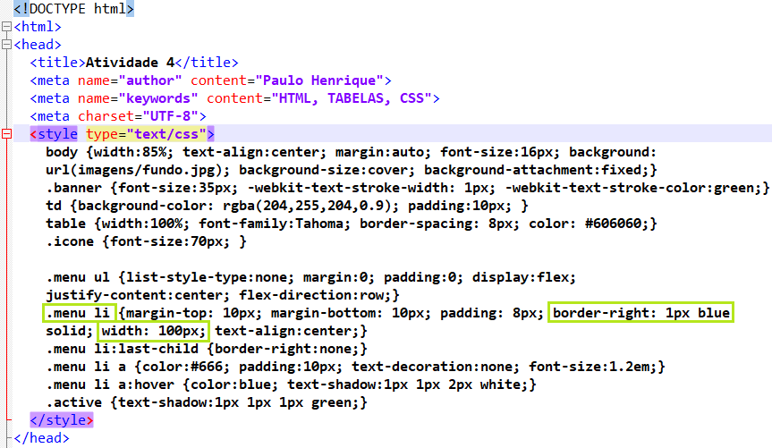
			   <figcaption>Para que a lista não fique "grudada" nas outras partes da página, criamos margens top e bottom. Colocamos uma borda azul à direita e comprimento fixo de <b>100px</b>. Se necessário, ajuste este valor na sua página, para que os textos de todos os itens caibam no menu, sem quebras de linha.</figcaption>
		   </li>
		   <li>
			   <input type="radio" id="slide120" name="slide">
			   <label for="slide120"></label>
			   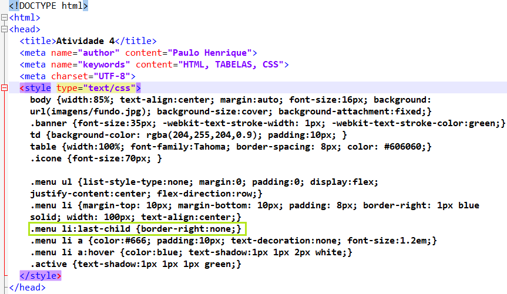
			   <figcaption>O último item da lista <code>last-child</code> ficará sem borda, deixando bordas apenas internas entre os itens do menu.</figcaption>
		   </li>
		   <li>
			   <input type="radio" id="slide121" name="slide">
			   <label for="slide121"></label>
			   
			   <figcaption>Na tag <code>&lt;a&gt;</code> podemos configurar tamanho de fonte e o atributo <code>text-decoration:none;</code> remove aquelas configurações comuns de links (cor azul, sublinhado).</figcaption>
		   </li>
		   <li>
			   <input type="radio" id="slide122" name="slide">
			   <label for="slide122"></label>
			   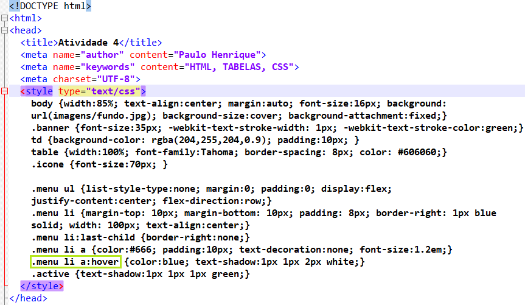
			   <figcaption>Ao passar o cursor do mouse por cima de um item do menu, podemos criar alguns efeitos: mudanças de cor, de fundo, sublinhados ou sombras. Neste caso usamos sombra e mudança de cor da fonta para esse efeito. Escolha um efeito para sua página.</figcaption>
		   </li>
		   <li>
			   <input type="radio" id="slide123" name="slide">
			   <label for="slide123"></label>
			   
			   <figcaption>A página ativa, neste caso <code>index.htm</code>, pode ter alguma apresentação diferente no menu para destacar ao visitante que ele está nesta página. Quando construir as outras páginas, modifique a classe na tag <code>&lt;nav&gt;</code> o item ativo.</figcaption>
		   </li>
		   <li>
			   <input type="radio" id="slide124" name="slide">
			   <label for="slide124"></label>
			   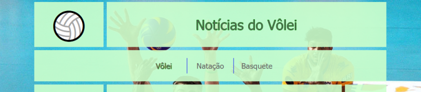
			   <figcaption>Este é o resultado parcial da página, com estas configurações de menu. Usando os atributos mostrados, modifique valores para a apresentação do seu site.</figcaption>
		   </li>
		</ul>
		
  

  
<a href="#css1" class="topo">voltar ao topo</a>

  
  
<a href="#css1" class="topo">voltar ao topo</a>

  
  

&#x1f4c3; Conteúdo da Atividade 4

	
Vamos formatar o conteúdo principal e a barra lateral galeria da página <code>index.htm</code> da Atividade 4 com CSS. Antes vamos ver a estrutura HTML destas partes da página.

	  <ul class="slider">
		  <li>
			   <input type="radio" id="slide125" name="slide">
			   <label for="slide125"></label>
			   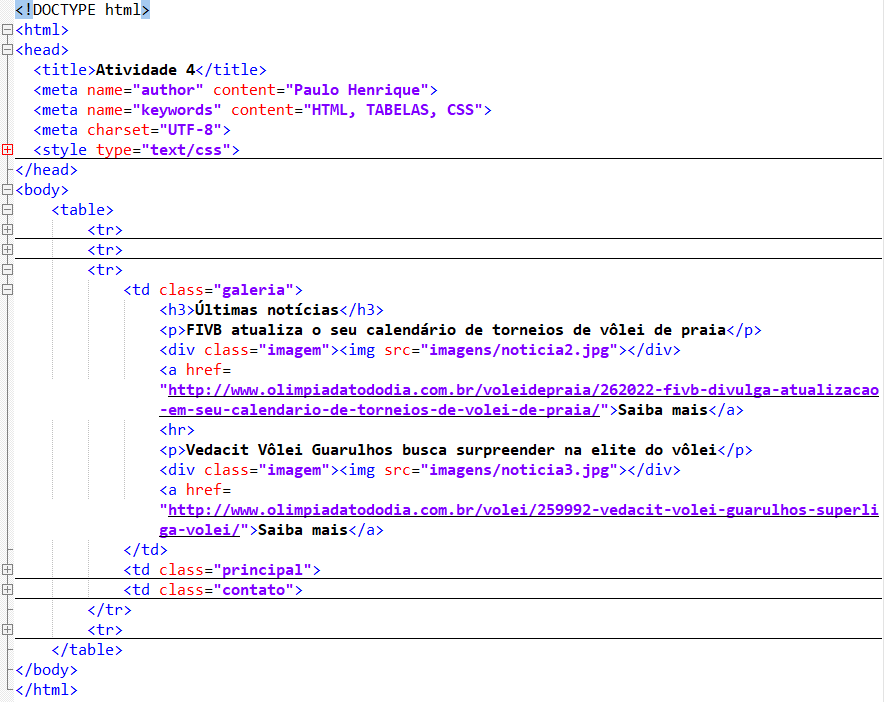
			   <figcaption>A barra esquerda será a galeria de notícias <code>class="galeria"</code>. Podemos criar um cabeçalho <code>&lt;h3&gt;</code>, um parágrafo <code>&lt;p&gt;</code> com descrição do título da notícia, uma imagem <code>&lt;img&gt;</code> e um link <code>&lt;a&gt;</code>. Nesta barra podemos inserir 2 ou 3 notícias com estes elementos, separadas por uma tag <code>&lt;hr&gt;</code>.</figcaption>
		   </li>
		   <li>
			   <input type="radio" id="slide126" name="slide">
			   <label for="slide126"></label>
			   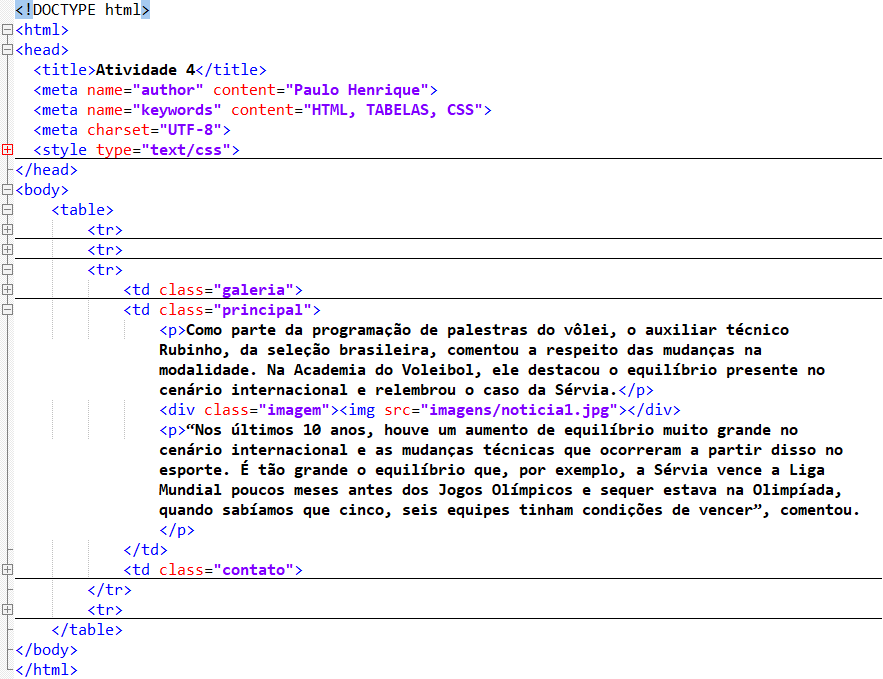
			   <figcaption>O conteúdo da página da tag <code>class="principal"</code> contém parágrafos <code>&lt;p&gt;</code> e imagens. Podemos criar uma div <code>class="imagem"</code> para formatar imagens dentro desta parte da página.</figcaption>
		   </li>
		   <li>
			   <input type="radio" id="slide127" name="slide">
			   <label for="slide127"></label>
			   
			   <figcaption>Na tag de estilo <code>&lt;style&gt;</code> vamos focar nos atributos das classes galeria e principal.</figcaption>
		   </li>
		   <li>
			   <input type="radio" id="slide128" name="slide">
			   <label for="slide128"></label>
			   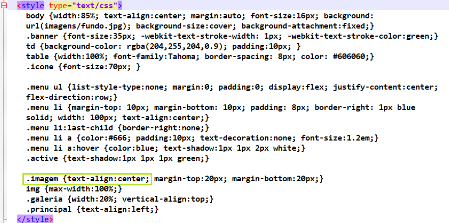
			   <figcaption>A classe <code>imagem</code> serve para alinhar as fotos com o texto na tag principal. Podemos definir margens para não deixar as fotos "grudadas" nos textos.</figcaption>
		   </li>
		   <li>
			   <input type="radio" id="slide129" name="slide">
			   <label for="slide129"></label>
			   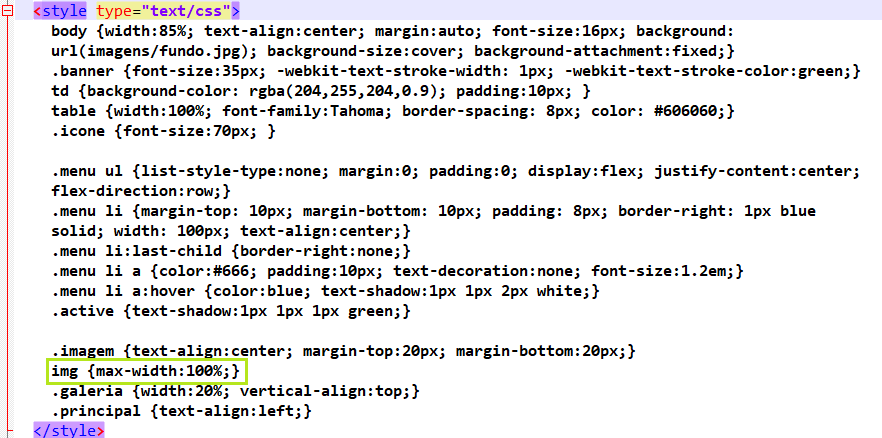
			   <figcaption>De maneira geral, as imagens das páginas podem ser colocadas com largura máxima de <b>100%</b>.</figcaption>
		   </li>
		   <li>
			   <input type="radio" id="slide130" name="slide">
			   <label for="slide130"></label>
			   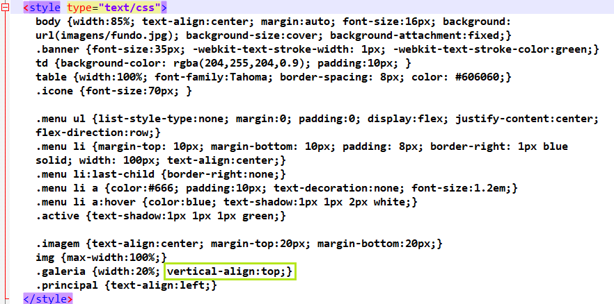
			   <figcaption>O alinhamento <code>vertical-align:top;</code> faz com que o conteúdo da galeria fique alinhado com os conteúdos das outras barras: principal e contato. Podemos definir a largura da galeria: <b>20%</b>, por exemplo. Faça testes com os conteúdos de sua página para encontrar o melhor valor.</figcaption>
		   </li>
		   <li>
			   <input type="radio" id="slide131" name="slide">
			   <label for="slide131"></label>
			   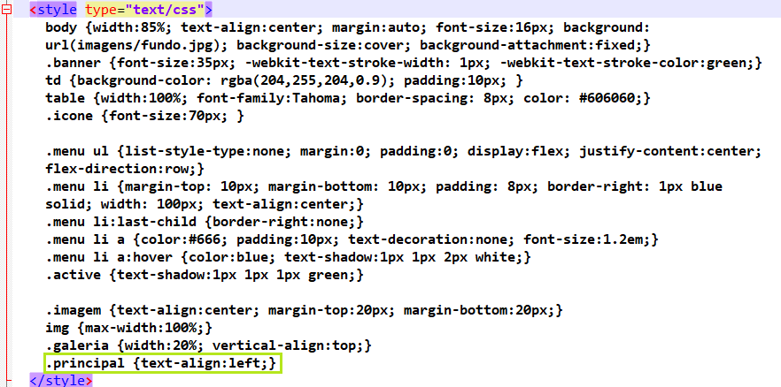
			   <figcaption>Defina o alinhamento do texto da tag principal da página. Você pode definir também cor de texto e mais efeitos no CSS. Vamos definir adiante os atributos das outras tags da página.</figcaption>
		   </li>
		</ul>
		
  

  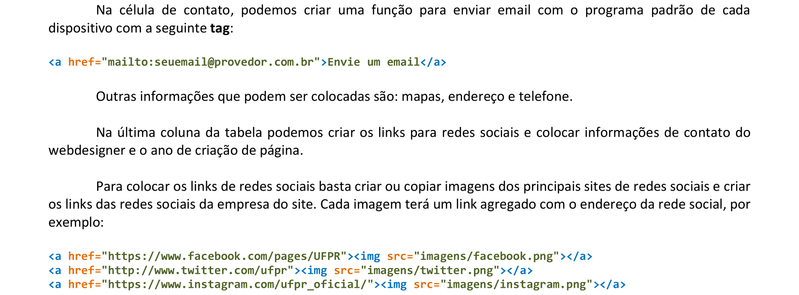
  
<a href="#css1" class="topo">voltar ao topo</a>

  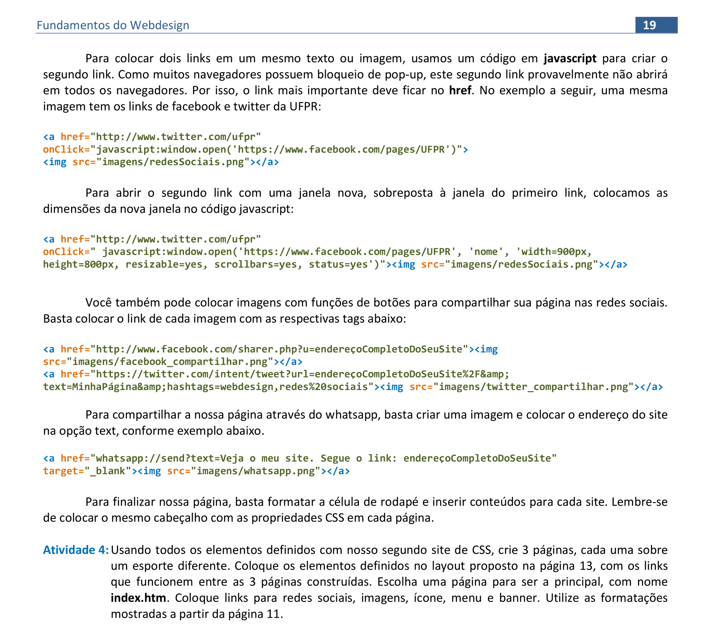
  

&#x1f4c3; Contato e rodapé da Atividade 4

	
Vamos formatar os conteúdos da barra de contato e do rodapé da página <code>index.htm</code> da Atividade 4 com CSS. Antes vamos ver a estrutura HTML destas partes da página.

	  <ul class="slider">
		  <li>
			   <input type="radio" id="slide132" name="slide">
			   <label for="slide132"></label>
			   
			   <figcaption>A barra direita será de contatos de email e de redes sociais <code>class="contato"</code>. Podemos criar links <code>&lt;a&gt;</code> para email e acesso às redes sociais. Insira imagens na pasta <code>webdesign/atividade4/imagens</code> de email, facebook e mais redes sociais para colocar dentro das tags de link as imagens <code>&lt;img&gt;</code>.</figcaption>
		   </li>
		   <li>
			   <input type="radio" id="slide133" name="slide">
			   <label for="slide133"></label>
			   
			   <figcaption>A tag <code>class="rodape"</code> contém as informações que já usamos em outras páginas. Agora vamos ver as propriedades CSS destas partes da página.</figcaption>
		   </li>
		   <li>
			   <input type="radio" id="slide134" name="slide">
			   <label for="slide134"></label>
			   
			   <figcaption>A tag de contato tem o alinhamento vertical definido no topo da célula com o atributo <code>vertical-align:top;</code>. Se definirmos a largura desta barra como <b>10%</b>, teremos <b>70%</b> para o conteúdo principal (pois a galeria ficou com <b>20%</b>). Teste diferentes valores para o conteúdo de sua página.</figcaption>
		   </li>
		   <li>
			   <input type="radio" id="slide135" name="slide">
			   <label for="slide135"></label>
			   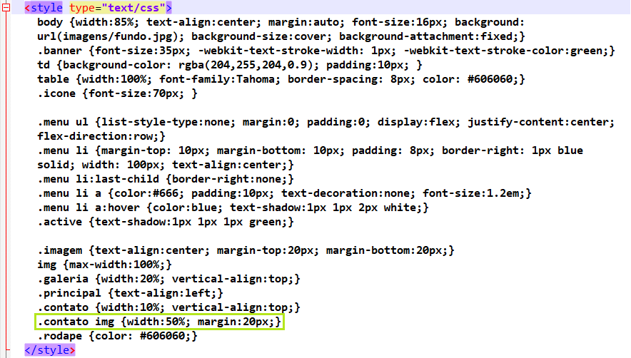
			   <figcaption>As imagens dentro desta classe podem ser menores, pois funcionam como ícones de acesso. Logo, usamos o atributo <code>.contato img</code> que significa que as larguras de dentro da classe de contato terão larguras menores. Neste caso, usamos <b>50%</b>. Teste valores diferentes em sua página.</figcaption>
		   </li>
		   <li>
			   <input type="radio" id="slide136" name="slide">
			   <label for="slide136"></label>
			   
			   <figcaption>A tag de rodapé tem a configuração mais simples. Usamos as mesmas propriedades dos sites anteriores.</figcaption>
		   </li>
		   <li>
			   <input type="radio" id="slide137" name="slide">
			   <label for="slide137"></label>
			   
			   <figcaption>Com as propriedades definidas, a página <code>index.htm</code> fica com este layout. Teste medidas e cores para sua página. Depois de definir os valores mais adequados, você pode construir as outras 2 páginas: basta copiar e colar este código nos outros arquivos de esportes: no meu caso, <code>basquete.htm</code> e <code>natacao.htm</code>.</figcaption>
		   </li>
		   <li>
			   <input type="radio" id="slide138" name="slide">
			   <label for="slide138"></label>
			   
			   <figcaption>Não esqueça de definir os menus das outras páginas com o item <code>active</code>. Coloque os 3 arquivos na mesma pasta, compartilhando a mesma pasta de imagens.</figcaption>
		   </li>
		</ul>
		
  

  
  
<a href="#css1" class="topo">voltar ao topo</a>

  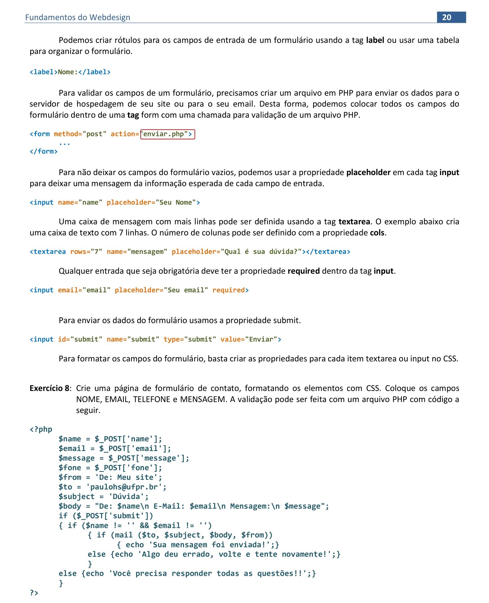
  

&#x1f4c3; Formulário de Contato

	
Crie uma página na nossa pasta de exercícios <code>webdesign/exercicios</code> com nome <code>contato.htm</code>. Outro arquivo que vamos criar nesta pasta chama-se <code>enviar.php</code>, com o código mostrado na apostila. Vamos mostrar a criação e layout de uma página de formulário, sem a configuração de um servidor para receber os dados enviados.

	  <ul class="slider">
		  <li>
			   <input type="radio" id="slide139" name="slide">
			   <label for="slide139"></label>
			   
			   <figcaption>Podemos criar uma tag "mãe" do formulário <code>class="formulario"</code> para atribuir as propriedades de seus componentes.</figcaption>
		   </li>
		   <li>
			   <input type="radio" id="slide140" name="slide">
			   <label for="slide140"></label>
			   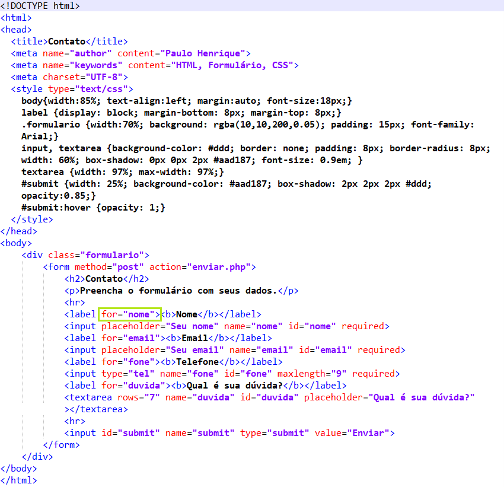
			   <figcaption>Cada entrada terá um rótulo "agredado" <code>&lt;label&gt;</code>. Este rótulo pode ser referenciado com o atributo <code>for</code>, com o nome da respectiva entrada.</figcaption>
		   </li>
		   <li>
			   <input type="radio" id="slide141" name="slide">
			   <label for="slide141"></label>
			   
			   <figcaption>As entradas são colocadas no HTML na sequência de cada um de seus rótulos. Se você quiser fazer o formulário com rótulos ao lado das entradas, pode usar uma tabela para ajudar a organizar os dados da página.</figcaption>
		   </li>
		   <li>
			   <input type="radio" id="slide141a" name="slide">
			   <label for="slide141a"></label>
			   
			   <figcaption>No final do formulário, criamos uma caixa de texto <code>&lt;textarea&gt;</code>, que pode ser deixada com mais linhas (neste caso, deixamos com 7 linhas).</figcaption>
		   </li>
		   <li>
			   <input type="radio" id="slide142" name="slide">
			   <label for="slide142"></label>
			   
			   <figcaption>O botão de enviar tem o atributo <code>type="submit"</code> para caracterizá-lo com a interação com o visitante para enviar os dados.</figcaption>
		   </li>
		   <li>
			   <input type="radio" id="slide143" name="slide">
			   <label for="slide143"></label>
			   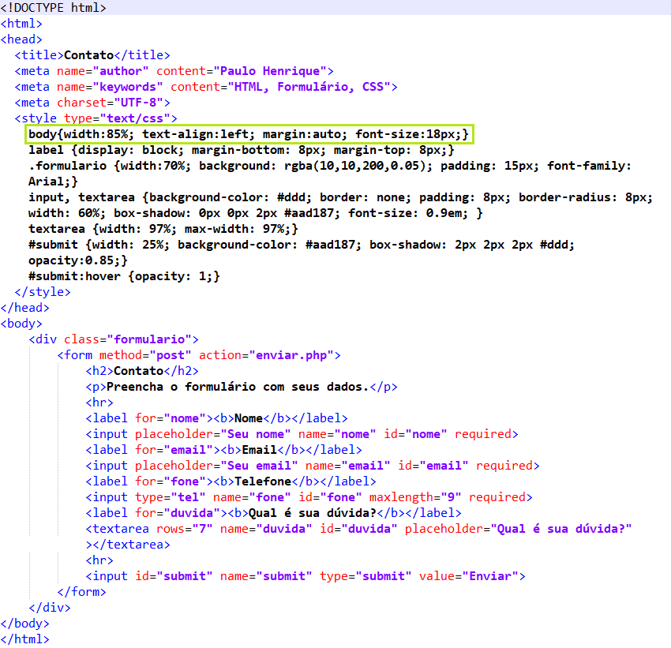
			   <figcaption>Agora vamos formatar as tags da página com CSS. O corpo da página <code>body</code> tem margem automática e uma largura de <b>85%</b>. Formate os elementos principais da página nesta tag.</figcaption>
		   </li>
		   <li>
			   <input type="radio" id="slide144" name="slide">
			   <label for="slide144"></label>
			   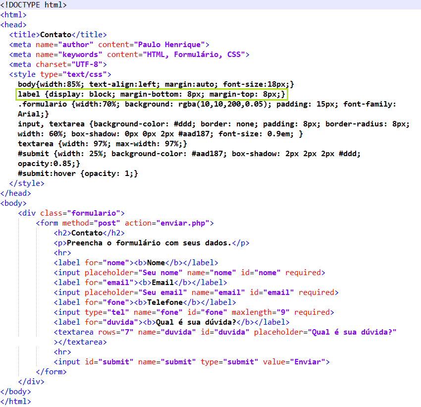
			   <figcaption>Os rótulos <code>label</code> têm atributo <code>display: block;</code>, que usa a linha inteira sem precisarmos de tags de parágrafos e de quebras de linhas para inserir as entradas <code>input</code>. Note que colocamos margens para não "grudar" os rótulos com as entradas.</figcaption>
		   </li>
		   <li>
			   <input type="radio" id="slide145" name="slide">
			   <label for="slide145"></label>
			   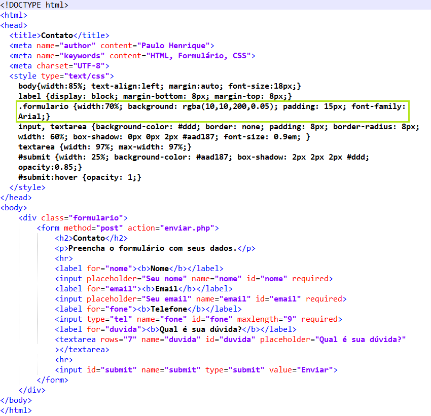
			   <figcaption>A classe <code>formulario</code> serve como um "container" do formulário, onde podemos atribuir cor de fundo, margem interna e tipo de fonte.</figcaption>
		   </li>
		   <li>
			   <input type="radio" id="slide146" name="slide">
			   <label for="slide146"></label>
			   
			   <figcaption>As entradas com tags nativas <code>input</code> e <code>textarea</code> podem ter propriedades de largura, cor de fundo, sombras e margens internas. Neste exemplo, criamos bordas arredondadas com o atributo <code>border-radius</code>.</figcaption>
		   </li>
		   <li>
			   <input type="radio" id="slide147" name="slide">
			   <label for="slide147"></label>
			   
			   <figcaption>A tag <code>textarea</code> pode ser inserida com largura maior do que as outras entradas. Por tratar-se de uma tag "elástica", que o visitante pode "abrir" com o cursor do mouse, colocamos também o tamanho de largura máxima <code>max-width</code>.</figcaption>
		   </li>
		   <li>
			   <input type="radio" id="slide148" name="slide">
			   <label for="slide148"></label>
			   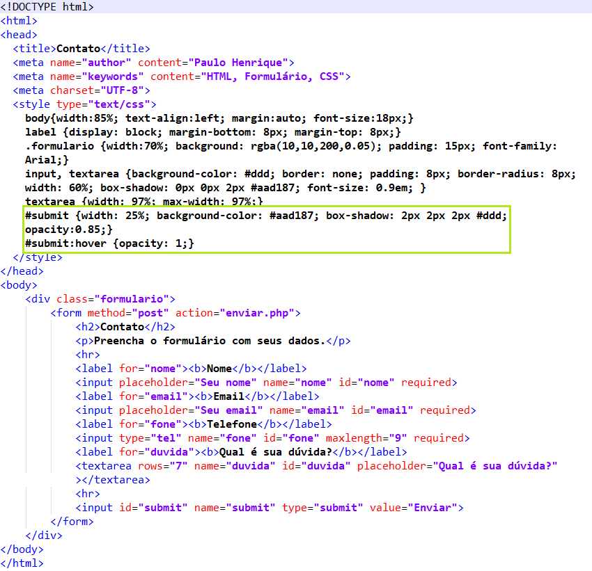
			   <figcaption>Como o botão para enviar os dados tem <code>id="submit"</code> no código HTML, sua formatação usa a hashtag <code>#submit</code> para referência. Este botão pode ter uma opacidade definida (neste exemplo é de <b>85%</b>), que modifica quando o visitante passa o cursor do mouse por cima do botão. Colocamos também a sombra <code>box-shadow</code> para dar um efeito de 3D.</figcaption>
		   </li>
		   <li>
			   <input type="radio" id="slide149" name="slide">
			   <label for="slide149"></label>
			   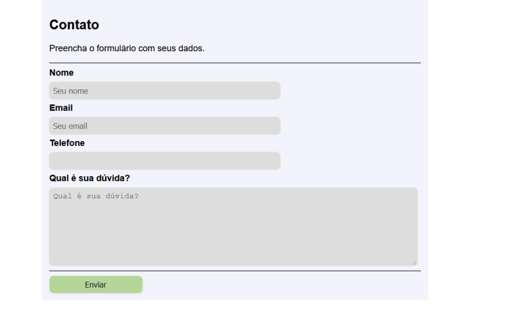
			   <figcaption>A página com contato fica com este layout. Modifique medidas, cores e crie sua página de contato. Vamos utilizá-la em próximas Atividades. </figcaption>
		   </li>
		</ul>
		
  

  
<a href="#css1" class="topo">voltar ao topo</a>

CSS, Flexbox e Mapeamentos de imagens: pág. 21-27

	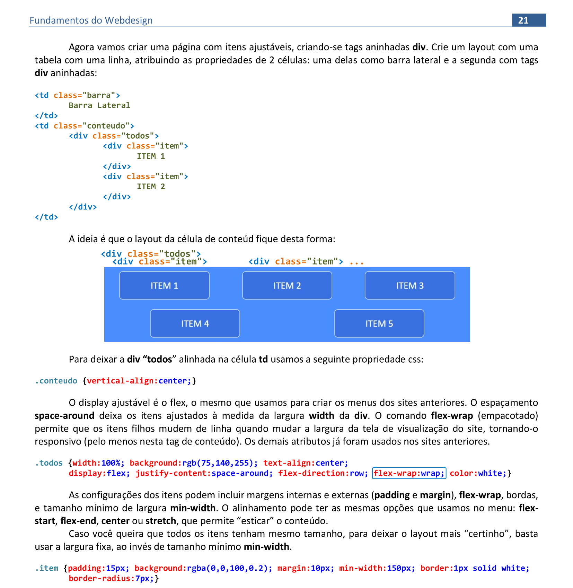
	

&#x1f4c3; FlexBox para itens

	
Crie uma página na nossa pasta de exercícios <code>webdesign/exercicios</code> com nome <code>itens.htm</code>. Dentro desta pasta, use a pasta de imagens para inserir fotos dos itens que vamos criar com o atributo FlexBox. É o mesmo que já usamos nos itens dos menus.

	  <ul class="slider">
		  <li>
			   <input type="radio" id="slide150" name="slide">
			   <label for="slide150"></label>
			   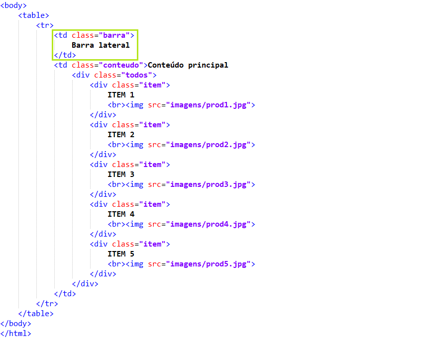
			   <figcaption>Usando a estrutura em tabela, vamos criar somente uma linha com a tag <code>&lt;tr&gt;</code> com duas barras: <b>lateral</b>, na primeira célula <code>&lt;td&gt;</code> e <b>conteúdo</b>, na segunda célula.</figcaption>
		   </li>
		   <li>
			   <input type="radio" id="slide151" name="slide">
			   <label for="slide151"></label>
			   
			   <figcaption>As tags podem ser referenciadas com as classes <code>class="barra"</code> e <code>class="conteudo"</code>.</figcaption>
		   </li>
		   <li>
			   <input type="radio" id="slide153" name="slide">
			   <label for="slide153"></label>
			   
			   <figcaption>Dentro da célula de <b>conteúdo</b>, crie uma nova classe para formatarmos no CSS: <code>class="todos"</code>, que será a tag mãe dos itens.</figcaption>
		   </li>
		   <li>
			   <input type="radio" id="slide154" name="slide">
			   <label for="slide154"></label>
			   
			   <figcaption>Dentro desta <b>div</b>, podemos criar as tags filhas, que terão classe <code>class="item"</code>. Em cada uma, coloque um texto e a respectiva imagem que está salva na pasta de imagens. Crie 5 ou mais itens, para testarmos o layout que será usado na próxima Atividade.</figcaption>
		   </li>
		   <li>
			   <input type="radio" id="slide155" name="slide">
			   <label for="slide155"></label>
			   
			   <figcaption>Agora vamos formatar as tags da página com CSS. Nesta página somente foi atribuído o tamanho da fonte na tag <code>body</code>.</figcaption>
		   </li>
		   <li>
			   <input type="radio" id="slide156" name="slide">
			   <label for="slide156"></label>
			   
			   <figcaption>Neste exemplo, foi usado <code>font-size:0.8em</code>, ou seja, teremos 80% do tamanho da fonte dentro das células. Atributos de cor de fundo e margens também podem ser colocados nesta tag <code>td</code>.</figcaption>
		   </li>
		   <li>
			   <input type="radio" id="slide157" name="slide">
			   <label for="slide157"></label>
			   
			   <figcaption>A tag mãe das células, <code>table</code>, pode ser usada para a largura do layout, bordas e alinhamento de texto.</figcaption>
		   </li>
		   <li>
			   <input type="radio" id="slide158" name="slide">
			   <label for="slide158"></label>
			   
			   <figcaption>Use atributos para formatar a barra lateral. Neste caso, foi usado o alinhamento vertical <code>vertical-align:top</code> para deixá-la na mesma altura do conteúdo.</figcaption>
		   </li>
		   <li>
			   <input type="radio" id="slide159" name="slide">
			   <label for="slide159"></label>
			   
			   <figcaption>A tag de conteúdo pode ter atributo de alinhamento vertical configurado e largura. Se atribuirmos 70% de largura, automaticamente a barra lateral fica com os 30% restantes.</figcaption>
		   </li>
		   <li>
			   <input type="radio" id="slide160" name="slide">
			   <label for="slide160"></label>
			   
			   <figcaption>A tag com todos os itens ficou com atributo de <code>display:flex;</code>, distribuição em linha <code>flex-direction:row;</code> e o atributo <code>flex-wrap:wrap;</code> para deixar que os itens mudem de linha automaticamente se o navegador não conseguir exibí-los todos na mesma linha.</figcaption>
		   </li>
		   <li>
			   <input type="radio" id="slide161" name="slide">
			   <label for="slide161"></label>
			   
			   <figcaption>Os itens "herdam" a propriedade flex da tag mãe "todos". Os itens podem ter o atributo de largura mínima <code>min-width:150px;</code>, evitando que o respectivo conteúdo seja "espremido" demais para caber em uma linha só. Cor de fundo, borda e arredondamento de bordas podem ser atribuídos nos itens. Faça testes do layout do flexbox que criamos.</figcaption>
		   </li>
		   <li>
			   <input type="radio" id="slide162" name="slide">
			   <label for="slide162"></label>
			   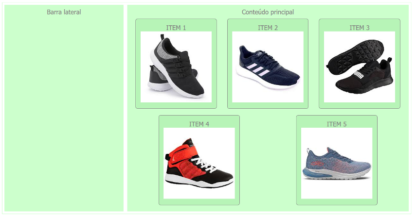
			   <figcaption>A página de itens fica com este layout. Modifique medidas, cores e crie sua página de itens, que será utilizada em próximas Atividades. Se as alturas das imagens ficarem muito diferentes, você pode usar altura mínima <code>min-height</code> ou editar as imagens externamente, deixando-as com mesmo tamanho.</figcaption>
		   </li>
		</ul>
		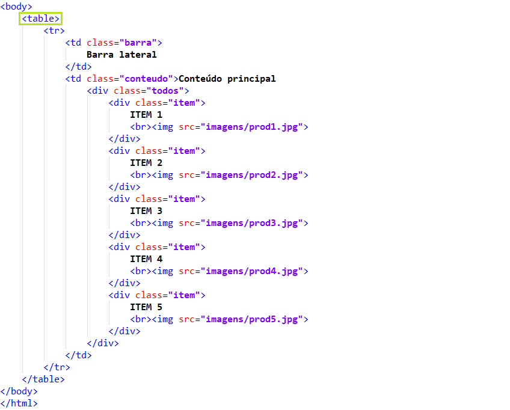
  

	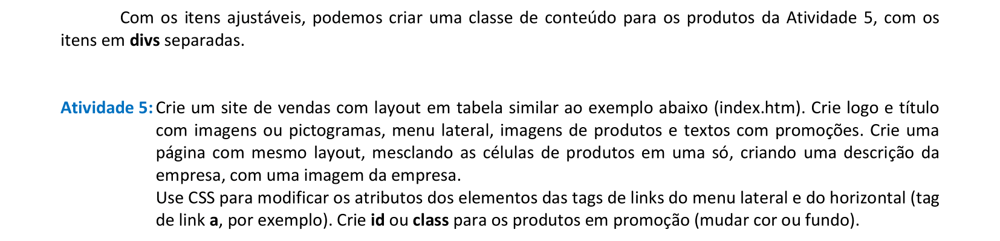
	
<a href="#css2" class="topo">voltar ao topo</a>

	
	

&#x1f4c3; Detalhes do site principal

	
Crie uma pasta chamada <code>webdesign/atividade5</code>, com a página principal com nome <code>index.htm</code>. Dentro desta pasta, crie a pasta de imagens para inserir fotos dos 12 itens que aparecem na página criada. Vamos usar muitos recursos da página que construímos com Flexbox.

	  <ul class="slider">
		  <li>
			   <input type="radio" id="slide163" name="slide">
			   <label for="slide163"></label>
			   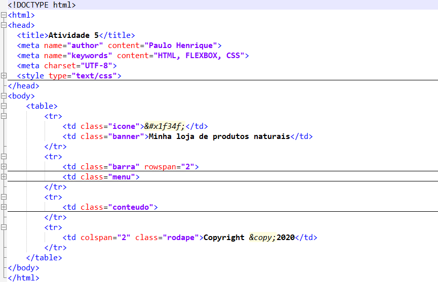
			   <figcaption>A estrutura HTML desta Atividade terá 1 linha com o <b>ícone</b> e o <b>banner</b> da loja, uma linha com a <b>barra lateral</b> e o <b>menu</b>, na outra linha aparece o <b>conteúdo</b> com itens da loja e finalizamos com o <b>rodapé</b> na última linha.</figcaption>
		   </li>
		  <li>
			   <input type="radio" id="slide164" name="slide">
			   <label for="slide164"></label>
			   
			   <figcaption>Na <b>barra lateral</b>, podemos usar a mesma estrutura da Atividade 4, com email e links para redes sociais fictícias, da loja virtual que estamos criando.</figcaption>
		   </li>
		   <li>
			   <input type="radio" id="slide165" name="slide">
			   <label for="slide165"></label>
			   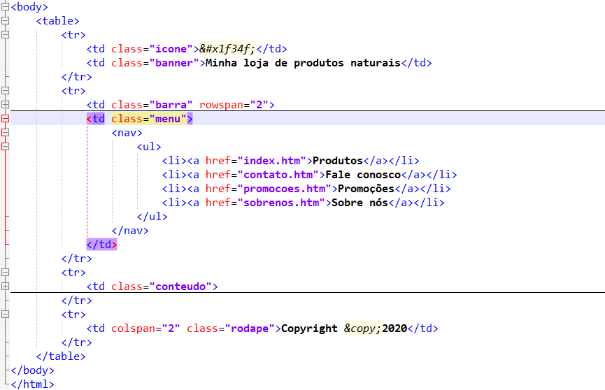
			   <figcaption>O <b>menu</b> terá estrutura parecida com a que usamos na Atividade 4, inclusive na sua programação CSS.</figcaption>
		   </li>
		   <li>
			   <input type="radio" id="slide166" name="slide">
			   <label for="slide166"></label>
			   
			   <figcaption>Os itens da loja podem ser colocados dentro da tag <code>class="todos"</code>, que usamos na página anterior. Cada item aparece dentro de uma classe <code>class="item"</code>, one colocamos um título do produto, uma imagem e o preço, com a tag <code>&lt;strike&gt;</code> para os preços antigos de cada um dos 12 produtos.</figcaption>
		   </li>
		   <li>
			   <input type="radio" id="slide167" name="slide">
			   <label for="slide167"></label>
			   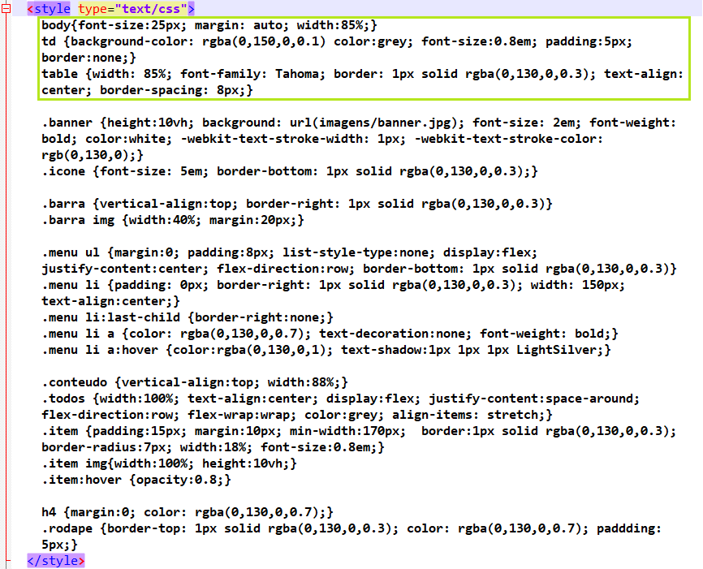
			   <figcaption>A programação da página CSS tem itens que valem para a página principal e para as páginas filhas. A tabela está com fundo branco, com bordas em tom verde claro. O atributo <code>border-spacing</code> separa as partes das páginas.</figcaption>
		   </li>
		   <li>
			   <input type="radio" id="slide168" name="slide">
			   <label for="slide168"></label>
			   
			   <figcaption>O banner está referenciado com a altura da tela do navegador com o atributo <code>height:10vh;</code>, ou seja, <b>10%</b> da altura da tela. Uma imagem de fundo dos produtos e a cor do texto também podem ser configurados no CSS. Escolha um <a href="http://www.degraf.ufpr.br/docentes/paulo/webdesign/pictograph.html" target="_blank">pictograma</a> para colocar na tag de ícone.</figcaption>
		   </li>
		   <li>
			   <input type="radio" id="slide169" name="slide">
			   <label for="slide169"></label>
			   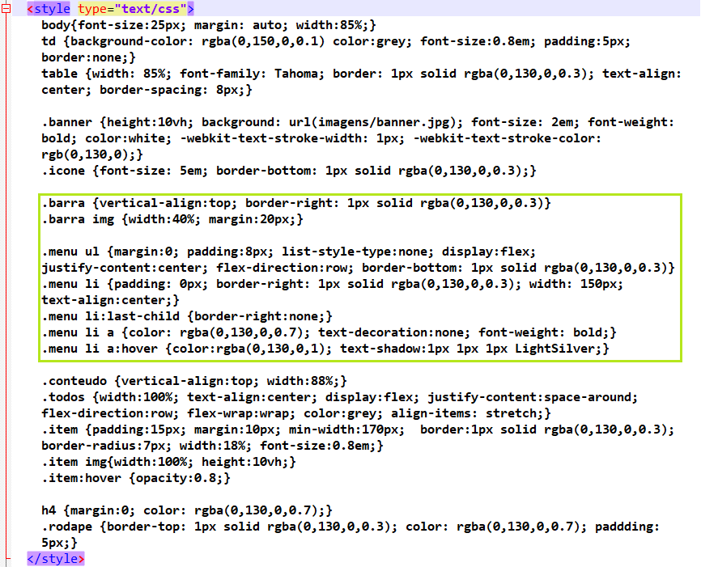
			   <figcaption>A barra lateral e o menu também ficarão fixos, valendo para todas as páginas do site desta atividade. Você pode usar os mesmos atributos da Atividade 4, modificando cores e espaçamentos para a loja virtual</figcaption>
		   </li>
		   <li>
			   <input type="radio" id="slide170" name="slide">
			   <label for="slide170"></label>
			   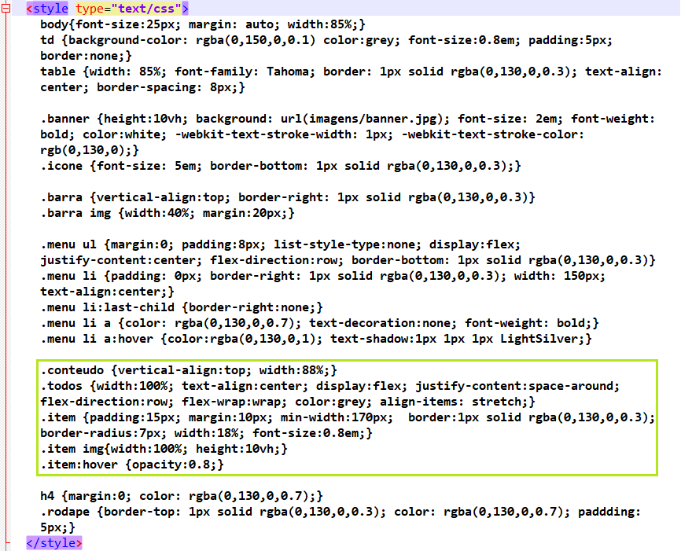
			   <figcaption>O conteúdo pode ter propriedades diferentes em cada página do site. Nesta primeira página, estamos colocando os itens com atributos <b>flexbox</b> para os produtos da loja. Margens, cores e configurações de fonte podem ser modificadas nesta tag.Para deixar as imagens com mesmo tamanho, foi usada a propriedade de altura no atributo <code>.item img {}</code>.</figcaption>
		   </li>
		   <li>
			   <input type="radio" id="slide171" name="slide">
			   <label for="slide171"></label>
			   
			   <figcaption>Os cabeçalhos dos produtos e o rodapé podem ser configurados em CSS.</figcaption>
		   </li>
		   <li>
			   <input type="radio" id="slide172" name="slide">
			   <label for="slide172"></label>
			   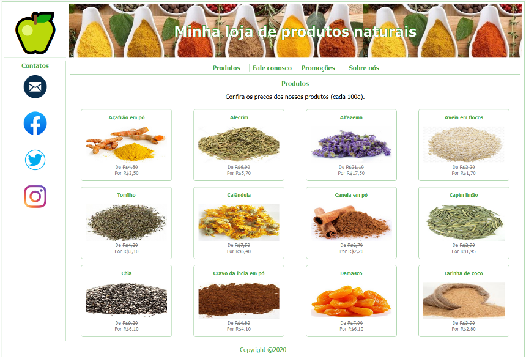
			   <figcaption>Usando os atributos mostrados, a página <code>index.htm</code> fica com este layout. Monte a sua página da Atividade da loja virtual. Agora, vamos ver como criar as "páginas filhas".</figcaption>
		   </li>
		</ul>
		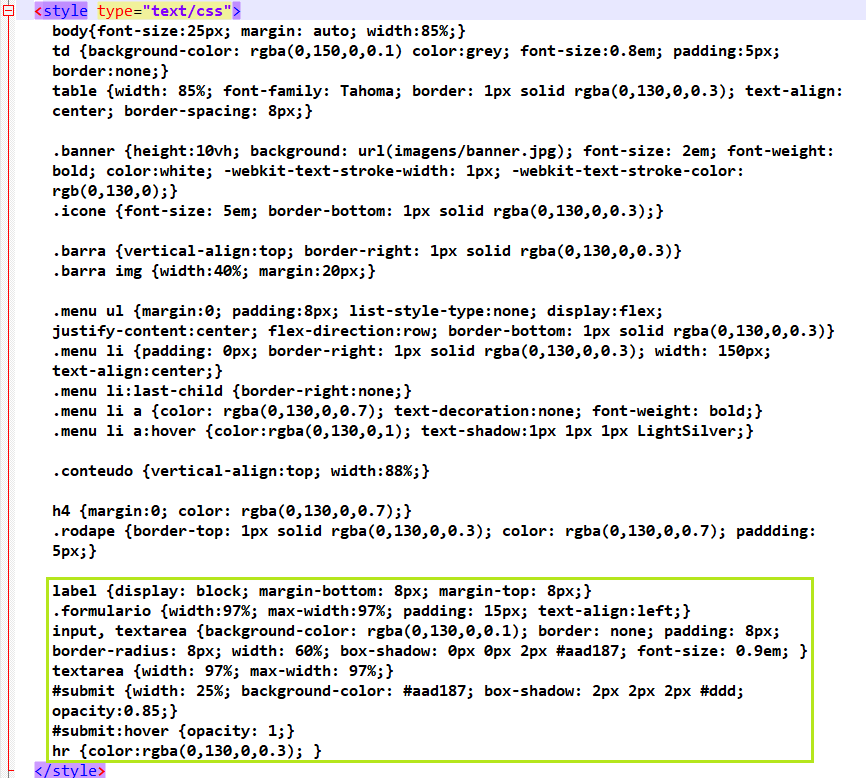
  

  

&#x1f4c3; Detalhes das outras páginas

	
Na pasta chamada <code>webdesign/atividade5</code>, crie as páginas <code>sobrenos.htm</code> e <code>contato.htm</code>. Estas páginas usarão a mesma pasta de imagens criada para a página principal.

	  <ul class="slider">
		  <li>
			   <input type="radio" id="slide173" name="slide">
			   <label for="slide173"></label>
			   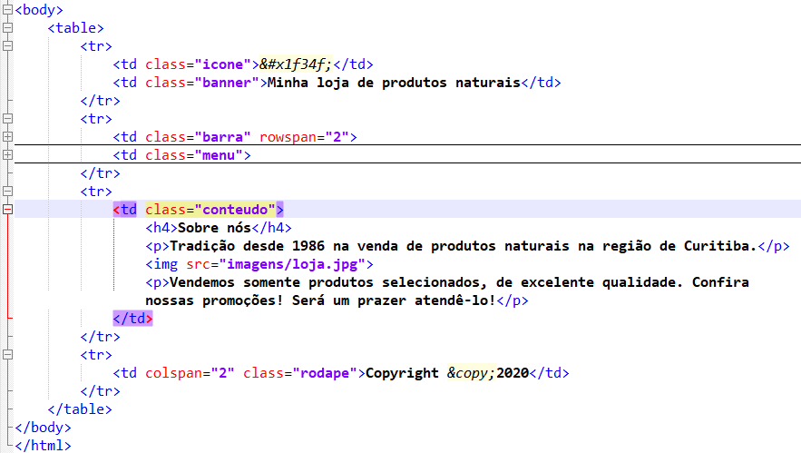
			   <figcaption>A página <code>sobrenos.htm</code> contém informações genéricas da loja virtual. Insira uma imagem e um pouco de texto sobre o atendimento da loja.</figcaption>
		   </li>
		  <li>
			   <input type="radio" id="slide174" name="slide">
			   <label for="slide174"></label>
			   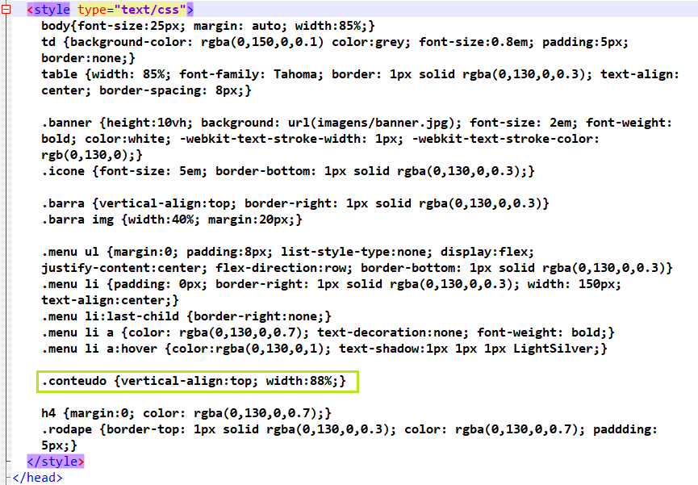
			   <figcaption>Podemos copiar toda a configuração CSS da página <code>index.htm</code>. A tag de conteúdo pode conter apenas atributos de alinhamento vertical e de largura nesta página.</figcaption>
		   </li>
		   <li>
			   <input type="radio" id="slide175" name="slide">
			   <label for="slide175"></label>
			   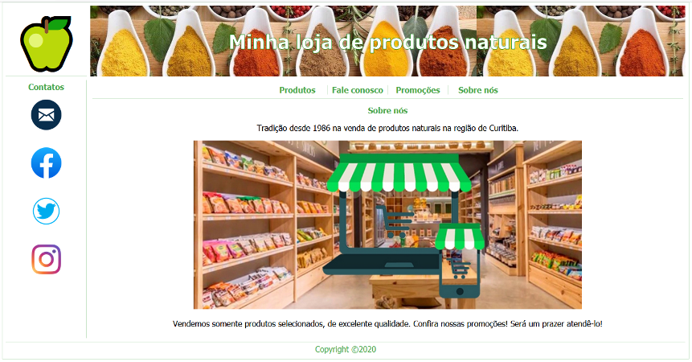
			   <figcaption>O layout da página fica com esta configuração. Note que o ícone, banner, barra lateral, menu e rodapé ficam com mesmo layout da página <code>index.htm</code>.</figcaption>
		   </li>
		   <li>
			   <input type="radio" id="slide176" name="slide">
			   <label for="slide176"></label>
			   
			   <figcaption>Na página de contato, podemos usar a mesma estrutura HTML usada na Atividade 4. Crie o arquivo <code>enviar.php</code> com mesmo código que usamos nos formulários de contato que já criamos.</figcaption>
		   </li>
		   <li>
			   <input type="radio" id="slide177" name="slide">
			   <label for="slide177"></label>
			   
			   <figcaption>Configure os atributos dos itens do formulário de acordo com as cores usadas no layout do site. Note que o conteúdo desta página de contato também pode ser configurado de forma simplificada, sem os itens dos produtos.</figcaption>
		   </li>
		   <li>
			   <input type="radio" id="slide178" name="slide">
			   <label for="slide178"></label>
			   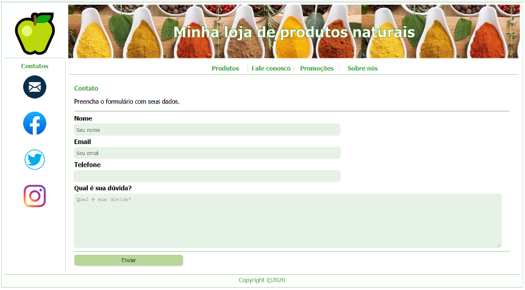
			   <figcaption>Com as propriedades e atributos mostrados, a página de contato fica com esse layout. Crie suas páginas de contato e "Sobre nós". A página de promoções é opcional, que pode mostrar alguns produtos em destaque.</figcaption>
		   </li>
		</ul>
		
  

	
	
<a href="#css2" class="topo">voltar ao topo</a>

	
	

&#x1f4c3; Mapeamento de imagens

	
Vamos criar uma pasta chamada <code>webdesign/mapeamento</code>. Nesta pasta, crie um arquivo chamado <code>mapeamento.htm</code>. Escolha um dos arquivos para fazer o mapeamento: <a href="css2/menu_horizontal.png" download>menu verde</a>, <a href="css2/menu_horizontal1.png" download>menu branco</a> ou encontre outra imagem de um menu completo.

	  <ul class="slider">
		  <li>
			   <input type="radio" id="slide179" name="slide">
			   <label for="slide179"></label>
			   
			   <figcaption>Um mapeamento de imagens usa a tag <code>&lt;map&gt;</code>, que contém os shapes com links. A primeira tag desta página é a imagem que será mapeada com a tag <code>&lt;img&gt;</code>.</figcaption>
		   </li>
		  <li>
			   <input type="radio" id="slide180" name="slide">
			   <label for="slide180"></label>
			   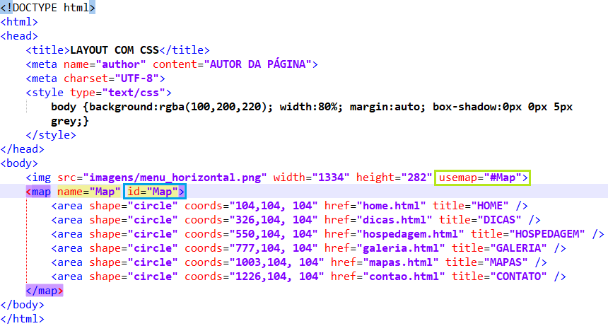
			   <figcaption>Como precisamos referenciar qual será a imagem mapeada, usamos os atributos <code>usemap="#Map"</code> na tag <code>&lt;img&gt;</code> e o identificador <code>id="#Map"</code>. Desta forma, os shapes aparecerão por cima da imagem com identificador <code>#Map</code>.</figcaption>
		   </li>
		   <li>
			   <input type="radio" id="slide181" name="slide">
			   <label for="slide181"></label>
			   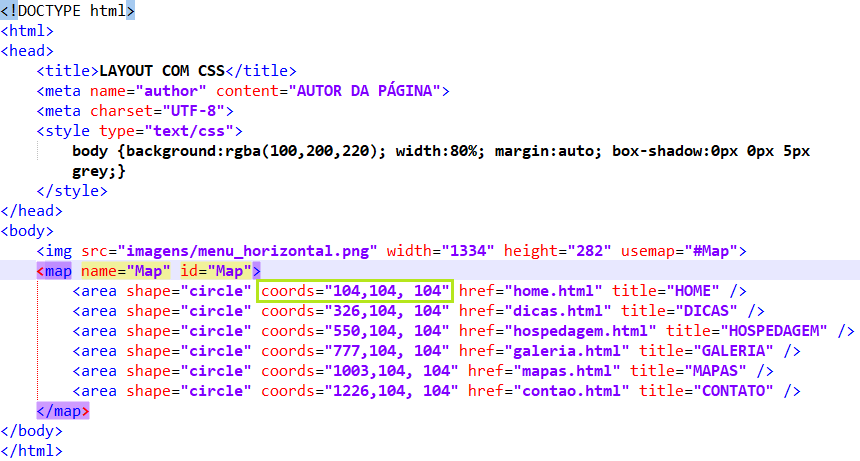
			   <figcaption>Neste exemplo, mostraremos o uso dos círculos para mapear. Eles criam uma área invisível para o visitante, mas que ao passar o cursor do mouse por cima da área na imagem, aparece o link. Os círculos possuem as coordenadas do centro <b>X</b> e <b>Y</b> e a medida do <b>RAIO</b>: <code>coords="X,Y,RAIO"</code>. Pegue as coordenadas da imagem de menu que você mapear em um editor de imagens.</figcaption>
		   </li>
		   <li>
			   <input type="radio" id="slide183" name="slide">
			   <label for="slide183"></label>
			   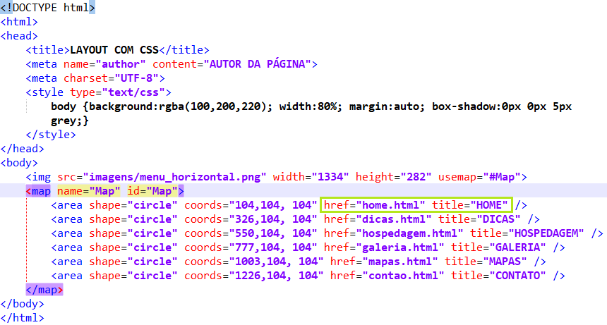
			   <figcaption>Outras informações que precisamos inserir na tag de cada shape é do link e seu título: <code>href</code> e <code>title</code>. Crie o mapeamento, salve a página e teste o layout. Vamos fazer outros mapeamentos a seguir.</figcaption>
		   </li>
		</ul>
		
  

	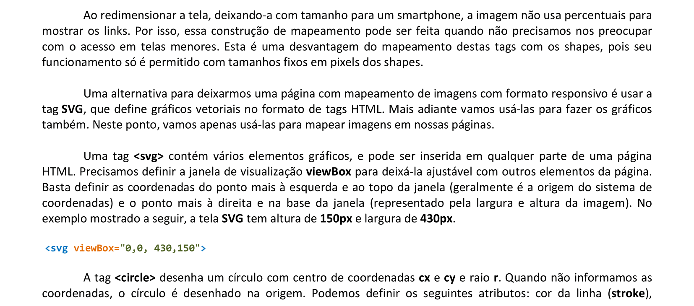
	
<a href="#css2" class="topo">voltar ao topo</a>

	
	
<a href="#css2" class="topo">voltar ao topo</a>

	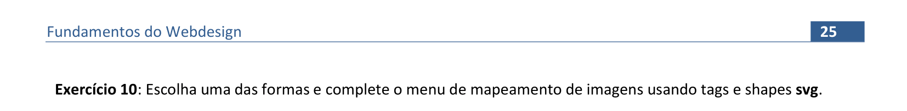
	

&#x1f4c3; Mapeamento de imagens com SVG

	
Vamos usar a pasta <code>webdesign/mapeamento</code> para este exercício. Crie um arquivo chamado <code>mapeamento-svg.htm</code>. Escolha um dos arquivos para fazer o mapeamento: <a href="css2/menu_horizontal.png" download>menu verde</a>, <a href="css2/menu_horizontal1.png" download>menu branco</a> ou encontre outra imagem de um menu completo.

	  <ul class="slider">
		  <li>
			   <input type="radio" id="slide184" name="slide">
			   <label for="slide184"></label>
			   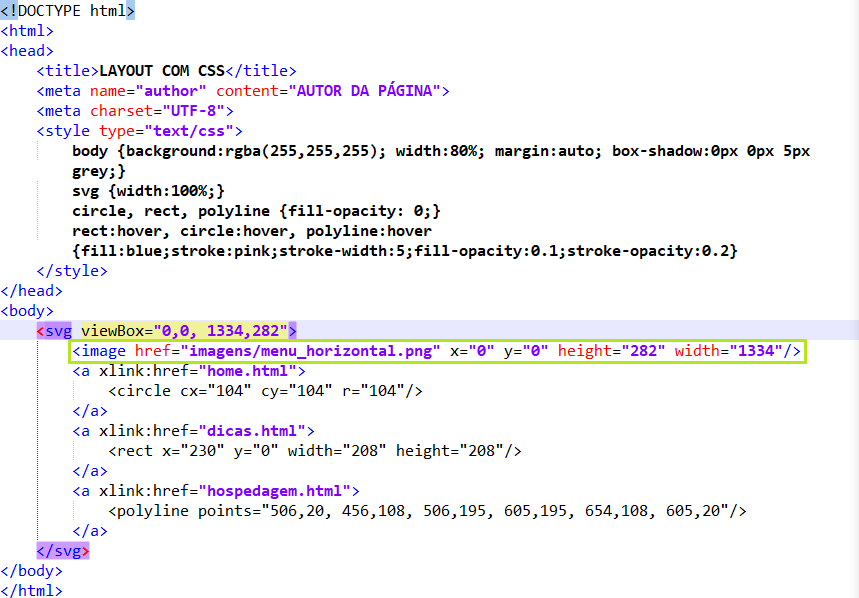
			   <figcaption>Usando SVG, nosso mapeamento ficará responsivo. Com a tag <code>&lt;svg&gt;</code>, crie a janela de visualização <code>viewBox</code> com as mesmas dimensões da imagem que será mapeada.</figcaption>
		   </li>
		   <li>
			   <input type="radio" id="slide185a" name="slide">
			   <label for="slide185a"></label>
			   
			   <figcaption>A estrutura com SVG é basicamente a mesma que usamos com tags HTML, modificando apenas a forma de escrever os comandos. Dentro de uma tag de link <code>&lt;a&gt;</code>, colocamos os shapes. Neste exemplo, são mostrados o círculo, o retângulo e o polígono com SVG.</figcaption>
		   </li>
		   <li>
			   <input type="radio" id="slide186" name="slide">
			   <label for="slide186"></label>
			   
			   <figcaption>Podemos usar atributos de opacidade nos shapes usando <code>fill-opacity:0;</code>.</figcaption>
		   </li>
		   <li>
			   <input type="radio" id="slide187" name="slide">
			   <label for="slide187"></label>
			   
			   <figcaption>Quando o visitante passar o cursor do mouse sobre os mapeamentos, usamos o atributo <code>hover</code> de cada shape para definir linhas e opacidade diferente de 0. Teste o layout e os mapeamentos. Experimente diminuir o tamanho da tela do navegador para testar se o site fica responsivo.</figcaption>
		   </li>
		</ul>
		
  

	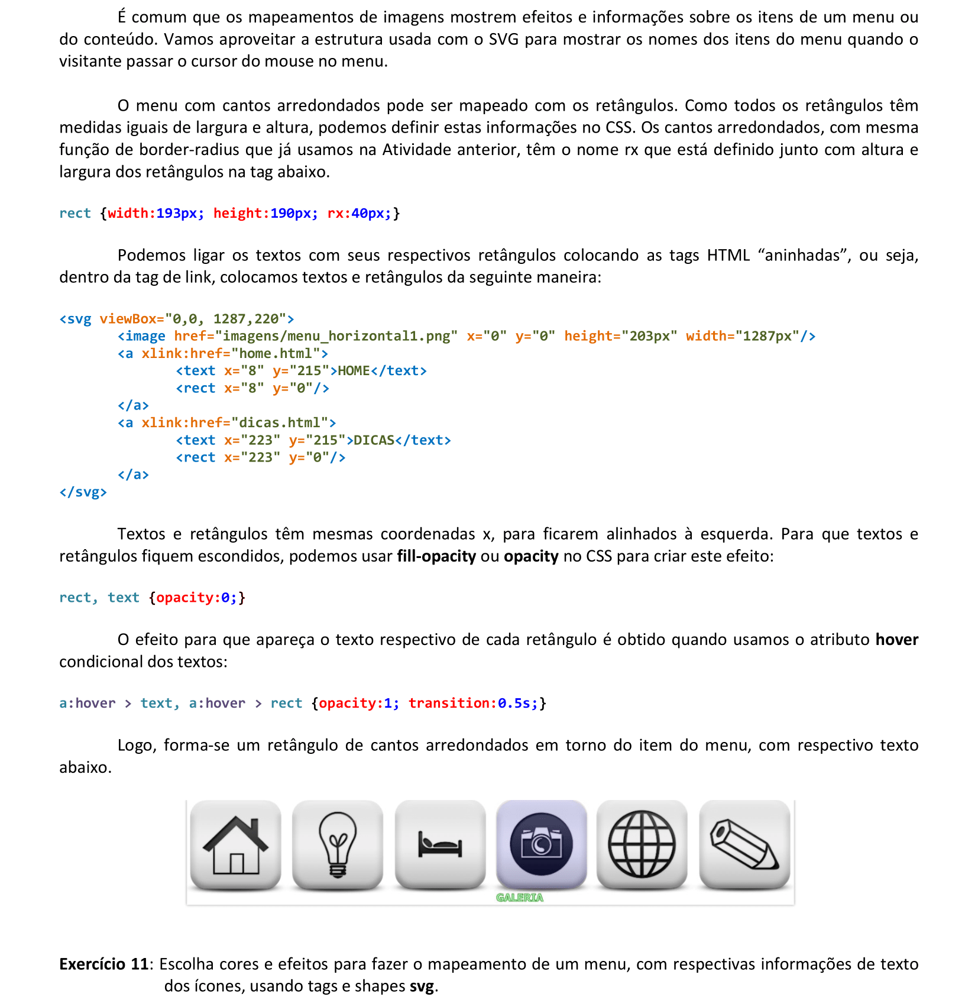
	

&#x1f4c3; Mapeamento com SVG e texto

	
Vamos usar a pasta <code>webdesign/mapeamento</code> para este exercício. Crie um arquivo chamado <code>mapeamento-svg-info.htm</code>, que usaremos para criar o mapeamento do menu com informações de texto. Escolha um dos arquivos para fazer o mapeamento: <a href="css2/menu_horizontal.png" download>menu verde</a>, <a href="css2/menu_horizontal1.png" download>menu branco</a> ou encontre outra imagem de um menu completo.

	  <ul class="slider">
		  <li>
			   <input type="radio" id="slide188" name="slide">
			   <label for="slide188"></label>
			   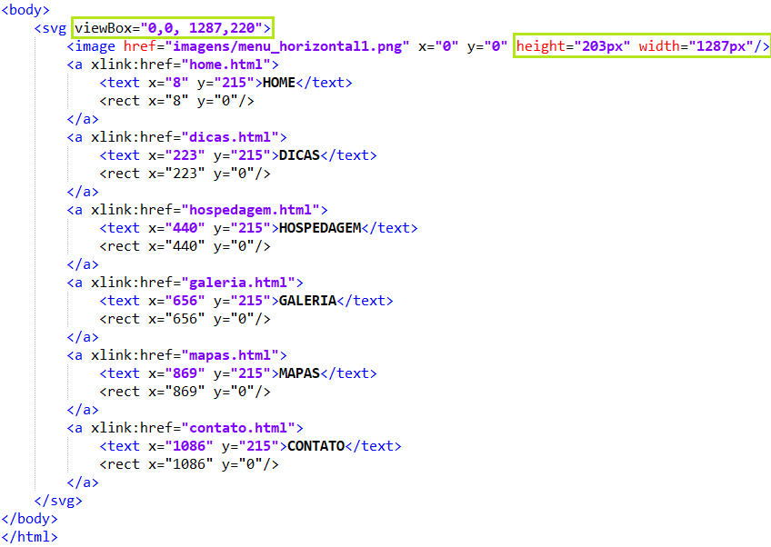
			   <figcaption>Neste exemplo, o menu branco foi usado. Note que a janela <code>viewBox</code> do SVG foi criada com altura um pouco maior, para que as informações de texto apareçam logo abaixo dos ícones do menu.</figcaption>
		   </li>
		   <li>
			   <input type="radio" id="slide189" name="slide">
			   <label for="slide189"></label>
			   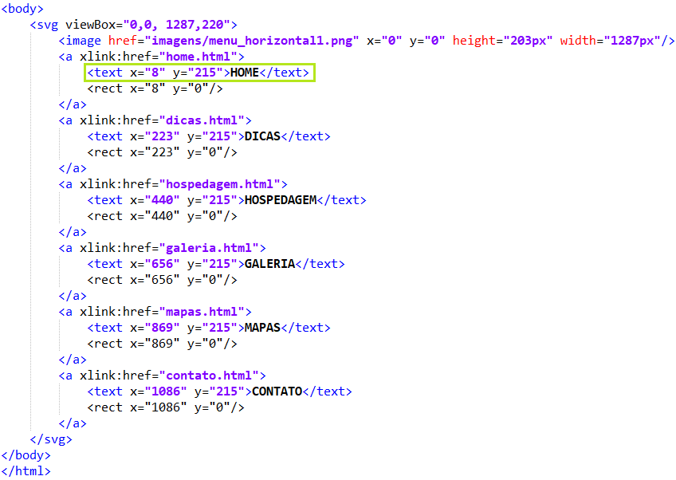
			   <figcaption>Dentro da mesma estrutura criada na página anterior, colocamos a tag <code>&lt;text&gt;</code> com respectivos shapes de retângulos. Para alinhar à esquerda o texto com o ícone, as coordenadas <b>x</b> do texto e dos retângulos são as mesmas. As coordenadas <b>y</b> serão iguais a 215px.</figcaption>
		   </li>
		   <li>
			   <input type="radio" id="slide190" name="slide">
			   <label for="slide190"></label>
			   
			   <figcaption>Definimos como padrão de visualização de retângulos e textos no CSS as opacidades nulas de tags <code>rect</code> e <code>text</code>.</figcaption>
		   </li>
		   <li>
			   <input type="radio" id="slide191" name="slide">
			   <label for="slide191"></label>
			   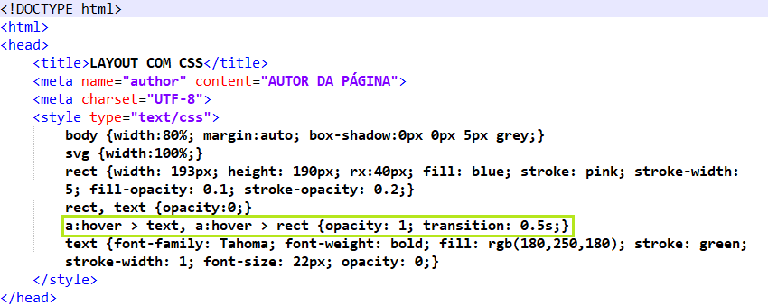
			   <figcaption>Quando o visitante passar o cursos do mouse por cima de uma região com tag mapeada <code>&lt;a&gt;</code>, os respectivos textos e retângulos aparecerão com a definição do atributo de opacidade em <code>a:hover > text</code> e <code>a:hover > rect</code>.</figcaption>
		   </li>
		   <li>
			   <input type="radio" id="slide192" name="slide">
			   <label for="slide192"></label>
			   
			   <figcaption>Defina os atributos de cores de preenchimento, linhas, tipos de fonte e opacidade nula para os textos. A opacidade só ficará igual a 1 quando o atributo <code>hover</code> ficar ativo. Configure também o atributo <code>transition: 0.5s</code> para fazer uma transição de meio segundo na mudança de opacidade.</figcaption>
		   </li>
		   <li>
			   <input type="radio" id="slide193" name="slide">
			   <label for="slide193"></label>
			   
			   <figcaption>O layout do menu fica desta maneira. Configure outros valores e faça teste de layout no menu de sua página para usarmos em outras páginas a seguir.</figcaption>
		   </li>
		</ul>
		
  

	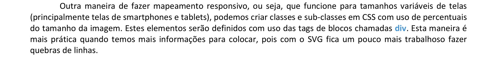
	
<a href="#css2" class="topo">voltar ao topo</a>

	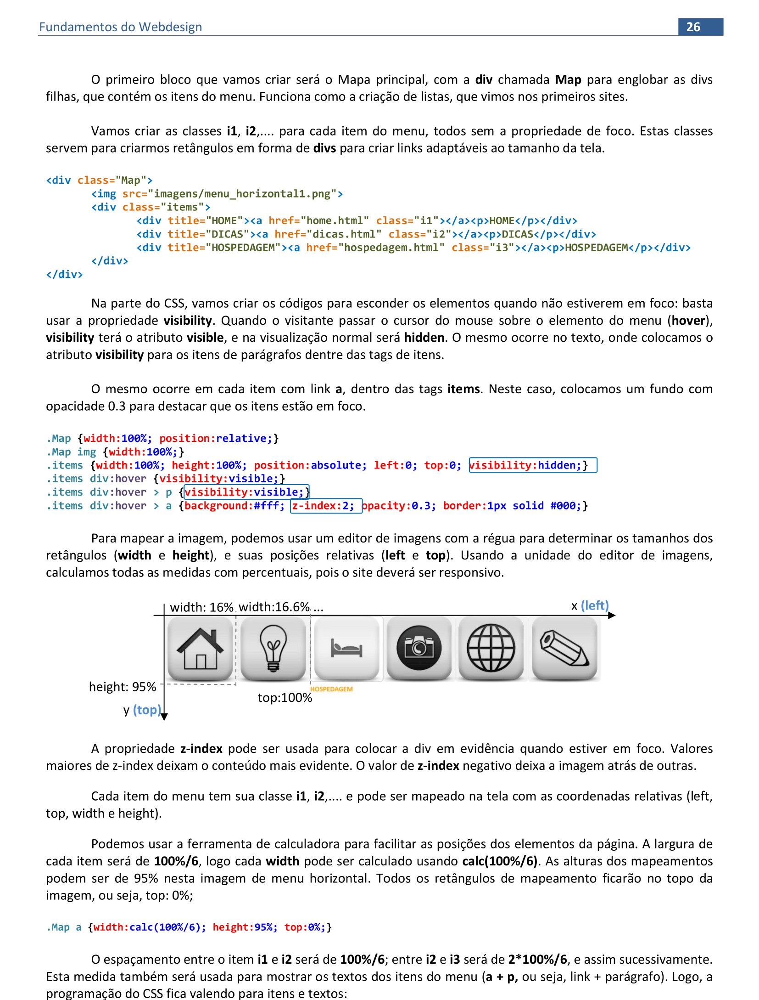
	
<a href="#css2" class="topo">voltar ao topo</a>

	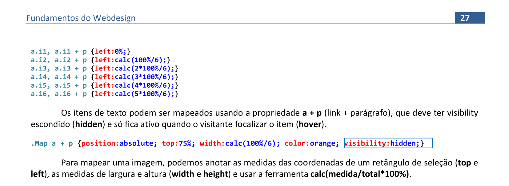
	

&#x1f4c3; Mapeamento com div e texto

	
Vamos usar a pasta <code>webdesign/mapeamento</code> para este exercício. Crie um arquivo chamado <code>mapeamento-div-info.htm</code>, que usaremos para criar o mapeamento do menu com tags <code>div</code> e informações de texto. Escolha um dos arquivos para fazer o mapeamento: <a href="css2/menu_horizontal.png" download>menu verde</a>, <a href="css2/menu_horizontal1.png" download>menu branco</a> ou encontre outra imagem de um menu completo.

	  <ul class="slider">
		  <li>
			   <input type="radio" id="slide194" name="slide">
			   <label for="slide194"></label>
			   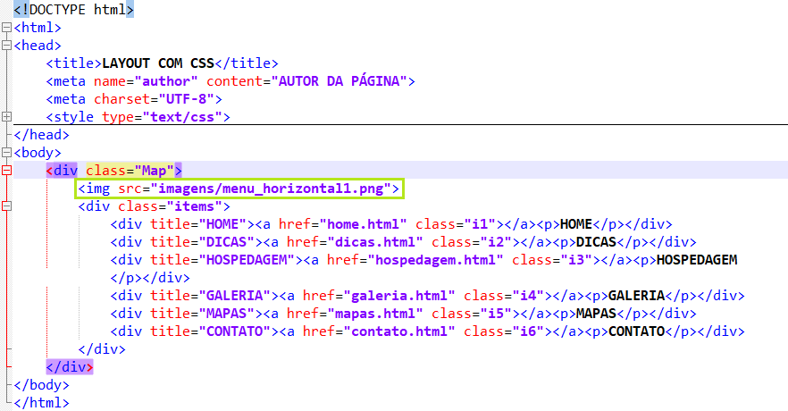
			   <figcaption>Neste exemplo, foi usado o menu branco. Criamos uma div "mãe" <code>class="Map"</code> que contém a imagem <code>&lt;img&gt;</code> e as <code>div</code> dos itens do menu.</figcaption>
		   </li>
		   <li>
			   <input type="radio" id="slide195" name="slide">
			   <label for="slide195"></label>
			   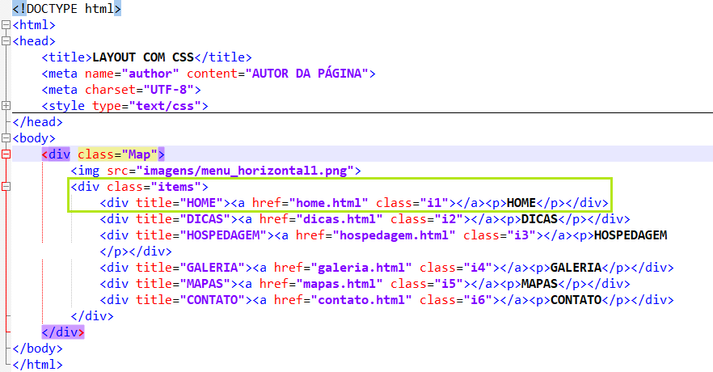
			   <figcaption>A <b>div</b> <code>class="items"</code> agrupa cada item do menu. Definimos uma <b>div</b> de item, com o texto <code>&lt;p&gt;</code> e o link <code>&lt;a&gt;</code> para cada parte do menu.</figcaption>
		   </li>
		   <li>
			   <input type="radio" id="slide196" name="slide">
			   <label for="slide196"></label>
			   
			   <figcaption>Cada item tem uma posição específica no mapeamento. Logo, criamos as classes <code>class="i1"</code>, <code>class="i2"</code>, ..., <code>class="i6"</code> dos itens do menu.</figcaption>
		   </li>
		   <li>
			   <input type="radio" id="slide197" name="slide">
			   <label for="slide197"></label>
			   
			   <figcaption>Na programação CSS, definimos os atributos mais gerais, com a classe <code>.Map</code> com imagens de largura 100%, parágrafos sem margens e os itens escondidos, com o atributo <code>visibility:hidden;</code>.</figcaption>
		   </li>
		   <li>
			   <input type="radio" id="slide198" name="slide">
			   <label for="slide198"></label>
			   
			   <figcaption>Ao ativar os itens com o cursor do mouse sobre cada um deles <code>items div:hover</code>, definimos que os itens serão visíveis, com bordas e opacidade de um fundo sobre cada parte do item, e o texto visível com atributo <code>visibility:visible;</code></figcaption>
		   </li>
		   <li>
			   <input type="radio" id="slide199" name="slide">
			   <label for="slide199"></label>
			   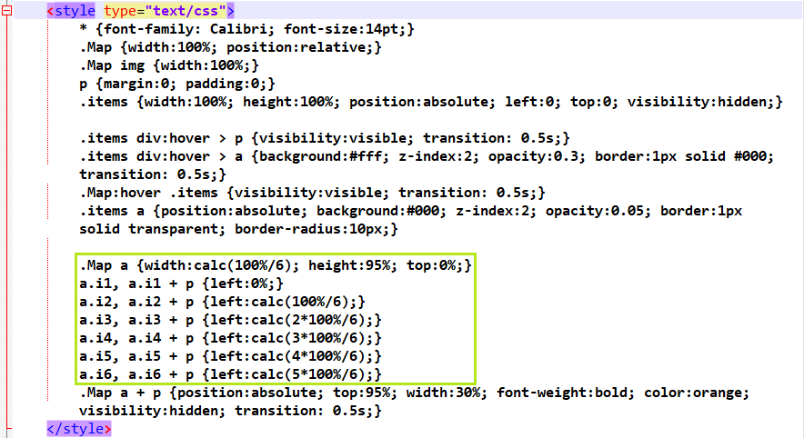
			   <figcaption>A altura da posição do texto foi fixada em 95%, e os itens foram posicionados levando-se em conta que todos têm mesmo tamanho <code>width:calc(100%/6);</code>. Logo, o primeiro item fica em <code>left:0%;</code>, o segundo em <code>left:calc(100%/6);</code> e assim sucessivamente, até <code>left:calc(5*100%/6);</code></figcaption>
		   </li>
		   <li>
			   <input type="radio" id="slide200" name="slide">
			   <label for="slide200"></label>
			   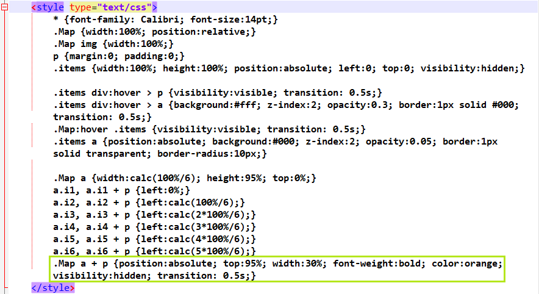
			   <figcaption>Para finalizar, os textos aparecem na posição <code>top:95%;</code>, e devemos deixá-los escondidos com <code>visibility:hidden;</code>. Colocando-se o <code>transition:05s;</code>, ocorre uma suavidade na mudança do estágio invisível para visível.</figcaption>
		   </li>
		</ul>
		
  

	
	

&#x1f4c3; Mapeamento lateral com div e texto

	
Vamos usar a pasta <code>webdesign/mapeamento</code> para este exercício. Crie um arquivo chamado <code>mapeamento-lateral-div-info.htm</code>, que usaremos para criar o mapeamento do menu lateral com tags <code>div</code> e informações de texto. Escolha um dos arquivos para fazer o mapeamento: <a href="css2/menu_horizontal.png" download>menu verde</a>, <a href="css2/menu_horizontal1.png" download>menu branco</a> ou encontre outra imagem de um menu completo.

	  <ul class="slider">
		  <li>
			   <input type="radio" id="slide201" name="slide">
			   <label for="slide201"></label>
			   
			   <figcaption>Neste exemplo, foi usado o menu verde. Criamos uma div "mãe" <code>class="Map"</code> que contém a imagem <code>&lt;img&gt;</code> e as <code>div</code> dos itens do menu.</figcaption>
		   </li>
		   <li>
			   <input type="radio" id="slide202" name="slide">
			   <label for="slide202"></label>
			   
			   <figcaption>A <b>div</b> <code>class="items"</code> agrupa cada item do menu. Definimos uma <b>div</b> de item, com o texto <code>&lt;p&gt;</code> e o link <code>&lt;a&gt;</code> para cada parte do menu.</figcaption>
		   </li>
		   <li>
			   <input type="radio" id="slide203" name="slide">
			   <label for="slide203"></label>
			   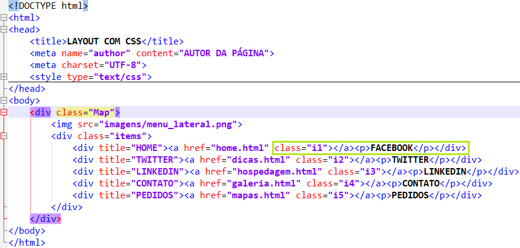
			   <figcaption>Cada item tem uma posição específica no mapeamento. Logo, criamos as classes <code>class="i1"</code>, <code>class="i2"</code>, ..., <code>class="i5"</code> dos itens do menu.</figcaption>
		   </li>
		   <li>
			   <input type="radio" id="slide204" name="slide">
			   <label for="slide204"></label>
			   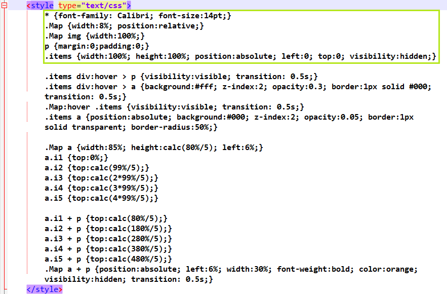
			   <figcaption>Na programação CSS, definimos os atributos mais gerais, com a classe <code>.Map</code> com imagens de largura 100%, parágrafos sem margens e os itens escondidos, com o atributo <code>visibility:hidden;</code>.</figcaption>
		   </li>
		   <li>
			   <input type="radio" id="slide205" name="slide">
			   <label for="slide205"></label>
			   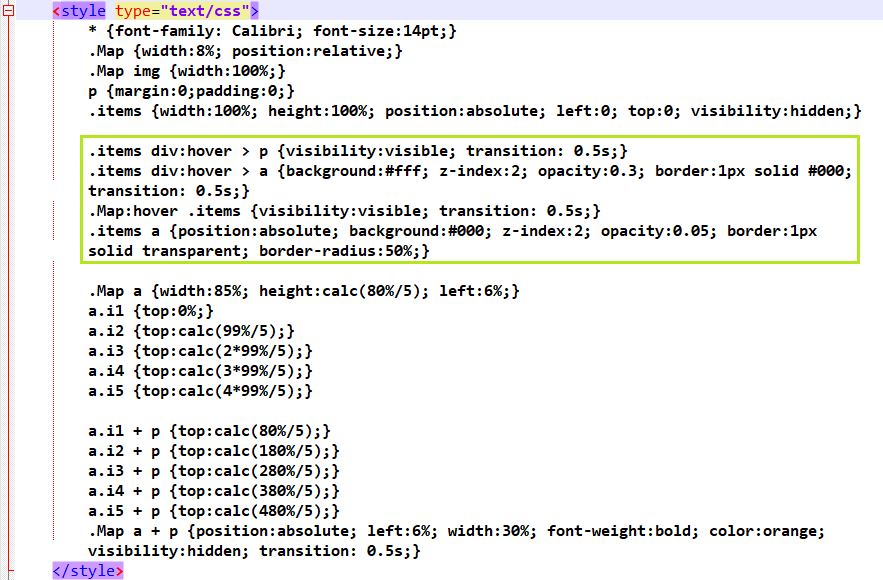
			   <figcaption>Ao ativar os itens com o cursor do mouse sobre cada um deles <code>items div:hover</code>, definimos que os itens serão visíveis, com bordas e opacidade de um fundo sobre cada parte do item, e o texto visível com atributo <code>visibility:visible;</code></figcaption>
		   </li>
		   <li>
			   <input type="radio" id="slide206" name="slide">
			   <label for="slide206"></label>
			   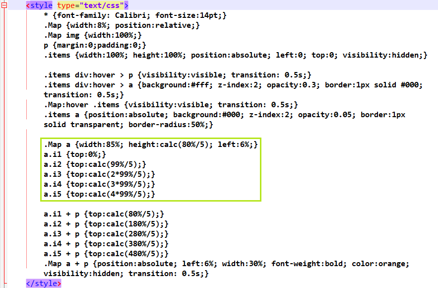
			   <figcaption>No menu lateral a posição do texto à esquerda foi fixada em 6%, e os itens foram posicionados levando-se em conta que todos têm mesmo tamanho <code>height:calc(80%/5);</code>. O primeiro item fica posicionado em <code>top:0%;</code>, o segundo em <code>top:calc(99%/5);</code> e assim sucessivamente, até <code>left:calc(4*99%/6);</code>. Como existem espaçamentos entre os itens, não usamos 100% nos cálculos.</figcaption>
		   </li>
		   <li>
			   <input type="radio" id="slide207" name="slide">
			   <label for="slide207"></label>
			   
			   <figcaption>Para finalizar, os textos aparecem na posição <code>left:6%;</code>, e devemos deixá-los escondidos com <code>visibility:hidden;</code>. A posição do primeiro item deste menu fica em <code>top:calc(80%/5);</code>, o segundo em <code>top:calc(180%/5);</code> e assim sucessivamente. Estas medidas seriam relativas a 100% do primeiro item se não existissem espaçamentos entre os itens do menu.</figcaption>
		   </li>
		</ul>
		
  

	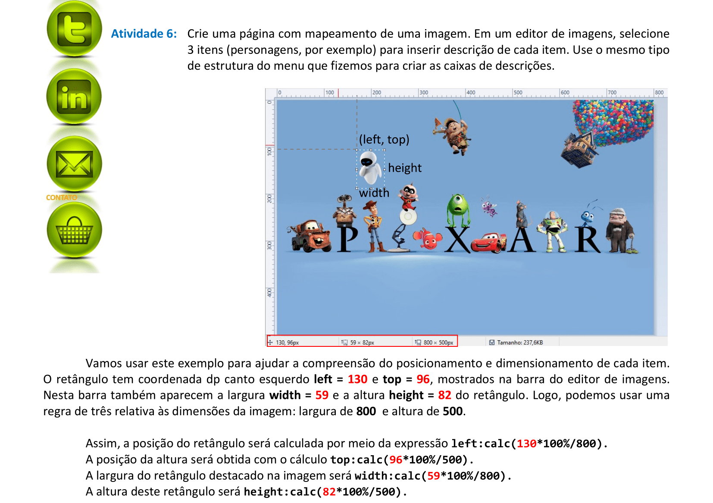
	

&#x1f4c3; Detalhes da Atividade

	
Crie a pasta <code>webdesign/atividade6</code> com o arquivo <code>index.htm</code>. Nesta atividade, podemos usar as estruturas dos exemplos anteriores para fazer o mapeamento de 3 personagens em uma imagem. Crie a pasta das imagens <code>webdesign/atividade6/imagens</code>.

	  <ul class="slider">
		  <li>
			   <input type="radio" id="slide208" name="slide">
			   <label for="slide208"></label>
			   
			   <figcaption>Podemos criar a div "mãe" <code>class="Map"</code> que contém a imagem <code>&lt;img&gt;</code> dos personagens e as <code>div</code> de cada personagem que será mapeado. A div <code>class="items"</code> agrupa as div dos personagens.</figcaption>
		   </li>
		   <li>
			   <input type="radio" id="slide209" name="slide">
			   <label for="slide209"></label>
			   
			   <figcaption>Usando a programação CSS dos exemplos anteriores, podemos abrir a tag de parágrafo <code>&lt;p&gt;</code> que abriga o nome, uma imagem e uma breve descrição do personagem. A classe desta div será <code>class="i1"</code>.</figcaption>
		   </li>
		   <li>
			   <input type="radio" id="slide210" name="slide">
			   <label for="slide210"></label>
			   
			   <figcaption>Os outros personagens têm a estrutura HTML igual: nome, imagem e descrição.</figcaption>
		   </li>
		   <li>
			   <input type="radio" id="slide211" name="slide">
			   <label for="slide211"></label>
			   
			   <figcaption>Na programação CSS, definimos os atributos mais gerais, com a classe <code>.Map</code> com imagens de largura 70%, parágrafos sem margens e os itens escondidos, com o atributo <code>visibility:hidden;</code>.</figcaption>
		   </li>
		   <li>
			   <input type="radio" id="slide212" name="slide">
			   <label for="slide212"></label>
			   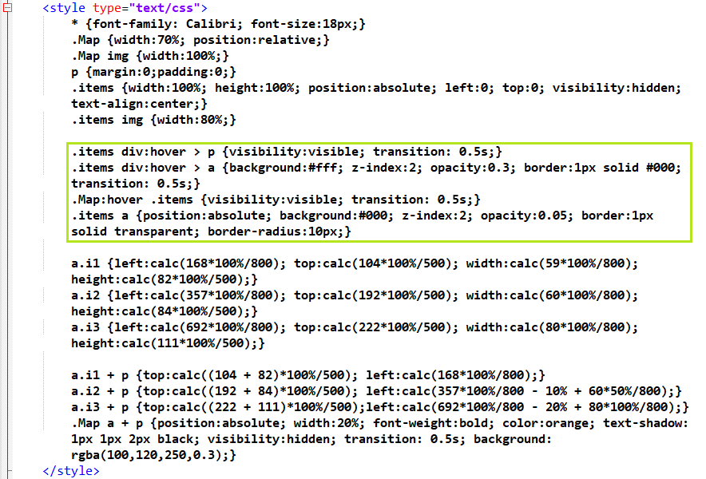
			   <figcaption>Ao ativar os itens com o cursor do mouse sobre cada um deles <code>items div:hover</code>, definimos que os itens serão visíveis, com bordas e opacidade de um fundo sobre cada parte do item, e o texto visível com atributo <code>visibility:visible;</code></figcaption>
		   </li>
		   <li>
			   <input type="radio" id="slide213" name="slide">
			   <label for="slide213"></label>
			   
			   <figcaption>Em um editor de imagens, pegue as coordenadas <b>top</b>, <b>left</b>, <b>width</b> e <b>height</b> do mapeamento de cada personagem. Com estas coordenadas, calculamos as posições dos retângulos com as regras de três mostradas, relativas à largura e à altura da imagem de todos os personagens.</figcaption>
		   </li>
		   <li>
			   <input type="radio" id="slide213a" name="slide">
			   <label for="slide213a"></label>
			   
			   <figcaption>Neste exemplo, as medidas para o mapeamento do primeiro personagem são: <b>top=104</b>, <b>left=168</b>, <b>width=59</b>, <b>height=82</b>, e as dimensões da imagem dos personagens é <b>width=800</b> e <b>height=500</b>.</figcaption>
		   </li>
		   <li>
			   <input type="radio" id="slide214" name="slide">
			   <label for="slide214"></label>
			   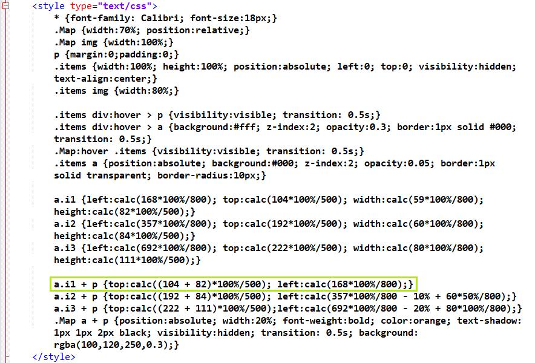
			   <figcaption>Se você quiser deixar o texto alinhado à esquerda, basta usar a mesma medida à esquerda do retângulo <code>left:calc(168*100%/800);</code>. O atributo <b>top</b> do texto é definido pelo atributo <b>top</b> do retângulo (104) somado com a altura do retângulo (82). Logo, o cálculo fica: <code>top:calc((104 + 82)*100%/500);</code>.</figcaption>
		   </li>
		   <li>
			   <input type="radio" id="slide215" name="slide">
			   <label for="slide215"></label>
			   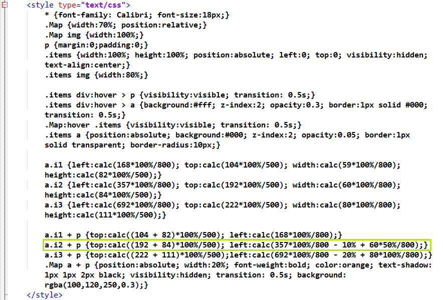
			   <figcaption>A posição vertical <b>top</b> pode ser calculada da mesma forma para todos os mapeamentos. Neste exemplo, estamos usando a largura dos textos como 20%. Logo, se você quiser deixar o texto centralizado, basta subtrair a metade da largura (10%) e somar com a metade do tamanho do retângulo (no caso do segundo personagem mede 60) proporcional a 50% do retângulo.</figcaption>
		   </li>
		   <li>
			   <input type="radio" id="slide215a" name="slide">
			   <label for="slide215a"></label>
			   
			   <figcaption>Portanto, para ficar centralizado com o retângulo, o texto do segundo personagem usamos <code>left:calc(357*100%/800 - 10% + 60*50%/800);</code>.</figcaption>
		   </li>
		   <li>
			   <input type="radio" id="slide216" name="slide">
			   <label for="slide216"></label>
			   
			   <figcaption>Como exemplo, se você quiser alinhar o texto à direita, basta subtrair a largura do texto de 20% e somar com o tamanho proporcional da largura do retângulo. Logo, o alinhamento à direita do terceiro personagem fica: <code>left:calc(692*100%/800 - 20% + 80*100%/800);</code>.</figcaption>
		   </li>
		   <li>
			   <input type="radio" id="slide217" name="slide">
			   <label for="slide217"></label>
			   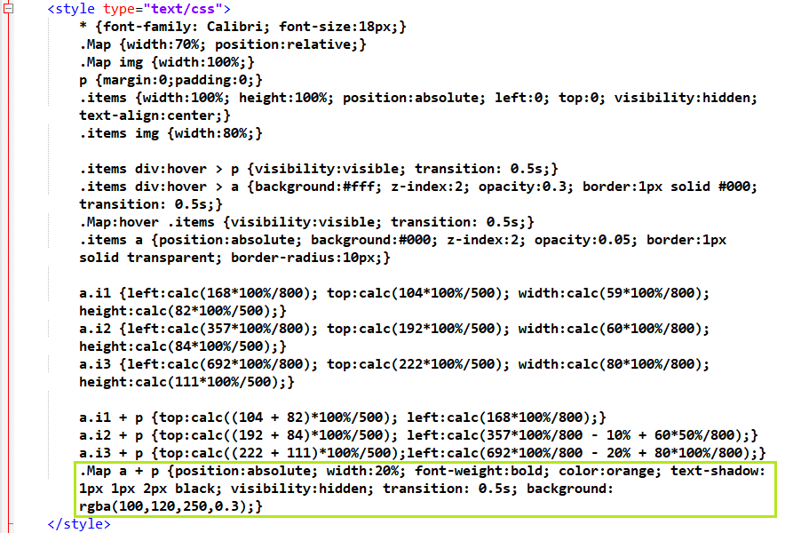
			   <figcaption>Para finalizar, os textos aparecem com a largura <code>width:20%;</code>, e devemos deixá-los escondidos com <code>visibility:hidden;</code>.</figcaption>
		   </li>
		   <li>
			   <input type="radio" id="slide218" name="slide">
			   <label for="slide218"></label>
			   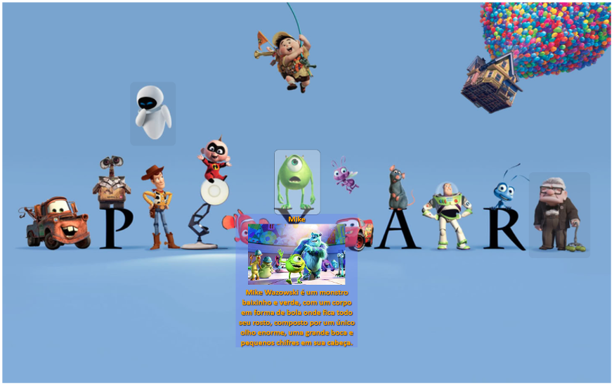
			   <figcaption>O layout desta Atividade, com os atributos mostrados fica desta forma. Modifique atributos e escolha um dos alinhamentos de texto mostrados para fazer sua atividade.</figcaption>
		   </li>
		</ul>
		
  

	
<a href="#css2" class="topo">voltar ao topo</a>

CSS e Animações: pág. 28-37

	
	
<a href="#css3" class="topo">voltar ao topo</a>

	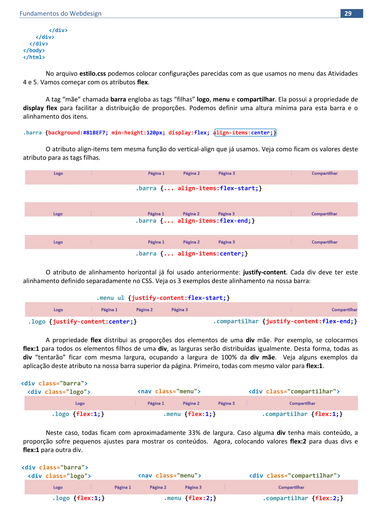
	
<a href="#css3" class="topo">voltar ao topo</a>

	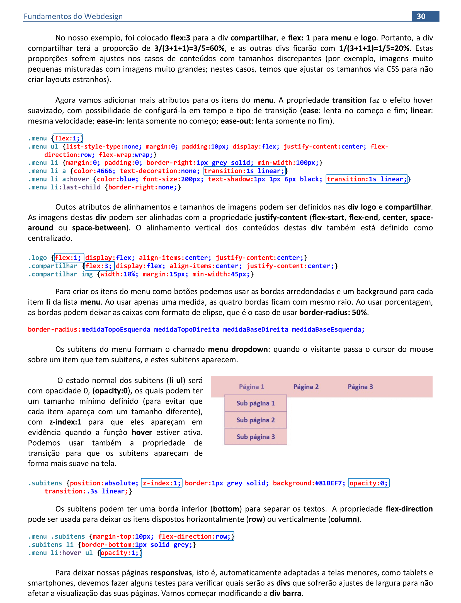
	
<a href="#css3" class="topo">voltar ao topo</a>

	
	

&#x1f4c3; Atividade 7: Menu superior

	
Crie a pasta <code>webdesign/atividade7</code> com os arquivos <code>index.htm</code> e <code>estilo.css</code>. Nesta atividade, podemos usar a estrutura que usamos nos exemplos anteriores para fazer o menu. Crie a pasta das imagens <code>webdesign/atividade7/imagens</code>. Vamos criar um site com páginas sobre filmes nesta atividade. Escolha arquivos de imagens sobre seu filme favorito. A logomarca terá efeito de animação com rotação, e deve ser uma imagem de fundo transparente e com formato redondo. <a href="css3/icone_filme.png" download>Neste link</a> pode pode baixar a imagem da logomarca usada nesta atividade.

	  <ul class="slider">
		  <li>
			   <input type="radio" id="slide219" name="slide">
			   <label for="slide219"></label>
			   
			   <figcaption>No cabeçalho da página, colocamos a referência da folha de estilos com a tag <code>&lt;link&gt;</code>. Se salvarmos o arquivo <code>estilo.css</code> na mesma pasta do <code>index.htm</code>, o caminho fica como <code>href="estilo.css"</code>.</figcaption>
		   </li>
		   <li>
			   <input type="radio" id="slide220" name="slide">
			   <label for="slide220"></label>
			   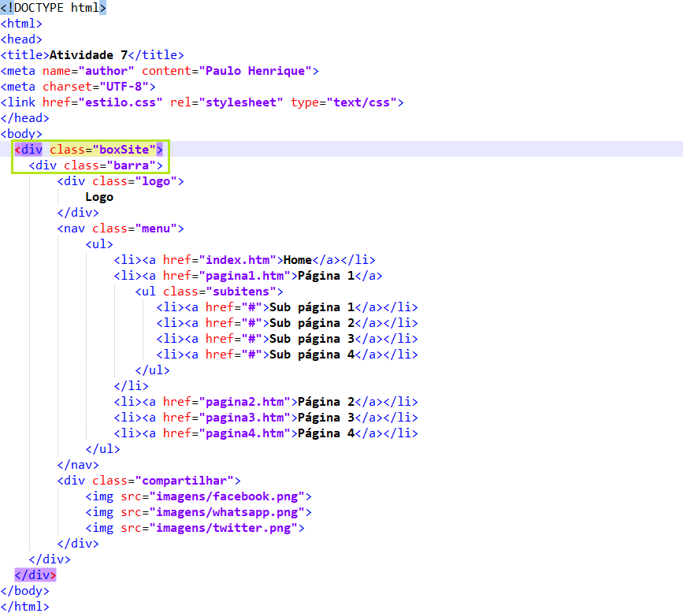
			   <figcaption>A tag "mãe" do site é a <code>class="boxSite"</code>, que contém todas as outras <b>div</b>. A primeira div será chamada de <code>class="barra"</code>, que contém a logomarca, o menu e os itens para compartilhar a página.</figcaption>
		   </li>
		   <li>
			   <input type="radio" id="slide221" name="slide">
			   <label for="slide221"></label>
			   
			   <figcaption>Na div <code>class="logo"</code>, podemos colocar uma imagem ou um <a href="http://www.degraf.ufpr.br/docentes/paulo/webdesign/pictograph.html" target="_blank">pictograma</a>.</figcaption>
		   </li>
		   <li>
			   <input type="radio" id="slide222" name="slide">
			   <label for="slide222"></label>
			   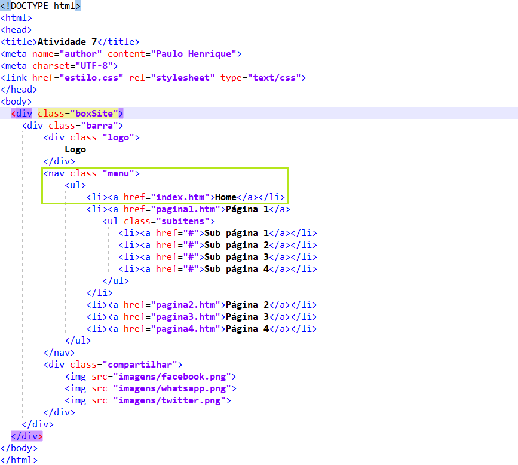
			   <figcaption>A <code>class="menu"</code> contém uma lista, bem parecida com as que já usamos em outras páginas.</figcaption>
		   </li>
		   <li>
			   <input type="radio" id="slide223" name="slide">
			   <label for="slide223"></label>
			   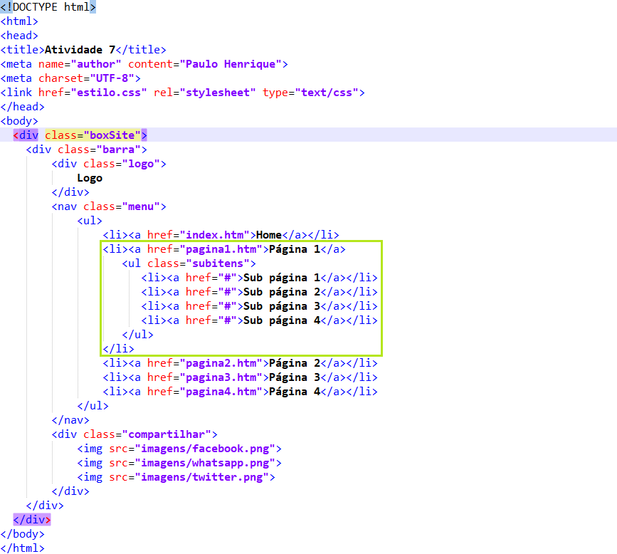
			   <figcaption>Como exemplo, vamos criar um menu chamado "dropdown": é aquele que tem subitens. Basta criar uma lista com tag <code>&lt;ul&gt;</code> logo abaixo do item do menu que tem a sublista. Neste exemplo, criamos a lista <code>&lt;ul class="subitens"&gt;</code> logo abaixo do item <code>href="pagina1.htm"</code>. Note que o fechamento deste item é feito depois do fechamento dos subitens.</figcaption>
		   </li>
		   <li>
			   <input type="radio" id="slide224" name="slide">
			   <label for="slide224"></label>
			   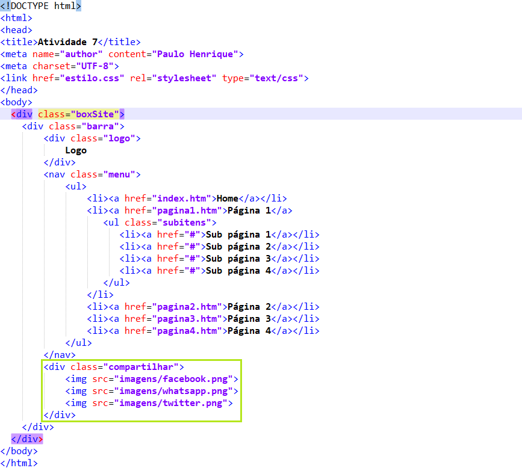
			   <figcaption>Finalizando a nossa barra de menu, colocamos as imagens de compartilhamento. Os links podem ser colocados como fizemos nas Atividades 4 e 5.</figcaption>
		   </li>
		   <li>
			   <input type="radio" id="slide225" name="slide">
			   <label for="slide225"></label>
			   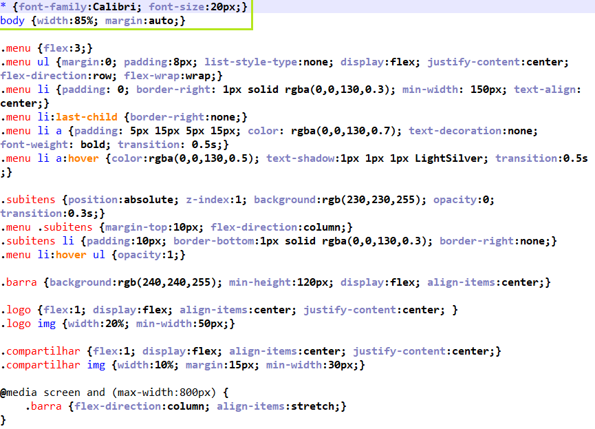
			   <figcaption>No arquivo <code>estilo.css</code>, podemos usar o marcador <b>*</b> para definir uma propriedade que vale para todas as tags da página: tipos e tamanhos de fonte, cores e margens. O atributo <code>margin:auto;</code> serve para deixar o conteúdo centralizado nos navegadores.</figcaption>
		   </li>
		   <li>
			   <input type="radio" id="slide226" name="slide">
			   <label for="slide226"></label>
			   
			   <figcaption>A estrutura CSS do menu é praticamente a mesma que usamos anteriormente. Modifique cores, margens e bordas. Neste exemplo, estamos usando o menu com a borda direita, parecido com aquele que mostramos nas Atividades 4 e 5.</figcaption>
		   </li>
		   <li>
			   <input type="radio" id="slide227" name="slide">
			   <label for="slide227"></label>
			   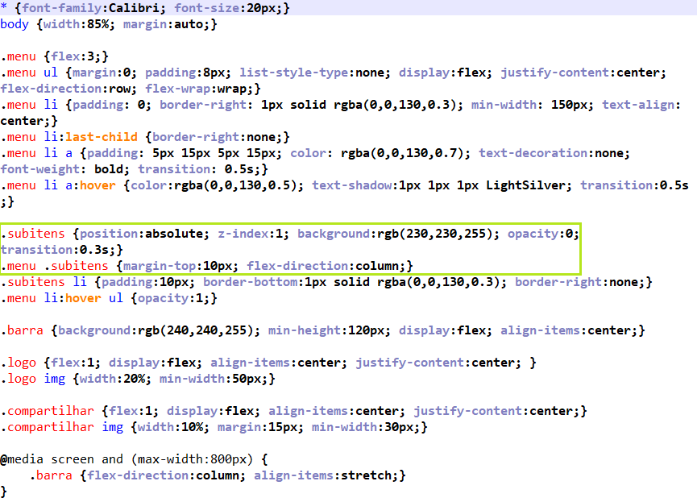
			   <figcaption>Os subitens ficam escondidos <code>opacity:0;</code>, e quando ativados têm a posição absoluta na tela. Colocamos <code>z-index:1;</code> para ter certeza de que aparecerão na frente dos outros elementos da página. O menu dropdown pode ser mostrado em linha ou em coluna. Neste caso, ficará em coluna com o atributo <code>flex-direction:column;</code>.</figcaption>
		   </li>
		   <li>
			   <input type="radio" id="slide228" name="slide">
			   <label for="slide228"></label>
			   
			   <figcaption>Ao passar o cursor do mouse sobre o item do menu que tem subitem, a opacidade da lista dos subitens tem valor modificado para 1 com o atributo <code>.menu li:hover ul {opacity:1;}</code>. Foram colocadas bordas inferiores para separar os subitens. Teste estas propriedades no layout de sua página.</figcaption>
		   </li>
		   <li>
			   <input type="radio" id="slide229" name="slide">
			   <label for="slide229"></label>
			   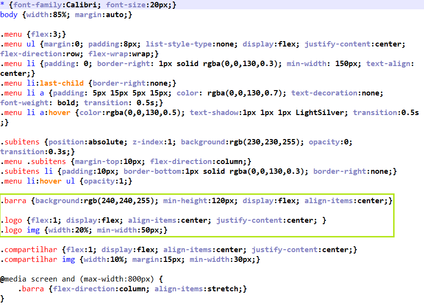
			   <figcaption>Foram colocados atributos de fundo gradiente e alinhamento centralizado para os itens das classes <code>.barra</code> e <code>.logo</code>. Teste valores para dimensionar a imagem da logomarca em <code>.logo img</code>.</figcaption>
		   </li>
		   <li>
			   <input type="radio" id="slide230" name="slide">
			   <label for="slide230"></label>
			   
			   <figcaption>Nos links de compartilhamento, usamos atributos parecidos com os que usamos em páginas anteriores. Teste valores para dimensionar as imagens dos ícones de sua página. Em telas menores, a barra terá os itens dispostos em coluna <code>flex-direction:column;</code></figcaption>
		   </li>
		   <li>
			   <input type="radio" id="slide231" name="slide">
			   <label for="slide231"></label>
			   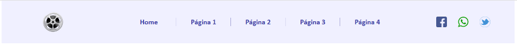
			   <figcaption>Usando os atributos mostrados, o layout da barra de menu fica desta maneira. Configure a sua barra testando as melhores medidas e cores.</figcaption>
		   </li>
		</ul>
		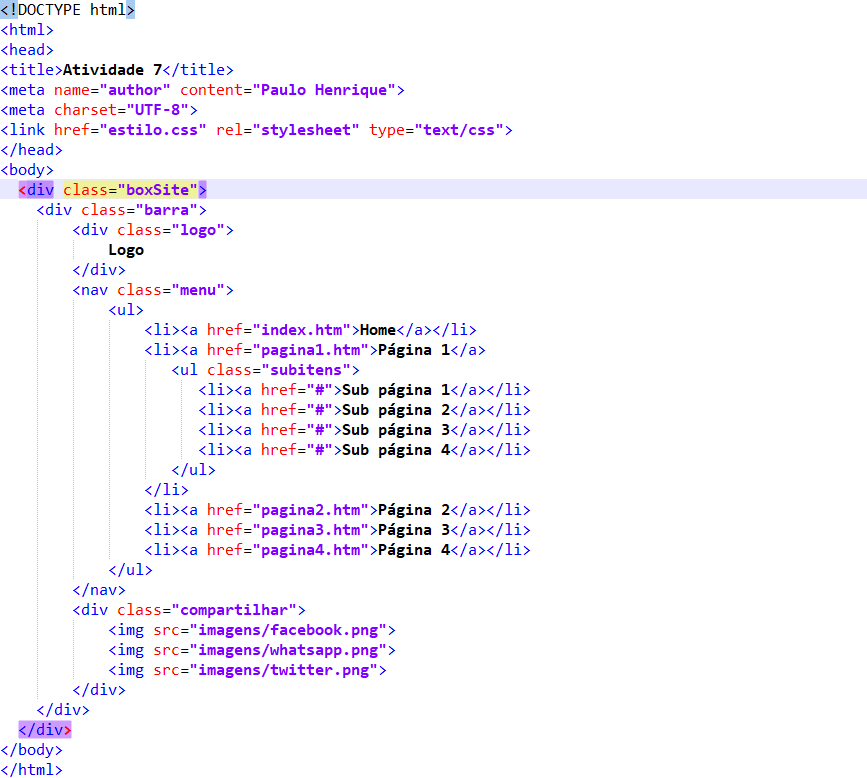
  

	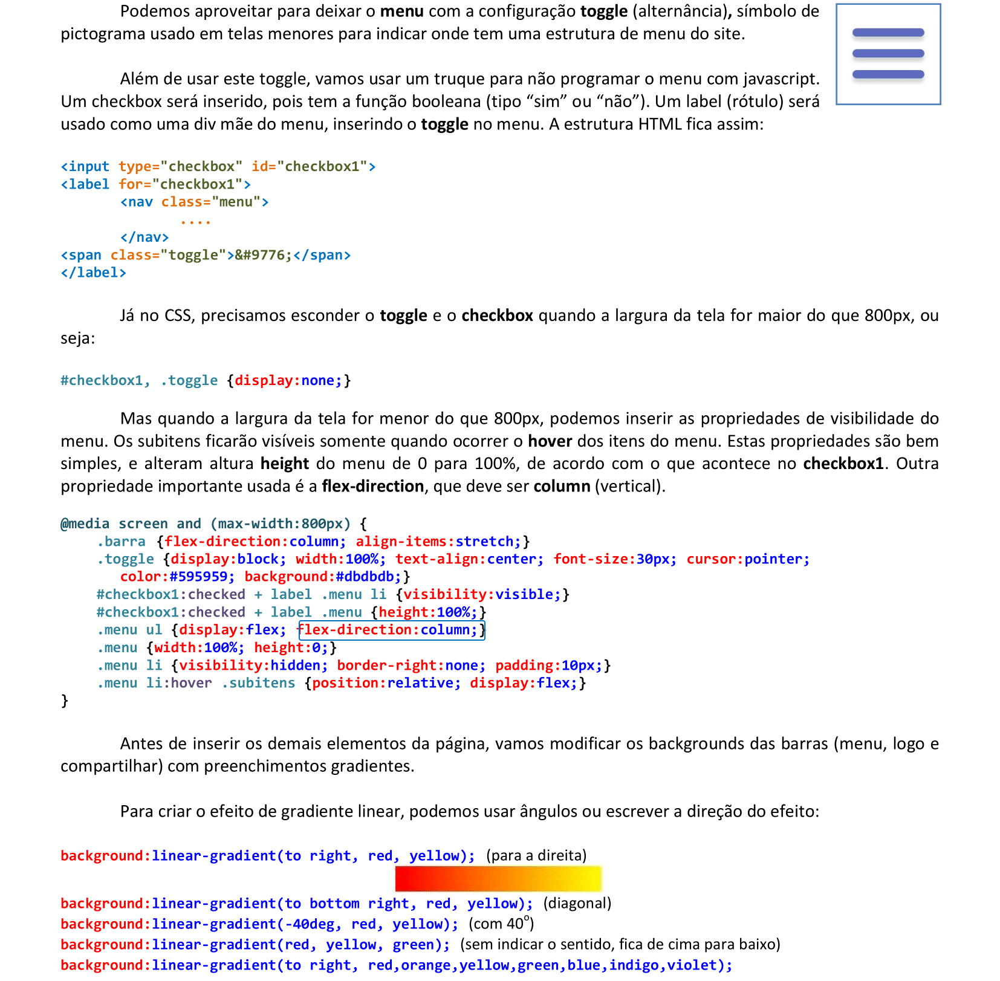
	
<a href="#css3" class="topo">voltar ao topo</a>

	
	
<a href="#css3" class="topo">voltar ao topo</a>

	
	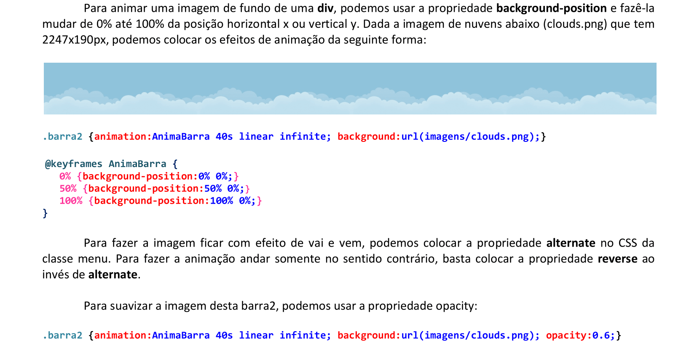
	

&#x1f4c3; Atividade 7: backgrounds e animações

	
Neste ponto, podemos criar animações nos itens que já estão programados. A imagem com um filme está disponível no link: <a href="css3/filme.png" download>filme</a>; e a imagem de nuvens, mostrada na apostila, está disponível no link: <a href="css3/clouds.png" download>nuvens</a>. Se você quiser encontrar outra imagem para colocar na barra superior da página, lembre-se que deve ser uma imagem bem larga, com altura reduzida.

	  <ul class="slider">
		  <li>
			   <input type="radio" id="slide232" name="slide">
			   <label for="slide232"></label>
			   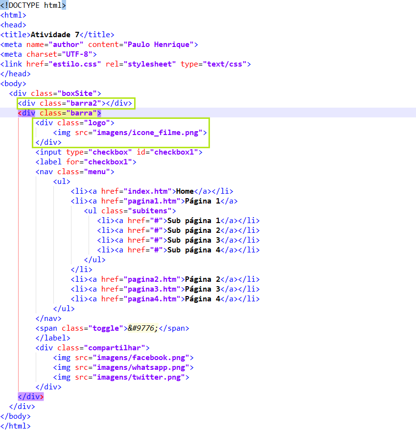
			   <figcaption>Criando a <code>class="barra2"</code>, podemos definir um fundo desta tag. Ela pode ser colocada antes ou depois da <code>class="barra"</code>. Dentro da <code>class="logo"</code>, podemos inserir uma imagem ou <a href="http://www.degraf.ufpr.br/docentes/paulo/webdesign/pictograph.html" target="_blank">pictograma</a> como logomarca da página.</figcaption>
		   </li>
		   <li>
			   <input type="radio" id="slide233" name="slide">
			   <label for="slide233"></label>
			   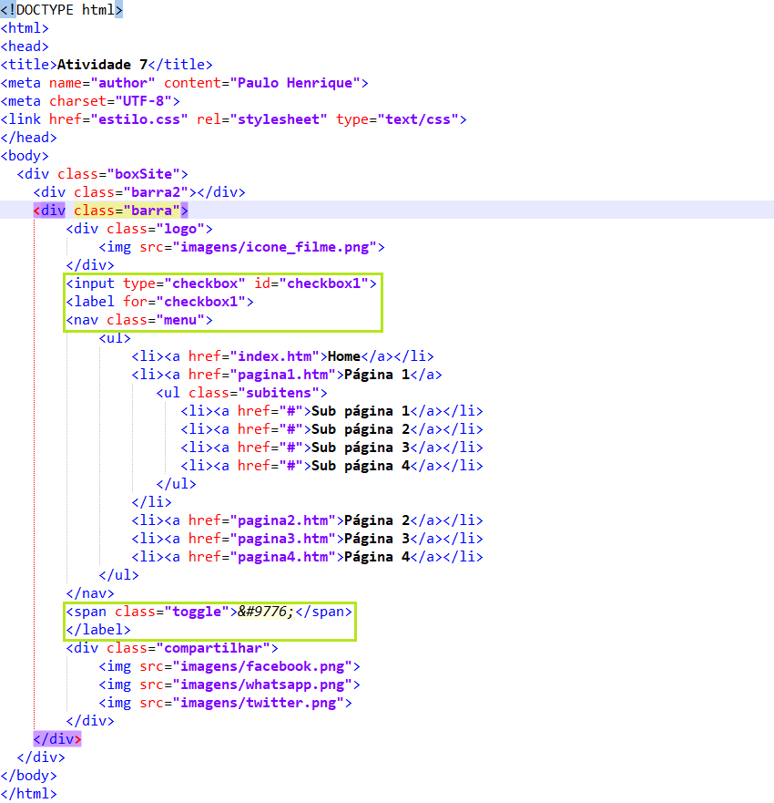
			   <figcaption>A estrutura do <b>toggle</b> deve ser colocada englobando a tag de menu. O <b>checkbox</b> fica antes da tag <code>&lt;label&gt;</code>, inserindo o <b>toggle</b> junto com o menu nesta tag de rótulo.</figcaption>
		   </li>
		   <li>
			   <input type="radio" id="slide234" name="slide">
			   <label for="slide234"></label>
			   
			   <figcaption>Na continuação do arquivo CSS, temos os atributos para esconder o <b>checkbox</b> e o <b>toggle</b> do menu. Eles só aparecem em navegadores com largura menor do que 800px. Redimensione o seu navegador para testar estes atributos.</figcaption>
		   </li>
		   <li>
			   <input type="radio" id="slide235" name="slide">
			   <label for="slide235"></label>
			   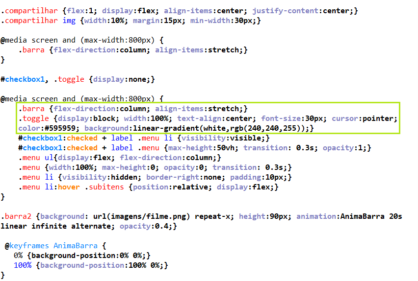
			   <figcaption>Usando os atributos de <code>@media screen</code> com largura menor do que 800px, definimos que a tag <code>.barra</code> será mostrada com itens na vertical, e o <b>toggle</b> ficará visível. Neste caso, podemos atribuir propriedades para os itens visíveis (cor, tamanho, margem,...).</figcaption>
		   </li>
		   <li>
			   <input type="radio" id="slide236" name="slide">
			   <label for="slide236"></label>
			   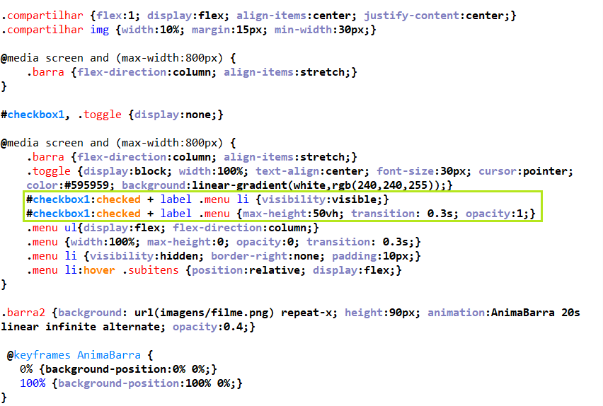
			   <figcaption>Neste ponto está definido o critério para o menu e o toggle aparecerem: <code>#checkbox1:checked</code>, ou seja, quando o visitante clicar no menu. Definimos também qual será a altura máxima do menu: <code>max-height:50vh;</code>, ou seja, metade da altura do navegador.</figcaption>
		   </li>
		   <li>
			   <input type="radio" id="slide237" name="slide">
			   <label for="slide237"></label>
			   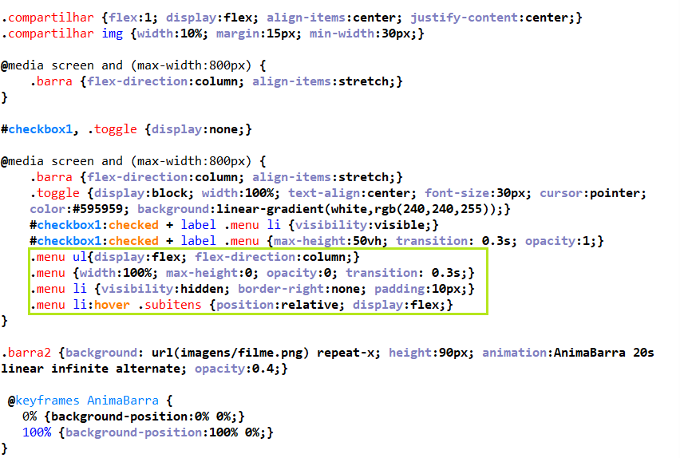
			   <figcaption>No caso do <b>checkbox</b> não estar ativado, o menu terá a altura máxima como 0. Os itens estão com atributos escondidos <code>hidden</code>, em formato vertical (coluna).</figcaption>
		   </li>
		   <li>
			   <input type="radio" id="slide238" name="slide">
			   <label for="slide238"></label>
			   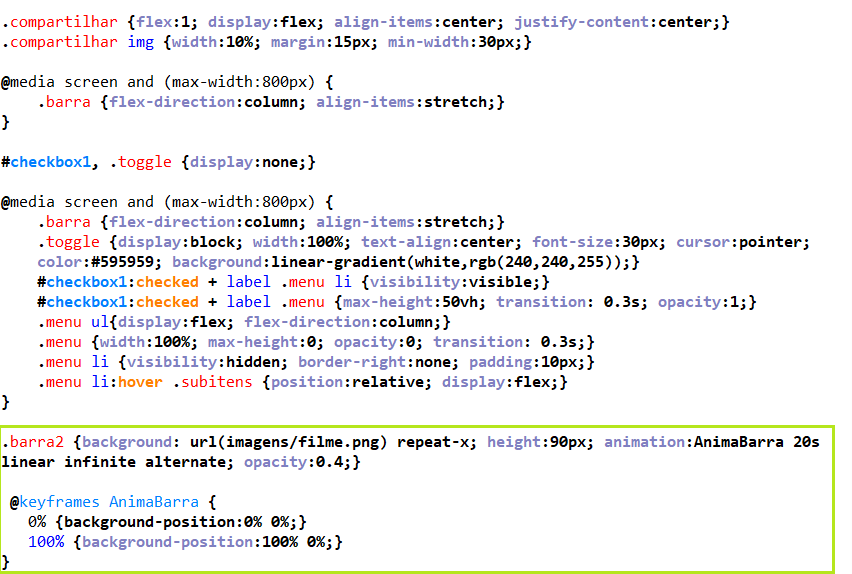
			   <figcaption>A classe <code>.barra2</code> está com a imagem de fundo definida, com repetição na horizontal <code>repeat-x</code>, com a altura igual à altura da imagem de 90px. A animação de deslocamento do fundo começa na posição 0% 0% e termina em 100% 0%. Modifique os valores, caso necessário, e escolha uma imagem para ficar no fundo desta tag.</figcaption>
		   </li>
		   <li>
			   <input type="radio" id="slide239" name="slide">
			   <label for="slide239"></label>
			   
			   <figcaption>Com todos os atributos mostrados até agora, o layout com as duas barras superiores fica desta maneira. O fundo da tag do menu foi modificado usando o atributo <code>linear-gradient</code>.</figcaption>
		   </li>
		</ul>
		
  

	
	
<a href="#css3" class="topo">voltar ao topo</a>

	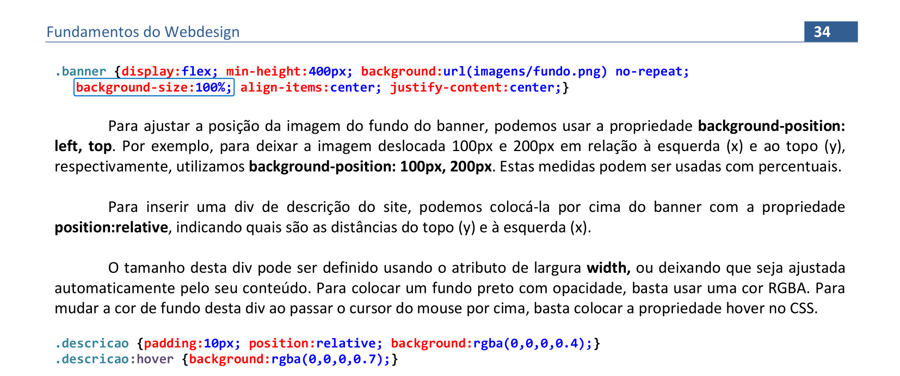
	

&#x1f4c3; Atividade 7: banner e descrição

	
Neste ponto, podemos criar o banner e uma logo para colocar flutuando sobre o banner. Escolha uma imagem com boa resolução para ficar no banner, e uma logo do filme.

	  <ul class="slider">
		  <li>
			   <input type="radio" id="slide240" name="slide">
			   <label for="slide240"></label>
			   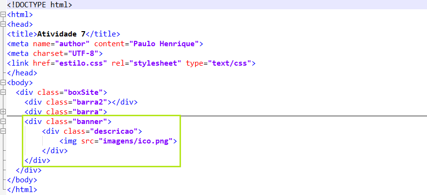
			   <figcaption>A tag <code>class="banner"</code> pode ser inserida logo após a tag <code>class="barra"</code>. Dentro desta tag, criamos a tag filha <code>class="descricao"</code> para criarmos uma logo flutuante sobre o banner.</figcaption>
		   </li>
		   <li>
			   <input type="radio" id="slide241" name="slide">
			   <label for="slide241"></label>
			   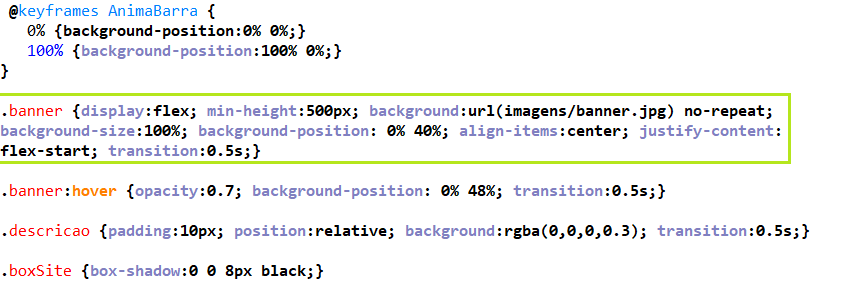
			   <figcaption>Na continuação do arquivo CSS, temos os atributos da classe <code>.banner</code>, com o background que você escolheu (sem repetição), com as propriedades para cobrir a largura da tag. O alinhamento da tag <code>.descricao</code> ficará à esquerda pois <code>flex-direction:flex-start;</code>. Se você quiser colocá-la centralizada no banner, basta mudar para <code>center</code> ou à direita ficaria <code>flex-end</code>.</figcaption>
		   </li>
		   <li>
			   <input type="radio" id="slide242" name="slide">
			   <label for="slide242"></label>
			   
			   <figcaption>Quando o visitante passar o cursor do mouse sobre o banner, ele sofre um deslocamento na vertical: vai para a coordenada 0% 48%. Note que colocamos o efeito <b>transition</b> nesta tag e na tag do banner sem hover. Assim, o efeito é suavidado tanto no momento de passar o cursor quanto de retirar o cursor de cima do banner.</figcaption>
		   </li>
		   <li>
			   <input type="radio" id="slide243" name="slide">
			   <label for="slide243"></label>
			   
			   <figcaption>A tag filha <code>.descricao</code> fica com posição relativa, com fundo com transparência usada na cor RGBA. Defina margem interna para que a imagem não fique "grudada" nos cantos.</figcaption>
		   </li>
		   <li>
			   <input type="radio" id="slide244" name="slide">
			   <label for="slide244"></label>
			   
			   <figcaption>Para dar um efeito de profundidade, podemos colocar uma sombra na tag mãe das páginas usando o atributo <code>box-shadow</code>.</figcaption>
		   </li>
		   <li>
			   <input type="radio" id="slide245" name="slide">
			   <label for="slide245"></label>
			   
			   <figcaption>Com os valores dos atributos mostrados até agora, o site fica com este layout. Modifique os valores para a página do seu filme.</figcaption>
		   </li>
		</ul>
		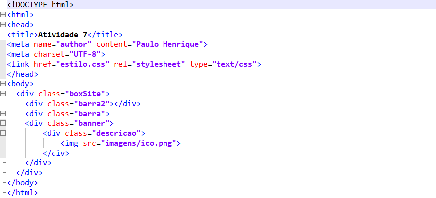
  

  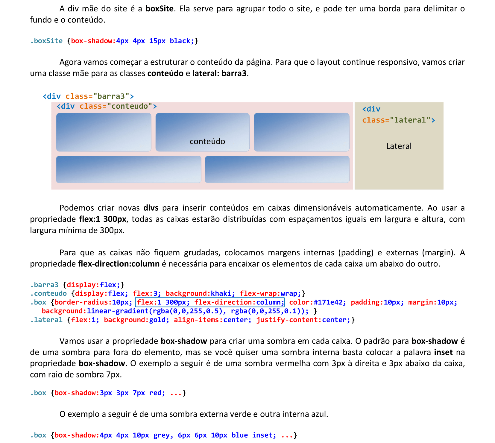
	
<a href="#css3" class="topo">voltar ao topo</a>

	
	

&#x1f4c3; Atividade 7: conteúdos, fontes e rodapé

	
Neste ponto, podemos criar conteúdos em duas barras: uma principal e outra lateral. Escolha imagens do filme para ficarem como uma espécie de galeria. Outras imagens podem ser colocadas na barra lateral, com alguns personagens formando outra galeria.

	  <ul class="slider">
		  <li>
			   <input type="radio" id="slide246" name="slide">
			   <label for="slide246"></label>
			   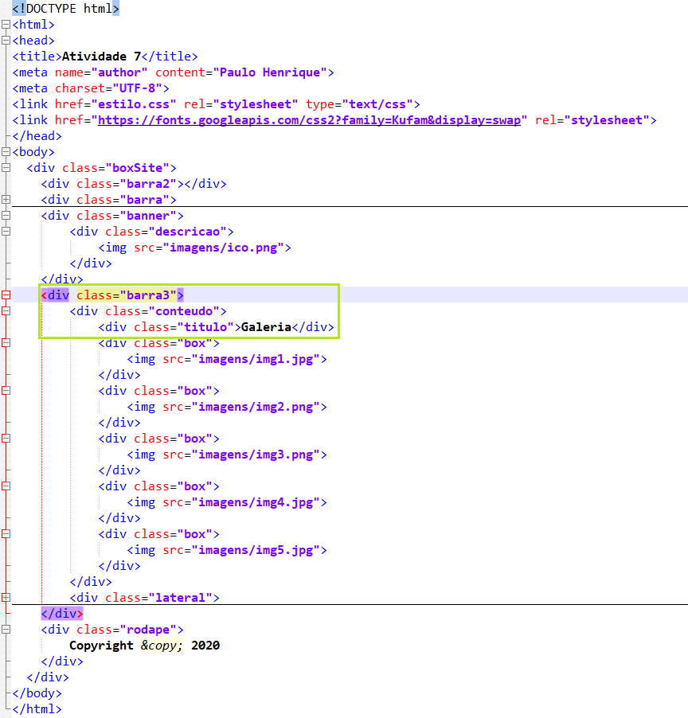
			   <figcaption>A tag <code>class="barra3"</code> pode ser inserida logo após a tag <code>class="banner"</code>. Dentro desta tag, criamos as tags filhas <code>class="conteudo"</code> e <code>class="box"</code> que contém as imagens do filme. Colocamos também uma tag <code>class="titulo"</code> para usar nesta barra.</figcaption>
		   </li>
		   <li>
			   <input type="radio" id="slide247" name="slide">
			   <label for="slide247"></label>
			   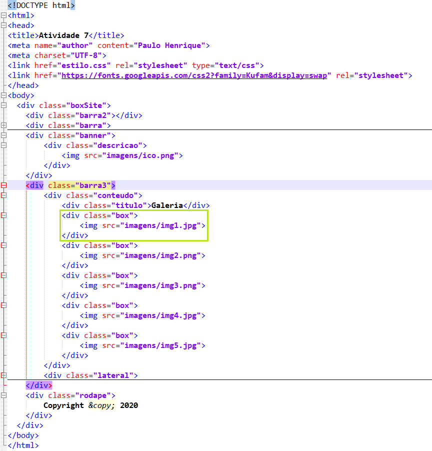
			   <figcaption>Escolha pelo menos 5 imagens para colocar nas tags <code>class="box"</code> dentro da tag de <code>class="conteudo"</code>.</figcaption>
		   </li>
		   <li>
			   <input type="radio" id="slide248" name="slide">
			   <label for="slide248"></label>
			   
			   <figcaption>A tag <code>class="lateral"</code> tem mesma estrutura da tag <code>class="conteudo"</code>: título e as tags <code>class="box"</code> com as imagens. Escolha pelo menos 5 personagens para colocar nesta barra lateral.</figcaption>
		   </li>
		   <li>
			   <input type="radio" id="slide249" name="slide">
			   <label for="slide249"></label>
			   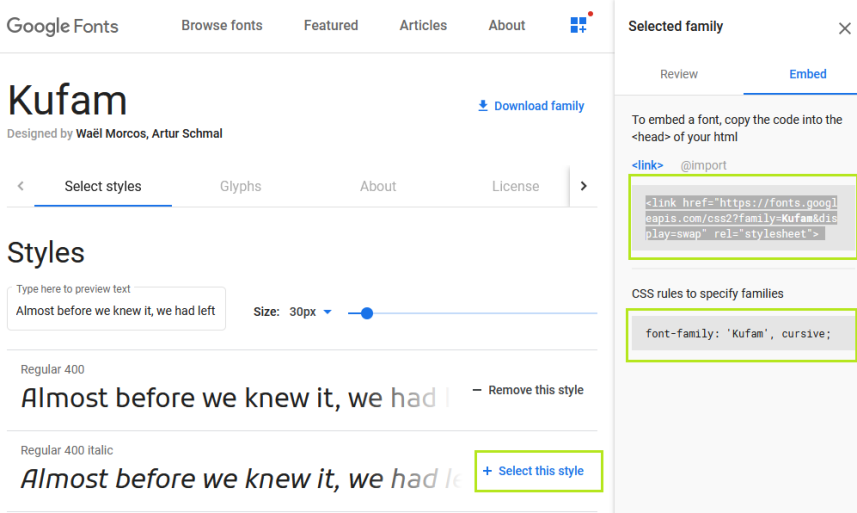
			   <figcaption>Podemos colocar as fontes online em nossas páginas. Acesse o site <a href="https://fonts.google.com/" target="_blank">fonts.google.com/</a>, escolha uma fonte e clique em <b>Select this style</b>. Você pode escolher mais de uma fonte. Note que as fontes escolhidas aparecem ao lado, com os links prontos para colocarmos no HTML e no CSS.</figcaption>
		   </li>
		   <li>
			   <input type="radio" id="slide249a" name="slide">
			   <label for="slide249a"></label>
			   
			   <figcaption>No cabeçalho da página em HTML colocamos o link das fontes escolhidas. Neste caso, eu escolhi a fonte <b>Kufam</b>, que será colocada naquela tag principal do CSS, que usamos com <b>*</b> no começo da Atividade 7.</figcaption>
		   </li>
		   <li>
			   <input type="radio" id="slide250" name="slide">
			   <label for="slide250"></label>
			   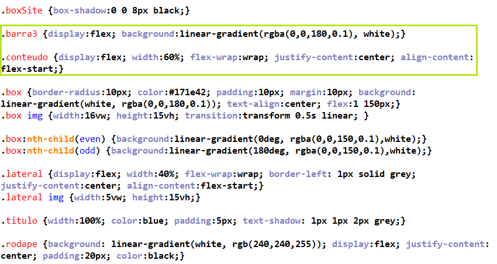
			   <figcaption>Na continuação do nosso arquivo CSS, colocamos os atributos da classe <code>.barra3</code> com display flexbox e fundo com gradiente. Para alinhar os conteúdos na vertical, usamos o atributo <code>align-content:flex-start</code>, que tem a mesma função do <code>vertical-align</code> das tabelas.</figcaption>
		   </li>
		   <li>
			   <input type="radio" id="slide251" name="slide">
			   <label for="slide251"></label>
			   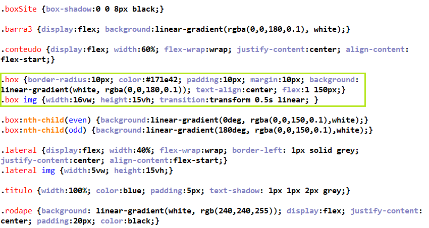
			   <figcaption>As caixas com conteúdos <code>.box</code> tem os atributos: bordas arredondadas, margens, fundo gradiente, alinhamento de texto e tamanhos iguais de no mínimo 150px <code>flex:1 150px</code>. As imagens destas caixas têm larguras e alturas ajustadas de acordo com as dimensões do navegador. Ajuste os valores para as imagens de sua página.</figcaption>
		   </li>
		   <li>
			   <input type="radio" id="slide252" name="slide">
			   <label for="slide252"></label>
			   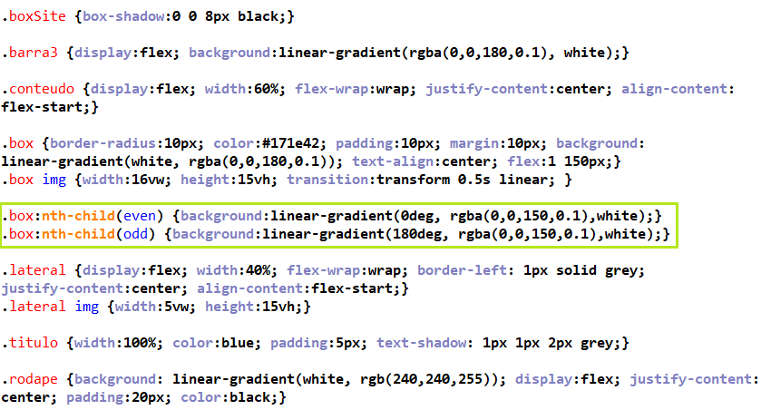
			   <figcaption>Nesta página, ao invés de usar a tabela "zebrada", podemos usar os box com este atributo. Os pares (even) ficam com um tipo de fundo gradiente, e os ímpares (odd) ficam com outro tipo.</figcaption>
		   </li>
		   <li>
			   <input type="radio" id="slide253" name="slide">
			   <label for="slide253"></label>
			   
			   <figcaption>Os ajustes da tag <code>.lateral</code> são similares às caixas, com alinhamentos horizontais centralizados e verticais no topo (flex-start). Ajuste os valores das dimensões das imagens de sua página. No caso desta página, as imagens tem largura bem menor do que a altura, pois mostram apenas 1 personagem cada.</figcaption>
		   </li>
		   <li>
			   <input type="radio" id="slide254" name="slide">
			   <label for="slide254"></label>
			   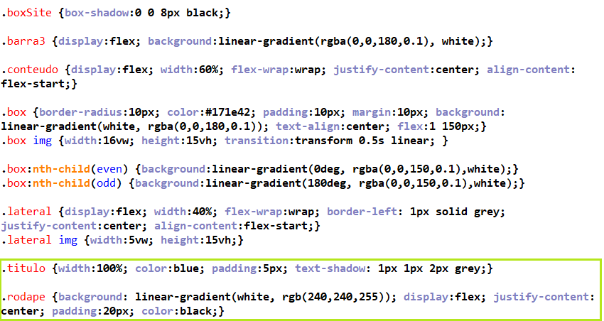
			   <figcaption>Os atributos dos títulos usam margens, cores e uma sombra de texto. O rodapé está com conteúdo centralizado, margem interna e fundo com gradiente.</figcaption>
		   </li>
		   <li>
			   <input type="radio" id="slide255" name="slide">
			   <label for="slide255"></label>
			   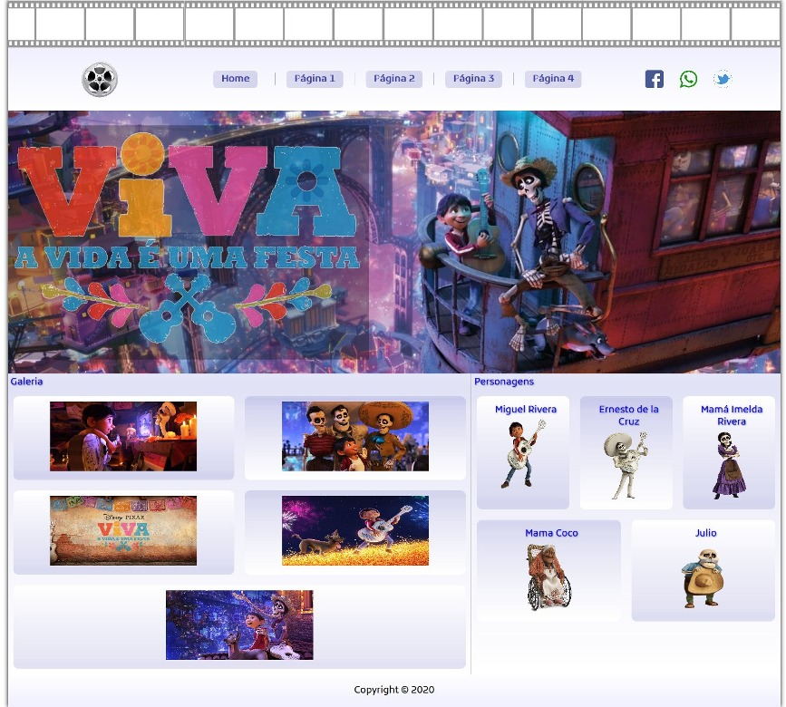
			   <figcaption>O layout da página fica com esta visualização usando os atributos definidos até o momento. Configure a sua página com as novas tags de imagens nas galerias criadas.</figcaption>
		   </li>
		</ul>
		
  

	
<a href="#css3" class="topo">voltar ao topo</a>

	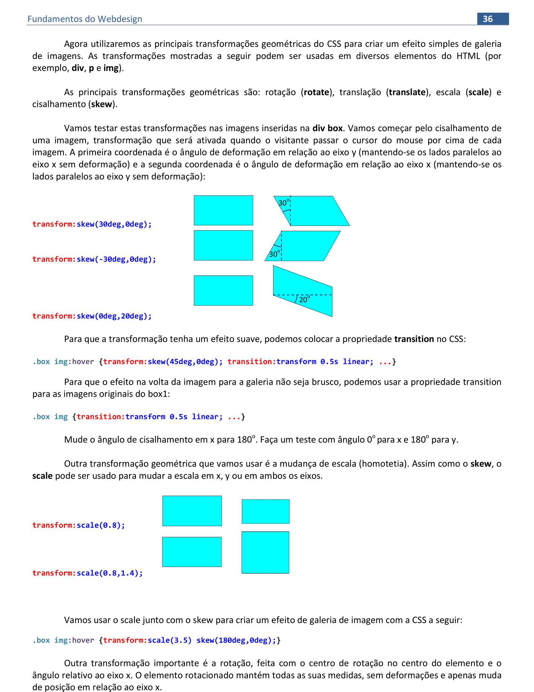
	
<a href="#css3" class="topo">voltar ao topo</a>

	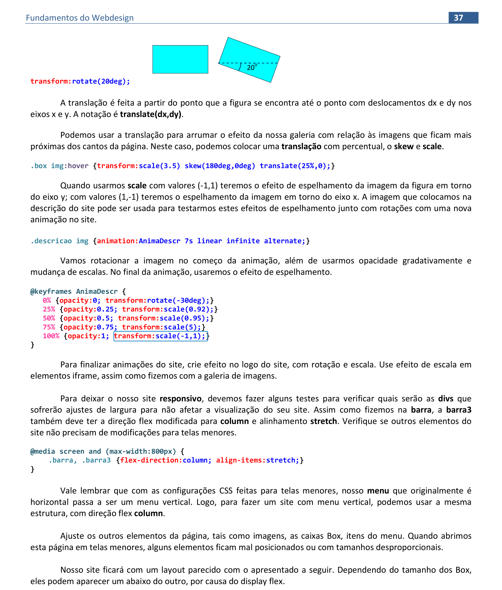
	
<a href="#css3" class="topo">voltar ao topo</a>

	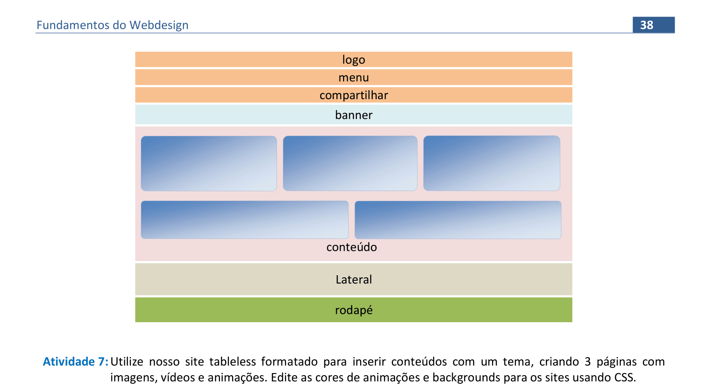
	

&#x1f4c3; Detalhes finais e animações

	
Vamos criar efeitos de galeria na nossa página de filmes. Coloque os nomes dos filmes nos itens do menu.

	  <ul class="slider">
		  <li>
			   <input type="radio" id="slide256" name="slide">
			   <label for="slide256"></label>
			   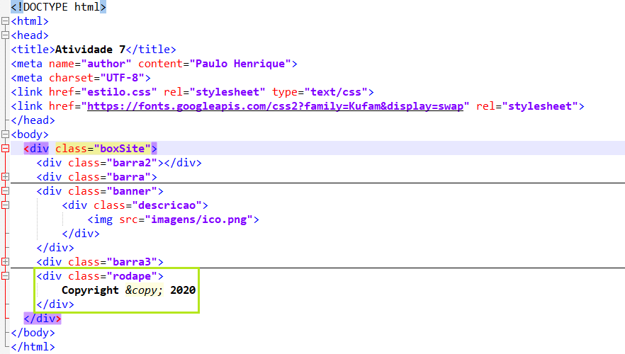
			   <figcaption>A estrutura final do HTML, com itens anteriores recolhidos, fica desta maneira: dentro de <code>boxSite</code> temos <code>barra2</code>,  <code>barra</code>, <code>banner</code>, <code>barra3</code> e <code>rodape</code>.</figcaption>
		   </li>
		   <li>
			   <input type="radio" id="slide257" name="slide">
			   <label for="slide257"></label>
			   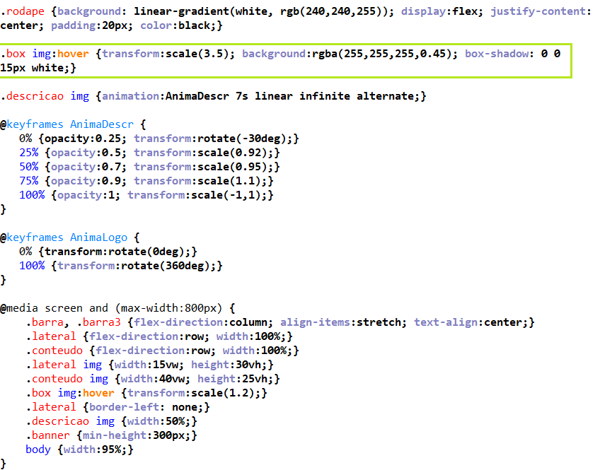
			   <figcaption>No CSS, podemos criar efeitos com transformações de escala, cisalhamento, rotação ou translação. Neste exemplo usamos uma escala com sombra nas imagens das tags <code>.box</code> quando passamos o cursor do mouse sobre as respectivas imagens.</figcaption>
		   </li>
		   <li>
			   <input type="radio" id="slide258" name="slide">
			   <label for="slide258"></label>
			   
			   <figcaption>Uma animação na logomarca de descrição do site que usa rotação e escalas está atribuída com nome <code>@keyframes AnimaDescr</code>. Dentro da tag <code>.descricao img</code> colocamos a duração de 7 segundo com alternância e duração constante.</figcaption>
		   </li>
		   <li>
			   <input type="radio" id="slide259" name="slide">
			   <label for="slide259"></label>
			   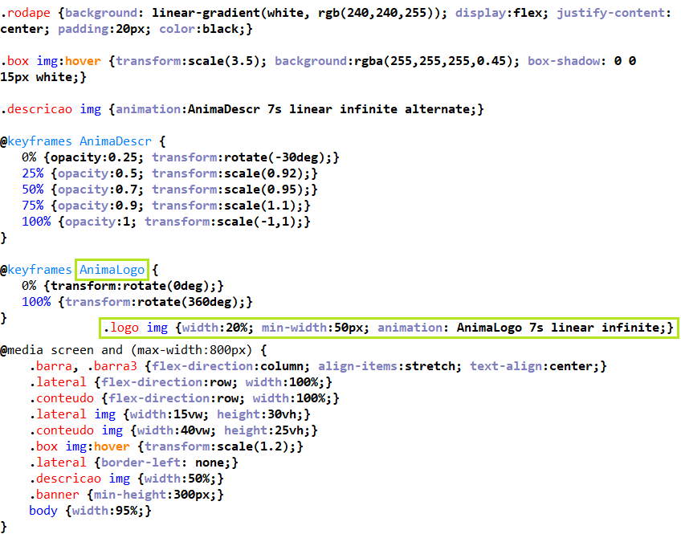
			   <figcaption>A logomarca de filme, com formato redondo é ótima para usarmos a rotação de 0 a 360o. Na tag <code>.logo img</code> colocamos o nome desta animação <code>AnimaLogo</code> com 7 segundos também. Ajuste valores e efeitos nas imagens de sua página.</figcaption>
		   </li>
		   <li>
			   <input type="radio" id="slide260" name="slide">
			   <label for="slide260"></label>
			   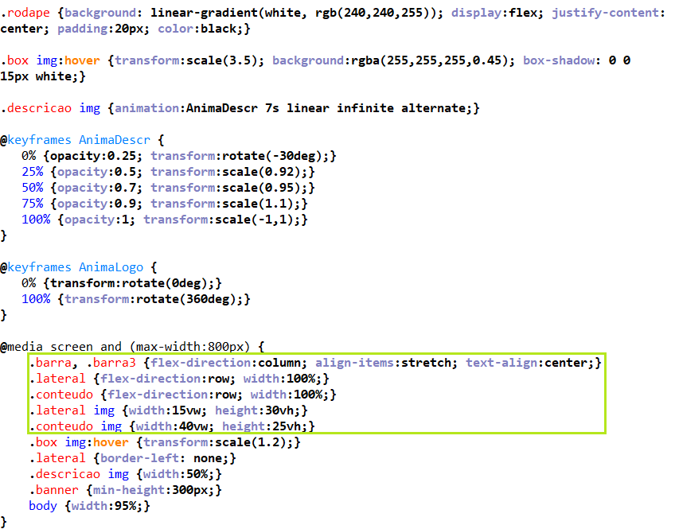
			   <figcaption>Em telas de larguras menores do que 800px, ajustamos as barras flexbox com visualização em coluna, larguras de 100% e alinhamentos centralizados. As imagens das barras de conteúdo e lateral também podem ser redimensionadas para telas menores. Faça testes ajustanto a tela do seu navegador para escolher os melhores valores para as imagens de sua página.</figcaption>
		   </li>
		   <li>
			   <input type="radio" id="slide261" name="slide">
			   <label for="slide261"></label>
			   
			   <figcaption>Os efeitos de transformação, bordas laterais e a imagem da descrição do site também podem ficar com valores ajustados para telas menores. O tamanho do banner pode ser reduzido, assim como a largura da imagem de descrição da página.</figcaption>
		   </li>
		   <li>
			   <input type="radio" id="slide262" name="slide">
			   <label for="slide262"></label>
			   
			   <figcaption>Ao passar o cursor do mouse por cima de cada imagem das tags <code>.box</code>, o efeito do layout fica desta maneira.</figcaption>
		   </li>
		   <li>
			   <input type="radio" id="slide263" name="slide">
			   <label for="slide263"></label>
			   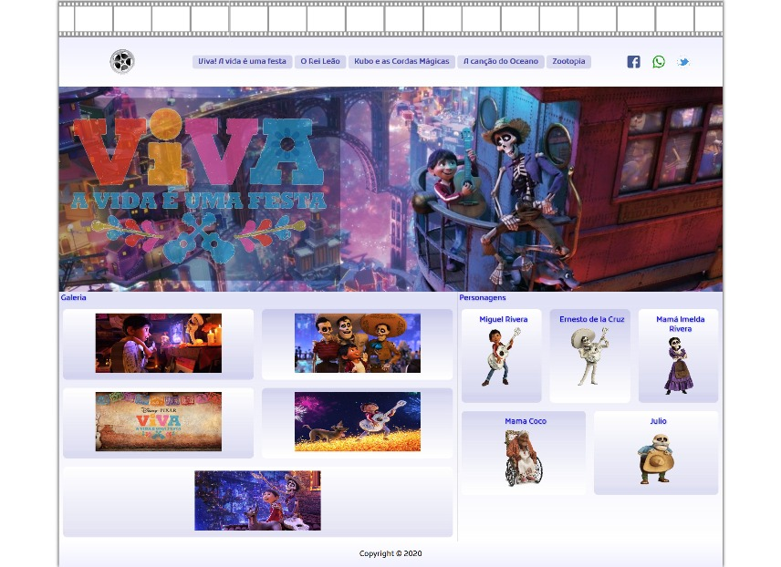
			   <figcaption>Com os valores e atributos mostrados, a página da Atividade 7 fica com este layout. Ajuste os valores, cores e margens para sua página. Coloque os nomes de outros 4 filmes nos itens do menu do site.</figcaption>
		   </li>
		</ul>
		
  

	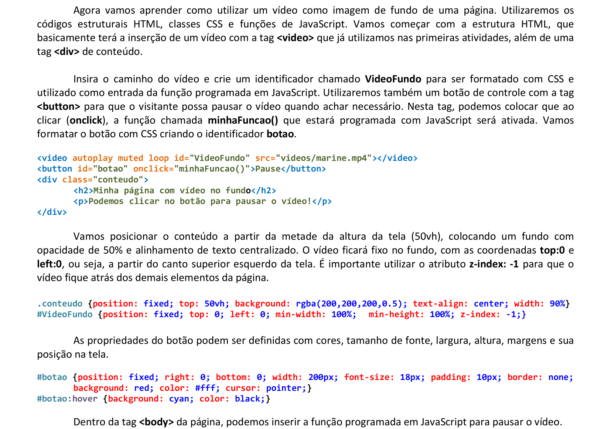
	

&#x1f4c3; Detalhes da estrutura em HTML

	
Esta página tem estrutura HTML parecida com a que montamos na página da Atividade 7. Crie uma pasta chamada <code>webdesign/atividade8</code> com a página inicial <code>index.htm</code>. Vamos precisar também da pasta <code>webdesign/atividade8/imagens</code>.

	  <ul class="slider">
		  <li>
			   <input type="radio" id="slide264" name="slide">
			   <label for="slide264"></label>
			   
			   <figcaption>A tag "mãe" do site será <code>class="boxSite"</code>, com a barra de menu <code>class="barra"</code>, onde colocaremos uma logo. Vamos fazer uma página de algum lugar com belas paisagens. Escolha um <a href="http://www.degraf.ufpr.br/docentes/paulo/webdesign/pictograph.html" target="_blank">pictograma</a> ou coloque uma imagem na tag <code>class="logo"</code>.</figcaption>
		   </li>
		   <li>
			   <input type="radio" id="slide265" name="slide">
			   <label for="slide265"></label>
			   
			   <figcaption>A estrutura de menu será a mesma que usamos na atividade anterior. Alguns atributos CSS ficarão diferentes, pois da tag <code>&lt;label&gt;</code> está englobando os itens do menu.</figcaption>
		   </li>
		   <li>
			   <input type="radio" id="slide266" name="slide">
			   <label for="slide266"></label>
			   
			   <figcaption>Depois da tag <code>class="barra"</code>, podemos inserir a <code>class="banner"</code>, que contém a <code>class="descrição"</code>. Neste caso, coloque um texto ou uma imagem para ser o título da página.</figcaption>
		   </li>
		   <li>
			   <input type="radio" id="slide267" name="slide">
			   <label for="slide267"></label>
			   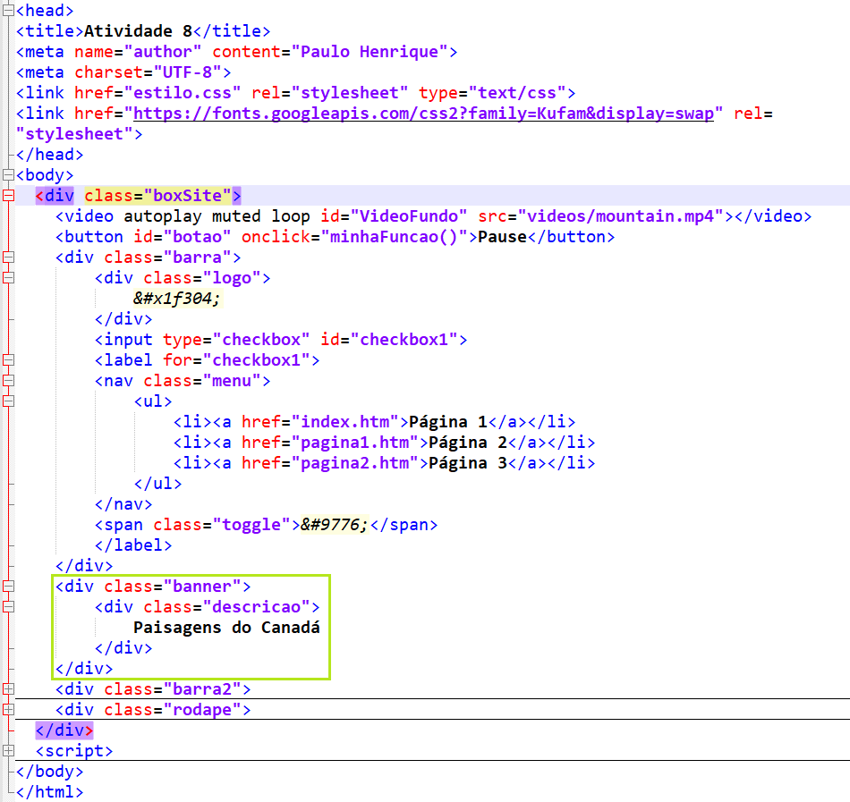
			   <figcaption>A barra <code>class="compartilhar"</code> fica logo abaixo da <code>class="banner"</code>. Insira links para os itens desta barra.</figcaption>
		   </li>
		   <li>
			   <input type="radio" id="slide268" name="slide">
			   <label for="slide268"></label>
			   
			   <figcaption>Depois da barra <code>class="compartilhar"</code>, podemos criar a barra de contéudo <code>class="barra2"</code>, como se fosse uma galeria de imagens das paisagens que vamos inserir.</figcaption>
		   </li>
		   <li>
			   <input type="radio" id="slide269" name="slide">
			   <label for="slide269"></label>
			   
			   <figcaption>Insira o texto sobre o local escolhido em uma <code>&lt;div&gt;</code>, pois vamos distribuir os conteúdos usando <code>display:flex;</code> no CSS.</figcaption>
		   </li>
		   <li>
			   <input type="radio" id="slide270" name="slide">
			   <label for="slide270"></label>
			   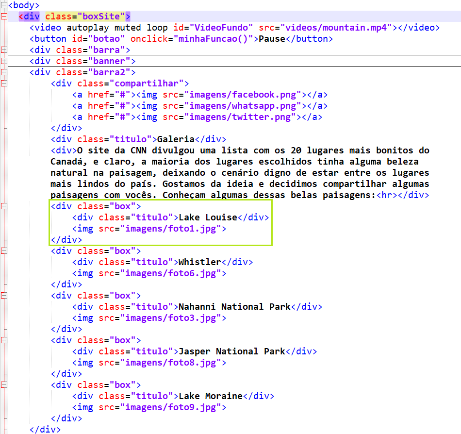
			   <figcaption>Crie títulos para cada imagem colocada em tag <code>class="box"</code>. Este título pode ficar antes ou depois da imagem.</figcaption>
		   </li>
		   <li>
			   <input type="radio" id="slide271" name="slide">
			   <label for="slide271"></label>
			   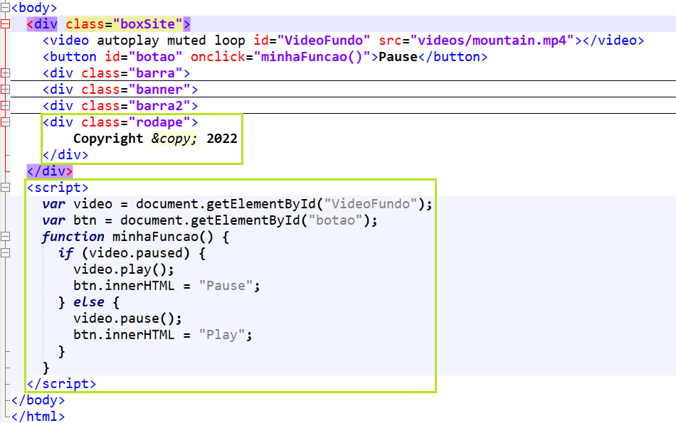
			   <figcaption>Por último, a tag mais simples de nossas páginas: o rodapé.</figcaption>
		   </li>
		</ul>
		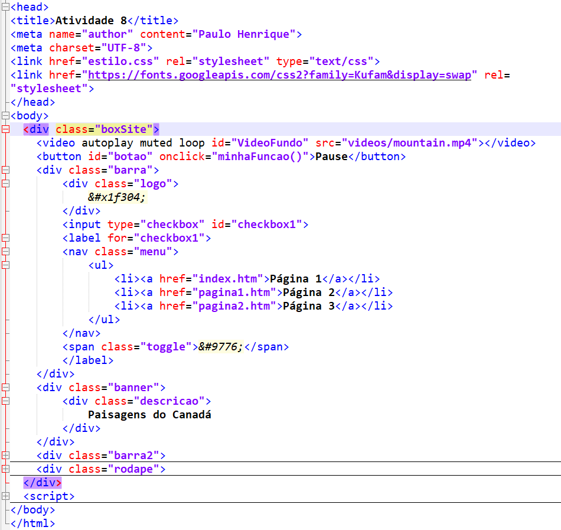
  

  

&#x1f4c3; Detalhes da estrutura em CSS

	
A estrutura CSS desta página fica um pouco mais simplificada em relação à Atividade 7. Crie o arquivo de folha de estilos na pasta <code>webdesign/atividade8</code> com nome <code>estilo.css</code>.

	  <ul class="slider">
		  <li>
			   <input type="radio" id="slide272" name="slide">
			   <label for="slide272"></label>
			   
			   <figcaption>Escolha a fonte do site <b>google fonts</b> e defina os elementos genéricos da página com o indicar <b>*</b>. Defina altura mínima do banner, posição, alinhamentos e efeitos com <code>hover</code>. Nesta página, vamos usar o atributo <code>overflow:auto;</code> que permite sobreposições de elementos.</figcaption>
		   </li>
		   <li>
			   <input type="radio" id="slide273" name="slide">
			   <label for="slide273"></label>
			   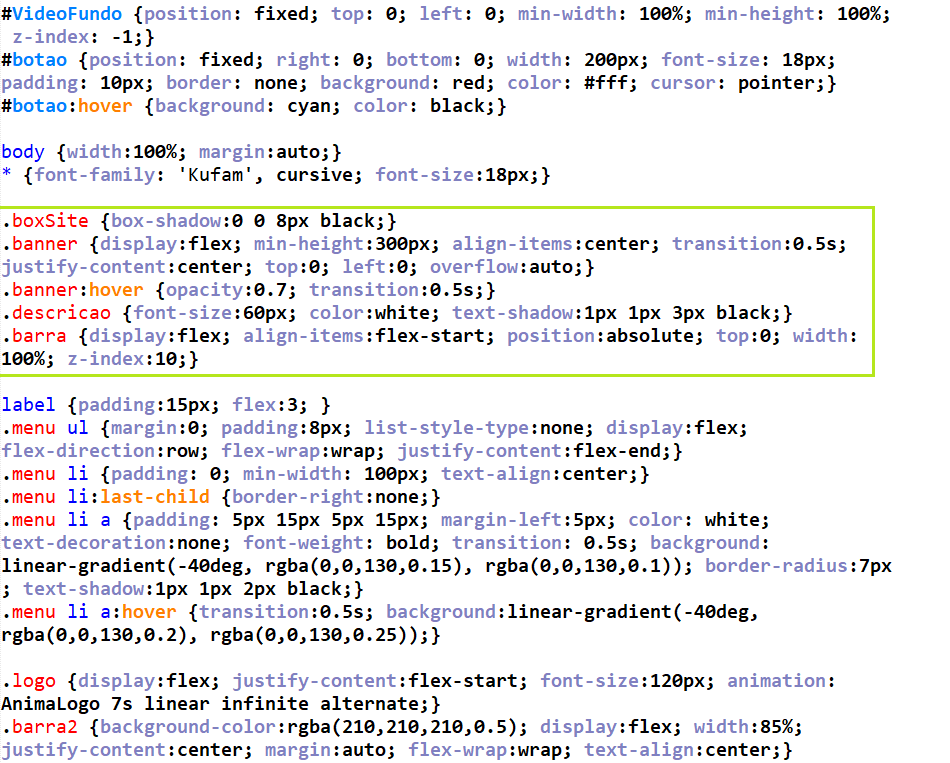
			   <figcaption>Defina um valor grande para o <code>z-index</code> para deixar a barra de menu sobre o banner. para deixá-la alinhada na vertical, usamos <code>align-items:flex-start;</code>. A tag <code>label</code> é "mãe" do menu. Logo, definimos margem e tamanho <code>flex:3;</code> nesta tag. Para deixar o menu alinhado à direita, basta usar <code>justify-content:flex-end;</code>.</figcaption>
		   </li>
		   <li>
			   <input type="radio" id="slide274" name="slide">
			   <label for="slide274"></label>
			   
			   <figcaption>Os itens do menu têm estrutura de programação CSS parecida com a que usamos na atividade 7. Escolha cores adequadas para ter um contraste com a imagem de fundo do banner. Neste caso, foi escolhida a cor branca com sombra de texto <code>text-shadow</code>.</figcaption>
		   </li>
		   <li>
			   <input type="radio" id="slide275" name="slide">
			   <label for="slide275"></label>
			   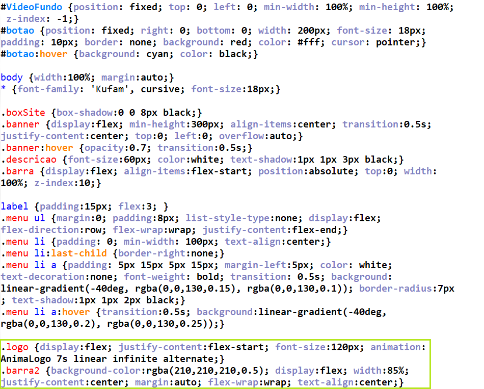
			   <figcaption>Para alinhar a <code>.logo</code> à esquerda usamos <code>justify-content:flex-start;</code>. Neste exemplo vamos utilizar um pictograma: logo, definimos <code>font-size</code> com tamanho maior do que o usual. A animação será a mesma da página da atividade anterior. A barra de compartilhamento pode ter os valores ajustados de acordo com as dimensões das imagens.</figcaption>
		   </li>
		   <li>
			   <input type="radio" id="slide276" name="slide">
			   <label for="slide276"></label>
			   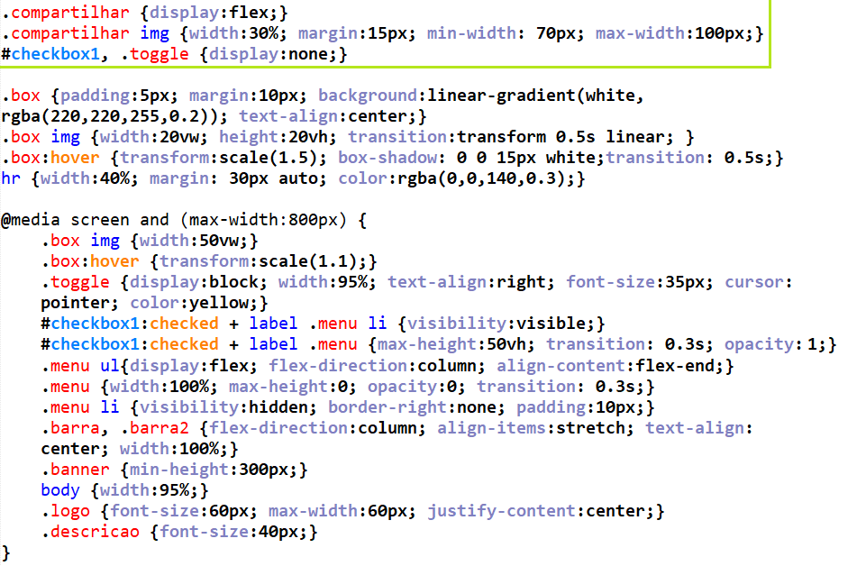
			   <figcaption>Ajuste os valores de todos os elementos programados para visualizar tanto em um navegador com mais e com menos de 800px de largura. A tag <code>.barra</code> tem o atributo <code>flex-direction:column;</code> em navegadores com larguras reduzidas.</figcaption>
		   </li>
		   <li>
			   <input type="radio" id="slide277" name="slide">
			   <label for="slide277"></label>
			   
			   <figcaption>Tanto o toggle quando o checkbox ficam invisíveis em telas maiores. Note que nas configurações de telas menores, estamos sem os subitens. Nesta página o menu é simplificado, com apenas itens principais.</figcaption>
		   </li>
		   <li>
			   <input type="radio" id="slide278" name="slide">
			   <label for="slide278"></label>
			   
			   <figcaption>Os atributos da <code>.barra2</code> e dos <code>.box</code> são similares aos que usamos na atividade anterior. Vamos usar a largura da barra menor, com 85%.</figcaption>
		   </li>
		   <li>
			   <input type="radio" id="slide279" name="slide">
			   <label for="slide279"></label>
			   
			   <figcaption>Atribua as propriedades para visualização dos títulos e do rodapé da página.</figcaption>
		   </li>
		   <li>
			   <input type="radio" id="slide280" name="slide">
			   <label for="slide280"></label>
			   
			   <figcaption>O efeito de transformação de imagens que usamos na atividade anterior pode ser usado nos <code>.box</code>. Assim, as imagens são ampliadas com os títulos, como se fossem legendas.</figcaption>
		   </li>
		   <li>
			   <input type="radio" id="slide281" name="slide">
			   <label for="slide281"></label>
			   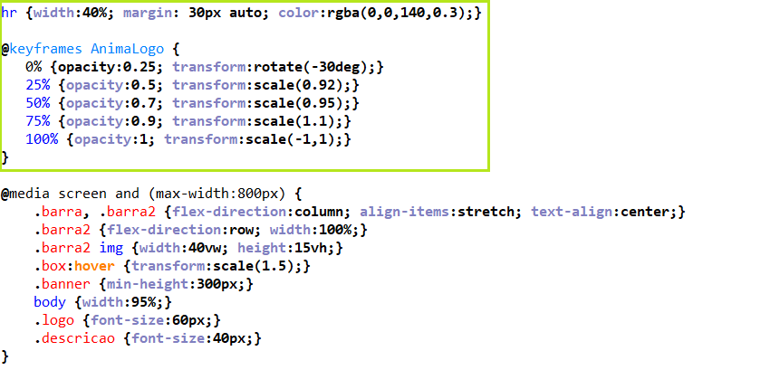
			   <figcaption>Defina as propriedades de animação da tag <code>.logo</code>. </figcaption>
		   </li>
		   <li>
			   <input type="radio" id="slide282" name="slide">
			   <label for="slide282"></label>
			   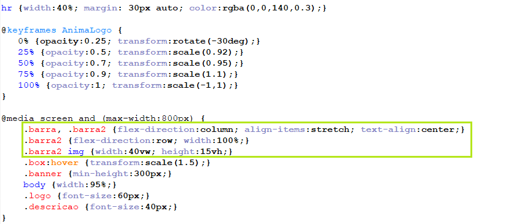
			   <figcaption>Defina os atributos de visualizações das barras e das imagens da <code>.barra2 img</code>. Ajuste as dimensões das imagens em navegador com largura menor do que 800px. A disposição de elementos destas barras deve ser modificada para vertical (coluna).</figcaption>
		   </li>
		   <li>
			   <input type="radio" id="slide283" name="slide">
			   <label for="slide283"></label>
			   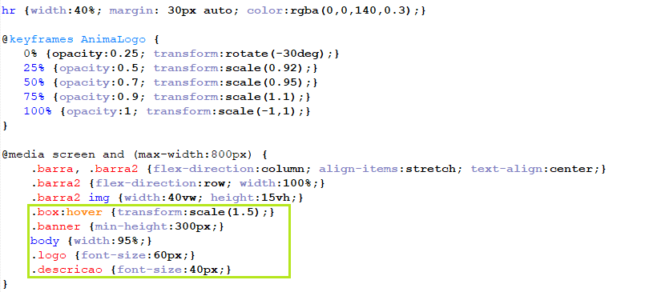
			   <figcaption>Ajuste também os efeitos de transformação e tamanhos de fontes das tags <code>.logo</code> e <code>.descricao</code>.</figcaption>
		   </li>
		   <li>
			   <input type="radio" id="slide284" name="slide">
			   <label for="slide284"></label>
			   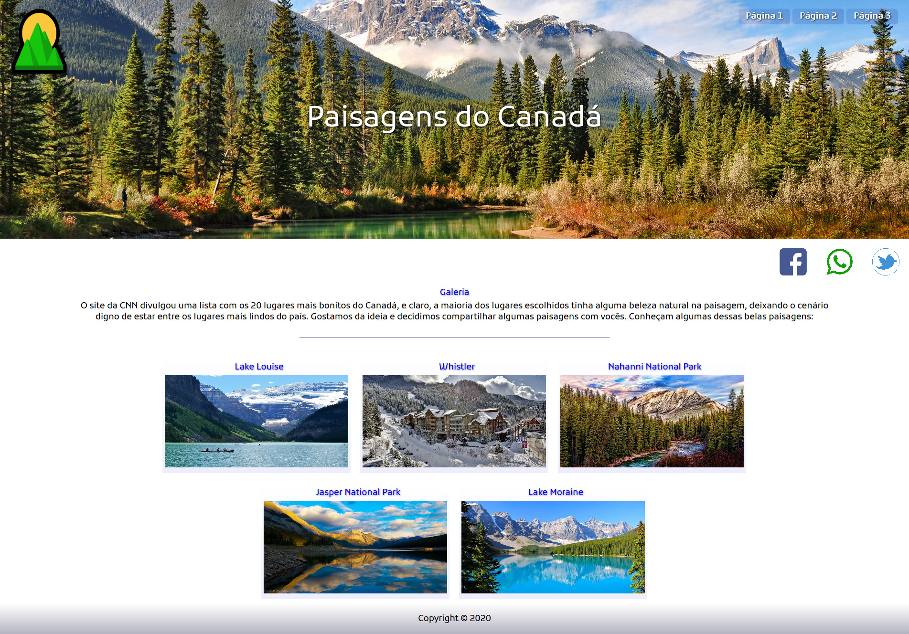
			   <figcaption>O layout da página fica desta maneira. Ajuste os valores e atributos para a finalização desta atividade. Coloque nomes nos títulos das 3 páginas para que apareçam no menu.</figcaption>
		   </li>
		</ul>
		
  

	
<a href="#css3" class="topo">voltar ao topo</a>

Galerias e Imagens Vetoriais

	
página 38...

 &#x1f4bb; &#x1f4c2;

<b>site desenvolvido por:</b>
 

Paulo Henrique Siqueira
  

<b>contato:</b> paulohscwb@gmail.com 
 

 <b>Referências:</b>

