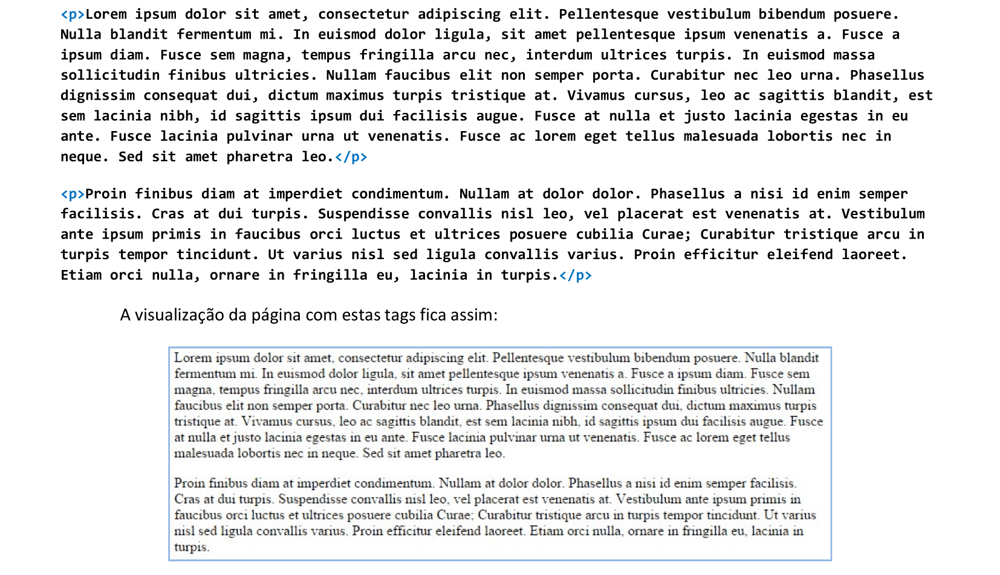
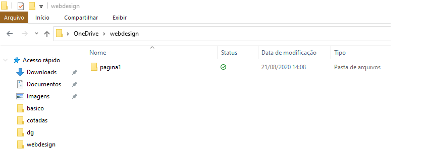
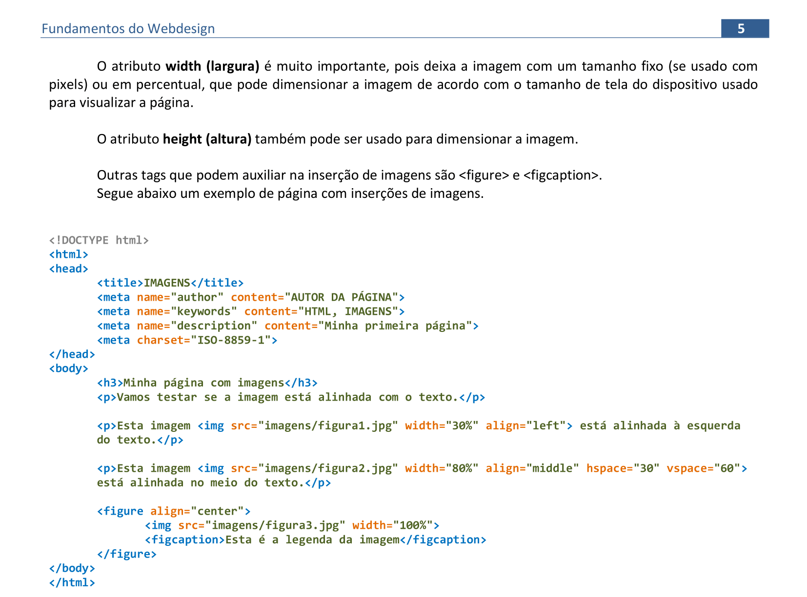

<head>
<link rel="stylesheet" href="scripts/style.css">
</head>

<h2 id="inicio">Construção de páginas com HTML</h2>

Este site contém os procedimentos para construirmos sites em HTML, foco da disciplina Fundamentos do Webdesign

A apostila está disponível no link: <a href="http://www.exatas.ufpr.br/portal/degraf_paulo/wp-content/uploads/sites/4/2014/09/tags001.pdf" target="_blank">apostila de Webdesign</a>

Os materiais usados estão indicados nos links dos tópicos das atividades.

  
Estruturas básicas: pág. 1-10

   
   

&#x1f4c3; Escolha de cores

	
Existem vários sites que mostram as escolhas de cores para usar em HTML. Vamos começar usando as cores com códigos HTML ou hexadecimais. Clique nos passos abaixo para ver como podemos escolher cores em 2 sites.

	  <ul class="slider">
		  <li>
			   <input type="radio" id="slide001" name="slide" checked>
			   <label for="slide001">1</label>
			   
			   <figcaption>Acessando o site http://html-color-codes.info/Codigos-de-Cores-HTML/, você pode clicar em cores pré-definidas pelo site. Note que o código hexadecimal aparece logo abaixo das cores.</figcaption>
		   </li>
		   <li>
			   <input type="radio" id="slide002" name="slide">
			   <label for="slide002">2</label>
			   
			   <figcaption>Logo abaixo, você encontra outra maneira de escolher cores neste mesmo site. Basta escolher o tom da cor e clicar sobre a cor escolhida.</figcaption>
		   </li>
		   <li>
			   <input type="radio" id="slide003" name="slide">
			   <label for="slide003">3</label>
			   
			   <figcaption>Acessando o site https://color.adobe.com/pt/create/color-wheel/, você pode escolher as cores de forma análoga. Note que aparecem os códigos hexadecimais e RGB logo abaixo do disco de cores.</figcaption>
		   </li>
		   <li>
			   <input type="radio" id="slide004" name="slide">
			   <label for="slide004">4</label>
			   
			   <figcaption>Outro site interessante é https://celke.com.br/artigo/tabela-de-cores-html-nome-hexadecimal-rgb, que além dos códigos RGB e hexadecimais mostra os nomes das cores usadas em HTML na primeira coluna da tabela.</figcaption>
		   </li>
		</ul>
		
  

  
   

&#x1f4c3; Texto para testar layouts

	
Muitas vezes, nosso foco é de testar somente o layout de um site. Podemos preenchê-lo com textos e listas usando o site mostrado nesta página. Clique nos passos abaixo para ver como produzir estes conteúdos.

	  <ul class="slider">
		  <li>
			   <input type="radio" id="slide005" name="slide" checked>
			   <label for="slide005">1</label>
			   
			   <figcaption>Acessando o site http://br.lipsum.com/, você pode criar blocos de textos ou listas, usados para testarmos layouts.</figcaption>
		   </li>
		   <li>
			   <input type="radio" id="slide006" name="slide">
			   <label for="slide006">2</label>
			   
			   <figcaption>Escolha a criação de 2 parágrafos para fazermos um teste. Copie e cole este texto produzido no programa Notepad (Bloco de Notas) do Windows.</figcaption>
		   </li>
		</ul>
		
  

  
<a href="#basico" class="topo">voltar ao topo</a>

  
  

&#x1f4c3; Texto para testar layouts

	
Vamos salvar nosso arquivo em uma pasta chamada webdesign.

	  <ul class="slider">
		  <li>
			   <input type="radio" id="slide007" name="slide" checked>
			   <label for="slide007">1</label>
			   
			   <figcaption>Escolha a opção do Bloco de Notas Salvar como. Salve o arquivo como pagina1.htm.</figcaption>
		   </li>
		   <li>
			   <input type="radio" id="slide008" name="slide">
			   <label for="slide008">2</label>
			   
			   <figcaption>É muito importante lembrar que a extensão do arquivo deve ser .htm ou .html. Abra o arquivo em um navegador de internet. Como não foram feitas as marcações dos parágrafos, vamos colocá-las no arquivo.</figcaption>
		   </li>
		   <li>
			   <input type="radio" id="slide009" name="slide">
			   <label for="slide009">3</label>
			   
			   <figcaption>Antes de cada parágrafo, devemos colocar a tag &lt;p&gt;. Logo após o parágrafo, colocamos a tag de fechamento de parágrafo &lt;/p&gt;. Faça isso nos 2 parágrafos e visualize a página em um navegador.</figcaption>
		   </li>
		</ul>
		
  

  
  
<a href="#basico" class="topo">voltar ao topo</a>

  
  

&#x1f4c3; Layout básico de uma página

	
O layout básico de uma página HTML tem as seguintes partes: cabeçalho (head) e corpo da página (body). Vamos ver os elementos de cada parte:

	  <ul class="slider">
		  <li>
			   <input type="radio" id="slide010" name="slide" checked>
			   <label for="slide010">1</label>
			   
			   <figcaption>O cabeçalho &lt;head&gt; contém informações autorais, título, codificação de caracteres, palavras-chave, scripts e referências externas. Nem todos os elementos desta tag são visíveis para os visitantes da página.</figcaption>
		   </li>
		   <li>
			   <input type="radio" id="slide011" name="slide">
			   <label for="slide011">2</label>
			   
			   <figcaption>Dentro da tag do corpo da página &lt;body&gt; devemos colocar todos os contéudos visíveis para os visitantes.</figcaption>
		   </li>
		</ul>
		
  

  
  

&#x1f4c3; Fundo da página, alinhamentos

	
Vamos deixar todos os arquivos desta disciplina organizados. Podemos criar uma pasta chamada pagina1 para colocar todos os arquivos desta primeira página. É importante deixar os arquivos sempre organizados em pastas para usarmos as referências corretas na hora de montar o site.

	  <ul class="slider">
		  <li>
			   <input type="radio" id="slide012" name="slide" checked>
			   <label for="slide012">1</label>
			   
			   <figcaption>Crie uma pasta dentro da pasta pagina1 para colocarmos as imagens. Podemos chamá-la de imagens.</figcaption>
		   </li>
		   <li>
			   <input type="radio" id="slide012a" name="slide">
			   <label for="slide012a">2</label>
			   
			   <figcaption>Podemos escolher uma imagem para colocar no fundo da página (background). Escolha uma com comprimento maior do que 1000px, para cobrir todo o fundo da página, e salve na pasta que criamos /imagens.</figcaption>
		   </li>
		   <li>
			   <input type="radio" id="slide013" name="slide">
			   <label for="slide013">3</label>
			   
			   <figcaption>Na tag do corpo da página, colocamos o caminho da imagem salva: &lt;body background="imagens/fundo.jpg"&gt;. Salve e veja a página renderizada em um navegador.</figcaption>
		   </li>
		   <li>
			   <input type="radio" id="slide014a" name="slide">
			   <label for="slide014a">4</label>
			   
			   <figcaption>Os alinhamentos dos parágrafos podem ser definidos dentro de cada tag. Por exemplo, se você quiser deixar o primeiro parágrafo justificado, basta usar a tag &lt;p align="justify"&gt;.</figcaption>
		   </li>
		   <li>
			   <input type="radio" id="slide014" name="slide">
			   <label for="slide014">5</label>
			   
			   <figcaption>Para destacar partes do texto, podemos mudar cores e tamanhos. Neste exemplo, dois trechos estão destacados com cores diferentes usando a tag &lt;font&gt;. Dentro desta tag, você muda cor, tamanho e família da fonte (face). Note que ela precisa de fechamento para o fim do destaque: &lt;/font&gt;</figcaption>
		   </li>
		   <li>
			   <input type="radio" id="slide015" name="slide">
			   <label for="slide015">6</label>
			   
			   <figcaption>Se você quiser que a página toda tenha uma configuração específica de fonte, basta abrir a tag no começo do corpo da página, e fechá-la antes do fechamento da tag &lt;/body&gt;. No exemplo, foi colocada a fonte <b>Verdana</b> na página toda.</figcaption>
		   </li>
		</ul>
		
  

  
  
  
<a href="#basico" class="topo">voltar ao topo</a>

  
  
<a href="#basico" class="topo">voltar ao topo</a>

  
  
<a href="#basico" class="topo">voltar ao topo</a>

  
  
<a href="#basico" class="topo">voltar ao topo</a>

  
  
<a href="#basico" class="topo">voltar ao topo</a>

  
  
<a href="#basico" class="topo">voltar ao topo</a>

  
  
<a href="#basico" class="topo">voltar ao topo</a>

  
  
<a href="#basico" class="topo">voltar ao topo</a>

CSS: Cascading Style Sheets

	
página 11...

 &#x1f4bb; &#x1f4c2;

<b>site desenvolvido por:</b>
 

Paulo Henrique Siqueira
  

<b>contato:</b> paulohscwb@gmail.com 
 

 <b>Referências:</b>

